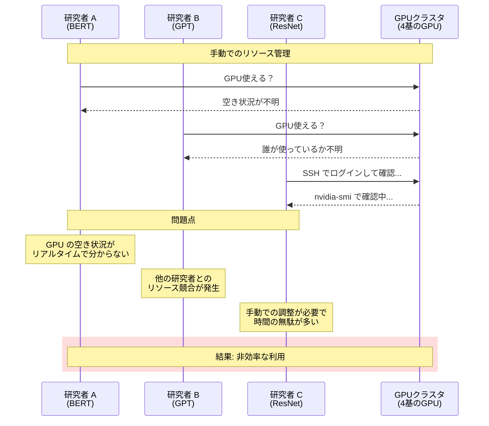
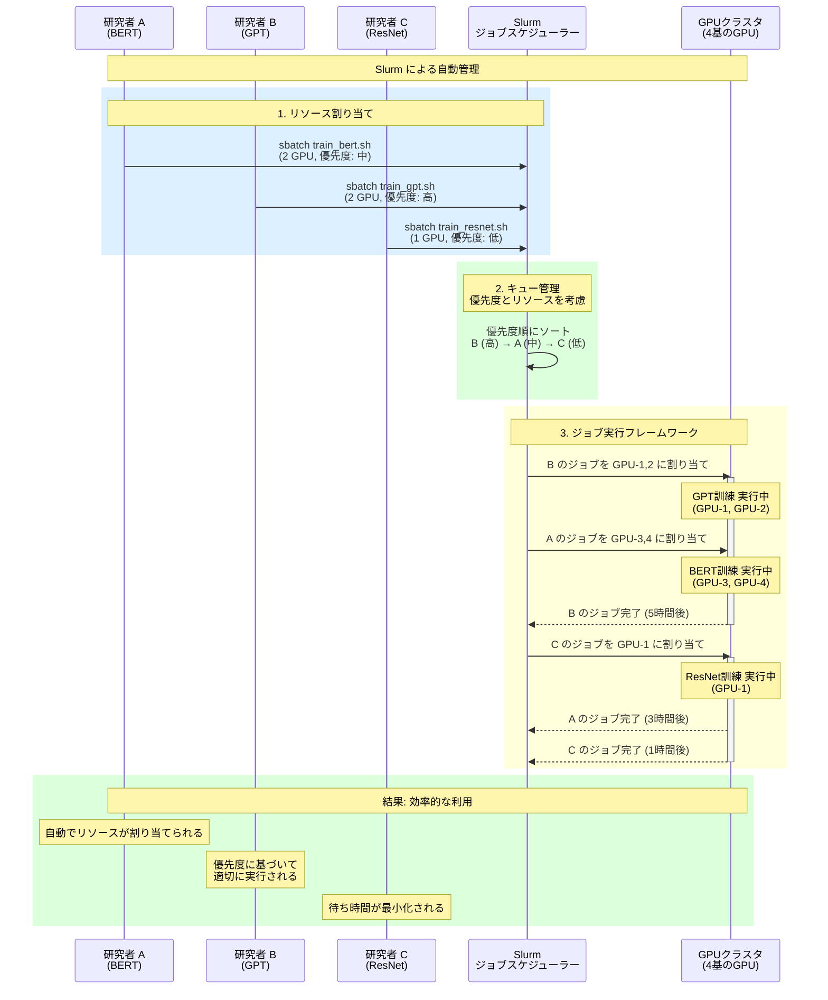
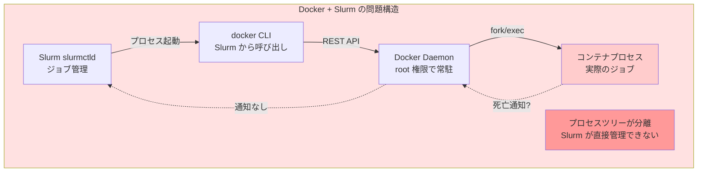
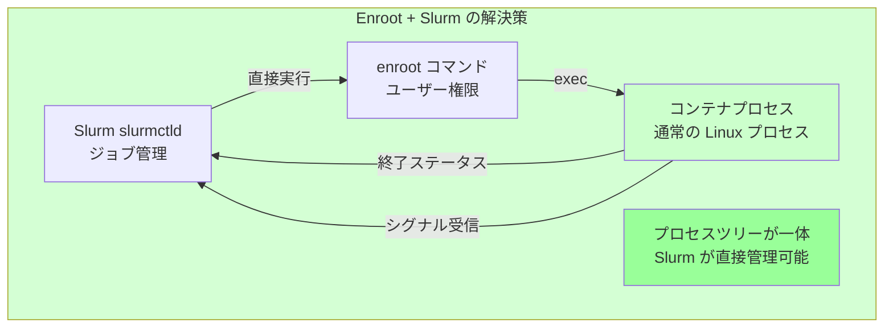
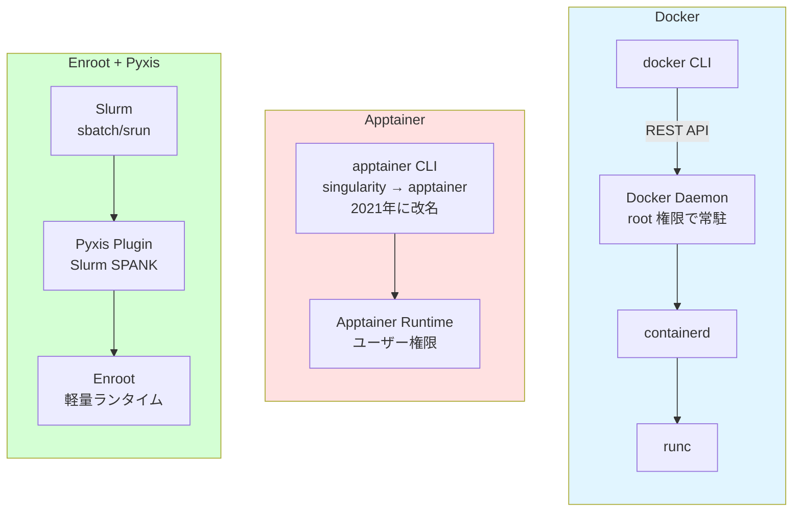
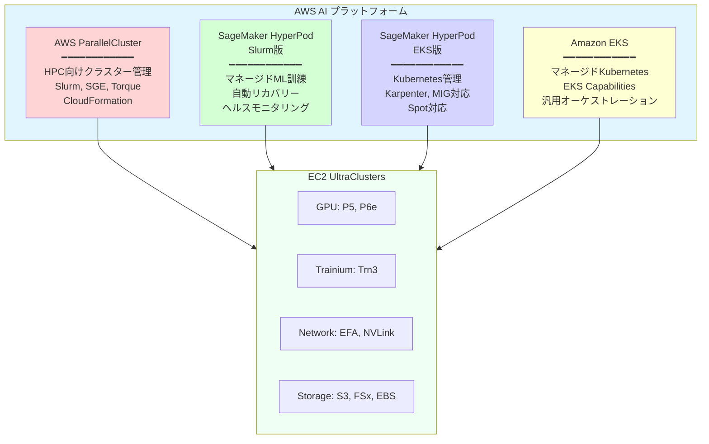
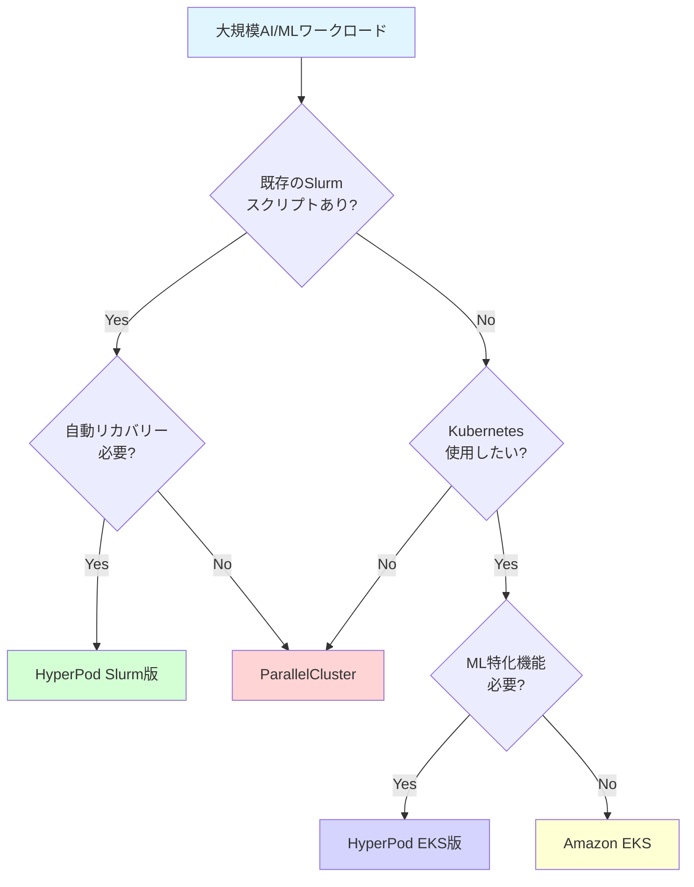

::::details 前提
:::message
**対象読者**: 大規模基盤モデルがどういうものかを理解している方、これからモデル学習を行う方
:::
:::message
**ライセンス**: © 2025 littlemex.
本文および自作図表: CC BY 4.0
※公式ドキュメントからの引用や翻訳部分は原典の著作権に従います。
引用画像: 各画像の出典に記載されたライセンスに従います。
:::
:::message
一部 AI を用いて文章を作成します。レビューは実施しますが、見逃せない重大な間違いなどがあれば[こちらのIssue](https://github.com/littlemex/samples/issues)から連絡をお願いします。
:::
::::

**本章では大規模基盤モデル学習に求められるオーケストレーションについて整理します。**

---

AWS Principle WW Solutions Architect,GenAI, Keita Watanabe さんの [Scalable Infrastructure for Large-Scale AI Training with AWS Sagemaker Hyperpod](https://speakerdeck.com/keitaw/scalable-infrastructure-for-large-scale-ai-training-with-aws-sagemaker-hyperpod-at-singapore-ai-hour) 資料の流れを参照しながら初学者向けに情報を整理します。

# オーケストレーション

:::message
***Point! 分散学習のためのインフラストラクチャをオーケストレーションする主要なツールは Slurm と kubernetes***
:::

## Slurm

[Slurm](https://slurm.schedmd.com/overview.html) は、オープンソースのジョブスケジューラー兼リソースマネージャーです。[Wikipedia](https://ja.wikipedia.org/wiki/Slurm_Workload_Manager) によると Slurmは、TOP500 の約 60% のスーパーコンピューターでワークロードマネージャーとして使用されています。

### Slurm の 3 つの主要機能

Slurm は以下の 3 つの主要機能を提供します。

**1. リソース割り当て**: 計算ノードに対する排他的または非排他的なアクセスを一定期間ユーザーに割り当て、ジョブの実行を可能にします。複数のジョブが同一リソースを要求した場合、Slurm が調停し、適切なタイミングでリソースを割り当てます。

**2. ジョブ実行フレームワーク**: 割り当てられたノード上でジョブを開始、実行、監視するためのフレームワークを提供します。並列ジョブの起動、プロセス間通信の設定、ジョブのステータス監視などを一元的に管理します。

**3. キュー管理**: 保留中のジョブをキューで管理し、リソースの競合を調停します。ジョブの優先度、ユーザーのクォータ、リソースの制約などに基づいて、実行順序を決定します。

これらの機能により、Slurm は数百から数万の GPU を含む大規模クラスタでも効率的にリソースを管理できます。

::::details Slurm の価値を具体例で確認！
## モデル学習における Slurm の実例

Slurm のメリットを理解するために、具体的にモデル学習のシナリオを見てみましょう。

**シナリオ**: 3 人の研究者が同じ GPU クラスタ（4 基の GPU）を使って、異なる機械学習モデルを学習したいと考えています。

- 研究者 A: BERT モデル（2 GPU 必要、所要時間 3 時間、優先度: 中）
- 研究者 B: GPT モデル（2 GPU 必要、所要時間 5 時間、優先度: 高）
- 研究者 C: ResNet モデル（1 GPU 必要、所要時間 1 時間、優先度: 低）

### Slurm なしの場合



この方式では、研究者が各自で GPU の空き状況を確認し、手動でジョブを開始する必要があります。これにより以下の問題が発生します。

- リソースの可視性が低く、空き GPU を見つけるのに時間がかかる
- 複数の研究者が同時に同じ GPU を使おうとして競合が発生する可能性がある
- 優先度の概念がなく、重要なジョブが待たされることがある
- GPU の利用率が低下し、アイドル時間が増える

### Slurm ありの場合



Slurm を使用することで、以下のメリットが得られます。

**リソース割り当ての自動化**: 研究者は `sbatch` コマンドでジョブを投入するだけで、Slurm が自動的に利用可能な GPU を割り当てます。手動での空き確認は不要です。

**優先度ベースのスケジューリング**: ジョブの優先度に基づいて実行順序が決定されます。この例では、優先度が高い研究者 B の GPT 訓練が最初に実行され、次に研究者 A の BERT 訓練が並行して実行されます。研究者 C の ResNet 訓練は優先度が低いため、リソースが空くまで待機します。

**並列実行の最適化**: Slurm は利用可能なリソースを最大限に活用します。この例では、4 基の GPU すべてを同時に使用し（研究者 B が 2 GPU、研究者 A が 2 GPU）、リソースのアイドル時間を最小化します。

**ジョブの自動管理**: ジョブの開始、実行、完了を Slurm が自動的に管理します。研究者 B のジョブが完了すると、待機中の研究者 C のジョブが自動的に開始されます。

**公平性の保証**: キュー管理により、すべての研究者が適切にリソースにアクセスできます。優先度、ユーザーのクォータ、過去の利用履歴などを考慮した公平な割り当てが可能です。

このように、
:::message
Slurm は大規模な GPU クラスタでも複数のユーザーが効率的にリソースを共有できる環境を提供します。手動でのリソース管理と比較して、管理の手間を大幅に削減し、GPU の利用率を向上させることができます。
:::
::::

### Slurm のアーキテクチャ


> https://slurm.schedmd.com/overview.html より引用

Slurm は中央集権型のアーキテクチャを採用しており、上図のコンポーネントで構成されます。

::::details 各コンポーネントについて

**slurmctld (中央マネージャー)**: クラスタ全体のリソースとジョブを監視する中央デーモンです。ジョブのスケジューリング、ノードの状態管理、リソース割り当ての決定などを担当します。高可用性のために、バックアップマネージャーを配置することも可能です。

**slurmd (計算ノードデーモン)**: 各計算ノードで実行されるデーモンで、リモートシェルのように動作します。ジョブの受信、実行、ステータス報告、次のジョブの待機というサイクルを繰り返します。slurmd 間は耐障害性のある階層的な通信を行います。

**slurmdbd (データベースデーモン)**: オプションのコンポーネントで、複数の Slurm クラスタのアカウンティング情報を単一のデータベースに記録します。ジョブの実行履歴、リソース使用量、課金情報などを一元管理できます。

**slurmrestd (REST API デーモン)**: オプションのコンポーネントで、REST API を通じて Slurm と対話できます。外部システムとの統合や、カスタムダッシュボードの構築に利用されます。

::::

::::details Slurm のユーザーツールとプラグインシステム

### ユーザーツール

Slurm は豊富なコマンドラインツールを提供しています。

**srun**: ジョブを投入し、実行します。並列ジョブの起動、MPI プログラムの実行、インタラクティブなシェルセッションの開始などに使用されます。

**scancel**: キューイング中または実行中のジョブを終了します。ジョブ ID や ユーザー名を指定して、特定のジョブをキャンセルできます。

**sinfo**: クラスタ全体のシステム状態を報告します。ノードの可用性、パーティションの状態、リソースの使用状況などを確認できます。

**squeue**: ジョブの状態を報告します。実行中のジョブ、キューイング中のジョブ、優先度などの情報を表示します。

**sacct**: 実行中または完了したジョブのアカウンティング情報を取得します。ジョブの実行時間、使用リソース、終了ステータスなどを確認できます。

**scontrol**: 管理者向けのツールで、クラスタの設定や状態を監視・変更します。ノードのドレイン、ジョブの優先度変更、パーティションの設定などが可能です。

**sview**: グラフィカルにシステムとジョブの状態を表示します。ネットワークトポロジーの可視化にも対応しています。

### プラグインシステム

Slurm は汎用的なプラグインメカニズムを提供しており、さまざまなインフラストラクチャに対応できます。主要なプラグインには以下があります。

**Accounting Storage**: ジョブの履歴データを保存します。SlurmDBD と組み合わせることで、リミットベースのシステムや履歴的なシステムステータスを提供できます。

**Authentication**: Slurm の各コンポーネント間の認証メカニズムを提供します。

**Generic Resources**: GPU などの汎用リソースを制御するインターフェースを提供します。

**Job Submit**: ジョブ投入時にサイト固有の要件を適用するカスタムプラグインです。

**MPI**: さまざまな MPI 実装に対応するフックを提供します。MPI 固有の環境変数の設定などが可能です。

**Priority**: ジョブの優先度を決定します。エージング、フェアシェア、QoS などの要素を組み合わせた多要素優先度アルゴリズムをサポートします。

**Scheduler**: ジョブのスケジューリング方法を決定します。バックフィルスケジューリング、ギャングスケジューリングなどが利用可能です。

**Network Topology**: ネットワークトポロジーに基づいてリソース選択を最適化します。ジョブ割り当てと高度な予約の両方に使用されます。

### Slurm の設定例

以下は Slurm の設定ファイル (`/etc/slurm.conf`) の抜粋例です。

```bash
# 中央マネージャーの設定
SlurmctldHost=linux0001  # プライマリサーバー
SlurmctldHost=linux0002  # バックアップサーバー

# 認証とプラグイン
AuthType=auth/munge
PluginDir=/usr/local/slurm/lib

# ノード設定
NodeName=DEFAULT CPUs=4 TmpDisk=16384 State=IDLE
NodeName=lx[0001-0002] State=DRAINED
NodeName=lx[0003-8000] RealMemory=2048 Weight=2
NodeName=lx[8001-9999] RealMemory=4096 Weight=6 Feature=video

# パーティション設定
PartitionName=DEFAULT MaxTime=30 MaxNodes=2
PartitionName=debug Nodes=lx[0003-0030] State=UP Default=YES
PartitionName=batch Nodes=lx[0041-9999] MaxTime=UNLIMITED MaxNodes=4096
```

この設定では、ノードをグループ化してパーティション (ジョブキュー) を定義しています。各パーティションには、ジョブの最大実行時間、最大ノード数、アクセス権限などの制約を設定できます。
::::

分散学習においては、Slurm は前章でモデル学習の並列処理手法を適用したジョブを効率的にスケジューリングし、GPU リソースを最大限に活用します。Slurm のジョブスクリプトでは、必要な GPU 数、ノード数、実行時間などを指定し、Slurm がリソースが利用可能になった時点でジョブを実行します。Slurm と並列処理手法の連携方法については別途並列処理手法の章で解説します。

## Kubernetes

Kubernetes は、ご存知の方も多いかと思いますが、コンテナ化されたアプリケーションのデプロイ、スケーリング、管理を自動化するオープンソースのコンテナオーケストレーションプラットフォームです。ここでは特に細かく説明しませんが、コンテナベースであること、宣言的な設定が可能であること、コンテナ障害検知・再スケジューリングのセルフヒーリング（k8s コアコンセプトの Reconciliation Loop による宣言的設定へのリソースの追従性）、などが特徴的です。

## Slurm と Kubernetes の使い分け

:::message
Point! どちらかに優劣があるものではなくユースケースで選択
:::

それぞれの違いについて考察してみます。Slurm は HPC で十分な実績を持つバッチ処理システムであり、決定論的なスケジューリングとオーバーヘッドの低い学習処理を実行します。一方で Kubernetes はクラウドネイティブな動的オーケストレーターであり、そもそもは密結合ワークロードのバッチ処理を意識した存在ではありません。一方でクラウドネイティブかつオープンなスタンスから Kubernetes は AI/ML のプラットフォーム周りのエコシステムとの親和性が高いです。

Google の 130,000 ノードクラスターの[実験成功ブログ](https://cloud.google.com/blog/products/containers-kubernetes/how-we-built-a-130000-node-gke-cluster/?hl=en)、Slurm の TOP 500 での採用から考えるとクラスターのノード規模はほとんどのケースで考慮する必要がない程度には十分なサイズまで拡張が可能でしょう。オーケストレーターの仕様上は上限がない場合でも、それをマネージドとして提供する Amazon EKS、AWS ParallelCluster、Amazon SageMaker HyperPod などのクォータ制限は別で存在するため、自分たちの実現したいクラスター規模を満たせるのか、インフラストラクチャの構成やトポロジーはどのようなものに対応・最適化しているのか、などの考慮が必要でしょう。Amazon EKS は [AWS ブログ](https://aws.amazon.com/jp/blogs/news/under-the-hood-amazon-eks-ultra-scale-clusters/)で最大 10 万ノードまで対応していると言及されています。

いくつかのユースケースで使い分けを考えてみましょう。

::::details 使い分けの検討
:::message alert
個人的な勝手な考えなのであくまで参考程度で読んでください。
:::
:::message
**考慮ポイント**
- [ ] **Point 1**: 分散学習・推論、どちらのワークロードを対象とするのかを考慮
- [ ] **Point 2**: Kubernetes のキャッチアップコストを考慮
- [ ] **Point 3**: インフラストラクチャがオンプレかクラウド利用か
- [ ] **Point 4**: コンテナ統合
:::

大規模基盤モデルの学習のためだけに利用するのであれば、第一の選択肢は Slurm だと思います。比較的キャッチアップコストが低く構築も容易であることから導入・運用・キャッチアップコストが低く、決定論的なスケジューリングと密結合ワークロードでの実績があり、デフォルト状態で十分に学習のための管理機能が揃っています。特にオンプレミスの場合は GPU サーバー台数が固定であり、Kubernetes の強みとする動的ノード追加や多様なインスタンスを使い分けるといったニーズは少ないため、Kubernetes を使う強い意義はあまりないように感じます。ただし、予備学習や動作確認、軽量な GPU 処理が必要な場合には開発環境として研究者ごとにある程度 GPU 数がスケールする環境を与えたいケースがあります。このようなケースにおいてはクラスターのノードサイズが可変の方が嬉しいケースもあり、Kubernetes の動的ノード追加や GPU Time-Slicing/MIG などの GPU の柔軟な共有が簡易に適用できることは魅力的かもしれません。

大規模基盤モデルの推論のために利用する、もしくは、学習と推論を同一の環境でユーザーに提供するような場合はどうでしょうか。推論の場合は、多様なモデルをサービングする可能性があり、必要とされる GPU サーバーの種類、Spot/Ondemand などの購入タイプの違い、リクエスト不可に応じたオートスケーリング、コンテナ利用、などを考慮すると Kubernetes 一択です。クラウドの場合は、Amazon SageMaker AI の推論エンドポイントなども選択肢に入ってきます。例えば、夜間は学習バッチを回し、昼間の営業時間のみ推論が必要、といったワークロードであれば Kubernetes を利用してリソースアロケーションを夜間と昼間で柔軟に変更するような使い方をすることができ、このようなケースでは Kubernetes も選択肢になるでしょう。

:::message alert
コンテナをどうしても利用したい場合、Kubernetes は当然問題なく利用できますが、Slurm については注意が必要なため後述します。
:::
::::

:::message alert
Docker と Slurm は相性が悪い
:::

ということを Slurm 選定時には配慮する必要があります。

::::details 重要: Docker と Slurm のプロセス制御問題
## 問題の本質

:::message alert
Slurm は Docker daemon が異常終了しても検知できず、コンテナを正常に終了できない。
:::



### 問題ポイント

1. **プロセスツリーの分離**
   - Slurm は `docker run` コマンドを実行
   - 実際のコンテナは Docker daemon の子プロセスで Slurm のプロセスツリーに含まれない

2. **状態通知の欠如**
   - コンテナがクラッシュしても Slurm に直接通知されない
   - Docker daemon が異常終了しても検知困難

3. **ゾンビプロセスのリスク**
   - Slurm がジョブを kill しても、Docker daemon が生きていればコンテナは残る

## Slurm OCI サポートの制限

Slurm 公式ドキュメントから、この問題への対処法が明記されています。1. create/start: Slurm がコンテナの状態を常時ポーリングで確認、2. run: コンテナプロセスが直接 Slurm の子プロセスになる、の二種類の解決策があり、run 方式が推奨される。ポーリングの場合、ジョブ内で CPU リソースを消費し、ポーリング頻度によってコンテナ終了検知が遅れる可能性がある。

## Enroot による根本的解決



### Enroot の設計原則

:::message
**[公式ドキュメント](https://instinct.docs.amd.com/projects/container-toolkit/en/release-1.1.x/container-runtime/enroot-pyxis-installation.html)からの重要な記述**:
> "With Enroot, users can convert Docker images into a simple **unpacked filesystem tree** and run containers **as a regular Linux process**."
:::

つまり、
- **デーモンレス**: 常駐プロセス不要
- **直接実行**: Slurm が fork/exec で直接起動
- **通常のプロセス**: 特殊な仮想化なし

まとめると、

| 項目 | Docker + Slurm | Enroot + Slurm |
|------|---------------|----------------|
| **プロセス制御** | 間接的（daemon 経由） | 直接的（親子関係） |
| **終了検知** | ポーリング必要 | 即座に検知 |
| **シグナル伝播** | 複雑 | 直接伝播 |
| **ゾンビ化リスク** | 高い | 低い |
| **リソースリーク** | 発生しやすい | 発生しにくい |
| **root 権限** | 必要（daemon） | 不要 |

:::message
**[公式ドキュメント](https://github.com/NVIDIA/enroot)の記述**
> "Little to no isolation (__no performance overhead__, simplifies HPC deployments)"

さらに、性能オーバーヘッドはほぼゼロと NVIDIA から発表されています。
:::

## Pyxis の役割

Pyxis は Slurm SPANK プラグインとして、Enroot を Slurm に統合します。

**重要な機能**:
1. **排他的 GPU 割り当て**: 各ジョブに専用の GPU デバイスファイルを付与
2. **自動クリーンアップ**: ジョブ終了時に確実にリソースを解放
3. **プロセスツリー管理**: Slurm のジョブ制御に完全統合

---

## 実践的な影響

### Docker を使った場合の実際の問題例

```bash
# ユーザーがジョブを投入
$ sbatch --container-image=myimage:latest myjob.sh

# バックグラウンドで...
# 1. Slurm が docker run を実行
# 2. Docker daemon がコンテナを起動
# 3. コンテナがクラッシュ
# 4. Docker daemon は動作中
# 5. Slurm はジョブが「実行中」と認識し続ける
# 6. リソースがリークし、ゾンビジョブ化
```

### Enroot を使った場合の正常動作

```bash
# ユーザーがジョブを投入
$ sbatch --container-image=myimage.sqsh myjob.sh

# バックグラウンドで...
# 1. Pyxis が Enroot を呼び出し
# 2. Enroot がコンテナを直接起動（Slurm の子プロセス）
# 3. コンテナがクラッシュ
# 4. 終了シグナルが即座に Slurm に伝播
# 5. Slurm がジョブを「失敗」として記録
# 6. リソースが確実に解放される
```

---

## まとめ

ご指摘の通り、**Docker のデーモンアーキテクチャは Slurm のジョブ制御と根本的に相性が悪い**です。Enroot はこの問題を以下の方法で解決しています。

1. **デーモンレス設計**: プロセスツリーの一体化
2. **直接実行**: Slurm が親プロセスとして管理
3. **シグナル伝播**: 終了・異常を即座に検知
4. **確実なクリーンアップ**: ゾンビ化・リーク防止

この技術的優位性が、**HPC 環境で Enroot + Pyxis が Docker より推奨される最大の理由**です。
::::

::::details Slurm における推奨コンテナ技術

Slurm を用いた大規模学習でコンテナを利用したい場合、

:::message alert
**Docker ではなく** Pyxis/Enroot もしくは Apptainer でコンテナ利用できます。
:::

## 技術的な違いの詳細



*図: 各コンテナ技術のアーキテクチャ比較*


## 詳細比較表

| 特性 | Docker | Apptainer | Enroot | Enroot + Pyxis |
|------|--------|----------------------|--------|----------------|
| **デーモンプロセス** | 必要 | 不要 | 不要 | 不要 |
| **root 権限** | 必要（rootless 可） | 不要 | 不要 | 不要 |
| **Slurm 統合** | 複雑 | 可能 | 手動 | ネイティブ |
| **GPU 分離** | 手動設定 | 手動設定 | 自動 | 自動（排他的） |
| **イメージ形式** | Docker | SIF（独自）+ Docker 互換 | Squashfs | Squashfs |
| **ストレージ形式** | レイヤー型 | 単一ファイル | 展開型ファイルツリー | 展開型ファイルツリー |
| **マルチノード MPI** | 複雑 | 対応 | 対応 | ネイティブ対応 |
| **開発元** | Docker, Inc. | Linux Foundation | NVIDIA | NVIDIA |
| **主な用途** | 汎用 | HPC | HPC/AI | HPC/AI on Slurm |


### GPU 分離の違い

**Docker**
- GPU アクセスは `--gpus` フラグで制御
- 複数ジョブが同じ GPU にアクセス可能（手動管理必要）

**Singularity**
- `--nv` フラグで NVIDIA GPU サポート
- GPU 分離は手動設定が必要

**Enroot + Pyxis**
- 各ジョブに排他的な GPU デバイスファイルを自動割り当て
- 他のジョブが誤って同じ GPU にアクセスすることを防止
- Slurm の GRES（Generic Resource Scheduling）と完全統合

### 性能オーバーヘッド

**Docker の問題点**
- デーモンプロセスが常駐（メモリ消費）
- ストレージドライバーのレイヤー処理（I/O オーバーヘッド）
- ネットワーク仮想化（レイテンシ増加）

**Enroot の最適化**
- Docker イメージを展開型ファイルシステムに変換
- デーモンレス（プロセスとして直接実行）
- ホストネットワークを直接使用

**実測データ**
- Enroot: ネイティブ実行とほぼ同等（オーバーヘッド < 1%）
- Singularity: 軽微なオーバーヘッド（1-3%）
- Docker: 中程度のオーバーヘッド（5-10%）

---

## 使い分けガイド

### Docker を選ぶべき場合
- Kubernetes 環境
- 開発・テスト環境
- マイクロサービスアーキテクチャ
- CI/CD パイプライン

### Singularity/Apptainer を選ぶべき場合
- 既存の HPC クラスター（Slurm 以外も含む）
- セキュリティ要件が厳しい環境
- 大学・研究機関（広く採用されている）
- Docker からの移行が容易

### Enroot + Pyxis を選ぶべき場合
- Slurm 環境での本番運用
- GPU ワークロードの大規模実行
- 最小オーバーヘッドが必要
- マルチノード MPI ジョブ
- **AWS ParallelCluster や SageMaker HyperPod (Slurm)**

---

## AWS での実装

**AWS ParallelCluster**
- Enroot + Pyxis のインストールをサポート
- カスタム AMI または PostInstall スクリプトで設定

**Amazon SageMaker HyperPod (Slurm)**
- Enroot + Pyxis が推奨されるコンテナ技術
- GPU 分離と Slurm 統合が自動設定


::::

### 分散学習における Kubernetes の利点

**スケジューリングの柔軟性**: Node Selector, Node Affinity, Taints and Tolerations などの機能により、GPU の種類やノードの特性に基づいて Pod を適切なノードに配置できます。

**ジョブリソースの管理**: Kubernetes の Job および CronJob リソースにより、バッチ処理やスケジュールされたタスクを管理できます。分散学習では、Kubeflow Training Operator や PyTorch Elastic などのオペレーターが、Kubernetes のネイティブリソースとして学習ジョブを管理します。

Kubernetes 自体は汎用的なコンテナオーケストレーターであり、ML 固有の機能は限定的です。しかし、Kubeflow, Ray, MLflow などの ML プラットフォームと組み合わせることで、モデル学習からデプロイまでの一貫したワークフローを構築できます。AWS では、Amazon EKS (Elastic Kubernetes Service) および Amazon SageMaker HyperPod (EKS 版) が、Kubernetes ベースの分散学習環境を提供します。


## Kubernetes

説明書いてもらえるかな。kubernetes の強みも書いて欲しいな。おそらくレジリエンシーとして障害復旧が強いと思う。

kubernetes 自体は言わずもがなでよく使われてもいるので細かい話は割愛。

## AWS での Slurm/kubernetes を用いた分散学習環境の概要

概要を紹介

### [Amazon Sagemaker HyperPod](https://docs.aws.amazon.com/ja_jp/sagemaker/latest/dg/sagemaker-hyperpod.html)

Slurm/kubernetes どちらにも対応

便利機能多数(slurm/k8s どちらの機能かは明確に書いて)

以下を中身を見てhyperpod に関連するアップデート機能をまとめて
- https://aws.amazon.com/jp/blogs/machine-learning/accelerate-your-model-training-with-managed-tiered-checkpointing-on-amazon-sagemaker-hyperpod/
- https://aws.amazon.com/jp/blogs/machine-learning/amazon-sagemaker-hyperpod-launches-model-deployments-to-accelerate-the-generative-ai-model-development-lifecycle/
- https://zenn.dev/tosshi/scraps/f9b72d35baa5bd

### AWS Parallel Cluster

### Amazon EKS

軽く触れるだけ、基本自分で頑張ることになる、どうしてもオンプレとAWSでGPUリソースを併用したい、などがあればこの選択肢

## オーケストレーションソリューションに求められること

- slurm/k8s をマネージドで提供
- 障害の検知と復旧
  - https://docs.nvidia.com/datacenter/dcgm/latest/user-guide/dcgm-diagnostics.html#run-levels-and-tests この内容の対応、::::details で説明して
- 前章の infrastructures.md で紹介したインフラストラクチャとの簡易な統合

## 比較

それぞれの能力について比較、できることできないこと、DCGM のレベルなど

## 手を動かす

https://github.com/aws-samples/awsome-distributed-training 全般でこれを利用するのが良い

https://github.com/aws-samples/awsome-distributed-training/tree/main/1.architectures/2.aws-parallelcluster PCluster

https://github.com/aws/sagemaker-hyperpod-recipes 上の awsome との違いを知りたい

https://catalog.workshops.aws/ml-on-aws-parallelcluster/en-US Parallel Cluster はこれ

https://catalog.workshops.aws/sagemaker-hyperpod/en-US Workshop としてはこれもある hyperpod 
https://catalog.us-east-1.prod.workshops.aws/workshops/eef64d11-5673-4fb1-b047-4cebdde81eb9/en-US これも

## エラー発生率

https://developer.nvidia.com/blog/ensuring-reliable-model-training-on-nvidia-dgx-cloud/ この内容からめっちゃ壊れるので検知と自動リペアの仕組みは必須ということを説明したい


---- 以降は参考情報なので参考にした後は消して良いです


EC2 UltraClusters 上で大規模 AI/ML ワークロードを実行するには、適切なオーケストレーション・管理プラットフォームを選択する必要があります。AWS は以下の4つの主要な選択肢を提供しています。



### 比較表

| プラットフォーム | オーケストレーター | 管理レベル | 自動リカバリー | 主な用途 | Spot対応 |
|----------------|------------------|-----------|--------------|---------|---------|
| **ParallelCluster** | Slurm, SGE, Torque | セルフマネージド | 手動 | HPC、バッチ処理 | 手動設定 |
| **HyperPod (Slurm)** | Slurm | フルマネージド | 自動 | 長期間ML訓練 | ❌ |
| **HyperPod (EKS)** | Kubernetes | フルマネージド | 自動 | コンテナベースML | ✅ 自動 |
| **EKS** | Kubernetes | マネージドK8s | 手動 | 汎用コンテナ | 手動設定 |

### 1. AWS ParallelCluster

**概要**: HPC（High Performance Computing）向けのクラスター管理ツールで、従来の HPC ワークロードや研究機関での利用に最適です。

**特徴**:
- CloudFormation による自動デプロイ
- Slurm, SGE, Torque などの HPC ジョブスケジューラーをサポート
- カスタム AMI、スクリプトによる柔軟な環境構築
- コスト最適化のための Auto Scaling

**適用ケース**:
- 従来の HPC ワークロード（分子動力学、気象シミュレーションなど）
- 研究機関での大規模計算
- オンプレミス HPC からのリフト&シフト

**制約**:
- ノード障害時のリカバリーは手動
- ヘルスチェックは基本的な死活監視のみ
- ML 特化の最適化は限定的

### 2. Amazon SageMaker HyperPod（Slurm版）

**概要**: Slurm をジョブスケジューラーとして使用する、フルマネージドの ML 訓練プラットフォームです。

**特徴**:
- **自動ノードリカバリー**: ハードウェア障害を検出し、自動的にノードを交換
- **ヘルスモニタリング**: GPU、ネットワーク、ストレージの包括的な監視
- **自動ジョブ再開**: チェックポイントから自動的に訓練を再開
- **Slurm 統合**: 既存の Slurm スクリプトをそのまま使用可能

**適用ケース**:
- 数週間から数ヶ月にわたる大規模基盤モデル訓練
- Slurm に慣れたチームでの利用
- 高い信頼性が求められる本番環境

**新機能（re:Invent 2025）**:
- **Checkpointless Training**: リカバリー時間を80%以上削減
- **Elastic Training**: リソース可用性に基づく自動スケーリング
- **Programmatic Node Operations**: API による再起動・交換

### 3. Amazon SageMaker HyperPod（EKS版）

**概要**: Kubernetes（EKS）をオーケストレーターとして使用する、最も柔軟で現代的なマネージド ML プラットフォームです。

**特徴**:
- **Kubernetes ネイティブ**: 標準的な K8s API、kubectl、Helm を使用
- **Karpenter 統合**: ワークロードに応じた自動スケーリング
- **コンテナベース**: Docker コンテナによる環境の再現性
- **マルチテナント**: Namespace による分離、RBAC

**適用ケース**:
- コンテナベースの ML ワークフロー
- CI/CD パイプラインとの統合
- マイクロサービス的なアプローチ
- 複数チームでのリソース共有

**新機能（re:Invent 2025）**:
- **MIG（Multi-Instance GPU）サポート**: 1 GPU を最大7パーティションに分割
- **Spot Instances サポート**: 最大90%のコスト削減
- **Custom Kubernetes Labels & Taints**: 柔軟な Pod スケジューリング
- **Managed Tiered KV Cache**: 推論レイテンシ40%削減、スループット25%向上

### 4. Amazon EKS（スタンドアロン）

**概要**: AWS のマネージド Kubernetes サービスで、汎用的なコンテナオーケストレーションに使用されます。

**特徴**:
- **標準 Kubernetes**: アップストリーム K8s との完全な互換性
- **EKS Capabilities**（2025年12月発表）: Argo CD, ACK, KRO の統合
- **柔軟性**: あらゆるコンテナワークロードに対応
- **エコシステム**: Kubernetes エコシステムのツールを活用

**適用ケース**:
- ML 以外のワークロードも含む統合プラットフォーム
- 既存の Kubernetes 環境からの移行
- カスタマイズ性を最大限に活用したい場合

**EKS Capabilities**（2025年12月発表）:
- **Argo CD**: GitOps による継続的デプロイメント
- **ACK（AWS Controllers for Kubernetes）**: K8s から AWS リソースを管理
- **KRO（Kube Resource Orchestrator）**: 複雑なリソースの抽象化

### プラットフォーム選択のガイドライン



**選択基準**:

1. **既存のワークフロー**: Slurm スクリプトがあれば HyperPod Slurm、Kubernetes 経験があれば HyperPod EKS
2. **管理レベル**: フルマネージドを求めるなら HyperPod、柔軟性を求めるなら ParallelCluster や EKS
3. **コスト**: Spot インスタンスを活用したいなら HyperPod EKS
4. **スケール**: 数万 GPU のスケールには HyperPod
5. **統合**: 既存の AWS サービスとの統合には ACK を含む EKS Capabilities

## プラットフォーム別インスタンス対応表

各プラットフォームで利用可能なインスタンスタイプを整理します。

| インスタンスタイプ | ParallelCluster | HyperPod (Slurm) | HyperPod (EKS) | EKS |
|------------------|----------------|------------------|----------------|-----|
| **P5 (H100)** | ✅ | ✅ | ✅ | ✅ |
| **P6e-GB200** | ✅ | ✅ | ✅ | ✅ |
| **P6e-GB300** | ✅ | ✅ | ✅ | ✅ |
| **P4d (A100)** | ✅ | ✅ | ✅ | ✅ |
| **Trn1 (Trainium)** | ✅ | ✅ | ✅ | ✅ |
| **Trn2 (Trainium2)** | ✅ | ✅ | ✅ | ✅ |
| **Trn3 (Trainium3)** | ✅ | ✅ | ✅ | ✅ |
| **Inf2 (Inferentia2)** | ✅ | ✅ | ✅ | ✅ |
| **Spot インスタンス** | 手動設定 | ❌ | ✅ 自動 | 手動設定 |
| **MIG 分割** | 手動設定 | ❌ | ✅ 自動 | 手動設定 |

- **ParallelCluster**: すべてのインスタンスタイプをサポートしますが、Spot や MIG は手動設定が必要
- **HyperPod (Slurm)**: 現在 Spot と MIG は未サポート（将来的にサポート予定の可能性）
- **HyperPod (EKS)**: Spot と MIG を完全サポートし、自動管理機能を提供
- **EKS**: すべてのインスタンスをサポートしますが、Spot や MIG の管理は自前で実装

#### 7. Elastic Training

**発表日**: 2025年12月

**主要機能**:
- リソース可用性に基づく自動スケーリング
- アイドル状態の容量を自動的に活用
- 高優先度ワークロード（推論など）のピーク時は自動縮小
- トレーニング品質を維持しながらスケーリング

**仕組み**:
- HyperPod トレーニングオペレーターが Kubernetes と統合
- Pod ライフサイクル、ノード可用性、リソーススケジューラーを監視
- データ並列レプリカの追加・削除によるスケーリング
- グローバルバッチサイズを保持、学習率を適応

**効果**:
- クラスタ使用率の最大化
- 週あたり数時間のエンジニアリング時間を節約

**参考**: [AWS ブログ](https://aws.amazon.com/jp/blogs/aws/introducing-checkpointless-and-elastic-training-on-amazon-sagemaker-hyperpod/)


#### 8. Custom Kubernetes Labels & Taints

**発表日**: 2025年11月26日

**主要機能**:
- インスタンスグループレベルでラベルとテイントを設定
- ノードライフサイクル全体で自動維持
- 最大50ラベル、50テイントまで指定可能

**効果**:
- GPU リソースの保護（NoSchedule テイントで明示的な Toleration を持つジョブのみ実行）
- デバイスプラグイン統合の簡素化（EFA、NVIDIA GPU オペレーターなど）
- 手動再適用作業の完全排除

**参考**: [AWS 発表](https://aws.amazon.com/jp/about-aws/whats-new/2025/11/amazon-sagemaker-hyperpod-kubernetes/)

#### 9. Programmatic Node Operations

**発表日**: 2025年11月26日

**新 API**:
- **BatchRebootClusterNodes**: 最大25ノードを一度に再起動
- **BatchReplaceClusterNodes**: 最大25ノードを新ハードウェアに交換

**主要機能**:
- オーケストレータ非依存（Slurm、EKS 両対応）
- 既存のオーケストレータ固有方法と併用可能
- 進捗状況の監視が可能

**効果**:
- 大規模復旧シナリオの効率的な管理
- ダウンタイムの削減
- 一貫した復旧オペレーション

**参考**: [AWS 発表](https://aws.amazon.com/jp/about-aws/whats-new/2025/11/amazon-sagemaker-hyperpod-programmatic-node-reboot-replacement/)

#### 10. Managed Tiered KV Cache & Intelligent Routing

**発表日**: 2025年11月26日

**主要機能**:
- 2層アーキテクチャ（L1: ローカル CPU メモリ、L2: 分散ストレージ）
- AWS-native 分散階層ストレージ（テラバイト規模）
- 3つのルーティング戦略: Prefix-aware、KV-aware、Round-robin

**効果**:
- レイテンシ: 最大**40%削減**
- スループット: **25%向上**
- コスト: **25%削減**

**参考**: [AWS 発表](https://aws.amazon.com/jp/about-aws/whats-new/2025/11/sagemaker-hyperpod-managed-tiered-kv-cache/)
