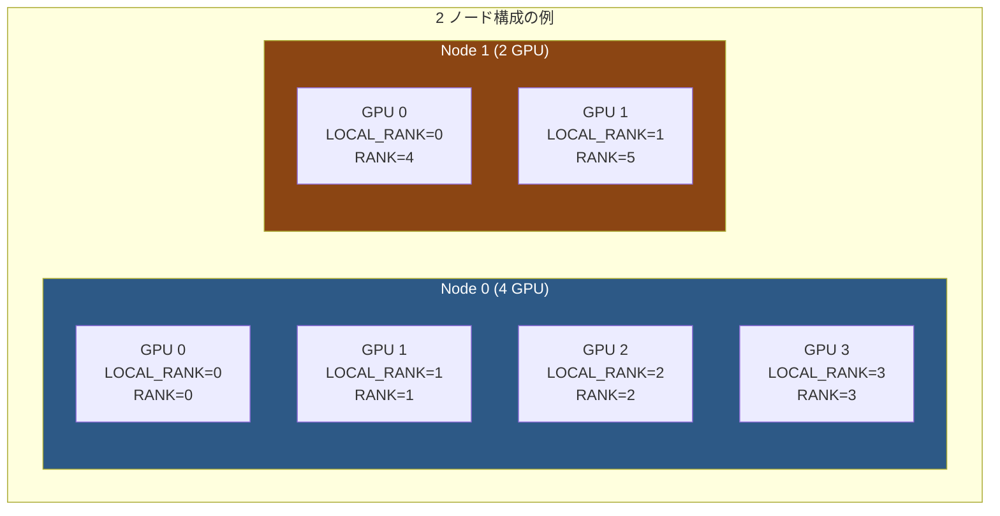
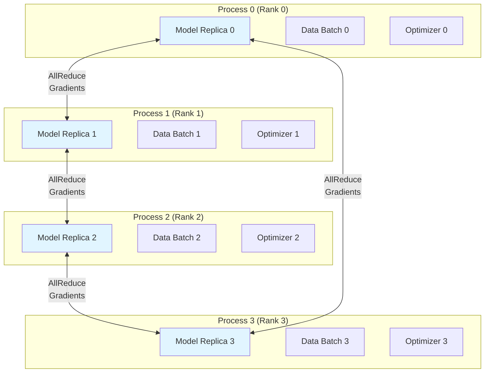
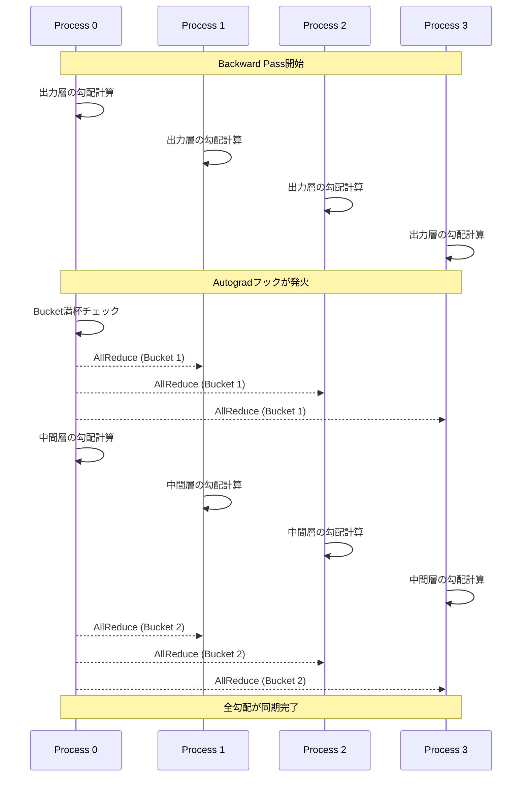
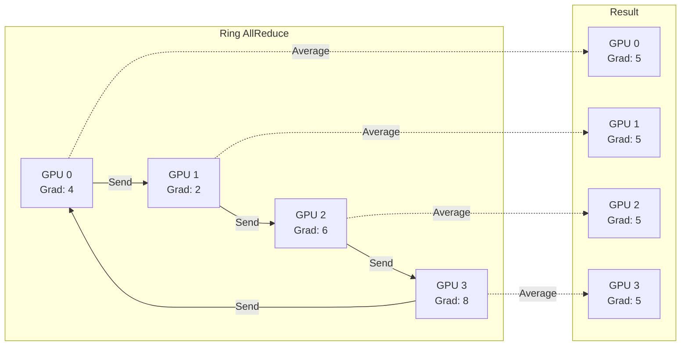

e---
title: "Appendix: PyTorch DDP 公式チュートリアル"
emoji: "🔧"
type: "tech"
topics: ["pytorch", "ddp", "distributed", "gpu", "ml"]
free: false
---

::::details 前提
:::message
**対象読者**: PyTorch DDP の実装を段階的に学びたい方。PyTorch の基本的な使用経験があることを前提とします。
:::
:::message
**ライセンス**: © 2025 littlemex.
本文および自作図表: CC BY 4.0
※PyTorch 公式ドキュメントからの引用や翻訳部分は原典の著作権に従います。
:::
:::message
一部 AI を用いて文章を作成します。レビューは実施しますが、見逃せない重大な間違いなどがあれば[こちらの Issue](https://github.com/littlemex/samples/issues) から連絡をお願いします。
:::
::::

本章では、PyTorch が提供する公式 DDP チュートリアルシリーズの内容を日本語で詳しく整理します。このチュートリアルシリーズは、シンプルな非分散トレーニングから始まり、最終的にはクラスター内の複数マシンへのデプロイまでをカバーする包括的な学習コンテンツです。元のチュートリアルはビデオ形式で提供されており、実際のコードを見ながら段階的に学べる構成になっています。

:::message
最新の情報は[公式チュートリアル](https://docs.pytorch.org/tutorials/beginner/ddp_series_intro.html)を確認してください。また、チュートリアルで使用されるコード例は [GitHub リポジトリ](https://github.com/pytorch/examples/tree/main/distributed/ddp-tutorial-series)で公開されています。
:::

---

# チュートリアルシリーズの全体構成

PyTorch 公式の DDP チュートリアルシリーズは、全 6 回のビデオで構成されています。シリーズ全体を通して、非分散の単一 GPU トレーニングから始まり、徐々に複雑さを増しながら、最終的には複数マシンにまたがる大規模な分散トレーニングまでをカバーします。このような段階的なアプローチにより、各概念を確実に理解しながら進めることができます。

チュートリアルは初心者向けのビギナーレベルと、より高度な内容を扱う中級レベルに分かれています。ビギナーレベルでは [Introduction](https://docs.pytorch.org/tutorials/beginner/ddp_series_intro.html) でシリーズの概要を把握し、[What is DDP](https://docs.pytorch.org/tutorials/beginner/ddp_series_theory.html) で DDP の理論的背景と DataParallel との比較を学びます。その後 [Single-Node Multi-GPU Training](https://docs.pytorch.org/tutorials/beginner/ddp_series_multigpu.html) で単一マシン上での実装を行い、[Fault Tolerance](https://docs.pytorch.org/tutorials/beginner/ddp_series_fault_tolerance.html) で torchrun による耐障害性トレーニングを学びます。

中級レベルでは、[Multi-Node Training](https://docs.pytorch.org/tutorials/intermediate/ddp_series_multinode.html) で複数マシンへの展開方法を学び、最後に [minGPT Training](https://docs.pytorch.org/tutorials/intermediate/ddp_series_minGPT.html) で実践的な GPT モデルのトレーニングを通して、これまで学んだ全ての概念を統合します。このような構成により、理論から実践まで体系的に DDP を習得できます。

---

# DDP の理論的背景

## Data Parallelism の基本原理

Data Parallelism は、複数のデータバッチを異なるデバイスで同時に処理することで、トレーニングのパフォーマンスを向上させる並列化手法です。PyTorch の DistributedDataParallel (DDP) は、この Data Parallelism を効率的に実装するためのモジュールです。

DDP の動作において中心的な役割を果たすのが DistributedSampler です。DistributedSampler は、各デバイスが重複しない入力バッチを受け取ることを保証する仕組みです。データセット全体を均等に分割し、各プロセスに異なる部分を割り当てることで、同じデータが複数の GPU で処理されることを防ぎます。これにより、全ての GPU が異なるデータで並列に学習を進めることができます。

モデル自体は全てのデバイスにレプリケートされます。つまり、各 GPU は完全に同じモデルのコピーを保持します。各レプリカは自分に割り当てられたデータバッチで独立に勾配を計算し、計算が完了すると Ring All-Reduce アルゴリズムを使用して他のレプリカと勾配を同期します。このアルゴリズムにより、全ての GPU が同じ平均勾配を持つようになり、次のパラメータ更新で全てのモデルが同期された状態を保つことができます。

## DataParallel から DistributedDataParallel への移行が推奨される理由

PyTorch には DataParallel (DP) という古い並列化手法も存在しますが、DistributedDataParallel (DDP) への移行が強く推奨されています。DataParallel は確かに実装が簡単で、既存のコードに 1 行追加するだけで並列化できますが、その代償としてパフォーマンスが大幅に劣ります。

DataParallel の最大の問題は、毎回の forward pass ごとにモデルをレプリケートして破棄するという非効率な設計です。これに対して DDP では、モデルは初期化時に一度だけレプリケートされ、その後は同じレプリカを使い続けます。このため、DDP では不必要なオーバーヘッドが発生しません。

さらに重要な違いは、並列化の範囲です。DataParallel は単一ノード内の複数 GPU でのみ動作し、複数マシンへのスケーリングはサポートされていません。一方 DDP は、単一ノードから複数マシンへのシームレスなスケーリングを可能にします。これにより、数台の GPU から数千台の GPU まで、同じコードベースで対応できます。

実装方式の違いも性能に大きく影響します。DataParallel は単一プロセス内でマルチスレッドを使用するため、Python の Global Interpreter Lock (GIL) による競合が発生します。GIL は Python インタープリタへの同時アクセスを制限するロックであり、複数スレッドが並行して Python コードを実行することを妨げます。これに対して DDP はマルチプロセスアーキテクチャを採用しており、各プロセスが独立した Python インタープリタを持つため、GIL の制約を受けません。結果として、DDP は DP よりも大幅に高速に動作します。

---

# 単一ノードでのマルチ GPU トレーニングへの移行

単一 GPU で動作するトレーニングスクリプトを、同一マシン上の複数 GPU で並列実行できるように変更する手順を詳しく説明します。ここでは 4 GPU を使用する例を取り上げますが、基本的な考え方は任意の GPU 数に適用できます。

## プロセスグループの初期化

分散トレーニングを開始する前に、まずプロセスグループを初期化する必要があります。プロセスグループとは、互いに通信と同期が可能な全プロセスの集合を指します。この初期化により、各プロセスが他のプロセスの存在を認識し、協調して動作できるようになります。

```python
def ddp_setup(rank: int, world_size: int):
    """
    分散プロセスグループを初期化する
    
    Args:
        rank: 各プロセスの一意な識別子（0 から world_size-1）
        world_size: トレーニングジョブ全体のプロセス総数
    """
    os.environ["MASTER_ADDR"] = "localhost"
    os.environ["MASTER_PORT"] = "12355"
    torch.cuda.set_device(rank)
    init_process_group(backend="nccl", rank=rank, world_size=world_size)
```

この関数で最も重要なのは `torch.cuda.set_device(rank)` の呼び出しです。このステップを最初に実行することで、各プロセスがどの GPU をデフォルトデバイスとして使用するかを明示的に設定します。この設定を怠ると、全てのプロセスが GPU:0 をデフォルトとして使用しようとし、ハングアップや GPU:0 での過剰なメモリ消費が発生する可能性があります。

プロセスグループの初期化方法には、TCP を使用する方法と共有ファイルシステムを使用する方法があります。上記のコードでは TCP を使用しており、`MASTER_ADDR` と `MASTER_PORT` でランデブーポイント（各プロセスが集合する場所）を指定しています。単一ノードの場合は "localhost" で十分ですが、マルチノードの場合はマスターノードの実際の IP アドレスを指定する必要があります。

backend パラメータには "nccl" を指定しています。NCCL (NVIDIA Collective Communications Library) は NVIDIA GPU 用に最適化された通信ライブラリであり、GPU 間の高速な通信を実現します。CPU でトレーニングする場合は "gloo" バックエンドを使用します。

## モデルの DDP ラッピング

通常のモデルを DDP で並列化するには、モデルを `DistributedDataParallel` でラップします。

```python
self.model = DDP(model, device_ids=[gpu_id])
```

このシンプルな 1 行のコードが、モデルに分散トレーニングの全ての機能を追加します。DDP ラッパーは、backward pass 中に勾配が計算されると自動的に All-Reduce 操作を実行し、全ての GPU で勾配を同期します。開発者は勾配同期のコードを書く必要がなく、通常の PyTorch トレーニングループをそのまま使用できます。

## データローダーの設定変更

分散トレーニングでは、各プロセスが異なるデータを処理する必要があります。これを実現するために、DataLoader の設定を変更します。

```python
train_data = torch.utils.data.DataLoader(
    dataset=train_dataset,
    batch_size=32,
    shuffle=False,
    sampler=DistributedSampler(train_dataset),
)
```

重要な変更点は、`shuffle=False` に設定し、代わりに `DistributedSampler` を sampler パラメータに指定することです。DistributedSampler が各プロセスに異なるデータを割り当てる責任を持つため、DataLoader 自体でのシャッフリングは不要になります。むしろ、shuffle と sampler を同時に指定するとエラーが発生します。

実効バッチサイズについても理解が重要です。各プロセスは batch_size で指定されたサンプル数（この例では 32）を処理します。4 GPU を使用する場合、4 つのプロセスがそれぞれ 32 サンプルを処理するため、実効的なバッチサイズは 128 になります。これは単一 GPU でバッチサイズ 128 を使用するのと同等の効果があり、学習の安定性や収束速度に影響します。

## エポック間でのデータシャッフリング

複数エポックにわたってトレーニングを行う場合、データのシャッフリングが適切に機能することが重要です。DistributedSampler を使用する場合、各エポックの開始時に `set_epoch()` メソッドを呼び出す必要があります。

```python
def _run_epoch(self, epoch):
    b_sz = len(next(iter(self.train_data))[0])
    self.train_data.sampler.set_epoch(epoch)
    for source, targets in self.train_data:
        self._run_batch(source, targets)
```

この `set_epoch()` 呼び出しは、DistributedSampler 内部のランダムシードをエポック番号に基づいて更新します。これにより、各エポックで異なるデータの順序が生成され、トレーニングの質が向上します。この呼び出しを省略すると、全てのエポックで同じデータ順序が使用されてしまい、モデルが特定のデータ順序に過学習する可能性があります。

## チェックポイント保存の注意点

分散トレーニングでモデルチェックポイントを保存する際には、2 つの重要な変更が必要です。

まず、DDP でラップされたモデルから state_dict を取得する際は、`model.module.state_dict()` を使用する必要があります。DDP ラッパーは元のモデルを `module` 属性に格納しているため、直接 `model.state_dict()` を呼ぶと DDP のメタデータも含まれてしまいます。

```python
# DDP でラップされたモデルから正しく state_dict を取得
ckp = self.model.module.state_dict()
```

次に、チェックポイントの保存は 1 つのプロセスのみから実行する必要があります。全てのプロセスが同じモデルパラメータを持っているため、複数のプロセスから保存すると同じ内容のファイルが複数作成され、ストレージとI/O リソースを無駄にします。

```python
if self.gpu_id == 0 and epoch % self.save_every == 0:
    self._save_checkpoint(epoch)
```

通常は rank 0（最初の GPU を使用するプロセス）からのみ保存します。この条件により、1 つのチェックポイントファイルのみが作成されます。

## トレーニングジョブの起動方法の変更

単一 GPU トレーニングでは、単にスクリプトを実行するだけでしたが、マルチ GPU トレーニングでは複数のプロセスを起動する必要があります。PyTorch の `multiprocessing.spawn` を使用して、GPU 数と同じ数のプロセスを起動します。

```python
def main(rank, world_size, total_epochs, save_every):
    ddp_setup(rank, world_size)
    dataset, model, optimizer = load_train_objs()
    train_data = prepare_dataloader(dataset, batch_size=32)
    trainer = Trainer(model, train_data, optimizer, rank, save_every)
    trainer.train(total_epochs)
    destroy_process_group()

if __name__ == "__main__":
    import sys
    total_epochs = int(sys.argv[1])
    save_every = int(sys.argv[2])
    world_size = torch.cuda.device_count()
    mp.spawn(main, args=(world_size, total_epochs, save_every,), nprocs=world_size)
```

`mp.spawn` は指定された関数（この場合は `main`）を複数回呼び出し、各呼び出しで異なる rank 値を渡します。`nprocs` パラメータで起動するプロセス数を指定し、通常は GPU 数と一致させます。各プロセスは独立して実行されますが、プロセスグループを通じて互いに通信できます。

main 関数の最後で `destroy_process_group()` を呼び出すことも重要です。これにより、プロセスグループが適切にクリーンアップされ、リソースが解放されます。この呼び出しを省略すると、プログラム終了時にハングアップする可能性があります。

---

# torchrun による耐障害性の実現

分散トレーニングでは、単一プロセスの障害がトレーニングジョブ全体を停止させる可能性があり、障害の発生確率はプロセス数（GPU 数）に比例して増加します。このため、障害許容性のある仕組みが特に重要になります。PyTorch は torchrun というユーティリティを提供しており、これが障害許容性とエラスティックトレーニングを可能にします。

## torchrun が解決する課題

torchrun を使用する最大の理由は、分散トレーニングの細かい設定を自動化することです。従来の方法では、環境変数の設定、rank と world_size の管理、プロセスの起動など、多くの boilerplate コードが必要でした。torchrun はこれらの作業を全て引き受けるため、開発者はトレーニングロジックに集中できます。

具体的には、torchrun は RANK、WORLD_SIZE、LOCAL_RANK などの環境変数を自動的に設定します。開発者がこれらの値を手動で管理したり、スクリプトに明示的に渡す必要はありません。各プロセスは起動時にこれらの環境変数から必要な情報を読み取ることができます。

また、`mp.spawn` を使用したプロセスの起動も不要になります。torchrun がプロセスの起動と管理を担当するため、スクリプトには汎用的な `main()` エントリーポイントを用意するだけで済みます。この設計により、同じスクリプトを非分散モード、単一ノードのマルチ GPU、マルチノードなど、様々な設定で実行できます。

## 障害発生時の自動再起動

torchrun の最も強力な機能は、障害発生時の自動再起動です。トレーニング中にハードウェア障害やネットワークエラーが発生すると、torchrun はエラーをログに記録し、全てのプロセスを終了した後、自動的に再起動を試みます。

この再起動メカニズムが効果的に機能するためには、トレーニングスクリプトを適切に構造化する必要があります。推奨される構造は、まずスナップショット（トレーニングの現在状態）をロードし、次に必要な初期化を行い、最後にトレーニングループを実行するというものです。

```python
def main():
    load_snapshot(snapshot_path)  # 前回のスナップショットをロード
    initialize()  # プロセスグループなどを初期化
    train()  # トレーニングを実行

def train():
    for batch in iter(dataset):
        train_step(batch)
        
        if should_checkpoint:
            save_snapshot(snapshot_path)  # 定期的にスナップショットを保存
```

障害が発生すると、torchrun は全プロセスを終了して再起動します。再起動されたプロセスは、まず `load_snapshot()` で最後に保存されたスナップショットをロードするため、障害発生時点の直前の状態から学習を再開できます。スナップショットには、モデルの state_dict だけでなく、エポック番号、optimizer の状態、ランダムシードなど、トレーニングの継続に必要な全ての情報を含めるべきです。

## エラスティックトレーニングの実現

torchrun のもう一つの重要な機能は、エラスティックトレーニングのサポートです。エラスティックトレーニングとは、トレーニング実行中に計算リソースを動的に追加・削除できる機能を指します。

例えば、クラウド環境でスポットインスタンスを使用している場合、インスタンスが突然終了したり、追加のインスタンスが利用可能になることがあります。torchrun はこのようなメンバーシップの変更を検出すると、全プロセスを終了し、現在利用可能なデバイスでプロセスを再起動します。スナップショットからの再開機能と組み合わせることで、リソースの変動に柔軟に対応できる resilient なトレーニングジョブを実現できます。

## コード変更の詳細

torchrun を使用するためのコード変更は、環境変数の活用に焦点が当てられます。従来は関数の引数として rank や world_size を明示的に渡していましたが、torchrun を使用する場合は環境変数から取得します。

プロセスグループの初期化関数は大幅にシンプルになります。

```python
# torchrun 使用時の初期化
def ddp_setup():
    init_process_group(backend="nccl")
    torch.cuda.set_device(int(os.environ["LOCAL_RANK"]))
```

rank や world_size を引数として受け取る必要がなくなり、`init_process_group()` が環境変数から自動的にこれらの値を読み取ります。同様に、デバイスの設定も `LOCAL_RANK` 環境変数から取得します。

Trainer クラス内でも、GPU ID を引数から受け取る代わりに環境変数から取得するように変更します。

```python
self.gpu_id = int(os.environ["LOCAL_RANK"])
```

トレーニングループでは、最後に実行したエポックから再開できるように変更します。

```python
def train(self, max_epochs: int):
    for epoch in range(self.epochs_run, max_epochs):
        self._run_epoch(epoch)
```

`self.epochs_run` は、スナップショットから復元されたエポック番号です。新規トレーニングの場合は 0 から開始し、再起動の場合は中断したエポックから継続します。

最後に、スクリプトのエントリーポイントが大幅にシンプルになります。

```python
if __name__ == "__main__":
    import sys
    total_epochs = int(sys.argv[1])
    save_every = int(sys.argv[2])
    main(save_every, total_epochs)
```

`mp.spawn` の呼び出しが不要になり、通常の関数呼び出しだけで済みます。プロセスの起動は torchrun が担当します。

実行方法も変わります。

```bash
# 従来の方法
python multigpu.py 50 10

# torchrun を使用
torchrun --standalone --nproc_per_node=4 multigpu_torchrun.py 50 10
```

`--standalone` オプションは単一ノードでの実行を示し、`--nproc_per_node=4` は各ノードで 4 つのプロセスを起動することを指定します。

---

# マルチノードトレーニングへの展開

単一ノードでのマルチ GPU トレーニングをマスターしたら、次のステップは複数のマシンにまたがるマルチノードトレーニングです。マルチノードトレーニングでは、トレーニングジョブを複数のマシンにデプロイし、さらに多くの GPU を活用できます。

## マルチノードトレーニングの実行方式

マルチノードトレーニングを実行するには、主に 2 つのアプローチがあります。最初のアプローチは、各マシンで個別に torchrun コマンドを実行する方法です。この場合、全てのマシンで同一の rendezvous 引数を使用する必要があります。rendezvous 引数には、マスターノードのアドレス、ポート、ジョブ ID などが含まれ、これにより各マシンのプロセスが互いを発見し、プロセスグループを形成できます。

2 つ目のアプローチは、SLURM のようなワークロードマネージャーを使用してコンピュートクラスターにジョブをデプロイする方法です。ワークロードマネージャーは、リソースの割り当て、ジョブのスケジューリング、各ノードでのコマンド実行を自動化します。本書の HyperPod Slurm チュートリアルでは、この方式を採用しています。

## ノード間通信のレイテンシー

マルチノードトレーニングを検討する際に理解すべき重要な点は、ノード間通信のレイテンシーです。単一ノード内の GPU 間通信は、NVLink などの高速インターコネクトを使用して非常に高速です。しかし、異なるノード間の通信は、InfiniBand や Ethernet を経由するため、大幅に遅くなります。

この通信コストの違いにより、必ずしもノード数を増やすことが最適解とは限りません。例えば、単一ノードで 4 GPU を使用する方が、各 1 GPU を持つ 4 ノードで実行するよりも、トレーニング時間が短くなる場合があります。ノード間通信のオーバーヘッドが、並列化による高速化を相殺してしまうためです。

したがって、マルチノードトレーニングは、単一ノードでは不十分な GPU 数が必要な場合や、非常に大規模なモデルやデータセットを扱う場合に選択すべきです。

## LOCAL_RANK と RANK の理解

マルチノード環境では、プロセスの識別に 2 種類のランクが使用されます。LOCAL_RANK はノード内での相対的な識別子であり、各ノードで 0 から始まります。例えば、各ノードに 4 GPU がある場合、各ノードには LOCAL_RANK が 0、1、2、3 の 4 つのプロセスが存在します。

一方、RANK は全ノードにわたるグローバルな識別子です。2 つのノードがあり、最初のノードに 4 GPU、2 番目のノードに 2 GPU がある場合、RANK は 0 から 5 まで割り当てられます。最初のノードのプロセスは RANK 0-3 を持ち、2 番目のノードのプロセスは RANK 4-5 を持ちます。



LOCAL_RANK はノード内での GPU の位置を示すため、各ノードで独立してカウントされます。一方 RANK はクラスター全体でのプロセスの位置を示すため、全ノードで一意の値を持ちます。この 2 つの識別子を適切に使い分けることで、ノード固有の操作（例えばローカルディスクへの書き込み）とグローバルな操作（例えばマスターノードからのみの保存）を実装できます。

## ヘテロジニアススケーリングの柔軟性

torchrun の興味深い機能の一つは、ヘテロジニアススケーリング（異種スケーリング）のサポートです。これは、各マシンが異なる数の GPU を持っていても、それらを全て同じトレーニングジョブに参加させることができるという意味です。

従来のシステムでは、全てのノードが同じハードウェア構成を持つことが前提でしたが、torchrun ではこの制約がありません。例えば、あるノードに 4 GPU、別のノードに 2 GPU という構成でも問題なくトレーニングを実行できます。これにより、利用可能なハードウェアを柔軟に活用でき、リソースの効率的な利用が可能になります。

## マルチノードトレーニングのトラブルシューティング

マルチノードトレーニングでは、ネットワーク設定や通信の問題が発生する可能性が高くなります。最も一般的な問題は、ノード間で TCP 通信ができないことです。ファイアウォールの設定や、ネットワークセキュリティグループの設定により、必要なポートがブロックされている場合があります。トレーニングを開始する前に、全てのノードが互いに通信できることを確認する必要があります。

NCCL に関連する問題が発生した場合は、環境変数 `NCCL_DEBUG` を `INFO` に設定することで、詳細なデバッグ情報を取得できます。

```bash
export NCCL_DEBUG=INFO
```

この設定により、NCCL が実行する全ての通信操作、使用するネットワークインターフェース、発生したエラーなどが詳細にログ出力されます。これらのログは問題の診断に非常に有用です。

場合によっては、分散バックエンドが使用するネットワークインターフェースを明示的に指定する必要があります。

```bash
export NCCL_SOCKET_IFNAME=eth0
```

システムに複数のネットワークインターフェースがある場合、NCCL がデフォルトで選択したインターフェースが適切でない可能性があります。この環境変数により、使用するインターフェースを明示的に指定できます。

---

# 実践的な GPT モデルのトレーニング

チュートリアルシリーズの最終章では、これまで学んだ全ての概念を統合して、実際の GPT モデルをマルチノード DDP でトレーニングします。minGPT リポジトリを使用し、実世界のモデルトレーニングに必要な追加の考慮事項を学びます。

## プロジェクトの構造化

実践的なトレーニングプロジェクトでは、コードを適切に構造化することが重要です。minGPT のトレーニングでは、複数のファイルに責任を分散させます。`trainer.py` は Trainer クラスを定義し、分散トレーニングの反復処理を管理します。`model.py` はモデルアーキテクチャを定義し、`char_dataset.py` はデータセットクラスを提供します。

設定管理には Hydra を使用します。Hydra は階層的な設定システムを提供し、データ、モデル、optimizer、トレーニングパラメータなどの全ての設定を YAML ファイルで一元管理できます。これにより、異なる実験設定を簡単に切り替えたり、実験の再現性を確保したりすることが容易になります。

`main.py` はエントリーポイントとして機能し、DDP プロセスグループのセットアップ、設定の読み込み、トレーニングジョブの実行を調整します。このような明確な責任分離により、コードの保守性と拡張性が向上します。

## Mixed Precision によるトレーニング高速化

実践的なトレーニングでは、Mixed Precision を使用することが一般的です。Mixed Precision は、トレーニングプロセスの一部を低精度（FP16 や BF16）で実行し、精度低下に敏感なステップは FP32 精度で維持する手法です。

この手法の主な利点は、メモリ使用量の削減とトレーニング速度の向上です。半精度（16 ビット）は単精度（32 ビット）の半分のメモリしか使用しないため、同じ GPU でより大きなバッチサイズや大きなモデルを扱えます。また、最新の GPU に搭載されている Tensor Core は半精度演算に最適化されており、2 から 3 倍の速度向上を実現できます。

PyTorch の Automatic Mixed Precision (AMP) 機能を使用すると、開発者が手動で精度を管理する必要がなくなります。AMP は自動的に各演算に適切な精度を選択し、数値の安定性を保つために必要な場合は loss scaling を適用します。

## DDP の限界とメモリ制約

トレーニング実行のメモリフットプリントは、複数の要素で構成されます。モデルの重み（parameters）、中間計算結果（activations）、勾配（gradients）、入力バッチ、そして optimizer の状態がメモリを消費します。DDP は各 GPU でモデル全体をレプリケートするアプローチを取るため、これら全てのメモリフットプリントが各 GPU に収まる必要があります。

モデルが大きくなると、単一 GPU のメモリでは不十分になります。例えば、70B パラメータのモデルを BF16 精度で学習する場合、パラメータだけで 140GB、勾配で 140GB、optimizer state で 280GB が必要であり、これは単一の H100 GPU（80GB）には到底収まりません。このような場合、DDP だけでは対応できず、より積極的なメモリ削減手法が必要になります。

### Activation Checkpointing によるメモリ削減

Activation Checkpointing は、メモリと計算のトレードオフを調整する手法です。通常、Forward Pass で計算された中間結果（activations）は、Backward Pass で勾配を計算する際に再利用されるため、全てメモリに保存されます。しかし、大規模なモデルではこの activations が膨大なメモリを消費します。

Activation Checkpointing では、Forward Pass 中に全ての activations を保存する代わりに、一部の activations のみを保存し、必要に応じて Backward Pass 中に再計算します。これにより、メモリ使用量を大幅に削減できますが、再計算のための追加の計算コストが発生します。このトレードオフは多くの場合で許容可能であり、メモリがボトルネックとなっている状況では有効な解決策です。

### Fully-Sharded Data Parallel への移行

DDP でもメモリが不足する場合、Fully-Sharded Data Parallel (FSDP) への移行を検討すべきです。FSDP は DDP とは根本的に異なるアプローチを取り、モデルをレプリケートするのではなく、全 GPU に分割（シャード）します。

各 GPU は自分に割り当てられたモデルの一部のみを保持し、Forward Pass や Backward Pass で必要になった時に他の GPU からパラメータを取得します。計算と通信をオーバーラップさせることで、この追加の通信コストを最小化します。FSDP により、PyTorch は 1 兆パラメータモデルのトレーニングに成功しており、超大規模モデルの学習を可能にする重要な技術です。

---

# 実践的な考慮事項とベストプラクティス

## トレーニング環境の準備

PyTorch DDP チュートリアルのコードを実行するには、適切なハードウェア環境が必要です。チュートリアルでは複数の CUDA GPU を前提としており、通常はクラウドインスタンスを使用します。チュートリアル自体では、4 GPU を搭載した Amazon EC2 P3 インスタンスを使用してデモンストレーションを行っています。

ローカル環境で実行する場合は、複数の GPU を搭載したワークステーションが必要です。GPU が 2 つしかない場合でも、コードの `nproc_per_node` パラメータを調整することでチュートリアルを実行できますが、4 GPU での実行と比較すると、並列化の効果やスケーラビリティの理解が制限される可能性があります。

## 単一ノードとマルチノードの選択

単一ノードマルチ GPU とマルチノードの選択は、トレードオフの理解が重要です。単一ノードマルチ GPU の最大の利点は、ノード内通信の高速性です。NVLink や NVSwitch などの高速インターコネクトにより、GPU 間の通信レイテンシーは非常に小さく、All-Reduce 操作のオーバーヘッドを最小化できます。また、設定がシンプルで、デバッグも容易です。単一マシン内で全てが完結するため、ネットワーク設定やファイアウォールの問題を心配する必要がありません。

一方、マルチノードの利点は、利用可能な GPU の総数を大幅に増やせることです。単一ノードでは通常 8 GPU が上限ですが、マルチノードでは数十から数千の GPU を活用できます。これにより、超大規模なモデルやデータセットに対応できます。しかし、ノード間通信のレイテンシーは無視できないコストであり、通信と計算の比率によっては、期待した speedup が得られない場合があります。

## 実効バッチサイズとハイパーパラメータの調整

DDP を使用する際に注意すべき重要な点は、実効バッチサイズの変化です。各プロセスが指定されたバッチサイズでトレーニングを行うため、全体としてのバッチサイズは GPU 数倍になります。

```python
effective_batch_size = per_device_batch_size × num_gpus
```

例えば、各 GPU で 32 のバッチサイズを使用し、4 GPU でトレーニングする場合、実効バッチサイズは 128 になります。バッチサイズの変化は、学習率などのハイパーパラメータに影響を与える可能性があります。一般的に、バッチサイズを大きくする場合は、学習率も比例して大きくすることが推奨されます。ただし、この調整は問題やモデルによって異なるため、実験的に最適な値を見つける必要があります。

## チェックポイント戦略の設計

分散トレーニングにおけるチェックポイント戦略は、パフォーマンスと耐障害性のバランスを取る必要があります。チェックポイントの保存頻度が高すぎると、I/O 操作がトレーニングのボトルネックになります。特にマルチノードトレーニングでは、全ノードから共有ストレージへの書き込みが同時に発生するため、I/O の競合が深刻になる可能性があります。

一方、保存頻度が低すぎると、障害発生時に多くのトレーニング進捗を失います。長時間のトレーニングジョブでは、障害の発生確率が高くなるため、適切な保存頻度の設定が特に重要です。一般的な経験則として、平均故障間隔の 10% 程度の間隔でチェックポイントを保存することが推奨されます。

完全なスナップショットには、トレーニングの継続に必要な全ての状態を含める必要があります。

```python
snapshot = {
    'epoch': epoch,
    'model_state': model.module.state_dict(),
    'optimizer_state': optimizer.state_dict(),
    'rng_state': torch.get_rng_state(),
    'scheduler_state': lr_scheduler.state_dict() if lr_scheduler else None,
}
torch.save(snapshot, snapshot_path)
```

モデルと optimizer の state だけでなく、現在のエポック番号、ランダムシードの状態、学習率スケジューラーの状態なども保存します。これにより、再起動後も完全に同じ状態からトレーニングを継続できます。

---

# まとめと次のステップ

PyTorch 公式 DDP チュートリアルシリーズは、分散トレーニングの実装を段階的に学べる優れた学習リソースです。シリーズ全体を通して、基本概念から実践的な実装まで、体系的に DDP を習得できます。

チュートリアルで特に重要なのは、DataParallel と DistributedDataParallel の違いを明確に理解することです。DataParallel はシンプルですが性能が劣り、DDP はやや複雑ですが大幅に高速で、スケーラビリティに優れています。この理解により、適切な並列化手法を選択できます。

torchrun の導入により、分散トレーニングの実装が大幅にシンプルになりました。環境変数の自動設定、障害時の自動再起動、エラスティックトレーニングのサポートにより、resilient で柔軟なトレーニングジョブを実現できます。これは特に、長時間実行される大規模トレーニングジョブにおいて価値があります。

マルチノードトレーニングへの展開では、LOCAL_RANK と RANK の違い、ノード間通信のコスト、ヘテロジニアススケーリングの柔軟性などを学びました。これらの知識は、数十から数千の GPU を使用する大規模なトレーニングジョブを設計する際に不可欠です。

## HyperPod Slurm での実践

本書の [Blueprints by Slurm: PyTorch DDP on CPU](./amazon-sagemaker-hyperpod-slurm-ddp-on-cpu.md) では、Amazon SageMaker HyperPod 環境で DDP を使用する方法を詳しく解説しています。PyTorch チュートリアルで学んだ概念を、AWS のマネージドクラスター環境で実践できます。HyperPod は Slurm を統合しているため、ワークロードマネージャーを使用したマルチノードトレーニングの実行方法を学ぶのに最適な環境です。

## より高度な並列化手法への発展

DDP の基礎を固めたら、[マルチ GPU 処理手法の整理](./multi-gpu-processing-approaches.md)で、FSDP、Megatron-LM、DeepSpeed などのより高度な手法を学習することをお勧めします。これらの手法は、DDP では対応できない超大規模モデルのトレーニングを可能にします。

DDP で学んだ勾配同期、通信パターン、プロセス管理などの概念は、これらの高度な手法の基礎となります。DDP を深く理解することで、より複雑な分散学習システムを理解し、適切に使用するための土台が築かれます。

## 継続的な学習のためのリソース

PyTorch の分散学習は継続的に進化しています。[公式チュートリアルシリーズ](https://docs.pytorch.org/tutorials/beginner/ddp_series_intro.html)と [GitHub のコード例](https://github.com/pytorch/examples/tree/main/distributed/ddp-tutorial-series)を定期的に確認し、新しい機能やベストプラクティスを学び続けることをお勧めします。また、[PyTorch Distributed Overview](https://docs.pytorch.org/stable/distributed.html) は、torch.distributed パッケージの全機能を包括的にカバーする公式ドキュメントであり、リファレンスとして有用です。


----

memo

# 01. DDP (DistributedDataParallel) 基礎編

## 目次
1. [DDPとは](#ddpとは)
2. [基本概念](#基本概念)
3. [アーキテクチャ](#アーキテクチャ)
4. [実装の仕組み](#実装の仕組み)
5. [コード例](#コード例)
6. [内部動作の詳細](#内部動作の詳細)

---

## DDPとは

**DistributedDataParallel (DDP)** は、PyTorchが提供するデータ並列学習のための最も基本的かつ効率的な手法です。

### 特徴
- ✅ マルチプロセス、マルチスレッド対応
- ✅ 単一マシン & マルチマシン対応
- ✅ DataParallelより高速（GIL制限なし）
- ✅ シンプルなAPI
- ✅ Gradient同期の自動化

### DataParallelとの比較

| 項目 | DataParallel | DistributedDataParallel |
|------|--------------|------------------------|
| プロセス | シングルプロセス | マルチプロセス |
| GIL | 影響あり | 影響なし |
| マルチノード | ❌ | ✅ |
| 速度 | 遅い | 高速 |
| メモリ効率 | 低い | 高い |
| 推奨度 | ❌ 非推奨 | ✅ 推奨 |

---

## 基本概念

### プロセスとランク

```
マシン1 (Node 0)
├── GPU 0: Rank 0 (Global Rank 0)
├── GPU 1: Rank 1 (Global Rank 1)
├── GPU 2: Rank 2 (Global Rank 2)
└── GPU 3: Rank 3 (Global Rank 3)

マシン2 (Node 1)
├── GPU 0: Rank 0 (Global Rank 4)
├── GPU 1: Rank 1 (Global Rank 5)
├── GPU 2: Rank 2 (Global Rank 6)
└── GPU 3: Rank 3 (Global Rank 7)
```

**重要な用語**:
- **World Size**: 全プロセス数（上記の例では8）
- **Rank**: 各プロセスの一意なID（0から始まる）
- **Local Rank**: ノード内でのランク（各ノードで0から始まる）
- **Master Process**: Rank 0のプロセス（通常、ログ出力やチェックポイント保存を担当）

### プロセスグループ

プロセスグループは、通信を行うプロセスの集合です。

```python
import torch.distributed as dist

# 初期化
dist.init_process_group(
    backend='nccl',      # GPU用はNCCL（推奨）
    init_method='env://', # 環境変数から設定を読み込む
    world_size=8,        # 全プロセス数
    rank=rank            # このプロセスのランク
)
```

**バックエンドの選択**:
- **NCCL**: NVIDIA GPU用（最も高速、推奨）
- **Gloo**: CPU & GPU対応（汎用的）
- **MPI**: レガシーサポート

---

## アーキテクチャ

### 全体構造



### 重要なポイント

1. **各プロセスが独立したモデルコピーを持つ**
   - メモリ: モデルサイズ × プロセス数
   - 各GPUに完全なモデルレプリカ

2. **データは分散される**
   - 各プロセスが異なるデータバッチを処理
   - グローバルバッチサイズ = ローカルバッチサイズ × world_size

3. **勾配のみ同期される**
   - Forward pass: 各プロセスが独立に実行
   - Backward pass: 勾配を自動的にAllReduceで平均化
   - Optimizer step: 同期された勾配で各プロセスが更新

---

## 実装の仕組み

### 1. 初期化フェーズ

```python
import torch
import torch.distributed as dist
import torch.multiprocessing as mp
from torch.nn.parallel import DistributedDataParallel as DDP

def setup(rank, world_size):
    os.environ['MASTER_ADDR'] = 'localhost'
    os.environ['MASTER_PORT'] = '12355'
    
    # プロセスグループ初期化
    dist.init_process_group("nccl", rank=rank, world_size=world_size)
```

**内部で起こること**:
1. TCPストアの作成（マスタープロセスが調整）
2. NCCL通信リングの確立
3. 全プロセスの同期確認

### 2. モデルのラッピング

```python
def create_model(rank):
    # モデルをGPUに配置
    model = MyModel().to(rank)
    
    # DDPでラッピング
    ddp_model = DDP(model, device_ids=[rank])
    
    return ddp_model
```

**DDPコンストラクタで起こること**:
1. モデルのパラメータをブロードキャスト（Rank 0 → 全ランク）
2. Autogradフックの登録（各パラメータに対して）
3. バケツ（Bucket）の作成（効率的な通信のため）

### 3. Forward Pass

```python
# 各プロセスで独立に実行
outputs = ddp_model(inputs)
loss = criterion(outputs, targets)
```

**内部動作**:
- 各プロセスが独自のデータで順伝播
- 通信なし（完全に並列）
- 各プロセスで異なる損失値

### 4. Backward Pass（重要！）

```python
loss.backward()  # ここで勾配同期が自動的に行われる
```

**内部動作の詳細**:



**Bucketingの仕組み**:
- パラメータを複数のバケツにグループ化
- バケツが満杯になったらAllReduceを開始
- 計算と通信のオーバーラップを実現

### 5. Optimizer Step

```python
optimizer.step()  # 各プロセスで同期された勾配を使用して更新
```

**内部動作**:
- 各プロセスが独立に更新（通信なし）
- すでに勾配が同期されているため、全プロセスで同じ更新

---

## コード例

### 最小限の実装

```python
import os
import torch
import torch.nn as nn
import torch.distributed as dist
import torch.multiprocessing as mp
from torch.nn.parallel import DistributedDataParallel as DDP

class SimpleModel(nn.Module):
    def __init__(self):
        super().__init__()
        self.fc1 = nn.Linear(10, 10)
        self.relu = nn.ReLU()
        self.fc2 = nn.Linear(10, 5)
    
    def forward(self, x):
        return self.fc2(self.relu(self.fc1(x)))

def setup(rank, world_size):
    os.environ['MASTER_ADDR'] = 'localhost'
    os.environ['MASTER_PORT'] = '12355'
    dist.init_process_group("nccl", rank=rank, world_size=world_size)

def cleanup():
    dist.destroy_process_group()

def train(rank, world_size):
    print(f"Running DDP on rank {rank}.")
    setup(rank, world_size)
    
    # モデルを作成してGPUに配置
    model = SimpleModel().to(rank)
    ddp_model = DDP(model, device_ids=[rank])
    
    # 損失関数とオプティマイザ
    loss_fn = nn.MSELoss()
    optimizer = torch.optim.SGD(ddp_model.parameters(), lr=0.001)
    
    # 訓練ループ
    for epoch in range(10):
        optimizer.zero_grad()
        
        # ダミーデータ（実際はDataLoaderから）
        inputs = torch.randn(20, 10).to(rank)
        targets = torch.randn(20, 5).to(rank)
        
        # Forward
        outputs = ddp_model(inputs)
        loss = loss_fn(outputs, targets)
        
        # Backward（勾配同期が自動的に行われる）
        loss.backward()
        
        # Optimizer step
        optimizer.step()
        
        if rank == 0:  # マスタープロセスのみログ出力
            print(f"Epoch {epoch}, Loss: {loss.item():.4f}")
    
    cleanup()

def main():
    world_size = torch.cuda.device_count()
    mp.spawn(train, args=(world_size,), nprocs=world_size, join=True)

if __name__ == "__main__":
    main()
```

### DataLoaderとの統合

```python
from torch.utils.data import Dataset, DataLoader
from torch.utils.data.distributed import DistributedSampler

class MyDataset(Dataset):
    def __init__(self, size):
        self.size = size
        self.data = torch.randn(size, 10)
        self.targets = torch.randn(size, 5)
    
    def __len__(self):
        return self.size
    
    def __getitem__(self, idx):
        return self.data[idx], self.targets[idx]

def train_with_dataloader(rank, world_size):
    setup(rank, world_size)
    
    # データセットの準備
    dataset = MyDataset(1000)
    
    # DistributedSamplerを使用（重要！）
    sampler = DistributedSampler(
        dataset,
        num_replicas=world_size,
        rank=rank,
        shuffle=True
    )
    
    dataloader = DataLoader(
        dataset,
        batch_size=32,
        sampler=sampler,  # samplerを指定
        num_workers=2,
        pin_memory=True
    )
    
    # モデルの準備
    model = SimpleModel().to(rank)
    ddp_model = DDP(model, device_ids=[rank])
    
    loss_fn = nn.MSELoss()
    optimizer = torch.optim.SGD(ddp_model.parameters(), lr=0.001)
    
    # 訓練ループ
    for epoch in range(10):
        # 各エポックでサンプラーのエポックを設定（シャッフルのため）
        sampler.set_epoch(epoch)
        
        for batch_idx, (data, target) in enumerate(dataloader):
            data, target = data.to(rank), target.to(rank)
            
            optimizer.zero_grad()
            output = ddp_model(data)
            loss = loss_fn(output, target)
            loss.backward()
            optimizer.step()
            
            if rank == 0 and batch_idx % 10 == 0:
                print(f"Epoch {epoch}, Batch {batch_idx}, Loss: {loss.item():.4f}")
    
    cleanup()
```

---

## 内部動作の詳細

### Autogradフックの仕組み

DDPは各パラメータに対してAutogradフックを登録します：

```python
# DDPの内部実装（簡略化）
class DistributedDataParallel(nn.Module):
    def __init__(self, module, device_ids):
        super().__init__()
        self.module = module
        self.device_ids = device_ids
        
        # パラメータごとにフックを登録
        for param in self.module.parameters():
            if param.requires_grad:
                param.register_hook(self._make_hook(param))
    
    def _make_hook(self, param):
        def hook(grad):
            # 勾配がバケツに追加される
            self._add_to_bucket(param, grad)
            
            # バケツが満杯なら通信開始
            if self._bucket_is_ready():
                self._allreduce_bucket()
        
        return hook
```

### Bucketingとオーバーラップ

```mermaid
gantt
    title DDP Backward Pass with Bucketing
    dateFormat X
    axisFormat %L
    
    section Process 0
    Layer 10 grad calc   :a1, 0, 10
    Layer 9 grad calc    :a2, 10, 10
    Layer 8 grad calc    :a3, 20, 10
    Bucket 1 AllReduce   :crit, a4, 15, 15
    Layer 7 grad calc    :a5, 30, 10
    Layer 6 grad calc    :a6, 40, 10
    Bucket 2 AllReduce   :crit, a7, 35, 15
    
    section Process 1
    Layer 10 grad calc   :b1, 0, 10
    Layer 9 grad calc    :b2, 10, 10
    Layer 8 grad calc    :b3, 20, 10
    Bucket 1 AllReduce   :crit, b4, 15, 15
    Layer 7 grad calc    :b5, 30, 10
    Layer 6 grad calc    :b6, 40, 10
    Bucket 2 AllReduce   :crit, b7, 35, 15
```



**利点**:
- 計算と通信のオーバーラップ
- 通信回数の削減（小さなテンソルをまとめる）
- メモリ効率の向上

### AllReduceの実装（NCCL）



**Ring AllReduceの特徴**:
- 通信量: O(N) （Nはデータサイズ）
- 時間複雑度: O(N/P) （Pはプロセス数）
- 帯域幅最適化

---

## ベストプラクティス

### 1. バッチサイズの調整

```python
# グローバルバッチサイズを維持
local_batch_size = global_batch_size // world_size

# または、学習率のスケーリング
learning_rate = base_lr * world_size
```

### 2. 勾配蓄積

```python
accumulation_steps = 4

for i, (data, target) in enumerate(dataloader):
    output = ddp_model(data)
    loss = criterion(output, target) / accumulation_steps
    loss.backward()
    
    if (i + 1) % accumulation_steps == 0:
        optimizer.step()
        optimizer.zero_grad()
```

### 3. 混合精度学習

```python
from torch.cuda.amp import autocast, GradScaler

scaler = GradScaler()

for data, target in dataloader:
    optimizer.zero_grad()
    
    with autocast():
        output = ddp_model(data)
        loss = criterion(output, target)
    
    scaler.scale(loss).backward()
    scaler.step(optimizer)
    scaler.update()
```

### 4. チェックポイントの保存

```python
if rank == 0:  # マスタープロセスのみ保存
    torch.save({
        'epoch': epoch,
        'model_state_dict': ddp_model.module.state_dict(),  # .moduleに注意
        'optimizer_state_dict': optimizer.state_dict(),
        'loss': loss,
    }, 'checkpoint.pth')
```

---

## トラブルシューティング

### よくあるエラー

1. **RuntimeError: Address already in use**
   ```python
   # 解決: ポート番号を変更
   os.environ['MASTER_PORT'] = '12356'
   ```

2. **NCCL error: unhandled system error**
   ```bash
   # 解決: NCCL環境変数を設定
   export NCCL_DEBUG=INFO
   export NCCL_IB_DISABLE=1  # InfiniBandがない場合
   ```

3. **Hanging during initialization**
   ```python
   # 解決: タイムアウトを設定
   dist.init_process_group(
       "nccl",
       timeout=datetime.timedelta(seconds=30)
   )
   ```

### デバッグのコツ

```python
# ランクごとにログを出力
if rank == 0:
    print(f"[Rank {rank}] Starting training...")

# 全プロセスで同期確認
dist.barrier()
print(f"[Rank {rank}] All processes synchronized!")
```

---

## まとめ

### DDPの利点
✅ シンプルで使いやすいAPI  
✅ 高速な勾配同期  
✅ スケーラビリティ（複数ノード対応）  
✅ 自動的な勾配平均化  

### DDPの制限
❌ メモリ効率が低い（各GPUに完全なモデルコピー）  
❌ 大規模モデルには不向き  
❌ パラメータのシャーディングなし  