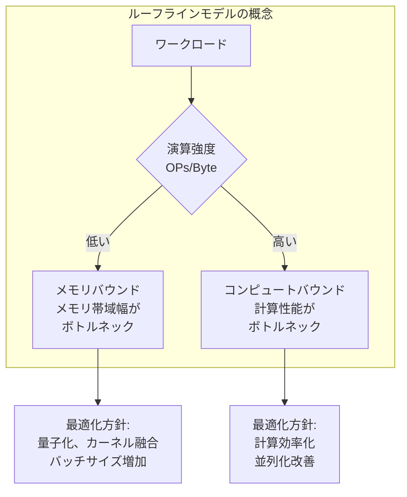

# ルーフラインモデルに関する情報（background.md から一時退避）

## ルーフラインモデルによる性能分析

大規模基盤モデルの学習では、メモリ帯域幅と計算性能という 2 つの要素が性能を決定します。ルーフラインモデル (Roofline Model) は、この 2 軸の関係を可視化し、どちらがボトルネックになっているかを判定する手法です。ルーフラインモデルの詳細は、[NVIDIA Nsight Compute によるパフォーマンス分析](https://developer.nvidia.com/blog/accelerating-hpc-applications-with-nsight-compute-roofline-analysis/)および [Hierarchical Roofline Analysis 論文 (arXiv:2009.05257)](https://arxiv.org/pdf/2009.05257) に記載されています。

演算強度 (Arithmetic Intensity) は、メモリアクセス 1 バイトあたりの演算回数 (OPs/Byte) として定義されます。演算強度が低い場合はメモリバウンド、高い場合はコンピュートバウンドとなります。深層学習の推論では、Prefill stage (初回入力処理) はコンピュートバウンド、Decode stage (逐次生成) はメモリバウンドになる傾向があります。このため、推論性能の最適化では Decode stage のメモリバウンド特性への対処が重要となります。

---

**Note:** このセクションはルーフラインモデルが単一ノード/GPU の性能分析手法であるため、大規模分散学習の文脈から一時的に削除しました。将来、単一ノードの最適化やカーネル性能分析の章で使用する可能性があります。
