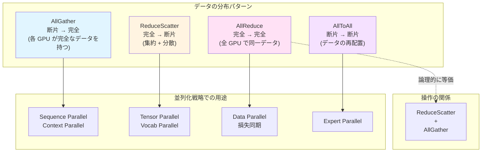
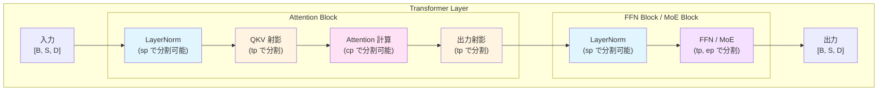
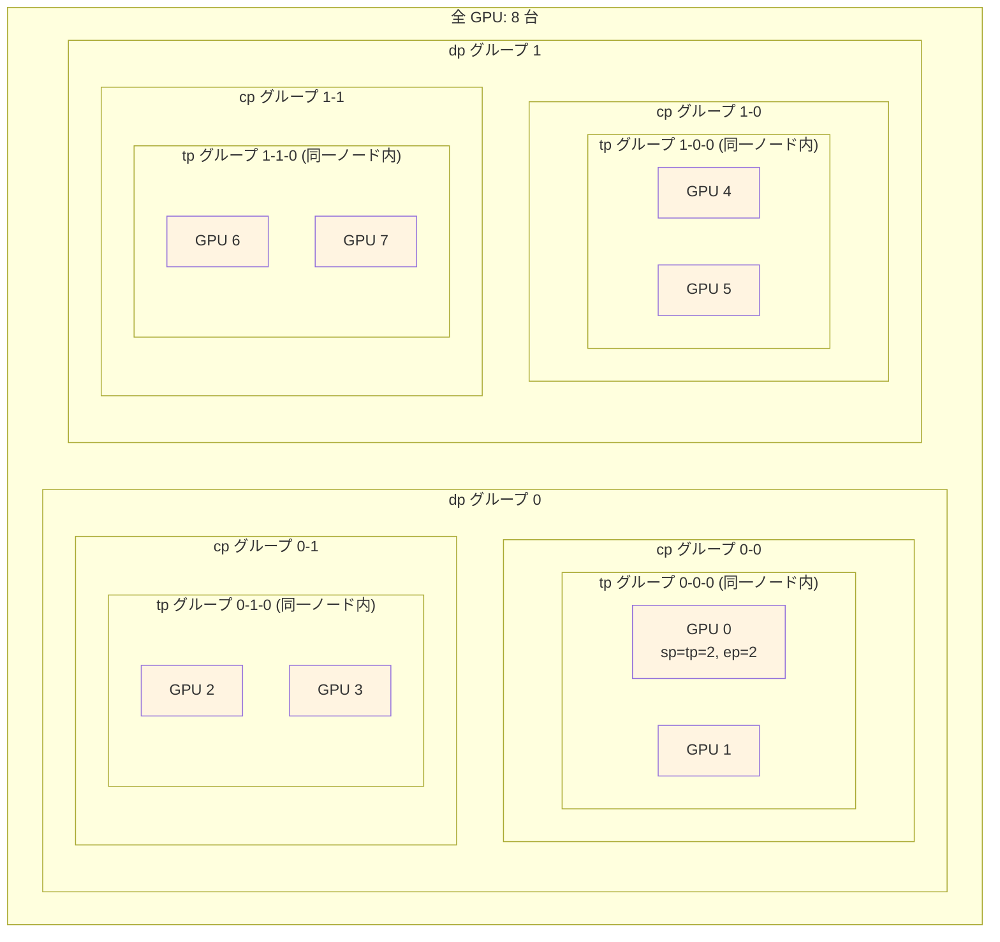

# Transformer の分散並列化を理解する

## はじめに

大規模言語モデル（LLM）の訓練や推論では、1 つの GPU にモデルやデータが収まりきらないことが一般的です。そこで必要となるのが**分散並列化**です。

本記事では、Transformer モデルを複数の GPU（デバイス）に分散して処理するための **6 つの並列化戦略** と、それらを支える **集団通信操作** を初学者向けに解説します。理論面に焦点を当て、「なぜその並列化が必要なのか」「何が分割されるのか」を段階的に理解できる構成になっています。

:::message
本記事は [ailzhang.github.io の記事](https://ailzhang.github.io/posts/distributed-compute-in-transformer/) の内容を参考に、日本語で再構成したものです。
:::

---

## 前提知識 -- Transformer のテンソル形状

Transformer の主要なテンソルは、以下の 3 つの次元を持ちます。

| 次元 | 記号 | 意味 |
|------|------|------|
| バッチサイズ | B | 同時に処理するサンプル数 |
| シーケンス長 | S | トークンの並び（文章の長さ） |
| 隠れ次元 | D | 各トークンの特徴ベクトルの大きさ |

1 つの GPU が保持するテンソルの形状は `[B, S, D]` が基本です。各並列化戦略の適用状況に応じて、特定の次元が分割されていきます。

以降のセクションで、各並列化がどの次元をどのように分割するかを詳しく見ていきます。

---

## 集団通信操作

並列化戦略を実現するためには、GPU 間でデータをやり取りする**集団通信操作**が不可欠です。ここでは、4 つの主要な操作を解説します。

### AllGather -- 断片を集めて全体を復元

各 GPU が持つデータの断片を全て集めて、全 GPU に完全なデータを構築します。

```
操作前:                    操作後:
  GPU 0: [A]                GPU 0: [A, B, C, D]
  GPU 1: [B]      --->      GPU 1: [A, B, C, D]
  GPU 2: [C]                GPU 2: [A, B, C, D]
  GPU 3: [D]                GPU 3: [A, B, C, D]
```

**用途** -- Sequence Parallel / Context Parallel でシーケンスを再構築する際に使用

---

### ReduceScatter -- 集約して分散

各 GPU のデータを要素ごとに集約（合計）し、結果を分割して各 GPU に配布します。AllGather の逆操作と考えることができます。

```
操作前:                         操作後:
  GPU 0: [a0, a1, a2, a3]        GPU 0: [a0+b0+c0+d0]
  GPU 1: [b0, b1, b2, b3]  --->  GPU 1: [a1+b1+c1+d1]
  GPU 2: [c0, c1, c2, c3]        GPU 2: [a2+b2+c2+d2]
  GPU 3: [d0, d1, d2, d3]        GPU 3: [a3+b3+c3+d3]
```

**用途** -- Tensor Parallel の出力を合算し、Sequence Parallel 形式に変換する際に使用

---

### AllToAll -- 全対全シャッフル

各 GPU が他の全 GPU にデータの一部を送り、全 GPU から一部を受け取ります。「行列の転置」のようなイメージです。

```
操作前:                         操作後:
  GPU 0: [a0, a1, a2, a3]        GPU 0: [a0, b0, c0, d0]
  GPU 1: [b0, b1, b2, b3]  --->  GPU 1: [a1, b1, c1, d1]
  GPU 2: [c0, c1, c2, c3]        GPU 2: [a2, b2, c2, d2]
  GPU 3: [d0, d1, d2, d3]        GPU 3: [a3, b3, c3, d3]
```

**用途** -- MoE の Expert Parallel で、トークンをエキスパートのいる GPU にルーティングする際に使用

---

### AllReduce -- 全 GPU での同期集約

各 GPU のデータを要素ごとに集約（合計）し、結果を全 GPU にコピーします。AllReduce は、論理的には「全 GPU の値を 1 つに集約（Reduce）してから全 GPU に配布（Broadcast）する」操作と等価です。実装上は ReduceScatter + AllGather として実行されることもあります。

```
操作前:                    操作後:
  GPU 0: [a]                GPU 0: [a+b+c+d]
  GPU 1: [b]      --->      GPU 1: [a+b+c+d]
  GPU 2: [c]                GPU 2: [a+b+c+d]
  GPU 3: [d]                GPU 3: [a+b+c+d]
```

**用途** -- 損失計算で全 GPU の損失値を同期する際、Data Parallel で勾配を同期する際に使用

以下の図は、4 つの集団通信操作の関係性と特徴を示しています。



**通信操作と並列化の対応表**:

| 集団通信操作 | 主な用途 | データフロー | 通信量 |
|------------|---------|------------|--------|
| AllGather | sp, cp でシーケンス再構築 | 断片 → 完全 | O(N) |
| ReduceScatter | tp, vp で結果を集約・分散 | 完全 → 断片 | O(N) |
| AllToAll | ep でトークンをルーティング | 断片 → 断片 | O(N) |
| AllReduce | dp で勾配同期、損失同期 | 完全 → 完全 | O(N) |

（N: GPU 数）

---

## Transformer の構成要素と並列化の関係

以下の図は、Transformer の主要な構成要素と、それぞれに適用される並列化戦略の対応を示しています。



**色分けの説明**:
- 水色: Sequence Parallel (sp) の適用対象（要素単位演算）
- 黄色: Tensor Parallel (tp) の適用対象（行列演算）
- ピンク: Context Parallel (cp) の適用対象（注意機構）
- 紫: Expert Parallel (ep) の適用対象（MoE 層）
- Data Parallel (dp) は全体のバッチを分割、Vocab Parallel (vp) は語彙埋め込み層に適用

---

## 6 つの並列化戦略

### 1. Data Parallel (dp) -- バッチの分割

**分割対象** -- バッチサイズ B

Data Parallel は最もシンプルな並列化戦略です。訓練データのミニバッチを複数の GPU に均等に分配し、各 GPU が独立に**順伝播**（モデルへの入力から出力までの計算）と**逆伝播**（損失から勾配を計算し、重みを更新する処理）を実行します。

```
全体バッチ: [B, S, D]
  ├─ GPU 0: [B/N, S, D]  ← バッチの 1/N を処理（N = GPU 数）
  ├─ GPU 1: [B/N, S, D]
  ├─ ...
  └─ GPU N-1: [B/N, S, D]
```

**動作の流れ**:

1. 全 GPU に同一のモデルのコピーを配置
2. ミニバッチを GPU 数 N で等分し、各 GPU に配布
3. 各 GPU が独立に順伝播と逆伝播を実行
4. 勾配を全 GPU で集約（AllReduce）し、同一の重み更新を適用

**利点**: 実装が簡単で、バッチサイズに比例してスループットが向上する（理想的な場合。実際には勾配同期の通信オーバーヘッドがある）

**制約**: モデル全体が各 GPU のメモリに収まる必要がある

---

### 2. Tensor Parallel (tp) -- 行列演算の分割

**分割対象** -- 重み行列の次元（注意機構のヘッドや FFN の中間次元）

Tensor Parallel は、個々の行列演算を複数の GPU に分割する手法です。1 つの大きな行列積を、複数の小さな行列積に分解して並列実行します。

**注意機構での例**:

Multi-Head Attention では、注意機構を複数の**ヘッド**（独立した注意計算のグループ）に分割します。各ヘッドは異なる表現空間で注意を計算し、最後に結合されます。これらのヘッドを GPU 間で分配できます。

```
全体の注意機構: num_heads = 32
  ├─ GPU 0: heads 0-7    (8 ヘッド分を担当)
  ├─ GPU 1: heads 8-15
  ├─ GPU 2: heads 16-23
  └─ GPU 3: heads 24-31
```

**FFN（Feed-Forward Network）での例**:

FFN の中間次元を分割します。中間次元のサイズは、従来の ReLU ベースの FFN では 4D が標準でしたが、SwiGLU などのゲート機構を持つアーキテクチャでは 8D/3 がよく使われます（これは 3 つの行列演算のうち 2 つを中間次元で使用するため、計算量を 4D と同等に保つための調整です）。

```
FFN の線形層: [D, 4D]  (ReLU FFN の場合) または [D, 8D/3] (SwiGLU の場合)
  ├─ GPU 0: [D, D]   ← 中間次元の 1/4 を担当
  ├─ GPU 1: [D, D]
  ├─ GPU 2: [D, D]
  └─ GPU 3: [D, D]
```

**利点**: モデルの重みを分散でき、単一 GPU のメモリ制約を超えられる

**制約**: 演算の前後に通信（AllGather や ReduceScatter）が必要

---

### 3. Sequence Parallel (sp) -- アクティベーションの分割

**分割対象** -- シーケンス次元 S（**要素単位演算**: 各要素に独立して同じ操作を適用する演算、における）

Tensor Parallel は行列演算部分（QKV 射影や FFN の線形層）の重みを分割しますが、**LayerNorm や Dropout などの要素単位演算には適用できません**。これらの層のアクティベーションメモリを削減するために、Sequence Parallel が Tensor Parallel と組み合わせて使用されます。

**重要な制約**: Sequence Parallel は Tensor Parallel と **同じ並列度（sp = tp）** を持ち、同一デバイスグループ内で動作します。つまり、sp は独立した並列化次元ではなく、tp のデバイスグループ内でアクティベーションの形状を切り替える仕組みです。

```
Tensor Parallel 適用区間:
  [B, S, D/tp]  ← 隠れ次元が分割されている

Sequence Parallel 適用区間（LayerNorm, Dropout など）:
  [B, S/sp, D]  ← シーケンスが分割されている（sp = tp）
```

**動作の流れ**:

1. LayerNorm 等の前: テンソルはシーケンス方向に分割 `[B, S/sp, D]`
2. Tensor Parallel 層に入る前: AllGather でシーケンスを再構築し `[B, S, D]`（sp 分割が解消された完全テンソル）
3. QKV 射影等の Tensor Parallel 演算を実行: `[B, S, D/tp]`（隠れ次元が tp で分割される）
4. Tensor Parallel 層を出た後: ReduceScatter でシーケンス方向に再分割 `[B, S/sp, D]`

以下の図は、Transformer Layer 内でのテンソル形状の切り替わりを示しています。

```mermaid
graph LR
    subgraph "要素単位演算区間 (入力)"
        LN1["LayerNorm<br/>[B, S/sp, D]"]
    end

    subgraph "通信 (AllGather)"
        AG1["AllGather"]
    end

    subgraph "Tensor Parallel 区間"
        QKV["QKV 射影<br/>[B, S, D/tp]"]
        Attn["Attention<br/>[B, S, D/tp]"]
        Out["出力射影<br/>[B, S, D/tp]"]
    end

    subgraph "通信 (ReduceScatter)"
        RS["ReduceScatter"]
    end

    subgraph "要素単位演算区間 (出力)"
        LN2["LayerNorm<br/>[B, S/sp, D]"]
    end

    LN1 -->|"シーケンス分割<br/>S/sp"| AG1
    AG1 -->|"シーケンス完全<br/>S"| QKV
    QKV --> Attn
    Attn --> Out
    Out -->|"隠れ次元分割<br/>D/tp"| RS
    RS -->|"シーケンス分割<br/>S/sp"| LN2

    style LN1 fill: #e1f5ff
    style LN2 fill: #e1f5ff
    style QKV fill: #fff4e1
    style Attn fill: #fff4e1
    style Out fill: #fff4e1
    style AG1 fill: #f0f0f0
    style RS fill: #f0f0f0
```



**形状変化のポイント**:
- 要素単位演算（LayerNorm）では `[B, S/sp, D]` でシーケンスが分割
- Tensor Parallel 演算（QKV, Attention）では `[B, S, D/tp]` で隠れ次元が分割
- AllGather と ReduceScatter で形状を相互変換（sp = tp なので同じデバイスグループ内）

**利点**: Tensor Parallel 単体では削減できないアクティベーションメモリを節約

**制約**: Tensor Parallel と同じデバイスグループ内で動作

---

### 4. Context Parallel (cp) -- 注意機構でのシーケンス分割

**分割対象** -- 注意機構内のシーケンス次元 S

Context Parallel は、非常に長いシーケンス（例: 128K トークン以上）を扱う際に有効です。注意機構の計算において、シーケンスを複数の GPU に分割して処理します。

```
入力シーケンス: S = 128K トークン
  ├─ GPU 0: トークン 0 - 32K     (Query: ローカル, KV: 全 GPU 分を収集)
  ├─ GPU 1: トークン 32K - 64K
  ├─ GPU 2: トークン 64K - 96K
  └─ GPU 3: トークン 96K - 128K
```

**動作の流れ**:

主要な実装方式として **Ring Attention** が用いられます。これは、GPU をリング状に接続し、KV を順次送受信しながら注意計算を進める方式です。

1. 各 GPU は、シーケンスの一部分に対応する Query を保持
2. リングトポロジーで隣接 GPU と KV ブロックを **P2P（Point-to-Point）送受信**
3. 受信した KV ブロックと自身の Query で部分的な注意計算を実行
4. すべての KV ブロックを順次処理することで、完全な注意スコアを計算
5. 結果はそのまま各 GPU のローカルな出力として保持

:::message
シンプルな実装では、AllGather で全 GPU から KV を一括収集する方式もあります。ただし、この場合は全 KV を同時にメモリに保持する必要があり、超長コンテキストではメモリ制約が厳しくなります。Ring Attention は通信と計算を重複させ、メモリ使用量を抑えられる点で優れています。
:::

**Sequence Parallel との違い**:

Sequence Parallel と Context Parallel はどちらもシーケンス方向の分割ですが、適用される場所が異なります。直感的には、Sequence Parallel は「LayerNorm などの軽い演算でメモリを節約するための分割」、Context Parallel は「注意機構という重い演算で長いシーケンスを処理するための分割」と理解できます。

| 項目 | Sequence Parallel (sp) | Context Parallel (cp) |
|------|------------------------|-----------------------|
| 分割される場所 | 要素単位演算（LayerNorm 等） | 注意機構の内部 |
| 組み合わせ先 | Tensor Parallel | 独立して適用可能 |
| 主な目的 | アクティベーションメモリ削減 | 長シーケンス対応 |
| 通信パターン | ReduceScatter / AllGather | AllGather（KV の収集） |

---

### 5. Expert Parallel (ep) -- MoE のエキスパート分散

**分割対象** -- Mixture of Experts (MoE) 層のエキスパート数 E

Expert Parallel は、MoE アーキテクチャ特有の並列化戦略です。MoE は**条件付き計算**（入力に応じて一部のパラメータのみを使う計算方式）を実現するアーキテクチャで、各エキスパート（小さな FFN ネットワーク）を異なる GPU に配置し、トークンを適切なエキスパートにルーティングします。

```
MoE 層: 8 エキスパート
  ├─ GPU 0: Expert 0, 1  ← 2 つのエキスパートを担当
  ├─ GPU 1: Expert 2, 3
  ├─ GPU 2: Expert 4, 5
  └─ GPU 3: Expert 6, 7

ルーティング:
  トークン A → Expert 3 (GPU 1 へ送信)
  トークン B → Expert 7 (GPU 3 へ送信)
  トークン C → Expert 0 (GPU 0 へ送信)
```

**動作の流れ**:

1. Router がトークンごとに担当エキスパートを決定
2. AllToAll 通信でトークンを担当エキスパートのいる GPU にシャッフル
3. 各 GPU が自身のエキスパートでトークンを処理
4. AllToAll 通信で処理済みトークンを元の GPU に返却

**利点**: エキスパート数を増やしてもデバイスあたりの計算量が増えない（条件付き計算）

**制約**: AllToAll 通信のオーバーヘッドがある

---

### 6. Vocab Parallel (vp) -- 語彙テーブルの分割

**分割対象** -- 埋め込みテーブルの語彙次元 V

Vocab Parallel は、大規模な語彙を持つモデルの埋め込み層を分割する手法です。語彙サイズが大きい場合（例: 100K 以上）、埋め込みテーブルのメモリ使用量が無視できなくなります。

```
埋め込みテーブル: [V, D] (例: V=128K, D=4096)
  ├─ GPU 0: [V/4, D]  ← 語彙 0 - 32K を担当
  ├─ GPU 1: [V/4, D]  ← 語彙 32K - 64K を担当
  ├─ GPU 2: [V/4, D]  ← 語彙 64K - 96K を担当
  └─ GPU 3: [V/4, D]  ← 語彙 96K - 128K を担当
```

**動作の流れ**:

1. 各 GPU は語彙テーブルの一部のみを保持
2. トークン ID に基づき、該当する GPU から埋め込みベクトルを取得
3. 後続の Sequence Parallel 形式に合わせるため、AllReduce ではなく ReduceScatter を使用し、合算と同時にシーケンス方向の分割を行う

**利点**: 大規模語彙のメモリ使用量を削減

**制約**: 語彙サイズが GPU 数で割り切れる必要がある（パディングで対応可能）

---

## Transformer コンポーネントごとの並列化

ここからは実際の Transformer の処理フローに沿って、各並列化がどのタイミングで適用されるかを確認します。前のセクションで学んだ知識の復習と統合を目的としています。

### 埋め込み層 (Embedding)

```
入力トークン ID: [B/dp, S/(cp*sp)]
          |
          v
   [Vocab Parallel] 語彙テーブルを分割して参照
          |
          v
   部分埋め込み: [B/dp, S/(cp*sp), D]  (各 GPU は語彙の一部分のみ)
          |
          v
   [ReduceScatter] 部分結果を合算 + シーケンス方向に分散
          |
          v
   出力: [B/dp, S/(cp*sp), D]  (Sequence Parallel 形式)
```

---

### 注意機構 (Attention)

```
入力: [B/dp, S/(cp*sp), D]  (Sequence Parallel 形式)
          |
          v
   [AllGather] シーケンスを再構築
          |
          v
   完全シーケンス: [B/dp, S/cp, D]
          |
          v
   [Tensor Parallel] QKV 射影を分割
          |
          v
   Q,K,V: [B/dp, S/cp, D/tp]  (ヘッドが分割されている)
          |
          v
   [Context Parallel] KV を AllGather で収集
          |
          v
   注意計算: Q(ローカル) x K,V(全体)
          |
          v
   出力射影: [Tensor Parallel]
          |
          v
   [ReduceScatter] シーケンス方向に再分割
          |
          v
   出力: [B/dp, S/(cp*sp), D]  (Sequence Parallel 形式に復帰)
```

---

### MLP (Feed-Forward Network)

```
入力: [B/dp, S/(cp*sp), D]  (Sequence Parallel 形式)
          |
          v
   [AllGather] シーケンスを再構築
          |
          v
   [Tensor Parallel - 列分割] 第 1 線形層 W1: [D, 4D/tp]
          |
          v
   活性化関数 (GeLU 等)
          |
          v
   [Tensor Parallel - 行分割] 第 2 線形層 W2: [4D/tp, D]
          |
          v
   [ReduceScatter] シーケンス方向に再分割
          |
          v
   出力: [B/dp, S/(cp*sp), D]  (Sequence Parallel 形式に復帰)
```

Tensor Parallel の「列分割 → 行分割」のサンドイッチ構造がポイントです。第 1 線形層で中間次元を分割し、第 2 線形層で元の次元に戻します。この構成により、層間の通信を最小限に抑えられます。

---

### MoE (Mixture of Experts)

```
入力: [B/dp, S/(cp*sp), D]
          |
          v
   Router: トークンごとにエキスパートを選択
          |
          v
   [AllToAll] トークンを担当エキスパートの GPU にシャッフル
          |
          v
   各 GPU: 自身のエキスパートでトークンを処理
          |
          v
   [AllToAll] 処理済みトークンを元の GPU に返却
          |
          v
   出力: [B/dp, S/(cp*sp), D]
```

MoE は AllToAll という独特の通信パターンを使用します。他の並列化が「同じデータの異なる部分」を分散するのに対し、MoE は「異なるトークンを異なるエキスパートに動的にルーティング」する点が特徴的です。

---

### 損失計算 (Loss)

```
ロジット: [B/dp, S/(cp*sp), V/vp]  (Vocab Parallel により語彙が分割)
          |
          v
   各 GPU で部分的な損失を計算
          |
          v
   [AllReduce] 全 GPU で損失値を同期
          |
          v
   最終損失: スカラー値（全 GPU で同一）
```

**Vocab Parallel 適用時の softmax 安定化**:

Vocab Parallel で語彙が分割されている場合、softmax の数値安定性を保つために特別な通信パターンが必要です。

```
1. [AllReduce(max)] 各 GPU のローカル logit の最大値を全 GPU で同期
   → 全語彙における真の最大値を取得

2. ローカルで最大値を引いた exp(logit - max) を計算

3. [AllReduce(sum)] exp 値の合計を全 GPU で同期
   → 分母（partition function）を取得

4. ローカルで softmax と損失を計算
```

この手順により、全 GPU が同じ softmax 分母を使用でき、数値的に安定した損失計算が可能になります。

---

## 並列化戦略の組み合わせと全体像

実際の大規模モデルの訓練では、これらの並列化戦略を**組み合わせて**使用します。全ての並列化を適用した場合、1 つの GPU が保持するローカルテンソルの形状は次のようになります。

```
ローカルテンソル形状: [B/dp, S/(cp*sp), D]
```

- `B/dp` -- バッチが Data Parallel で分割される
- `S/(cp*sp)` -- シーケンスが Context Parallel と Sequence Parallel で分割される
- `D` -- 隠れ次元は各 GPU で完全に保持される（Tensor Parallel は重み行列側を分割する）

以下に、各並列化が Transformer のどのコンポーネントに影響するかをまとめます。

| コンポーネント | dp | tp | sp | cp | ep | vp | 主な通信 |
|---------------|-----|-----|-----|-----|-----|-----|---------|
| Embedding     | o   |     |     |     |     | o   | ReduceScatter |
| LayerNorm     | o   |     | o   |     |     |     | -- |
| Attention     | o   | o   | o   | o   |     |     | AllGather, ReduceScatter |
| MLP           | o   | o   | o   |     |     |     | AllGather, ReduceScatter |
| MoE           | o   |     |     |     | o   |     | AllToAll |
| Loss          | o   |     |     |     |     | o   | AllReduce |

各戦略の**デバイスグループ**は通常、異なるスケールで構成されます。

```
典型的な構成（64 GPU の場合）:
  総 GPU 数 = dp x tp x cp = 8 x 4 x 2 = 64

  dp = 8   (データ並列度: 8 グループ)
  tp = 4   (テンソル並列度: ノード内の高速接続を活用)
  sp = 4   (tp と同じグループ内で動作)
  cp = 2   (文脈並列度)
  ep = 8   (エキスパート並列度: MoE 使用時。dp のグループを再利用することが多く（ep=dp）、独立したデバイス次元を追加するわけではない)
  vp = 4   (tp と同じグループ内で動作)

注: sp, vp は tp と同じデバイスグループで動作するため、
独立した並列度としてカウントされません。
```

**重要な設計原則**: Tensor Parallel はデバイス間の通信頻度が高いため、NVLink などの高速接続を持つ同一ノード内の GPU に割り当てます。Data Parallel はノード間でも問題なく動作します。

以下の図は、8 GPU を使った場合のデバイスグループ階層の例を示しています。



**階層構造の説明**:
- dp = 2 -- データを 2 グループに分割（dp グループ 0, 1）
- cp = 2 -- 各 dp グループ内でシーケンスを 2 分割（cp グループ 0-0, 0-1 など）
- tp = 2 -- 各 cp グループ内でテンソルを 2 分割（同一ノード内の GPU ペア）
- sp = tp = 2 -- tp と同じグループ内で動作
- ep = 2 -- MoE 使用時、dp グループを再利用（GPU 0 と GPU 4 が異なるエキスパートを担当）

この構成では、総 GPU 数 = dp x cp x tp = 2 x 2 x 2 = 8 となります。

---

## まとめ

本記事では、Transformer の分散並列化について以下を解説しました。

**6 つの並列化戦略**:

1. **Data Parallel (dp)**: バッチを分割。最もシンプルで基本的
2. **Tensor Parallel (tp)**: 重み行列を分割。モデル並列化の中核
3. **Sequence Parallel (sp)**: アクティベーションのシーケンスを分割。tp と組み合わせて使用
4. **Context Parallel (cp)**: 注意機構内のシーケンスを分割。長コンテキスト対応
5. **Expert Parallel (ep)**: MoE のエキスパートを分散。条件付き計算の並列化
6. **Vocab Parallel (vp)**: 語彙テーブルを分割。大語彙モデルのメモリ効率化

**4 つの集団通信操作**:

1. **AllGather**: 断片を集めて全体を復元
2. **ReduceScatter**: 集約して分散
3. **AllToAll**: 全対全シャッフル（MoE で使用）
4. **AllReduce**: 全 GPU での同期集約

分散並列化は、大規模モデルの訓練と推論を可能にする基盤技術です。各戦略がどの次元を分割し、どのような通信パターンを必要とするかを理解することで、効率的なモデル並列化の設計が可能になります。

---

## 参考文献

- [Distributed Compute in Transformer (ailzhang)](https://ailzhang.github.io/posts/distributed-compute-in-transformer/)
- [Megatron-LM: Training Multi-Billion Parameter Language Models Using Model Parallelism](https://arxiv.org/abs/1909.08053)
- [Reducing Activation Recomputation in Large Transformer Models](https://arxiv.org/abs/2205.05198) -- 本記事で解説する Megatron-LM 版 Sequence Parallelism
- [Sequence Parallelism: Long Sequence Training from System Perspective](https://arxiv.org/abs/2105.13120) -- Ring-based アプローチの Sequence Parallelism（別手法）
- [Ring Attention with Blockwise Transformers for Near-Infinite Context](https://arxiv.org/abs/2310.01889)
- [Switch Transformers: Scaling to Trillion Parameter Models with Simple and Efficient Sparsity](https://arxiv.org/abs/2101.03961)

