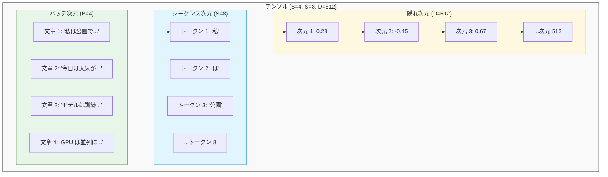
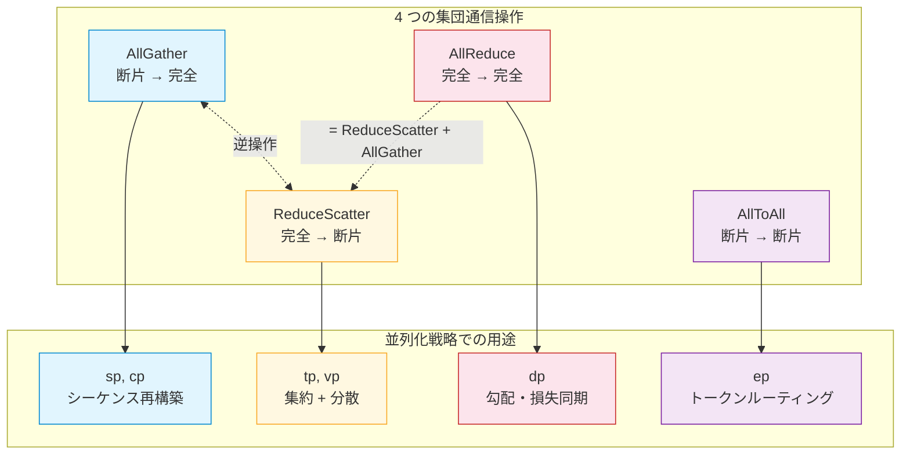
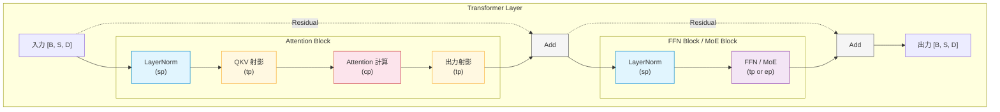
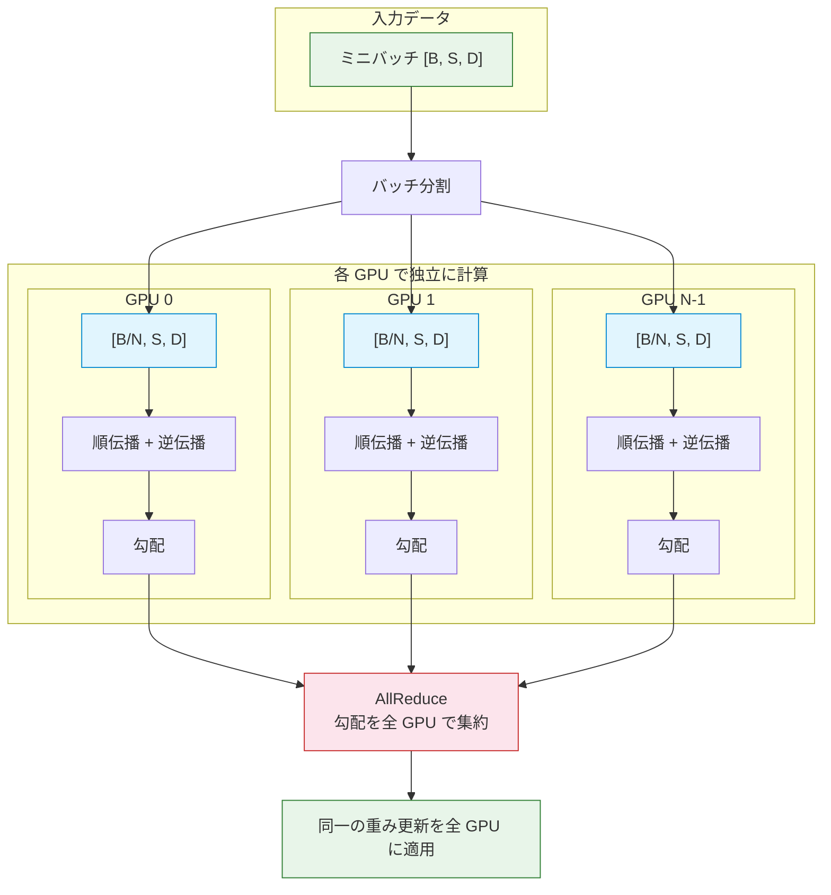
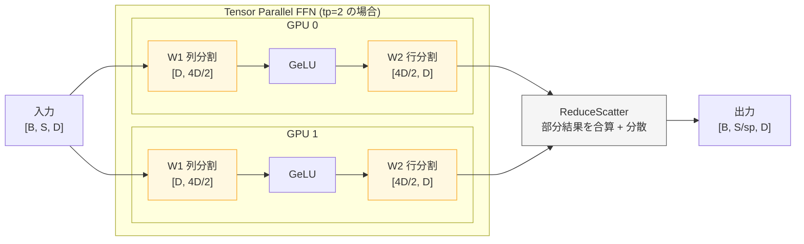
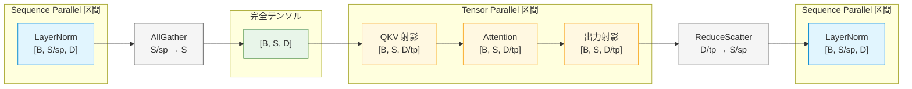
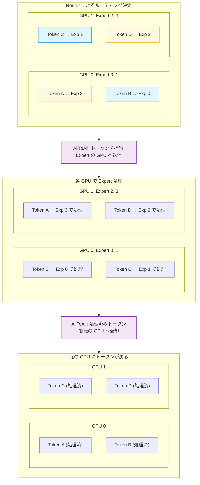
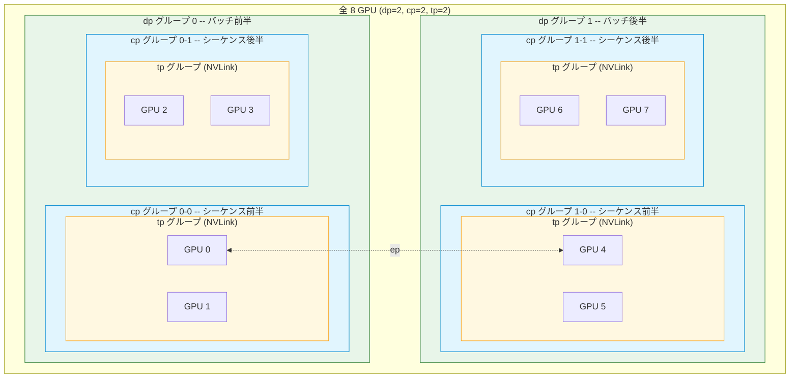

## はじめに

:::message
**記事の目的**: 本記事では、Transformer モデルの分散並列化を支える 6 つの並列化戦略と 4 つの集団通信操作を初学者向けに解説します。「なぜその並列化が必要なのか」「何が分割されるのか」を段階的に理解できる構成を目指しています。
:::

大規模言語モデル（LLM）の訓練や推論では、1 つの GPU にモデルやデータが収まりきらないことが一般的です。そこで必要となるのが**分散並列化**です。本記事では、**6 つの並列化戦略**と**集団通信操作**について、理論面に焦点を当てて解説します。

:::message alert
本記事で扱う 6 つの並列化戦略は、Data Parallel、Tensor Parallel、Sequence Parallel、Context Parallel、Expert Parallel、Vocab Parallel です。なお、Pipeline Parallelism（モデルの層を複数の GPU に分割してパイプライン処理する手法）は本記事の範囲外です。Pipeline Parallelism については [GPipe 論文](https://arxiv.org/abs/1811.06965) や [PipeDream 論文](https://arxiv.org/abs/1806.03377) を参照してください。
:::

## 前提知識 -- Transformer のテンソル形状

Transformer の主要なテンソルは、以下の 3 つの次元を持ちます。

| 次元 | 記号 | 意味 |
|------|------|------|
| バッチサイズ | B | 同時に処理するサンプル数 |
| シーケンス長 | S | トークンの並び（文章の長さ） |
| 隠れ次元 | D | 各トークンの特徴ベクトルの大きさ |

1 つの GPU が保持するテンソルの形状は `[B, S, D]` が基本です。各並列化戦略の適用状況に応じて、特定の次元が分割されていきます。

:::details 具体例: テンソル形状のイメージ

例えば、以下のような具体的な設定を考えます。

- **バッチサイズ B=4**: 4 つの文章を同時に処理
- **シーケンス長 S=8**: 各文章が 8 トークンで構成（例: 「私は公園で犬を見た。」）
- **隠れ次元 D=512**: 各トークンを 512 次元のベクトルで表現

この場合、テンソルの形状は `[4, 8, 512]` となり、4 × 8 × 512 = 16,384 個の数値を含む 3 次元配列になります。


```mermaid
graph TB
    subgraph tensor ["テンソル [B=4, S=8, D=512]"]
        subgraph batch ["バッチ次元 (B=4)"]
            B1["文章 1: '私は公園で...'"]
            B2["文章 2: '今日は天気が...'"]
            B3["文章 3: 'モデルは訓練...'"]
            B4["文章 4: 'GPU は並列に...'"]
        end

        subgraph seq ["シーケンス次元 (S=8)"]
            S1["トークン 1: '私'"]
            S2["トークン 2: 'は'"]
            S3["トークン 3: '公園'"]
            S8["...トークン 8"]
        end

        subgraph hidden ["隠れ次元 (D=512)"]
            D1["次元 1: 0.23"]
            D2["次元 2: -0.45"]
            D3["次元 3: 0.67"]
            D512["...次元 512"]
        end

        B1 --> S1
        S1 --> D1
        D1 -.-> D2
        D2 -.-> D3
        D3 -.-> D512
    end

    style tensor fill: #f9f9f9,stroke: #333,stroke-width:2px
    style batch fill: #e8f5e9,stroke: #2e7d32
    style seq fill: #e1f5fe,stroke: #0288d1
    style hidden fill: #fff8e1,stroke: #f9a825
```

**各次元の役割**:
- **B（バッチ）**: データ並列化で分割される次元。異なる文章を同時に処理することで学習を高速化
- **S（シーケンス）**: 文章内のトークンの位置。長いシーケンスを扱う際に分割の対象となる
- **D（隠れ）**: 各トークンの特徴表現。大きいほど表現力が高いが、メモリ消費も増加

:::

以降のセクションで、各並列化がどの次元をどのように分割するかを詳しく見ていきます。

## 集団通信操作

並列化戦略を実現するためには、GPU 間でデータをやり取りする**集団通信操作**が不可欠です。ここでは、4 つの主要な操作を解説します。

### AllGather -- 断片を集めて全体を復元

各 GPU が持つデータの断片を全て集めて、全 GPU に完全なデータを構築します。

```
操作前:                    操作後:
  GPU 0: [A]                GPU 0: [A, B, C, D]
  GPU 1: [B]      --->      GPU 1: [A, B, C, D]
  GPU 2: [C]                GPU 2: [A, B, C, D]
  GPU 3: [D]                GPU 3: [A, B, C, D]
```

**用途** -- Sequence Parallel / Context Parallel でシーケンスを再構築する際に使用

---

### ReduceScatter -- 集約して分散

各 GPU のデータを要素ごとに集約（合計）し、結果を分割して各 GPU に配布します。AllGather の逆操作と考えることができます。

```
操作前:                         操作後:
  GPU 0: [a0, a1, a2, a3]        GPU 0: [a0+b0+c0+d0]
  GPU 1: [b0, b1, b2, b3]  --->  GPU 1: [a1+b1+c1+d1]
  GPU 2: [c0, c1, c2, c3]        GPU 2: [a2+b2+c2+d2]
  GPU 3: [d0, d1, d2, d3]        GPU 3: [a3+b3+c3+d3]
```

**用途** -- Tensor Parallel の出力を合算し、Sequence Parallel 形式に変換する際に使用

---

### AllToAll -- 全対全シャッフル

各 GPU が他の全 GPU にデータの一部を送り、全 GPU から一部を受け取ります。「行列の転置」のようなイメージです。

```
操作前:                         操作後:
  GPU 0: [a0, a1, a2, a3]        GPU 0: [a0, b0, c0, d0]
  GPU 1: [b0, b1, b2, b3]  --->  GPU 1: [a1, b1, c1, d1]
  GPU 2: [c0, c1, c2, c3]        GPU 2: [a2, b2, c2, d2]
  GPU 3: [d0, d1, d2, d3]        GPU 3: [a3, b3, c3, d3]
```

**用途** -- Mixture of Experts（MoE）の Expert Parallel で、トークンをエキスパートのいる GPU にルーティングする際に使用

---

### AllReduce -- 全 GPU での同期集約

各 GPU のデータを要素ごとに集約（合計）し、結果を全 GPU にコピーします。AllReduce は、論理的には ReduceScatter（集約 + 分散）の後に AllGather（断片を集めて全体を復元）を実行する操作と等価です。つまり、AllReduce = ReduceScatter + AllGather と分解できます。実装上もこの分解が使われることがあり、特に Tensor Parallel と Sequence Parallel の切り替え時にはこの関係が重要になります。

```
操作前:                    操作後:
  GPU 0: [a]                GPU 0: [a+b+c+d]
  GPU 1: [b]      --->      GPU 1: [a+b+c+d]
  GPU 2: [c]                GPU 2: [a+b+c+d]
  GPU 3: [d]                GPU 3: [a+b+c+d]
```

**用途** -- 損失計算で全 GPU の損失値を同期する際、Data Parallel で勾配を同期する際に使用

以下の図は、4 つの集団通信操作の関係性と特徴を示しています。


```mermaid
graph TB
    subgraph collective ["4 つの集団通信操作"]
        AG["AllGather<br/>断片 → 完全"]
        RS["ReduceScatter<br/>完全 → 断片"]
        AR["AllReduce<br/>完全 → 完全"]
        A2A["AllToAll<br/>断片 → 断片"]
    end

    AG <-.->|"逆操作"| RS
    AR -.->|"= ReduceScatter + AllGather"| RS

    subgraph usage ["並列化戦略での用途"]
        AGUSE["sp, cp<br/>シーケンス再構築"]
        RSUSE["tp, vp<br/>集約 + 分散"]
        ARUSE["dp<br/>勾配・損失同期"]
        A2AUSE["ep<br/>トークンルーティング"]
    end

    AG --> AGUSE
    RS --> RSUSE
    AR --> ARUSE
    A2A --> A2AUSE

    style AG fill: #e1f5fe,stroke: #0288d1
    style RS fill: #fff8e1,stroke: #f9a825
    style AR fill: #fce4ec,stroke: #c62828
    style A2A fill: #f3e5f5,stroke: #7b1fa2
    style AGUSE fill: #e1f5fe,stroke: #0288d1
    style RSUSE fill: #fff8e1,stroke: #f9a825
    style ARUSE fill: #fce4ec,stroke: #c62828
    style A2AUSE fill: #f3e5f5,stroke: #7b1fa2
```

:::message
各操作の通信量はデータサイズやアルゴリズム（Ring, Tree 等）によって異なります。例えば Ring AllReduce では各 GPU が送受信するデータ量は `2 * (N-1) / N * M`（M: メッセージサイズ、N: GPU 数）となり、GPU 数が増えても 1 GPU あたりの通信量はほぼ一定です。詳細は [NCCL のドキュメント](https://docs.nvidia.com/deeplearning/nccl/user-guide/docs/usage/collectives.html) を参照してください。
:::

---

## Transformer の構成要素と並列化の関係

以下の図は、Transformer の主要な構成要素と、それぞれに適用される並列化戦略の対応を示しています。


```mermaid
graph TB
    subgraph layer ["Transformer Layer"]
        Input["入力 [B, S, D]"]

        subgraph attn_block ["Attention Block"]
            LN1["LayerNorm<br/>(sp)"]
            QKV["QKV 射影<br/>(tp)"]
            Attn["Attention 計算<br/>(cp)"]
            OutProj["出力射影<br/>(tp)"]
        end

        subgraph ffn_block ["FFN Block / MoE Block"]
            LN2["LayerNorm<br/>(sp)"]
            FFN["FFN / MoE<br/>(tp or ep)"]
        end

        Input --> LN1
        Input -.->|"Residual"| Add1
        LN1 --> QKV --> Attn --> OutProj --> Add1["Add"]
        Add1 --> LN2
        Add1 -.->|"Residual"| Add2
        LN2 --> FFN --> Add2["Add"]
        Add2 --> Output["出力 [B, S, D]"]
    end

    style LN1 fill: #e1f5fe,stroke: #0288d1
    style LN2 fill: #e1f5fe,stroke: #0288d1
    style QKV fill: #fff8e1,stroke: #f9a825
    style OutProj fill: #fff8e1,stroke: #f9a825
    style Attn fill: #fce4ec,stroke: #c62828
    style FFN fill: #f3e5f5,stroke: #7b1fa2
    style Add1 fill: #f5f5f5,stroke: #616161
    style Add2 fill: #f5f5f5,stroke: #616161
```

図中の色分けは次の通りです。水色は Sequence Parallel（sp）の適用対象である要素単位演算、黄色は Tensor Parallel（tp）の適用対象である行列演算、ピンクは Context Parallel（cp）の適用対象である注意機構、紫は Expert Parallel（ep）の適用対象である MoE 層を表しています。Data Parallel（dp）は全体のバッチを分割し、Vocab Parallel（vp）は語彙埋め込み層に適用されます。

---

## 6 つの並列化戦略

### 1. Data Parallel (dp) -- バッチの分割

**分割対象** -- バッチサイズ B

Data Parallel は最もシンプルな並列化戦略です。訓練データのミニバッチを複数の GPU に均等に分配し、各 GPU が独立に**順伝播**（モデルへの入力から出力までの計算）と**逆伝播**（損失から勾配を計算し、重みを更新する処理）を実行します。

各 GPU がミニバッチの一部（B/N）を処理し、勾配を AllReduce で集約します。以下の図に処理フローを示します。


```mermaid
graph TB
    subgraph input ["入力データ"]
        Batch["ミニバッチ [B, S, D]"]
    end

    Batch --> Split["バッチ分割"]

    subgraph gpus ["各 GPU で独立に計算"]
        subgraph g0 ["GPU 0"]
            D0["[B/N, S, D]"]
            F0["順伝播 + 逆伝播"]
            Grad0["勾配"]
            D0 --> F0 --> Grad0
        end
        subgraph g1 ["GPU 1"]
            D1["[B/N, S, D]"]
            F1["順伝播 + 逆伝播"]
            Grad1["勾配"]
            D1 --> F1 --> Grad1
        end
        subgraph g2 ["GPU N-1"]
            D2["[B/N, S, D]"]
            F2["順伝播 + 逆伝播"]
            Grad2["勾配"]
            D2 --> F2 --> Grad2
        end
    end

    Split --> D0
    Split --> D1
    Split --> D2

    Grad0 & Grad1 & Grad2 --> AR["AllReduce<br/>勾配を全 GPU で集約"]
    AR --> Update["同一の重み更新を全 GPU に適用"]

    style Batch fill: #e8f5e9,stroke: #2e7d32
    style AR fill: #fce4ec,stroke: #c62828
    style Update fill: #e8f5e9,stroke: #2e7d32
    style D0 fill: #e1f5fe,stroke: #0288d1
    style D1 fill: #e1f5fe,stroke: #0288d1
    style D2 fill: #e1f5fe,stroke: #0288d1
```

**利点**: 実装が簡単で、バッチサイズに比例してスループットが向上します（理想的な場合。実際には勾配同期の通信オーバーヘッドがあります）。

**制約**: モデル全体が各 GPU のメモリに収まる必要があります。

---

### 2. Tensor Parallel (tp) -- 行列演算の分割

**分割対象** -- 重み行列の次元（注意機構のヘッドや FFN の中間次元）

Tensor Parallel は、個々の行列演算を複数の GPU に分割する手法です。[Megatron-LM 論文（Shoeybi et al., 2019）](https://arxiv.org/abs/1909.08053) で提案されたこの手法は、1 つの大きな行列積を複数の小さな行列積に分解して並列実行します。

**注意機構での分割**

Multi-Head Attention（MHA）では、注意機構を複数の**ヘッド**（独立した注意計算のグループ）に分割します。各ヘッドは異なる表現空間で注意を計算し、最後に結合されます。これらのヘッドを GPU 間で分配できます。

```
全体の注意機構: num_heads = 32
  ├─ GPU 0: heads 0-7    (8 ヘッド分を担当)
  ├─ GPU 1: heads 8-15
  ├─ GPU 2: heads 16-23
  └─ GPU 3: heads 24-31
```

**FFN（Feed-Forward Network）での分割**

FFN の中間次元を分割します。中間次元のサイズは FFN の設計によって異なります。ReLU ベースの FFN では中間次元が 4D となるのが標準的です。一方、[GLU Variants 論文（Shazeer, 2020）](https://arxiv.org/abs/2002.05202) で提案された SwiGLU などのゲート機構を持つアーキテクチャでは、ゲート射影（gate projection）とアップ射影（up projection）の 2 つの行列が中間次元方向に存在します。計算量（パラメータ数）を ReLU FFN と同等に保つため、中間次元は 8D/3 に設定されることが一般的です。

```
ReLU FFN の場合:
  第 1 線形層: [D, 4D]   → 4 GPU で分割 → 各 GPU: [D, D]
  第 2 線形層: [4D, D]   → 4 GPU で分割 → 各 GPU: [D, D]

SwiGLU FFN の場合:
  ゲート射影:   [D, 8D/3] → 4 GPU で分割 → 各 GPU: [D, 2D/3]
  アップ射影:   [D, 8D/3] → 4 GPU で分割 → 各 GPU: [D, 2D/3]
  ダウン射影:   [8D/3, D] → 4 GPU で分割 → 各 GPU: [2D/3, D]
```

以下の図は、Tensor Parallel の FFN における列分割・行分割の仕組みを示しています。第 1 線形層（W1）は中間次元の方向に列分割し、第 2 線形層（W2）は中間次元の方向に行分割します。


```mermaid
graph LR
    Input["入力<br/>[B, S, D]"]

    subgraph tp_ffn ["Tensor Parallel FFN (tp=2 の場合)"]
        subgraph gpu0 ["GPU 0"]
            W1_0["W1 列分割<br/>[D, 4D/2]"]
            Act0["GeLU"]
            W2_0["W2 行分割<br/>[4D/2, D]"]
            W1_0 --> Act0 --> W2_0
        end
        subgraph gpu1 ["GPU 1"]
            W1_1["W1 列分割<br/>[D, 4D/2]"]
            Act1["GeLU"]
            W2_1["W2 行分割<br/>[4D/2, D]"]
            W1_1 --> Act1 --> W2_1
        end
    end

    Input --> W1_0
    Input --> W1_1
    W2_0 & W2_1 --> RS["ReduceScatter<br/>部分結果を合算 + 分散"]
    RS --> Output["出力<br/>[B, S/sp, D]"]

    style W1_0 fill: #fff8e1,stroke: #f9a825
    style W1_1 fill: #fff8e1,stroke: #f9a825
    style W2_0 fill: #fff8e1,stroke: #f9a825
    style W2_1 fill: #fff8e1,stroke: #f9a825
    style RS fill: #f5f5f5,stroke: #616161
```

**利点**: モデルの重みを分散でき、単一 GPU のメモリ制約を超えられます。

**制約**: 演算の前後に通信（AllGather や ReduceScatter）が必要です。

---

### 3. Sequence Parallel (sp) -- アクティベーションの分割

**分割対象** -- シーケンス次元 S（**要素単位演算**: 各要素に独立して同じ操作を適用する演算、における）

Tensor Parallel は行列演算部分（QKV 射影や FFN の線形層）の重みを分割しますが、**LayerNorm や Dropout などの要素単位演算には適用できません**。これらの層のアクティベーションメモリを削減するために、[Korthikanti et al.（2022）](https://arxiv.org/abs/2205.05198) が提案した Sequence Parallel が Tensor Parallel と組み合わせて使用されます。

**重要な制約**: Sequence Parallel は Tensor Parallel と **同じ並列度（sp = tp）** を持ち、同一デバイスグループ内で動作します。つまり、sp は独立した並列化次元ではなく、tp のデバイスグループ内でアクティベーションの形状を切り替える仕組みです。

Tensor Parallel 層（QKV 射影など）では `[B, S, D/tp]` で隠れ次元が分割され、要素単位演算（LayerNorm など）では `[B, S/sp, D]` でシーケンスが分割されます。以下の図に、Transformer Layer 内でのテンソル形状の切り替わりを示します。


```mermaid
graph LR
    subgraph sp_in ["Sequence Parallel 区間"]
        LN1["LayerNorm<br/>[B, S/sp, D]"]
    end

    AG1["AllGather<br/>S/sp → S"]

    subgraph full ["完全テンソル"]
        Full["[B, S, D]"]
    end

    subgraph tp_region ["Tensor Parallel 区間"]
        QKV["QKV 射影<br/>[B, S, D/tp]"]
        Attn["Attention<br/>[B, S, D/tp]"]
        Out["出力射影<br/>[B, S, D/tp]"]
    end

    RS["ReduceScatter<br/>D/tp → S/sp"]

    subgraph sp_out ["Sequence Parallel 区間"]
        LN2["LayerNorm<br/>[B, S/sp, D]"]
    end

    LN1 --> AG1 --> Full --> QKV --> Attn --> Out --> RS --> LN2

    style LN1 fill: #e1f5fe,stroke: #0288d1
    style LN2 fill: #e1f5fe,stroke: #0288d1
    style Full fill: #e8f5e9,stroke: #2e7d32
    style QKV fill: #fff8e1,stroke: #f9a825
    style Attn fill: #fff8e1,stroke: #f9a825
    style Out fill: #fff8e1,stroke: #f9a825
    style AG1 fill: #f5f5f5,stroke: #616161
    style RS fill: #f5f5f5,stroke: #616161
```

**利点**: Tensor Parallel 単体では削減できないアクティベーションメモリを節約できます。

**制約**: Tensor Parallel と同じデバイスグループ内で動作します。

---

### 4. Context Parallel (cp) -- 注意機構でのシーケンス分割

**分割対象** -- 注意機構内のシーケンス次元 S

Context Parallel は、非常に長いシーケンス（例: 128K トークン以上）を扱う際に有効です。注意機構の計算において、シーケンスを複数の GPU に分割して処理します。

```
入力シーケンス: S = 128K トークン
  ├─ GPU 0: トークン 0 - 32K     (Query: ローカル, KV: 全 GPU 分を収集)
  ├─ GPU 1: トークン 32K - 64K
  ├─ GPU 2: トークン 64K - 96K
  └─ GPU 3: トークン 96K - 128K
```

主要な実装方式として [Ring Attention（Liu et al., 2023）](https://arxiv.org/abs/2310.01889) が用いられます。Ring Attention では、GPU をリング状に接続し、KV ブロックを隣接 GPU 間で順次送受信しながら注意計算を進めます。各 GPU はシーケンスの一部分に対応する Query を保持し、リングトポロジーで隣接 GPU と KV ブロックを P2P（Point-to-Point）送受信します。受信した KV ブロックと自身の Query で部分的な注意計算を実行し、これをリング上の全 GPU からの KV ブロックについて繰り返すことで、完全な注意スコアを算出します。この方式の利点は、通信と計算をパイプライン的に重複（overlap）させられる点にあり、全 KV を同時にメモリに保持する必要がないため、メモリ使用量を抑えられます。

:::message
シンプルな実装では、AllGather で全 GPU から KV を一括収集する方式もあります。ただし、この場合は全 KV を同時にメモリに保持する必要があり、超長コンテキストではメモリ制約が厳しくなります。NVIDIA Megatron-LM の [Context Parallel 実装](https://github.com/NVIDIA/Megatron-LM) では Ring Attention ベースのアプローチが採用されています。
:::

**Sequence Parallel との違い**

| 項目 | Sequence Parallel (sp) | Context Parallel (cp) |
|------|------------------------|-----------------------|
| 分割される場所 | 要素単位演算（LayerNorm 等） | 注意機構の内部 |
| 組み合わせ先 | Tensor Parallel | 独立して適用可能 |
| 主な目的 | アクティベーションメモリ削減 | 長シーケンス対応 |
| 通信パターン | ReduceScatter / AllGather | P2P 送受信（Ring）または AllGather |

---

### 5. Expert Parallel (ep) -- MoE のエキスパート分散

**分割対象** -- MoE 層のエキスパート数 E

Expert Parallel は、MoE アーキテクチャ特有の並列化戦略です。[Switch Transformers 論文（Fedus et al., 2021）](https://arxiv.org/abs/2101.03961) で示されたように、MoE は**条件付き計算**（入力に応じて一部のパラメータのみを使う計算方式）を実現するアーキテクチャで、各エキスパート（小さな FFN ネットワーク）を異なる GPU に配置し、トークンを適切なエキスパートにルーティングします。

```
MoE 層: 8 エキスパート
  ├─ GPU 0: Expert 0, 1  ← 2 つのエキスパートを担当
  ├─ GPU 1: Expert 2, 3
  ├─ GPU 2: Expert 4, 5
  └─ GPU 3: Expert 6, 7

```

Router がトークンごとに担当エキスパートを決定し、AllToAll 通信でトークンをルーティングします。以下の図にフローを示します。


```mermaid
graph TB
    subgraph before ["Router によるルーティング決定"]
        subgraph g0_pre ["GPU 0: Expert 0, 1"]
            T_A["Token A → Exp 3"]
            T_B["Token B → Exp 0"]
        end
        subgraph g1_pre ["GPU 1: Expert 2, 3"]
            T_C["Token C → Exp 1"]
            T_D["Token D → Exp 2"]
        end
    end

    A2A_1["AllToAll: トークンを担当 Expert の GPU へ送信"]

    subgraph process ["各 GPU で Expert 処理"]
        subgraph g0_proc ["GPU 0: Expert 0, 1"]
            P_B["Token B → Exp 0 で処理"]
            P_C["Token C → Exp 1 で処理"]
        end
        subgraph g1_proc ["GPU 1: Expert 2, 3"]
            P_A["Token A → Exp 3 で処理"]
            P_D["Token D → Exp 2 で処理"]
        end
    end

    A2A_2["AllToAll: 処理済みトークンを元の GPU へ返却"]

    subgraph after ["元の GPU にトークンが戻る"]
        subgraph g0_post ["GPU 0"]
            R_A["Token A (処理済)"]
            R_B["Token B (処理済)"]
        end
        subgraph g1_post ["GPU 1"]
            R_C["Token C (処理済)"]
            R_D["Token D (処理済)"]
        end
    end

    before --> A2A_1 --> process --> A2A_2 --> after

    style A2A_1 fill: #f3e5f5,stroke: #7b1fa2
    style A2A_2 fill: #f3e5f5,stroke: #7b1fa2
    style T_A fill: #fff8e1,stroke: #f9a825
    style T_B fill: #e1f5fe,stroke: #0288d1
    style T_C fill: #e1f5fe,stroke: #0288d1
    style T_D fill: #fff8e1,stroke: #f9a825
```

**利点**: エキスパート数を増やしてもデバイスあたりの計算量が増えません（条件付き計算）。

**制約**: AllToAll 通信のオーバーヘッドがあります。

---

### 6. Vocab Parallel (vp) -- 語彙テーブルの分割

**分割対象** -- 埋め込みテーブルの語彙次元 V

Vocab Parallel は、大規模な語彙を持つモデルの埋め込み層を分割する手法です。語彙サイズが大きい場合（例: 100K 以上）、埋め込みテーブルのメモリ使用量が無視できなくなります。[Megatron-LM](https://arxiv.org/abs/1909.08053) の `VocabParallelEmbedding`（[実装](https://github.com/NVIDIA/Megatron-LM/blob/main/megatron/core/tensor_parallel/layers.py)）がこの手法の代表的な実装です。

各 GPU は語彙テーブルの一部のみを保持し、ReduceScatter で合算とシーケンス方向の分割を行います。

**利点**: 大規模語彙のメモリ使用量を削減できます。

**制約**: 語彙サイズが GPU 数で割り切れる必要があります（パディングで対応可能）。

---

## 並列化戦略の組み合わせと全体像

実際の大規模モデルの訓練では、これらの並列化戦略を**組み合わせて**使用します。全ての並列化を適用した場合、1 つの GPU が保持するローカルテンソルの形状は次のようになります。

```
ローカルテンソル形状: [B/dp, S/(cp*sp), D]
```

- `B/dp` -- バッチが Data Parallel で分割される
- `S/(cp*sp)` -- シーケンスが Context Parallel と Sequence Parallel で分割される
- `D` -- 隠れ次元は各 GPU で完全に保持される（Tensor Parallel は重み行列側を分割する）

以下に、各並列化が Transformer のどのコンポーネントに影響するかをまとめます。

| コンポーネント | dp | tp | sp | cp | ep | vp | 主な通信 |
|---------------|-----|-----|-----|-----|-----|-----|---------|
| Embedding     | o   |     |     |     |     | o   | ReduceScatter |
| LayerNorm     | o   |     | o   |     |     |     | -- |
| Attention     | o   | o   | o   | o   |     |     | AllGather, ReduceScatter |
| MLP           | o   | o   | o   |     |     |     | AllGather, ReduceScatter |
| MoE           | o   |     |     |     | o   |     | AllToAll |
| Loss          | o   |     |     |     |     | o   | AllReduce |

各戦略の**デバイスグループ**は通常、異なるスケールで構成されます。

```
典型的な構成（64 GPU の場合）:
  総 GPU 数 = dp x tp x cp = 8 x 4 x 2 = 64

  dp = 8   (データ並列度: 8 グループ)
  tp = 4   (テンソル並列度: ノード内の高速接続を活用)
  sp = 4   (tp と同じグループ内で動作)
  cp = 2   (文脈並列度)
  ep = 8   (エキスパート並列度: MoE 使用時)
  vp = 4   (tp と同じグループ内で動作)

注: sp, vp は tp と同じデバイスグループで動作するため、
独立した並列度としてカウントされません。
```

:::message
Expert Parallel のデバイスグループは、Data Parallel のグループを再利用することが一般的です（ep = dp）。これは、ep が独立したデバイス次元を追加するのではなく、dp と同じ GPU 集合の中でエキスパートを分散配置するためです。例えば dp = 8 の場合、8 台の GPU それぞれに異なるエキスパートを配置し、AllToAll 通信でトークンをルーティングします。
:::

**重要な設計原則**: Tensor Parallel はデバイス間の通信頻度が高いため、NVLink などの高速接続を持つ同一ノード内の GPU に割り当てます。Data Parallel はノード間でも問題なく動作します。

以下の図は、8 GPU を使った場合のデバイスグループ階層の例を示しています。


```mermaid
graph TB
    subgraph all ["全 8 GPU (dp=2, cp=2, tp=2)"]
        subgraph dp0 ["dp グループ 0 -- バッチ前半"]
            subgraph cp00 ["cp グループ 0-0 -- シーケンス前半"]
                subgraph tp000 ["tp グループ (NVLink)"]
                    GPU0["GPU 0"]
                    GPU1["GPU 1"]
                end
            end
            subgraph cp01 ["cp グループ 0-1 -- シーケンス後半"]
                subgraph tp010 ["tp グループ (NVLink)"]
                    GPU2["GPU 2"]
                    GPU3["GPU 3"]
                end
            end
        end

        subgraph dp1 ["dp グループ 1 -- バッチ後半"]
            subgraph cp10 ["cp グループ 1-0 -- シーケンス前半"]
                subgraph tp100 ["tp グループ (NVLink)"]
                    GPU4["GPU 4"]
                    GPU5["GPU 5"]
                end
            end
            subgraph cp11 ["cp グループ 1-1 -- シーケンス後半"]
                subgraph tp110 ["tp グループ (NVLink)"]
                    GPU6["GPU 6"]
                    GPU7["GPU 7"]
                end
            end
        end
    end

    GPU0 <-.->|"ep"| GPU4

    style dp0 fill: #e8f5e9,stroke: #2e7d32
    style dp1 fill: #e8f5e9,stroke: #2e7d32
    style cp00 fill: #e1f5fe,stroke: #0288d1
    style cp01 fill: #e1f5fe,stroke: #0288d1
    style cp10 fill: #e1f5fe,stroke: #0288d1
    style cp11 fill: #e1f5fe,stroke: #0288d1
    style tp000 fill: #fff8e1,stroke: #f9a825
    style tp010 fill: #fff8e1,stroke: #f9a825
    style tp100 fill: #fff8e1,stroke: #f9a825
    style tp110 fill: #fff8e1,stroke: #f9a825
```

階層構造は次の通りです。dp = 2 でデータを 2 グループに分割し（dp グループ 0, 1）、cp = 2 で各 dp グループ内のシーケンスを 2 分割します（cp グループ 0-0, 0-1 など）。tp = 2 で各 cp グループ内のテンソルを 2 分割し（同一ノード内の GPU ペア）、sp = tp = 2 で tp と同じグループ内で動作します。ep = 2 は MoE 使用時に dp グループを再利用し、GPU 0 と GPU 4 が異なるエキスパートを担当します。

この構成では、総 GPU 数 = dp x cp x tp = 2 x 2 x 2 = 8 となります。

---

## まとめ

本記事では、Transformer の分散並列化を支える 6 つの並列化戦略と 4 つの集団通信操作を解説しました。

Transformer の分散並列化は、バッチ（dp）、重み行列（tp）、アクティベーション（sp）、注意シーケンス（cp）、エキスパート（ep）、語彙（vp）という 6 つの異なる次元の分割と、AllGather、ReduceScatter、AllToAll、AllReduce の 4 つの集団通信操作の組み合わせで実現されます。各戦略は独立に適用するのではなく、デバイスグループの階層（ノード内に tp/sp、ノード間に dp/cp）に基づいて組み合わせることが重要です。

### 知見の一覧

| 並列化戦略 | 分割対象 | 主な通信操作 | 適用場所 |
|-----------|---------|------------|---------|
| Data Parallel (dp) | バッチ B | AllReduce | モデル全体 |
| Tensor Parallel (tp) | 重み行列の次元 | AllGather, ReduceScatter | QKV 射影、FFN 線形層 |
| Sequence Parallel (sp) | シーケンス S（要素単位演算） | AllGather, ReduceScatter | LayerNorm, Dropout |
| Context Parallel (cp) | シーケンス S（注意機構内） | P2P 送受信 / AllGather | Attention 計算 |
| Expert Parallel (ep) | エキスパート数 E | AllToAll | MoE 層 |
| Vocab Parallel (vp) | 語彙次元 V | ReduceScatter | 埋め込み層、損失計算 |

### 学んだ教訓

| 教訓 | 詳細 |
|------|------|
| 並列化は分割対象が異なる | 各戦略はテンソルの異なる次元（B, S, D, E, V）を分割しており、相互に補完的 |
| デバイスグループの階層設計が重要 | tp は高帯域幅のノード内、dp はノード間に配置するのが基本原則 |
| sp は tp の補完 | sp は独立した並列度ではなく、tp と同じデバイスグループ内でアクティベーションメモリを削減する仕組み |
| 通信と計算の重複が性能の鍵 | Ring Attention のように通信と計算をパイプライン化することでオーバーヘッドを削減可能 |
| AllReduce = ReduceScatter + AllGather | この分解を理解すると tp/sp 間の形状切り替えの仕組みが明確になる |

---

## 参考文献

- [Distributed Compute in Transformer (ailzhang)](https://ailzhang.github.io/posts/distributed-compute-in-transformer/)（[Wayback Machine](https://web.archive.org/web/2025/https://ailzhang.github.io/posts/distributed-compute-in-transformer/)）
- [Megatron-LM: Training Multi-Billion Parameter Language Models Using Model Parallelism (Shoeybi et al., 2019)](https://arxiv.org/abs/1909.08053)
- [Reducing Activation Recomputation in Large Transformer Models (Korthikanti et al., 2022)](https://arxiv.org/abs/2205.05198) -- Megatron-LM 版 Sequence Parallelism
- [Sequence Parallelism: Long Sequence Training from System Perspective (Li et al., 2021)](https://arxiv.org/abs/2105.13120) -- Ring-based アプローチの Sequence Parallelism（別手法）
- [Ring Attention with Blockwise Transformers for Near-Infinite Context (Liu et al., 2023)](https://arxiv.org/abs/2310.01889)
- [Switch Transformers: Scaling to Trillion Parameter Models with Simple and Efficient Sparsity (Fedus et al., 2021)](https://arxiv.org/abs/2101.03961)
- [GLU Variants Improve Transformer (Shazeer, 2020)](https://arxiv.org/abs/2002.05202)
- [GPipe: Efficient Training of Giant Neural Networks using Pipeline Parallelism (Huang et al., 2019)](https://arxiv.org/abs/1811.06965)
- [PipeDream: Generalized Pipeline Parallelism for DNN Training (Harlap et al., 2019)](https://arxiv.org/abs/1806.03377)
- [NVIDIA Megatron-LM GitHub](https://github.com/NVIDIA/Megatron-LM)
- [NCCL Documentation - Collective Operations](https://docs.nvidia.com/deeplearning/nccl/user-guide/docs/usage/collectives.html)
