## はじめに

:::message
**記事の目的**: 本記事では、Transformer モデルの分散並列化を支える 6 つの並列化戦略と 4 つの集団通信操作を初学者向けに解説します。「なぜその並列化が必要なのか」「何が分割されるのか」を段階的に理解できる構成を目指しています。
:::

大規模言語モデル（LLM）の訓練や推論では、1 つの GPU にモデルやデータが収まりきらないことが一般的です。そこで必要となるのが**分散並列化**です。本記事では、**6 つの並列化戦略**と**集団通信操作**について、理論面に焦点を当てて解説します。

:::message alert
本記事で扱う 6 つの並列化戦略は、Data Parallel、Tensor Parallel、Sequence Parallel、Context Parallel、Expert Parallel、Vocab Parallel です。なお、Pipeline Parallelism（モデルの層を複数の GPU に分割してパイプライン処理する手法）は本記事の範囲外です。Pipeline Parallelism については [GPipe 論文](https://arxiv.org/abs/1811.06965) や [PipeDream 論文](https://arxiv.org/abs/1806.03377) を参照してください。
:::

**本記事の視点 -- HPC 的な理解**: 本記事では、Transformer のアーキテクチャ詳細（QKV の意味、Attention メカニズムの動作原理など）の深い理解は前提としていません。重要なのは **HPC（高性能計算）的な視点**です：

- **テンソルの形状**: どのような次元を持つか（B, S, D）
- **分割方法**: どの次元をどのように分割するか
- **データ転送**: GPU 間でどのような通信が発生するか

Transformer を「演算のフロー」として捉え、各処理がどのテンソル操作を行い、どのように並列化されるかに焦点を当てます。機械学習的な意味論ではなく、計算グラフとデータフローの観点から理解することが本記事の目的です。

## 前提知識 -- Transformer のテンソル形状

Transformer の主要なテンソルは、以下の 3 つの次元を持ちます。

| 次元 | 記号 | 意味 |
|------|------|------|
| バッチサイズ | B | 同時に処理するサンプル数 |
| シーケンス長 | S | トークンの並び（文章の長さ） |
| 隠れ次元 | D | 各トークンの特徴ベクトルの大きさ |

1 つの GPU が保持するテンソルの形状は `[B, S, D]` が基本です。各並列化戦略の適用状況に応じて、特定の次元が分割されていきます。

:::details 具体例: テンソル形状のイメージ

例えば、以下のような具体的な設定を考えます。

- **バッチサイズ B=4**: 4 つの文章を同時に処理
- **シーケンス長 S=8**: 各文章が 8 トークンで構成（例: 「私は公園で犬を見た。」）
- **隠れ次元 D=512**: 各トークンを 512 次元のベクトルで表現

この場合、テンソルの形状は `[4, 8, 512]` となり、4 × 8 × 512 = 16,384 個の数値を含む 3 次元配列になります。

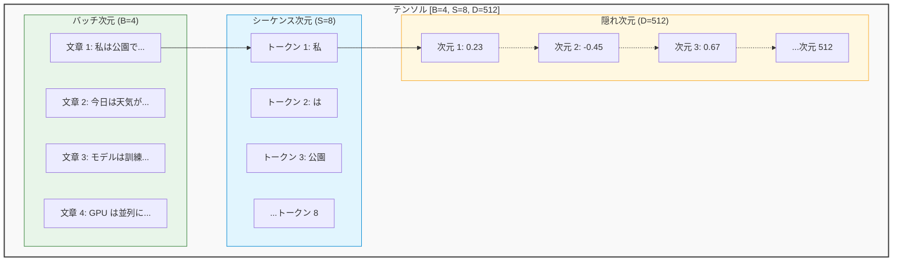
```mermaid
graph TB
    subgraph tensor ["テンソル [B=4, S=8, D=512]"]
        subgraph batch ["バッチ次元 (B=4)"]
            B1["文章 1: 私は公園で..."]
            B2["文章 2: 今日は天気が..."]
            B3["文章 3: モデルは訓練..."]
            B4["文章 4: GPU は並列に..."]
        end

        subgraph seq ["シーケンス次元 (S=8)"]
            S1["トークン 1: 私"]
            S2["トークン 2: は"]
            S3["トークン 3: 公園"]
            S8["...トークン 8"]
        end

        subgraph hidden ["隠れ次元 (D=512)"]
            D1["次元 1: 0.23"]
            D2["次元 2: -0.45"]
            D3["次元 3: 0.67"]
            D512["...次元 512"]
        end

        B1 --> S1
        S1 --> D1
        D1 -.-> D2
        D2 -.-> D3
        D3 -.-> D512
    end

    style tensor fill: #f9f9f9,stroke: #333,stroke-width:2px
    style batch fill: #e8f5e9,stroke: #2e7d32
    style seq fill: #e1f5fe,stroke: #0288d1
    style hidden fill: #fff8e1,stroke: #f9a825
```

**各次元の役割**:
- **B（バッチ）**: データ並列化で分割される次元。異なる文章を同時に処理することで学習を高速化
- **S（シーケンス）**: 文章内のトークンの位置。長いシーケンスを扱う際に分割の対象となる
- **D（隠れ）**: 各トークンの特徴表現。大きいほど表現力が高いが、メモリ消費も増加

:::

以降のセクションで、各並列化がどの次元をどのように分割するかを詳しく見ていきます。

## 集団通信操作

並列化戦略を実現するためには、GPU 間でデータをやり取りする**集団通信操作**が不可欠です。ここでは、4 つの主要な操作を解説します。

### AllGather -- 断片を集めて全体を復元

各 GPU が持つデータの断片を全て集めて、全 GPU に完全なデータを構築します。


```
操作前:                    操作後:
  GPU 0: [A]                GPU 0: [A, B, C, D]
  GPU 1: [B]      --->      GPU 1: [A, B, C, D]
  GPU 2: [C]                GPU 2: [A, B, C, D]
  GPU 3: [D]                GPU 3: [A, B, C, D]
```

### ReduceScatter -- 集約して分散

各 GPU のデータを要素ごとに集約（合計）し、結果を分割して各 GPU に配布します。


```
操作前:                         操作後:
  GPU 0: [a0, a1, a2, a3]        GPU 0: [a0+b0+c0+d0]
  GPU 1: [b0, b1, b2, b3]  --->  GPU 1: [a1+b1+c1+d1]
  GPU 2: [c0, c1, c2, c3]        GPU 2: [a2+b2+c2+d2]
  GPU 3: [d0, d1, d2, d3]        GPU 3: [a3+b3+c3+d3]
```

### AllToAll -- 全対全シャッフル

各 GPU が他の全 GPU にデータの一部を送り、全 GPU から一部を受け取ります。「行列の転置」のようなイメージです。


```
操作前:                         操作後:
  GPU 0: [a0, a1, a2, a3]        GPU 0: [a0, b0, c0, d0]
  GPU 1: [b0, b1, b2, b3]  --->  GPU 1: [a1, b1, c1, d1]
  GPU 2: [c0, c1, c2, c3]        GPU 2: [a2, b2, c2, d2]
  GPU 3: [d0, d1, d2, d3]        GPU 3: [a3, b3, c3, d3]
```

### AllReduce -- 全 GPU での同期集約

各 GPU のデータを要素ごとに集約（合計）し、結果を全 GPU にコピーします。AllReduce は、論理的には ReduceScatter（集約 + 分散）の後に AllGather（断片を集めて全体を復元）を実行する操作と等価です。つまり、AllReduce = ReduceScatter + AllGather と分解できます。実装上もこの分解が使われることがあり、特に Tensor Parallel と Sequence Parallel の切り替え時にはこの関係が重要になります。


```
操作前:                    操作後:
  GPU 0: [a]                GPU 0: [a+b+c+d]
  GPU 1: [b]      --->      GPU 1: [a+b+c+d]
  GPU 2: [c]                GPU 2: [a+b+c+d]
  GPU 3: [d]                GPU 3: [a+b+c+d]
```

:::message
各操作の通信量はデータサイズや通信トポロジー（Ring, Tree 等）によって異なります。例えば Ring AllReduce では各 GPU が送受信するデータ量は `2 * (N-1) / N * M`（M: メッセージサイズ、N: GPU 数）となり、GPU 数が増えても 1 GPU あたりの通信量はほぼ一定です。詳細は [NCCL のドキュメント](https://docs.nvidia.com/deeplearning/nccl/user-guide/docs/usage/collectives.html) を参照してください。
:::

## 6 つの並列化戦略の原理

ここでは、各並列化戦略の基本原理を簡潔に説明します。「何を分割するのか」「どの通信操作を使うのか」に焦点を当てています。

### 6 つの並列化戦略の概要

| 色 | 並列化 | 分割対象 | 主な通信 |
|----|--------|----------|----------|
| 緑色 | dp (Data Parallel) | バッチ B | AllReduce |
| 黄色 | tp (Tensor Parallel) | 重み行列（D または中間次元） | ReduceScatter, AllGather |
| 水色 | sp (Sequence Parallel) | シーケンス S（要素単位演算） | AllGather, ReduceScatter |
| ピンク | cp (Context Parallel) | シーケンス S（Attention 内） | P2P, AllGather |
| 紫色 | ep (Expert Parallel) | エキスパート数 E | AllToAll |
| 橙色 | vp (Vocab Parallel) | 語彙次元 V | ReduceScatter |

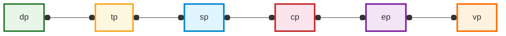
```mermaid
graph LR
    dp["dp"] o---o tp["tp"]
    tp o---o sp["sp"]
    sp o---o cp["cp"]
    cp o---o ep["ep"]
    ep o---o vp["vp"]

    style dp fill: #e8f5e9,stroke: #2e7d32,stroke-width:3px
    style tp fill: #fff8e1,stroke: #f9a825,stroke-width:3px
    style sp fill: #e1f5fe,stroke: #0288d1,stroke-width:3px
    style cp fill: #fce4ec,stroke: #c62828,stroke-width:3px
    style ep fill: #f3e5f5,stroke: #7b1fa2,stroke-width:3px
    style vp fill: #fff3e0,stroke: #ff6f00,stroke-width:3px
```

### 1. Data Parallel (dp)

**分割対象**: バッチ次元 B
**主な通信**: AllReduce（勾配の集約）

各 GPU がミニバッチの一部（B/N）を処理し、勾配を AllReduce で同期します。

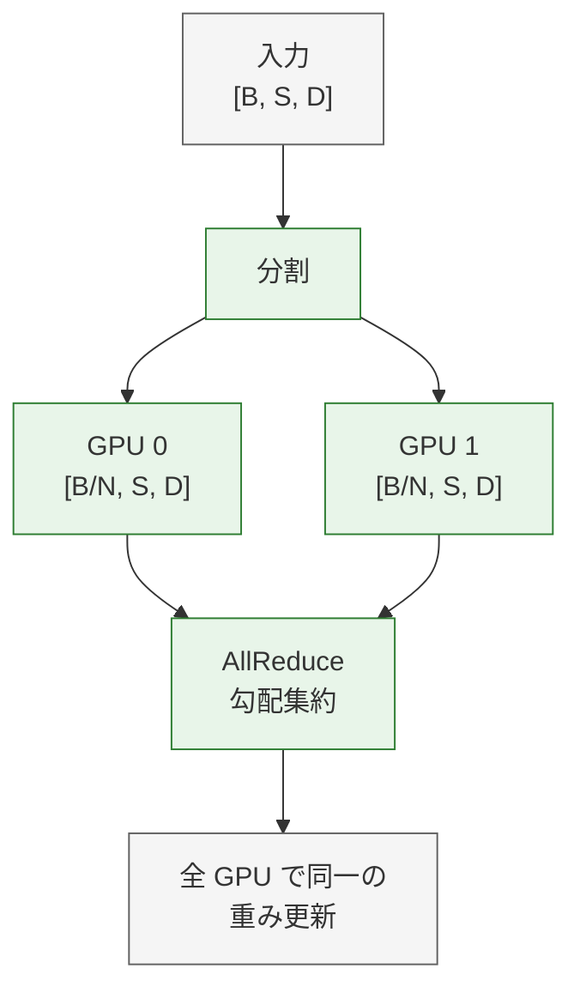
```mermaid
graph TB
    Batch["入力<br/>[B, S, D]"] --> Split["分割"]
    Split --> GPU0["GPU 0<br/>[B/N, S, D]"]
    Split --> GPU1["GPU 1<br/>[B/N, S, D]"]
    GPU0 & GPU1 --> AR["AllReduce<br/>勾配集約"]
    AR --> Sync["全 GPU で同一の<br/>重み更新"]

    style Batch fill: #f5f5f5,stroke: #616161
    style Split fill: #e8f5e9,stroke: #2e7d32
    style GPU0 fill: #e8f5e9,stroke: #2e7d32
    style GPU1 fill: #e8f5e9,stroke: #2e7d32
    style AR fill: #e8f5e9,stroke: #2e7d32
    style Sync fill: #f5f5f5,stroke: #616161
```

::::details 通信の詳細: AllReduce はいつ、どう使われるのか

Data Parallel では、順伝播時に通信は不要です（各 GPU が独立してバッチの一部を処理）。通信が発生するのは**逆伝播時の勾配同期**です。

**処理フロー**:

1. **順伝播**: 各 GPU が異なるバッチを処理
   - GPU 0: バッチ 0-3 を処理 → 損失 L0 を計算
   - GPU 1: バッチ 4-7 を処理 → 損失 L1 を計算

2. **逆伝播**: 各 GPU がローカル勾配を計算
   - GPU 0: 勾配 g0 = ∂L0/∂W
   - GPU 1: 勾配 g1 = ∂L1/∂W

3. **AllReduce**: 全 GPU の勾配を合計して全 GPU に配布
   - 結果: 各 GPU が g_avg = (g0 + g1) / 2 を取得

4. **重み更新**: 全 GPU が同じ勾配で重みを更新
   - W_new = W_old - lr × g_avg

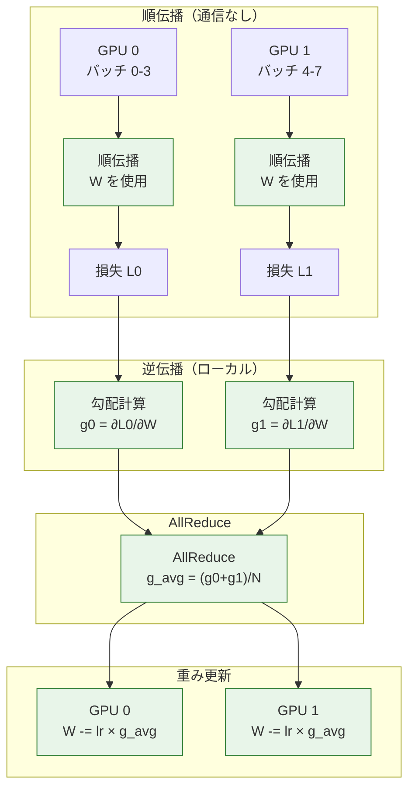
```mermaid
graph TB
    subgraph "順伝播（通信なし）"
        B0["GPU 0<br/>バッチ 0-3"] --> F0["順伝播<br/>W を使用"]
        B1["GPU 1<br/>バッチ 4-7"] --> F1["順伝播<br/>W を使用"]
        F0 --> L0["損失 L0"]
        F1 --> L1["損失 L1"]
    end

    subgraph "逆伝播（ローカル）"
        L0 --> G0["勾配計算<br/>g0 = ∂L0/∂W"]
        L1 --> G1["勾配計算<br/>g1 = ∂L1/∂W"]
    end

    subgraph "AllReduce"
        G0 --> AR["AllReduce<br/>g_avg = (g0+g1)/N"]
        G1 --> AR
    end

    subgraph "重み更新"
        AR --> U0["GPU 0<br/>W -= lr × g_avg"]
        AR --> U1["GPU 1<br/>W -= lr × g_avg"]
    end

    style F0 fill: #e8f5e9,stroke: #2e7d32
    style F1 fill: #e8f5e9,stroke: #2e7d32
    style G0 fill: #e8f5e9,stroke: #2e7d32
    style G1 fill: #e8f5e9,stroke: #2e7d32
    style AR fill: #e8f5e9,stroke: #2e7d32
    style U0 fill: #e8f5e9,stroke: #2e7d32
    style U1 fill: #e8f5e9,stroke: #2e7d32
```

**具体的な行列計算の例**:

```
AllReduce で勾配を集約（合計 → 平均）:

操作前:                                      操作後:
  GPU 0: g0 = [[0.1, 0.2],                   GPU 0: g_avg = [[0.075, 0.175],
                [0.3, 0.4]]                                    [0.275, 0.375]]

  GPU 1: g1 = [[0.05, 0.15],      --->       GPU 1: g_avg = [[0.075, 0.175],
                [0.25, 0.35]]                                  [0.275, 0.375]]

  g_avg = (g0 + g1) / 2
```

この計算により、全 GPU が同一の重み `W_new` を保持し、次の iteration で一貫した順伝播を実行できます。

**重要なポイント**:
- AllReduce により、全 GPU が同一の重みを保持し続けます
- 実装では、勾配の平均を取るため `sum / N` が行われます（N は GPU 数）
- 各レイヤの重みごとに AllReduce が実行されます

::::

---

### 2. Tensor Parallel (tp)

**分割対象**: 重み行列（注意機構のヘッドや FFN の中間次元）
**主な通信**: ReduceScatter（出力の集約）、AllGather（入力の収集）

重み行列を分割して複数 GPU で並列実行します。各 GPU が行列の一部を保持し、演算結果を通信で統合します。

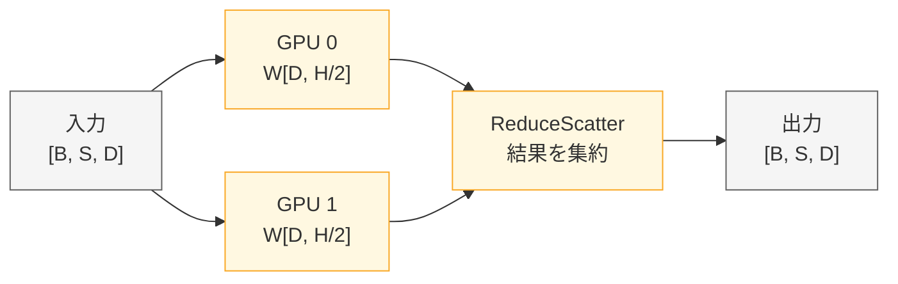
```mermaid
graph LR
    Input["入力<br/>[B, S, D]"] --> W0["GPU 0<br/>W[D, H/2]"]
    Input --> W1["GPU 1<br/>W[D, H/2]"]
    W0 & W1 --> RS["ReduceScatter<br/>結果を集約"]
    RS --> Output["出力<br/>[B, S, D]"]

    style Input fill: #f5f5f5,stroke: #616161
    style W0 fill: #fff8e1,stroke: #f9a825
    style W1 fill: #fff8e1,stroke: #f9a825
    style RS fill: #fff8e1,stroke: #f9a825
    style Output fill: #f5f5f5,stroke: #616161
```

::::details 通信の詳細: 2 種類の Tensor Parallel パターン

Tensor Parallel には、行列乗算の分割方向により 2 つのパターンがあります。

**パターン 1: Column Parallel（列並列）**

重み行列の**出力次元**を分割します（例: FFN の最初の線形層 `W1[D, 4D]`）。

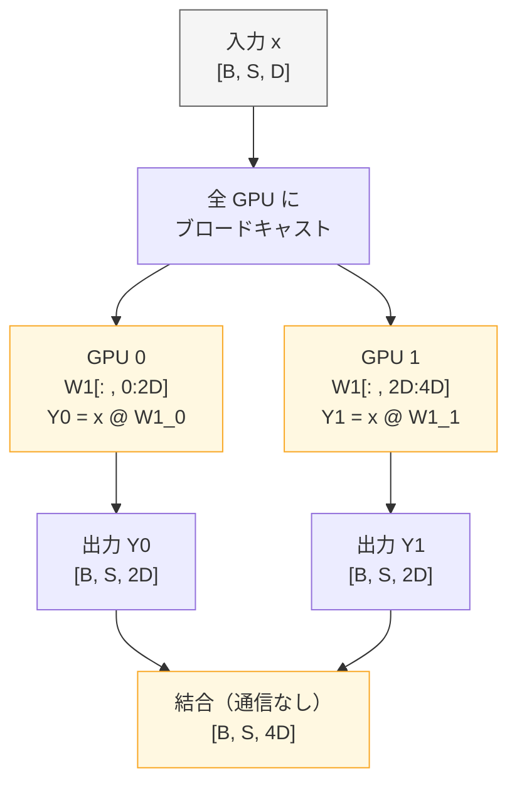
```mermaid
graph TB
    Input["入力 x<br/>[B, S, D]"] --> Broadcast["全 GPU に<br/>ブロードキャスト"]

    Broadcast --> GPU0["GPU 0<br/>W1[: , 0:2D]<br/>Y0 = x @ W1_0"]
    Broadcast --> GPU1["GPU 1<br/>W1[: , 2D:4D]<br/>Y1 = x @ W1_1"]

    GPU0 --> Out0["出力 Y0<br/>[B, S, 2D]"]
    GPU1 --> Out1["出力 Y1<br/>[B, S, 2D]"]

    Out0 --> Concat["結合（通信なし）<br/>[B, S, 4D]"]
    Out1 --> Concat

    style Input fill: #f5f5f5,stroke: #616161
    style GPU0 fill: #fff8e1,stroke: #f9a825
    style GPU1 fill: #fff8e1,stroke: #f9a825
    style Concat fill: #fff8e1,stroke: #f9a825
```

**重要**: 入力は全 GPU で共有されるため、順伝播では通信不要です。各 GPU が独立して行列積を計算し、出力は分割されたまま保持されます。

**具体的な計算例（Column Parallel）**:

```
Column Parallel: 出力次元を分割して独立計算（通信なし）

操作前:                                      操作後:
  入力 X = [[1, 2, 3, 4]]（全 GPU で共有）
                                             GPU 0: Y0 = [[9.0, 10.4]]
  GPU 0: W1_0 = [[0.1, 0.2],                       （X @ W1_0）
                 [0.5, 0.6],
                 [0.9, 1.0],       --->      GPU 1: Y1 = [[11.8, 13.2]]
                 [1.3, 1.4]]                        （X @ W1_1）

  GPU 1: W1_1 = [[0.3, 0.4],                 結合: Y = [[9.0, 10.4, 11.8, 13.2]]
                 [0.7, 0.8],                       （通信なし）
                 [1.1, 1.2],
                 [1.5, 1.6]]
```

**パターン 2: Row Parallel（行並列）**

重み行列の**入力次元**を分割します（例: FFN の 2 番目の線形層 `W2[4D, D]`）。

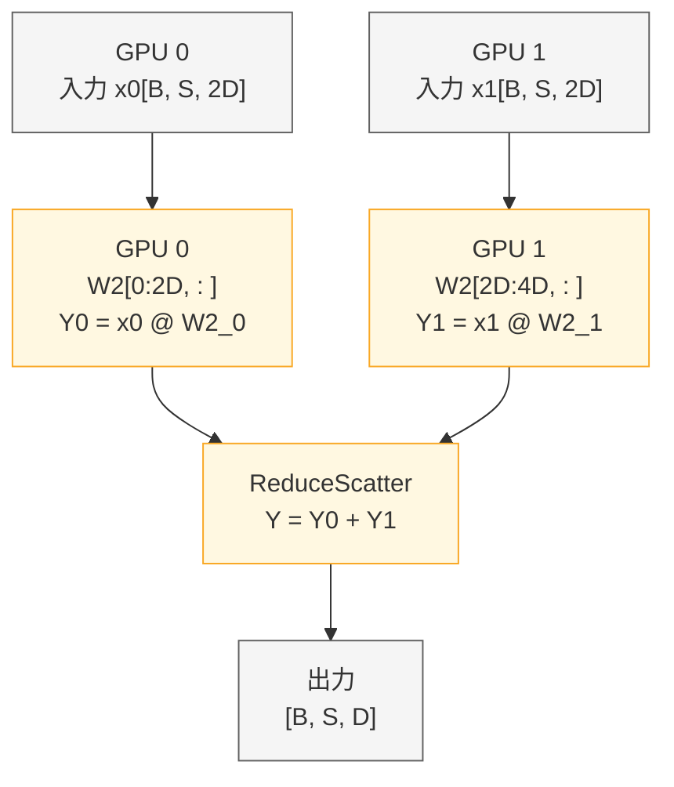
```mermaid
graph TB
    Input0["GPU 0<br/>入力 x0[B, S, 2D]"] --> GPU0["GPU 0<br/>W2[0:2D, : ]<br/>Y0 = x0 @ W2_0"]
    Input1["GPU 1<br/>入力 x1[B, S, 2D]"] --> GPU1["GPU 1<br/>W2[2D:4D, : ]<br/>Y1 = x1 @ W2_1"]

    GPU0 --> RS["ReduceScatter<br/>Y = Y0 + Y1"]
    GPU1 --> RS

    RS --> Output["出力<br/>[B, S, D]"]

    style Input0 fill: #f5f5f5,stroke: #616161
    style Input1 fill: #f5f5f5,stroke: #616161
    style GPU0 fill: #fff8e1,stroke: #f9a825
    style GPU1 fill: #fff8e1,stroke: #f9a825
    style RS fill: #fff8e1,stroke: #f9a825
    style Output fill: #f5f5f5,stroke: #616161
```

**重要**: 入力が分割されているため、各 GPU が部分的な行列積を計算します。結果を **ReduceScatter** で集約（合計）して完全な出力を得ます。

**具体的な計算例（Row Parallel）**:

```
Row Parallel: 入力次元を分割して計算、ReduceScatter で集約

操作前:                                      操作後:
  GPU 0: x0 = [[9.0, 10.4]]                  GPU 0: Y = [[30.96, 35.4, 39.84]]
         W2_0 = [[0.2, 0.3, 0.4],                  （Y0 + Y1 の合計）
                 [0.5, 0.6, 0.7]]
         Y0 = x0 @ W2_0       --->           GPU 1: Y = [[30.96, 35.4, 39.84]]
            = [[7.0, 8.94, 10.88]]                 （Y0 + Y1 の合計）

  GPU 1: x1 = [[11.8, 13.2]]
         W2_1 = [[0.8, 0.9, 1.0],
                 [1.1, 1.2, 1.3]]
         Y1 = x1 @ W2_1
            = [[23.96, 26.46, 28.96]]

  ReduceScatter: Y = Y0 + Y1
```

:::message
純粋な Tensor Parallel のみの場合は AllReduce で結果を全 GPU に配布します。Sequence Parallel と組み合わせる場合は、AllReduce を ReduceScatter + AllGather に分解し、ReduceScatter の結果をそのまま sp 形式 `[B, S/sp, D]` として保持します。本記事では sp との組み合わせを前提に ReduceScatter と記載しています。
:::

**FFN での適用例**（2 層の線形層）:

1. **第 1 層（Column Parallel）**: `x @ W1` → 出力を分割したまま保持
2. **活性化関数**: 各 GPU で独立に適用
3. **第 2 層（Row Parallel）**: 分割された入力 `@ W2` → ReduceScatter で集約

この組み合わせにより、通信回数を最小化しています（2 層で通信は 1 回のみ）[^1]。

[^1]: Shoeybi et al., 2019 "Megatron-LM: Training Multi-Billion Parameter Language Models Using Model Parallelism"

::::

---

### 3. Sequence Parallel (sp)

**分割対象**: シーケンス次元 S（要素単位演算で）
**主な通信**: AllGather（完全テンソルへ）、ReduceScatter（分割テンソルへ）
**制約**: Tensor Parallel と同じデバイスグループ内で動作（sp = tp）

Tensor Parallel (tp) は重み行列を分割しますが、アクティベーション（中間出力）は各 GPU で完全なテンソル `[B, S, D]` を保持する必要があります。長いシーケンスでは、このアクティベーションメモリが大きな負担となります[^2]。

[^2]: Korthikanti et al., 2022 "Reducing Activation Recomputation in Large Transformer Models"

Sequence Parallel (sp) は、**要素単位演算**（LayerNorm, Dropout など）において、シーケンス次元 S を分割することでアクティベーションメモリを削減します。各 GPU は `[B, S/sp, D]` のみを保持します。

**重要**: sp は tp と**同じデバイスグループ**で動作します（sp = tp）。これは、tp の行列演算の前後で AllGather/ReduceScatter によりテンソル形状を切り替えるためです。

**動作フロー**:
1. LayerNorm など要素単位演算では `[B, S/sp, D]` で処理（メモリ削減）
2. tp の行列演算前に AllGather で `[B, S, D]` に復元
3. tp 演算後に ReduceScatter で `[B, S/sp, D]` に再分割

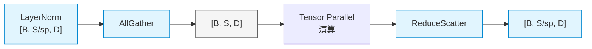
```mermaid
graph LR
    LN["LayerNorm<br/>[B, S/sp, D]"] --> AG["AllGather"]
    AG --> Full["[B, S, D]"]
    Full --> TP["Tensor Parallel<br/>演算"]
    TP --> RS["ReduceScatter"]
    RS --> LN2["[B, S/sp, D]"]

    style LN fill: #e1f5fe,stroke: #0288d1
    style AG fill: #e1f5fe,stroke: #0288d1
    style Full fill: #f5f5f5,stroke: #616161
    style RS fill: #e1f5fe,stroke: #0288d1
    style LN2 fill: #e1f5fe,stroke: #0288d1
```

**具体例**: tp=4, sp=4 の場合
- **LayerNorm 処理時**: 各 GPU は `[B, S/4, D]` を保持（メモリ 1/4）
- **AllGather 実行**: 4 GPU から断片を集めて `[B, S, D]` を復元
- **Tensor Parallel 演算**: 完全なテンソルで行列積を実行
- **ReduceScatter 実行**: 結果を集約して `[B, S/4, D]` に再分割

この仕組みにより、tp だけの場合と比較して、要素単位演算のアクティベーションメモリを `1/sp` 倍に削減できます。

::::details 通信の詳細: AllGather と ReduceScatter の使い分け

Sequence Parallel は、Tensor Parallel と組み合わせて使用されるため、テンソル形状の切り替えが頻繁に発生します。

**Attention Block での通信パターン**（tp=4, sp=4 の例）:

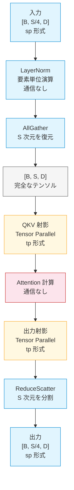
```mermaid
graph TB
    Input["入力<br/>[B, S/4, D]<br/>sp 形式"] --> LN["LayerNorm<br/>要素単位演算<br/>通信なし"]

    LN --> AG1["AllGather<br/>S 次元を復元"]
    AG1 --> Full1["[B, S, D]<br/>完全なテンソル"]

    Full1 --> QKV["QKV 射影<br/>Tensor Parallel<br/>tp 形式"]

    QKV --> Attn["Attention 計算<br/>通信なし"]

    Attn --> OutProj["出力射影<br/>Tensor Parallel<br/>tp 形式"]

    OutProj --> RS1["ReduceScatter<br/>S 次元を分割"]
    RS1 --> Output["出力<br/>[B, S/4, D]<br/>sp 形式"]

    style Input fill: #e1f5fe,stroke: #0288d1
    style LN fill: #e1f5fe,stroke: #0288d1
    style AG1 fill: #e1f5fe,stroke: #0288d1
    style Full1 fill: #f5f5f5,stroke: #616161
    style QKV fill: #fff8e1,stroke: #f9a825
    style Attn fill: #fce4ec,stroke: #c62828
    style OutProj fill: #fff8e1,stroke: #f9a825
    style RS1 fill: #e1f5fe,stroke: #0288d1
    style Output fill: #e1f5fe,stroke: #0288d1
```

**AllGather の役割**:
- **タイミング**: 要素単位演算（sp 形式）から行列演算（tp 形式）への切り替え前
- **動作**: 各 GPU が `[B, S/sp, D]` の断片を持ち、AllGather で `[B, S, D]` に復元
- **理由**: tp の行列演算は完全なシーケンスが必要

**ReduceScatter の役割**:
- **タイミング**: 行列演算（tp 形式）から要素単位演算（sp 形式）への切り替え後
- **動作**: tp で計算された結果を集約しながら `[B, S/sp, D]` に分割
- **理由**: 次の要素単位演算でメモリを節約

**重要なポイント**:
- AllReduce = ReduceScatter + AllGather と分解できるため、実装では ReduceScatter で済ませることで通信を削減
- sp と tp は同じデバイスグループ（sp = tp）で動作するため、通信オーバーヘッドは最小限

**具体的な計算例（AllGather → Tensor Parallel → ReduceScatter）**:

```
ステップ 1: AllGather でシーケンスを復元

操作前:                                      操作後:
  GPU 0: x0 = [[1, 2],                       GPU 0: X = [[1, 2],  # 全シーケンス
               [3, 4]]                                   [3, 4],
                                                         [5, 6],
  GPU 1: x1 = [[5, 6],       --->                       [7, 8]]
               [7, 8]]
                                             GPU 1: X = [[1, 2],  # 全シーケンス
                                                         [3, 4],
                                                         [5, 6],
                                                         [7, 8]]

ステップ 2: Tensor Parallel（Column Parallel）で行列演算

  GPU 0: Y0 = X @ W0 = [[0.7], [1.5], [2.3], [3.1]]
  GPU 1: Y1 = X @ W1 = [[1.0], [2.2], [3.4], [4.6]]

ステップ 3: ReduceScatter でシーケンスを再分割

操作前:                                      操作後:
  GPU 0: Y0 = [[0.7], [1.5], [2.3], [3.1]]   GPU 0: output = [[0.7, 1.0],
  GPU 1: Y1 = [[1.0], [2.2], [3.4], [4.6]]                     [1.5, 2.2]]

                             --->            GPU 1: output = [[2.3, 3.4],
                                                               [3.1, 4.6]]

  結合しながらシーケンスを分割（sp 形式に戻る）
```

::::

---

### 4. Context Parallel (cp)

**分割対象**: 注意機構内のシーケンス次元 S
**主な通信**: P2P 送受信（Ring Attention）または AllGather

超長シーケンス（128K トークン以上）で、注意計算のシーケンスを分割します。

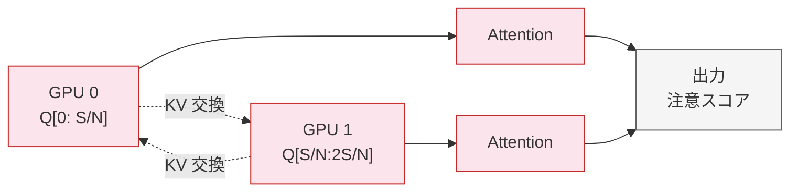
```mermaid
graph LR
    GPU0["GPU 0<br/>Q[0: S/N]"] --> Attn0["Attention"]
    GPU1["GPU 1<br/>Q[S/N:2S/N]"] --> Attn1["Attention"]
    GPU0 -.->|"KV 交換"| GPU1
    GPU1 -.->|"KV 交換"| GPU0
    Attn0 & Attn1 --> Out["出力<br/>注意スコア"]

    style GPU0 fill: #fce4ec,stroke: #c62828
    style GPU1 fill: #fce4ec,stroke: #c62828
    style Attn0 fill: #fce4ec,stroke: #c62828
    style Attn1 fill: #fce4ec,stroke: #c62828
    style Out fill: #f5f5f5,stroke: #616161
```

::::details 通信の詳細: Ring Attention のパイプライン処理

Context Parallel の代表的な実装である **Ring Attention** は、KV を Ring 状に転送しながら Attention 計算と通信をパイプライン化します。

**Ring Attention の動作**（cp=4 の例）:

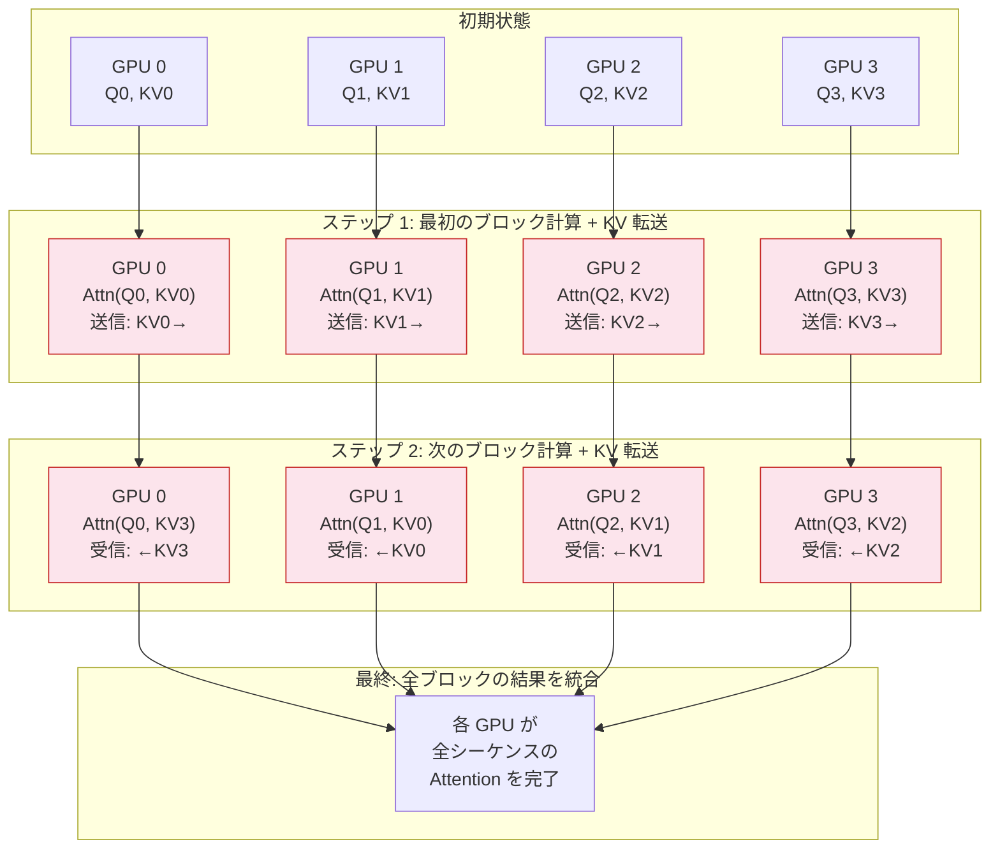
```mermaid
graph TB
    subgraph "初期状態"
        G0_0["GPU 0<br/>Q0, KV0"]
        G1_0["GPU 1<br/>Q1, KV1"]
        G2_0["GPU 2<br/>Q2, KV2"]
        G3_0["GPU 3<br/>Q3, KV3"]
    end

    subgraph "ステップ 1: 最初のブロック計算 + KV 転送"
        G0_1["GPU 0<br/>Attn(Q0, KV0)<br/>送信: KV0→"]
        G1_1["GPU 1<br/>Attn(Q1, KV1)<br/>送信: KV1→"]
        G2_1["GPU 2<br/>Attn(Q2, KV2)<br/>送信: KV2→"]
        G3_1["GPU 3<br/>Attn(Q3, KV3)<br/>送信: KV3→"]
    end

    subgraph "ステップ 2: 次のブロック計算 + KV 転送"
        G0_2["GPU 0<br/>Attn(Q0, KV3)<br/>受信: ←KV3"]
        G1_2["GPU 1<br/>Attn(Q1, KV0)<br/>受信: ←KV0"]
        G2_2["GPU 2<br/>Attn(Q2, KV1)<br/>受信: ←KV1"]
        G3_2["GPU 3<br/>Attn(Q3, KV2)<br/>受信: ←KV2"]
    end

    subgraph "最終: 全ブロックの結果を統合"
        Final["各 GPU が<br/>全シーケンスの<br/>Attention を完了"]
    end

    G0_0 --> G0_1
    G1_0 --> G1_1
    G2_0 --> G2_1
    G3_0 --> G3_1

    G0_1 --> G0_2
    G1_1 --> G1_2
    G2_1 --> G2_2
    G3_1 --> G3_2

    G0_2 --> Final
    G1_2 --> Final
    G2_2 --> Final
    G3_2 --> Final

    style G0_1 fill: #fce4ec,stroke: #c62828
    style G1_1 fill: #fce4ec,stroke: #c62828
    style G2_1 fill: #fce4ec,stroke: #c62828
    style G3_1 fill: #fce4ec,stroke: #c62828
    style G0_2 fill: #fce4ec,stroke: #c62828
    style G1_2 fill: #fce4ec,stroke: #c62828
    style G2_2 fill: #fce4ec,stroke: #c62828
    style G3_2 fill: #fce4ec,stroke: #c62828
```

**処理の流れ**:

1. **初期配置**: 各 GPU が Query と Key/Value のブロックを保持
   - GPU 0: Q0（0～S/4）、KV0（0～S/4）
   - GPU 1: Q1（S/4～S/2）、KV1（S/4～S/2）
   - 以下同様

2. **ステップ 1～N**: N 回のイテレーションで全ての KV ブロックを処理
   - 各ステップで **P2P 送受信**（Send/Recv）により隣接 GPU と KV を交換
   - 同時に受信した KV でローカル Query の Attention を計算
   - 計算と通信が**オーバーラップ**（パイプライン化）

3. **集約**: 各 GPU が全シーケンスに対する Attention 結果を保持

**重要なポイント**:
- P2P 通信（Send/Recv）により隣接 GPU 間でのみデータ転送
- AllGather を使う実装もあるが、Ring 方式は通信と計算をパイプライン化できる
- cp=N の場合、N ステップで全シーケンスの Attention を完了

**具体的な計算例（Ring Attention）**:

```
ステップ 1: 自分の KV で Attention 計算 + KV を Ring 転送

操作前:                                      操作後:
  GPU 0: Q0 = [[1, 2], [3, 4]]               GPU 0: output0_local = [[1.05, 1.15],
         K0 = [[0.1, 0.2], [0.3, 0.4]]                                [1.15, 1.25]]
         V0 = [[1.0, 1.1], [1.2, 1.3]]              （Attn(Q0, K0, V0) の結果）
                                                     KV0 を GPU 1 へ送信 →
  GPU 1: Q1 = [[5, 6], [7, 8]]       --->
         K1 = [[0.5, 0.6], [0.7, 0.8]]       GPU 1: output1_local = [[2.05, 2.15],
         V1 = [[2.0, 2.1], [2.2, 2.3]]                                [2.15, 2.25]]
                                                     （Attn(Q1, K1, V1) の結果）
                                                     KV1 を GPU 0 へ送信 →

ステップ 2: 受信した KV で Attention 計算

操作前:                                      操作後:
  GPU 0: ← KV1 を受信                        GPU 0: output0_remote = [[2.03, 2.13],
         Attn(Q0, K1, V1) を計算                                        [2.13, 2.23]]

  GPU 1: ← KV0 を受信        --->            GPU 1: output1_remote = [[1.07, 1.17],
         Attn(Q1, K0, V0) を計算                                        [1.17, 1.27]]

最終: 各 GPU が自分のトークンについて全シーケンスの Attention を完了
  GPU 0: combine(output0_local, output0_remote) → トークン 0, 1 の完全な結果
  GPU 1: combine(output1_remote, output1_local) → トークン 2, 3 の完全な結果
```

::::

---

### 5. Expert Parallel (ep)

**分割対象**: MoE 層のエキスパート数 E
**主な通信**: AllToAll（トークンのルーティング）

MoE 層で、各エキスパートを異なる GPU に配置します。Router がトークンを適切なエキスパートに送信します。

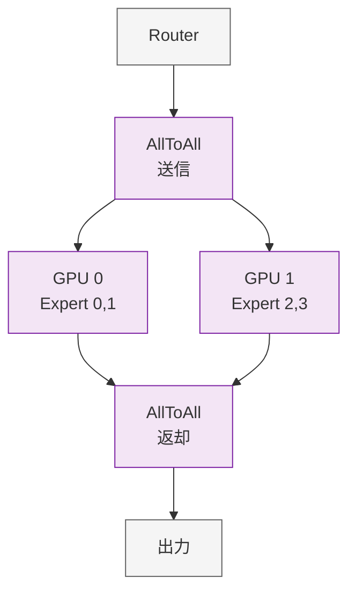
```mermaid
graph TB
    Router["Router"] --> A2A1["AllToAll<br/>送信"]
    A2A1 --> E0["GPU 0<br/>Expert 0,1"]
    A2A1 --> E1["GPU 1<br/>Expert 2,3"]
    E0 & E1 --> A2A2["AllToAll<br/>返却"]
    A2A2 --> Out["出力"]

    style Router fill: #f5f5f5,stroke: #616161
    style A2A1 fill: #f3e5f5,stroke: #7b1fa2
    style E0 fill: #f3e5f5,stroke: #7b1fa2
    style E1 fill: #f3e5f5,stroke: #7b1fa2
    style A2A2 fill: #f3e5f5,stroke: #7b1fa2
    style Out fill: #f5f5f5,stroke: #616161
```

::::details 通信の詳細: AllToAll によるトークンルーティング

Expert Parallel では、各トークンが Router により選択されたエキスパートに動的に送信されます。この **トークンの再配置** に AllToAll 通信を使用します。

**処理フロー**（ep=4, エキスパート数 8 の例）:

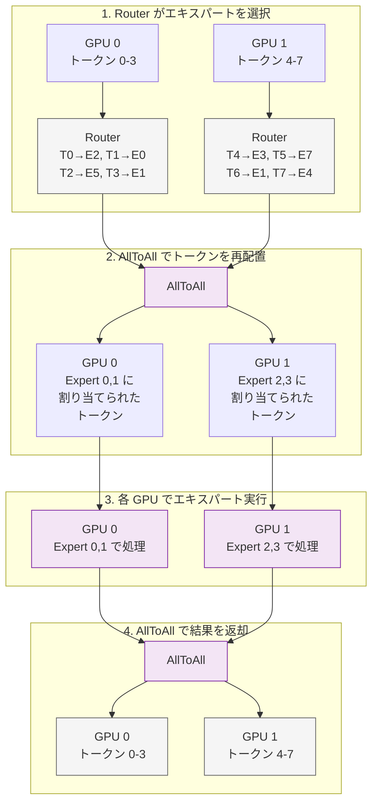
```mermaid
graph TB
    subgraph "1. Router がエキスパートを選択"
        T0["GPU 0<br/>トークン 0-3"] --> R0["Router<br/>T0→E2, T1→E0<br/>T2→E5, T3→E1"]
        T1["GPU 1<br/>トークン 4-7"] --> R1["Router<br/>T4→E3, T5→E7<br/>T6→E1, T7→E4"]
    end

    subgraph "2. AllToAll でトークンを再配置"
        R0 --> A2A1["AllToAll"]
        R1 --> A2A1
        A2A1 --> E0_in["GPU 0<br/>Expert 0,1 に<br/>割り当てられた<br/>トークン"]
        A2A1 --> E1_in["GPU 1<br/>Expert 2,3 に<br/>割り当てられた<br/>トークン"]
    end

    subgraph "3. 各 GPU でエキスパート実行"
        E0_in --> E0_proc["GPU 0<br/>Expert 0,1 で処理"]
        E1_in --> E1_proc["GPU 1<br/>Expert 2,3 で処理"]
    end

    subgraph "4. AllToAll で結果を返却"
        E0_proc --> A2A2["AllToAll"]
        E1_proc --> A2A2
        A2A2 --> Out0["GPU 0<br/>トークン 0-3"]
        A2A2 --> Out1["GPU 1<br/>トークン 4-7"]
    end

    style R0 fill: #f5f5f5,stroke: #616161
    style R1 fill: #f5f5f5,stroke: #616161
    style A2A1 fill: #f3e5f5,stroke: #7b1fa2
    style E0_proc fill: #f3e5f5,stroke: #7b1fa2
    style E1_proc fill: #f3e5f5,stroke: #7b1fa2
    style A2A2 fill: #f3e5f5,stroke: #7b1fa2
    style Out0 fill: #f5f5f5,stroke: #616161
    style Out1 fill: #f5f5f5,stroke: #616161
```

**AllToAll の役割**:

1. **送信側（AllToAll 1 回目）**:
   - 各 GPU が全 GPU に対して、担当エキスパート宛のトークンを送信
   - 例: GPU 0 のトークン 0 が Expert 2 を選択 → GPU 1 に送信（Expert 2,3 は GPU 1 が担当）

2. **受信側**:
   - 各 GPU が自分の担当エキスパートに割り当てられたトークンを全 GPU から受信
   - 受信したトークンのみを処理（負荷分散）

3. **返却（AllToAll 2 回目）**:
   - 処理結果を元の GPU に返却
   - 各 GPU が元のトークン順序で結果を受け取る

**重要なポイント**:
- Top-K ルーティング（各トークンが K 個のエキスパートを選択）では、トークン数が不均衡になる可能性あり
- 負荷分散のため、各エキスパートに送信されるトークン数を制限（Capacity Factor）
- AllToAll は全対全通信のため、GPU 数が多いと通信コストが高い（ep = dp とすることで既存グループを再利用）

**具体的な計算例（AllToAll によるトークンルーティング）**:

```
Router が選択: T0→Expert2, T1→Expert0, T2→Expert1, T3→Expert3

ステップ 1: AllToAll でトークンを再配置

操作前:                                      操作後:
  GPU 0: T0=[1,2], T1=[3,4]                  GPU 0: T1=[3,4], T2=[5,6]
         (Expert 0,1 担当)                          (Expert 0,1 宛)

  GPU 1: T2=[5,6], T3=[7,8]      --->        GPU 1: T0=[1,2], T3=[7,8]
         (Expert 2,3 担当)                          (Expert 2,3 宛)

ステップ 2: 各 GPU でエキスパート処理

  GPU 0: Expert0(T1) = [1.1, 2.5]
         Expert1(T2) = [6.1, 8.3]

  GPU 1: Expert2(T0) = [2.9, 3.5]
         Expert3(T3) = [20.3, 23.3]

ステップ 3: AllToAll で結果を元の GPU に返却

操作前:                                      操作後:
  GPU 0: Expert0(T1)=[1.1,2.5]               GPU 0: T0 結果=[2.9,3.5]
         Expert1(T2)=[6.1,8.3]                      T1 結果=[1.1,2.5]

  GPU 1: Expert2(T0)=[2.9,3.5]    --->       GPU 1: T2 結果=[6.1,8.3]
         Expert3(T3)=[20.3,23.3]                    T3 結果=[20.3,23.3]

  各トークンが選択したエキスパートで処理され、元の順序に戻る
```

::::

---

### 6. Vocab Parallel (vp)

**分割対象**: 語彙次元 V
**主な通信**: ReduceScatter（出力の集約）

大規模語彙の埋め込みテーブルを分割します。各 GPU が語彙の一部を担当します。

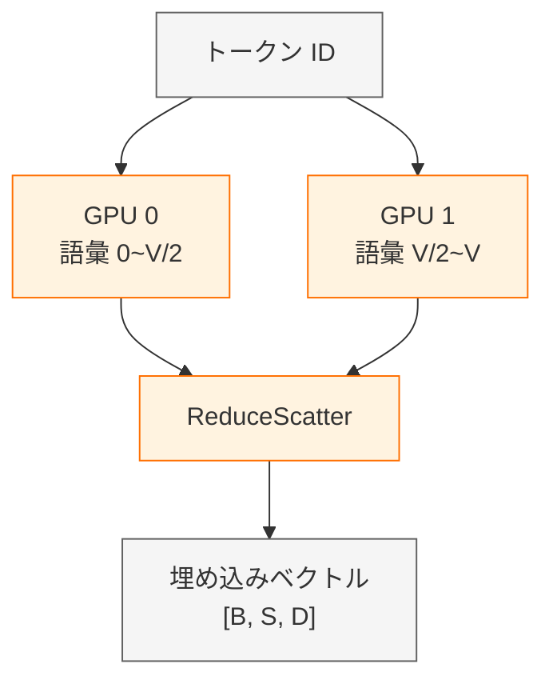
```mermaid
graph TB
    Token["トークン ID"] --> E0["GPU 0<br/>語彙 0~V/2"]
    Token --> E1["GPU 1<br/>語彙 V/2~V"]
    E0 & E1 --> RS["ReduceScatter"]
    RS --> Emb["埋め込みベクトル<br/>[B, S, D]"]

    style Token fill: #f5f5f5,stroke: #616161
    style E0 fill: #fff3e0,stroke: #ff6f00
    style E1 fill: #fff3e0,stroke: #ff6f00
    style RS fill: #fff3e0,stroke: #ff6f00
    style Emb fill: #f5f5f5,stroke: #616161
```

::::details 通信の詳細: 埋め込み層と出力層での ReduceScatter

Vocab Parallel は、語彙サイズ V が非常に大きい（数万～数十万）場合に、埋め込みテーブルと出力層の行列を分割します。

**埋め込み層での処理**（vp=4 の例）:

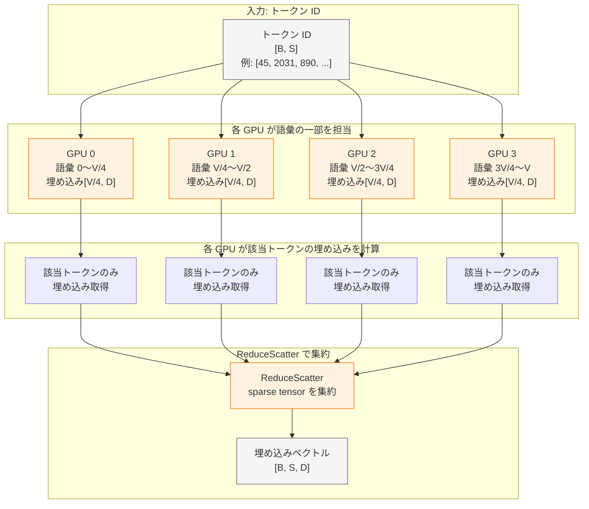
```mermaid
graph TB
    subgraph "入力: トークン ID"
        Input["トークン ID<br/>[B, S]<br/>例: [45, 2031, 890, ...]"]
    end

    subgraph "各 GPU が語彙の一部を担当"
        GPU0["GPU 0<br/>語彙 0～V/4<br/>埋め込み[V/4, D]"]
        GPU1["GPU 1<br/>語彙 V/4～V/2<br/>埋め込み[V/4, D]"]
        GPU2["GPU 2<br/>語彙 V/2～3V/4<br/>埋め込み[V/4, D]"]
        GPU3["GPU 3<br/>語彙 3V/4～V<br/>埋め込み[V/4, D]"]
    end

    subgraph "各 GPU が該当トークンの埋め込みを計算"
        Input --> GPU0
        Input --> GPU1
        Input --> GPU2
        Input --> GPU3

        GPU0 --> Lookup0["該当トークンのみ<br/>埋め込み取得"]
        GPU1 --> Lookup1["該当トークンのみ<br/>埋め込み取得"]
        GPU2 --> Lookup2["該当トークンのみ<br/>埋め込み取得"]
        GPU3 --> Lookup3["該当トークンのみ<br/>埋め込み取得"]
    end

    subgraph "ReduceScatter で集約"
        Lookup0 --> RS["ReduceScatter<br/>sparse tensor を集約"]
        Lookup1 --> RS
        Lookup2 --> RS
        Lookup3 --> RS
        RS --> Output["埋め込みベクトル<br/>[B, S, D]"]
    end

    style Input fill: #f5f5f5,stroke: #616161
    style GPU0 fill: #fff3e0,stroke: #ff6f00
    style GPU1 fill: #fff3e0,stroke: #ff6f00
    style GPU2 fill: #fff3e0,stroke: #ff6f00
    style GPU3 fill: #fff3e0,stroke: #ff6f00
    style RS fill: #fff3e0,stroke: #ff6f00
    style Output fill: #f5f5f5,stroke: #616161
```

**処理の流れ**:

1. **入力**: トークン ID のシーケンス `[B, S]`（例: `[45, 2031, 890, ...]`）

2. **Lookup**: 各 GPU が自分の担当語彙範囲に該当するトークンのみ埋め込みを取得
   - GPU 0: トークン ID 0～V/4 に該当するもののみ
   - GPU 1: トークン ID V/4～V/2 に該当するもののみ
   - 該当しないトークンは 0 ベクトル

3. **ReduceScatter**: sparse tensor を集約して完全な埋め込みベクトルを生成
   - 各 GPU の埋め込み結果を合計（該当トークンのみが非ゼロ）
   - 結果を分散して各 GPU に配布

**出力層での処理**（Logit 計算）:

出力層では、逆の処理が行われます。`[B, S, D]` のテンソルに対して `[D, V]` の重み行列を適用し、各トークンの次トークン確率分布 `[B, S, V]` を計算します。vp により `[D, V/4]` に分割された重み行列で計算し、ReduceScatter で集約します。

**重要なポイント**:
- vp は tp と同じデバイスグループで動作（vp = tp）
- 語彙サイズが小さい場合は vp を適用せず、全 GPU で完全な埋め込みテーブルを保持
- 大規模モデル（LLaMA[^4], GPT-3[^5] など）では語彙サイズが 32K～100K になるため、vp が有効

[^4]: Touvron et al., 2023 "LLaMA: Open and Efficient Foundation Language Models"
[^5]: Brown et al., 2020 "Language Models are Few-Shot Learners"

**具体的な計算例（埋め込み層での Lookup と ReduceScatter）**:

```
入力トークン ID: [1, 5, 2, 6]

Lookup: 各 GPU が担当語彙範囲のトークンのみ埋め込みを取得

操作前:                                      操作後:
  GPU 0: 語彙 0-3 担当                       GPU 0: [[0.1, 0.2],  # ID=1
         ID 1: [0.1, 0.2]                            [0.0, 0.0],  # ID=5(範囲外)
         ID 2: [0.3, 0.4]                            [0.3, 0.4],  # ID=2
                                                     [0.0, 0.0]]  # ID=6(範囲外)
  GPU 1: 語彙 4-7 担当       --->
         ID 5: [0.5, 0.6]                    GPU 1: [[0.0, 0.0],  # ID=1(範囲外)
         ID 6: [0.7, 0.8]                            [0.5, 0.6],  # ID=5
                                                     [0.0, 0.0],  # ID=2(範囲外)
                                                     [0.7, 0.8]]  # ID=6

ReduceScatter で集約（sparse tensor を合計）:

操作前:                                      操作後:
  GPU 0: [[0.1, 0.2],                        完全な埋め込みベクトル:
          [0.0, 0.0],                        [[0.1, 0.2],  # ID=1
          [0.3, 0.4],                         [0.5, 0.6],  # ID=5
          [0.0, 0.0]]      --->               [0.3, 0.4],  # ID=2
                                              [0.7, 0.8]]  # ID=6
  GPU 1: [[0.0, 0.0],
          [0.5, 0.6],
          [0.0, 0.0],
          [0.7, 0.8]]

  各 GPU が担当語彙のみ保持し、メモリを 1/vp に削減
```

:::message
ReduceScatter を使うのは Sequence Parallel と組み合わせる場合です。sp と組み合わせない場合は AllReduce で全 GPU に完全な埋め込みベクトルを配布します。
:::

::::

---

## 並列化戦略の適用順序

6 つの並列化戦略をどの順序で適用すべきかは、**メモリ制約**、**通信オーバーヘッド**、**利用可能な GPU 数**に基づいて決定します。

### 決定フローチャート

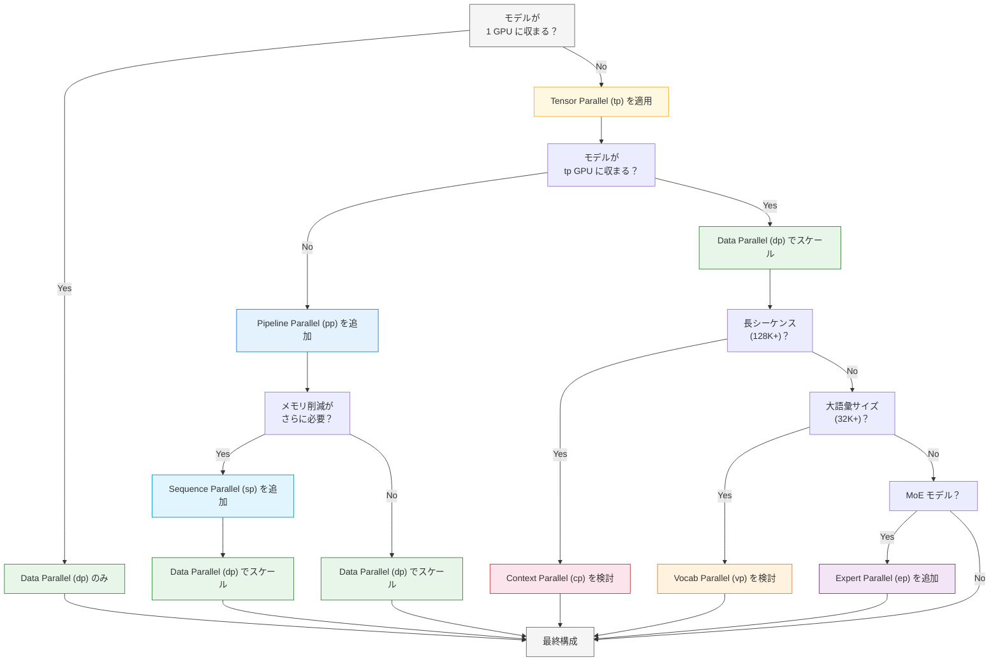
```mermaid
flowchart TD
    Start["モデルが<br/>1 GPU に収まる？"] -->|Yes| DP["Data Parallel (dp) のみ"]
    Start -->|No| TP["Tensor Parallel (tp) を適用"]

    TP --> TP_Check["モデルが<br/>tp GPU に収まる？"]
    TP_Check -->|No| PP["Pipeline Parallel (pp) を追加"]
    TP_Check -->|Yes| DP2["Data Parallel (dp) でスケール"]

    PP --> PP_Check["メモリ削減が<br/>さらに必要？"]
    PP_Check -->|Yes| SP["Sequence Parallel (sp) を追加"]
    PP_Check -->|No| DP3["Data Parallel (dp) でスケール"]

    DP2 --> SP_Check["長シーケンス<br/>(128K+)？"]
    SP_Check -->|Yes| CP["Context Parallel (cp) を検討"]
    SP_Check -->|No| VP_Check["大語彙サイズ<br/>(32K+)？"]

    VP_Check -->|Yes| VP["Vocab Parallel (vp) を検討"]
    VP_Check -->|No| MoE_Check["MoE モデル？"]

    MoE_Check -->|Yes| EP["Expert Parallel (ep) を追加"]
    MoE_Check -->|No| Final["最終構成"]

    SP --> DP4["Data Parallel (dp) でスケール"]
    DP3 --> Final
    DP4 --> Final
    CP --> Final
    VP --> Final
    EP --> Final
    DP --> Final

    style Start fill: #f5f5f5,stroke: #616161
    style TP fill: #fff8e1,stroke: #f9a825
    style PP fill: #e3f2fd,stroke: #1976d2
    style SP fill: #e1f5fe,stroke: #0288d1
    style DP fill: #e8f5e9,stroke: #2e7d32
    style DP2 fill: #e8f5e9,stroke: #2e7d32
    style DP3 fill: #e8f5e9,stroke: #2e7d32
    style DP4 fill: #e8f5e9,stroke: #2e7d32
    style CP fill: #fce4ec,stroke: #c62828
    style EP fill: #f3e5f5,stroke: #7b1fa2
    style VP fill: #fff3e0,stroke: #ff6f00
    style Final fill: #f5f5f5,stroke: #616161
```

### 適用順序の理由

**1. Tensor Parallel (tp) を最優先**

モデルの重み行列が 1 GPU のメモリに収まらない場合、**tp を最初に適用**します。

- **理由**: tp はモデルの各層の重み行列を分割するため、モデルサイズ自体を削減できる唯一の戦略
- **制約**: 通信オーバーヘッドが大きいため、tp=2, 4, 8 程度に抑える（単一ノード内推奨）
- **目安**: 70B パラメータ以上のモデルでは tp=4 または tp=8 が必要

**2. Pipeline Parallel (pp) で層を分散**

tp を適用してもメモリが不足する場合、**pp を追加**します。

- **理由**: pp は Transformer の層を GPU に分散させ、各 GPU が保持する層数を削減
- **制約**: パイプラインバブルによる GPU アイドル時間が発生（効率 80-90%）
- **目安**: 100B パラメータ以上、または tp だけでは不足する場合
- **詳細**: Pipeline Parallelism の詳細は [GPipe 論文](https://arxiv.org/abs/1811.06965) や [PipeDream 論文](https://arxiv.org/abs/1806.03377) を参照してください

**3. Data Parallel (dp) でスループット向上**

メモリ問題が解決したら、**dp を追加**してスループットを向上させます。

- **理由**: dp は複数のバッチを並列処理し、訓練・推論のスループットを向上
- **制約**: 勾配同期の通信コスト（AllReduce）があるが、tp/pp より効率的
- **目安**: 利用可能な GPU 数に応じて dp を最大化

**4. Sequence Parallel (sp) でメモリ削減**

tp と組み合わせて、**アクティベーションメモリを削減**します。

- **理由**: tp だけではアクティベーションが完全なテンソル `[B, S, D]` を保持するため、sp で `[B, S/sp, D]` に削減
- **制約**: sp = tp（同じデバイスグループ）
- **目安**: 長シーケンス（4K トークン以上）で効果的

**5. Context Parallel (cp) で超長シーケンス対応**

128K トークン以上の超長シーケンスでは、**cp を追加**します。

- **理由**: Attention の KV キャッシュが巨大になるため、cp でシーケンスを分割
- **制約**: Ring Attention のような特殊な実装が必要
- **目安**: 128K トークン以上のコンテキスト長

**6. Vocab Parallel (vp) で語彙次元を分散**

大規模語彙（32K トークン以上）では、**vp を追加**します。

- **理由**: 埋め込みテーブルと出力層の行列が巨大になるため、vp で分割
- **制約**: vp = tp（同じデバイスグループ）
- **目安**: LLaMA（32K 語彙）、GPT-3（50K 語彙）など

**7. Expert Parallel (ep) で MoE を分散**

MoE モデルでは、**ep を追加**します。

- **理由**: エキスパート数が多い（8-64 個）ため、各 GPU がエキスパートの一部を担当
- **制約**: AllToAll 通信のコストが高い
- **目安**: ep = dp として既存の dp グループを再利用

### 具体例

**例 1: 7B パラメータモデル（単一 GPU で収まる）**
```
構成: dp=8
理由: モデルが 1 GPU に収まるため、dp のみでスループット向上
```

**例 2: 70B パラメータモデル**
```
構成: tp=4, dp=8 (合計 32 GPU)
理由: モデルが 1 GPU に収まらないため tp=4 で分割、残りを dp でスケール
```

**例 3: 175B パラメータモデル（GPT-3 規模）**
```
構成: tp=8, pp=4, dp=4 (合計 128 GPU)
理由: tp=8 でも不足するため pp=4 を追加、残りを dp でスケール
```

**例 4: 70B パラメータ + 長シーケンス（32K トークン）**
```
構成: tp=4, sp=4, dp=8 (合計 32 GPU)
理由: tp=4 でモデルを分割、sp=4 でアクティベーションメモリ削減、dp でスケール
```

**例 5: MoE モデル（8 エキスパート × 7B パラメータ）**
```
構成: ep=8, tp=2 (合計 16 GPU)
理由: ep=8 でエキスパートを分散、各エキスパートは tp=2 で分割
```

### 重要なポイント

- **tp を優先**: メモリが収まらなければ、まず tp でモデルを分割
- **pp は最後の手段**: pp はパイプラインバブルで効率が下がるため、tp で不足する場合のみ使用
- **dp で埋める**: メモリ問題が解決したら、残りの GPU は dp でスループット向上
- **sp = tp, vp = tp**: これらは同じデバイスグループで動作するため、独立した GPU 数を増やさない
- **ep = dp**: ep は dp と同じグループを使うため、通信オーバーヘッドを抑えられる

---

## Transformer への適用

これまで説明した 6 つの並列化戦略が、Transformer の各コンポーネントにどのように適用されるかを見ていきます。Transformer Layer の処理フローを階層的に理解することで、各並列化戦略がなぜ必要なのかが明確になります。

### レイヤ 1: Transformer Layer の全体構造

Transformer の 1 つの層は、以下の 2 つの主要なブロックから構成されます。

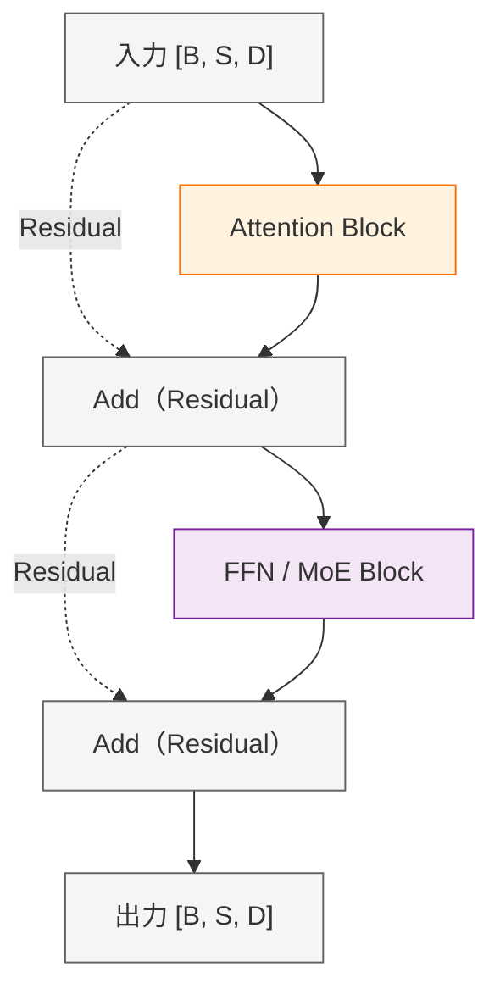
```mermaid
graph TB
    Input["入力 [B, S, D]"]

    AttnBlock["Attention Block"]
    Add1["Add（Residual）"]

    FFNBlock["FFN / MoE Block"]
    Add2["Add（Residual）"]

    Output["出力 [B, S, D]"]

    Input --> AttnBlock
    Input -.->|"Residual"| Add1
    AttnBlock --> Add1

    Add1 --> FFNBlock
    Add1 -.->|"Residual"| Add2
    FFNBlock --> Add2

    Add2 --> Output

    style Input fill: #f5f5f5,stroke: #616161
    style AttnBlock fill: #fff3e0,stroke: #ff6f00
    style FFNBlock fill: #f3e5f5,stroke: #7b1fa2
    style Add1 fill: #f5f5f5,stroke: #616161
    style Add2 fill: #f5f5f5,stroke: #616161
    style Output fill: #f5f5f5,stroke: #616161
```

各ブロックは特定のテンソル次元に対して計算を行うため、異なる並列化戦略が適用されます。

### レイヤ 2: Attention Block の内部構造と並列化

Attention Block では、以下の 4 つの処理が順番に実行されます。

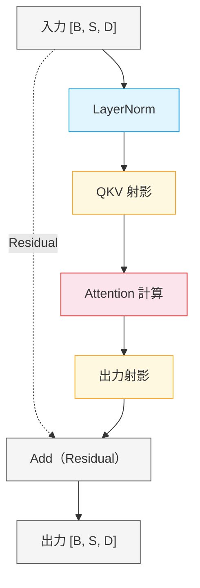
```mermaid
graph TB
    Input["入力 [B, S, D]"]

    LN1["LayerNorm"]
    QKV["QKV 射影"]
    Attn["Attention 計算"]
    OutProj["出力射影"]

    Add1["Add（Residual）"]
    Output1["出力 [B, S, D]"]

    Input --> LN1
    Input -.->|"Residual"| Add1
    LN1 --> QKV --> Attn --> OutProj --> Add1
    Add1 --> Output1

    style Input fill: #f5f5f5,stroke: #616161
    style LN1 fill: #e1f5fe,stroke: #0288d1
    style QKV fill: #fff8e1,stroke: #f9a825
    style Attn fill: #fce4ec,stroke: #c62828
    style OutProj fill: #fff8e1,stroke: #f9a825
    style Add1 fill: #f5f5f5,stroke: #616161
    style Output1 fill: #f5f5f5,stroke: #616161
```

**各処理に適用される並列化とその理由**:

| 処理 | 並列化 | 理由 | 分割対象 |
|------|--------|------|----------|
| LayerNorm | sp | 各トークンに独立して正規化を適用する要素単位演算 | シーケンス次元 S を分割 |
| QKV 射影 | tp | 大きな重み行列 `[D, 3D]` による行列積演算 | 注意ヘッド方向（出力次元）を分割 |
| Attention 計算 | cp | 長いシーケンス（例: 128K トークン）での注意計算 | Query/Key/Value のシーケンス次元を分割 |
| 出力射影 | tp | 分割された注意ヘッドを元の次元に戻す行列積演算 | 入力次元（ヘッド方向）を分割 |

---

### レイヤ 2: FFN/MoE Block の内部構造と並列化

FFN/MoE Block では、以下の 2 つの処理が実行されます。

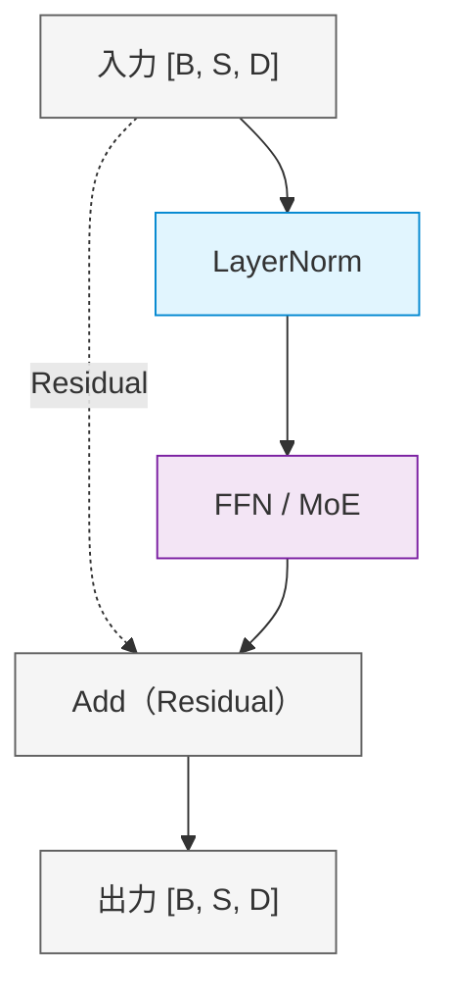
```mermaid
graph TB
    Input2["入力 [B, S, D]"]

    LN2["LayerNorm"]
    FFN["FFN / MoE"]

    Add2["Add（Residual）"]
    Output2["出力 [B, S, D]"]

    Input2 --> LN2
    Input2 -.->|"Residual"| Add2
    LN2 --> FFN --> Add2
    Add2 --> Output2

    style Input2 fill: #f5f5f5,stroke: #616161
    style LN2 fill: #e1f5fe,stroke: #0288d1
    style FFN fill: #f3e5f5,stroke: #7b1fa2
    style Add2 fill: #f5f5f5,stroke: #616161
    style Output2 fill: #f5f5f5,stroke: #616161
```

**各処理に適用される並列化とその理由**:

| 処理 | 並列化 | 理由 | 分割対象 |
|------|--------|------|----------|
| LayerNorm | sp | 各トークンに独立して正規化を適用する要素単位演算 | シーケンス次元 S を分割 |
| FFN（通常） | tp | 大きな重み行列による線形変換（`[D, 4D]` → `[4D, D]`） | 中間次元（4D）を分割 |
| MoE | ep | 複数のエキスパート（小さな FFN）を条件付きで使用 | エキスパートを異なる GPU に配置し、トークンを動的にルーティング |

---

## 並列化戦略の組み合わせと全体像

実際の大規模モデルの訓練では、これらの並列化戦略を**組み合わせて**使用します。全ての並列化を適用した場合、1 つの GPU が保持するローカルテンソルの形状は次のようになります。

```
ローカルテンソル形状: [B/dp, S/(cp*sp), D]
```

- `B/dp` -- バッチが Data Parallel で分割される
- `S/(cp*sp)` -- シーケンスが Context Parallel と Sequence Parallel で分割される
- `D` -- 隠れ次元は各 GPU で完全に保持される（Tensor Parallel は重み行列側を分割する）

以下に、各並列化が Transformer のどのコンポーネントに影響するかをまとめます。

| コンポーネント | dp | tp | sp | cp | ep | vp | 主な通信 |
|---------------|-----|-----|-----|-----|-----|-----|---------|
| Embedding     | o   |     |     |     |     | o   | ReduceScatter |
| LayerNorm     | o   |     | o   |     |     |     | -- |
| Attention     | o   | o   | o   | o   |     |     | AllGather, ReduceScatter |
| MLP           | o   | o   | o   |     |     |     | AllGather, ReduceScatter |
| MoE           | o   |     |     |     | o   |     | AllToAll |
| Loss          | o   |     |     |     |     | o   | AllReduce |

各戦略の**デバイスグループ**は通常、異なるスケールで構成されます。

```
典型的な構成（64 GPU の場合）:
  総 GPU 数 = dp x tp x cp = 8 x 4 x 2 = 64

  dp = 8   (データ並列度: 8 グループ)
  tp = 4   (テンソル並列度: ノード内の高速接続を活用)
  sp = 4   (tp と同じグループ内で動作)
  cp = 2   (文脈並列度)
  ep = 8   (エキスパート並列度: MoE 使用時)
  vp = 4   (tp と同じグループ内で動作)

注: sp, vp は tp と同じデバイスグループで動作するため、
独立した並列度としてカウントされません。
```

:::message
Expert Parallel のデバイスグループは、Data Parallel のグループを再利用することが一般的です（ep = dp）[^3]。これは、ep が独立したデバイス次元を追加するのではなく、dp と同じ GPU 集合の中でエキスパートを分散配置するためです。例えば dp = 8 の場合、8 台の GPU それぞれに異なるエキスパートを配置し、AllToAll 通信でトークンをルーティングします。

[^3]: Megatron-LM および DeepSpeed の実装による
:::

**重要な設計原則**: Tensor Parallel はデバイス間の通信頻度が高いため、NVLink などの高速接続を持つ同一ノード内の GPU に割り当てます。Data Parallel はノード間でも問題なく動作します。

以下の図は、8 GPU を使った場合のデバイスグループ階層の例を示しています。

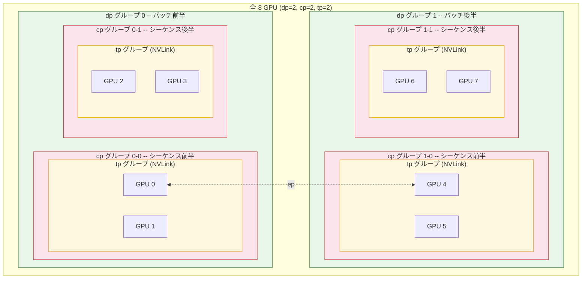
```mermaid
graph TB
    subgraph all ["全 8 GPU (dp=2, cp=2, tp=2)"]
        subgraph dp0 ["dp グループ 0 -- バッチ前半"]
            subgraph cp00 ["cp グループ 0-0 -- シーケンス前半"]
                subgraph tp000 ["tp グループ (NVLink)"]
                    GPU0["GPU 0"]
                    GPU1["GPU 1"]
                end
            end
            subgraph cp01 ["cp グループ 0-1 -- シーケンス後半"]
                subgraph tp010 ["tp グループ (NVLink)"]
                    GPU2["GPU 2"]
                    GPU3["GPU 3"]
                end
            end
        end

        subgraph dp1 ["dp グループ 1 -- バッチ後半"]
            subgraph cp10 ["cp グループ 1-0 -- シーケンス前半"]
                subgraph tp100 ["tp グループ (NVLink)"]
                    GPU4["GPU 4"]
                    GPU5["GPU 5"]
                end
            end
            subgraph cp11 ["cp グループ 1-1 -- シーケンス後半"]
                subgraph tp110 ["tp グループ (NVLink)"]
                    GPU6["GPU 6"]
                    GPU7["GPU 7"]
                end
            end
        end
    end

    GPU0 <-.->|"ep"| GPU4

    style dp0 fill: #e8f5e9,stroke: #2e7d32
    style dp1 fill: #e8f5e9,stroke: #2e7d32
    style cp00 fill: #fce4ec,stroke: #c62828
    style cp01 fill: #fce4ec,stroke: #c62828
    style cp10 fill: #fce4ec,stroke: #c62828
    style cp11 fill: #fce4ec,stroke: #c62828
    style tp000 fill: #fff8e1,stroke: #f9a825
    style tp010 fill: #fff8e1,stroke: #f9a825
    style tp100 fill: #fff8e1,stroke: #f9a825
    style tp110 fill: #fff8e1,stroke: #f9a825
```

階層構造は次の通りです。dp = 2 でデータを 2 グループに分割し（dp グループ 0, 1）、cp = 2 で各 dp グループ内のシーケンスを 2 分割します（cp グループ 0-0, 0-1 など）。tp = 2 で各 cp グループ内のテンソルを 2 分割し（同一ノード内の GPU ペア）、sp = tp = 2 で tp と同じグループ内で動作します。ep = 2 は MoE 使用時に dp グループを再利用し、GPU 0 と GPU 4 が異なるエキスパートを担当します。

この構成では、総 GPU 数 = dp x cp x tp = 2 x 2 x 2 = 8 となります。

---

## まとめ

本記事では、Transformer の分散並列化を支える 6 つの並列化戦略と 4 つの集団通信操作を解説しました。

Transformer の分散並列化は、バッチ（dp）、重み行列（tp）、アクティベーション（sp）、注意シーケンス（cp）、エキスパート（ep）、語彙（vp）という 6 つの異なる次元の分割と、AllGather、ReduceScatter、AllToAll、AllReduce の 4 つの集団通信操作の組み合わせで実現されます。各戦略は独立に適用するのではなく、デバイスグループの階層（ノード内に tp/sp、ノード間に dp/cp）に基づいて組み合わせることが重要です。

### 知見の一覧

| 並列化戦略 | 分割対象 | 主な通信操作 | 適用場所 |
|-----------|---------|------------|---------|
| Data Parallel (dp) | バッチ B | AllReduce | モデル全体 |
| Tensor Parallel (tp) | 重み行列の次元 | AllGather, ReduceScatter | QKV 射影、FFN 線形層 |
| Sequence Parallel (sp) | シーケンス S（要素単位演算） | AllGather, ReduceScatter | LayerNorm, Dropout |
| Context Parallel (cp) | シーケンス S（注意機構内） | P2P 送受信 / AllGather | Attention 計算 |
| Expert Parallel (ep) | エキスパート数 E | AllToAll | MoE 層 |
| Vocab Parallel (vp) | 語彙次元 V | ReduceScatter | 埋め込み層、損失計算 |

### 学んだ教訓

| 教訓 | 詳細 |
|------|------|
| 並列化は分割対象が異なる | 各戦略はテンソルの異なる次元（B, S, D, E, V）を分割しており、相互に補完的 |
| デバイスグループの階層設計が重要 | tp は高帯域幅のノード内、dp はノード間に配置するのが基本原則 |
| sp は tp の補完 | sp は独立した並列度ではなく、tp と同じデバイスグループ内でアクティベーションメモリを削減する仕組み |
| 通信と計算の重複が性能の鍵 | Ring Attention のように通信と計算をパイプライン化することでオーバーヘッドを削減可能 |
| AllReduce = ReduceScatter + AllGather | この分解を理解すると tp/sp 間の形状切り替えの仕組みが明確になる |

---

## 参考文献

### Transformer アーキテクチャ

- [Attention Is All You Need (Vaswani et al., 2017)](https://arxiv.org/abs/1706.03762) -- Transformer 原論文

### 分散並列化

- [Distributed Compute in Transformer (ailzhang)](https://ailzhang.github.io/posts/distributed-compute-in-transformer/)（[Wayback Machine](https://web.archive.org/web/2025/https://ailzhang.github.io/posts/distributed-compute-in-transformer/)）
- [Megatron-LM: Training Multi-Billion Parameter Language Models Using Model Parallelism (Shoeybi et al., 2019)](https://arxiv.org/abs/1909.08053)
- [Reducing Activation Recomputation in Large Transformer Models (Korthikanti et al., 2022)](https://arxiv.org/abs/2205.05198) -- Megatron-LM 版 Sequence Parallelism
- [Sequence Parallelism: Long Sequence Training from System Perspective (Li et al., 2021)](https://arxiv.org/abs/2105.13120) -- Ring-based アプローチの Sequence Parallelism（別手法）
- [Ring Attention with Blockwise Transformers for Near-Infinite Context (Liu et al., 2023)](https://arxiv.org/abs/2310.01889)
- [Switch Transformers: Scaling to Trillion Parameter Models with Simple and Efficient Sparsity (Fedus et al., 2021)](https://arxiv.org/abs/2101.03961)
- [GPipe: Efficient Training of Giant Neural Networks using Pipeline Parallelism (Huang et al., 2019)](https://arxiv.org/abs/1811.06965)
- [PipeDream: Fast and Efficient Pipeline Parallel DNN Training (Harlap et al., 2019)](https://arxiv.org/abs/1806.03377)

### 大規模言語モデル

- [Language Models are Few-Shot Learners (Brown et al., 2020)](https://arxiv.org/abs/2005.14165) -- GPT-3
- [LLaMA: Open and Efficient Foundation Language Models (Touvron et al., 2023)](https://arxiv.org/abs/2302.13971)

### ライブラリ・ドキュメント

- [NVIDIA Megatron-LM GitHub](https://github.com/NVIDIA/Megatron-LM) (参照: v3.0 以降)
- [NCCL Documentation - Collective Operations](https://docs.nvidia.com/deeplearning/nccl/user-guide/docs/usage/collectives.html)
