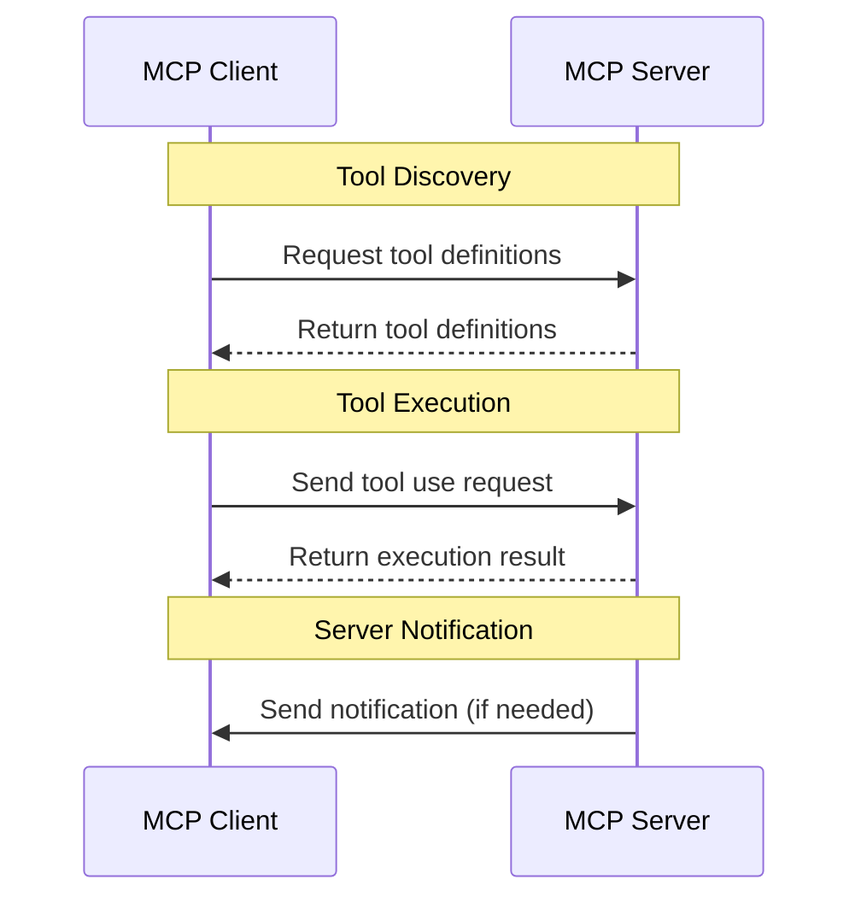

___Understanding MCP:___ _Explanation of prerequisite knowledge needed to understand MCP vulnerabilities and countermeasures_

---

This chapter's explanation is based on the [specification](https://modelcontextprotocol.io/specification/2025-03-26) from 2025-03-26.

MCP Specification: **Base Protocol (We are here)**, Authorization, Client Features, Server Features, Security Best Practices

## MCP Components

The MCP specification defines three main components: **1/ MCP Client**, **2/ MCP Server**, and **3/ Transport**. Let's look at each component in detail.

### 1. MCP Client

The MCP Client is responsible for managing communication between the AI model and the MCP Server. It handles:

- **Tool Discovery:** Obtains tool definitions from the MCP Server
- **Tool Use Request:** Sends tool use requests to the MCP Server
- **Result Handling:** Receives tool execution results from the MCP Server
- **Error Handling:** Manages errors that occur during tool use

### 2. MCP Server

The MCP Server provides tools and handles tool execution requests. It is responsible for:

- **Tool Definition:** Defines available tools and their schemas
- **Tool Execution:** Executes tools based on requests from the MCP Client
- **Result Return:** Returns tool execution results to the MCP Client
- **Error Handling:** Manages errors that occur during tool execution

### 3. Transport

Transport defines how the MCP Client and Server communicate. The specification defines two transport mechanisms:

- **STDIO:** Communication through standard input/output
- **Streamable HTTP:** Communication through HTTP and Server-Sent Events (SSE)

## Communication Protocol

The communication protocol between MCP Client and Server is based on JSON-RPC 2.0. JSON-RPC 2.0 is a lightweight remote procedure call protocol that uses JSON for data encoding.

### JSON-RPC 2.0 Message Types

There are three types of messages in JSON-RPC 2.0:

1. **Request:** A message sent from the Client to the Server to request tool execution
2. **Response:** A message sent from the Server to the Client in response to a request
3. **Notification:** A one-way message that doesn't require a response

### Message Format

**1. Request Message**

```json
{
  "jsonrpc": "2.0",
  "method": "tool_name",
  "params": {
    "param1": "value1",
    "param2": "value2"
  },
  "id": 1
}
```

**2. Response Message**

```json
{
  "jsonrpc": "2.0",
  "result": {
    "data": "result data"
  },
  "id": 1
}
```

**3. Error Response**

```json
{
  "jsonrpc": "2.0",
  "error": {
    "code": -32600,
    "message": "Invalid Request"
  },
  "id": 1
}
```

**4. Notification Message**

```json
{
  "jsonrpc": "2.0",
  "method": "notification_name",
  "params": {
    "param1": "value1"
  }
}
```

### Communication Flow

Let's look at a typical communication flow between MCP Client and Server:



## Summary

In this Chapter, we explained the components that make up MCP and the communication protocol between them. Understanding these components and their roles is essential for understanding MCP vulnerabilities and countermeasures. In the following Chapters, we will explain each component in more detail.
