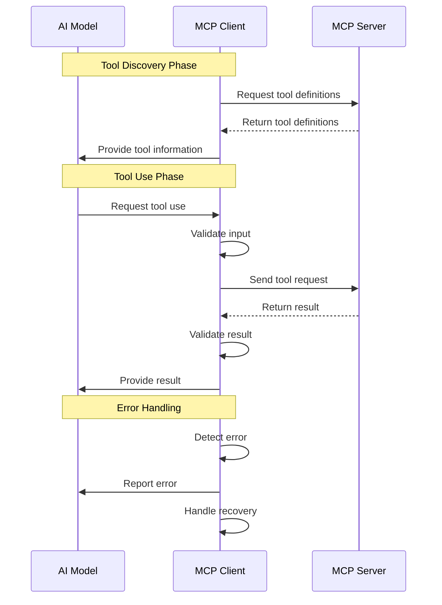

___Understanding MCP:___ _Explanation of prerequisite knowledge needed to understand MCP vulnerabilities and countermeasures_

---

This chapter's explanation is based on the [specification](https://modelcontextprotocol.io/specification/2025-03-26) from 2025-03-26.

MCP Specification: **Base Protocol (We are here)**, Authorization, Client Features, Server Features, Security Best Practices

## MCP Client

The MCP Client is responsible for managing communication between the AI model and the MCP Server. Let's look at the MCP Client's responsibilities in detail.

### 1. Tool Discovery

The MCP Client obtains tool definitions from the MCP Server. Tool definitions include:

- **Tool Name:** The name of the tool
- **Description:** A description of what the tool does
- **Input Schema:** The format of input parameters the tool accepts
- **Output Schema:** The format of the tool's output

```json
{
  "name": "weather_forecast",
  "description": "Get weather forecast for a specific location",
  "input_schema": {
    "type": "object",
    "properties": {
      "location": {
        "type": "string",
        "description": "City name or coordinates"
      },
      "days": {
        "type": "integer",
        "description": "Number of days to forecast"
      }
    },
    "required": ["location"]
  }
}
```

### 2. Tool Use Request

When the AI model wants to use a tool, the MCP Client:

1. **Validates Input:** Ensures the AI model's input matches the tool's schema
2. **Formats Request:** Creates a JSON-RPC request message
3. **Sends Request:** Transmits the request to the MCP Server

```json
{
  "jsonrpc": "2.0",
  "method": "weather_forecast",
  "params": {
    "location": "Tokyo",
    "days": 5
  },
  "id": 1
}
```

### 3. Result Handling

After the MCP Server executes the tool, the MCP Client:

1. **Receives Result:** Gets the execution result from the Server
2. **Validates Result:** Ensures the result matches the expected schema
3. **Processes Result:** Handles the result appropriately (e.g., passing it to the AI model)

```json
{
  "jsonrpc": "2.0",
  "result": {
    "forecast": [
      {
        "date": "2025-06-26",
        "temperature": 28,
        "condition": "sunny"
      }
    ]
  },
  "id": 1
}
```

### 4. Error Handling

The MCP Client must handle various types of errors:

1. **Connection Errors:** Problems connecting to the MCP Server
2. **Validation Errors:** Invalid input or output data
3. **Execution Errors:** Errors that occur during tool execution
4. **Transport Errors:** Issues with the communication channel

```json
{
  "jsonrpc": "2.0",
  "error": {
    "code": -32602,
    "message": "Invalid params: location is required"
  },
  "id": 1
}
```

### 5. Communication Flow

Here's a detailed look at how the MCP Client manages communication:



## Summary

In this Chapter, we explained the MCP Client's responsibilities and how it manages communication between the AI model and MCP Server. The MCP Client plays a crucial role in ensuring secure and reliable tool use. In the next Chapter, we will explain the MCP Server in detail.
