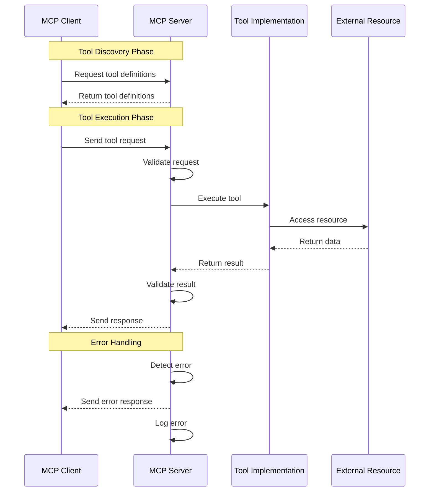

___Understanding MCP:___ _Explanation of prerequisite knowledge needed to understand MCP vulnerabilities and countermeasures_

---

This chapter's explanation is based on the [specification](https://modelcontextprotocol.io/specification/2025-03-26) from 2025-03-26.

MCP Specification: **Base Protocol (We are here)**, Authorization, Client Features, Server Features, Security Best Practices

## MCP Server

The MCP Server provides tools and handles tool execution requests. Let's look at the MCP Server's responsibilities in detail.

### 1. Tool Definition

The MCP Server defines the tools it provides. Tool definitions include:

- **Tool Name:** The name of the tool
- **Description:** A description of what the tool does
- **Input Schema:** The format of input parameters the tool accepts
- **Output Schema:** The format of the tool's output

```json
{
  "name": "database_query",
  "description": "Execute a SQL query on the database",
  "input_schema": {
    "type": "object",
    "properties": {
      "query": {
        "type": "string",
        "description": "SQL query to execute"
      },
      "database": {
        "type": "string",
        "description": "Database name"
      }
    },
    "required": ["query", "database"]
  }
}
```

### 2. Tool Execution

When the MCP Server receives a tool use request, it:

1. **Validates Request:** Ensures the request is properly formatted
2. **Validates Input:** Checks that the input parameters match the tool's schema
3. **Executes Tool:** Runs the requested tool with the provided parameters
4. **Formats Result:** Prepares the execution result in the expected format

### 3. Result Return

After executing the tool, the MCP Server:

1. **Validates Result:** Ensures the result matches the expected schema
2. **Creates Response:** Formats the result as a JSON-RPC response
3. **Sends Response:** Transmits the response to the MCP Client

```json
{
  "jsonrpc": "2.0",
  "result": {
    "rows": [
      {
        "id": 1,
        "name": "Product A",
        "price": 100
      }
    ],
    "count": 1
  },
  "id": 1
}
```

### 4. Error Handling

The MCP Server must handle various types of errors:

1. **Validation Errors:** Invalid requests or input parameters
2. **Execution Errors:** Problems that occur during tool execution
3. **Internal Errors:** Issues within the Server itself
4. **Resource Errors:** Problems with external resources the tool depends on

```json
{
  "jsonrpc": "2.0",
  "error": {
    "code": -32000,
    "message": "Database connection failed",
    "data": {
      "details": "Could not connect to database 'products'"
    }
  },
  "id": 1
}
```

### 5. Communication Flow

Here's a detailed look at how the MCP Server manages communication:



### 6. Security Considerations

The MCP Server must implement various security measures:

1. **Input Validation:** Thoroughly validate all input to prevent injection attacks
2. **Authentication:** Verify the identity of clients (optional in the base protocol)
3. **Authorization:** Control access to tools based on client identity (optional in the base protocol)
4. **Rate Limiting:** Prevent abuse by limiting request frequency
5. **Resource Isolation:** Ensure tools cannot interfere with each other or the Server
6. **Error Handling:** Avoid leaking sensitive information in error messages

## Summary

In this Chapter, we explained the MCP Server's responsibilities and how it handles tool execution requests. The MCP Server plays a crucial role in providing tools securely and reliably. In the next Chapter, we will explain the transport mechanisms used for communication between MCP Client and Server.
