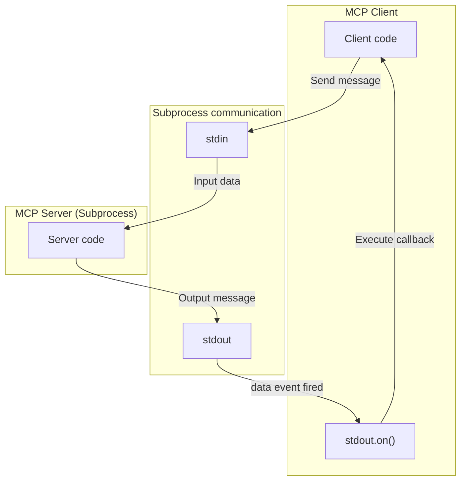

___Advanced Understanding of MCP:___ _Explanation of developer-oriented knowledge necessary to understand MCP vulnerabilities and countermeasures_

---

This chapter's explanation is based on the [specification](https://modelcontextprotocol.io/specification/2025-03-26) from 2025-03-26.

MCP Specification: **Base Protocol (We are here)**, Authorization, Client Features, Server Features, Security Best Practices

In this Chapter, we will explain the [transports](https://modelcontextprotocol.io/specification/2025-03-26/basic/transports) of the Base Protocol. We discussed transports in Chapter 04, but this time we will explain them in more detail.

While JSON-RPC 2.0 is transport-independent, MCP defines two transport mechanisms for Client ↔︎ Server communication in its specification: [STDIO](https://modelcontextprotocol.io/specification/2025-03-26/basic/transports#stdio) and [Streamable HTTP](https://modelcontextprotocol.io/specification/2025-03-26/basic/transports#streamable-http). The specification defines how these transports should handle connections for message sending and receiving.

## STDIO

In the case of STDIO transport, the Client launches the MCP Server as a subprocess. A subprocess is a mechanism to provide commands or programs **independently** from the main process. For example, in Node.js, this can be achieved through the `child_process` module. A sample code for subprocess generation using TypeScript is provided at the end of this Chapter. It's a simple example that just runs `echo -e hello\nmcp!` in a separate process.

```bash:Execution result
$ ts-node sample.ts
Command execution result:
hello
mcp!
```



The ChildProcess class inherits from [`EventEmitter`](https://nodejs.org/ja/learn/asynchronous-work/the-nodejs-event-emitter). Therefore, it supports an event-driven model, where when some event occurs, it calls a function corresponding to that event. The `on(event, listener)` method can be used to register event listener functions for specific events. The ChildProcess object is associated with three streams: `child.stdout`, `child.stdin`, and `child.stderr`.

Every time the MCP Server writes something to the standard output, a `data` event is issued on the `stdout` stream object. The Client receives the data and performs some processing through an event listener that is triggered when the `data` event is issued.

```typescript:Example of registering an event listener using the on() method
// Receive data from standard output
childProcess.stdout?.on('data', (data: Buffer) => {
   output += data.toString();
});
```

STDIO is a method where the Client and Server exchange data through a child process using such a mechanism. In practice, there are implementations that interpret messages in JSON RPC 2.0 format from the output. While we'll omit the Server-side implementation, messages from the Server are passed to the Client as messages through an event-driven approach.

## Summary

In this Chapter, we explained STDIO, one of the transports defined in the MCP Base Protocol. Understanding the conceptual part of the implementation can greatly change the resolution of security measures, so let's make sure to understand the code thoroughly. In the next Chapter, we will explain the STDIO implementation of the typescript-sdk.

## Sample Code

```bash:Installing necessary libraries
$ npm install typescript ts-node && npm install --save-dev @types/node
```

```typescript:sample.ts
import { spawn, ChildProcess } from 'child_process';

// Function to launch a child process
function runCommand(command: string, args: string[]): Promise<string> {
  return new Promise((resolve, reject) => {
    // Launch child process
    const childProcess: ChildProcess = spawn(command, args);

    let output = '';
    let errorOutput = '';

    // Receive data from standard output
    childProcess.stdout?.on('data', (data: Buffer) => {
      output += data.toString();
    });

    // Receive data from error output
    childProcess.stderr?.on('data', (data: Buffer) => {
      errorOutput += data.toString();
    });

    // Detect process termination
    childProcess.on('close', (code: number) => {
      if (code === 0) {
        resolve(output);
      } else {
        reject(new Error(`Command failed: ${errorOutput}`));
      }
    });

    // Handle error events
    childProcess.on('error', (error: Error) => {
      reject(error);
    });
  });
}

// Example of using the function
async function main() {
  try {
    const result = await runCommand('echo', ['-e', 'hello\nmcp!']);
    console.log('Command execution result:');
    console.log(result);
  } catch (error) {
    console.error('An error occurred:', error);
  }
}

main();
```

```json:tsconfig.json
{
  "compilerOptions": {
    "target": "es2016",
    "module": "commonjs",
    "esModuleInterop": true,
    "forceConsistentCasingInFileNames": true,
    "strict": true,
    "strictNullChecks": true,
    "skipLibCheck": true
  }
}
