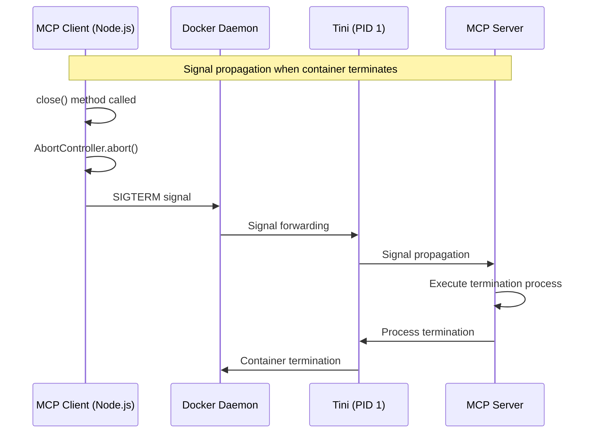
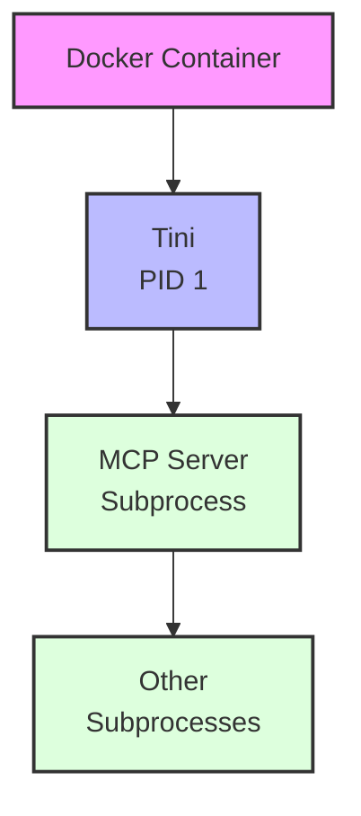

___Understanding MCP Implementation:___ _Explanation of developer-oriented knowledge necessary to implement MCP vulnerabilities and countermeasures_

---

This chapter's explanation is based on the [specification](https://modelcontextprotocol.io/specification/2025-06-18) from 2025-06-18.

MCP Specification: **Base Protocol (We are here)**, Authorization, Client Features, Server Features, Security Best Practices

In this Chapter, we will explain the [Client implementation](https://github.com/modelcontextprotocol/typescript-sdk/blob/1.13.2/src/client/stdio.ts) and [Server implementation](https://github.com/modelcontextprotocol/typescript-sdk/blob/1.13.2/src/server/stdio.ts) of STDIO in typescript-sdk (tag: 1.13.2). As explained in Chapter 07, it's actually just calling a subprocess. It controls environment variables and receives commands and arguments to launch a subprocess.

Even with typescript-sdk, there may be vulnerable implementations. Since the implementation is still in its early stages, it should not be fully trusted, and vulnerability checks should be performed.

## Client Implementation

**1. Main Classes**

The `StdioClientTransport` class implements the `Transport` interface and manages communication with the MCP Server subprocess. The `StdioServerParameters` type defines how to launch the Server process.

https://github.com/modelcontextprotocol/typescript-sdk/blob/1.13.2/src/client/stdio.ts#L91

> Transport interface

https://github.com/modelcontextprotocol/typescript-sdk/blob/main/src/shared/transport.ts#L29-L83

Concrete transport implementations such as `StdioClientTransport` and `StreamableHttpClientTransport` inherit this `Transport` interface. The `Transport` defines methods such as `start()`, `close()`, and `send(message: JSONRPCMessage)`. This abstraction hides the differences in how the transport layer implements connections. (FIXME: This explanation needs verification)

**2. Environment Variable Inheritance**

This implementation inherits only the minimum necessary environment variables to the subprocess, similar to the default environment variable inheritance list of the `sudo` command. And it **excludes executable code to prevent command injection**. Care is taken to prevent API keys and other information from leaking to the subprocess. Environment variables defined by the user themselves are set in the subprocess.

https://github.com/modelcontextprotocol/typescript-sdk/blob/1.13.2/src/client/stdio.ts#L66-L84

**3. Subprocess Launch and Communication**

This is the content we already explained in Chapter 07. It sets up event handlers.

https://github.com/modelcontextprotocol/typescript-sdk/blob/1.13.2/src/client/stdio.ts#L112-L170

Setting `shell` to `false` in the options is important for security. If set to `true`, it would launch a shell and execute user commands as strings directly, which poses a **risk of command injection**. This could lead to privilege escalation, backdoor installation, and other vulnerabilities.

https://github.com/modelcontextprotocol/typescript-sdk/blob/1.13.2/src/client/stdio.ts#L125

The [`option.stdio`](https://nodejs.org/api/child_process.html#optionsstdio) setting specifies how to handle the subprocess's standard input/output (stdin, stdout, stderr). `["pipe", "pipe", this._serverParams.stderr ?? "inherit"]` specifies the handling for `[stdin, stdout, stderr]` respectively.

Setting `pipe` creates a bidirectional pipe between the main process and the subprocess. By setting __stdin/stdout__ to `pipe`, JSON-RPC 2.0 messages can be programmatically controlled for sending and receiving. Setting __stderr__ to `inherit` by default allows the Server's logs and error messages to be displayed directly in the terminal.

Setting `shell` to `false` in the options is important for security. If set to `true`, it would launch a shell and execute user commands as strings directly, which poses a **risk of command injection**. This could lead to privilege escalation, backdoor installation, and other vulnerabilities.

**4. Message Processing**

https://github.com/modelcontextprotocol/typescript-sdk/blob/1.13.2/src/client/stdio.ts#L157-L160

When the MCP Server writes a JSON-RPC 2.0 message to `stdout`, as mentioned earlier, a `data` event is issued on the `child.stdout` stream, and the `data` event handler adds the data to `_readBuffer`. Then the `processReadBuffer()` method is called.

https://github.com/modelcontextprotocol/typescript-sdk/blob/1.13.2/src/client/stdio.ts#L187-L200

https://github.com/modelcontextprotocol/typescript-sdk/blob/main/src/shared/protocol.ts#L302-L315

The `processReadBuffer()` method uses the `ReadBuffer` class to extract JSON-RPC 2.0 messages from the received byte stream. It then calls the `onmessage` callback of the Transport interface. The Protocol class receives this message and dispatches processing according to the message type to appropriate handlers like `_onresponse`, `_onrequest`, or `_onnotification`.

**5. Message Sending**

https://github.com/modelcontextprotocol/typescript-sdk/blob/main/src/client/stdio.ts#L209-L223

The `send()` method sends a JSON-RPC 2.0 message to the Server. It uses `serializeMessage` to serialize the message and writes it to the subprocess's standard input. For backpressure handling, if the write buffer is full, it waits for the `drain` event. Backpressure handling refers to congestion control. Essentially, when the receiver is about to be unable to handle more data, the sender waits a bit to send data out of consideration for the receiver. There are various implementation methods, but for example, when the receiver's buffer is about to become full, the receiver notifies the sender of the congestion state, and upon receiving this notification, the sender stores a certain amount of transmission data in a buffer.

## Server Implementation

You'll notice that the Server-side code is similar to the Client's. Therefore, we'll focus on explaining the differences. **1/ Input/output direction**: In the Client's case, `stdin` reads from the Server's `stdout` and writes to `stdin`. In the Server's case, it reads from its own `stdin` and writes to `stdout`. **2/ Process management**: The Client manages the subprocess and its lifecycle events, but the Server only deals with its own process and events. **3/ Termination handling**: The Client has the responsibility to terminate the subprocess.

Once you understand these differences, you should be able to read through the code smoothly and understand it naturally.

## STDIO Implementation Security Vulnerabilities

The typescript-sdk STDIO implementation has potential vulnerabilities, or the responsibility for addressing these vulnerabilities may lie with the SDK users. This might be due to a philosophy that implementation should not add restrictions that are not explicitly specified in the standard. The SDK developers may have intentionally avoided adding restrictions that aren't explicitly mentioned in the specification.

**1. Process Creation and Command Execution**

In STDIO, **the risk of users themselves setting and executing untrusted commands or arguments cannot be prevented in principle**. For example, [`uvx`](https://docs.astral.sh/uv/guides/tools/), which is often seen in MCP configurations, is a command that directly uses Python packages. Using this could execute malicious libraries, potentially allowing arbitrary code execution on the system.

https://github.com/modelcontextprotocol/typescript-sdk/blob/main/src/client/stdio.ts#L121-L123

The current `stdio.ts` implementation has risks such as: **1/** insufficient sanitization of commands and arguments, and **2/** no restrictions on the types of executable commands. While the responsibility may lie with the caller of `StdioClientTransport`, it's important not to assume the SDK handles everything and to conduct thorough reviews and take appropriate measures.

**2. Input Validation and Message Parsing**

https://github.com/modelcontextprotocol/typescript-sdk/blob/64a60c4ecdccdd914ea093d4994b50e2ef4c1edb/src/shared/stdio.ts#L23-L25

The current `stdio.ts` implementation has no message size limits, which could lead to potential DoS attacks. There are also no memory usage limits, which could lead to buffer overflow attacks. SDK users should implement appropriate message size and resource limits at the application layer based on their specific usage requirements.

## Safe Use of STDIO

The following are personal recommendations, and MCP users must decide what countermeasures to implement based on their risk assessment.

**MUST Implement**

Numerous convenient STDIO-based MCP Servers are available, but they should not be used casually. The simplest and most important measure is to only use MCP Servers provided by trusted companies. Even these should not be blindly trusted, but officially provided tools from established companies are likely to have undergone more rigorous review since critical vulnerabilities could threaten the company's existence.

For sources that are less trustworthy (smaller companies or individuals), you must fully understand the code's behavior if you choose to use them. In such cases, avoid directly using packages like `uvx`. Even if a package seems harmless initially, there are attack methods that introduce vulnerabilities through later version updates.

[AWS MCP Servers](https://awslabs.github.io/mcp/) use `uvx` with STDIO, but for MCP Servers that access AWS resources, they properly utilize existing AWS security mechanisms like AWS profiles. MCP Servers that implement authentication and authorization through existing mechanisms without directly including access keys in configurations are generally more secure.

**SHOULD Implement**

You should use MCP in environments isolated at the infrastructure level. This prevents accidental leakage of confidential corporate information from your regular laptop. Ideally, using MCP Hosts in environments like AWS EC2 instances would be best. If that's difficult, using MCP Hosts on VS Code [Dev Containers](https://code.visualstudio.com/docs/devcontainers/containers) is also a good option. This allows for some level of resource and access restrictions.

MCP Servers that use access keys set in environment variables pose significant risks in case of key leakage and should not be used. Ideally, you should avoid using access keys altogether, but if you must use them, follow the principle of least privilege.

**RECOMMENDED to Implement**

It's recommended to use MCP Servers through containers. Docker officially provides [MCP Hub](https://hub.docker.com/mcp/server/notion/overview), and images tagged with `BUILD BY DOCKER` are built by Docker Inc., while those with the `SIGNED` tag have been signature-verified, ensuring they haven't been tampered with or unintentionally updated. The `Docker Scout Health Score` likely indicates vulnerability scanning has been performed, making these relatively safe to use. When using containers on local PCs, don't forget to apply the resource restrictions mentioned above.

Serving these MCP Server Images on AWS cloud services and accessing them securely through Lambda MCP Servers is a good approach for organizational use. This configuration allows infrastructure administrators to centrally manage and provide MCP Server Images and their execution platforms.

Other recommended measures include WAFs, monitoring, and various existing security best practices, but like existing security measures, how much to implement is a trade-off between business risk and agility. The final decision on what to implement rests with the organization's administrators and executives, not third parties.

## Summary

In this Chapter, we explained the detailed implementation and security of STDIO. While I cannot provide a complete guide for organizational use as situations differ by organization, I hope I've conveyed the points to consider.

If I were to implement MCP security controls for an organization, I would block all MCP Host installations on local PCs by default and force users to use MCP in cloud-based sandbox instances. This would prevent MCP from accessing important confidential information on local PCs and provide users with isolated sandboxes at the instance level.

## Column: Safe Execution of MCP Servers in Docker Containers

Let's look at an example of MCP Server configuration in a Docker image. There are important Docker flags in this configuration.

```bash
{
  "mcpServers": {
    "aws-documentation": {
      "command": "docker",
      "args": [
        "run",
        "-i",
        "--init",
        "--rm",
        "mcp/aws-documentation"
      ]
    }
  }
}
```

The two important flags in this configuration are `--rm` and `--init`. The `--rm` flag handles automatic cleanup when the container exits. And `--init` is an important flag for properly managing processes within the container.

Understanding how the `--init` flag works is particularly important. When this flag is specified, [Tini](https://github.com/krallin/tini) runs as PID 1 inside the container and becomes the cornerstone of process management. Tini serves two important roles: signal handling and zombie process collection.

The signal handling mechanism can be represented in a diagram as follows:



Also, the process structure inside the container is as follows:



Processes running as PID 1 have special responsibilities. While normal processes automatically terminate when they receive signals like SIGTERM, PID 1 processes ignore signals unless they have explicitly set signal handlers. This is a specification to maintain system stability, but it can be problematic in container environments.

Also, in Unix systems, when a subprocess terminates, its exit status needs to be collected by the main process. If the main process terminates first, its subprocesses are adopted by PID 1, and PID 1 must collect their exit statuses. Failure to do so results in zombie processes.

Tini solves these problems. It properly handles signals and propagates them to subprocesses, and reliably collects the status of terminated processes. Without the `--init` flag, the MCP Server itself would run as PID 1, potentially unable to handle these processes properly.

Thus, when running MCP Servers in Docker containers, using the `--init` flag is strongly recommended from a process management perspective. This ensures proper container lifecycle management and prevents resource leaks and process residue.
