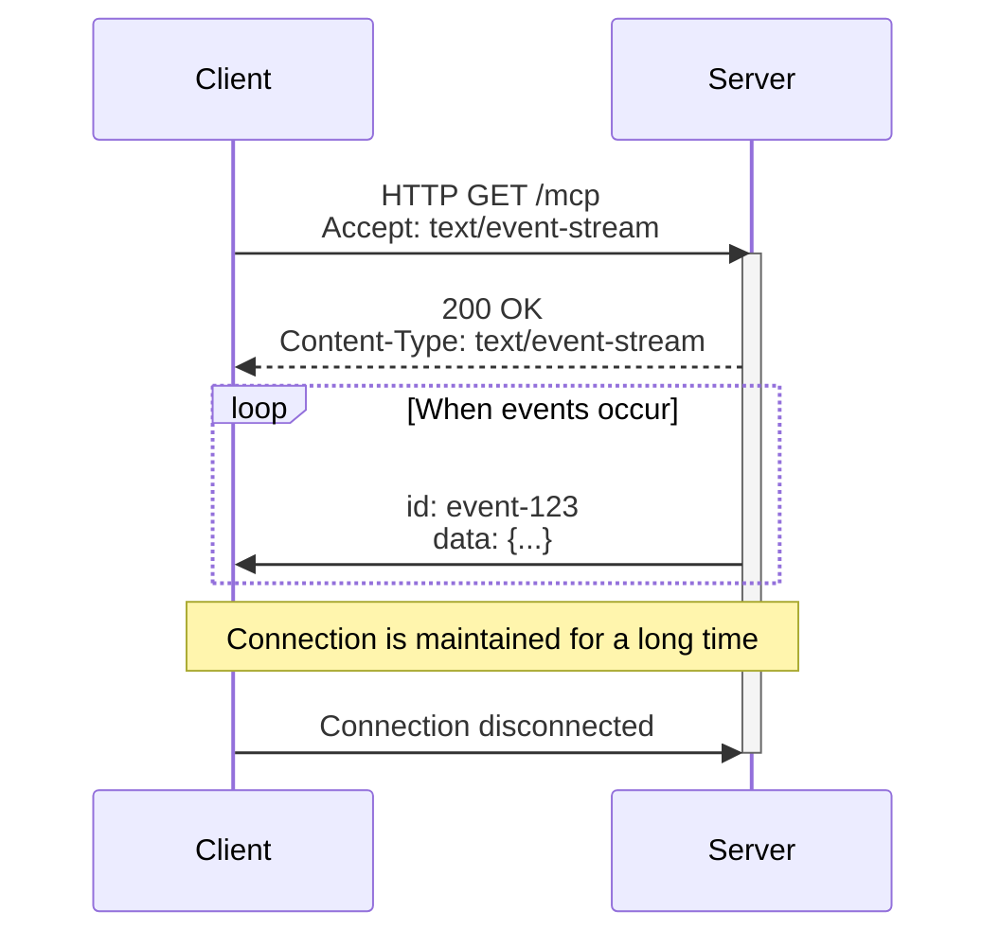
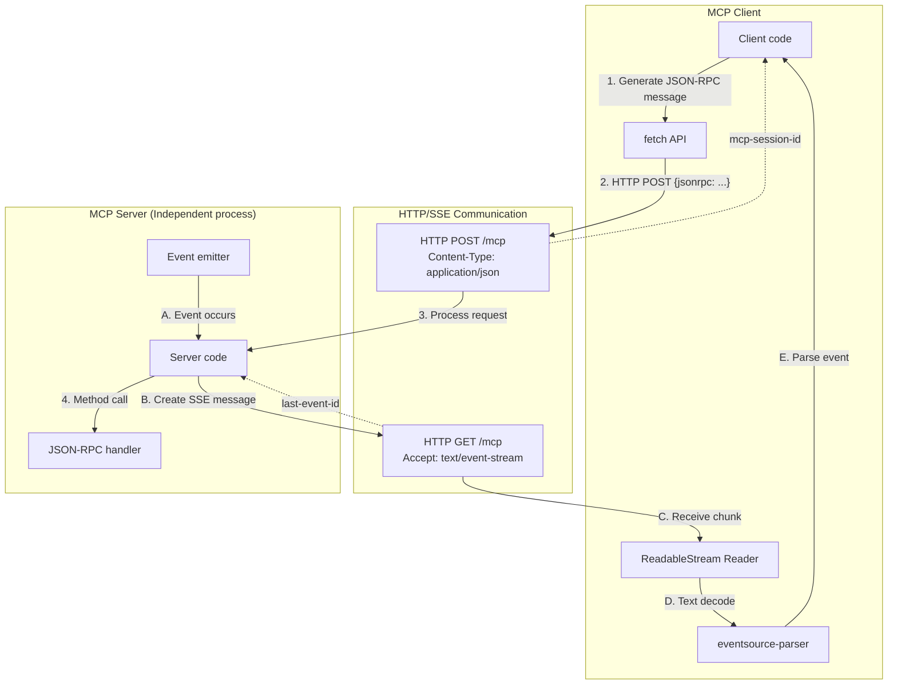

___Advanced Understanding of MCP:___ _Explanation of developer-oriented knowledge necessary to understand MCP vulnerabilities and countermeasures_

---

This chapter's explanation is based on the [specification](https://modelcontextprotocol.io/specification/2025-06-18) from 2025-06-18.

MCP Specification: **Base Protocol (We are here)**, Authorization, Client Features, Server Features, Security Best Practices

In this Chapter, we will explain the [transports](https://modelcontextprotocol.io/specification/2025-06-18/basic/transports) of the Base Protocol. We discussed transports in Chapter 04, but this time we will explain them in more detail.

While JSON-RPC 2.0 is transport-independent, MCP defines two transport mechanisms for Client ↔︎ Server communication in its specification: [STDIO](https://modelcontextprotocol.io/specification/2025-06-18/basic/transports#stdio) and [Streamable HTTP](https://modelcontextprotocol.io/specification/2025-06-18/basic/transports#streamable-http). The specification defines how these transports should handle connections for message sending and receiving.

## Streamable HTTP

Streamable HTTP transport combines HTTP and [Server-Sent Events (SSE)](https://en.wikipedia.org/wiki/Server-sent_events) to enable bidirectional communication. While STDIO transport communicates bidirectionally through a subprocess using event handlers, Streamable HTTP communicates over a network. SSE is a technology for real-time communication from Server to Client over HTTP. MCP achieves the bidirectional communication required by using HTTP requests from Client to Server and SSE from Server to Client.

**About SSE**

TypeScript sample code for SSE is provided at the end of this Chapter. In this implementation, `server.ts` starts a Server. This Server has an SSE endpoint at `/sse`. `client.ts` starts a Client. The Client sends an HTTP GET request to the Server's SSE endpoint with the `Accept: text/event-stream` header. The Server keeps this connection open and responds with status code `200`. From then on, the server uses the same connection to send data to the Client whenever an event occurs. In the example implementation, the Server sends the value of a counter to the Client every second as an event.

```bash:Server execution
$ ts-node server.ts 
Server started: http://localhost:3001
SSE endpoint: http://localhost:3001/sse
Client connected: New SSE session started
SSE event sent: Connection established message
SSE event sent: Count=1
SSE event sent: Count=2
SSE event sent: Count=3
^C
```

```bash:Client execution
$ ts-node client.ts 
SSE connection established
Received data: { message: 'Connection established' }
Received data: { count: 1, timestamp: '2025-06-10T01:48:46.018Z' }
Received data: { count: 2, timestamp: '2025-06-10T01:48:47.018Z' }
Received data: { count: 3, timestamp: '2025-06-10T01:48:48.019Z' }
Stream processing error: terminated
SSE connection ended
```



Since SSE is a simple mechanism built on top of HTTP, it can be implemented using basic APIs like fetch as long as you follow the appropriate headers and data format specifications. SSE is [standardized](https://html.spec.whatwg.org/multipage/server-sent-events.html#server-sent-events) by WHATWG.

**About Streamable HTTP**

The following illustrates the communication flow of Streamable HTTP using HTTP and SSE. We'll explain the details next time, but there is a single endpoint `/mcp`, with `POST` for JSON-RPC 2.0 message sending from Client to Server (arrows 1-4), and `GET` for SSE from Server to Client (arrows A-E).



**Feature Comparison Table**

I've created a simple feature comparison table for STDIO and Streamable HTTP. Readers who have read this far should now understand what it means for MCP to be transport-independent. Transport can be STDIO, HTTP, WebSocket, or any method as long as it enables bidirectional communication between Server and Client in a way that meets the MCP specification.

| Feature | STDIO | Streamable HTTP |
|------|---------------------|---------------------------|
| Communication method | Standard input/output (stdin/stdout) | HTTP + SSE |
| Process | Launched as a subprocess | Independent process |
| Connection range | Local machine only | Network (local/remote) |
| Multiple connections | 1-to-1 connection only | Supports multiple Client connections |
| Reconnection feature | None | SSE resumption feature |
| Session management | Process lifetime | Session management possible |

## Summary

In this Chapter, we explained Streamable HTTP, one of the transports defined in the MCP Base Protocol. Understanding the conceptual part of the implementation can greatly change the resolution of security measures, so let's make sure to understand the code thoroughly. In the next Chapter, we will explain the Streamable HTTP implementation of the typescript-sdk.

## Sample Code

[Sample code is available here](https://github.com/littlemex/samples/tree/main/mcp-sec-book/chapter09)

```bash
npm install express eventsource-parser node-fetch@3 typescript ts-node @types/express @types/node
```

https://github.com/littlemex/samples/blob/main/mcp-sec-book/chapter09/server.ts

https://github.com/littlemex/samples/blob/main/mcp-sec-book/chapter09/client.ts

https://github.com/littlemex/samples/blob/main/mcp-sec-book/chapter09/types.ts
