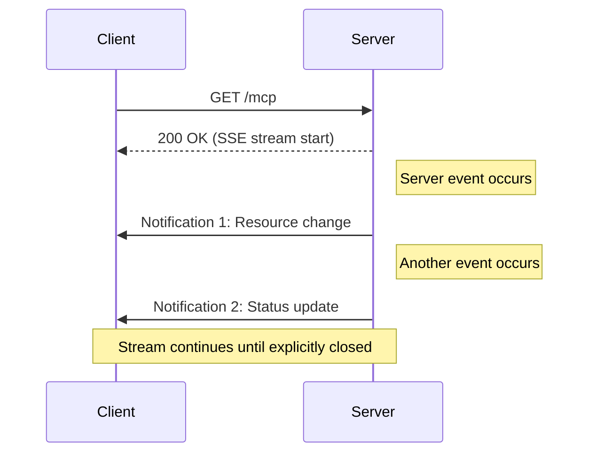
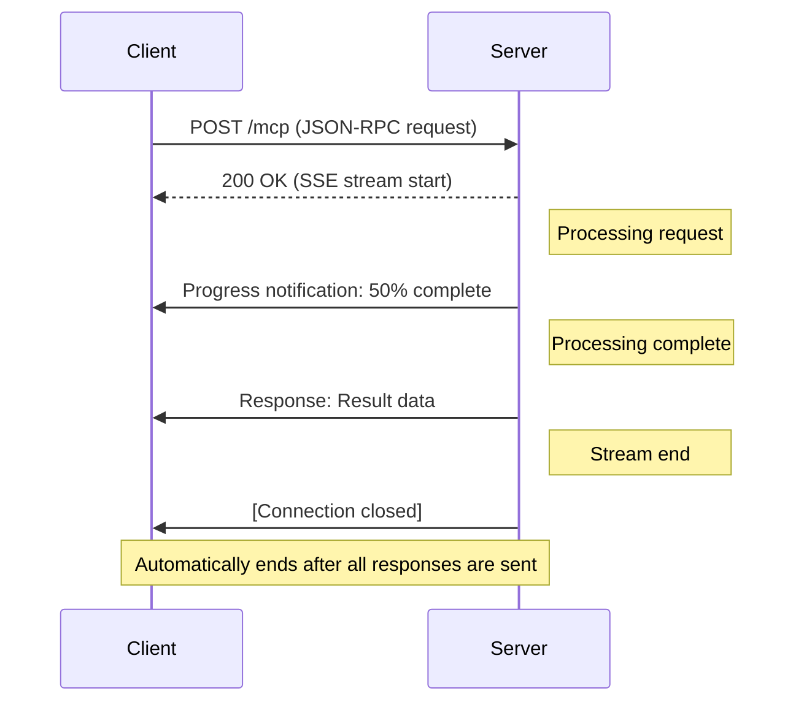

___Understanding MCP Implementation:___ _Explanation of developer-oriented knowledge necessary to implement MCP vulnerabilities and countermeasures_

---

This chapter's explanation is based on the [specification](https://modelcontextprotocol.io/specification/2025-03-26) from 2025-03-26.

MCP Specification: **Base Protocol (We are here)**, Authorization, Client Features, Server Features, Security Best Practices

In this Chapter, we will explain the [Client implementation](https://github.com/modelcontextprotocol/typescript-sdk/blob/1.12.1/src/client/streamableHttp.ts) and [Server implementation](https://github.com/modelcontextprotocol/typescript-sdk/blob/1.12.1/src/server/streamableHttp.ts) of Streamable HTTP in typescript-sdk (tag: 1.12.1). As explained in Chapter 09, Streamable HTTP uses HTTP and SSE to enable bidirectional communication. **We will explain the security-related implementation of Streamable HTTP in the next Chapter.**

Even with typescript-sdk, there may be vulnerable implementations. Since the implementation is still in its early stages, it should not be fully trusted, and vulnerability checks should be performed.

## IDs and Streams

Streamable HTTP is more complex than STDIO, requiring implementation of HTTP GET/POST/(DELETE), headers, authorization, multiple Client connections to a single Server, connection disconnection and resumption, session management, security measures, and more. While readers can check the detailed parts as needed, in this Chapter, let's organize the specification from the perspective of ***IDs (Identifiers)*** and ***streams***. An ID, as the name suggests, is a number that uniquely identifies an object within some namespace or scope.

Familiar IDs include user IDs and UUIDs. A user ID assigns IDs to users within the scope of a specific service.

Another example is the [PCI Express](https://en.wikipedia.org/wiki/PCI_Express) Data Link Layer Packet (DLLP), which has a DLLP ID. This ID manages whether the delivery of Transaction Layer Packets (TLPs) in the upper layer was successful. For example, if a TLP (containing DLLP ID: 1) is corrupted at the destination, a Nack (DLLP ID: 1) notifies the sender that the packet was not successfully received. This allows tracking which TLPs up to which DLLP ID have been successfully received at the destination, enabling retransmission from the failed TLP. Thus, IDs can also manage a series of transactions with continuity. This is about confirming the uniqueness of objects with sequential order within the scope of a transaction. When IDs are defined in protocol data formats, it's good to consider what scope they are defining uniqueness for and why.

**1. Types of IDs**

Returning to the Streamable HTTP specification, there are **1/ Message ID:** As already explained, the ID included in JSON-RPC 2.0 requests and responses. This ID ensures the uniqueness of messages within the JSON-RPC 2.0 scope and is necessary for consistency. **2/ Session ID:** Next, there's the session ID. As the name suggests, this ID is used to manage stateful sessions. **3/ Event ID:** Finally, there's the event ID. This concept is similar to the DLLP ID mentioned above, used to resume from the next message after the already transmitted event ID if a stream is disconnected. When a Client includes a `last-event-id` in the header of a GET request, the Server can use this header to replay messages and resume the stream.

**Although not mentioned in the specification**, **4/ Stream ID:** In the typescript-sdk implementation, there's also a stream ID assigned to each stream.

| Characteristic | Message ID | Session ID | Event ID |
|------|------------|------------|-----------|
| **Existence condition** | Required for request messages (not needed for notifications) | Required in stateful mode, not needed in stateless mode | Required for resumable streams, not needed if resumption feature is not available |
| **Generated by** | Client | Server | Server |
| **Generation timing** | When sending a request | When processing initialization request | When sending SSE event |
| **Scope** | Within the Requester's session | All HTTP requests | Within a specific stream |
| **Termination condition** | When receiving a response / timeout | Explicit termination / Server-side termination | When the stream ends |
| **Identification scope** | Sender's message sequence | Client connection | Event sequence within a stream |
| **Purpose** | Matching requests and responses | Maintaining session state and authentication | Identifying stream resumption position |

> From a protocol perspective, message ID is handled by JSON-RPC 2.0, while session ID and event ID are handled by Transport.

**2. About Streams**

This is a very confusing point. There are two types of SSE streams. GET streams are independent channels for the Server to push information proactively, unrelated to specific requests from the Client. POST streams are channels for sending responses to specific requests from the Client and are clearly associated with request IDs.

| Feature | GET Stream | POST Stream |
|------|-------------|--------------|
| **Establishment trigger** | Client GET request | Client POST request |
| **Messages that can be sent** | Notifications and requests only | Notifications, requests, responses |
| **Termination condition** | Server decision or Client disconnection | Automatically ends after all responses are sent |
| **Relation to requests** | None (independent channel) | Associated with specific request IDs |
| **Number in a session** | Only 1 per session | Multiple possible (new stream for each request) |
| **Usage** | Server-initiated communication | Request-response type communication |

> GET Stream



> POST Stream



**3. Stateful and Stateless**

Based on the information about IDs and streams so far, **here are examples of ID and stream relationships in stateful and stateless modes.**

```bash:ID management example in stateful mode
Session ID: "1868a90c-5f3d-4b9a-b3a2-c8e0c92e1c0a"
├── GET Stream (Standalone SSE stream)
│   ├── Event ID: "ev-001"
│   │   └── JSON-RPC ID: None (Server notifications only)
│   ├── Event ID: "ev-002"
│   │   └── JSON-RPC ID: None (Server notifications only)
│   └── ...
└── POST Stream
    ├── Event ID: "ev-101"
    │   └── JSON-RPC ID: 1 (Client A request)
    ├── Event ID: "ev-102"
    │   └── JSON-RPC ID: 1 (Server response)
    ├── Event ID: "ev-103"
    │   └── JSON-RPC ID: 2 (Client A request - same Client uses new ID)
    ├── Event ID: "ev-104"
    │   └── JSON-RPC ID: 2 (Server response)
    ├── Event ID: "ev-105"
    │   └── JSON-RPC ID: 1 (Client B request - different Client can use same ID)
    ├── Event ID: "ev-106"
    │   └── JSON-RPC ID: 1 (Server response)
    └── ...
```

```bash:ID management example in stateless mode
GET Stream (Standalone SSE stream)
│   ├── Event ID: "ev-001"
│   │   └── JSON-RPC ID: None (Server notifications only)
│   └── Event ID: "ev-002"
│       └── JSON-RPC ID: None (Server notifications only)
└── ...

POST Stream 1 (Client A)
├── Event ID: "ev-101"
│   └── JSON-RPC ID: 1 (Client A request)
├── Event ID: "ev-102"
│   └── JSON-RPC ID: 1 (Server response)
├── Event ID: "ev-103"
│   └── JSON-RPC ID: 2 (Client A request - same Client uses new ID)
├── Event ID: "ev-104"
│   └── JSON-RPC ID: 2 (Server response)
└── ...

POST Stream 2 (Client B)
├── Event ID: "ev-101"
│   └── JSON-RPC ID: 1 (Client B request - different Client can use same ID)
├── Event ID: "ev-102"
│   └── JSON-RPC ID: 1 (Server response)
└── ...
```

While the specification explains conventions for HTTP request/response headers and status codes by function, reframing these detailed conventions from the perspective of `IDs` and `streams` should make the intended functions and their scopes more visible.

## Client Implementation

**1. Main Classes**

The `StreamableHTTPClientTransport` class implements the `Transport` interface and manages communication with the MCP Server.

https://github.com/modelcontextprotocol/typescript-sdk/blob/1.12.1/src/client/streamableHttp.ts#L119

https://github.com/modelcontextprotocol/typescript-sdk/blob/1.12.1/src/client/streamableHttp.ts#L343-L351

Concrete transport implementations such as `StdioClientTransport` and `StreamableHttpClientTransport` inherit this `Transport` interface. The `Transport` defines methods such as `start()`, `close()`, and `send(message: JSONRPCMessage)`. This abstraction hides the differences in how the transport layer implements connections.

**2. Message Sending from Client**

Message sending is handled by the `send()` method.

https://github.com/modelcontextprotocol/typescript-sdk/blob/1.12.1/src/client/streamableHttp.ts#L374

Let's look at message sending from Client to Server. **1/ Content type:** According to the specification, the Client must support both `text/event-stream` and `application/json` for the `Content-Type`. This means the Client needs to determine whether the Server is returning a simple single JSON response or an SSE event stream in response to the Client's Post request, and respond appropriately. **2/ SSE event stream:** If the Server returns `text/event-stream`, the Server maintains the connection, and the Client manages and parses events received from the Server through the `_handleSseStream` method. In either content type case, it extracts JSON-RPC 2.0 messages and notifies the client application of the messages. The code is omitted, but if there's a `resumptionToken`, it resumes the SSE stream.

https://github.com/modelcontextprotocol/typescript-sdk/blob/1.12.1/src/client/streamableHttp.ts#L384-L386

```typescript:Excerpt from the send() method
async send(message: JSONRPCMessage | JSONRPCMessage[], options?: { resumptionToken?: string, onresumptiontoken?: (token: string) => void }): Promise<void> {
    ...
    // Set headers
    headers.set("accept", "application/json, text/event-stream");  // Support both content types
    ...
    const response = await fetch( ... method: "POST", ... );

    // Process session ID
    const sessionId = response.headers.get("mcp-session-id");
    if (sessionId) {
      this._sessionId = sessionId;
    }

    // Process response
    if (response.status === 202) {
      // For 202 Accepted, the notification was accepted
      if (isInitializedNotification(message)) {
        this._startOrAuthSse({ resumptionToken: undefined }).catch(err => this.onerror?.(err));
      }
      return;
    }
    ...
    if (hasRequests) {
      const contentType = response.headers.get("content-type");
      
      if (contentType?.includes("text/event-stream")) {
        // Process SSE stream
        this._handleSseStream(response.body, { onresumptiontoken });
      } else if (contentType?.includes("application/json")) {
        // Process direct JSON response
        const data = await response.json();
        const responseMessages = Array.isArray(data)
          ? data.map(msg => JSONRPCMessageSchema.parse(msg))
          : [JSONRPCMessageSchema.parse(data)];

        for (const msg of responseMessages) {
          this.onmessage?.(msg);
        }
      }
    }
  ...
}
```

**2. Client Message Reception**

Details are omitted, but the `_startOrAuthSse()` method can issue a `GET` request from the Client. This can be used to open an SSE stream as mentioned above. The SSE stream can be closed unilaterally by either the Client or Server at any time. Since network disconnections can occur at any time, unexpected disconnections and terminations (cancellations) are explicitly distinguished.

## Server Implementation

**1. Main Classes**

The `StreamableHTTPServerTransport` class implements the `Transport` interface and processes requests from MCP Clients.

```typescript
export class StreamableHTTPServerTransport implements Transport {
  // Private properties
  private sessionIdGenerator: (() => string) | undefined;
  private _started: boolean = false;
  private _streamMapping: Map<string, ServerResponse> = new Map();
  private _requestToStreamMapping: Map<RequestId, string> = new Map();
  private _requestResponseMap: Map<RequestId, JSONRPCMessage> = new Map();
  private _initialized: boolean = false;
  private _enableJsonResponse: boolean = false;
  private _standaloneSseStreamId: string = '_GET_stream';
  private _eventStore?: EventStore;
  private _onsessioninitialized?: (sessionId: string) => void;

  // Public properties
  sessionId?: string | undefined;
  onclose?: () => void;
  onerror?: (error: Error) => void;
  onmessage?: (message: JSONRPCMessage, extra?: { authInfo?: AuthInfo }) => void;

  // Methods
  constructor(options: StreamableHTTPServerTransportOptions) { ... }
  async start(): Promise<void> { ... }
  async handleRequest(req: IncomingMessage & { auth?: AuthInfo }, res: ServerResponse, parsedBody?: unknown): Promise<void> { ... }
  async close(): Promise<void> { ... }
  async send(message: JSONRPCMessage, options?: { relatedRequestId?: RequestId }): Promise<void> { ... }
}
```

**2. Request Handler**

The Server dispatches GET/POST stream processing based on the HTTP request method from the Client.

```typescript
async handleRequest(req: IncomingMessage & { auth?: AuthInfo }, res: ServerResponse, parsedBody?: unknown): Promise<void> {
  if (req.method === "POST") {
    await this.handlePostRequest(req, res, parsedBody);
  } else if (req.method === "GET") {
    await this.handleGetRequest(req, res);
  } else if (req.method === "DELETE") {
    await this.handleDeleteRequest(req, res);
  } else {
    await this.handleUnsupportedRequest(res);
  }
}
```

GET streams are handled by `handleGetRequest`, which **1/ Validates Accept header:** Checks if the Client can accept SSE streams, **2/ Checks existing streams:** Checks for existing streams in `_streamMapping`, **3/ Establishes stream:** Registers the stream if none exists. The fixed ID for GET streams is managed by `_standaloneSseStreamId`. The upper limit for this GET stream ID is 1 per `StreamableHTTPServerTransport` instance, regardless of whether it's stateful or stateless.

```typescript
private async handleGetRequest(req: IncomingMessage, res: ServerResponse): Promise<void> {
  // 1. Validate Accept header
  const acceptHeader = req.headers.accept;
  if (!acceptHeader?.includes("text/event-stream")) {
    res.writeHead(406).end( ... );
    return;
  }

  // 2. Check for existing GET stream
  if (this._streamMapping.get(this._standaloneSseStreamId) !== undefined) {
    // If already exists, return 409 Conflict
    res.writeHead(409).end(JSON.stringify({
      jsonrpc: "2.0",
      error: {
        code: -32000,
        message: "Conflict: Only one SSE stream is allowed per session"
      },
      id: null
    }));
    return;
  }
  ...
  // 3. Register stream
  this._streamMapping.set(this._standaloneSseStreamId, res);
  ...
}
```

POST streams are handled by `handlePostRequest`, which **1/ Validates Accept header:** Checks if the Client can accept SSE streams and JSON, **2/ Parses request body**, **3/ Checks for requests:** If there are no requests, like notifications, returns `202` to acknowledge receipt, **4A/ If there are requests**, generates a stream ID (UUID) and starts either JSON response or SSE stream.

```typescript
private async handlePostRequest(req: IncomingMessage, res: ServerResponse, parsedBody?: unknown): Promise<void> {
  try {
    // 1. Validate Accept header
    const acceptHeader = req.headers.accept;
    if (!acceptHeader?.includes("application/json") || !acceptHeader.includes("text/event-stream")) { ... }

    // 2. Parse body
    let rawMessage = parsedBody;
    ...
    // 3. Check for requests
    const hasRequests = messages.some(isJSONRPCRequest);

    if (!hasRequests) {
      // 4A. For notifications or responses only
      res.writeHead(202).end();
      ...
    } else {
      // 4B. If there are requests
      const streamId = randomUUID();
      
      if (!this._enableJsonResponse) {
        // SSE stream mode
        const headers = {
          "Content-Type": "text/event-stream",
          "Cache-Control": "no-cache",
          Connection: "keep-alive",
        };
        
        res.writeHead(200, headers);
      }
      
      // 5. Associate stream with requests
      for (const message of messages) {
        if (isJSONRPCRequest(message)) {
          this._streamMapping.set(streamId, res);
          this._requestToStreamMapping.set(message.id, streamId);
        }
      }
      ...
    }
  ...
  }
}
```

**3. Message Sending from Server**

Like the Client, message sending from the Server is done through the `send()` method. It mainly **1/** Selects the SSE stream, **2/** Generates and stores event IDs, **3/** Determines when to end the SSE stream after response completion, and so on.

For responses to Client requests, it uses the message ID (JSON-RPC 2.0 ID) included in the request as per the JSON-RPC 2.0 specification. If there's no message ID, it's a GET stream, so it checks for the existence of a GET stream. If a GET stream ID already exists, it generates an event ID and sends it as an SSE event. The implementation details for POST streams are omitted, but it finds the stream corresponding to the message ID and sends it as an SSE event to that stream.

```typescript
async send(message: JSONRPCMessage, options?: { relatedRequestId?: RequestId }): Promise<void> {
  let requestId = options?.relatedRequestId;
  if (isJSONRPCResponse(message) || isJSONRPCError(message)) {
    // For responses, use the ID from the message itself
    requestId = message.id;
  }
  ...
  if (requestId === undefined) {
    // Generate and store event ID
    let eventId: string | undefined;
    if (this._eventStore) {
      eventId = await this._eventStore.storeEvent(this._standaloneSseStreamId, message);
    }

    // Send as SSE event
    this.writeSSEEvent(standaloneSse, message, eventId);
    return;
  }
```

## Summary

In this Chapter, we explained the detailed implementation of Streamable HTTP, mainly from the perspective of `IDs` and `streams`. The official MCP specification may be elegant as a specification with minimal descriptions, but it might be difficult to link it to implementation. By combining the specification, this book's explanation, and the implementation, you might get clearer understanding of unclear points by having an AI coding agent explain it. **Let's [Amazon Q Developer CLI !!!!](https://aws.amazon.com/jp/blogs/news/introducing-the-enhanced-command-line-interface-in-amazon-q-developer/)**

What I like is the `-no-interactive` feature of Amazon Q Developer CLI. Normally, running the CLI starts an interactive mode, but with this option, you can pipe to `q chat` and output the results to `stdout`. Many other features are being added at an incredible pace, so **why not try using Amazon Q Developer CLI as a companion for implementation research**?
