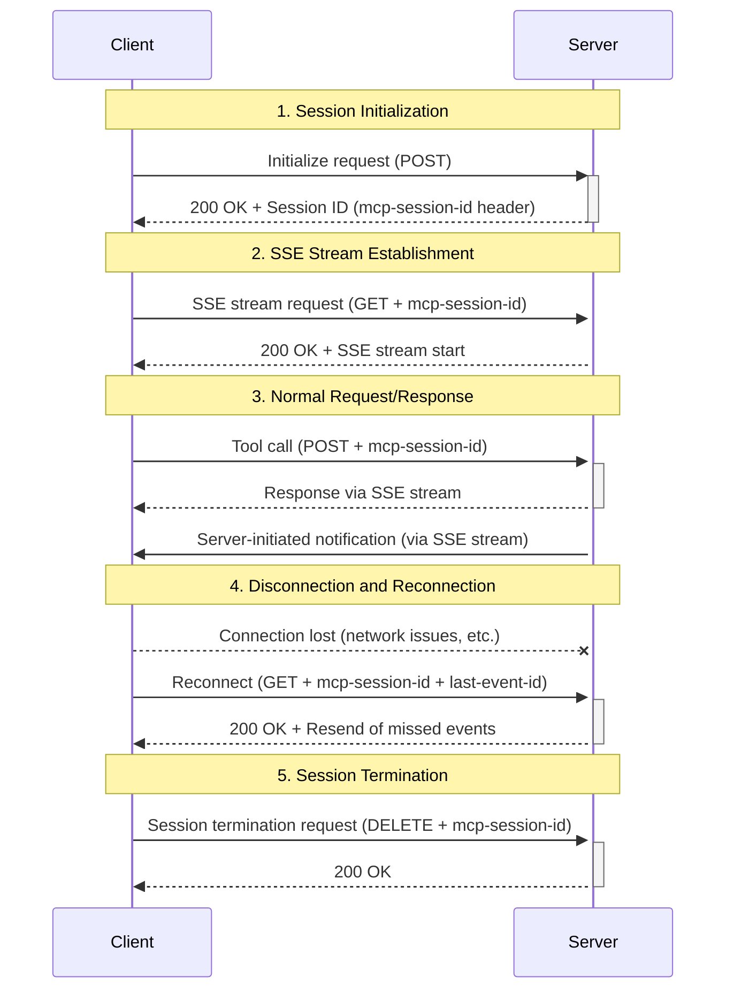

___Understanding MCP Implementation:___ _Explanation of developer-oriented knowledge necessary to implement MCP vulnerabilities and countermeasures_

---

This chapter's explanation is based on the [specification](https://modelcontextprotocol.io/specification/2025-03-26) from 2025-03-26.

MCP Specification: **Base Protocol (We are here)**, Authorization, Client Features, Server Features, Security Best Practices

In this Chapter, we will explain the [Client implementation](https://github.com/modelcontextprotocol/typescript-sdk/blob/1.12.1/src/client/streamableHttp.ts) and [Server implementation](https://github.com/modelcontextprotocol/typescript-sdk/blob/1.12.1/src/server/streamableHttp.ts) of Streamable HTTP in typescript-sdk (tag: 1.12.1). **In this Chapter, we will mainly explain the security-related implementation of Streamable HTTP, particularly session management.**

Streamable HTTP can connect multiple Clients to a Server, which presumably assumes a form where an MCP Server is provided to many users, similar to an API. Therefore, in this Chapter, we will mainly explain from the perspective of **security considerations that providers should take into account when providing an MCP Server**.

**We will introduce vulnerabilities while explaining the implementation**. We will present specific risks and recommended countermeasure examples, but these are only recommendations and examples, and **of course, these countermeasures are not foolproof**. Security requires **multi-layered defense** with the [Swiss cheese model](https://en.wikipedia.org/wiki/Swiss_cheese_model) in mind. Not all countermeasure implementations need to be incorporated into the application, and it's important to **utilize cloud managed services** to **clearly separate responsibilities at the application and infrastructure levels**. The attack surface should be kept as small as possible, and excessive complexity for security measures can actually increase security vulnerabilities. Organizations need to establish continuous security monitoring and operational systems with reference to existing [best practices](https://docs.aws.amazon.com/securityhub/latest/userguide/fsbp-standard.html).

## Session Management

Sessions are familiar to all of you, and I'm sure you're well aware of their dangers. For example, in a session hijacking attack, an attacker illegitimately obtains the session ID of a logged-in user through some method and takes over the session. In a normal website, when a user A logs in with an ID/password, the application returns a session ID to user A. During the period this session ID is valid, it can be used to access the application. This means that if an attacker can obtain the session ID through some method, they can illegitimately use the application. **However, MCP sessions are defined based on the MCP specification and differ from sessions in the general HTTP world.** They don't use cookies but instead implement session management through sending and receiving a custom HTTP header called `mcp-session-id`. This ID is stored in a private variable within the `StreamableHTTPClientTransport` instance and sets the session ID in the `mcp-session-id` header for subsequent requests. This session ID is not the authentication information itself.

```typescript:Session ID storage
export class StreamableHTTPClientTransport implements Transport {
  private _sessionId?: string;  // Session ID is stored here

  private async _commonHeaders(): Promise<Headers> {
    const headers = new Headers();
    ...
    // Add session ID to header if available
    if (this._sessionId) {
      headers.set("mcp-session-id", this._sessionId);
    }
```

The risks of session ID misuse are similar to those of general session IDs. If an attacker obtains a session ID, they can impersonate a legitimate user and call MCP tools with that user's permissions. This allows the attacker to launch a malicious client instance, use the stolen session ID, and access tools and data that should only be accessible to that person.

**1. Session Sequence**

Readers who have read the implementation explanations so far should have no particular questions about the session sequence itself.



**1. Session ID Generation and Usage in Normal Requests/Responses**

| Specific Risk | Recommended Countermeasures |
|:------------|:--------|
| Misuse of session ID obtained before authentication | **Session ID regeneration after authentication:** 1/ Issue a new session ID after successful authentication, 2/ Invalidate the old session |
| Unauthorized access due to predictable session IDs | **High-entropy session ID generation:** Use UUID v4 via `crypto.randomUUID()` |
| Theft of plaintext session IDs through network interception | **Communication encryption:** Enforce the use of TLS (HTTPS) |
| Hijacking of long-lived sessions | **Session expiration settings:** 1/ Absolute timeout, 2/ Inactivity timeout, 3/ Enhanced session state validation |

**1/ Session fixation:** Let's consider session fixation attacks. This attack involves making a user use a session ID prepared by the attacker in advance, then hijacking the session after authentication. In MCP, there is no mechanism for the Client to provide a session ID, and since **the Server issues the session ID**, this is not a problem in this regard. **2/ Session ID leakage/prediction:** A new session ID is generated by the `sessionIdGenerator` method during the initialization request, but the random number generator used in this method is left to the SDK user. If sequential IDs are mistakenly issued, the session ID could be predicted, making session hijacking easy. Also, session expiration is not mentioned in the MCP specification and is not considered in the implementation. And you can see that the `mcp-session-id` is sent in plaintext in the HTTP header, which could lead to session ID leakage through network interception. There are also risks like man-in-the-middle attacks, so be sure to enforce the use of TLSv1.2 or higher protocols with strong cipher suites on all HTTP communication paths.

From these considerations, many aspects of proper session ID implementation are left to the SDK user, so **when providing an MCP Server, please conduct thorough security checks without overconfidence that using the SDK ensures safety.**

> Implementation related to session initialization

```typescript
// Client implementation ------------------------------------------------
// Inside the send method of StreamableHTTPClientTransport class
const response = await fetch(this._url, {
  method: "POST",
  headers,
  body: JSON.stringify(message),
  signal: this._abortController?.signal,
});

// Session ID reception processing
const sessionId = response.headers.get("mcp-session-id");
if (sessionId) {
  this._sessionId = sessionId;
}

// Server implementation ------------------------------------------------
// Inside the handlePostRequest method of StreamableHTTPServerTransport class
// Initialization request processing
if (isInitializationRequest) {
  // Session ID generation
  this.sessionId = this.sessionIdGenerator?.();
  this._initialized = true;

  // Session ID notification
  if (this.sessionId !== undefined) {
    headers["mcp-session-id"] = this.sessionId;
  }
}
```

**2. Session ID Storage**

| Specific Risk | Recommended Countermeasures |
|:-------------|:---------|
| Memory dump attacks | **Hashing:** 1/ Store session IDs as salted hash values, 2/ Utilize session stores like Redis |
| Leakage through debug tools or logs | **Sensitive information filtering:** Implement mechanisms to filter sensitive information |
| Direct access from within the same process | **Declare session ID as a private variable of the class:** Prohibit direct access from outside the class |
| Accumulation of inactive sessions | **Periodic cleanup processing:** Prevent memory leaks by automatically deleting expired or inactive sessions |

Both Client and Server store session IDs as plaintext in class instances. This creates the possibility of memory dump attacks on the server process. Session IDs might also be visible through logs or debugging tools, so **storing in plaintext should be avoided**. Countermeasures should include using hash values internally and limiting the use of the original ID to reference purposes only. Basically, values exchanged through communication should not be handled in plaintext, and when storing, they should be encrypted or hashed. It's important to **eliminate direct access paths to IDs** by using these values only internally on the server. For example, stream IDs used in the implementation are handled only within the Server and have no direct relation to session IDs, so even if a session ID is stolen, it's probably not possible to obtain information from past streams. This is a good implementation that eliminates access paths to stream IDs.

In Node.js, modules share memory space. When an instance of the `StreamableHTTPServerTransport` class is created, other modules can directly access its public property `sessionId`. In the Node.js module system, modules loaded using [`require()`](https://nodejs.org/api/modules.html#requirecache) or `import` can obtain references to exported objects. Additionally, techniques like monkey patching or prototype extension can be used to modify values or change the behavior of existing objects. Given these considerations, when providing an MCP Server, it would be safer to **change the implementation to avoid managing session IDs as public properties**.

> _[Node.js caching:](https://nodejs.org/api/modules.html#caching)_ Modules are cached after the first time they are loaded. This means (among other things) that every call to require('foo') will get exactly the same object returned, if it would resolve to the same file.

```typescript
// src/server/streamableHttp.ts
export class StreamableHTTPServerTransport implements Transport {
  // Declared as a public property
  sessionId?: string | undefined;
  // ...
}
```

Finally, unless I've missed the implementation section, there doesn't seem to be explicit cleanup processing for session IDs. Since session IDs are public properties tied to the `StreamableHTTPServerTransport` class instance, they share the lifecycle with this instance and its cleanup.
> This itself seems problematic in the implementation as it can't hold multiple session IDs... Server scale-out doesn't seem feasible.

Since Node.js garbage collection occurs when references are gone, this instance will survive if references remain. This poses problems of **1/** memory leaks and **2/** security risks of session IDs persisting for long periods. As with general session management, it's important to consider ease of scale-out by using session stores like Redis. Regular ID re-validation and cleanup are also necessary.

**3. Session ID Validation**

| Specific Risk | Recommended Countermeasures |
|--------------|----------|
| Bypassing session validation | **Mandatory session validation:** Make session validation mandatory for all request paths, utilize authentication and authorization middleware |

> Oh, `if (!sessionId || sessionId !== this.sessionId)` is all there is to session ID validation.

The purpose of Server validation of session IDs should be to verify that a legitimate Client is using that session ID. Authentication and authorization serve as means to confirm "___legitimacy___", and this will be explained in detail in the Chapter on Authorization. While **authentication and authorization are Optional** in the specification, HTTP-based is marked as `SHOULD`, so **strongly recommend implementing proper authentication and authorization**. Even with authentication and authorization implemented, the current implementation would still need to implement verification of Client legitimacy using authentication information in session ID validation. The implementation allows an attacker to use a stolen session ID after successfully authenticating. Authentication and authorization don't necessarily need to be implemented in the MCP Server; an approach could be to insert an authentication and authorization gateway before the MCP Server.

**4. Session Count Limits**

| Specific Risk | Recommended Countermeasures |
|--------------|----------|
| Mass session creation | **Multi-layer quota system:** 1/ Set explicit limits on the number of sessions, 2/ Apply session creation rate limits per IP address, 3/ Detect abnormal session creation patterns |
| Abuse of persistent SSE connections | **Connection lifecycle management:** 1/ Set SSE connection timeouts per session, 2/ Implement automatic disconnection of inactive connections, 3/ Limit the maximum number of simultaneous connections server-wide |
| Unlimited increase in memory usage | **Adaptive memory management:** 1/ Set limits on the size of various mapping tables, 2/ Periodically check memory usage and clean up old entries when thresholds are exceeded |
| Mass generation of request IDs | **Request lifecycle control:** 1/ Set limits on the number of requests held per session, 2/ Automatically timeout requests with no response for extended periods |
| Log file bloat | **Log rotation:** 1/ Implement log rotation |
| DDoS attacks | **Limitations and detection:** 1/ Restrict access from global sources, 2/ Implement IP-based rate limiting, 3/ Detect abnormal traffic patterns |

In the current implementation, there doesn't seem to be a mechanism to automatically invalidate session IDs, so session IDs may persist for long periods. There's no specification for session count limits, so there's a possibility of DoS attacks through malicious Client attacks. **1/ Session initialization flooding attack:** An attacker can create numerous Server instances and send initialization requests to each instance, establishing a new session for each instance. **2/ Persistent SSE stream connection attack:** Establish SSE stream connections for each session created in _Step 1_, consuming server resources by maintaining connections for extended periods. **3/ Resource exhaustion attack:** The attacker sends numerous requests on each SSE stream, causing the Mapping table to bloat by not completing requests.

While resource exhaustion attacks should certainly be addressed at the application level, **it's extremely important to include responses at the infrastructure level, such as container usage and WAF application**. Of course, **monitoring** resources with [Amazon CloudWatch](https://aws.amazon.com/jp/cloudwatch/) **is essential**. When scaling based on resources, consideration of state information with scaling in mind, such as delegating session management to Redis, would be necessary.

```typescript:Vulnerable implementation parts
// Server implementation ------------------------------------------------

// Session initialization flooding
if (isInitializationRequest) {
  if (this._initialized && this.sessionId !== undefined) {
    res.writeHead(400).end(JSON.stringify({
      jsonrpc: "2.0",
      error: {
        code: -32600,
        message: "Invalid Request: Server already initialized"
      },
      id: null
    }));
    return;
  }
  this.sessionId = this.sessionIdGenerator?.();
  this._initialized = true;
}

// Resource exhaustion attack
// Store the response for this request to send messages back through this connection
// We need to track by request ID to maintain the connection
for (const message of messages) {
  if (isJSONRPCRequest(message)) {
    this._streamMapping.set(streamId, res);
    this._requestToStreamMapping.set(message.id, streamId);
  }
}
```

## Summary

In this Chapter, we explained the detailed implementation of Streamable HTTP, mainly from the perspective of `sessions`. Looking at the implementation reveals various vulnerabilities. Since MCP is still an emerging technology, the issues mentioned above will likely be addressed in frameworks for building MCP Servers.

**From the perspective of MCP Server providers**, methods of providing STDIO might include publishing your own packages on Github or allowing access to APIs through public packages. In this case, **using AWS's established existing authentication and authorization mechanisms as is, like [AWS MCP Servers](https://awslabs.github.io/mcp/)**, would be a good approach. For example, having an AWS MCP Server access AWS resources with limited permissions based on a `profile` set up with `aws configure sso` is basically equivalent in terms of security measures to using AWS CLI or SDK on a local PC. `OIDC + OAuth` authentication and authorization is not necessarily required, and `AWS IAM authentication + IAM role authorization` like AWS uses is also a very secure method. On the other hand, **it might be challenging at this point to provide an HTTP-based MCP Server that addresses all the various vulnerabilities, authentication, authorization, etc. mentioned above**. From the perspective of an MCP Server provider, if the priority is to release an MCP Server quickly, STDIO is a viable option at this point, in the author's opinion. This might be why there don't seem to be many Streamable HTTP-compatible MCP Servers.

From the perspective of MCP users, I mentioned in previous Chapters that caution should be exercised when using STDIO. On the other hand, when the safety of authentication, authorization, and the commands or packages used has been confirmed, it would be good to use them under careful review. **It's dangerous to blindly believe that Streamable HTTP is safer.**

> In my personal opinion, when using AWS, not using [Amazon GuardDuty](https://aws.amazon.com/jp/guardduty/) and [AWS Config](https://aws.amazon.com/jp/guardduty/) to detect vulnerabilities and check compliance with established best practices means you're not even at the starting line for discussing security. Focusing only on application vulnerabilities without using these tools is like a Lv.1 slime challenging Dark Drea◯. In such a state, there's no point in reading this book, so first activate the tools, establish responses and operational systems in line with best practices, bring along operational companions, and come back to this book when you're a slime that has learned Madan◯ at Lv.38. **It's probably premature to introduce MCP into an organization if you can't practice AWS security best practices**.
