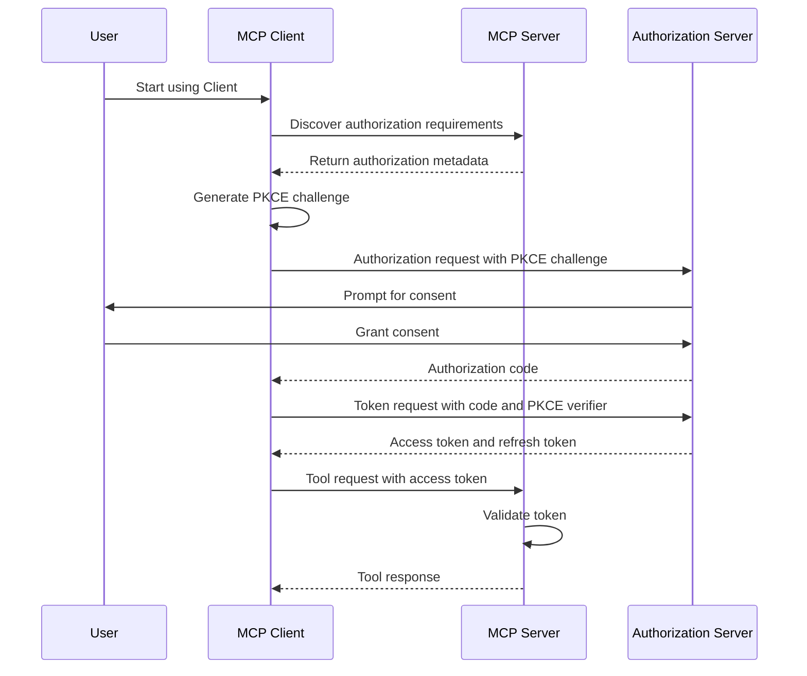

___Understanding MCP Authorization:___ _Explanation of developer-oriented knowledge necessary to understand MCP vulnerabilities and countermeasures_

---

This chapter's explanation is based on the [specification](https://modelcontextprotocol.io/specification/2025-03-26) from 2025-03-26.

MCP Specification: Base Protocol, **Authorization (We are here)**, Client Features, Server Features, Security Best Practices

In this Chapter, we will explain the [MCP Authorization](https://modelcontextprotocol.io/specification/2025-03-26/authorization) specification. The Authorization specification builds on the Base Protocol to provide more robust security features for MCP Servers and Clients.

## Why Authorization is Needed

The Base Protocol does not include any authentication or authorization mechanisms. This means that any Client can connect to any Server and use any tool provided by the Server. While this simplicity is useful for development and testing, it's not suitable for production environments where:

1. **Access Control:** Servers need to restrict access to their tools to authorized Clients only
2. **Resource Management:** Servers need to track and limit resource usage by different Clients
3. **Audit Trail:** Servers need to log which Clients used which tools for security and compliance purposes
4. **User Consent:** Users need to explicitly authorize Clients to access specific Servers on their behalf

The Authorization specification addresses these needs by defining a standard way for Clients to authenticate with Servers and for Servers to authorize Client requests.

## Authorization Flow

The MCP Authorization specification is based on the OAuth 2.0 framework, specifically the Authorization Code Grant flow with PKCE (Proof Key for Code Exchange). This flow is designed to securely authenticate users and authorize applications without exposing sensitive credentials.

Here's an overview of the authorization flow:



Let's break down the key components of this flow:

### 1. Authorization Metadata Discovery

Before a Client can request authorization, it needs to know the authorization endpoints and requirements of the Server. The Server provides this information through the `authorization_metadata` method:

```json
// Client request
{
  "jsonrpc": "2.0",
  "method": "authorization_metadata",
  "id": 1
}

// Server response
{
  "jsonrpc": "2.0",
  "result": {
    "authorization_endpoint": "https://auth.example.com/authorize",
    "token_endpoint": "https://auth.example.com/token",
    "revocation_endpoint": "https://auth.example.com/revoke",
    "registration_endpoint": "https://auth.example.com/register",
    "scopes_supported": ["tools:read", "tools:write"],
    "response_types_supported": ["code"],
    "grant_types_supported": ["authorization_code", "refresh_token"],
    "token_endpoint_auth_methods_supported": ["client_secret_basic", "none"],
    "code_challenge_methods_supported": ["S256"]
  },
  "id": 1
}
```

### 2. Client Registration

If the Server requires Client registration, the Client must register with the Server's authorization system before requesting authorization. The registration process provides the Client with a client ID and optionally a client secret:

```json
// Client registration request
{
  "client_name": "Example MCP Client",
  "redirect_uris": ["http://localhost:8000/callback"],
  "client_uri": "https://example.com",
  "logo_uri": "https://example.com/logo.png",
  "scope": "tools:read tools:write"
}

// Server registration response
{
  "client_id": "s6BhdRkqt3",
  "client_secret": "gX1fBat3bV",
  "client_id_issued_at": 1580000000,
  "client_secret_expires_at": 0,
  "redirect_uris": ["http://localhost:8000/callback"],
  "scope": "tools:read tools:write"
}
```

### 3. Authorization Request

The Client redirects the user to the authorization endpoint with the appropriate parameters:

```
https://auth.example.com/authorize?
  response_type=code&
  client_id=s6BhdRkqt3&
  redirect_uri=http://localhost:8000/callback&
  scope=tools:read+tools:write&
  state=af0ifjsldkj&
  code_challenge=E9Melhoa2OwvFrEMTJguCHaoeK1t8URWbuGJSstw-cM&
  code_challenge_method=S256
```

### 4. User Consent

The authorization server presents a consent screen to the user, asking them to approve the Client's access to the requested scopes. If the user approves, the authorization server redirects back to the Client's redirect URI with an authorization code:

```
http://localhost:8000/callback?
  code=SplxlOBeZQQYbYS6WxSbIA&
  state=af0ifjsldkj
```

### 5. Token Request

The Client exchanges the authorization code for an access token and refresh token:

```json
// Client token request
POST /token HTTP/1.1
Host: auth.example.com
Content-Type: application/x-www-form-urlencoded
Authorization: Basic czZCaGRSa3F0Mzpn...

grant_type=authorization_code&
code=SplxlOBeZQQYbYS6WxSbIA&
redirect_uri=http://localhost:8000/callback&
code_verifier=dBjftJeZ4CVP-mB92K27uhbUJU1p1r_wW1gFWFOEjXk

// Server token response
{
  "access_token": "2YotnFZFEjr1zCsicMWpAA",
  "token_type": "Bearer",
  "expires_in": 3600,
  "refresh_token": "tGzv3JOkF0XG5Qx2TlKWIA",
  "scope": "tools:read tools:write"
}
```

### 6. Authenticated Requests

The Client includes the access token in all requests to the MCP Server:

```json
// Client request with authorization
{
  "jsonrpc": "2.0",
  "method": "weather_forecast",
  "params": {
    "location": "Tokyo",
    "days": 5
  },
  "id": 2,
  "auth": {
    "type": "bearer",
    "token": "2YotnFZFEjr1zCsicMWpAA"
  }
}
```

### 7. Token Refresh

When the access token expires, the Client can use the refresh token to obtain a new access token without requiring user interaction:

```json
// Client refresh token request
POST /token HTTP/1.1
Host: auth.example.com
Content-Type: application/x-www-form-urlencoded
Authorization: Basic czZCaGRSa3F0Mzpn...

grant_type=refresh_token&
refresh_token=tGzv3JOkF0XG5Qx2TlKWIA

// Server refresh token response
{
  "access_token": "3YotnFZFEjr1zCsicMWpBB",
  "token_type": "Bearer",
  "expires_in": 3600,
  "refresh_token": "uGzv3JOkF0XG5Qx2TlKWIB",
  "scope": "tools:read tools:write"
}
```

## Implementation Considerations

### 1. Security Considerations

When implementing MCP Authorization, consider the following security best practices:

- **HTTPS:** Always use HTTPS for all communication between Client, Server, and authorization server
- **State Parameter:** Use the `state` parameter to prevent CSRF attacks
- **PKCE:** Always use PKCE to prevent authorization code interception attacks
- **Token Storage:** Store tokens securely and never expose them to the frontend or log them
- **Scope Validation:** Validate that the token has the required scopes before allowing access to tools
- **Token Expiration:** Respect token expiration times and implement proper token refresh logic

### 2. User Experience

Consider the following to provide a good user experience:

- **Minimize Consent Prompts:** Only request the minimum scopes needed and remember user consent when possible
- **Clear Consent Screen:** Clearly explain what the Client will be able to do with the granted permissions
- **Error Handling:** Provide clear error messages when authorization fails
- **Token Refresh:** Implement automatic token refresh to avoid interrupting the user experience

### 3. Implementation Complexity

The Authorization specification adds significant complexity to both Client and Server implementations. Consider whether this complexity is necessary for your use case:

- **Development Environments:** For development and testing, the Base Protocol without authorization might be sufficient
- **Internal Tools:** For internal tools used within a trusted network, simpler authorization mechanisms might be appropriate
- **Public Servers:** For public Servers that provide sensitive data or functionality, full OAuth 2.0 implementation is recommended

## Vulnerabilities and Countermeasures

### 1. Token Leakage

**Vulnerability:** Access tokens might be leaked through logs, browser history, or network interception.

**Countermeasure:** Use HTTPS for all communication, avoid including tokens in URLs, and implement proper token storage.

### 2. Insufficient Scope Validation

**Vulnerability:** Servers might not properly validate token scopes, allowing Clients to access unauthorized tools.

**Countermeasure:** Implement thorough scope validation for each tool and follow the principle of least privilege.

### 3. Cross-Site Request Forgery (CSRF)

**Vulnerability:** Authorization requests might be vulnerable to CSRF attacks if the `state` parameter is not used properly.

**Countermeasure:** Always use the `state` parameter with a secure random value and validate it when processing the authorization response.

### 4. Authorization Code Interception

**Vulnerability:** Authorization codes might be intercepted if PKCE is not used.

**Countermeasure:** Always use PKCE with the S256 method to prevent authorization code interception attacks.

### 5. Refresh Token Compromise

**Vulnerability:** Refresh tokens are long-lived and might be compromised.

**Countermeasure:** Implement refresh token rotation, where each use of a refresh token invalidates it and issues a new one.

## Summary

In this Chapter, we explained the MCP Authorization specification, which builds on the Base Protocol to provide more robust security features. We covered the authorization flow, implementation considerations, and potential vulnerabilities and countermeasures.

The Authorization specification adds significant security benefits but also increases implementation complexity. When implementing MCP, carefully consider whether the additional security features are necessary for your use case.

In the next Chapter, we will explain the MCP Client Features specification, which defines additional features that Clients can implement to enhance the user experience.
