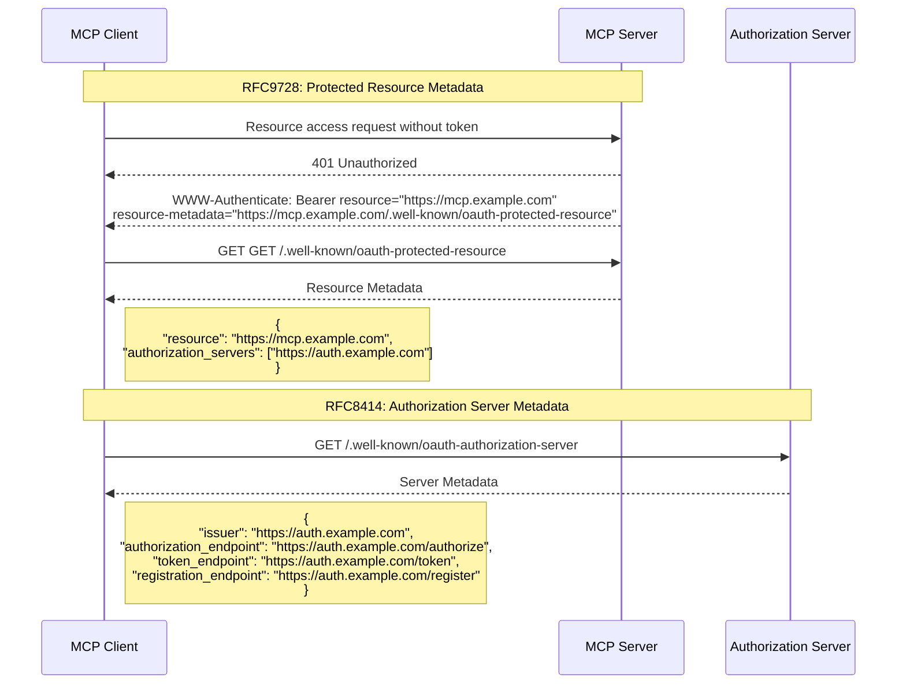
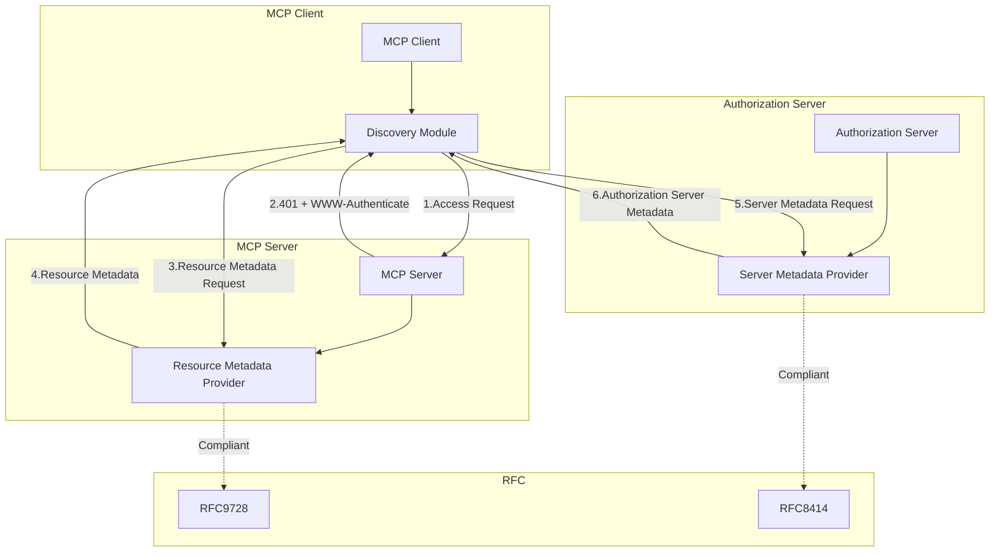
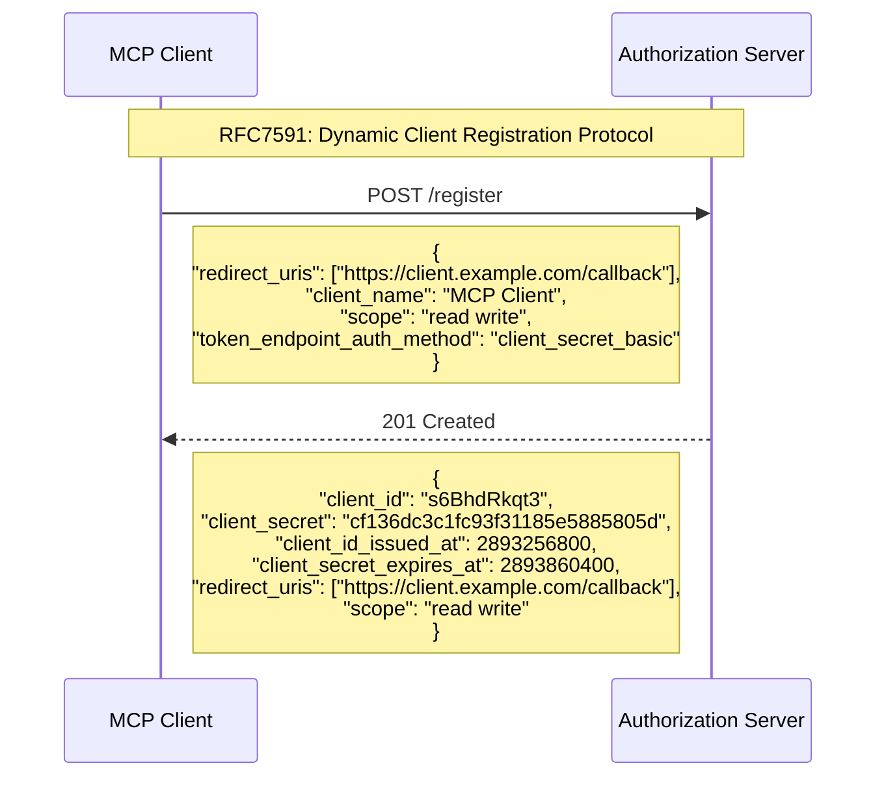
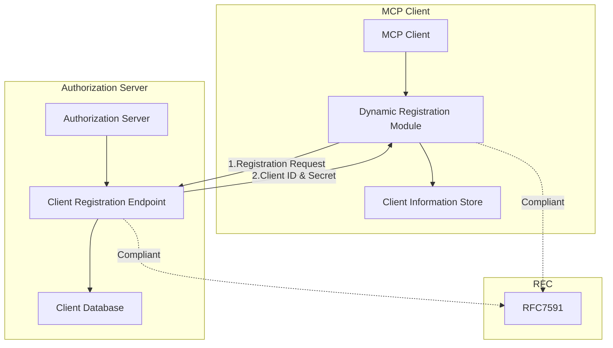
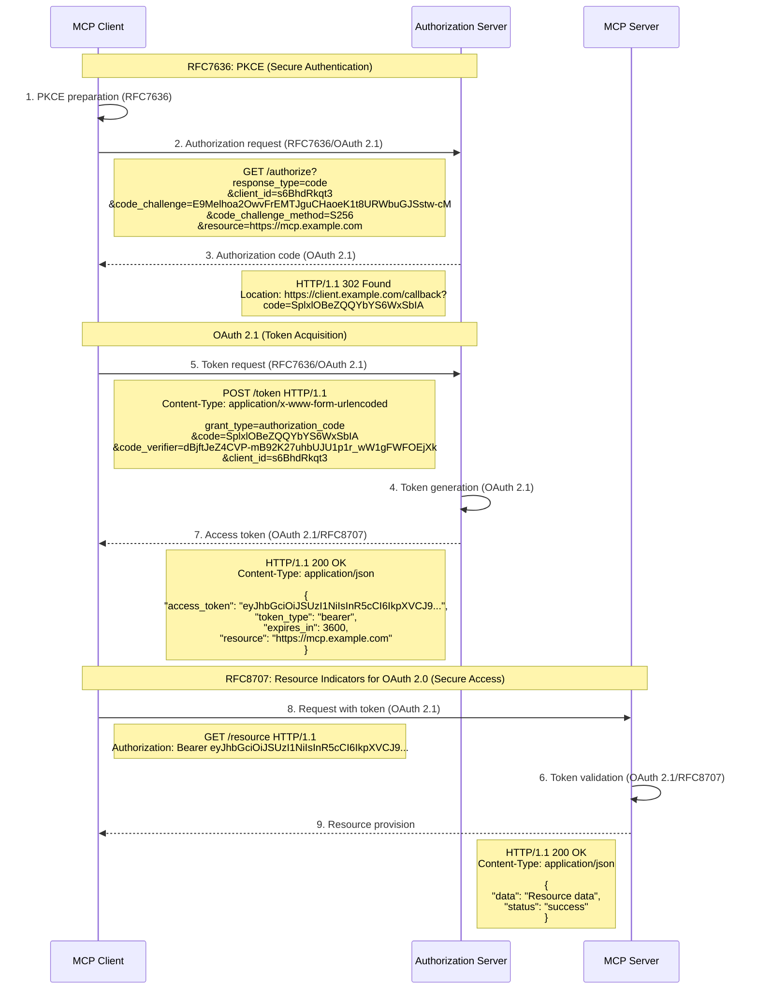
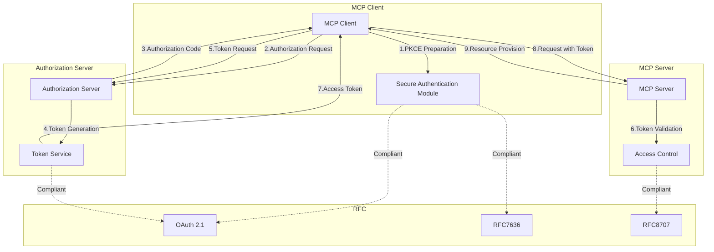

___Advanced Understanding of MCP:___ _Explanation of developer-oriented knowledge necessary to understand MCP vulnerabilities and countermeasures_

---

This chapter's explanation is based on the [specification](https://modelcontextprotocol.io/specification/2025-06-18) from 2025-06-18.

MCP Specification: Base Protocol, **Authorization (We are here)**, Client Features, Server Features, Security Best Practices

**In this Chapter, we will organize the MCP Authorization specification before explaining its implementation.** Please always refer to the MCP specification as the source of truth, as the information in this Chapter may become outdated.

## Overview of MCP Authentication and Authorization

Let's organize MCP authentication and authorization. Consider a case where a service provider who already provides APIs wants to provide an MCP Server with their APIs registered as tools. From the MCP Server user's perspective, they only need to consider providing authentication information to the MCP Server, but from the MCP Server provider's perspective, they need to consider authentication and authorization between the MCP Server and their APIs.

If existing APIs are provided with ID/password or access key authentication, the MCP Server would likely want to continue using the same authentication mechanism. And they would want to restrict the available functions of existing APIs through authorization linked to authentication information. What's important in this case is that authentication and authorization actually have a multi-layered structure. There's MCP Client and MCP Server, and backend API, and **authentication and authorization are needed for both `Client ↔︎ Server` and `Server ↔︎ API` relationships**. The MCP [specification](https://modelcontextprotocol.io/specification/2025-06-18) only defines **authorization** for `Client ↔︎ Server`. In other words, **authentication for `Client ↔︎ Server` and `Server ↔︎ API` is outside the scope of the specification**.

In the MCP specification, authorization is optional, and implementations using HTTP-based transport like Streamable HTTP `SHOULD` comply with the authorization specification. For STDIO, it states that authentication information should be obtained from the environment. The purpose of this Chapter is not to enumerate specifications but to focus on why those specifications exist. We'll reorganize multi-layered authentication and authorization after explaining the sdk implementation in the specific architecture design stage.

MCP follows the established OAuth standard rather than creating an authorization mechanism from scratch. The purpose of MCP's authorization specification can be said to be ___enabling MCP Clients and MCP Servers to connect safely and automatically without prior configuration___.

If authentication and authorization between MCP Client and Server need to be pre-configured before each connection, it would diminish MCP's essential value of providing a **plug-and-play experience like USB-C**. Let's **break down the functionality needed to maintain this essential value into three parts**.

**Function 1/ Without prior configuration:** MCP Client discovers the authorization server and autonomously initiates the authorization process without prior configuration, **Function 2/ Automatically:** MCP Client automatically registers itself with the authorization server found in Function 1, **Function 3/ Safely:** MCP Client connects safely to the MCP Server using authentication information obtained in Function 2. These are three important functions.

Several RFC numbers will appear below, but they should be easier to understand by returning to the purpose of MCP's authorization specification.

- OAuth 2.1 IETF draft ([draft-ietf-oauth-v2-1-12](https://datatracker.ietf.org/doc/html/draft-ietf-oauth-v2-1-12)), _OAuth 2.1 is in draft stage_
- OAuth 2.0 Authorization Server Metadata ([RFC8414](https://datatracker.ietf.org/doc/html/rfc8414))
- OAuth 2.0 Dynamic Client Registration Protocol ([RFC7591](https://datatracker.ietf.org/doc/html/rfc7591))
- OAuth 2.0 Protected Resource Metadata ([RFC9728](https://datatracker.ietf.org/doc/html/rfc9728))

### Function 1: Without Prior Configuration

> MCP Client discovers the authorization server and autonomously initiates the authorization process without prior configuration

The RFCs that mainly address the requirements for this authorization server discovery process are RFC9728 and RFC8414.

**RFC9728**
- **Role**: Defines how MCP Server publishes its authentication and authorization requirements
- **Specific Method**: **1/** When MCP Client first accesses MCP Server, returns Resource Metadata along with 401 Unauthorized response. Resource Metadata includes information such as authorization server location and required scopes, **2/** MCP Client automatically initiates authentication and authorization process based on this information.

**RFC8414**
- **Role**: Defines how to discover authorization server capabilities and endpoints
- **Specific Method**: **1/** Obtain authorization server Metadata from the authorization server location obtained through RFC9728. This Metadata includes information such as authorization endpoint, token endpoint, registration endpoint, **2/** MCP Client proceeds with the authorization process using these endpoint information.

> Sequence Diagram

> Component Diagram

Summarizing this process, through RFC9728, MCP Client can automatically discover MCP Server's authentication requirements and associated authorization server, and through RFC8414, it can automatically discover specific endpoints and capabilities of the authorization server. MCP Client only needs to know the MCP Server URL to automatically obtain information necessary for authentication and authorization, eliminating the need for pre-configuring authorization server endpoint URLs.

Through this process, MCP Client is prepared to discover MCP Server and initiate the authorization process.

### Function 2. Automatically

> MCP Client automatically registers itself with the authorization server found in Function 1

The RFC that mainly addresses the requirements for this automatic registration process of MCP Client to the authorization server for each MCP Server is RFC7591.

**RFC7591**
- **Role**: Defines how clients automatically register with authorization servers
- **Specific Method**: **1/** MCP Client can automatically perform client registration with the authorization server of new MCP Servers. In the registration process, provide metadata describing Client ID, redirect URI, scope, etc., **2/** Authorization server registers MCP Client and returns Client ID and secret. This enables connection to new MCP Servers without prior configuration.

> Sequence Diagram

> Component Diagram

Summarizing this process, through RFC7591, MCP Client automatically registers itself with the authorization server for each MCP Server discovered in Function 1 and obtains authentication information for issuing access tokens for MCP Server access from the authorization server. This corresponds to **automatically connecting** in the USB-C analogy of plug-and-play experience.

Through this process, MCP Client is prepared with authentication information for accessing MCP Server.

### Function 3. Safely

> MCP Client connects safely to the MCP Server using authentication information obtained in Function 2

The RFCs that mainly address the requirements for secure connection to MCP Server are RFC7636, OAuth 2.1, and RFC8707.

**RFC7636**
- **Role**: **Protection from authorization code interception attacks** using challenge-response verification
- **Specific Method**: **1/** Create a unique random verification value (code_verifier) for each authentication process, **/2** Transform code_verifier into a safely transmittable form (code_challenge) using a hash function, **3/** Send authorization request including code_challenge and hash method to register the challenge with authorization server, **3/** Securely receive authorization code (OAuth 2.1) from authorization server, **4/** Send original code_verifier to authorization server during token exchange, authorization server compares hash value of received code_verifier with code_challenge to confirm legitimate Client

**OAuth 2.1**
- **Role**: Provides foundation for secure authorization framework
- **Specific Method**: **1/** Verify Client identity using Client ID and (if needed) client secret, **2/** Establish secure authorization process using authorization code flow (combined with PKCE), **3/** Issue access tokens with short validity periods to minimize risk when tokens are leaked, **4/** Apply principle of least privilege by granting only minimum necessary permissions to tokens, **5/** Issue and manage refresh tokens for long-term access, enabling secure access token renewal, **6/** Use HTTPS and send tokens in Authorization header to prevent token interception

**RFC8707**
- **Role**: Explicitly specify target resources for tokens
- **Specific Method**: **1/** Limit token usage by specifying MCP Server URI in resource parameter during authorization request, **2/** Enable access to multiple servers with one authorization by including multiple resource parameters to specify multiple MCP Server URIs if needed, **3/** Clarify token usage scope by embedding resource URI information in tokens by authorization server, **4/** Apply appropriate scopes related to specified resources to tokens, setting appropriate permissions per resource, **5/** Prevent token misuse by having MCP Server verify resource information in tokens matches its own URI

> Sequence Diagram

> Component Diagram

Summarizing this process, through the cooperation of RFC7636 (PKCE), OAuth 2.1, and RFC8707, MCP Client establishes secure access to MCP Server using authentication information obtained from the authorization server. First, PKCE's challenge-response method prevents authorization code interception attacks, and OAuth 2.1's token-based access control eliminates the management of plaintext authentication information. Furthermore, RFC8707 restricts obtained tokens to be usable only with specific MCP Servers. This corresponds to **safely connecting** in the USB-C analogy of plug-and-play experience.

Through this process, MCP Client can access new MCP Servers without prior configuration, eliminating security risks like plaintext API key storage, with safe and appropriate permissions.

The specification also defines methods for safe termination and token revocation.

## About Authorization Server

An important point in the MCP specification is that **the implementation details of the Authorization Server are explicitly outside the scope** of the specification. Within the scope of the MCP specification, by not limiting the implementation method for the authorization server and allowing the use of existing OAuth 2.1 compliant authorization servers, it likely aims to flexibly integrate with existing ecosystems. To repeat once again, what the MCP specification defines is only the **authorization** part between `Client ↔︎ Server`, and for authentication between `Client ↔︎ Server` and authentication/authorization between `Server ↔︎ API`, each implementer needs to design and implement following appropriate security practices.

Through this, MCP achieves a USB-C-like plug-and-play experience while meeting security requirements without specifying authentication and authorization implementation details.

## Summary

Below is an easy-to-understand summary of the comparison between implementing and not implementing each RFC, and dependencies on other RFCs, for reference. Understanding that the purpose of MCP's authorization specification is to enable ___MCP Clients and MCP Servers to connect safely and automatically without prior configuration___ should have become easier by breaking down the overall flow into three functions. I hope this Chapter has made the MCP official specification a bit easier to read.

| RFC | When Implemented | When Not Implemented | Dependencies on Other RFCs |
|-----|---------|---------|--------------|
| ___MUST:___ **RFC9728** (Protected Resource Metadata) | **1/** MCP Server automatically publishes authorization requirements, **2/** MCP Client automatically discovers authorization server location, **3/** Ensures interoperability with standardized metadata format | **1/** Manual configuration of authorization server location needed, **2/** Need to handle different discovery methods per MCP Server, **3/** Configuration file complexity | **1/** Works with RFC8414 to achieve complete discovery process |
| ___MUST:___ **RFC8414** (Authorization Server Metadata) | **1/** Automatically discover authorization server endpoints, **2/** Automatically detect authorization server capabilities, **3/** Absorb differences between different authorization servers | **1/** Manual configuration of authorization endpoint, token endpoint, etc., **2/** Need to know authorization server capabilities in advance, **3/** Configuration updates needed when authorization server changes | **1/** Receives authorization server location information from RFC9728, **2/** Provides registration endpoint information for RFC7591 |
| ___SHOULD:___ **RFC7591** (Dynamic Client Registration) | **1/** MCP Client automatically registers with authorization server, **2/** Dynamically obtain Client ID and secret, **3/** Handle new MCP Servers without configuration changes | **1/** Manual Client registration needed for each authorization server, **2/** Store Client ID and secret in configuration file, **3/** Administrator intervention needed when adding new MCP Server | **1/** Gets registration endpoint information from RFC8414, **2/** Provides Client ID used in OAuth 2.1 / 2.0 authentication flow |
| ___MUST:___ **OAuth 2.1** (OAuth 2.1 Authorization Framework) | **1/** Token-based secure access control, **2/** Risk reduction with short-lived access tokens, **3/** Consistent security model | **1/** Use plaintext authentication information like API keys, **2/** Leak risk from long-term use of authentication information, **3/** Lack of security model consistency | **1/** Makes RFC7636(PKCE) mandatory, **2/** Works with RFC8707 to issue resource-specific tokens, **3/** Uses Client ID obtained from RFC7591 |
| ___MUST:___ **RFC7636** (PKCE) | **1/** Protection from authorization code interception attacks, **2/** Secure authentication possible even with public clients, **3/** Verification using challenge-response method | **1/** Vulnerable to authorization code interception attacks, **2/** Increased security risks for public clients, **3/** Particularly dangerous for mobile apps and SPAs | **1/** Used in combination with OAuth 2.1/2.0 authorization code flow, **2/** Uses Client ID registered through RFC7591 |
| ___MUST:___ **RFC8707** (Resource Indicators) | **1/** Limit token usage to specific MCP Server, **2/** Countermeasure against confused deputy problem, **3/** Apply resource-specific scopes | **1/** Tokens usable with multiple resources, **2/** Risk of confused deputy attacks, **3/** Possibility of token misuse | **1/** Integrated with OAuth 2.1/2.0 token issuance process, **2/** Uses resource URI identified by RFC9728 |
