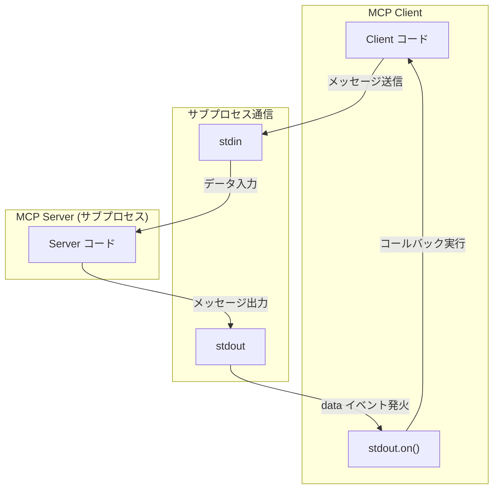

___MCP に関する発展理解編:___  _MCP の脆弱性と対策を理解するために必要な開発者向け知識の解説_

---

本章の説明は、2025-06-18 の[仕様](https://modelcontextprotocol.io/specification/2025-06-18)に基づきます。

MCP Specification: **Base Protocol（今ここ）**、Authorization、Client Features、Server Features、Security Best Practices

本 Chapter では Base Protocol の[トランスポート](https://modelcontextprotocol.io/specification/2025-06-18/basic/transports)について解説します。トランスポートについては Chapter04 で解説しましたが、今回はより詳細にトランスポートについて解説します。

JSON-RPC 2.0 はトランスポート非依存ですが、MCP の場合は [STDIO](https://modelcontextprotocol.io/specification/2025-06-18/basic/transports#stdio) と [Streamable HTTP](https://modelcontextprotocol.io/specification/2025-06-18/basic/transports#streamable-http) という Client ↔︎ Server 間通信のための二つのトランスポートメカニズムを仕様として定義しています。これらのトランスポートがメッセージの送受信でどのように接続を取り扱うべきであるかについて仕様で定義されています。

## STDIO

STDIO トランスポートの場合、Client が MCP Server をサブプロセスとして起動します。サブプロセスとはメインのプロセスから**独立して**コマンドやプログラムを提供するための仕組みです。例えば、Node であれば `child_process` モジュールを通じて実現することができます。Typescript を用いたサブプロセス生成コードを Chapter の最後に示しておきます。単に `echo -e hello\nmcp!` を別プロセスで実行するだけのサンプルです。

```bash:実行結果
$ ts-node sample.ts
コマンド実行結果:
hello
mcp!
```



ChildProcess クラスは [`EventEmitter`](https://nodejs.org/ja/learn/asynchronous-work/the-nodejs-event-emitter) を継承しています。そのためイベント駆動型をサポートしており、何らかのイベントが発生した際に、そのイベントに対応する関数を呼び出すような動きをします。`on(event, listner)` メソッドで、event に応じたイベントリスナー関数を登録することができます。ChildProcess オブジェクトは `child.stdout`, `child.stdin`, `child.stderr` の 3 つのストリームと関連づけられています。

MCP Server が標準出力に何かを書き込む度に、`stdout` ストリームオブジェクトで定義された `data` イベントが発行されます。Client は `data` イベントが発行されると起動するイベントリスナーによってデータを受け取って何らかの処理を行います。

https://github.com/littlemex/samples/blob/main/mcp-sec-book/chapter07/sample.ts#L13-L15

このような仕組みを用いて Client と Server が子プロセスを介してデータのやり取りを行う方式が STDIO です。実際には、出力から JSON RPC 2.0 のフォーマットのメッセージを解釈して取り扱うなどの実装も存在します。Server 側の実装は割愛しますが、Server からのメッセージ受信はイベント駆動型のアプローチで Client にメッセージとして渡されます。

**エラーハンドリング**

Server がメッセージ処理を継続できないエラーに遭遇した場合、**1/** 適切な JSON-RPC エラーメッセージを stdout に書き込む、**2/** 非ゼロのステータスコードで終了、を実施します。Client は Server プロセスを監視し、予期しない終了に対処する必要があります。

**セキュリティ**

**1/ プロセス分離** Server サブプロセスの適切な分離を確保して権限昇格を防止、**2/ リソース制限** タイムアウトやリソース制限を実装して、サービス拒否攻撃を防止、**3/ 入力検証** サブプロセスからのすべての入力を検証して、インジェクション攻撃を防止、**4/ エラー処理** 情報漏洩を防ぐために、サブプロセスのエラーを適切に処理、などが適切に実装されているか実装者は意識する必要があります。

## まとめ

本 Chapter では、MCP Base Protocol で定義されるトランスポートの一つである STDIO について解説しました。実装の概念部分が理解できているかいないかでセキュリティ対策に関する解像度が大きく変わってくると思いますのでしっかりとコードを理解しましょう。次 Chapter では typescript-sdk の STDIO 実装について解説します。

## サンプルコード

[こちら](https://github.com/littlemex/samples/tree/main/mcp-sec-book/chapter07)にサンプルコードを配置しました。

https://github.com/littlemex/samples/blob/main/mcp_security_book/chapter07/README.md