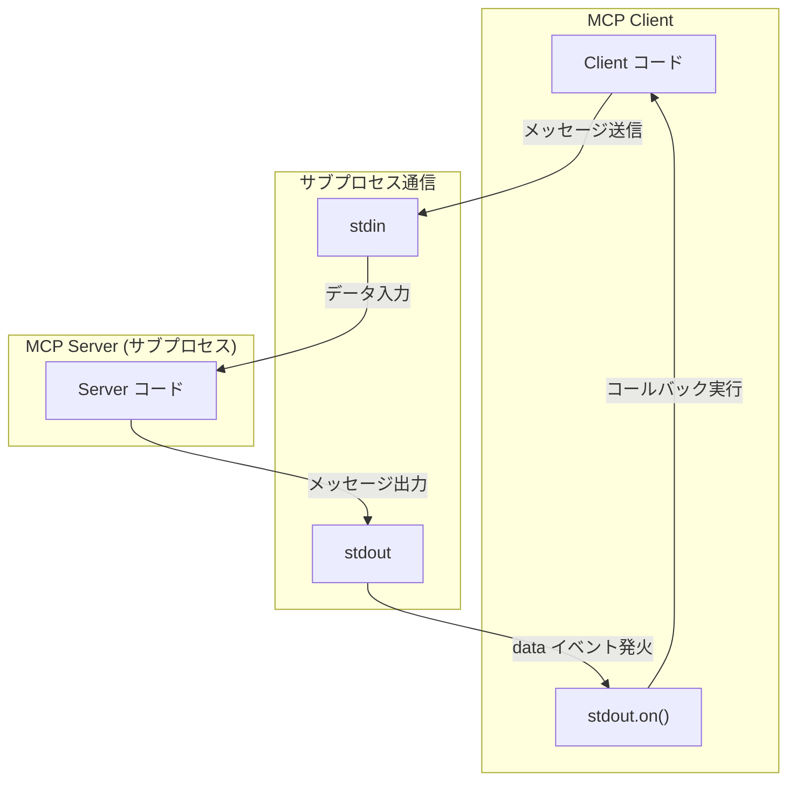

___MCP に関する発展理解編:___  _MCP の脆弱性と対策を理解するために必要な開発者向け知識の解説_

---

本章の説明は、2025-03-26 の[仕様](https://modelcontextprotocol.io/specification/2025-03-26)に基づきます。

MCP Specification: **Base Protocol（今ここ）**、Authorization、Client Features、Server Features

本 Chapter では Base Protocol の[トランスポート](https://modelcontextprotocol.io/specification/2025-03-26/basic/transports)について解説します。トランスポートについては Chapter04 で解説しましたが、今回はより詳細にトランスポートについて解説します。

JSON-RPC 2.0 はトランスポート非依存ですが、MCP の場合は [stdio](https://modelcontextprotocol.io/specification/2025-03-26/basic/transports#stdio) と [Streamable HTTP](https://modelcontextprotocol.io/specification/2025-03-26/basic/transports#streamable-http) という Client ↔︎ Server 間通信のための二つのトランスポートメカニズムを仕様として定義しています。これらのトランスポートがメッセージの送受信でどのように接続を取り扱うべきであるかについて仕様で定義されています。

## stdio

stdio トランスポートの場合、Client が MCP Server をサブプロセスとして起動します。サブプロセスとはメインのプロセスから**独立して**コマンドやプログラムを提供するための仕組みです。例えば、Node であれば `child_process` モジュールを通じて実現することができます。Typescript を用いたサブプロセス生成コードを Chapter の最後に示しておきます。単に `echo -e hello\nmcp!` を別プロセスで実行するだけのサンプルです。

```bash:実行結果
$ ts-node sample.ts
コマンド実行結果:
hello
mcp!
```



ChildProcess クラスは [`EventEmitter`](https://nodejs.org/ja/learn/asynchronous-work/the-nodejs-event-emitter) を継承しています。そのためイベント駆動型をサポートしており、何らかのイベントが発生した際に、そのイベントに対応する関数を呼び出すような動きをします。`on(event, listner)` メソッドで、event に応じたイベントリスナー関数を登録することができます。ChildProcess オブジェクトは `child.stdout`, `child.stdin`, `child.stderr` の 3 つのストリームと関連づけられています。

MCP Server が標準出力に何かを書き込む度に、`stdout` ストリームオブジェクトで定義された `data` イベントが発行されます。Client は `data` イベントが発行されると起動するイベントリスナーによってデータを受け取って何らかの処理を行います。

```typescript:on() Method によるイベントリスナーの登録例
// 標準出力からデータを受け取る
childProcess.stdout?.on('data', (data: Buffer) => {
   output += data.toString();
});
```

このような仕組みを用いて Client と Server が子プロセスを介してデータのやり取りを行う方式が stdio です。実際には、出力から JSON RPC 2.0 のフォーマットのメッセージを解釈して取り扱うなどの実装も存在します。

## まとめ

本 Chapter では、MCP Base Protocol で定義されるトランスポートの一つである stdio について解説しました。実装の概念部分が理解できているかいないかでセキュリティ対策に関する解像度が大きく変わってくると思いますのでしっかりとコードを理解しましょう。次 Chapter では typescript-sdk の stdio 実装について解説します。

## SaaS コラム

本書では **SaaS コラム** で本文内容を補足する SaaS に関する解説を行います。

今回は SaaS に関する解説はありません。

## サンプルコード

```bash:必要なライブラリのインストール
$ npm install typescript ts-node && npm install --save-dev @types/node
```

```typescript:sample.ts
import { spawn, ChildProcess } from 'child_process';

// 子プロセスを起動する関数
function runCommand(command: string, args: string[]): Promise<string> {
  return new Promise((resolve, reject) => {
    // 子プロセスを起動
    const childProcess: ChildProcess = spawn(command, args);

    let output = '';
    let errorOutput = '';

    // 標準出力からデータを受け取る
    childProcess.stdout?.on('data', (data: Buffer) => {
      output += data.toString();
    });

    // エラー出力からデータを受け取る
    childProcess.stderr?.on('data', (data: Buffer) => {
      errorOutput += data.toString();
    });

    // プロセスの終了を検知
    childProcess.on('close', (code: number) => {
      if (code === 0) {
        resolve(output);
      } else {
        reject(new Error(`コマンドが失敗しました: ${errorOutput}`));
      }
    });

    // エラーイベントを処理
    childProcess.on('error', (error: Error) => {
      reject(error);
    });
  });
}

// 関数を使用する例
async function main() {
  try {
    const result = await runCommand('echo', ['-e', 'hello\nmcp!']);
    console.log('コマンド実行結果:');
    console.log(result);
  } catch (error) {
    console.error('エラーが発生しました:', error);
  }
}

main();
```

```json:tsconfig.json
{
  "compilerOptions": {
    "target": "es2016",
    "module": "commonjs",
    "esModuleInterop": true,
    "forceConsistentCasingInFileNames": true,
    "strict": true,
    "strictNullChecks": true,
    "skipLibCheck": true
  }
}
```