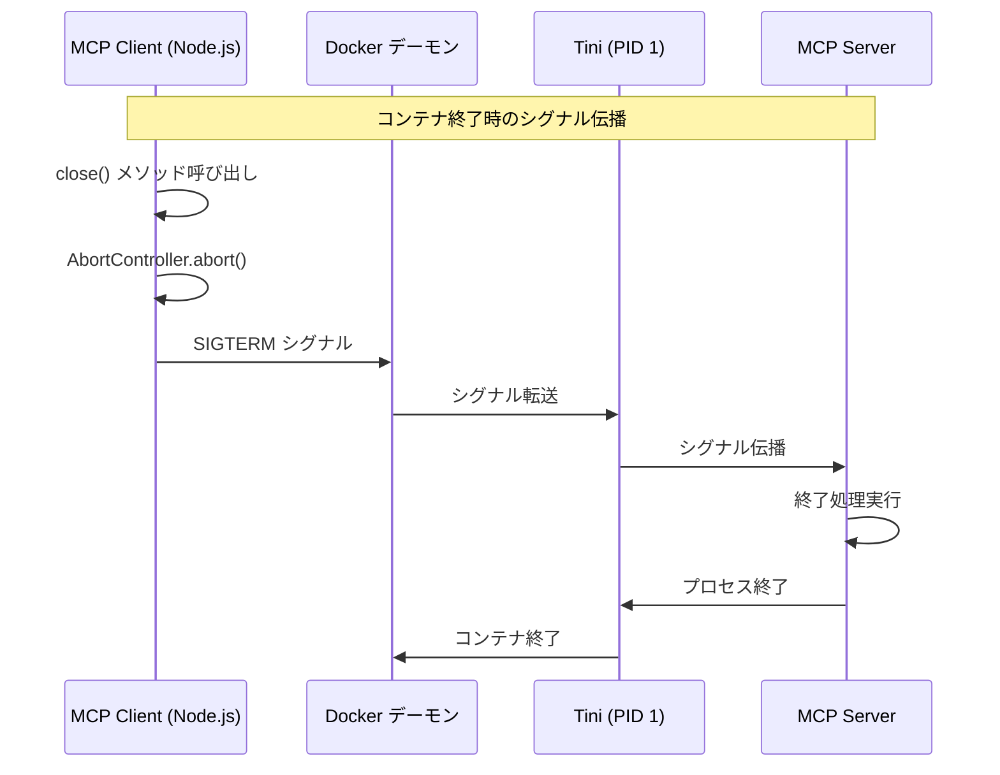
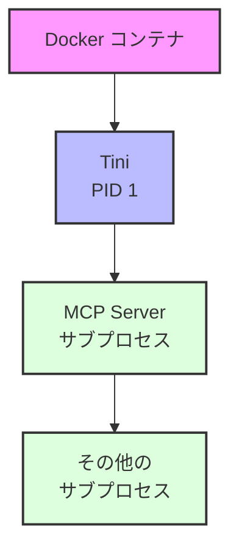

___MCP に関する実装理解編:___  _MCP の脆弱性と対策を実装するために必要な開発者向け知識の解説_

---

本章の説明は、2025-06-18 の[仕様](https://modelcontextprotocol.io/specification/2025-06-18)に基づきます。

MCP Specification: **Base Protocol（今ここ）**、Authorization、Client Features、Server Features、Security Best Practices

本 Chapter では STDIO の typescript-sdk(tag: 1.13.2) の [Client 実装](https://github.com/modelcontextprotocol/typescript-sdk/blob/1.13.2/src/client/stdio.ts) と [Server 実装](https://github.com/modelcontextprotocol/typescript-sdk/blob/1.13.2/src/server/stdio.ts) について解説します。Chapter07 で解説した通り実際にはサブプロセスを呼んでいるだけです。環境変数などを制御し、コマンドと引数を受け取ってサブプロセスを起動します。

## Client 実装

**1. 主要クラス**

`StdioClientTransport` クラスは、 `Transport` インターフェースを実装し、サブプロセスである MCP Server との通信を管理します。`StdioServerParameters` 型は、Server プロセスの起動方法を定義します。

https://github.com/modelcontextprotocol/typescript-sdk/blob/1.13.2/src/client/stdio.ts#L91

> Transport インタフェース

https://github.com/modelcontextprotocol/typescript-sdk/blob/main/src/shared/transport.ts#L29-L83

`StdioClientTransport`や `StreamableHttpClientTransport` などの具体的なトランスポート実装がこの `Transport` インターフェースを継承します。`start()`、`close()`、`send(message: JSONRPCMessage)` などを `Transport` ではメソッドとして定義しています。この抽象化によってトランスポート層の接続の実現方法の違いを隠蔽します。（FIXME: ここの説明が怪しいのでチェックしてほしい）

**2. 環境変数の継承**

この実装では `sudo` コマンドのデフォルトの環境変数継承リストなどのように必要最低限の環境変数のみをサブプロセスに引き継ぎます。そして、**コマンドインジェクションなどを防ぐために実行可能コードの場合は除外**しています。API キーなどの情報がサブプロセスに漏れないようにケアされています。ユーザー自身が定義した環境変数はサブプロセスにセットされます。

https://github.com/modelcontextprotocol/typescript-sdk/blob/1.13.2/src/client/stdio.ts#L66-L84

**3. サブプロセスの起動と通信**

すでに Chapter07 で説明した内容ですね。`start()` では環境変数やコマンドを受け取ってサブプロセスを起動し、イベントハンドラを設定しています。

https://github.com/modelcontextprotocol/typescript-sdk/blob/1.13.2/src/client/stdio.ts#L112-L170

サブプロセス起動時の引数である `shell` が `false` になっているのはセキュリティ上重要です。`true` の場合、シェルを起動してユーザーからのコマンドを文字列としてそのまま実行してしまうため、**コマンドインジェクションのリスク**があります。これによって権限昇格やバックドアのインストール、などが考えられます。

https://github.com/modelcontextprotocol/typescript-sdk/blob/1.13.2/src/client/stdio.ts#L125

[`option.stdio`](https://nodejs.org/api/child_process.html#optionsstdio) の設定は、サブプロセスの標準入出力（stdin, stdout, stderr）の扱い方を指定するものです。この場合、`stdin: pipe`、`stdout: pipe`、`stderr: this._se.. ?? inherit` です。`pipe` を指定すると、メインプロセスとサブプロセスの間に双方向パイプが作成されます。__stdin/stdout__ を `pipe` に設定することで、JSON-RPC 2.0 メッセージの送受信をプログラムで制御できます。__stderr__ をデフォルトで `inherit` に設定することで、Server のログやエラーメッセージが直接ターミナルに表示されます。

**4. メッセージ処理**

簡単に流れを説明すると、MCP Server が何らかのツールを使ってその結果を JSON-RPC 2.0 メッセージとして `stdout` に出力すると、それを契機に MCP Client ではイベントハンドラによってデータ取得・抽出を行い、JSON-RPC 2.0 の中身を解析して適切な処理を行います。

https://github.com/modelcontextprotocol/typescript-sdk/blob/1.13.2/src/client/stdio.ts#L157-L160

MCP Server が `stdout` に JSON-RPC 2.0 メッセージを書き込むと、前述した通り `child.stdout` ストリームで `data` イベントが発行され、`data` イベントハンドラがデータを `_readBuffer` に追加します。そして `processReadBuffer()` メソッドを呼び出します。

https://github.com/modelcontextprotocol/typescript-sdk/blob/1.13.2/src/client/stdio.ts#L187-L200

https://github.com/modelcontextprotocol/typescript-sdk/blob/main/src/shared/protocol.ts#L302-L315

`processReadBuffer()` メソッドが呼び出され、`ReadBuffer` クラスを使用して受信したバイトストリームから JSON-RPC 2.0 メッセージを抽出します。そして、Transport インターフェースの `onmessage` コールバックを呼び出します。Protocol クラスではこのメッセージを受け取り、メッセージタイプに応じて `_onresponse`、`_onrequest`、`_onnotification` などの適切なハンドラにディスパッチします。

**5. メッセージの送信**

https://github.com/modelcontextprotocol/typescript-sdk/blob/main/src/client/stdio.ts#L209-L223


`send()` メソッドは、JSON-RPC 2.0 メッセージを Server に送信します。`serializeMessage` を使用してメッセージをシリアライズし、サブプロセスの標準入力に書き込みます。バックプレッシャー処理のため、書き込みバッファが満杯の場合は `drain` イベントを待ちます。ちなみにバックプレッシャー処理とは、輻輳制御のことです。要は受信側がデータを受けきれなくなる状態になったら送信側は受信側を配慮してデータを送るのをちょっと待ちます。さまざまな実装方法がありますが、例えば、受信側のバッファが一杯になりそうになると、受信側から送信側に輻輳状態を通知して、送信側はこの通知を受けると送信データを溜めておくバッファに送信データを一定量溜めておきます。

## Server 実装

Server は Client と似たような実装であることに気づくでしょう。そのため違いにフォーカスして説明します。**1/ 入出力方向**: Client は Server の stdout からデータを読み取り、Server の stdin に書き込みます。一方、Server は自身のプロセスの stdin からデータを読み取り、自身の stdout に書き込みます。**2/ プロセス管理**: Client はサブプロセスの生成、監視、終了を担当し、spawn, close など複数のプロセスイベントを処理します。Server は自身のプロセスのみを扱います。**3/ 終了処理**: Client は `AbortController` を使用してサブプロセスを終了させてプロセス参照を削除します。Server はイベントリスナーを明示的に削除し、他のリスナーがないか確認してから stdin を一時停止します。

あとはこれらの違いを理解しながらコードを読めばすんなりと理解できるでしょう。

## STDIO 実装のセキュリティ脆弱性

typescript-sdk の STDIO 実装には潜在的な脆弱性がある、もしくはその脆弱性対応は SDK 利用者側に責務がある、と思われる箇所が多々あります。仕様上明記されていない制限を実装で勝手に追加するべきではないという思想かもしれません。

**1. プロセス生成とコマンド実行**

STDIO では**信頼できないコマンドや引数をユーザー自身が設定して実行すること自体のリスクは原理的に防げません**。例えば、MCP 設定でたびたび見かける [`uvx`](https://docs.astral.sh/uv/guides/tools/) は Python パッケージを直接利用するコマンドです。これを使うと悪意のあるライブラリが実行され、システム上で任意のコードが実行される可能性があります。

https://github.com/modelcontextprotocol/typescript-sdk/blob/main/src/client/stdio.ts#L121-L123

現状の `stdio.ts` 実装では、**1/** コマンドと引数のサニタイズが不十分、**2/** 実行可能なコマンドの種類に制限がない、などのリスクがあります。`StdioClientTransport` を呼び出す側に責務があるということでしょうが、SDK 側で対応されているだろうと油断せずに基本に立ち返ったレビューと対処が必要です。

**2. 入力検証とメッセージパース**

https://github.com/modelcontextprotocol/typescript-sdk/blob/64a60c4ecdccdd914ea093d4994b50e2ef4c1edb/src/shared/stdio.ts#L23-L25

現状の `stdio.ts` 実装では、メッセージサイズの制限がないため DoS 攻撃の可能性があります。メモリ使用量の制限もないためバッファオーバーフロー攻撃の可能性があります。SDK 利用者が適切にメッセージサイズやリソースに制限をかける、など利用の仕方に合わせてのアプリケーションレイヤでの対策を行いましょう。


## STDIO の安全な利用について考える

以下は筆者個人の主張であり MCP 利用者がリスクを考慮してどこまでどのような対策を取り入れるべきかを決めなければなりません。

**MUST で実施すること**

STDIO ベースの便利 MCP Server が数多く提供されてますがそれらを安易に利用してはなりません。最もシンプルで重要な対策としては、信頼できる企業が提供している MCP Server のみ利用することです。これらの企業の MCP Server についても盲目的に信頼すべきではありませんが企業として正式に提供するツールに致命的な脆弱性があれば企業の存続に関わる可能性もあるためより慎重なレビューを経ていると思われます。

提供元があまり信用できない企業や個人の場合は、利用するとしても完全にコードの挙動を理解しなければなりません。そしてこの場合は `uvx` のようにパッケージを直接利用することはやめておきましょう。最初は問題のないパッケージに見えていても後からバージョンアップで脆弱性を入れ込むような攻撃手法があります。

[AWS MCP Servers](https://awslabs.github.io/mcp/) は STDIO で `uvx` を利用していますが、AWS リソースへのアクセスを伴う MCP Server については AWS プロファイルを指定するなどの AWS の既存のセキュリティの仕組みをしっかりと利用しています。このようにアクセスキーを設定に直接含めない方法で認証・認可を適切に既存の仕組みで実施している MCP Server は安全性が高いです。

**SHOULD で実施すること**

インフラストラクチャレベルで分離された環境で MCP を利用するすべきです。これによって普段使っているノート PC の企業 Confidential な情報が誤って流出するようなリスクを防ぐことができます。できれば AWS の EC2 インスタンスのような環境で MCP Host を利用することができればベストでしょう。それが難しい場合はVS Code の [Dev Container](https://code.visualstudio.com/docs/devcontainers/containers) 上で MCP Host を利用することも良い選択肢でしょう。これによってリソース制限やアクセス制限などをある程度かけることができます。

アクセスキーを環境変数に設定して利用する形式の MCP Server はキー漏洩時のリスクが大きいため利用すべきではありません。そもそもアクセスキーを利用すべきではありませんが、利用するとしても最小権限の原則を守るべきです。

**RECOMMENDED で実施すること**

MCP Server をコンテナを経由して利用することを推奨します。Docker が公式に [MCP Hub](https://hub.docker.com/mcp/server/notion/overview) を提供しており、`BUILD BY DOCKER` のタグがついていれば Docker Inc. によってビルドされ、`SIGNED` タグがついていれば署名検証されているため改竄や意図しない更新などがないことが保証されます。そして、`Docker Scout Health Score` で脆弱性スキャンのスコアが実施されていると思われ、比較的安全性高く利用できるでしょう。ローカル PC でコンテナを利用する場合は上述したリソース制限をかけることも忘れないようにしましょう。

これらの MCP Server Image を AWS クラウドサービス上でサービングして Lambda MCP Server などを用いて安全に AWS MCP Server 経由でアクセスするような方法は組織利用の際に良い方法です。このような構成によってインフラ管理者が MCP Server Image やその実行基盤を一元的に管理・提供することができます。

その他にも WAF や監視、あらゆる既存のセキュリティベストプラクティスを追加することが推奨ですが、既存のセキュリティ対策と同様にどこまで取り組むのかはビジネスリスクやアジリティとのトレードオフでしょう。どこまで実施すれば良いかの最終的な意思決定は第三者ではなく組織の管理者や経営者に委ねられます。

## まとめ

本 Chapter STDIO の詳細実装、セキュリティ、について解説しました。組織利用については組織ごとに状況が異なるため完全なガイドを提供することはできませんが、考慮すべきポイントはお伝えできたのではないでしょうか。

## コラム：Docker コンテナでの MCP Server の安全な実行

Docker イメージの MCP Server 設定例を見てみましょう。この設定の中には Docker の重要なフラグがあります。

```bash
{
  "mcpServers": {
    "aws-documentation": {
      "command": "docker",
      "args": [
        "run",
        "-i",
        "--init",
        "--rm",
        "mcp/aws-documentation"
      ]
    }
  }
}

```

この設定で重要なのは `--rm`、そして `--init` の 2 つのフラグです。`--rm` はコンテナ終了時の自動クリーンアップを担当します。そして `--init` は、コンテナ内でプロセス管理を適切に行うための重要なフラグです。

特に `--init` フラグの動作を理解することは重要です。このフラグを指定すると、コンテナ内で [Tini](https://github.com/krallin/tini) が PID 1 として実行され、プロセス管理の要となります。Tini はシグナル処理とゾンビプロセスの回収という 2 つの重要な役割を果たします。

シグナル処理の仕組みを図で表現すると次のようになります。



また、コンテナ内のプロセス構造は以下のようになります。



PID 1 として実行されるプロセスには特別な責務があります。通常のプロセスであれば SIGTERM などのシグナルを受け取ると自動的に終了しますが、PID 1 のプロセスは明示的なシグナルハンドラを設定しない限りシグナルを無視します。これはシステムの安定性を保つための仕様ですが、コンテナ環境では問題となります。

また、Unix システムではサブプロセスが終了した際、その終了ステータスをメインプロセスが回収する必要があります。メインプロセスが先に終了した場合、そのサブプロセスは PID 1 に引き取られ、PID 1 が終了ステータスを回収しなければなりません。これを怠るとゾンビプロセスが発生します。

Tini はこれらの問題を解決します。シグナルを適切に処理してサブプロセスに伝播し、終了したプロセスのステータスを確実に回収します。`--init` フラグを使用しない場合、MCP Server 自体が PID 1 として実行されることになり、これらの処理を適切に行えない可能性があります。

このように、Docker コンテナで MCP Server を実行する際は、プロセス管理の観点から `--init` フラグの使用が強く推奨されます。これにより、コンテナのライフサイクル管理が適切に行われ、リソースリークやプロセスの残留を防ぐことができます。
