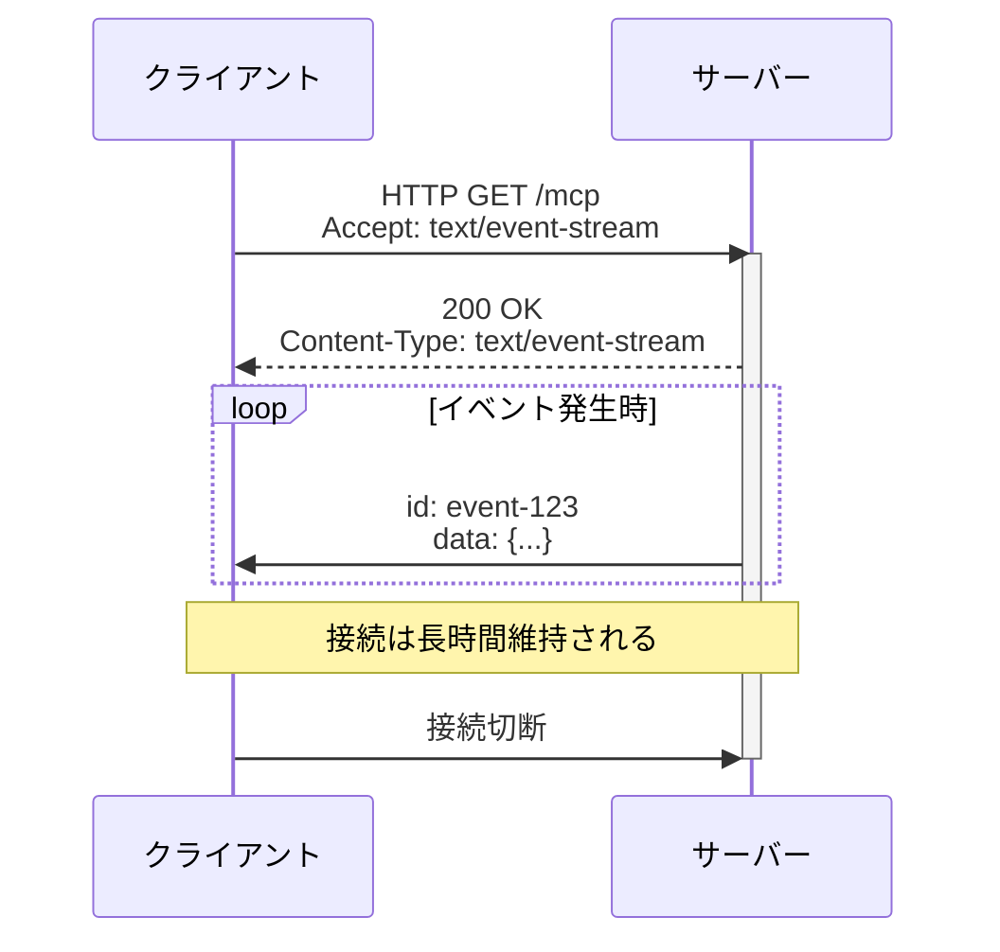
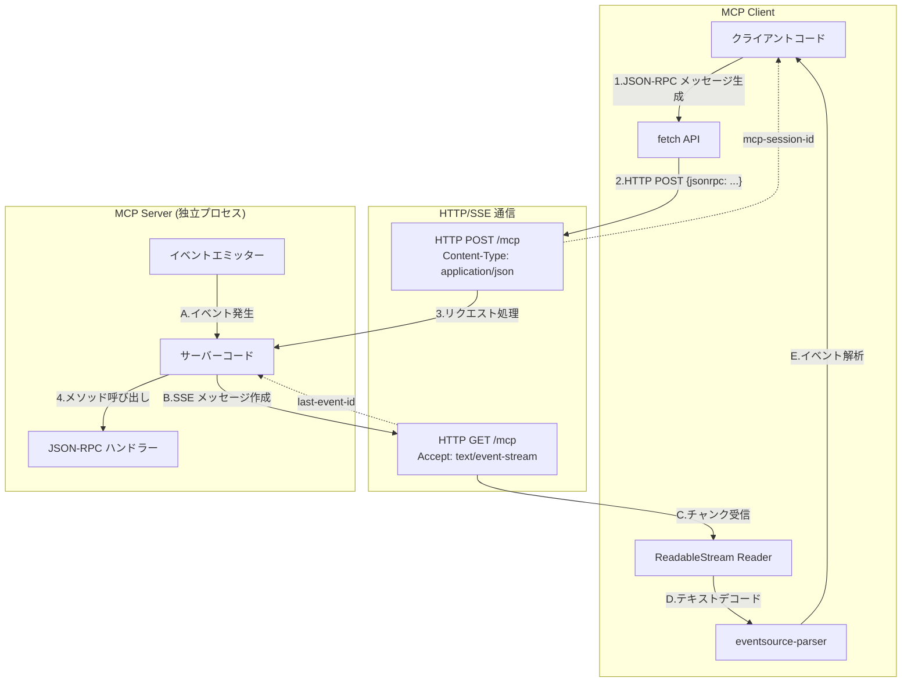

___MCP に関する発展理解編:___  _MCP の脆弱性と対策を理解するために必要な開発者向け知識の解説_

---

本章の説明は、2025-03-26 の[仕様](https://modelcontextprotocol.io/specification/2025-03-26)に基づきます。

MCP Specification: **Base Protocol（今ここ）**、Authorization、Client Features、Server Features

本 Chapter では Base Protocol の[トランスポート](https://modelcontextprotocol.io/specification/2025-03-26/basic/transports)について解説します。トランスポートについては Chapter04 で解説しましたが、今回はより詳細にトランスポートについて解説します。

JSON-RPC 2.0 はトランスポート非依存ですが、MCP の場合は [STDIO](https://modelcontextprotocol.io/specification/2025-03-26/basic/transports#stdio) と [Streamable HTTP](https://modelcontextprotocol.io/specification/2025-03-26/basic/transports#streamable-http) という Client ↔︎ Server 間通信のための二つのトランスポートメカニズムを仕様として定義しています。これらのトランスポートがメッセージの送受信でどのように接続を取り扱うべきであるかについて仕様で定義されています。

## Streamable HTTP

Streamable HTTP トランスポートは、HTTP と [Server-Sent Events (SSE)](https://en.wikipedia.org/wiki/Server-sent_events) を組み合わせて双方向通信を実現します。STDIO トランスポートがサブプロセスを起動してイベントハンドラを介して双方向で通信するのに対し、Streamable HTTP はネットワーク経由で通信を行います。SSE は Server から Client へのリアルタイム通信を HTTP で実現するための技術です。Client から Server への HTTP リクエストと Server から Client への SSE を利用して MCP で必要な双方向通信を実現します。

Streamable HTTP について次回詳しく実装解説するとして、今回は SSE の実装例について説明したいと思います。

**SSE について**

Typescript を用いた SSE サンプルコードを Chapter の最後に示しておきます。この実装では、`server.ts` で Server を起動します。この Server は `/sse` で SSE エンドポイントを持っています。`client.ts` で Client を起動します。Client は Server の SSE エンドポイントに `Accept: text/event-stream` ヘッダーを含めて HTTP GET リクエストを送信します。Server はこの接続を開いたまま保持し、ステータスコード `200` で応答します。以後サーバーは同じ接続を使ってイベントが発生するたびにデータを Client へ送信します。実装例では イベントとして 1 秒おきにカウンタの値を Client に送信します。


```bash:Server 実行
$ ts-node server.ts 
サーバー起動: http://localhost:3001
SSEエンドポイント: http://localhost:3001/sse
クライアント接続: 新しいSSEセッション開始
SSEイベント送信: 接続確立メッセージ
SSEイベント送信: カウント=1
SSEイベント送信: カウント=2
SSEイベント送信: カウント=3
^C
```

```bash:Client 実行
$ ts-node client.ts 
SSE接続確立
受信データ: { message: '接続確立' }
受信データ: { count: 1, timestamp: '2025-06-10T01:48:46.018Z' }
受信データ: { count: 2, timestamp: '2025-06-10T01:48:47.018Z' }
受信データ: { count: 3, timestamp: '2025-06-10T01:48:48.019Z' }
ストリーム処理エラー: terminated
SSE接続終了
```



SSE はこのように HTTP 上に構築されたシンプルな仕組みなので、適切なヘッダーとデータ形式の仕様を守れば、fetch などの基本的な API を使って実装することができます。SSE は WHATWG によって[標準化](https://html.spec.whatwg.org/multipage/server-sent-events.html#server-sent-events)されています。

**Streamable HTTP について**

以下は、HTTP と SSE を使った Streamable HTTP の通信の流れを表しています。詳細については次回解説しますが、単一のエンドポイント `/mcp` があり、`POST` で Client から Server への JSON-RPC 2.0 メッセージ送信 (矢印 1-4)、`GET` で Server から Client への SSE (矢印 A-E)、を実現しています。



**機能比較表**

STDIO と Streamable HTTP の簡単な機能比較表を作成しました。ここまで読まれた読者の方は MCP がトランスポート非依存であるということの意味がよくわかったと思います。トランスポートは STDIO HTTP、WebSocket などなんらかの方法で Server と Client の間で MCP 仕様を満たす形で双方向通信ができれば良いです。

| 特徴 | STDIO | Streamable HTTP |
|------|---------------------|---------------------------|
| 通信方式 | 標準入出力（stdin/stdout） | HTTP + SSE |
| プロセス | サブプロセスとして起動 | 独立したプロセス |
| 接続範囲 | ローカルマシン内のみ | ネットワーク経由（ローカル/リモート） |
| 複数接続 | 1 対 1 の接続のみ | 複数 Client 接続をサポート |
| 再接続機能 | なし | SSE の再開機能あり |
| セッション管理 | プロセスの生存期間 | セッション管理可能 |


## まとめ

本 Chapter では、MCP Base Protocol で定義されるトランスポートの一つである Streamable HTTP について解説しました。実装の概念部分が理解できているかいないかでセキュリティ対策に関する解像度が大きく変わってくると思いますのでしっかりとコードを理解しましょう。次 Chapter では typescript-sdk の Streamable HTTP 実装について解説します。

## SaaS コラム

本書では **SaaS コラム** で本文内容を補足する SaaS に関する解説を行います。

今回は SaaS に関する解説はありません。

## サンプルコード

```bash
npm install express eventsource-parser node-fetch@3 typescript ts-node @types/express @types/node
```

```typescript:server.ts
import express from 'express';
import { SSEMessage, CONFIG } from './types';

const app = express();

// SSEエンドポイント
app.get(CONFIG.ENDPOINT, (req, res) => {
  console.log('クライアント接続: 新しいSSEセッション開始');
  
  // SSEヘッダーを設定
  res.setHeader('Content-Type', 'text/event-stream');
  res.setHeader('Cache-Control', 'no-cache');
  res.setHeader('Connection', 'keep-alive');
  
  // 初期メッセージ送信
  sendMessage(res, { message: "接続確立" });
  console.log('SSEイベント送信: 接続確立メッセージ');
  
  // 定期的なメッセージ送信
  let count = 0;
  const intervalId = setInterval(() => {
    const data = { 
      count: ++count, 
      timestamp: new Date().toISOString() 
    };
    sendMessage(res, data);
    console.log(`SSEイベント送信: カウント=${count}`);
  }, CONFIG.INTERVAL_MS);
  
  // クライアント切断時の処理
  req.on('close', () => {
    clearInterval(intervalId);
    console.log('SSEセッション終了: クライアント切断');
  });
});

// メッセージ送信ヘルパー関数
function sendMessage(res: express.Response, data: SSEMessage): void {
  const eventId = `event-${Date.now()}`;
  const message = `id: ${eventId}\ndata: ${JSON.stringify(data)}\n\n`;
  res.write(message);
}

// サーバー起動
app.listen(CONFIG.PORT, () => {
  console.log(`サーバー起動: http://${CONFIG.HOST}:${CONFIG.PORT}`);
  console.log(`SSEエンドポイント: http://${CONFIG.HOST}:${CONFIG.PORT}${CONFIG.ENDPOINT}`);
});
```

```typescript:client.ts
import { createParser, type EventSourceMessage } from 'eventsource-parser';
import { SSEMessage, CONFIG } from './types';

async function connectToSSE(): Promise<void> {
  try {
    const url = `http://${CONFIG.HOST}:${CONFIG.PORT}${CONFIG.ENDPOINT}`;
    const response = await fetch(url, {
      headers: { 'Accept': 'text/event-stream' }
    });
    
    if (!response.ok) {
      throw new Error(`HTTP エラー: ${response.status}`);
    }
    
    console.log('SSE接続確立');
    await processEventStream(response);
    
  } catch (error) {
    console.error('接続エラー:', error instanceof Error ? error.message : String(error));
  }
}

async function processEventStream(response: Response): Promise<void> {
  if (!response.body) {
    throw new Error('レスポンスボディが空です');
  }
  
  // 正しい形式でParserCallbacksオブジェクトを渡す
  const parser = createParser({
    onEvent(event: EventSourceMessage) {
      if (event.data) {
        try {
          const data = JSON.parse(event.data) as SSEMessage;
          console.log('受信データ:', data);
        } catch {
          console.log('生データ:', event.data);
        }
      }
    },
    onError(err) {
      console.error('パースエラー:', err);
    }
  });
  
  const reader = response.body.getReader();
  
  try {
    while (true) {
      const { done, value } = await reader.read();
      if (done) break;
      
      const chunk = new TextDecoder().decode(value);
      parser.feed(chunk);
    }
  } catch (error) {
    console.error('ストリーム処理エラー:', error instanceof Error ? error.message : String(error));
  } finally {
    console.log('SSE接続終了');
  }
}

// SSE接続を開始
connectToSSE();
```

```typescript:types.ts
export interface SSEMessage {
  count?: number;
  timestamp?: string;
  message?: string;
}

export const CONFIG = {
  PORT: 3001,
  HOST: 'localhost',
  ENDPOINT: '/sse',
  INTERVAL_MS: 1000
};
```

```json:tsconfig.json
{
  "compilerOptions": {
    "target": "ES2020",
    "module": "NodeNext",
    "moduleResolution": "NodeNext",
    "esModuleInterop": true,
    "strict": true,
    "skipLibCheck": true,
    "forceConsistentCasingInFileNames": true,
    "outDir": "dist",
    "lib": ["ES2020", "DOM"]
  },
  "include": ["*.ts"]
}
```