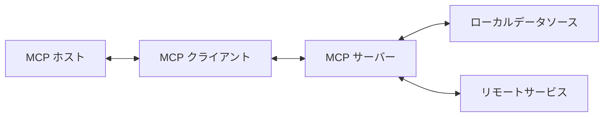

# Chapter 1: MCP とは何か？

## はじめに

ここ数年で開発業務のあらゆる側面で大規模言語モデル（LLM）は中心的な役割を果たし始めている。これらの強力なモデルは、テキスト生成、質問応答、コード作成など、様々なタスクで人間を超える驚異的な能力を発揮している。しかし、LLM が最新の状況やドメイン特有の文脈を理解した真に有用な存在となるためには、外部のデータソースやツールと効果的に連携する必要がある。Function Calling (tool use) がこれを実現するための方法として　LLM 自身の能力の一つとして提供されてきた。しかし、モデルごとに利用方法が異なるためアプリケーションごとに個別設定する必要があった。この連携を実現するための標準化された方法が存在しなかったことが、AI システム開発における大きな課題であった。

Model Context Protocol（MCP）は、この課題を解決するために生まれたプロバイダやモデルに依存しないオープンプロトコルである。MCP は、アプリケーションが LLM にコンテキスト（文脈情報）を提供するための標準化された方法を定義し、AI システムの相互運用性と拡張性を大幅に向上させる。本章では、MCP の基本概念、アーキテクチャ、主要コンポーネント、通信プロトコル、そしてセキュリティの基本的考慮点について詳しく解説する。

## MCP の基本概念

### MCP の定義と目的

Model Context Protocol（MCP）は、アプリケーションが大規模言語モデル（LLM）にコンテキスト（文脈情報）を提供するための標準化されたオープンプロトコルである。物理的な接続の世界で USB-C が果たす役割に例えることができる。USB-C が様々なデバイスを周辺機器に接続する標準的な方法を提供するように、MCP は AI モデルを様々なデータソースやツールに接続する標準的な方法を提供する。

この標準化により、開発者は共通のインターフェースを通じて LLM と様々なシステムを連携させることができる。MCP は、データの取得方法、ツールの実行方法、プロンプトの提供方法など、AI システムと外部リソースとの対話に関する明確なルールを定義している。これにより、異なるシステム間の互換性が確保され、開発者は既存の統合機能を容易に活用できるようになる。


### MCP の重要性と利点

MCP が AI 開発エコシステムにもたらす利点は多岐にわたる。まず、事前構築された統合機能を直接利用できるようになる。開発者は、多数の既存統合をすぐに利用でき、LLM が直接プラグインして使用することが可能になる。これにより、開発時間が大幅に短縮され、より複雑な AI システムの構築が容易になる。

次に、MCP は柔軟性を提供する。LLM プロバイダーやベンダー間の切り替えが容易になり、異なるシステム間の互換性が確保される。これは、特定のベンダーに依存することなく、最適なコンポーネントを選択して組み合わせることができることを意味する。

セキュリティの観点からも、MCP は重要な利点をもたらす。インフラストラクチャ内でのデータ保護が強化され、ベストプラクティスに基づくセキュリティ対策が実装される。標準化されたプロトコルにより、セキュリティの脆弱性を特定し、対処することが容易になる。

さらに、MCP は開発効率を向上させる。標準化されたインターフェースにより開発時間が短縮され、再利用可能なコンポーネントを活用できるようになる。これにより、開発者はビジネスロジックや独自の機能開発に集中することができる。

## MCPのアーキテクチャ

MCP は、クライアント-サーバーアーキテクチャを採用している。このアーキテクチャにより、ホストアプリケーションは複数のサーバーに接続し、様々な機能やデータソースにアクセスできる。以下の図は、MCP の基本的なアーキテクチャを示している。



この図が示すように、MCP アーキテクチャは複数の主要コンポーネントから構成されている。各コンポーネントは特定の役割を担い、全体として効率的なデータフローと機能提供を実現している。以下では、これらの主要コンポーネントについて詳しく説明する。

### MCPホスト

MCP ホストは、Claude Desktop、統合開発環境（IDE）、AI ツールなど、MCP を通じてデータにアクセスしたいプログラムである。ホストはユーザーインターフェースを提供し、LLM との対話を管理する役割を担う。ユーザーの入力を受け取り、適切な形式で LLM に転送し、結果を表示する。また、複数の MCP クライアントを管理し、それらを通じて様々なサーバーと通信することができる。

ホストは、ユーザーの意図を理解し、適切なサーバーとリソースを選択して、効果的な対話を実現する責任を持つ。例えば、ユーザーがコードに関する質問をした場合、ホストはコードリポジトリにアクセスできる MCP サーバーを通じて関連情報を取得し、LLM に提供することができる。

### MCPクライアント

MCP クライアントは、サーバーとの 1:1 の接続を維持し、プロトコルクライアントとして機能する。クライアントはリクエストの送信と応答の処理を担当し、ホストとサーバー間の通信を仲介する。クライアントは、プロトコルのバージョン管理、エラー処理、再試行ロジックなどの複雑な処理を抽象化し、ホストが簡単にサーバーと対話できるようにする。

クライアントは、サーバーの機能を発見し、適切なリクエストを形成し、応答を解析する責任を持つ。また、接続の状態を監視し、必要に応じて再接続を試みるなど、通信の信頼性を確保する役割も担う。

### MCPサーバー

MCP サーバーは、標準化された Model Context Protocol を通じて特定の機能を提供する軽量プログラムである。サーバーは、ツール、リソース、プロンプトなどの機能を公開し、クライアントからのリクエストに応じてこれらの機能を実行する。サーバーは、特定のデータソースやサービスへのアクセスを提供し、それらを MCP の標準形式に変換する役割を担う。

サーバーは、様々な形態で実装できる。ローカルマシン上で動作する単純なプロセスから、クラウド上でホストされる複雑なサービスまで、様々な形態が考えられる。重要なのは、サーバーが MCP の標準に準拠し、クライアントとの効率的な通信を実現することである。

### データソース

MCP アーキテクチャにおいて、データソースは情報の源泉となる。これらは大きく二つのカテゴリに分けられる。

ローカルデータソースには、コンピュータのファイル、データベース、ローカルサービスなどが含まれる。これらは、ユーザーのマシン上に存在し、MCP サーバーを通じてアクセスされる。ローカルデータソースは、プライバシーとセキュリティの観点から重要であり、機密情報を外部に送信することなく LLM に提供できる利点がある。

一方、リモートサービスは、インターネット経由でアクセス可能な外部システムである。これには、Web API、クラウドサービス、外部データベースなどが含まれる。リモートサービスは、最新の情報や広範なデータへのアクセスを提供するが、ネットワーク接続やセキュリティに関する追加の考慮が必要となる。

## MCPの主要コンポーネント

MCP は、様々な機能を提供するために複数の主要コンポーネントを定義している。これらのコンポーネントは、LLM とデータソース・ツール間の効果的な連携を実現するための基盤となる。以下では、これらの主要コンポーネントについて詳しく説明する。

### ツール（Tools）

ツールは、サーバーが実行可能な機能をクライアントに公開し、LLM が外部システムと対話したり、アクションを実行したりできるようにするコンポーネントである。ツールは「モデル制御型」として設計されており、AI モデルが自動的に呼び出すことができる（ただし、通常はヒューマンインザループで承認を得る必要がある）。

ツールは、明確な入力スキーマと出力形式を定義し、エラーハンドリングの実装が必須となる。例えば、Web 検索、ファイル操作、API 呼び出しなどの機能がツールとして実装される。ツールは JSON スキーマで定義され、名前、説明、入力パラメータ、アノテーション（読み取り専用かどうかなど）を含む。

ツールの実装例として、以下のようなコードが考えられる：

```javascript
const server = new Server({
  name: "example-server",
  version: "1.0.0"
}, {
  capabilities: {
    tools: {}
  }
});

// ツールの定義
server.setRequestHandler(ListToolsRequestSchema, async () => {
  return {
    tools: [{
      name: "calculate_sum",
      description: "Add two numbers together",
      inputSchema: {
        type: "object",
        properties: {
          a: { type: "number" },
          b: { type: "number" }
        },
        required: ["a", "b"]
      }
    }]
  };
});

// ツールの実行
server.setRequestHandler(CallToolRequestSchema, async (request) => {
  if (request.params.name === "calculate_sum") {
    const { a, b } = request.params.arguments;
    return {
      content: [
        {
          type: "text",
          text: String(a + b)
        }
      ]
    };
  }
  throw new Error("Tool not found");
});
```

このコードは、二つの数値を足し合わせる単純なツールを定義している。実際のアプリケーションでは、より複雑な機能を持つツールが実装されることが多い。

### リソース（Resources）

リソースは、サーバーがクライアントに公開し、LLM の対話のコンテキストとして使用できるデータやコンテンツである。リソースは「アプリケーション制御型」として設計されており、クライアントアプリケーションがいつどのように使用するかを決定する。

リソースは URI で識別され（例：`file:///path/to/document.pdf`）、テキストまたはバイナリデータを含む。例えば、ファイル内容、データベースレコード、API レスポンス、システム情報などがリソースとして提供される。リソースは静的または動的に提供され、リアルタイム更新もサポートされている。

リソースの実装例として、以下のようなコードが考えられる：

```javascript
const server = new Server({
  name: "example-server",
  version: "1.0.0"
}, {
  capabilities: {
    resources: {}
  }
});

// リソースの一覧
server.setRequestHandler(ListResourcesRequestSchema, async () => {
  return {
    resources: [
      {
        uri: "file:///logs/app.log",
        name: "Application Logs",
        mimeType: "text/plain"
      }
    ]
  };
});

// リソースの読み取り
server.setRequestHandler(ReadResourceRequestSchema, async (request) => {
  const uri = request.params.uri;

  if (uri === "file:///logs/app.log") {
    const logContents = await readLogFile();
    return {
      contents: [
        {
          uri,
          mimeType: "text/plain",
          text: logContents
        }
      ]
    };
  }

  throw new Error("Resource not found");
});
```

このコードは、アプリケーションログファイルをリソースとして公開する例である。実際のアプリケーションでは、様々な種類のリソースが提供されることが多い。

### プロンプト（Prompts）

プロンプトは、サーバーが再利用可能なプロンプトテンプレートとワークフローを定義し、クライアントがユーザーと LLM に簡単に提示できるようにする機能である。プロンプトは「ユーザー制御型」として設計されており、ユーザーが明示的に選択して使用することを意図している。

プロンプトは、動的な引数を受け付け可能で、リソースコンテキストを埋め込むことができる。また、複数のステップを持つワークフローを定義することも可能である。プロンプトは、特定のタスクや質問に対する標準化された対話パターンを提供する。

プロンプトの実装例として、以下のようなコードが考えられる：

```javascript
const server = new Server({
  name: "example-prompts-server",
  version: "1.0.0"
}, {
  capabilities: {
    prompts: {}
  }
});

// プロンプトの一覧
server.setRequestHandler(ListPromptsRequestSchema, async () => {
  return {
    prompts: [
      {
        name: "git-commit",
        description: "Generate a Git commit message",
        arguments: [
          {
            name: "changes",
            description: "Git diff or description of changes",
            required: true
          }
        ]
      }
    ]
  };
});

// プロンプトの取得
server.setRequestHandler(GetPromptRequestSchema, async (request) => {
  if (request.params.name === "git-commit") {
    return {
      messages: [
        {
          role: "user",
          content: {
            type: "text",
            text: `Generate a concise but descriptive commit message for these changes:\n\n${request.params.arguments?.changes}`
          }
        }
      ]
    };
  }

  throw new Error("Prompt not found");
});
```

このコードは、Git コミットメッセージを生成するためのプロンプトを定義している。ユーザーは変更内容を提供し、プロンプトはそれに基づいて適切なコミットメッセージを生成するための指示を LLM に提供する。

### サンプリング（Sampling）

サンプリングは、サーバーがクライアントを通じて LLM の補完をリクエストできるようにする機能である。サンプリングは、ヒューマンインザループの設計を採用しており、モデル選択の柔軟性、システムプロンプトのカスタマイズ、コンテキスト含有の制御などの機能を提供する。

サンプリングのフローは以下のステップに従う：

1. サーバーがクライアントに `sampling/createMessage` リクエストを送信
2. クライアントがリクエストをレビューし、修正可能
3. クライアントが LLM からサンプリング
4. クライアントが補完をレビュー
5. クライアントが結果をサーバーに返す

このヒューマンインザループの設計により、ユーザーは LLM が見る内容と生成する内容を制御できる。なお、この機能は現在 Claude Desktop クライアントではサポートされていない。

## MCPの通信プロトコル

MCP は JSON-RPC 2.0 をワイヤーフォーマットとして使用し、クライアントとサーバー間の通信を標準化している。JSON-RPC は、リモートプロシージャコール（RPC）を実行するための軽量なプロトコルであり、JSON を使用してデータをエンコードする。このプロトコルにより、クライアントとサーバーは構造化されたメッセージを交換し、効率的に通信することができる。

### メッセージタイプ

MCP の通信プロトコルでは、以下の主要なメッセージタイプが定義されている：

1. **リクエスト**：相手側からの応答を期待するメッセージ。メソッド名とパラメータを含み、一意の ID で識別される。

2. **レスポンス**：リクエストへの成功応答。リクエストと同じ ID を持ち、結果を含む。

3. **エラー**：リクエストが失敗したことを示す応答。リクエストと同じ ID を持ち、エラーコードとメッセージを含む。

4. **通知**：応答を期待しない一方向のメッセージ。メソッド名とパラメータを含むが、ID は持たない。

これらのメッセージタイプにより、クライアントとサーバーは様々な種類の対話を実現できる。リクエスト-レスポンスパターンは同期的な対話に使用され、通知は非同期的な情報の伝達に使用される。

### トランスポートタイプ

MCP は以下の主要なトランスポートメカニズムをサポートしている：

1. **標準入出力（stdio）トランスポート**：標準入出力を使用した通信を行う。このトランスポートは、ローカルプロセスに最適であり、コマンドラインツールや単一マシン上の統合に適している。stdio トランスポートは、シンプルで効率的であり、プロセス間通信に適している。

2. **HTTP と SSE トランスポート**：サーバーからクライアントへのメッセージに Server-Sent Events（SSE）を使用し、クライアントからサーバーへのメッセージに HTTP POST を使用する。このトランスポートは、ネットワーク越しの通信に適しており、Web アプリケーションとの統合に便利である。

これらのトランスポートメカニズムにより、様々な環境や要件に対応した通信が可能になる。開発者は、アプリケーションの要件に応じて適切なトランスポートを選択できる。

### 接続ライフサイクル

MCP の接続は以下のライフサイクルに従う：

1. **初期化**：クライアントとサーバーがプロトコルバージョンと機能を交換する。クライアントが `initialize` リクエストを送信し、サーバーが応答する。その後、クライアントが確認として `initialized` 通知を送信する。

2. **メッセージ交換**：初期化が完了すると、クライアントとサーバーはリクエスト-レスポンスパターンと通知による通信を行う。この段階で、ツールの呼び出し、リソースの読み取り、プロンプトの取得などの操作が行われる。

3. **終了**：接続は、正常なシャットダウン（`close()` メソッドの呼び出し）、トランスポートの切断、またはエラー条件によって終了する。終了時には、リソースの解放やクリーンアップが行われる。

この接続ライフサイクルにより、クライアントとサーバーは効率的かつ信頼性の高い通信を実現できる。初期化段階での機能の交換により、互換性の問題を早期に検出し、適切に対処することができる。

## セキュリティの基本的考慮点

MCP を実装する際には、セキュリティに関する様々な考慮事項が重要となる。以下では、MCP のセキュリティに関する基本的な考慮点について説明する。

### トランスポートセキュリティ

トランスポートセキュリティは、クライアントとサーバー間の通信の安全性を確保するための重要な要素である。リモート接続には TLS（Transport Layer Security）を使用し、通信の暗号化を行うべきである。これにより、通信の盗聴や改ざんを防ぐことができる。

また、接続元の検証も重要である。サーバーは、接続を受け入れる前に、クライアントの身元を確認する必要がある。これにより、不正なクライアントからの接続を防ぐことができる。

必要に応じて、認証メカニズムを実装することも重要である。クライアントとサーバーは、互いの身元を確認し、適切な権限を持つエンティティのみが通信できるようにする必要がある。

### メッセージ検証

メッセージ検証は、受信したメッセージの整合性と安全性を確保するための重要な要素である。すべての受信メッセージを検証し、不正なメッセージや悪意のあるメッセージを検出する必要がある。

入力のサニタイズも重要である。特に、ユーザー入力や外部ソースからのデータは、適切にサニタイズし、インジェクション攻撃などを防ぐ必要がある。

メッセージサイズの制限も考慮すべきである。過大なメッセージは、サービス拒否（DoS）攻撃の原因となる可能性がある。適切なサイズ制限を設け、過大なメッセージを拒否する仕組みを実装すべきである。

また、JSON-RPC フォーマットの検証も重要である。不正な形式のメッセージは、エラーや予期しない動作の原因となる可能性がある。すべてのメッセージが正しい JSON-RPC 形式に従っていることを確認する必要がある。

### リソース保護

リソース保護は、サーバーが提供するリソースの安全性と整合性を確保するための重要な要素である。適切なアクセス制御を実装し、権限のあるクライアントのみがリソースにアクセスできるようにする必要がある。

リソースパスの検証も重要である。特に、ファイルパスを含むリソース URI は、ディレクトリトラバーサル攻撃などを防ぐために、適切に検証する必要がある。

リソース使用状況の監視も考慮すべきである。過剰なリソース使用は、サービス拒否攻撃の原因となる可能性がある。リソース使用状況を監視し、異常な使用パターンを検出する仕組みを実装すべきである。

また、リクエストのレート制限も重要である。過剰なリクエストは、サーバーの負荷を増大させ、サービス品質の低下を招く可能性がある。適切なレート制限を設け、過剰なリクエストを制限する仕組みを実装すべきである。

### エラー処理

適切なエラー処理は、セキュリティの観点からも重要である。機密情報の漏洩を防ぐため、エラーメッセージには詳細な内部情報を含めないようにする必要がある。エラーメッセージは、問題の診断に役立つ情報を提供しつつも、攻撃者に有用な情報を与えないように設計すべきである。

セキュリティ関連のエラーのログ記録も重要である。セキュリティ関連のエラーは、適切にログに記録し、後の分析や監査に役立てるべきである。ただし、ログ自体が機密情報を含まないように注意する必要がある。

適切なリソースクリーンアップも考慮すべきである。エラー発生時でも、リソースが適切に解放されるようにする必要がある。リソースリークは、サービス品質の低下やセキュリティ脆弱性の原因となる可能性がある。

また、DoS 攻撃への対策も重要である。エラー処理メカニズム自体が DoS 攻撃の標的となる可能性がある。エラー処理に関連するリソース使用を制限し、DoS 攻撃の影響を最小化する仕組みを実装すべきである。

## まとめ

本章では、Model Context Protocol（MCP）の基本概念、アーキテクチャ、主要コンポーネント、通信プロトコル、そしてセキュリティの基本的考慮点について詳しく解説した。MCP は、AI アプリケーション開発における重要な標準化プロトコルであり、USB-C が物理的な接続を標準化したように、AI モデルとデータソース・ツール間の接続を標準化する役割を果たす。

MCP の標準化されたアプローチにより、開発者は既存の統合機能を活用でき、アプリケーション間の互換性が向上し、セキュアなデータアクセスが可能になり、開発効率と再利用性が高まる。クライアント-サーバーアーキテクチャを採用し、ツール、リソース、プロンプト、サンプリングなどの主要コンポーネントを通じて機能を提供する MCP は、AI システムの構築と統合を大幅に簡素化する。

しかし、MCP の導入には、トランスポートセキュリティ、メッセージ検証、リソース保護、エラー処理など、様々なセキュリティ考慮事項が伴う。これらの考慮事項に適切に対処することで、安全で信頼性の高い MCP 実装を実現することができる。

次の章では、MCP のセキュリティリスクに焦点を当て、より詳細な考察を行う。主要な脆弱性と攻撃ベクトル、そしてそれらに対する対策方法について詳しく解説する。
