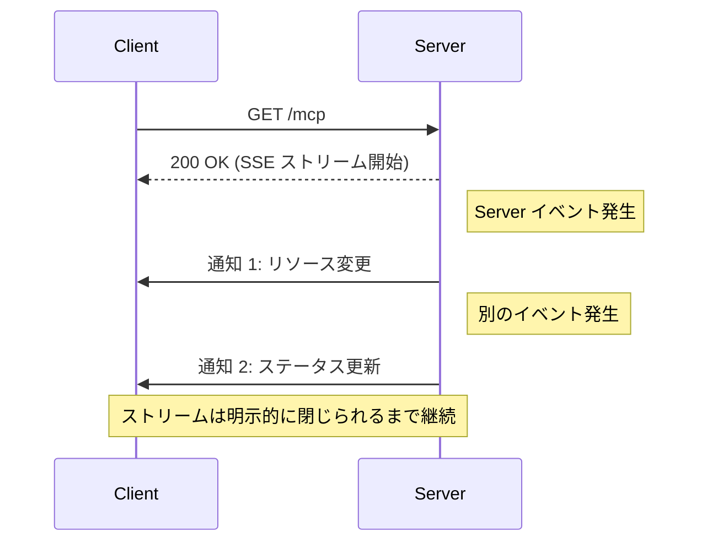
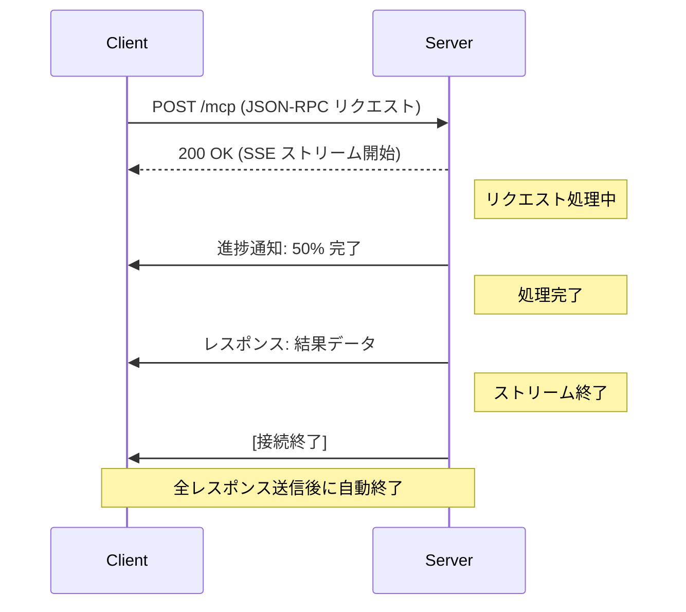

___MCP に関する実装理解編:___  _MCP の脆弱性と対策を実装するために必要な開発者向け知識の解説_

---

本章の説明は 2025-06-18 の[仕様](https://modelcontextprotocol.io/specification/2025-06-18)に基づきます。

MCP Specification: **Base Protocol（今ここ）**、Authorization、Client Features、Server Features、Security Best Practices

本 Chapter では Streamable HTTP の typescript-sdk(tag: 1.13.2) の [Client 実装](https://github.com/modelcontextprotocol/typescript-sdk/blob/1.13.2/src/client/streamableHttp.ts) と [Server 実装](https://github.com/modelcontextprotocol/typescript-sdk/blob/1.13.2/src/server/streamableHttp.ts) について解説します。Chapter09 で解説した通り Streamable HTTP は HTTP と SSE を利用して双方向通信を実現しています。

## ID と ストリーム

Streamable HTTP は STDIO と比べて仕様が複雑で、HTTP GET/POST/(DELETE) を実装する必要があり、ヘッダ、権限の認可、一つの Server の複数 Client 接続、接続の切断と再開、セッション管理、セキュリティ対策、など複数の機能が定義されています。詳細部分は必要があれば読者それぞれに確認いただくとして、本 Chapter では ***ID(Identifier)*** と ***ストリーム*** の側面から仕様を整理しましょう。ID はその名の通り、なんらかの namespace や scope などの有効範囲において、オブジェクトを一意に特定するための番号です。

馴染み深い ID には ユーザー ID、UUID などがあるでしょう。ユーザー ID は特定のサービスという scope において ID をユーザー単位で割り振ります。

他にも例えば、みなさんが大好きな [PCI Express](https://ja.wikipedia.org/wiki/PCI_Express) では Data Link Layer Packet(DLLP) というデータリンク層のパケットがあります。これには DLLP ID という ID が付与されています。この ID は上の階層のトランザクション層のパケット (Transaction Layer Packet/TLP) 送達がうまくいったかどうかを管理しており、例えば TLP(DLLP ID: 1 を包含) で送ったパケットが送り先で壊れていた場合、Nack(DLLP ID: 1) で送り元にパケットが正常に送れなかったことを通知します。これによって DLLP ID 何番までの TLP が正常に送信先で受け取られているのかを把握することができるため、失敗した TLP から送り直すということができます。このように ID は連続性を持つ一連のトランザクションの管理を行うことも可能です。これはトランザクションという scope のなかで、ID によって順序性をもつオブジェクトの一意性を確認するということです。Protocol のデータフォーマットなどで ID が定義されている場合には、それがどの scope で何の一意性を何のために定義しようとしているのかということを考えると良いでしょう。

**1. ID の種類**

Streamable HTTP の仕様に戻ると、**1/ メッセージ ID:** 既に解説した JSON-RPC 2.0 のリクエスト・レスポンスに含まれる ID があります。これは JSON-RPC 2.0 の scope でのメッセージの一意性を確保するための ID であり、整合性を取るために必要です。**2/ セッション ID:** 次に、セッション ID があります。これはその名の通りステートフルなセッションを管理するための ID です。セッション ID は**グローバルに一意で暗号的に安全**であることが要求されます。**3/イベント ID:** 最後に イベント ID があります。これは上述した DLLP ID に近い概念で、ストリームが切断された場合でも既に送信できているイベント ID の次のメッセージから再開できるようにするために利用されます。 Client が GET リクエストのヘッダーに `last-event-id` を付与すると、Server はこのヘッダーを使用して、メッセージを再生してストリームを再開することができます。

**仕様上は記載がありませんが**、**4/ ストリームID:** typescript-sdk の実装上、ストリーム ID というストリーム単位の ID が付与されています。

| 特性 | メッセージ ID | セッション ID | イベント ID |
|------|------------|------------|-----------|
| **存在条件** | リクエストメッセージに必須（ 通知には不要） | ステートフルモードで必須、ステートレスモードでは不要 | 再開可能ストリームで必須再開機能がない場合は不要 |
| **生成元** | Client | Server | Server |
| **生成タイミング** | リクエスト送信時 | 初期化リクエスト処理時 | SSE イベント送信時 |
| **有効範囲** | Requester のセッション内 | 全 HTTP リクエスト | 特定のストリーム内 |
| **終了条件** | レスポンス受信時 / タイムアウト時 | 明示的な終了 / Server 側の終了 | ストリームの終了時 |
| **識別scope** | 送信者のメッセージシーケンス | Client 接続 | ストリーム内イベントシーケンス |
| **目的** | リクエストとレスポンスの対応付け | セッション状態の維持と認証 | ストリーム再開位置の特定 |

> Protocol 視点では、メッセージ ID は JSON-RPC 2.0、セッション ID と イベント ID は Transport、で扱われています。

**2. ストリームについて**

ここは非常に混乱しやすいポイントです。SSE ストリームは 2 種類あります。GET ストリームは、Client からの特定のリクエストとは関係なく、Server が主導して情報をプッシュするための独立したチャネルです。POST ストリームは、Client の特定のリクエストに対するレスポンスを送信するためのチャネルであり、リクエスト ID と明確に関連付けられています。

| 特徴 | GET ストリーム | POST ストリーム |
|------|-------------|--------------|
| **確立のトリガー** | Client GET リクエスト | Client POST リクエスト |
| **送信可能なメッセージ** | 通知とリクエストのみ | 通知、リクエスト、レスポンス |
| **終了条件** | Server 判断 or Client 切断 | 全レスポンス送信後に自動終了 |
| **リクエストとの関連** | なし（独立したチャネル） | 特定のリクエスト ID と関連付け |
| **セッション内の数** | セッションごとに 1 つのみ | 複数可（リクエストごとに新しいストリーム） |
| **用途** | Server 主導の通信 | リクエスト・レスポンス型の通信 |

> GET ストリーム



> POST ストリーム



**3. ステートフル・ステートレス**

ここまでの ID とストリームの情報を踏まえて、**ステートフル、ステートレス、それぞれのモードでの ID とストリームの関係性を例示します。**

> イベント ID はストリームごとに割り当てられ、そのストリーム内でのカーソルとして機能します。イベント ID は、セッション内の全ストリーム間でグローバルに一意である必要があります。

```bash:ステートフルモードの ID 管理の例
セッション ID: "1868a90c-5f3d-4b9a-b3a2-c8e0c92e1c0a"
├── GET ストリーム (スタンドアロン SSE ストリーム)
│   ├── イベント ID: "ev-001"
│   │   └── JSON-RPC ID: なし（Server からの通知のみ）
│   ├── イベント ID: "ev-002"
│   │   └── JSON-RPC ID: なし（Server からの通知のみ）
│   └── ...
└── POST ストリーム
    ├── イベント ID: "ev-101"
    │   └── JSON-RPC ID: 1（Client A リクエスト）
    ├── イベント ID: "ev-102"
    │   └── JSON-RPC ID: 1（Server レスポンス）
    ├── イベント ID: "ev-103"
    │   └── JSON-RPC ID: 2（Client A リクエスト - 同じ Client は新しいIDを使用）
    ├── イベント ID: "ev-104"
    │   └── JSON-RPC ID: 2（Server レスポンス）
    ├── イベント ID: "ev-105"
    │   └── JSON-RPC ID: 1（Client B リクエスト - 別 Cleint なので同じ ID でも可）
    ├── イベント ID: "ev-106"
    │   └── JSON-RPC ID: 1（Server レスポンス）
    └── ...
```

```bash:ステートレスモードの ID 管理の例
GET ストリーム (スタンドアロン SSE ストリーム)
│   ├── イベント ID: "ev-001"
│   │   └── JSON-RPC ID: なし（Server からの通知のみ）
│   └── イベント ID: "ev-002"
│       └── JSON-RPC ID: なし（Server からの通知のみ）
└── ...

POST ストリーム 1（Client A）
├── イベント ID: "ev-101"
│   └── JSON-RPC ID: 1（Client A リクエスト）
├── イベント ID: "ev-102"
│   └── JSON-RPC ID: 1（Server レスポンス）
├── イベント ID: "ev-103"
│   └── JSON-RPC ID: 2（Client A リクエスト - 同じ Client は新しい ID を使用）
├── イベント ID: "ev-104"
│   └── JSON-RPC ID: 2（Server レスポンス）
└── ...

POST ストリーム 2（Client B）
├── イベント ID: "ev-201"
│   └── JSON-RPC ID: 1（Client B リクエスト - 別 Client なので同じ ID でも可）
├── イベント ID: "ev-202"
│   └── JSON-RPC ID: 1（Server レスポンス）
└── ...
```

仕様では機能単位で HTTP のリクエスト・レスポンスのヘッダやステータスコードに関する規約を説明していますが、それらの細かな規約を `ID` と `ストリーム` 視点で捉え直したことで、実現したい機能や、それらの機能の scope などがより見えやすくなったのではないでしょうか。

## Client 実装

**1. 主要クラス**

`StreamableHTTPClientTransport` クラスは、 `Transport` インターフェースを実装し、MCP Server との通信を管理します。

https://github.com/modelcontextprotocol/typescript-sdk/blob/1.13.2/src/client/streamableHttp.ts#L119

https://github.com/modelcontextprotocol/typescript-sdk/blob/1.13.2/src/client/streamableHttp.ts#L347-L355

`StdioClientTransport`や `StreamableHttpClientTransport` などの具体的なトランスポート実装がこの `Transport` インターフェースを継承します。`start()`、`close()`、`send(message: JSONRPCMessage)` などを `Transport` ではメソッドとして定義しています。この抽象化によってトランスポート層の接続の実現方法の違いを隠蔽します。

**2. Client からのメッセージ送信**

メッセージ送信は `send()` メソッドが担います。

https://github.com/modelcontextprotocol/typescript-sdk/blob/1.13.2/src/client/streamableHttp.ts#L378

https://github.com/modelcontextprotocol/typescript-sdk/blob/1.13.2/src/client/streamableHttp.ts#L388-L390

https://github.com/modelcontextprotocol/typescript-sdk/blob/1.13.2/src/client/streamableHttp.ts#L447-L453

Client から Server へのメッセージ送信を見ていきましょう。**1/ コンテンツタイプ:** 仕様上 Client は `Content-Type` に `text/event-stream` と `application/json` をサポートする必要があります。つまり、Client からの Post リクエストに対して Server が単純な単一の JSON レスポンスを返してくるか、SSE イベントストリームを返してくるかを判断して Client は適切に対応する必要があります。**2/ SSE イベントストリーム:** Server が `text/event-stream` を返却してきた場合、Server は接続を維持し、Client は `_handleSseStream` メソッドを通じて Server からストリームで受信したイベントを管理・パースします。そしていずれのコンテンツタイプの場合も JSON-RPC 2.0 メッセージを抽出してクライアントアプリケーションにメッセージ通知します。コードは割愛していますが `resumptionToken` という再開のためのトークンがある場合は SSE ストリームを再開します。

**2. Client のメッセージ受信**

詳細は割愛しますが、`_startOrAuthSse()` メソッドでは `GET` リクエストを Client から発行することができます。これは上述した SSE ストリームを開くために使用できます。SSE ストリームは Client、Server 双方から一方的にいつでも閉じることができます。ネットワーク切断は常時発生し得る為、予期せぬ切断と終了（キャンセル）は明示的に区別されています。

## Server 実装

**1. 主要クラス**

`StreamableHTTPServerTransport` クラスは、`Transport` インターフェースを実装し、MCP Client からのリクエストを処理します。

https://github.com/modelcontextprotocol/typescript-sdk/blob/1.13.2/src/server/streamableHttp.ts#L100

**2. リクエストハンドラー**

Server では Client からの HTTP リクエストのメソッドに応じて上述した GET/POST ストリーム処理を振り分けます。

https://github.com/modelcontextprotocol/typescript-sdk/blob/1.13.2/src/server/streamableHttp.ts#L139-L149

GET ストリームは、`handleGetRequest` で扱い、**1/ Accept ヘッダー検証:** Client が SSE ストリームが受け入れ可能か確認し、**2/ 既存ストリーム確認:** `_streamMapping` で既存ストリーム有無を確認、**3/ ストリーム確立:** ストリームがなければストリームを登録、します。GET ストリームのための固定 ID は`_standaloneSseStreamId` で管理されています。この  GET ストリームのための ID はステートフルかステートレスかによらず `StreamableHTTPServerTransport` インスタンス内での上限は 1 つまでです。

https://github.com/modelcontextprotocol/typescript-sdk/blob/1.13.2/src/server/streamableHttp.ts#L156-L159

https://github.com/modelcontextprotocol/typescript-sdk/blob/1.13.2/src/server/streamableHttp.ts#L201-L204

https://github.com/modelcontextprotocol/typescript-sdk/blob/1.13.2/src/server/streamableHttp.ts#L218-L224

POST ストリームは、`handlePostRequest` で扱い、**1/ Accept ヘッダー検証:** Client が SSE ストリームと JSON を受け入れ可能か確認し、**2/ リクエストボディをパース**、**3/ リクエスト有無:**  通知のようにリクエストを含まない場合は `202` で処理受付を返却、**4A/ リクエストを含む場合** は、ストリーム ID (UUID) を生成して JSON レスポンス、もしくは SSE ストリームを開始します。

https://github.com/modelcontextprotocol/typescript-sdk/blob/1.13.2/src/server/streamableHttp.ts#L293

https://github.com/modelcontextprotocol/typescript-sdk/blob/1.13.2/src/server/streamableHttp.ts#L295-L298

https://github.com/modelcontextprotocol/typescript-sdk/blob/1.13.2/src/server/streamableHttp.ts#L327-L334

https://github.com/modelcontextprotocol/typescript-sdk/blob/1.13.2/src/server/streamableHttp.ts#L399-L400

> 4A. リクエストを含む場合

https://github.com/modelcontextprotocol/typescript-sdk/blob/1.13.2/src/server/streamableHttp.ts#L413-L419

**3. Server からのメッセージ送信**

Server からのメッセージ送信は Client 同様に `send()` メソッドで行われます。主に、**1/** SSE ストリームの選択、**2/** イベント ID の生成と保存、**3/** レスポンス完了時の SSE ストリーム終了判断、などを行います。

Client からのリクエストに対してのレスポンス send の場合は、JSON-RPC 2.0 の仕様に沿って、リクエストに含まれるメッセージ ID (JSON-RPC 2.0 ID) をそのまま使用します。メッセージ ID がない場合は GET ストリームなので、GET ストリームの有無を確認します。そして GET ストリーム ID が既に存在する場合は、イベント ID を生成して SSE イベントとして送信を行います。POST ストリームの場合の実装の詳細は割愛しますが、メッセージ ID に対応するストリームを探し、そのストリームへ SSE イベントとして送信を行います。

https://github.com/modelcontextprotocol/typescript-sdk/blob/1.13.2/src/server/streamableHttp.ts#L572-L577

https://github.com/modelcontextprotocol/typescript-sdk/blob/1.13.2/src/server/streamableHttp.ts#L593-L598

https://github.com/modelcontextprotocol/typescript-sdk/blob/1.13.2/src/server/streamableHttp.ts#L600-L603

## まとめ

本 Chapter Streamable HTTP の詳細実装について主に `ID` と `ストリーム` の側面から解説しました。MCP の公式仕様は必要最小限の記述しかなく仕様としてはエレガントかもしれませんが、実装と紐づけるのが非常に難しいのではないかと思います。仕様、本書の説明、実装を合わせて AI コーディングエージェントなどに解説させると、不明点についてよりクリアになるのではないでしょうか。**Let's [Amazon Q Developer CLI !!!!](https://aws.amazon.com/jp/blogs/news/introducing-the-enhanced-command-line-interface-in-amazon-q-developer/)**

私が気に入っているのは Amazon Q Developer CLI の `-no-interactive` 機能です。通常 CLI を実行すると対話モードが起動してしまいますが、このオプションをつけることで `q chat` にパイプを渡せ、結果も `stdout` に出せます。他にも色々な機能がすごいスピード感で追加されているため、**Amazon Q Developer CLI を実装調査のお供に活用**してみてはどうでしょうか。
