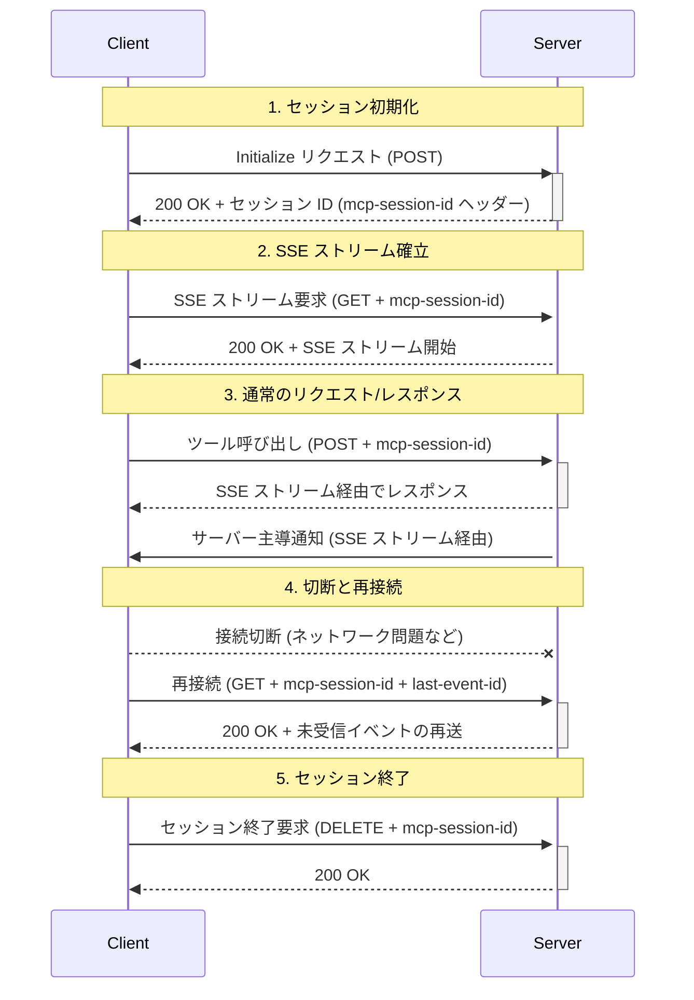

___MCP に関する実装理解編:___  _MCP の脆弱性と対策を実装するために必要な開発者向け知識の解説_

---

本章の説明は、2025-03-26 の[仕様](https://modelcontextprotocol.io/specification/2025-03-26)に基づきます。

MCP Specification: **Base Protocol（今ここ）**、Authorization、Client Features、Server Features、Security Best Practices

本 Chapter では Streamable HTTP の typescript-sdk(tag: 1.12.1) の [Client 実装](https://github.com/modelcontextprotocol/typescript-sdk/blob/1.12.1/src/client/streamableHttp.ts) と [Server 実装](https://github.com/modelcontextprotocol/typescript-sdk/blob/1.12.1/src/server/streamableHttp.ts) について解説します。**本 Chapter では Streamable HTTP のセキュリティ関連実装、とりわけ、セッション管理、について主に解説します。**

Streamable HTTP は複数 Client を Server に接続することができ、これは API 同様に MCP Server を多数のユーザーに提供するような形態を想定しているはずです。そのため本 Chapter では **MCP Server を提供する際に提供者側が考慮すべきセキュリティ**、の視点で主に解説します。

**実装を解説する中で脆弱性を紹介**していきたいと思います。具体的なリスク、推奨対策例、を提示しますがあくまで推奨かつ例示であり、**これらの対策がとられれば万全であるというものでは当然ありません**。セキュリティは[スイスチーズモデル](https://en.wikipedia.org/wiki/Swiss_cheese_model)を意識しながら**多層的に防御する**必要があります。すべての対策実装をアプリケーションに入れ込まなければならないわけではなく、**クラウドのマネージドサービス等を活用して**アプリケーションとインフラストラクチャレベルでの**責務を明確に分離するようなセキュリティ対策**が重要でしょう。攻撃断面はできるだけ少ない方がよく、セキュリティ対策のために過度な複雑性をもたらすことは返ってセキュリティ脆弱性を増やすことになりかねません。既存の[ベストプラクティス](https://docs.aws.amazon.com/securityhub/latest/userguide/fsbp-standard.html)を参考に組織として継続的にセキュリティの監視や運用の体制を整える必要があります。

## セッション管理

セッションは皆さんにとって馴染み深いものですよね。そして、その危険性も十分に承知されていると思います。例えば、セッションハイジャックは、攻撃者がログイン中の利用者のセッション ID をなんらかの方法によって不正に取得し、セッションをのっとります。通常のウェブサイトではあるユーザー A が ID/Password でログインすると、アプリケーションはユーザー A にセッション ID を返却します。このセッション ID が有効な期間はこのセッション ID を利用してアプリケーションにアクセスできます。つまり、セッション ID をなんらかの方法で攻撃者が取得できてしまうとアプリケーションを不正に利用できてしまいます。**ただし、MCP のセッションは MCP 仕様に基づくセッション定義であり、一般的な HTTP の世界のセッションとは異なります。** Cookie を利用しているわけではなく、`mcp-session-id` というカスタム HTTP ヘッダーの送受信を利用してセッション管理を実現します。この ID は `StreamableHTTPClientTransport` インスタンス内のプライベート変数に保存され、後続リクエストで `mcp-session-id` ヘッダーにセッション ID を設定します。このセッション ID は認証情報そのものというわけでもありません。

```typescript:セッション ID の保存
export class StreamableHTTPClientTransport implements Transport {
  private _sessionId?: string;  // ここにセッションIDが保存される

  private async _commonHeaders(): Promise<Headers> {
    const headers = new Headers();
    ...
    // セッションIDがあればヘッダーに追加
    if (this._sessionId) {
      headers.set("mcp-session-id", this._sessionId);
    }
```

セッション ID を悪用されることのリスクは一般的なセッション ID と似ており、攻撃者がセッション ID を入手することで、正規ユーザーになりすまし、そのユーザー権限で MCP ツールを呼び出すことができます。これによって攻撃者は悪意のあるクライアントインスタンスを起動して盗んだセッション ID を使用し、その人のみがアクセスできるべきツールやその先にあるデータ等にアクセスできてしまいます。

**1. セッションシーケンス**


ここまでの実装解説を読まれている読者であればセッションシーケンス自体でわからない点は特にないと思います。



**1. セッション ID の生成と通常リクエスト/レスポンスでの利用方法**

| 具体的なリスク | 推奨対策例 |
|:------------|:--------|
| 認証前に取得したセッション ID の悪用 | **認証後のセッション ID 再生成:** 1/ 認証成功後に新しいセッション ID を発行、2/ 古いセッションの無効化 |
| 予測可能なセッション ID による不正アクセス | **高エントロピーセッション ID 生成:** `crypto.randomUUID()` による UUID v4 使用 |
| ネットワーク傍受による平文セッションIDの盗取 | **通信の暗号化:** TLS(HTTPS) の使用の強制 |
| 長期間有効なセッションの乗っ取り | **セッションの有効期限設定:** 1/ 絶対的なタイムアウト、2/ 非アクティブタイムアウト、3/ セッション状態の検証強化 |

**1/ セッション固定化:** セッション固定化攻撃について考えましょう。この攻撃は事前に攻撃者が用意したセッション ID をユーザーに使用させ、認証後のセッションを乗っ取る攻撃です。MCP では Client からセッション ID を提供する仕組みはなく、**Server 側がセッション ID を発行**することになっているためこの点では問題ありません。**2/ セッション ID 漏洩・推測:** 初期化リクエスト時に `sessionIdGenerator` メソッドによって新しいセッション ID が生成されますが、このメソッドで利用する乱数生成器については SDK ユーザー側に委ねられています。誤ってシーケンシャルな ID を払い出してしまうと、セッション ID を推測できてしまうため、容易にセッションハイジャックできてしまいます。そして、セッション有効期限は MCP 仕様上言及がなく、実装上も考慮されていません。そして HTTP ヘッダに平文で `mcp-session-id` が送信されていることが見て取れますが、ネットワーク傍受によってセッション ID が漏洩する可能性があります。中間者攻撃のようなリスクもあるため必ずあらゆる HTTP 通信経路で強力な暗号スイートを備えた TLSv1.2 以上のプロトコルを強制使用するようにしてください。

これらのことから、セッション ID の適切な実装の多くを SDK 利用者側に委ねており、SDK を利用すれば安全と過信せずに **MCP Server を提供する際には細心の注意を払ってセキュリティチェックを実施してください。**

> セッション初期化に関連する実装箇所

```typescript
// Client 実装 ------------------------------------------------
// StreamableHTTPClientTransport クラスの send メソッド内
const response = await fetch(this._url, {
  method: "POST",
  headers,
  body: JSON.stringify(message),
  signal: this._abortController?.signal,
});

// セッション ID 受信処理
const sessionId = response.headers.get("mcp-session-id");
if (sessionId) {
  this._sessionId = sessionId;
}

// Server 実装 ------------------------------------------------
// StreamableHTTPServerTransport クラスの handlePostRequest メソッド内
// 初期化リクエスト処理
if (isInitializationRequest) {
  // セッション ID 生成
  this.sessionId = this.sessionIdGenerator?.();
  this._initialized = true;

  // セッション ID 通知
  if (this.sessionId !== undefined) {
    headers["mcp-session-id"] = this.sessionId;
  }
}
```

**2. セッション ID の保存**

| 具体的なリスク | 推奨対策例 |
|:-------------|:---------|
| メモリダンプ攻撃 | **ハッシュ化:** 1/ セッション ID をソルト付きハッシュ値として保存、2/ Redis などのセッションストアの活用 |
| デバッグツールやログによる漏洩 | **機密情報フィルタリング:** 機密情報をフィルタリングする仕組みを実装 |
| 同一プロセス内からの直接アクセス | **セッション ID をクラスのプライベート変数として宣言:** クラス外部からの直接アクセスを禁止 |
| 非アクティブセッションの蓄積 | **定期実行クリーンアップ処理:** 期限切れや非アクティブセッションの自動削除によるメモリリーク防止 |

Client と Server のどちらもクラスインスタンスにプレーンテキストでセッション ID が保存されます。これによりサーバープロセスのメモリダンプ攻撃などの可能性があります。他にもログやデバッグツールからセッション ID を確認できる可能性があるため、このような観点からも**プレーンテキストでの保存はやめておくべき**でしょう。内部処理では常にハッシュ値を使用し、元の ID は参照用途のみに制限するような対策をとるべきでしょう。基本的に何らかの通信を通じてやり取りされる値は平文を取り扱わない、保存についても暗号化やハッシュ化し、サーバー内部のみでそれらの値を利用することで直接的に **ID にアクセスする経路をなくす**ことが重要です。例えば、実装上必要なため利用されているストリーム ID は Server 内部のみで取り扱われており、セッション ID との直接的な関連がないため、セッション ID を奪われても過去のストリームの情報を取得することはおそらくできません。これはストリームID へのアクセス経路をなくす良い実装だと思います。

Node.js では、モジュールはメモリ空間を共有しています。`StreamableHTTPServerTransport`クラスのインスタンスが作成されると、そのパブリックプロパティである `sessionId` に他のモジュールは直接アクセスできます。Node.js　のモジュールシステムでは、[`require()`](https://nodejs.org/api/modules.html#requirecache)　や　`import`　を使用してロードされたモジュールは、エクスポートされたオブジェクトへの参照を取得できます。また、モンキーパッチングやプロトタイプ拡張などの手法を使用して、値を書き換えたり既存のオブジェクトの動作を変更することも可能です。これらのことから MCP Server 提供の際には**セッション ID をパブリックプロパティで管理することは避ける実装に変更するのが無難**でしょう。


> _[Node.js caching:](https://nodejs.org/api/modules.html#caching)_ Modules are cached after the first time they are loaded. This means (among other things) that every call to require('foo') will get exactly the same object returned, if it would resolve to the same file.

```typescript
// src/server/streamableHttp.ts
export class StreamableHTTPServerTransport implements Transport {
  // パブリックプロパティとして宣言
  sessionId?: string | undefined;
  // ...
}
```

最後に、私が実装箇所を見逃しているだけであれば良いのですがセッション ID の明示的なクリーンアップ処理が見当たりません。セッション ID は `StreamableHTTPServerTransport` クラスのインスタンスに紐づいたパブリックプロパティであるため、このインスタンスとクリーンアップに関するライフサイクルを共にします。
> これ自体も複数セッション ID を持てないので実装上問題がある気はしますが・・、Server のスケールアウトは期待できませんね。

Node.js のガベージコレクションは、参照がなくなった時に実施されるため、参照が残っている場合にはこのインスタンスは生存します。これは **1/** メモリリークの発生、**2/** 長時間セッション ID が残り続けるセキュリティ上のリスク、の問題があります。一般的なセッション管理と同様に Redis などのセッションストアを利用してスケールアウトの容易性を考慮することも重要でしょう。そして定期的な ID 再検証、クリーンアップ、の実施も必要です。

**3. セッション ID 検証**


| 具体的なリスク | 推奨対策例 |
|--------------|----------|
| セッション検証のバイパス | **セッション検証の必須化:** すべてのリクエストパスでのセッション検証の必須化、認証認可のミドルウェア活用 |

> おやおや、`if (!sessionId || sessionId !== this.sessionId)` これだけでセッション ID 検証が終わってますね。

セッション ID の Server 検証については、正規の Client がそのセッション ID を利用しているかを確認することが目的でしょう。「___正規の___」 を確認する手段として認証認可があり、Authorization を取り扱う Chapter で詳細に解説します。**仕様では認証認可は Optional** ですが、HTTP-based は`SHOULD` となっているため、**認証認可を適切に実装することを強く推奨**します。認証認可を実装したとしても現状の実装ではセッション ID 検証で認証情報を用いた Client の正規性確認を実装することは必要でしょう。正常に攻撃者が認証した後にセッション ID を盗んで利用することができてしまう実装になっています。認証認可の実装を必ずしも MCP Server で持つ必要はなく、MCP Server の前段に認証認可のゲートウェイを挿入するような方法をとり得ます。

**4. セッション数の上限**

| 具体的なリスク | 推奨対策例 |
|--------------|----------|
| セッション大量作成 | **多層クォータシステム:** 1/ セッション数に明示的な上限を設定、2/ IP アドレスごとのセッション作成レート制限を適用、3/ 異常なセッション作成パターンを検出 |
| 永続的な SSE 接続の乱用 | **接続ライフサイクル管理:** 1/ セッションごとの SSE 接続タイムアウトを設定、2/ 非アクティブ接続の自動切断機能を実装する、3/ サーバー全体の最大同時接続数を制限 |
| メモリ使用量の無制限な増加 | **アダプティブメモリ管理:** 1/ 各種マッピングテーブルのサイズに上限を設定、2/ 定期的なメモリ使用量チェックにより閾値を超えた場合に古いエントリをクリーンアップ |
| リクエスト ID の大量生成 | **リクエストライフサイクル制御:** 1/ セッションごとの保持リクエスト数に上限を設定、2/ 長時間応答のないリクエストを自動的にタイムアウト |
| ログファイルの肥大化 | **ログローテーション:** 1/ ログローテーションを実装 |
| DDoS 攻撃 | **制限と検出:** 1/ グローバルからのアクセス制限、2/ IP ベースのレート制限を実装する、3/ 異常トラフィックパターンを検出 |

現状の実装ではセッション ID を自動的に無効化するような仕組みは見当たらないため、長期間セッション ID が残存する可能性があります。セッション数の上限に関する指定がないため Client の悪意のある攻撃によって DoS 攻撃を仕掛けられる可能性があります。**1/ セッション初期化フラッディング攻撃:** 攻撃者は多数の Server インスタンスを作成し、各インスタンスに初期化リクエストを送信することでインスタンスごとに新しいセッションが確立されます。**2/ 永続的な SSE ストリーム接続攻撃:** _Step 1_ で作成した各セッションに対して SSE ストリーム接続を確立、接続を長時間維持することでサーバーリソースを消費します。**3/ リソース枯渇攻撃:** そして、攻撃者はそれぞれの SSE ストリームで多数のリクエストを送信、リクエストを完了させずに Mapping テーブルを肥大化させます。

リソース枯渇攻撃への対応についてはアプリケーションレベルで当然ケアすべきですが、**インフラストラクチャレベルでコンテナ利用、WAF の適用などの対応を入れることが非常に重要**です。当然リソース状況を [Amazon CloudWatch](https://aws.amazon.com/jp/cloudwatch/) で**監視することは必須**です。リソースに応じてスケーリングさせる場合、セッション管理を Redis に委ねるなどのスケールを意識したステート情報の考慮が必要でしょう。

```typescript:脆弱性のある実装部分
// Server 実装 ------------------------------------------------

// セッション初期化フラッディング
if (isInitializationRequest) {
  if (this._initialized && this.sessionId !== undefined) {
    res.writeHead(400).end(JSON.stringify({
      jsonrpc: "2.0",
      error: {
        code: -32600,
        message: "Invalid Request: Server already initialized"
      },
      id: null
    }));
    return;
  }
  this.sessionId = this.sessionIdGenerator?.();
  this._initialized = true;
}

// リソース枯渇攻撃
// Store the response for this request to send messages back through this connection
// We need to track by request ID to maintain the connection
for (const message of messages) {
  if (isJSONRPCRequest(message)) {
    this._streamMapping.set(streamId, res);
    this._requestToStreamMapping.set(message.id, streamId);
  }
}
```

## まとめ

本 Chapter Streamable HTTP の詳細実装について主に `セッション` の側面から解説しました。実装を覗くと様々な脆弱性が垣間見えてきます。まだ MCP は途上の技術であるため上述した課題は MCP Server 構築のためのフレームワークでいずれ対応されると思われます。

**MCP Server 提供者の視点**では、STDIO に関しての提供方法として、自社パッケージを Github などで公開、もしくは公開パッケージを介して API にアクセスさせる、などの提供方法になるでしょう。この場合は [AWS MCP Servers](https://awslabs.github.io/mcp/) のように **AWS の確立された既存の認証認可の仕組みをそのまま利用する方式が良い**でしょう。例えば `aws configure sso` によって設定した `profile` に基づいて AWS MCP Server が AWS リソースに限られた権限でアクセスすることは AWS CLI や SDK をローカル PC で利用することと基本的にはセキュリティ対策としては等価でしょう。必ずしも `OIDC + OAuth` による認証・認可は必須ではなく、AWS のように `AWS IAM 認証 + IAM ロール認可` も非常にセキュアな方法です。一方で**HTTP-based の MCP Server を上述した様々な脆弱性や認証・認可など全てに対応した上で提供することは現時点ではハードルが高いかも**しれません。MCP Server 提供者の視点に立つと、MCP Server を世の中に出すスピードを重視するのであれば、現状は STDIO が有力な選択肢であるというのが現時点での筆者の意見です。Streamable HTTP 対応の MCP Server が見当たらないのはこういった背景もあるでしょう。

MCP 利用者の視点では、STDIO 利用は慎重になるべきであると以前の Chapter で述べました。一方で、認証・認可、利用コマンドやパッケージの安全性が確認されている場合は、入念なレビューのもとで利用するのが良いでしょう。**Streamable HTTP の方が安全であると盲信することは危険です。**

> 筆者の個人的な意見ですが、AWS を利用する際に [Amazon GuardDuty](https://aws.amazon.com/jp/guardduty/) と [AWS Config](https://aws.amazon.com/jp/guardduty/) を利用して脆弱性検知や確立されているベストプラクティスへの準拠確認をしないのはセキュリティを語るスタートラインに立てていません。これらを利用せずにアプリケーションの脆弱性のみに集中することは Lv.1 のスライムがダークドレア◯に挑むようなものです。そのような状態では本書を読む意味がないので、まずはツールを有効化してベストプラクティスに沿った対応と運用体制を確立し、運用仲間を引き連れ、Lv.38 でマダン◯を覚えたスライムになってから本書にお越しください。おそらく **AWS のセキュリティベストプラクティスを実践できていない段階で MCP を組織に取り入れるのは時期尚早**でしょう。