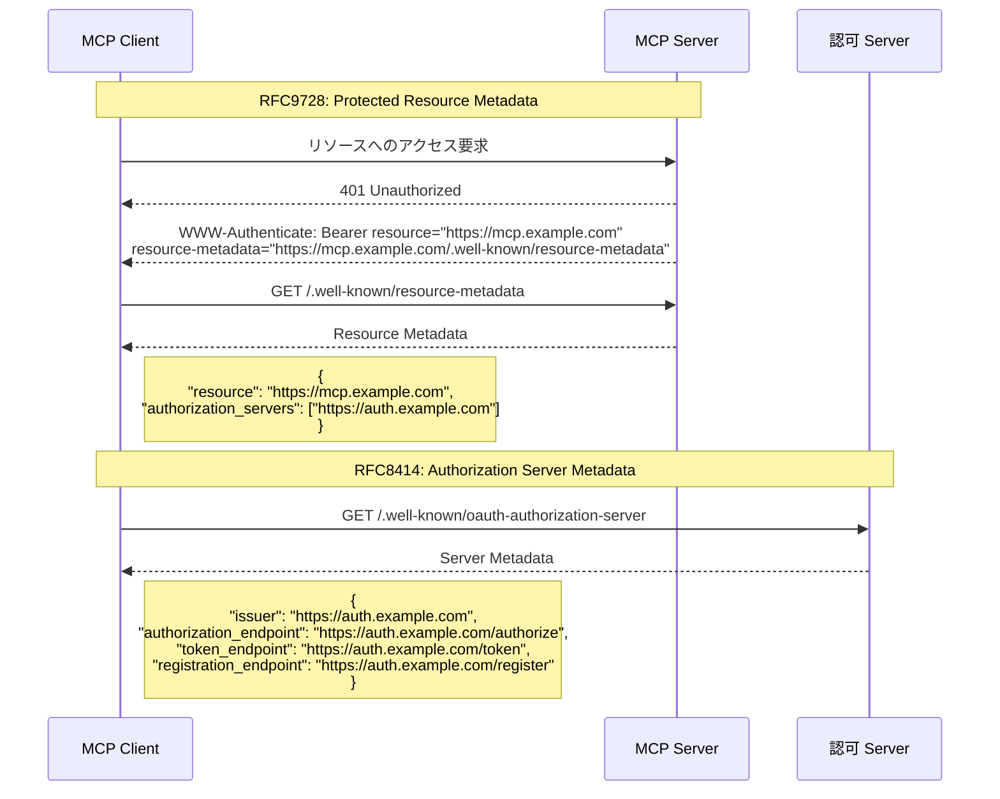
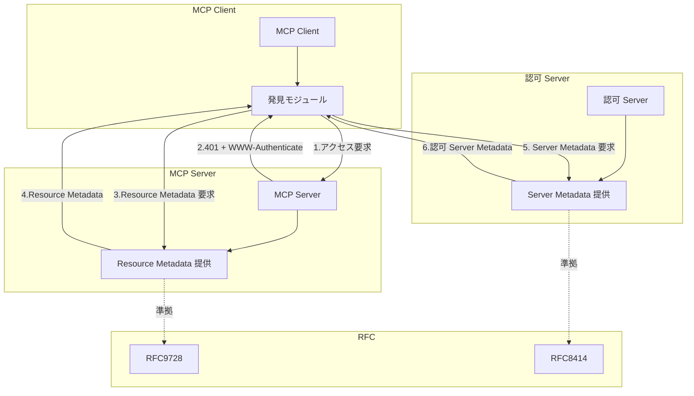
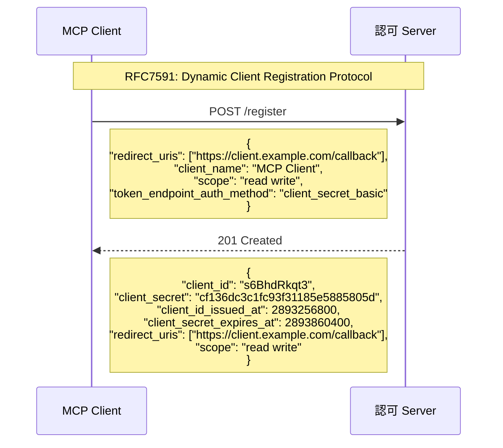
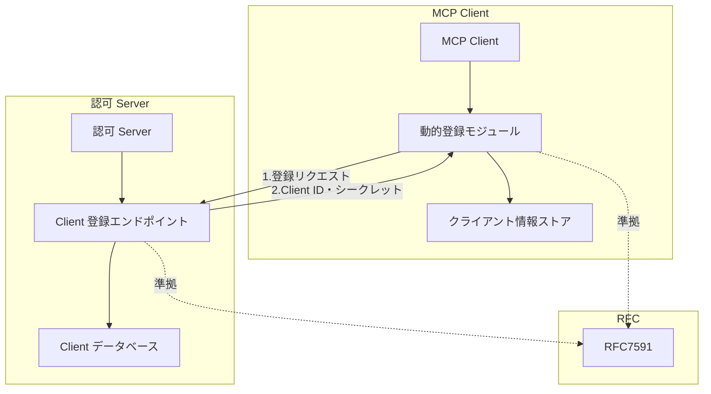
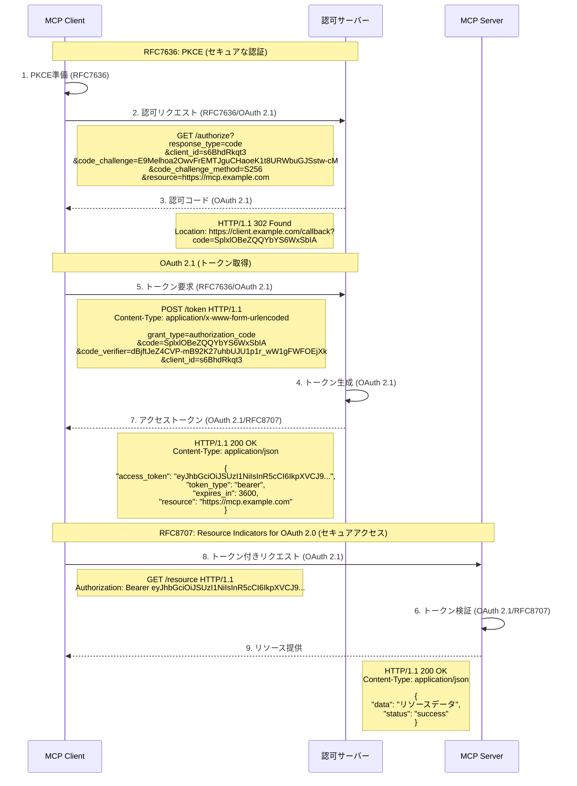
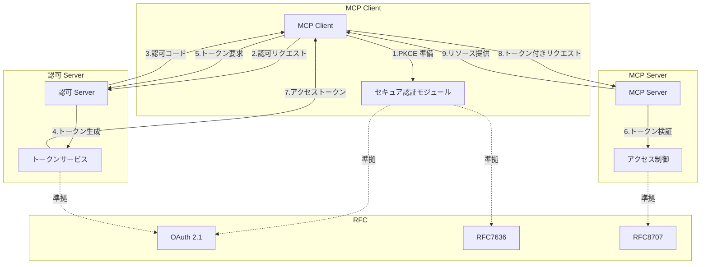

___MCP に関する発展理解編:___ _MCP の脆弱性と対策を理解するために必要な開発者向け知識の解説_

---

本章の説明は、2025-06-18 の[仕様](https://modelcontextprotocol.io/specification/2025-06-18)に基づきます。

MCP Specification: Base Protocol、**Authorization（今ここ）**、Client Features、Server Features、Security Best Practices

**本 Chapter では Authorization の実装解説をする前に MCP 仕様の Authorization について整理します。** 本 Chapter の情報は古くなる可能性があるため常に MCP 仕様を正とします。

## MCP 認証・認可の全体像

MCP の認証・認可について整理します。すでに API を提供している事業者が自社 API をツールとして登録した MCP Server を提供する場合を考えてみましょう。MCP Server の利用者視点では MCP Server に対しての認証情報提供のみを考慮すれば良いですが、MCP Server 提供者の視点では、MCP Server と自社 API 間の認証・認可の考慮が必要です。

既存 API を ID/パスワードやアクセスキー認証で提供している場合、MCP Server も引き続き同じ認証の仕組みを利用したいはずです。そして、認証情報に紐づける形で既存 API の利用できる機能を認可によって制限したいでしょう。このケースで重要なのは認証・認可が実は多層構造になっている点です。MCP Client と MCP Server、そしてバックエンド API があり、**`Client ↔︎ Server`、`Server ↔︎ API` のそれぞれの関係性で認証・認可が必要**です。MCP [仕様](https://modelcontextprotocol.io/specification/2025-06-18)では `Client ↔︎ Server` の**認可**に関する定義のみがあります。つまり **`Client ↔︎ Server` の認証、`Server ↔︎ API` については仕様の範囲外です**。

MCP 仕様では認可はオプションとなっており、Streamable HTTP のような HTTP ベースのトランスポートを使用する実装では認可の仕様への準拠は `SHOULD` となっています。STDIO の場合は環境から認証情報を取得すべきである、と記載されています。本 Chapter では仕様を列挙することが目的ではなく、何の為にその仕様があるのか、ということに焦点を当てます。多層の認証・認可については sdk 実装解説の後の具体的なアーキテクチャ設計の段階で改めて整理します。

MCP は認可メカニズムのために一から認可の仕組みを作るのではなく、確立された OAuth という標準規格に従っています。MCP の認可仕様の目的は、___MCP Client と MCP Server が事前の設定なしで安全かつ自動で接続できること___ と言えるでしょう。

MCP Client と Server の間の認証・認可を都度接続前に事前設定するような作りの場合、MCP のメリットである **USB-C のように抜き差しして手軽に利用できるプラグアンドプレイ体験**、という本質的な価値が薄れてしまいます。**本質的な価値を維持するために必要な機能を 3 つに分解**しましょう。

**機能 1/ 事前の設定なしで:** 事前設定なしで MCP Client が 認可 Server を発見し、自律的に認可プロセスを開始する、**機能 2/ 自動で:** 機能 1 で見つけた認可 Server に MCP Client が自らを自動で登録する、**機能 3/ 安全に:** MCP Client は機能 2 で取得した認証情報を使って安全に MCP Server に接続する、これら 3 つが重要な機能です。

以降で RFC 番号がいくつか出てきますが、MCP の認可仕様の目的に立ち返って考えると理解しやすいでしょう。

- OAuth 2.1 IETF ドラフト ([draft-ietf-oauth-v2-1-12](https://datatracker.ietf.org/doc/html/draft-ietf-oauth-v2-1-12)), _OAuth 2.1 はドラフト段階_
- OAuth 2.0 Authorization Server Metadata ([RFC8414](https://datatracker.ietf.org/doc/html/rfc8414))
- OAuth 2.0 Dynamic Client Registration Protocol ([RFC7591](https://datatracker.ietf.org/doc/html/rfc7591))
- OAuth 2.0 Protected Resource Metadata ([RFC9728](https://datatracker.ietf.org/doc/html/rfc9728))

### 機能 1: 事前の設定なしで

> 事前設定なしで MCP Client が 認可 Server を発見し、自律的に認可プロセスを開始する

この認可 Server 発見プロセスの要求事項を主に解決する RFC は、RFC9728 と RFC8414 です。

**RFC9728**
- **役割**: MCP Server が自身の認証・認可要件を公開する方法を定義
- **具体的な方法**: **1/** MCP Client が MCP Server に初めてアクセスした際、401 Unauthorized レスポンスと共に Resource Metadata を返す。Resource Metadata には、認可 Server の場所、必要なスコープなどの情報が含まれる、**2/** MCP Client はこの情報を基に、認証・認可プロセスを自動的に開始する。

**RFC8414**
- **役割**: 認可 Server の機能とエンドポイントを発見する方法を定義
- **具体的な方法**: **1/** RFC9728 で得た認可 Server の場所から、認可 Server の Metadata を取得する。この Metadata には、認可エンドポイント、トークンエンドポイント、登録エンドポイントなどの情報が含まれる。**2/** MCP Client はこれらのエンドポイント情報を使って、認可プロセスを進める。

> シーケンス図

> コンポーネント図

このプロセスをまとめると、RFC9728 により、MCP Client は MCP Server の認証要件と関連する認可 Server を自動的に発見でき、RFC8414 により、認可 Server の具体的なエンドポイントと機能を自動的に発見できます。MCP Client は MCP Server URL のみを知っていれば、認証・認可に必要な情報を自動的に取得できるため、認可 Server のエンドポイント URL などを事前に設定する必要がありません。

このプロセスによって MCP Client は MCP Server を発見し、認可プロセスを開始するための準備が整います。

### 機能 2. 自動で

> 機能 1 で見つけた認可 Server に MCP Client が自らを自動で登録する

この MCP Server ごとの認可 Server への MCP Client の自動登録プロセスの要求事項を主に解決する RFC は、RFC7591 です。

**RFC7591**
- **役割**: クライアントが認可サーバーに自動的に登録する方法を定義
- **具体的な方法**: **1/** MCP Client は新しい MCP Server の認可 Server に対して、自動的にクライアント登録を行える。登録プロセスで、Client ID、リダイレクト URI、スコープなどを記述したメタデータを提供、**2/** 認可 Server は MCP Client を登録し、Client ID とシークレットなどを返す。これにより、事前設定なしで新しい MCP Server との接続が可能になります。

> シーケンス図

> コンポーネント図

このプロセスをまとめると、RFC7591 により、MCP Client は機能 1 で発見した MCP Server ごとの認可 Server に自身を自動的に登録し、認可 Server から MCP Server アクセス用トークンを払い出すための認証情報を取得します。これは USB-C アナロジーのプラグアンドプレイ体験でいう**自動で接続する**、に該当します。

このプロセスによって MCP Client は MCP Server アクセスのための認証情報の準備が整います。

### 機能 3. 安全に

> MCP Client は機能 2 で取得した認証情報を使って安全に MCP Server に接続する

この MCP Server への安全な接続に関する要求事項を主に解決する RFC は、RFC7636、OAuth 2.1、RFC8707 です。

**RFC7636**
- **役割**: チャレンジ・レスポンス方式による検証を用いた**認可コード傍受攻撃からの保護**
- **具体的な方法**: **1/** 認証プロセスごとに一意のランダムな検証値(code_verifier)を作成、**/2** code_verifier をハッシュ関数して安全に送信できる形(code_challenge)に変換、**3/** 認可リクエストに code_challenge とハッシュ方式を含めて送信し、認可 Server にチャレンジを登録させる、**3/** 認可 Server から認可コード(OAuth 2.1)を安全に受け取る、**4/**  トークン交換時に元の code_verifier を認可 Server に送信し、認可 Server は受け取った code_verifier のハッシュ値と code_challenge を比較して正当な Client であることを確認

**OAuth 2.1**
- **役割**: セキュアな認可フレームワークの基盤を提供
- **具体的な方法**: **1/** Client IDと（必要に応じて）クライアントシークレットを使用して Client の身元を確認、**2/** 認可コードフロー（PKCE と組み合わせ）を使用してセキュアな認可プロセスを確立、**3/** 短い有効期限を持つアクセストークンを発行し、トークン漏洩時のリスクを最小化、**4/** トークンに必要最小限の権限のみを付与し、最小権限の原則を適用、**5/** 長期的なアクセスのためのリフレッシュトークンを発行・管理し、アクセストークンの安全な更新を可能に、**6/** HTTPS を使用し、Authorization ヘッダーでトークンを送信してトークンの傍受を防止

**RFC8707**
- **役割**: トークンの対象リソースを明示的に指定
- **具体的な方法**: **1/** 認可リクエスト時にリソースパラメータで MCP Server の URI を指定し、トークンの使用対象を限定、**2/** 必要に応じて複数のリソースパラメータを含め、複数 のMCP Server の URI を指定して一度の認可で複数サーバーへのアクセスを可能に、**3/** 認可 Server がトークンにリソース URI 情報を埋め込み、トークンの使用範囲を明確化、**4/** 指定されたリソースに関連する適切なスコープをトークンに適用し、リソースごとに適切な権限を設定、**5/** MCP Server がトークンに含まれるリソース情報を検証し、自身の URI と一致するか確認してトークンの不正転用を防止

> シーケンス図

> コンポーネント図

このプロセスをまとめると、RFC7636（PKCE）、OAuth 2.1、RFC8707 の連携により、MCP Client は認可 Server から取得した認証情報を使って、MCP Server への安全なアクセスを確立します。まず、PKCE によるチャレンジ・レスポンス方式で認可コードの傍受攻撃を防止し、OAuth 2.1 のトークンベースのアクセス制御で平文認証情報の管理を排除します。さらに、1、RFC8707 により、取得したトークンが特定の MCP Server でのみ使用可能になるよう制限されます。これは USB-C アナロジーのプラグアンドプレイ体験でいう**安全に接続する**、に該当します。

このプロセスによって、MCP Client は事前設定なしに新しい MCP Server に対して、API キーの平文保存などのセキュリティリスクを排除しつつ、安全かつ適切な権限でアクセスできるようになります。

仕様では他にも安全に終了する方法やトークンの失効についても定義されています。

## 認可 Server について

MCP 仕様において重要な点として、**Authorization Server の実装詳細は明示的に仕様の範囲外**とされています。MCP 仕様の範疇では認可 Server に対する実装方法を限定せずに既存の OAuth 2.1 準拠の認可 Server を活用できるようにすることで、既存のエコシステムと柔軟に連携できることを目指しているのでしょう。再度繰り返しますが、MCP 仕様が定義しているのは `Client ↔︎ Server` 間の**認可**に関する部分のみであり、`Client ↔︎ Server` 間の認証や `Server ↔︎ API` 間の認証・認可については、各実装者が適切なセキュリティプラクティスに従って設計・実装する必要があります。

これにより、MCP は認証・認可の実装詳細を規定せずに、USB-C のようなプラグアンドプレイ体験を実現しつつ、セキュリティ要件も満たしています。

## まとめ

以下にそれぞれの RFC を実装する場合、実装しない場合、の比較と、他の RFC への依存関係、をわかりやすくまとめてみましたので参考にしてください。MCP の認可仕様の目的が、___MCP Client と MCP Server が事前の設定なしで安全かつ自動で接続できること___ というのが全体のフローを 3 つの機能に分解して確認することで理解しやすくなったのではないでしょうか。MCP 公式仕様が本 Chapter で少しでも読みやすくなれば幸いです。

| RFC | 実装する場合 | 実装しない場合 | 他の RFC への依存 |
|-----|---------|---------|--------------|
| ___MUST:___ **RFC9728** (Protected Resource Metadata) | **1/** MCP Server が認可要件を自動的に公開、**2/** MCP Client が認可 Server の場所を自動発見、**3/** 標準化されたメタデータ形式で相互運用性確保 | **1/** 認可 Server の場所を手動設定が必要、**2/** MCP Server ごとに異なる発見方法への対応が必要、**3/** 設定ファイルの複雑化 | **1/** RFC8414 と連携して完全な発見プロセスを実現 |
| ___MUST:___ **RFC8414** (Authorization Server Metadata) | **1/** 認可 Server のエンドポイントを自動発見、**2/** 認可 Server の機能を自動検出、**3/** 異なる認可 Server 間の違いを吸収 | **1/** 認可エンドポイント、トークンエンドポイントなどを手動設定、**2/** 認可 Server の機能を事前に把握する必要あり、**3/** 認可 Server の変更時に設定更新が必要 | **1/** RFC9728 から認可 Server の場所情報を受け取る、**2/** RFC7591 の登録エンドポイント情報を提供 |
| ___SHOULD:___ **RFC7591** (Dynamic Client Registration) | **1/** MCP Client が認可 Server に自動登録、**2/** Client ID とシークレットを動的に取得、**3/** 新しい MCP Server に設定変更なしで対応可能 | **1/** 各認可 Server に手動で Client 登録が必要、**2/** Client ID とシークレットを設定ファイルに保存、**3/** 新しい MCP Server 追加時に管理者の介入が必要 | **1/** RFC8414 から登録エンドポイント情報を取得、**2/** OAuth 2.1 / 2.0 の認証フローで使用する Client ID を提供 |
| ___MUST:___ **OAuth 2.1** (OAuth 2.1 Authorization Framework) | **1/** トークンベースの安全なアクセス制御、**2/** 短命のアクセストークンによるリスク軽減、**3/** 一貫したセキュリティモデル | **1/** API キーなどの平文認証情報を使用、**2/** 認証情報の長期利用による漏洩リスク、**3/** セキュリティモデルの一貫性欠如 | **1/** RFC7636(PKCE) を必須化、**2/** RFC8707 と連携してリソース固有のトークンを発行、**3/** RFC7591 から取得した Client ID を使用 |
| ___MUST:___ **RFC7636** (PKCE) | **1/** 認可コード傍受攻撃からの保護、**2/** 公開 Client でも安全に認証可能、**3/** チャレンジ・レスポンス方式による検証 | **1/** 認可コード傍受攻撃に脆弱、**2/** 公開 Client のセキュリティリスク増大、**3/** モバイルアプリや SPA などで特に危険 | **1/** OAuth 2.1/2.0 の認可コードフローと組み合わせて使用、**2/** RFC7591 で登録した Client ID を使用 |
| ___MUST:___ **RFC8707** (Resource Indicators) | **1/** トークンの使用範囲を特定の MCP Server に限定、**2/** 混同代理問題の対策、**3/** リソース固有のスコープ適用 | **1/** トークンが複数のリソースで使用可能、**2/** 混同代理攻撃のリスク、**3/** トークンの不正転用の可能性 | **1/** OAuth 2.1/2.0 のトークン発行プロセスと統合、**2/** RFC9728 で特定したリソース URI を使用 |

## SaaS コラム

本書では **SaaS コラム** で本文内容を補足する SaaS に関する解説を行います。

今回は SaaS に関する解説はありません。