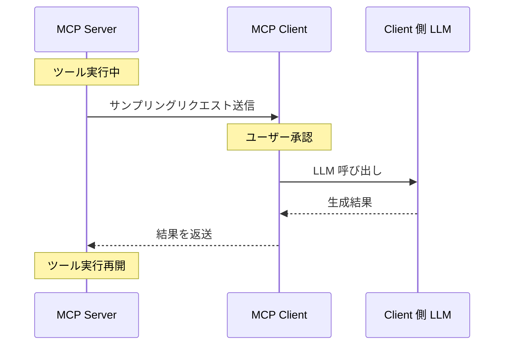

___MCP に関する発展理解編:___  _MCP の脆弱性と対策を理解するために必要な開発者向け知識の解説_

---

本章の説明は、2025-06-18 の[仕様](https://modelcontextprotocol.io/specification/2025-06-18)に基づきます。

MCP Specification: Base Protocol、Authorization、**Client Features、Server Features（今ここ）**、Security Best Practices

本 Chapter では Streamable HTTP の typescript-sdk(tag: 1.13.2) の [Client 実装](https://github.com/modelcontextprotocol/typescript-sdk/blob/1.13.2/src/client/streamableHttp.ts) と [Server 実装](https://github.com/modelcontextprotocol/typescript-sdk/blob/1.13.2/src/server/streamableHttp.ts) について解説します。**本 Chapter では  MCP Client と MCP Server の機能について主に解説します。**

Client と Server は事前にお互いに宣言した機能のみを利用することができ、`listChanged` で変更があった際に通知するか否かを指定できます。
この Chapter は機能の詳細なので利用が必要になった時に仕様と合わせて確認するのが良いでしょう。機能ごとに淡々と説明しているため読んでいて眠くなると思います。

> MCP コンポーネント図の再掲


## MCP Server 機能概要

MCP 仕様に基づいて、Server が提供する 3 つの主要機能の要点をおさらいしましょう。

### Tools

Tools は LLM が文脈理解に基づいて自動的にツールを発見・呼び出し可能です。ただしセキュリティ観点から常に Human in the loop が推奨されます。

- プロトコルメッセージ
  - `tools/list`: 利用可能な Tools のリストを取得（ページネーションをサポート）
  - `tools/call`: 指定された引数で Tools を呼び出す
  - `notifications/tools/list_changed`: Tools リストが変更されたときの通知

> サンプル

https://github.com/modelcontextprotocol/typescript-sdk/blob/1.13.2/src/examples/server/mcpServerOutputSchema.ts#L18-L39

このサンプルは、MCP Server に ___get_weather___ という天気情報取得ツールを定義しています。

- **ツール名**: "get_weather" - LLM がこのツールを呼び出す際に使用する識別子
- **説明**: "Get weather information for a city" - このツールの機能を簡潔に説明
- **入力スキーマ**:
  - ツールが正しく動作するために必要な入力パラメータを定義
  - city: 文字列型で、都市名を指定するパラメータ
  - country: 文字列型で、国コード（例：US, UK）を指定するパラメータ
- **出力スキーマ**:
  - このツールが返すデータの構造と型を厳密に定義
  - temperature: 温度情報を含むオブジェクト
  - celsius: 摂氏温度（数値）...


### Resources

Resources はホストアプリケーションがニーズに基づいてコンテキストを組み込む方法を決定します。

Resources は MCP の基本的なプリミティブの 1 つです。Tools が ___実行する（doing）___ ためのものであるのに対し、Resources は ___知識（knowledge）___ に関するものであり、副作用を引き起こさずに LLM が推論するためのコンテキストデータを提供します。

Resources は読み取り専用のインターフェースであり、構造化されたコンテキスト情報としてデータを公開します。

Resources は以下のような様々な種類の情報を表現できます。

**Resources のタイプ**

Resources には 2 つの異なるタイプがあります。

1. **テキストリソース**：UTF-8 でエンコードされたテキストデータを含み、以下のようなものに適しています。
   - ソースコードファイル
   - 設定ファイル
   - ログファイル
   - JSON/XML データ
   - プレーンテキストドキュメント

2. **バイナリリソース**：base64 でエンコードされた生のバイナリデータを含み、以下のようなものに適しています。
   - 画像やグラフィック
   - PDF ドキュメント
   - 音声・動画ファイル

**リソース検出メカニズム**

MCP はリソース検出のための2つの補完的なアプローチを提供しています。

1. **直接リソース**：MCP Server が `resources/list` エンドポイントを通じて具体的なリソースを公開するメカニズムです。URI、人間が読める名前、オプションの説明、MIME タイプ、サイズ情報などのメタデータも提供します。

2. **リソーステンプレート**：動的コンテンツのために、Server は RFC 6570 標準に従った `file://{path}` のような URI テンプレートを公開できます。リソーステンプレートは、スケーラブルな実装に強力です。個々のファイルを何千も登録する代わりに、Server はリソースの全ファミリーをカバーする単一のテンプレートを公開でき、複雑さを大幅に削減しながら完全な機能を維持できます。

**アプリケーション制御のアクセスパターン**

MCP Resources の重要な側面は、アプリケーション制御のアクセスパターンです。Tools のようなモデル制御のプリミティブとは異なり、Resources は Client 側の明示的な管理を必要とします。

Tools が呼び出されると、LLM は必要なツール呼び出しを返します。Client は、ユーザーの許可を得た後、MCP サーバーに存在するツールを呼び出し、応答を受け取ります。これはモデルが制御しており、モデルが何を呼び出すかを決定することを示しています。

しかし Resources では、Client アプリケーションは LLM に提供する前に Resources からデータを明示的に取得・管理する必要があり、LLM 自体はアクションを開始しません。これは、Resources に関してはアプリケーションが主導権を握っていることを示しています。

- プロトコルメッセージ
  - `resources/list`: 利用可能な Resources のリストを取得
  - `resources/read`: Resources の内容を取得
  - `resources/templates/list`: パラメータ化された Resources テンプレートを取得
  - `notifications/resources/list_changed`: Resources リストが変更されたときの通知
  - `resources/subscribe`: 特定の Resources の変更を購読（オプション）
  - `notifications/resources/updated`: Resources が更新されたときの通知（オプション）

> サンプル

https://github.com/modelcontextprotocol/typescript-sdk/blob/1.13.2/src/examples/server/simpleStreamableHttp.ts#L308-L326

このサンプルは、MCP Server に ___greeting-resource___ という Resources を定義しています。この定義は、LLM が参照できる静的なコンテンツを提供するためのものです。Tools は特定の機能を実行し、入力に基づいて動的な結果を返しますが、Resources は主に静的コンテンツを提供し、通常は入力パラメータを受け取りません。Resources は LLM が参照コンテンツを提供しますが、直接 LLM への指示とはなりません。プロンプトは LLM への指示を構造化します。

- **リソース名**: 'greeting-resource' - このリソースを識別するための名前
- **URI**: 'https://example.com/greetings/default' - このリソースの一意の識別子として使用される URI。実際のウェブアドレスである必要はなく、リソースを識別するための論理的な ID として機能。
- **メタデータ**:
  - title: 'Default Greeting' - UIに表示される名前
  - description: 'A simple greeting resource' - このリソースの目的を説明
  - mimeType: 'text/plain' - リソースのコンテンツタイプを指定

### Prompts

Prompts により Client は利用可能なプロンプトを検索し、その内容を取得し、引数を指定してカスタマイズすることができます。

- プロトコルメッセージ
  - `prompts/list`: 利用可能な Prompts のリストを取得
  - `prompts/get`: 指定された引数で特定の Prompts を取得
  - `notifications/prompts/list_changed`: Prompts リストが変更されたときの通知

> サンプル

https://github.com/modelcontextprotocol/typescript-sdk/blob/1.13.2/src/examples/server/simpleStreamableHttp.ts#L242-L264

このサンプルは MCP Server に ___greeting-template___ というプロンプトテンプレートを定義しています。このプロンプト定義は、LLM が特定のパラメータを使って構造化された挨拶メッセージを生成するためのテンプレートを提供します。

- **プロンプト名**: 'greeting-template' - このプロンプトテンプレートを識別するための名前
- **メタデータ**:
  - title: 'Greeting Template' - UIに表示される名前
  - description: 'A simple greeting prompt template' - このプロンプトテンプレートの目的を説明
  - 引数スキーマ (argsSchema):
    - name: 文字列型で、挨拶に含める名前を指定するパラメータ

## MCP Client 機能概要

MCP 仕様に基づいて、Client が提供する 3 つの主要機能をおさらいしましょう。Sampling と Eliciation については厳密には、Server が Client に依頼できる機能（Client 側で実装が必要な機能）です。

### Roots

Roots は Client が Server にファイルシステムの操作可能な範囲を定義するための標準化された方法を提供します。これにより、Server はどのディレクトリやファイルにアクセスできるかを理解できます。

- プロトコルメッセージ
  - `roots/list`: Server が Client からルートのリストを取得するリクエスト
  - `notifications/roots/list_changed`: ルートリストが変更されたときの通知

### Sampling

Sampling は、Server からの LLM 利用リクエストを処理し、ユーザー承認を管理する機能です。この機能により、Server は Client のモデルアクセス、選択、権限を維持しながら LLM を活用できます。

Sampling は MCP の最も強力な機能の一つで、通常の Client → Server の関係を逆転させる双方向アーキテクチャを実現します。一般的な MCP の設定では、Client が Server の機能（ツール）、データ（リソース）、プロンプトを利用しますが、Sampling では Server 自体が LLM の知能を活用する必要がある場合に、Client 側の LLM に処理を依頼することができます。

Sampling には以下のような利点があります。

1. **スケーラビリティ**: Server は計算負荷の高い推論処理を回避できます。Server は大量のテキスト生成自体に負担をかけることなく、より多くの同時リクエストを処理できます。各 Client が基本的に自身の LLM タスクを処理します。

2. **コスト効率**: LLM 関連の API コストや計算負荷は Client 側が負担します。有料 API を使用する場合、サーバー所有者ではなく Client のアカウントに課金されます。これによりコストがユーザー間で分散され、Server 所有者は高価なインフラストラクチャを維持する必要がなくなります。

3. **LLM 選択の柔軟性**: Client は特定のリクエストに使用するモデルを選択できます。ある Client は Anthropic の Claude Sonnet 4 を使用し、別のクライアントはオープンソースモデルを使用することができ、Server は全く変更する必要がありません。Server はモデルの好みを提案することもできますが、最終的には Client が実行を制御します。

4. **ボトルネック回避**: 従来の設定では、Server がすべての AI 生成を処理する必要がある場合、ボトルネックになる可能性があります。Sampling では、各ユーザーの環境が自分のリクエストを処理するため、Server 側での処理キューの蓄積を防ぎます。

**Sampling のアーキテクチャと実装フロー**

Sampling は MCP プロトコルで特別なタイプのメッセージとしてサポートされており、サーバーからクライアントへの LLM 処理の依頼を可能にします。

Sampling の基本的なフローを以下のシーケンス図で示します：



1. **Server 側**: ツール実行中に LLM の処理が必要になると、サンプリングリクエストを Client に送信します
2. **Client 側**: リクエストを受け取り、ユーザーの承認を得た後、自身が利用できる LLM を呼び出します
3. **LLM**: テキスト生成を行い、結果を Client に返します
4. **Client 側**: 生成結果を Server に返送します
5. **Server 側**: 結果を受け取り、ツール実行を再開します

このプロセス全体は非同期で行われ、他のタスクをブロックすることなく効率的に処理されます。

- プロトコルメッセージ
  - `sampling/createMessage`: Server が Client に対して LLM サンプリングのためのメッセージ作成をリクエストするメソッド。プロンプト、モデル設定、サンプリングパラメータなどを含み、ユーザー承認を経て LLM からの応答を取得する

### Elicitation

Elicitation は、 Server からの情報収集リクエストを処理し、ユーザーからの入力を管理する機能です。この機能により、Server はユーザーから構造化されたデータを収集するためのフォームを Client に表示させることができます。

- プロトコルメッセージ
  - `elicitation/create`: Server が Client を通じてユーザーから構造化データを収集するためのリクエスト。入力スキーマ、説明、タイトルなどを含み、ユーザーからの入力を検証して返す

> サンプル

https://github.com/modelcontextprotocol/typescript-sdk/blob/1.13.2/src/examples/server/simpleStreamableHttp.ts#L97-L192

このサンプルは、MCP Server に ___collect-user-info___ というツールを定義しています。このツールは Elicitation 機能を使用してユーザーから情報を収集します。

- **ツール名**: "collect-user-info" - LLM がこのツールを呼び出す際に使用する識別子
- **説明**: "A tool that collects user information through elicitation" - このツールの機能を簡潔に説明
- **入力パラメータ**:
  - infoType: 収集する情報の種類を指定するパラメータ（'contact'、'preferences'、'feedback'のいずれか）
- **処理内容**:
  1. 指定された情報タイプに基づいて、メッセージとスキーマを構築
  2. `server.server.elicitInput()` メソッドを呼び出してユーザー入力を要求
  3. ユーザーの応答（accept、reject、cancel）に基づいて結果を返す

## MCP Server 機能の実装詳細

まずは 3 つの機能で共通の実装箇所について確認しましょう。

**ストレージ**

すべての機能は、登録されたアイテムを保存するためのプライベートコレクションを使用します。

https://github.com/modelcontextprotocol/typescript-sdk/blob/1.13.2/src/server/mcp.ts#L55-L66

**変更通知**

すべての機能は、`listChanged` 通知メカニズムを実装しています。

https://github.com/modelcontextprotocol/typescript-sdk/blob/1.13.2/src/server/mcp.ts#L1050-L1054
https://github.com/modelcontextprotocol/typescript-sdk/blob/c6ac083b1b37b222b5bfba5563822daa5d03372e/src/server/index.ts#L379-L381

**機能管理**

すべての登録されたアイテムは、`enables: true` などの同様の管理メソッドを提供します。これらは機能の状態を動的に制御するためのメソッドであり、これらのメソッドによって Server 実行中に機能の有効化や更新などが可能になります。

https://github.com/modelcontextprotocol/typescript-sdk/blob/c6ac083b1b37b222b5bfba5563822daa5d03372e/src/server/mcp.ts#L768-L792

**機能アサーションと検証**

Server の実装には、機能が適切に宣言されていることを確認するための機能アサーションが含まれています。これは宣言外の機能が使用されることを防止するために重要です。

https://github.com/modelcontextprotocol/typescript-sdk/blob/c6ac083b1b37b222b5bfba5563822daa5d03372e/src/server/index.ts#L207
https://github.com/modelcontextprotocol/typescript-sdk/blob/c6ac083b1b37b222b5bfba5563822daa5d03372e/src/server/index.ts#L244-L250

https://github.com/modelcontextprotocol/typescript-sdk/blob/c6ac083b1b37b222b5bfba5563822daa5d03372e/src/server/index.ts#L160
https://github.com/modelcontextprotocol/typescript-sdk/blob/c6ac083b1b37b222b5bfba5563822daa5d03372e/src/server/index.ts#L181-L186

### Tools

**入出力のスキーマ検証**

Tools は入力引数と出力結果の両方をスキーマに対して検証します。

https://github.com/modelcontextprotocol/typescript-sdk/blob/1.13.2/src/server/mcp.ts#L160-L169
https://github.com/modelcontextprotocol/typescript-sdk/blob/1.13.2/src/server/mcp.ts#L203-L221

**アノテーション**

Tools は `readOnlyHint`、`destructiveHint` などのアノテーションをサポートします。これらのアノテーションは、ツールの動作特性や安全性に関する重要なメタデータを提供します。これらは ___ヒント___ として機能し、Client がツールをどのように扱うべきかを理解するのに役立ちます。

例えば、`readOnlyHint` はツールが読み取り専用操作であり、データの変更を行わないことを示します。ただしアノテーションはヒントであり、保証ではないためセキュリティ上の決定に単独で使用すべきではなく、ユーザーの権限や設定に基づいて最終的な判断を行わなければなりません。

https://github.com/modelcontextprotocol/typescript-sdk/blob/c6ac083b1b37b222b5bfba5563822daa5d03372e/src/types.ts#L844
https://github.com/modelcontextprotocol/typescript-sdk/blob/c6ac083b1b37b222b5bfba5563822daa5d03372e/src/types.ts#L854

### Resources

**URI テンプレート**

Resources は URI テンプレートという機能を持っています。

例えば `https://example.com/users/{userId}` というテンプレートを設定します。これに対して実際の URI が `https://example.com/users/123` だった場合は、変数として `{ userId: "123" }` が抽出されます。抽出した変数に基づいて、適切なリソース内容を生成するような使い方ができます。

https://github.com/modelcontextprotocol/typescript-sdk/blob/1.13.2/src/server/mcp.ts#L422-L431

### Prompts

**引数検証**

Prompts ではプロンプト引数のスキーマに対する検証を行います。

https://github.com/modelcontextprotocol/typescript-sdk/blob/1.13.2/src/server/mcp.ts#L503-L512

### 初期化フロー

MCP Server の初期化フローは、以下のステップで構成されます。

**1. Server インスタンスの作成**

Server の初期化は、`Server` クラスまたは` McpServer` クラスのインスタンスを作成で始まり、Server の名前、バージョン、Capabilities 宣言、などを指定します。

https://github.com/modelcontextprotocol/typescript-sdk/blob/1.13.2/src/server/streamableHttp.test.ts#L83-L86

Server の Capabilities は、初期化時に宣言するか、後から `registerCapabilities` メソッドを使用して登録できます。接続後に機能を追加しようとすると例外が発生します。

https://github.com/modelcontextprotocol/typescript-sdk/blob/1.13.2/src/server/index.ts#L118-L126

一例として Tools の宣言を示します。

https://github.com/modelcontextprotocol/typescript-sdk/blob/1.13.2/src/server/streamableHttp.test.ts#L88-L95

**2. Transport への接続**

Server は Client との通信を確立するために Transport に接続します。

https://github.com/modelcontextprotocol/typescript-sdk/blob/1.13.2/src/server/streamableHttp.test.ts#L97-L103

**3. Client との初期化ハンドシェイク**

Server 側の初期化ハンドラで互換性のあるプロトコルを決定し初期化結果を返却します。

https://github.com/modelcontextprotocol/typescript-sdk/blob/1.13.2/src/server/index.ts#L105-L107
https://github.com/modelcontextprotocol/typescript-sdk/blob/1.13.2/src/server/index.ts#L260-L277

Client 側からの initiaize リクエストによって機能とバージョンの互換性の確認等を行ないます。

## MCP Client 機能の実装詳細

まずは 3 つの機能で共通の実装箇所について確認しましょう。

**機能アサーションと検証**

Client の実装にも、機能が適切に宣言されていることを確認するための機能アサーションが含まれています。

https://github.com/modelcontextprotocol/typescript-sdk/blob/1.13.2/src/client/index.ts#L300-L307

### Roots

Roots 機能は、Server からのファイルシステム操作リクエストに対して、指定されたパスが許可されたルートディレクトリ内にあるかを検証します。

Client はルートリストが変更されたときに Server に通知できます。

https://github.com/modelcontextprotocol/typescript-sdk/blob/1.13.2/src/client/index.ts#L516-L518

Server 側は Client からルートのリストを要求できます。

https://github.com/modelcontextprotocol/typescript-sdk/blob/1.13.2/src/server/index.ts#L351-L360

Roots 機能は、アクセス可能なディレクトリのリストを管理し、Server からのリクエストに応じて提供します。

### Sampling

Sampling 機能は、Client 側と Server 側の両方に実装があります。

**Client 実装**

Client 側では、`sampling/createMessage` リクエストを処理するためのハンドラを設定します。

https://github.com/modelcontextprotocol/typescript-sdk/blob/1.13.2/src/client/index.test.ts#L584-L593

Client は、`assertRequestHandlerCapability` メソッドで `sampling/createMessage` リクエストをサポートしているかどうかを確認します：

**Server 実装**

Server 側では、`createMessage` メソッドを提供して、Client に Sampling リクエストを送信します(v1.15.1 でサンプル実装追加)

https://github.com/modelcontextprotocol/typescript-sdk/blob/1.15.1/src/examples/server/toolWithSampleServer.ts#L22-L45

**モデル選択の仕組み**

MCP では、Server からは Client がどのモデルに対応しているかは統制を取ることができないため LLM モデル選択に抽象化が必要です。Server は以下の方法でモデル選択の設定を指定できます。

https://github.com/modelcontextprotocol/typescript-sdk/blob/1.13.2/src/types.ts#L1068-L1079

1. **機能の優先度**: 3つの正規化された優先度値（0-1）を使用
   - `costPriority`: コスト最小化の重要度（高い値は安価なモデルを優先）
   - `speedPriority`: 低レイテンシーの重要度（高い値は高速なモデルを優先）
   - `intelligencePriority`: 高度な機能の重要度（高い値は高性能なモデルを優先）

2. **モデルヒント**: 特定のモデルまたはモデルファミリーを提案
   - ヒントはモデル名に柔軟に一致するサブ文字列として扱われる
   - 複数のヒントは優先順位に従って評価される
   - Client は異なるプロバイダーの同等のモデルにヒントをマッピングできる

> 一例

```typescript
{
  "hints": [
    { "name": "claude-3-7-sonnet" }, // Sonnet クラスのモデルを優先
    { "name": "claude" }           // 任意の Claude モデルにフォールバック
  ],
  "costPriority": 0.3,            // コストはあまり重要ではない
  "speedPriority": 0.8,           // 速度は非常に重要
  "intelligencePriority": 0.5     // 中程度の能力が必要
}
```

Client はこれらの設定を処理して、利用可能なオプションから適切なモデルを選択します。

**Sampling フロー**

モデル選択と LLM 呼び出しは、実際の実装ではホストアプリケーション側で行われることが多いため、SDK には具体的な実装がありません。

1: Server は `createMessage` メソッドを呼び出して、Client に LLM のサンプリングを要求します。

https://github.com/modelcontextprotocol/typescript-sdk/blob/1.13.2/src/server/index.ts#L302-L311

2: Client は `sampling/createMessage` リクエストを受け取り、ユーザーに承認を求めます。

3: ユーザーが承認すると、Client はモデル選択の設定に基づいて適切なモデルを選択します。

4: Client は LLM を使用してテキスト、画像、または音声を生成します。

5: Client は生成された結果を Server に返します。

**セキュリティ考慮事項**

Sampling 機能を実装する際には、セキュリティ上の考慮事項に注意する必要があります。**1/ ユーザー承認**: Client は常にユーザー承認コントロールを実装すべき、**コンテンツ検証**: Client/Server ともにメッセージの内容を検証すべき、**3/ レート制限**: Client はレート制限を実装して過剰な使用を防ぐべき、**4/ 機密データ処理**: Client/Server は機密データを適切に処理すべき、です。

### Elicitation

Elicitation 機能は、Server からのユーザー入力要求を処理し、構造化されたデータを収集するための重要な機能です。ここでは、その実装詳細について説明します。

**リクエスト構造**

Elicitation リクエストは、以下の構造を持ちます。

https://github.com/modelcontextprotocol/typescript-sdk/blob/1.13.2/src/types.ts#L1210-L1232

https://github.com/modelcontextprotocol/typescript-sdk/blob/1.13.2/src/types.ts#L1203-L1208

`PrimitiveSchemaDefinition` は 4 種類の型を持ちます。

**Client 実装**

Client 側では、`elicitation/create` リクエストを処理するハンドラを実装します。

https://github.com/modelcontextprotocol/typescript-sdk/blob/1.13.2/src/client/index.test.ts#L614-L623

**Server 実装**

Server 側では、`elicitInput` メソッドを使用して Client にユーザー入力を要求します。

https://github.com/modelcontextprotocol/typescript-sdk/blob/af61a086ae4346a844e4359679404e42361e724d/src/examples/server/simpleStreamableHttp.ts#L195-L210

このメソッドは以下の処理を行います。

1. Client に `elicitation/create` リクエストを送信
2. Client からの応答を待機
3. 応答の `action` が "accept" の場合、`content` を要求されたスキーマに対して検証
4. 検証に成功した場合、結果を返す

**セキュリティ上の考慮事項**

Elicitation 機能を実装する際には、以下のセキュリティ上の考慮事項に注意する必要があります。

**1/ 入力検証**: ユーザー入力は常にスキーマに対して厳密に検証し、不正な入力を拒否、**2/ 機密情報の扱い**: パスワードなどの機密情報を収集する場合は、適切なセキュリティ対策、**3/ ユーザー承認**: ユーザーが入力を拒否またはキャンセル、**4/ スキーマ検証**: Server から送信されたスキーマ自体も検証し、不正なスキーマを拒否、などを行いましょう。

Elicitation 機能は、Server がユーザーから構造化されたデータを収集するための強力なメカニズムを提供します。適切に実装することで、ユーザーとのインタラクションを向上させ、より豊かな機能を実現することができます。

## まとめ

Server と Client の機能について確認しました。利用する際のセキュリティの考慮事項を大別すると、1/ 入力の検証と制限、2/ ユーザー承認、3/ 機密データの保護、4/ 機能宣言、があります。

1/ 全体を通して入出力の厳格な検証が最も重要なセキュリティ対策です。Tools やE licitation での入力スキーマ検証、Prompts での引数検証、Roots でのパス検証など、すべての機能で不正な入力を防ぐ仕組みが実装されています。特に Server 側からのリクエストや Client 側からの応答は、必ず定義されたスキーマに対して検証され、不正なデータは拒否されています。2/ Sampling や Elicitation などの機能では、ユーザー承認が重要な安全機構として機能します。LLM の利用やユーザー情報の収集といった重要な操作は、必ずユーザーの明示的な承認を経て実行されるべきです。これにより、ユーザーは常に処理の流れを制御でき、意図しない操作を防止できます。3/ SamplingやElicitationでは機密データの適切な処理が求められます。4/ 接続前の機能宣言と接続後の機能追加禁止により後から不正に機能を利用することを防止します。

これらのセキュリティ考慮事項は相互に関連しており、アプリケーションレイヤ以外の対策も含めて総合的に実装することで MCP の安全な運用が可能になります。LLM の能力を安全に活用するためには、これらのセキュリティ対策を適切に実装することが不可欠です。
