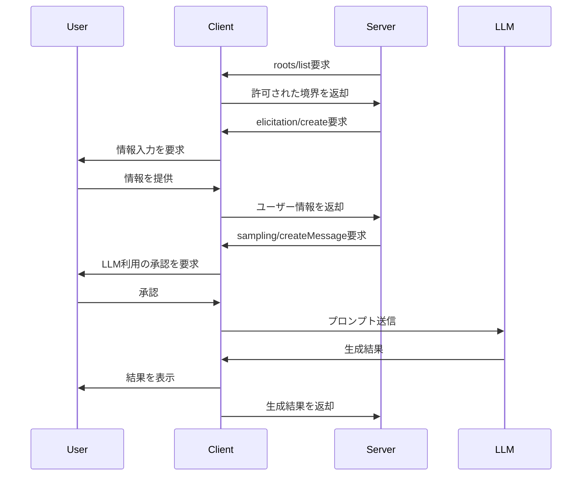
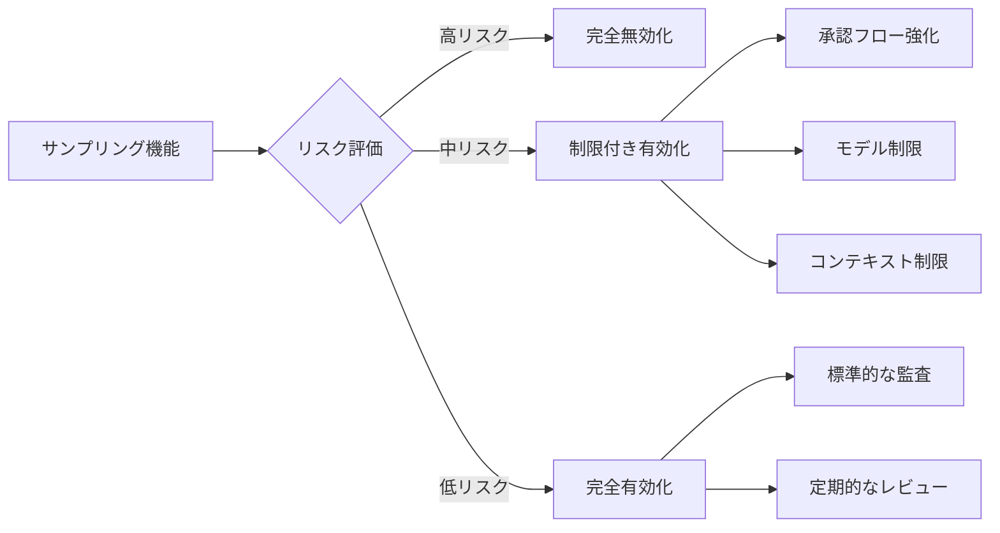
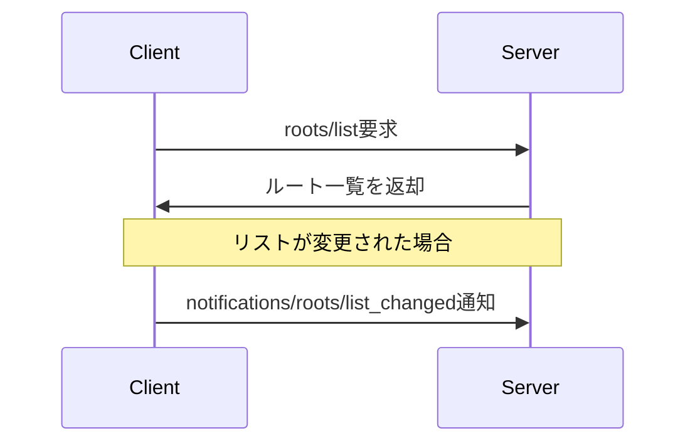
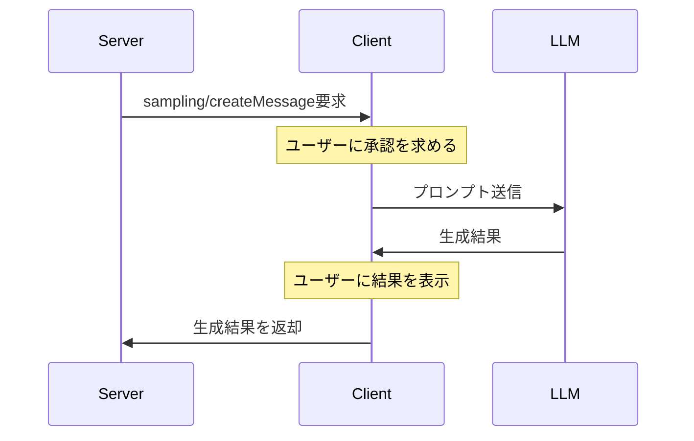
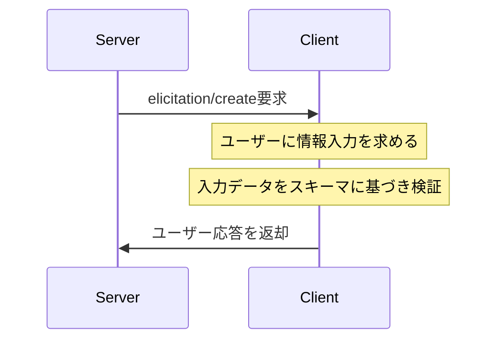

___MCP に関する発展理解編:___  _MCP の脆弱性と対策を理解するために必要な開発者向け知識の解説_

---

本章の説明は、2025-06-18 の[仕様](https://modelcontextprotocol.io/specification/2025-06-18)に基づきます。

MCP Specification: Base Protocol、Authorization、**Client Features、Server Features（今ここ）**、Security Best Practices

本 Chapter では MCP Client と MCP Server の機能を詳細に解説します。

## MCP Client 機能概要


1. **Roots（境界定義）**
   - **役割**: サーバーの操作範囲を明確に制限
   - **セキュリティ的位置づけ**: 防御の第一線（境界の明示的定義）
   - **他機能との関係**: 他の全機能の基盤となる安全領域を確立

2. **Sampling（AI機能利用）**
   - **役割**: サーバーがクライアント経由でLLM機能を利用
   - **セキュリティ的位置づけ**: 最も高いリスク要因（外部実行）
   - **他機能との関係**: Rootsで定義された境界内でのみ動作すべき

3. **Elicitation（情報収集）**
   - **役割**: サーバーがユーザーから構造化データを収集
   - **セキュリティ的位置づけ**: 中程度のリスク（情報漏洩の可能性）
   - **他機能との関係**: 収集した情報がSamplingの入力になる可能性

## 2. 具体的なユースケースと実装パターン

### 統合ユースケース

1. **インテリジェントなコード補完と分析**
   - **Roots**: プロジェクトディレクトリの境界を定義
   - **Sampling**: コード分析と改善提案をLLMに依頼
   - **Elicitation**: 開発者の意図や追加情報を収集

2. **セキュアなデータ処理パイプライン**
   - **Roots**: データアクセス可能な領域を厳格に制限
   - **Sampling**: データ変換や分析をLLMに依頼
   - **Elicitation**: 処理パラメータや設定をユーザーから収集

3. **マルチステップのAIアシスタント**
   - **Roots**: ユーザーデータへのアクセス境界を設定
   - **Sampling**: 複雑な質問応答や推論をLLMに依頼
   - **Elicitation**: 追加情報や明確化をユーザーから収集

### 実装パターン



## 3. サンプリング機能のセキュリティ強化

### リスク分析

| リスク | 説明 | 影響度 |
|-------|------|-------|
| プロンプトインジェクション | 悪意あるサーバーが危険なプロンプトを送信 | 高 |
| データ漏洩 | センシティブ情報がLLMに送信される | 高 |
| リソース消費 | 過剰なAPI呼び出しによるコスト増加 | 中 |
| 不適切な出力 | 有害なコンテンツの生成 | 中 |

### セキュリティ強化策

1. **多層防御アプローチ**
   - **プロンプト検査**: すべてのプロンプトを送信前に検査
   - **コンテンツフィルタリング**: 生成結果の自動スキャン
   - **ユーザー承認**: すべてのサンプリング要求に明示的承認を要求
   - **監査ログ**: すべてのサンプリング要求と結果を記録

2. **技術的対策**
   - **サンドボックス化**: サンプリング機能を分離環境で実行
   - **レート制限**: サーバーごとの要求数を制限
   - **コンテキスト制限**: 送信可能な情報量を制限
   - **モデル選択制御**: 使用可能なモデルを制限

3. **ポリシーベースの制御**
   - **サーバー認証**: 信頼できるサーバーのみサンプリングを許可
   - **機能制限**: 特定のサーバーに特定の機能のみ許可
   - **データポリシー**: センシティブデータの送信を禁止
   - **ユーザー設定**: ユーザーごとの詳細な権限設定

## 4. サンプリング機能の無効化とトレードオフ

### 無効化の方法

1. **クライアント設定レベル**
   - 初期化時に`sampling`機能を宣言しない
   - サンプリング要求に対してエラーを返す
   - サーバーに機能非対応を通知

2. **ポリシーレベル**
   - サーバーごとに選択的に無効化
   - 特定の条件下でのみ有効化
   - 承認フローの厳格化

3. **アーキテクチャレベル**
   - サンプリング機能を持たない代替実装の提供
   - プロキシを介した間接的なサンプリング

### 無効化のデメリット

1. **機能的制限**
   - サーバーの高度なAI機能が利用不可に
   - 複雑な推論や生成タスクの実行不可
   - ユーザー体験の質の低下

2. **開発への影響**
   - サーバー開発者がAI機能を独自実装する必要性
   - 代替手段の実装コスト増加
   - 標準化されたアプローチの欠如

3. **エコシステムへの影響**
   - サーバー間の互換性低下
   - 機能の断片化
   - 開発者エクスペリエンスの複雑化

### バランスの取れたアプローチ



最も推奨されるアプローチは、リスクに応じた段階的な制限です：

1. **信頼レベルに基づく制御**
   - 検証済みサーバーには広範な機能を許可
   - 未検証サーバーには制限付き機能のみ許可
   - 不審なサーバーには機能を完全に無効化

2. **コンテキスト認識型セキュリティ**
   - 処理するデータの機密性に応じて制限を調整
   - ユーザーの操作コンテキストに基づいて承認フローを変更
   - システムの状態に応じてポリシーを動的に適用

3. **継続的なモニタリングと適応**
   - サンプリング要求と結果の継続的な監視
   - 異常パターンの検出と自動対応
   - セキュリティポリシーの定期的な見直しと更新

## 結論

MCPのクライアント機能は、適切に実装・管理することで強力かつ安全なAIアプリケーションの構築を可能にします。特にサンプリング機能は、その強力さゆえに最も注意深い取り扱いが必要です。完全な無効化よりも、リスクに応じた多層防御アプローチを採用し、ユーザーに適切な制御を提供することが、セキュリティとユーザビリティのバランスを取る最適な方法と言えるでしょう。

## Server 機能概要

## Client 機能: Roots

# MCP Roots機能の解説

## 概要
Roots機能は、Model Context Protocol (MCP)において、サーバーがファイルシステム上でアクセス可能な範囲を定義・管理するための重要な機能です。これは、AIモデルとファイルシステムとの安全な統合を実現する上で重要な役割を果たします。

## 主な特徴

### 1. 境界の定義
- サーバーが操作可能なファイルシステムの範囲を明確に定義
- 各rootは一意のURI（file://形式）で識別
- オプションで人間が読みやすい名前を付与可能

### 2. 動作の仕組み


### 3. 実装要件
クライアント側：
- 初期化時に`roots`機能サポートを宣言
- `listChanged`機能のサポート有無を明示
- ルートリストの変更時に通知を送信

サーバー側：
- `roots/list`メソッドの実装
- 提供されたルート範囲内での操作の遵守
- 適切なエラーハンドリング

## セキュリティ考慮事項

1. アクセス制御
- クライアントは適切な権限を持つルートのみを公開
- パストラバーサル攻撃の防止
- アクセス権限の継続的な監視

2. 境界の遵守
- サーバーは提供されたルート範囲内でのみ操作を実行
- すべてのパスに対する厳密な検証
- ルートの可用性変更への対応

## 実装例
```typescript
// ルート定義の例
{
  "uri": "file:///home/user/projects/myproject",
  "name": "My Project"
}

// 複数リポジトリの例
[
  {
    "uri": "file:///home/user/repos/frontend",
    "name": "Frontend Repository"
  },
  {
    "uri": "file:///home/user/repos/backend",
    "name": "Backend Repository"
  }
]
```

## ユースケース

1. プロジェクト管理
- 特定のプロジェクトディレクトリへのアクセス制限
- 複数のリポジトリの同時管理
- ワークスペース境界の定義

2. セキュリティ制御
- センシティブなファイルへのアクセス防止
- プロジェクト間の分離
- アクセス権限の動的管理

この機能により、MCPサーバーは安全かつ効率的にファイルシステムとやり取りすることが可能となり、AIモデルとの統合をセキュアに実現できます。

## Client 機能: Sampling

# MCP サンプリング機能の解説

## 概要
サンプリング（Sampling）機能は、Model Context Protocol (MCP) において、サーバーがクライアントを通じて言語モデル（LLM）の生成機能を利用するための標準化された方法を提供します。この機能により、サーバーはAPI鍵を持たなくても、クライアントを介してAI機能を活用できるようになります。

## 主な特徴

### 1. エージェント的な振る舞いの実現


### 2. モデル選択の抽象化
サーバーは直接モデル名を指定するのではなく、以下の要素を組み合わせて希望を表現します：

1. **能力の優先度**（0〜1の正規化された値）
   - `costPriority`: コスト最小化の重要度
   - `speedPriority`: 低レイテンシーの重要度
   - `intelligencePriority`: 高度な能力の重要度

2. **モデルヒント**
   - 特定のモデルやモデルファミリーを提案可能
   - クライアントは異なるプロバイダーの同等モデルにマッピング可能
   - 複数のヒントは優先順位順に評価される

### 3. マルチモーダル対応
サンプリング機能は以下の種類のコンテンツをサポート：
- テキスト
- 画像
- 音声

## 実装要件

### クライアント側
- 初期化時に`sampling`機能サポートを宣言
- ユーザーの承認フローを実装（信頼性と安全性のため）
- モデル選択ロジックの実装
- レート制限の実装

### サーバー側
- `sampling/createMessage`メソッドの実装
- 適切なメッセージ構造の構築
- エラーハンドリングの実装

## セキュリティ考慮事項

1. **ユーザー承認**
   - サンプリング要求の内容をユーザーに表示
   - プロンプトの編集機能の提供
   - 生成結果のレビュー機能

2. **データ保護**
   - センシティブデータの適切な処理
   - プロンプトと生成結果の検証

## 実装例
```typescript
// サンプリング要求の例
{
  "jsonrpc": "2.0",
  "id": 1,
  "method": "sampling/createMessage",
  "params": {
    "messages": [
      {
        "role": "user",
        "content": {
          "type": "text",
          "text": "フランスの首都は何ですか？"
        }
      }
    ],
    "modelPreferences": {
      "hints": [
        {
          "name": "claude-3-sonnet"
        }
      ],
      "intelligencePriority": 0.8,
      "speedPriority": 0.5
    },
    "systemPrompt": "あなたは役立つアシスタントです。",
    "maxTokens": 100
  }
}

// サンプリング応答の例
{
  "jsonrpc": "2.0",
  "id": 1,
  "result": {
    "role": "assistant",
    "content": {
      "type": "text",
      "text": "フランスの首都はパリです。"
    },
    "model": "claude-3-sonnet-20240307",
    "stopReason": "endTurn"
  }
}
```

## ユースケース

1. **ツール拡張**
   - サーバーが提供するツールがLLMの能力を活用
   - 複雑なタスクの自動化

2. **コンテキスト強化**
   - サーバーが持つコンテキストをLLMに提供
   - より適切な応答の生成

3. **マルチモーダル処理**
   - 画像や音声を含む複雑な入力の処理
   - 多様なメディア形式での応答

この機能により、MCPサーバーはクライアントを介してLLMの能力を安全かつ効率的に活用できるようになり、より高度なAIアプリケーションの開発が可能になります。

## Client 機能: Elicitation

# MCP Elicitation機能の解説

## 概要
Elicitation（引き出し）機能は、Model Context Protocol (MCP) の2025-06-18バージョンで新たに導入された機能で、サーバーがクライアントを通じてユーザーから追加情報を動的に収集するための標準化された方法を提供します。この機能により、サーバーは必要に応じてユーザーから構造化されたデータを収集できるようになり、よりインタラクティブなワークフローの実現が可能になります。

## 主な特徴

### 1. 構造化されたデータ収集


### 2. JSONスキーマによる検証
サーバーは要求するデータの構造をJSONスキーマで定義し、クライアントはこのスキーマを使用して：
- 適切な入力フォームを生成
- ユーザー入力を送信前に検証
- ユーザーへのガイダンスを提供

### 3. 明確な応答アクション
ユーザーの応答は3種類のアクションで区別されます：
1. **Accept**（承諾）: ユーザーが明示的に承認し、データを提出
2. **Reject**（拒否）: ユーザーが明示的に要求を拒否
3. **Cancel**（キャンセル）: ユーザーが明示的な選択をせずに閉じた

## サポートされるスキーマタイプ

### 1. 文字列型
```json
{
  "type": "string",
  "title": "表示名",
  "description": "説明文",
  "minLength": 3,
  "maxLength": 50,
  "pattern": "^[A-Za-z]+$",
  "format": "email"
}
```
サポートされるフォーマット: `email`, `uri`, `date`, `date-time`

### 2. 数値型
```json
{
  "type": "number", // または "integer"
  "title": "表示名",
  "description": "説明文",
  "minimum": 0,
  "maximum": 100
}
```

### 3. 真偽値型
```json
{
  "type": "boolean",
  "title": "表示名",
  "description": "説明文",
  "default": false
}
```

### 4. 列挙型
```json
{
  "type": "string",
  "title": "表示名",
  "description": "説明文",
  "enum": ["option1", "option2", "option3"],
  "enumNames": ["オプション1", "オプション2", "オプション3"]
}
```

## 実装要件

### クライアント側
- 初期化時に`elicitation`機能サポートを宣言
- ユーザーインターフェースの提供
- スキーマに基づく入力検証
- 明確な承認・拒否・キャンセルオプションの提供

### サーバー側
- `elicitation/create`メソッドの実装
- 適切なJSONスキーマの定義
- 3種類の応答アクションの処理

## セキュリティ考慮事項

1. **情報の制限**
   - サーバーは機密情報をElicitationで要求してはならない
   - クライアントは要求元サーバーを明示する必要がある

2. **ユーザー制御**
   - ユーザーはいつでも要求を拒否できる
   - クライアントはレート制限を実装すべき

3. **データ検証**
   - 両者はスキーマに基づいてデータを検証すべき

## 実装例

### シンプルなテキスト要求
```json
// 要求
{
  "jsonrpc": "2.0",
  "id": 1,
  "method": "elicitation/create",
  "params": {
    "message": "GitHubユーザー名を入力してください",
    "requestedSchema": {
      "type": "object",
      "properties": {
        "name": {
          "type": "string"
        }
      },
      "required": ["name"]
    }
  }
}

// 応答（承諾）
{
  "jsonrpc": "2.0",
  "id": 1,
  "result": {
    "action": "accept",
    "content": {
      "name": "octocat"
    }
  }
}
```

### 構造化データ要求
```json
// 要求
{
  "jsonrpc": "2.0",
  "id": 2,
  "method": "elicitation/create",
  "params": {
    "message": "連絡先情報を入力してください",
    "requestedSchema": {
      "type": "object",
      "properties": {
        "name": {
          "type": "string",
          "description": "氏名"
        },
        "email": {
          "type": "string",
          "format": "email",
          "description": "メールアドレス"
        },
        "age": {
          "type": "number",
          "minimum": 18,
          "description": "年齢"
        }
      },
      "required": ["name", "email"]
    }
  }
}

// 応答（拒否）
{
  "jsonrpc": "2.0",
  "id": 2,
  "result": {
    "action": "reject"
  }
}
```

## ユースケース

1. **ユーザー情報収集**
   - アカウント設定の更新
   - プロフィール情報の収集

2. **設定と環境**
   - ユーザー設定の取得
   - 環境変数の設定

3. **フォーム入力**
   - 構造化されたデータ入力
   - 検証付きのユーザー入力

4. **インタラクティブなワークフロー**
   - 段階的な情報収集
   - 条件付きの質問フロー

この機能により、MCPサーバーはユーザーとより豊かなインタラクションを実現でき、動的なデータ収集を通じてより高度なサービスを提供できるようになります。

## Server 機能: Prompts

## Server 機能: Resources

## Server 機能: Tools


接続再開機能・・

このセクションは Client Feature

サーバーは高度に組み合わせ可能であるべき
複数のサーバーをシームレスに組み合わせ可能
サーバーは会話全体を読んだり、他のサーバーを「覗き見る」ことができるべきではない
完全な会話履歴はホストに保持される（脆弱性）
各サーバー接続は分離を維持（LLM の不確定性により命令の分離が困難）
サーバー間の相互作用はホストによって制御される（脆弱性）
サーバーとクライアントに段階的に機能を追加できる
プロトコルは将来の拡張性を考慮して設計
後方互換性は維持される

対策・注意3: 設定ファイルで使える記法を活用する
MCP ClientによってはMCPの設定ファイルの認証情報部分を外部から差し込むことが可能です。例えば、VS Code（GitHub Copilot）では、設定ファイルのmcp.jsonでVariable Referenceという記法が使えます。この記法を利用することで、設定ファイルに平文で直に書いていた認証情報を${env:APIKEY}のように環境変数から埋めこむこともできたり、${input:password}のように起動時に都度入力させることもできます。設定ファイルがどのように書けるかはMCP Clientによって様々なので、MCP Clientを選択するにあたってはこの辺りの機能についても確認しましょう

toolhive がええかな


このセクションは Server Feature

サーバーは高度に組み合わせ可能であるべき
複数のサーバーをシームレスに組み合わせ可能
サーバーは会話全体を読んだり、他のサーバーを「覗き見る」ことができるべきではない
完全な会話履歴はホストに保持される（脆弱性）
各サーバー接続は分離を維持（LLM の不確定性により命令の分離が困難）
サーバー間の相互作用はホストによって制御される（脆弱性）
サーバーとクライアントに段階的に機能を追加できる
プロトコルは将来の拡張性を考慮して設計
後方互換性は維持される

クライアントアプリケーションがMCPサーバーに接続するとき、tools/listメソッドを通じてサーバーが提供するツールについて問い合わせる必要があります。サーバーはツールの説明で応答し、クライアントはそれをモデルのコンテキストに追加して、利用可能なツールを知らせます。

ここに tools/list のような流れをここで説明する


listChanged: リスト変更通知のサポート（プロンプト、リソース、ツール向け）
subscribe: 個別アイテムの変更購読サポート（リソース専用）
これのセキュリティ上の重要性を検討


## まとめ