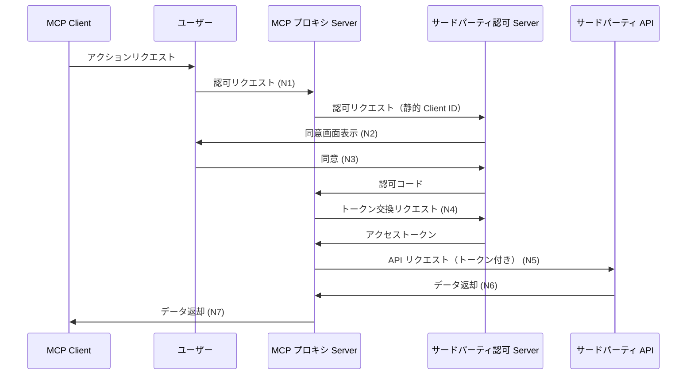
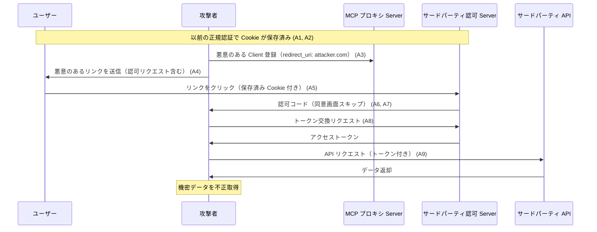
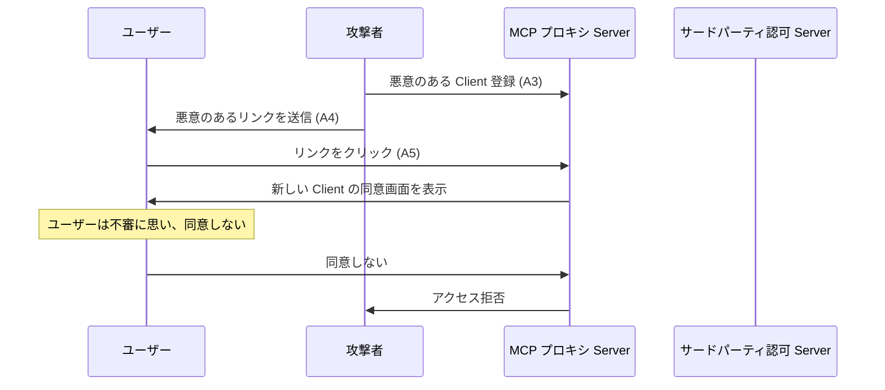
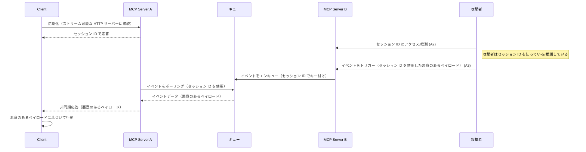
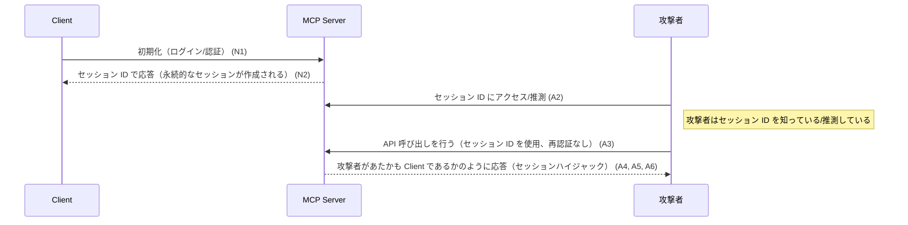

___MCP に関する発展理解編:___ _MCP の脆弱性と対策を理解するために必要な開発者向け知識の解説_

---

本章の説明は、2025-06-18 の[仕様](https://modelcontextprotocol.io/specification/2025-06-18)に基づきます。

MCP Specification: Base Protocol、Authorization、Client Features、Server Features、**Security Best Practices（今ここ）**

**本 Chapter では MCP SPecification の最終回で Base Protocol の Security Best Practices について整理します。**

---

Security Best Practices は MCP の認可仕様の補完としてセキュリティリスク、攻撃ベクトル、ベストプラクティスを公開しています。現時点で 3 つのセキュリティリスクについての説明がされています。それぞれ確認しましょう。

## 1. 混乱した代理人問題（Confused Deputy Problem）

___基本概要: アクションを実行する許可を持たないエンティティが、より特権のあるエンティティにアクションを実行するように強制できる___

誤解を恐れずに端的に説明すると、混乱した代理人問題とは、権限を持つ代理人（MCP Server）が、**誰の指示で動いているかを適切に確認せず**、攻撃者の指示で自分の権限を不正に使ってしまう問題です。MCP プロキシ Server はサードパーティ API にアクセスする権限を持っていますが、その権限を使うよう指示しているのが正規ユーザーなのか攻撃者なのかを適切に検証しないと、攻撃者の指示で機密データにアクセスしてしまう可能性があります。

**用語と役割**

仕様では混乱した代理人問題に関連して以下の用語が定義されています。

| 用語 | 説明 |
|------|------|
| MCP (プロキシ) Server | MCP Client をサードパーティ API に接続する MCP Server。サードパーティ API に対して単一の OAuth Client として動作する。 |
| サードパーティ認可 Server | サードパーティ API を保護する認可 Server。動的 Client 登録をサポートしていない場合がある。 |
| サードパーティ API | 実際の API 機能を提供する保護されたリソース Server。この API へのアクセスにはサードパーティ認可 Server が発行したトークンが必要である。 |
| 静的 Client ID | MCP プロキシ Server がサードパーティ認可 Server と通信する際に使用する固定の OAuth 2.0 クライアント識別子である。 |

### MCP での具体例：サードパーティ API へのアクセス

MCP プロキシ Server を介してサードパーティ API にアクセスするシナリオを考えてみましょう。

**シナリオ設定**

| 役割 | 説明 |
|------|------|
| 代理人 | MCP プロキシ Server（サードパーティ API へのアクセス権を持っている） |
| 保護対象 | サードパーティ API（顧客情報管理など） |
| 認可 Server | サードパーティ認可 Server（API へのアクセスを制御） |
| 正規ユーザー | 認可された MCP Client |
| 攻撃者 | 悪意のある MCP Client |

**通常の流れ（正常なケース）**

| ID | アクション | 説明 |
|----|------------|------|
| N1 | 認可リクエスト | 正規の MCP Client がサードパーティ認可 Server に認可をリクエスト（MCP プロキシ Server 経由） |
| N2 | 同意画面表示 | サードパーティ認可 Server はユーザーに同意画面を表示 |
| N3 | 同意 | ユーザーが同意し、サードパーティ認可 Server は認可コードを発行 |
| N4 | トークン交換 | MCP プロキシ Server は認可コードをアクセストークンと交換 |
| N5 | API アクセス | MCP プロキシ Server はトークンを使ってサードパーティ API にアクセス |
| N6 | データ取得 | サードパーティ API はデータを返す |
| N7 | レスポンス | MCP プロキシ Server はデータを MCP Client に返す |

**攻撃の流れ（混乱した代理人問題）**

| ID | アクション | 説明 |
|----|------------|------|
| A1 | 正規認可 | ユーザーが MCP プロキシ Server を通じてサードパーティ API に正規にアクセス |
| A2 | Cookie 設定 | サードパーティ認可 Server がユーザーのブラウザに静的 Client ID に対する同意を示す Cookie を設定 |
| A3 | 悪意ある登録 | 攻撃者が MCP プロキシ Server に悪意のある Client を登録（redirect_uri: attacker.com） |
| A4 | 悪意あるリンク送付 | 攻撃者がユーザーに悪意のあるリンク（認可リクエストを含む）を送信 |
| A5 | リンククリック | ユーザーがリンクをクリック（ブラウザには同意 Cookie が保存済み） |
| A6 | 同意スキップ | サードパーティ認可 Server は Cookie を検出し、同意画面をスキップ |
| A7 | コード横取り | 認可コードが攻撃者のサーバー（redirect_uri）にリダイレクト |
| A8 | トークン取得 | 攻撃者は認可コードをアクセストークンと交換 |
| A9 | 不正アクセス | 攻撃者はユーザーになりすましてサードパーティ API にアクセス |

**問題点**

この攻撃では、MCP プロキシ Server は ___代理人___ としてサードパーティ API にアクセスする権限を持っていますが、**誰の指示で動いているか**を適切に確認していません。サードパーティ認可 Server も、以前の同意に基づいて新しい Client に対する同意をスキップしてしまいます。

### シーケンス図

**正常なフロー（ユーザー同意を保持）**

**攻撃フロー（ユーザー同意をスキップ）**

### 対策

公式仕様書によると、MCP プロキシ Server は静的 Client ID を使用する場合、**各動的登録 Client に対してユーザーの同意を必ず取得する必要があります**。

**1. 明示的な同意の要求**

MCP プロキシ Server は、新しい Client が登録されるたびに、ユーザーの明示的な同意を必ず取得する必要があります。以前の同意があっても、新しい Client には適用しないようにします。

**2. トークン検証の強化**

OAuth 2.0 のベストプラクティスに基づいた完全なトークン検証には以下の要素が必要です。

1. **audience 検証**: トークンが特定の受信者（この場合は MCP プロキシ Server）向けに発行されたものであることを確認
2. **scope 検証**: トークンに含まれる権限スコープが、リクエストされた操作に対して適切かつ十分であることを確認
3. **issuer の検証**: トークンが信頼できる発行者から発行されたものであることを確認
4. **有効期限の検証**: トークンが有効期限内であることを確認
5. **署名の検証**: トークンの署名が有効であることを確認

これらの検証を適切に実装することで、認可スコープの制御不備による混乱した代理人問題に対応することができます。

## 2. トークンパススルー（Token Passthrough）

___基本概要: MCP Server が受け取ったトークンを検証せずに下流 API に転送してしまう問題___

MCP Server は、Client から受け取った認可トークンが自身（MCP Server）に対して明示的に発行されたものであることを検証する責任があります。トークンパススルーでは、この検証を省略し、Client から受け取ったトークンをそのまま下流 API に転送します。これにより、盗難されたトークンや不正に取得されたトークンを使った攻撃が可能になり、レート制限回避、リクエスト検証のバイパス、監査証跡の混乱などのセキュリティリスクが生じます。

**リスク**

トークンパススルーは仕様で明示的に禁止されており、以下のようなセキュリティリスクをもたらします。

- **セキュリティ制御の回避**: レート制限、リクエスト検証、トラフィック監視などの重要なセキュリティ制御が回避される
- **説明責任と監査証跡の問題**: Client の識別や監査が困難になる
- **信頼境界の問題**: 複数のサービス間でトークンが不適切に共有される
- **将来の互換性リスク**: 後からセキュリティ制御を追加するのが難しくなる

### 対策

MCP Server は、MCP Server 自身に対して明示的に発行されていないトークンを**絶対に受け入れてはなりません**。必ず新しいトークンを発行して下流 API にアクセスする必要があります。

具体的には、以下の対策を実装する必要があります：

1. **トークン検証の徹底**: 受け取ったトークンの audience、scope、発行者、有効期限、署名を必ず検証する
2. **トークン変換**: 下流 API にアクセスする際は、必ず新しいトークンを発行する
3. **最小権限の原則**: 下流 API へのアクセスには、必要最小限の権限スコープを持つトークンのみを使用する
4. **トークンの分離**: Client から受け取ったトークンと下流 API へのアクセスに使用するトークンを明確に分離する
5. **監査ログの記録**: トークンの検証と変換のプロセスを詳細に記録し、不審なアクティビティを検出できるようにする

これらの対策により、トークンパススルーによるセキュリティリスクを効果的に軽減できます。

## 3. セッションハイジャック（Session Hijacking）

___基本概要: 攻撃者がユーザーのセッション ID を盗んだり推測したりして、そのユーザーになりすます攻撃___

すでにセッション管理の Chapter で説明しているので簡単にまとめます。

### MCP での具体例：ステートフルな HTTP Server でのセッション管理

MCP Server がステートフルな HTTP Server を使用してセッションを管理するシナリオを考えてみましょう。

**シナリオ設定**

| 役割 | 説明 |
|------|------|
| 代理人 | MCP Server（ステートフルな HTTP Server を使用） |
| 保護対象 | ユーザーセッションとそのデータ |
| 処理 | API リクエストの処理 |
| 正規ユーザー | 認可された Client アプリ |
| 攻撃者 | 悪意のある Client |

**通常の流れ（正常なケース）**

| ID | アクション | 説明 |
|----|------------|------|
| N1 | 認証・接続 | 正規の Client アプリが MCP Host で認証を受け、MCP Server に接続 |
| N2 | セッション作成 | MCP Server はセッションを作成し、セッション ID を Client に返す |
| N3 | セッション利用 | Client は以降のリクエストでそのセッション ID を使用 |
| N4 | ユーザー識別 | MCP Server はセッションに基づいてユーザーを識別し、適切な処理を行う |
| N5 | レスポンス | 処理結果を Client に返す |

**注意**: MCP Server はセッションだけでなく、毎回の認可トークンも検証する必要があります。

**攻撃の流れ（セッションハイジャック）**

| ID | アクション | 説明 |
|----|------------|------|
| A1 | 正規ログイン | 正規ユーザーが MCP Server にログインし、セッション ID を取得 |
| A2 | セッション ID 窃取 | 攻撃者は何らかの方法でそのセッション ID を入手（盗聴、推測など） |
| A3 | 不正リクエスト | 攻撃者はそのセッション ID を使って MCP Server にリクエスト |
| A4 | 検証スキップ | MCP Server はセッションのみで認証し、追加の認可確認を行わない |
| A5 | 誤認 | MCP Server は攻撃者を正規ユーザーと誤認し、リクエストを処理 |
| A6 | 不正操作 | 攻撃者は正規ユーザーの権限で操作を行える |

### セッションハイジャックの種類

#### 1. セッションハイジャックプロンプトインジェクション

#### 2. セッションハイジャックなりすまし

### 対策

セッションハイジャックとセッションハイジャックプロンプトインジェクション攻撃を防ぐために、以下の対策を実装する必要があります。

1. **認可の強化**: 
   - MCP Server は、すべての受信リクエストの認可トークンを必ず検証する
   - 各リクエストごとに audience、scope、発行者、有効期限、署名を検証する
   - セッション ID だけでなく、必ず認可トークンも要求する

2. **セッションベースの認可の禁止**: 
   - MCP Server は認可にセッションを絶対に使用しない
   - セッションはユーザー体験向上のための補助的な仕組みとしてのみ使用する
   - 重要な操作には必ず認可トークンを要求する

3. **安全なセッション ID**: 
   - 必要な場合は予測不可能な値を使用する（安全な乱数生成器を使用）
   - セッション ID は十分な長さと複雑さを持たせる（最低 128 ビット以上のエントロピー）
   - セッション ID は URL や Cookie 以外の場所に保存しない

4. **セッション ID のバインド**: 
   - セッション ID をユーザー固有の情報と組み合わせる（例：`<user_id>:<session_id>`）
   - クライアントの IP アドレスやユーザーエージェントなどの情報と紐付ける
   - セッションの有効期限を短く設定し、定期的に更新する

5. **HTTPS の使用**: 
   - すべての通信を HTTPS で暗号化し、セッション ID の盗聴を防止する

6. **セッション無効化**: 
   - ユーザーがログアウトした際に確実にセッションを無効化する
   - 一定時間操作がない場合は自動的にセッションを無効化する
   - 不審なアクティビティが検出された場合はセッションを強制終了する

これらの対策により、攻撃者がセッション ID を入手しても、なりすましを防ぐことができます。

## まとめ

長きに渡る MCP 仕様と実装詳細の確認からようやく解放されます！ここまで読まれた気合のある方、すごいです！お疲れ様です。次の Chapter からはここまで紹介した脆弱性も含めてインフラストラクチャを含む脆弱性を整理、セキュリティフレームワークの紹介、などを実施します。

> ちなみに著者は MCP 仕様と実装の整理の最中に仕様の最新版が出て大幅に書き直す羽目になったことで HP が 2 週間ほど枯渇しました。