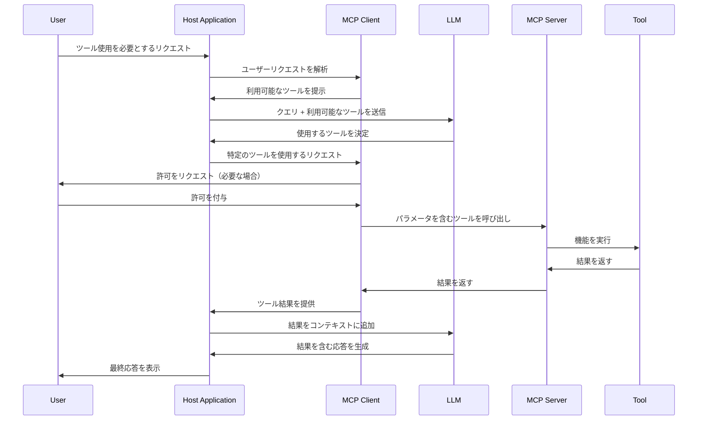
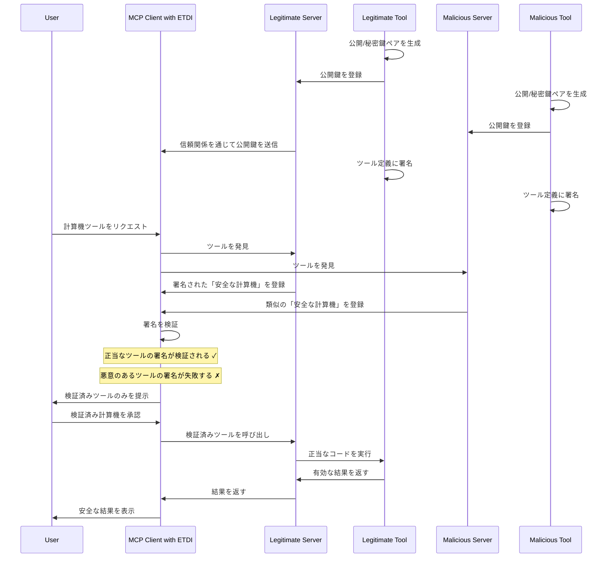
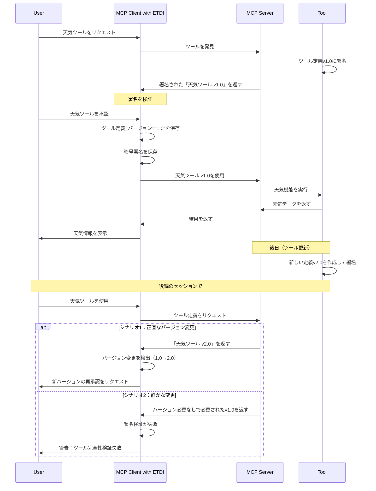
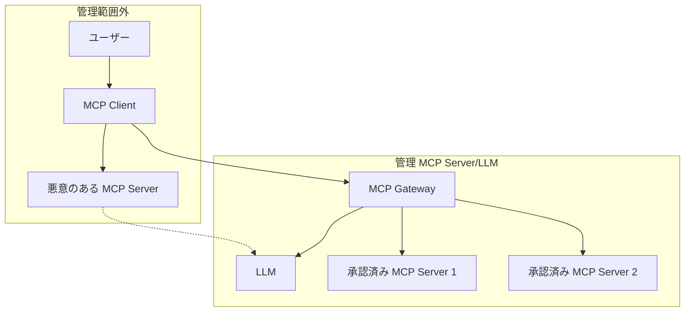

___MCP セキュリティに関する包括的な整理編:___ _MCP のセキュリティに対しての包括的な解説_

---

**本 Chapter では前章で紹介した MCP 特有の攻撃手法に対する対策を解説します。** MCP セキュリティの緩和策を体系的に整理し、各対策の実装方法について詳細に説明します。

## AI リスクマネジメントの重要性

企業として MCP を提供するにせよ、導入するにせよ、MCP セキュリティの How の前に AI リスクマネジメントの基本的な考え方を理解することが重要です。NIST から [AI リスクマネジメントフレームワーク (AI RMF)](https://airc.nist.gov/airmf-resources/) が公開されており、[Appendix01](https://zenn.dev/tosshi/books/security-of-the-mcp/viewer/appendix01) に日本語訳があります。

本書籍は主に技術視点の対策にフォーカスしており、AI リスクマネジメントのための組織的な対策やプロセスについては対象外です。AI RMF などを確認して組織全体の包括的な対策やプロセスを策定し、その中で技術的対応をどこまで実施するのか検討してください。

以降の解説はあくまで対策手法の紹介であり、リスクマネジメントの中でリスク洗い出しと優先度づけ、対応可否を決めてください。以降では、MCP の利用者、提供者、それぞれの視点で整理します。利用者とは、MCP Server を企業で利用するエンジニア、社内向けに MCP Server を提供するインフラチーム、などです。提供者とは、MCP Server を提供する企業を想定します。

## MCP 特有の攻撃手法への対策

紹介した MCP 特有の攻撃手法は最終的にはプロンプトインジェクション攻撃に繋がっています。人間のチェックをすり抜けて、悪意のある MCP Server もしくは、悪意のある外部リソースをモデルの入力に入れ込むことがゴールです。これらの攻撃手法への対策としては、1/ MCP Server の整合性検証、2/ モデルの入出力検証、があります。

**1/ MCP Server の整合性検証**とは、サプライチェーン攻撃に対してのバージョン署名と変更検出が該当します。Rug Pull のように正常だったはずの MCP Server が悪性化するということは、ツール説明などが Initialization 後に変更されてしまうことが原因です。組織利用の際には MCP Server のツール説明等のレビューや検証を実施すべきです。そして**レビュー後に変更がないことが約束されていればサプライチェーン攻撃リスクは緩和されます**。

**2/ モデルの入出力検証**は主に悪意のある外部リソースに対する対策です。例えば、検索 MCP Server は検索で取得した外部リソースを基本的にはそのまま返却するはずです。MCP Server はモデルとは疎結合にツール機能を提供することが責務であり、MCP Server の入出力に対して AI ガードレールを入れることは責務外です。そのため MCP Server の出力には悪意のある情報が含まれている可能性があると想定した上で Client/Host 側で対処する必要があるでしょう。

ただし、モデルの出力の不確定を完全に排除することはできないため、プロンプトインジェクションを完全に防ぐ方法は存在しません。既存のセキュリティ対策を多層的に取り入れることが引き続き最も重要であることに変わりはありませんが、LLM as a Judge や複数の検出手段を用いて入出力を検証させるガードレールを導入することは追加の対策として有効です。

## 整合性検証

Rug Pull のように後から MCP Server が悪性化することを防ぐための対策にはいくつかの手法が考えられ、1/ `listChanged` 変更通知の適切なハンドリング、2/ コード署名、です。そして MCP には STDIO と Streamable HTTP があり、それぞれの通信方式ごとに対策は若干異なります。

MCP のライフサイクルにおける Initialization では Client と Server 間で機能ネゴシエーションを行いますが、`listChanged` は機能ごとにリスト変更通知のサポート有無を事前に取り決めます。

**`listChanged: true` が設定されている場合**、Server 側でツール定義が変更されると、1/ Server は `notifications/tools/listChanged` 通知を Client に送信、2/ Client はこの通知を受け取ると、再度ツールリストを取得して変更を検出、3/ 変更が検出された場合に Client はユーザーに再承認を要求、という手順でツール定義の変更を通知することができます。これによってユーザーはツール定義の変更を検知してレビューを行うことができます。

**MCP Server 提供者視点では**、真摯に `listChanged: true` の場合にはツール定義の変更時に変更通知を確実に行うことが重要です。一方で **MCP Server 利用者の視点では**、悪性の MCP Server は `listChanged: true` の場合でもツール定義変更を通知する保証がないため、この対応だけでは明らかに不十分です。そもそも全ての Client で通知を適切にハンドリングしている保証もありません。

最も簡易な方法としては、提供する独自 MCP Server のバージョンとバージョンごとのコード署名やハッシュ値などを提供する方法が考えられます。STDIO と Streamable HTTP では整合性検証の対象が多少異なるためそれぞれ確認しましょう。

### STDIO 方式の対策方法

STDIO 方式では Client が Server をサブプロセスとして起動し、標準入出力を通じて通信します。この方式でのコード署名は比較的シンプルです。バージョンごとに MCP Server の実行ファイルやコンテナイメージを対象としてコード署名を行う方法があります。以下に大枠の流れを示します。

1. 提供側: 開発 - MCP Server のコードを開発する
2. 提供側: 署名 - 開発物に対して署名を行う
3. 提供側: 公開 - バージョンごとに署名を公開する
4. 利用側: 検証 - MCP Server 起動前に署名を検証し、署名が無効な場合は Server 起動しない

AWS ではコード署名・検証のために [AWS Signer](https://docs.aws.amazon.com/signer/latest/developerguide/Welcome.html) を提供しています。STDIO の MCP Server はローカルで実行され、一度起動時に署名検証していれば後からツール定義が変更されるリスクは低いです。ただし、ツール定義は不変でも MCP Server の返却する結果にプロンプトインジェクションの可能性があるため、署名検証をしておけば MCP 特有の攻撃に対して万全というものではありませんが、**最も容易かつ重大な攻撃経路である Rug Pull を起点とした TPA に対してはこのような検証で必ず対策しておくべき**です。

```bash
# 実行ファイルの署名例
aws signer sign-code \
    --profile-name mcp-server-profile \
    --source s3://bucket-name/mcp-server.zip \
    --destination s3://bucket-name/signed-mcp-server.zip
```

### Streamable HTTP 方式の対策方法

Streamable HTTP では、Server は独立したプロセスとして動作し、複数の Client 接続を処理します。この方式では、コード署名と検証がより複雑になります。コードやコンテナイメージを直接提供するわけではないため何を署名すれば良いのでしょうか。

MCP はトランスポート層に多様性があるため、HTTP 層での署名検証だと HTTP 以外のトランスポートは別で実装対応が必要となってしまい汎用性がありません。そのため MCP Base プロトコルの層での対応が必要でしょう。

残念ながら現時点の MCP 仕様にはコード署名などの整合性に関する規定はありませんが、MCP 2025-06-18 仕様では、`_meta` フィールドが Client と Server 間で追加のメタデータを交換するために予約されています。このフィールドを使用して、セキュリティ関連の情報（ハッシュ値、署名、バージョン情報など）を追加することが可能です。

**MCP 提供者視点では** ツール定義に対してバージョンごとにハッシュ値やコード署名の情報を `_meta` フィールドで提供することができます。**MCP 利用者視点では** 組織としての導入検証レビューが完了した際に、その時点でのツール定義のハッシュ値を `serverInfo.version` に紐づける形で保存しておき、定期的に組織として提供する MCP Server のツール定義を収集してハッシュ値の検証を行うような方法が一例として考えられるでしょう。ただし毎回のリクエストにそれらの情報を入れることはパフォーマンス劣化やネットワーク帯域の無駄な利用につながります。

この方法であれば MCP Server や Client、MCP 仕様の更新に左右されずに最低限の Rug Pull に対する対策が可能です。ただし、**1/ 身元検証の欠如**: ハッシュ値だけでは、ツール提供者の身元を暗号的に検証することはできない、**2/ なりすまし防止の欠如**: 悪意のあるサーバーが正規のサーバーになりすますことを防止できない。**3/ 権限モデルの欠如**: ツールが必要とする権限を明示的に定義・検証するメカニズムがない、などの課題が残るため完全な対策ではないことに注意してください。

**より堅牢なセキュリティを実現するために [Enhanced Tool Definition Interface (ETDI)](https://ar5iv.labs.arxiv.org/html/2506.01333) と呼ばれる手法**が論文で提案されています。これは既存の MCP 仕様の上に追加で統合されたセキュリティ層です。以下に通常のツール利用と ETDI によるツール利用のシーケンス図を示します。

> 通常のツール利用



> ETDI による TPA の防止



> EDTI による Rug Pull の防止



ETDI は、MCP におけるツール定義に署名を導入することで、ツールの真正性と完全性を保証するセキュリティ拡張です。ETDI は正当なツールプロバイダーが公開鍵暗号方式を使用してツール定義全体にデジタル署名を施し、MCP Client がこの署名を検証することでツールの信頼性を確認するというものです。

具体的には、プロバイダーがツールの名前、説明、スキーマ、バージョン、権限要件などを含む完全な定義を作成した際に、自身の秘密鍵でこの定義にデジタル署名を付与します。TPA に対する防御メカニズムとして、攻撃者が正当なツールになりすまそうとしても、MCP Client with ETDI は受信したツール定義の署名を検証し、署名が無効または存在しない場合はそのツールを拒否または警告付きで表示します。

この方式により、ユーザーには検証された信頼できるツールのみが提示され、攻撃者による偽装ツールの混入を効果的に防止できます。ETDI は本質的に、ツールの身元証明書のような役割を果たし、デジタル署名という偽造困難な技術によってツールの正当性を保証します。

ETDI が Rug Pulls 攻撃を防止する仕組みは、ツール定義の不変性と継続的な整合性検証に基づいています。ETDI では、ツールの各バージョンが署名され、この署名がツールの名前、バージョン、説明、スキーマ、権限要件のすべてをカバーしています。

ユーザーがツールを初回承認する際、MCP Client は単に「承認済み」という状態だけでなく、承認されたバージョンの具体的な識別子と、その定義の署名またはハッシュ値を安全に保存します。Rug Pull 攻撃の防止は、この保存された「承認時の署名」と現在のツール定義を継続的に比較することで実現されます。

攻撃者がツールの機能を悪意を持って変更しようとする場合、二つのシナリオが考えられますが、ETDI はどちらも検出できます。

**1/ 攻撃者が正直にバージョン番号を更新する場合**、Client は保存されたバージョン情報との相違を即座に検出し、新しいバージョンとして扱って再承認プロセスを開始します。ユーザーは変更内容を確認した上で、新しいバージョンを承認するかどうかを決定できます。

**2/ 攻撃者がバージョン番号を変更せずに内部的にツールの動作を変更しようとする場合**、ツール定義の任意の部分が変更されると署名が無効になるため、Client の署名検証が失敗します。さらに、現在の定義から計算されるハッシュ値が、承認時に保存されたハッシュ値と一致しなくなるため、改ざんが検出されます。

この二重の検証メカニズムにより、攻撃者は承認後にツールの動作を静かに変更することができなくなります。どのような変更も検出され、ユーザーに明示的に通知されて再承認が求められるため、Rug Pull 攻撃の根本的な脅威である「承認後の静かな変更」が完全に阻止されます。

完全に思える ETDI ですが残念ながら MCP 公式仕様には含まれておらず、研究論文として提案されている段階に過ぎません。typescript-sdk でも当然対応はないため Server と Client の両方に対して独自の実装が必要です。常に Client と Server に手を加えて提供できるわけではなく、組織の全ユーザーが企業から指定された Server や Host を確実に利用するわけではないため完全な対策ではありません。

MCP 仕様に ETDI が追加され、仕様上実装が MUST となれば全ての Server と Client が ETDI を遵守するため完全な TPA/Rug Pull に対する対策となるでしょう。提案者が [ETDI 実装サンプル](https://github.com/vineethsai/MCP-ETDI-docs/tree/main)を公開しているため、興味がある方は確認してみてください。

| 保護機能 | `_meta` フィールド（ハッシュのみ） | ETDI |
|---------|--------------------------|------------|
| 変更検出 | ✅ | ✅ |
| バージョン追跡 | ✅ | ✅ |
| 身元検証 | ❌ | ✅ |
| なりすまし防止 | ❌ | ✅ |
| 明示的な権限モデル | ❌ | ✅ |
| OAuth 統合 | ❌ | ✅ |
| ポリシーベースのアクセス制御 | ❌ | ✅ |

### MCP Server の検証プロセス確立

MCP Server を検証するためのチェックリストを作成し、静的解析、動的解析、ツール説明の検証などのプロセスを確立しましょう。静的解析ではコードの脆弱性スキャン、依存関係の脆弱性チェック、機密情報の漏洩検出を行います。動的解析ではサンドボックス環境での実行テスト、ネットワーク通信の監視、リソース使用状況の監視を行います。ツール説明の検証ではプロンプトインジェクションパターンの検出、悪意のある指示の検出、説明と実際の機能の一致確認を行います。

## モデルの入出力検証

モデルの不確定性が存在する限りプロンプトインジェクションの潜在的なリスクがなくなることはなく、ありとあらゆる方法でモデルを欺いてしまいます。例えば、入力をアスキーアートにして指示を与えたり、出力を base64 して出させたりすることで通常のフィルタ的な AI ガードレールをすり抜けることができてしまいます。

何度も言いますが既存のセキュリティベストプラクティスで Static に防ぐことのできる防御は必ず取り入れた上で、追加の対策として AI ガードレールを導入してください。ガードレールについては以降の Chapter でより詳細に取り扱います。

## Tool Shadowing の対策

Tool Shadowing については MCP Server 提供者視点でできる対策はほぼなく、MCP Server 利用者視点では最も対策が難しい課題だと思います。



企業で MCP Server の管理者がいるとします。その企業のエンジニアが Coding Agent で MCP Server を自由に使うことに制限をかけることは非常に難しいです。様々な OSS Agent があり、自分で Agent を自作して MCP Server を利用することもできるわけです。Docker やツールのダウンロードを妨げてしまうと開発生産性が著しく低下してしまうためそのような方法は取れません。つまり、エンジニアが悪意ある MCP Server を Client に接続して利用してしまう可能性は無くなりません。Tool Shadowing は悪意ある MCP Server が一つでも Client に接続されてしまっている場合、別の正常な MCP Server に対して間接的にプロンプトインジェクションにより悪意ある行動をさせる可能性があります。

管理者が認めた MCP Server をユーザーごとに個別インストールさせて利用させるのではなく、管理者側が用意した MCP Gateway を介してレビュー済みの MCP Server を利用させることができます。AWS の場合、[Amazon Bedrock AgentCore Gateway(Preview)](https://aws.amazon.com/jp/blogs/news/introducing-amazon-bedrock-agentcore-securely-deploy-and-operate-ai-agents-at-any-scale/) がこのような機能を有しています。

ただし MCP Gateway は統一的に限られた種類・バージョンの MCP Server を提供することで上述した TPA/Rag Pulls には一定の効果がありますが、Tool Shadowing を避けることはできません。なぜならば、**ユーザーは MCP Gateway がすでに接続されている Client に悪意のある Server を追加で接続することができる**からです。

**Client 側でツールの namespace 分離のような機能を MCP 仕様に追加**して、異なる namespace のツールの間接的な呼び出しを防ぐなどの仕様が追加されなければ完全な対策は難しいでしょう。

### 可能な対策アプローチ

現時点では完全な解決策は存在しませんが、企業の管理者が統制を取れる要素としては LLM API に対するガードレールがあります。MCP Host は LLM を呼び出しますが、この LLM は通常様々な種類のプロバイダのモデルを指定可能です。この LLM は企業として一括で契約してユーザーに提供することが多いため、例えば Amazon Bedrock を企業としてユーザーに提供する際には Amazon Bedrock の API リクエストに AI ガードレールである Amazon Bedrock Guardrails を挿入することができます。

LiteLLM や Kong などの LLM API Proxy を介することでよりカスタマイズしたガードレールを挿入することもできます。対策の一案としては、このガードレールで事前に MCP Gateway で許可されたツールリストを保持しておき、許可されていないツールの呼び出しやレスポンスをブロックする方法が考えられます。

LLM は tool use の場合、与えられたツールリストとその説明から適切なツールとパラメータを構造化した上で出力します。つまり、この LLM 出力を適切にブロックすれば許可されていないツールの実行を防ぐことが可能です。当然、完全なブロックはできませんが何が入ってきて何が出てくるのかわからないチャットのプロンプトインジェクションよりは組織で許可されていないツールを検出できる可能性が高いです。

## まとめ

MCP 特有の脆弱性の根本的課題は、最終的にプロンプトインジェクション攻撃に収束する二つの攻撃経路にありました。悪意のある MCP Server の直接的な悪用と、正常な MCP Server に対する間接的な悪意ある操作です。これらに対する防御は、MCP Server の整合性検証とモデルの入出力検証という二層構造で構成されます。

整合性検証においては、Rug Pull 攻撃への対策として、STDIO 方式ではコード署名による実行ファイル検証、Streamable HTTP 方式では `_meta` フィールドを活用したハッシュ値検証と ETDI を紹介しました。

最も困難な課題は Tool Shadowing への対策ですが、企業環境において開発者の MCP Server 利用を完全に統制することは現実的でなく、悪意ある Server が一つでも接続されれば正常な Server への間接攻撃の可能性が発生します。現実的な緩和策として、LLM API レベルでのガードレール実装により、許可されていないツールの実行を検出・ブロックするアイデアを提案しました。以降の Chapter でこのアイデアをより詳細化します。