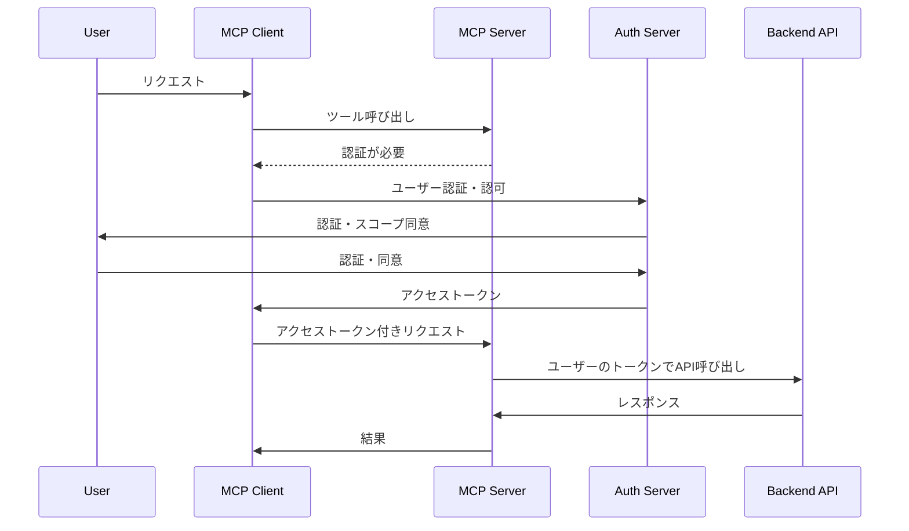
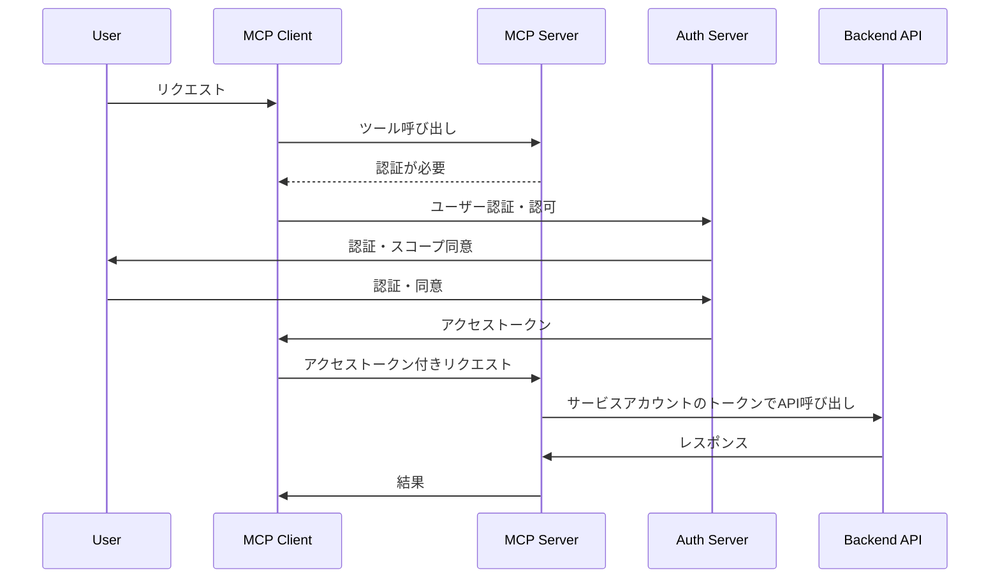

!!!!全体感を語る!!!!

抽象的な対策!!!! の外観を示して次の Chapter で詳細化する
ここでアーキテクチャ全体像（aws サービスによらない) を示す

技術と運用で話を分ける、Server 提供者、利用者の視点を忘れずに

1. 不確定性を対策しなきゃ

mcp scan
最近導入されたMCP-scanのプロキシモードは、既存のエージェントインフラストラクチャを変更することなく、MCPの接続のリアルタイムセキュリティスキャンを可能にすることで、このプロセスを大幅に簡素化します。MCPトラフィックをプロキシを通してルーティングするだけで、即座に可視性とリアルタイムのセキュリティ違反スキャンを得ることができます。

Gateway
Explorer – これが mlflow とかとどう連携できそうなのか？

規約とライセンスをしっかり確認する

2. ゲートウェイパターン

LLM, MCP Server の前段にゲートウェイを挟む


3. トレース、ログ

4. 運用

## AIアシスタント開発者向け対策

- 未使用パラメータを持つツールの実行を拒否する
- 特殊パラメータ名（system_prompt, conversation_historyなど）をブラックリスト化する
- 機密情報へのアクセス制御を強化する
- パラメータ名と内部変数の関連付けを見直す

## MCPサーバー開発者向け対策

- 外部通信を行うコードの厳格な制限を実装する
- サンドボックス環境でのツール実行を義務化する
- コード監査ツールを活用する
- 透明性のためにオープンソースでコードを公開する

## MCPサーバー利用者向け対策

- インストール前にMCPサーバーコードを徹底的に監査する
- 信頼できるソースからのみサーバーを入手する
- 包括的なロギングを有効にし、異常を監視する
- 不要なMCPサーバーは速やかに削除する


1.コンテナ活用、isolation 、でもそれだとシャドーは緩和できない
ツールとパッケージのピン留め： クライアントは、不正な変更を防ぐためにMCPサーバーとそのツールのバージョンをピン留めする必要があります。これは、ツールの説明を実行する前に、ハッシュやチェックサムを使用してその整合性を検証することで行うことができます。
3. クロスサーバー保護： 例えばInvariantスタックのような指定されたエージェントセキュリティツールを使用して、異なるMCPサーバー間により厳格な境界とデータフロー制御を実装します。
MCPエコシステムはこの根本的なセキュリティ脆弱性に対処する必要があります。MCPはエージェントに強力な機能をもたらしますが、その現在の実装は十分な検証やユーザーの透明性なしにツールの説明に過度の信頼を置いています。これらのセキュリティ問題が解決されるまで、ユーザーはサードパーティのMCPサーバーに接続する際に細心の注意を払う必要があります。特に、同じコンテキスト内のサーバーが、悪意のある行為者によって悪用される可能性のある機密データや認証情報を扱う場合はなおさらです。

結論：エージェントには広範で高度に文脈依存のガードレールとセキュリティソリューションが必要
Invariantの主要なミッションの一つとして、AIモデルとその行動に対して広範なガードレールに依存することがいかに重要であるかを強調しすぎることはできません。私たちはエージェントシステムに関する研究とエンジニアリング作業の一環として、この結論に繰り返し至っています。MCPエコシステムもこのルールの例外ではありません。セキュリティはエンドツーエンドで実装される必要があり、ツールの説明だけでなく、AIモデルとの間で受け渡されるデータも含まれます。

モデルの改善も当然されていくと思うがガードレールで弾くのも重要

ソースを検証する： 信頼できるソースからのみMCPサーバーに接続してください。モデルのコンテキストに許可する前に、すべてのツールの説明を慎重にレビューしてください。
ガードレールを実装する： 自動スキャンやガードレールを使用して、疑わしいツールの説明と潜在的に有害な呼び出しパターンをモデルに到達する前に検出およびフィルタリングしてください。
変更を監視する（初回使用時の信頼）： MCPサーバーに対して初回使用時の信頼（TOFU）検証を実装してください。新しいツールが追加された場合や既存のツールの説明が変更された場合は、ユーザーまたは管理者に警告してください。
安全な使用法を実践する： 攻撃表面を最小限に抑えるために、積極的に必要としないMCPサーバーを無効にしてください。特に機密データやシステムとやり取りするツールについては、コマンド実行の自動承認を避け、モデルが提案するアクションを定期的にレビューしてください。
組織としてのリモート MCP Server の一括管理

MCP Server を安易につなげない

MCP 仕様では認可はオプションとなっており、Streamable HTTP のような HTTP ベースのトランスポートを使用する実装では認可の仕様への準拠は `SHOULD` となっています。stdio の場合は環境から認証情報を取得すべきである、と記載されています。本 Chapter では仕様を列挙することが目的ではなく、何の為にその仕様があるのか、ということに焦点を当てます。多層の認証認可については typescript-sdk の実装解説の後の具体的なアーキテクチャ設計の段階で改めて整理します。


ガバナンス cline の話もここに入れる。


まとめで将来的に AWS が AI Agent の MCP Server の検証機能や安全性チェックをした上での公開をやる仕組みを提供すると、結構安全に使えるね、っては話

ブラウザのように信用できる所から出ているもののみを利用する世界になるか、クライアント実装のベスプラフレームワークができるか
まずは、自作もしくは、信頼できそうな MCP プロバイダのものだけ利用
・それですらレビュープロセスをしっかりやる、さらに監視、そしてツール説明等の変更がないことをハッシュなどで監視、プライベートレジストリにツールを配置する


# 既存API提供事業者のMCP Server実装における認証・認可の仕組み

ご質問いただいた点は非常に重要です。既存のAPI提供事業者がMCP Serverとして自社のAPIを提供する場合、認証・認可の流れは複雑になります。この構造を整理して説明します。

## 多層構造の認証・認可フロー

MCPの認証・認可は実際には多層構造になっています：

```
MCP Client ⟷ MCP Server ⟷ バックエンドAPI
```

それぞれの層で認証・認可が必要になり、これらを適切に連携させる必要があります。

### 1. MCP ClientとMCP Server間の認証・認可

まず、MCP ClientがMCP Serverにアクセスする際の認証・認可は、先ほど説明したOAuth 2.1のフローに従います：

1. MCP ClientがMCP Serverにアクセス
2. 認証が必要な場合、MCP ServerはProtected Resource Metadata（PRM）を返す
3. MCP ClientはPRMから認可サーバーを特定し、OAuth 2.1のフローを開始
4. 認可が完了すると、MCP ClientはアクセストークンをMCP Serverに提示してリソースにアクセス

### 2. MCP ServerとバックエンドAPI間の認証・認可

ここが重要なポイントです。MCP Serverは「ツールとしてのAPI」を内部で利用しています。この部分の認証・認可には以下のパターンがあります：

#### パターン1: 委任認証（Delegated Authentication）



このパターンでは：
- ユーザーはバックエンドAPIに対する直接の認可を行う
- MCP Serverはユーザーから受け取ったトークンを使用してバックエンドAPIを呼び出す
- バックエンドAPIはユーザーの権限に基づいてリクエストを処理

#### パターン2: サービスアカウント認証（Service Account Authentication）



このパターンでは：
- MCP Serverは自身のサービスアカウント認証情報を使用してバックエンドAPIを呼び出す
- ユーザーの認可情報はMCP Server内部で検証・制限される
- バックエンドAPIはMCP Serverを信頼し、サービスアカウントの権限で動作

## ユーザーの認可とAPIの利用権限の紐づけ

ご指摘の通り、「MCP Serverが利用できるAPIをユーザーの認可と紐づける」ことは非常に重要です。これには主に以下の方法があります：

### 1. スコープベースのアクセス制御

OAuth 2.1のスコープを使用して、ユーザーがMCP Serverに許可する操作を明示的に定義します：

```
scope=read:weather write:calendar access:contacts
```

MCP Serverは、ユーザーが許可したスコープに基づいて、バックエンドAPIへのアクセスを制限します。

### 2. トークン変換（Token Exchange）

MCP ServerがユーザーのトークンをバックエンドAPI用のトークンに変換する方法です：

1. ユーザーはMCP Serverに対して認可を行う
2. MCP Serverはユーザーのトークンを検証し、そのユーザーの権限に基づいて
3. バックエンドAPI用の新しいトークン（制限された権限を持つ）を生成または取得
4. このトークンを使用してバックエンドAPIを呼び出す

### 3. アクセスポリシーの適用

MCP Server内部でアクセスポリシーを定義し、ユーザーごとに利用可能なAPIやパラメータを制限する方法：

```json
{
  "userId": "user123",
  "allowedTools": ["weather:get", "calendar:read"],
  "deniedTools": ["admin:*"],
  "parameterRestrictions": {
    "weather:get": {
      "location": ["Tokyo", "Osaka", "Kyoto"]
    }
  }
}
```

## 実装例：既存API事業者のMCP Server化

例えば、天気予報APIを提供している事業者がMCP Serverを実装する場合：

### 1. 既存の認証システムとの統合

```javascript
// MCP Serverの認証ミドルウェア
app.use(async (req, res, next) => {
  const token = req.headers.authorization?.split(' ')[1];
  
  if (!token) {
    // OAuth 2.1のPRMを返す
    return res.status(401).json({
      resource: "https://weather-api.example.com/mcp",
      authorization_servers: ["https://auth.example.com"]
    });
  }
  
  try {
    // トークンを検証
    const user = await validateToken(token);
    req.user = user;
    next();
  } catch (error) {
    res.status(401).json({ error: "Invalid token" });
  }
});
```

### 2. ユーザー権限とAPIアクセスの紐づけ

```javascript
// 天気予報ツールのハンドラー
app.post('/tools/getWeather', async (req, res) => {
  const { user } = req;
  const { location, days } = req.body;
  
  // ユーザーの権限チェック
  if (!user.scopes.includes('weather:read')) {
    return res.status(403).json({ error: "Insufficient permissions" });
  }
  
  // ユーザーの利用制限チェック
  if (user.tier === 'free' && days > 3) {
    return res.status(403).json({ error: "Free tier limited to 3-day forecast" });
  }
  
  try {
    // バックエンドAPIの呼び出し（サービスアカウント方式）
    const apiKey = process.env.WEATHER_API_KEY;
    const forecast = await fetchWeatherForecast(location, days, apiKey);
    
    // 利用ログの記録
    await logApiUsage(user.id, 'getWeather', { location, days });
    
    res.json({ forecast });
  } catch (error) {
    res.status(500).json({ error: error.message });
  }
});
```

## 実際の実装における考慮点

1. **トークンの安全な取り扱い**：
   - MCP ServerがバックエンドAPIのトークンを安全に管理する必要がある
   - トークンの漏洩リスクを最小化するための対策が必要

2. **権限の最小化**：
   - ユーザーが許可した範囲内でのみAPIを呼び出す
   - 必要最小限の権限でバックエンドAPIにアクセス

3. **監査とロギング**：
   - どのユーザーがどのAPIをいつ使用したかを記録
   - 不正使用の検出と対応のための仕組み

4. **レート制限とクォータ**：
   - ユーザーごとのAPI使用量を制限
   - サービス全体の安定性を確保

5. **エラー処理と透明性**：
   - バックエンドAPIのエラーを適切にMCP Clientに伝える
   - ユーザーが問題を理解できるようにする

## まとめ

既存のAPI提供事業者がMCP Serverを実装する場合、以下の点が重要です：

1. MCP ClientとMCP Server間の認証・認可はOAuth 2.1に基づく
2. MCP ServerとバックエンドAPI間の認証・認可は「委任認証」または「サービスアカウント認証」のパターンを選択
3. ユーザーの認可とAPIの利用権限の紐づけは、スコープ、トークン変換、またはアクセスポリシーで実現
4. セキュリティ、監査、権限の最小化を常に意識した実装が必要

これらの仕組みにより、ユーザーは自分の許可した範囲内でのみMCP Serverを通じてAPIを利用でき、API提供事業者は既存のAPIを安全にMCPエコシステムに統合することができます。