___MCP セキュリティに関する包括的な設計編:___ _MCP のセキュリティに対しての包括的な設計に関する解説_

---

**本 Chapter では筆者が考える理想的な MCP の中央集中管理のためのアーキテクチャについて解説します。** 

MCP Server の提供者は MCP Server をこれまでに解説したセキュリティを意識しながら提供することが責務です。一方で組織として MCP Server を安全に利用する場合には考慮すべきことが山積していることを解説してきました。本 Chapter では MCP を組織で中央集中管理する際の利用者視点のセキュリティを考慮したアーキテクチャ全体の概念について整理し、特定のクラウドプロバイダーやツールに特化した内容については取り扱いません。

## 概念アーキテクチャ


概念アーキテクチャの **Centrallized Management** が組織が中央集中的に管理するコンポーネントです。組織の利用者は [Kiro](https://aws.amazon.com/jp/blogs/news/introducing-kiro/) のような **MCP Host** を通じて MCP Server を利用します。

中央集中的に MCP Server を管理したいモチベーションについて考えてみましょう。ユーザーが個別で好き放題に MCP Server を利用することによる MCP 特有の脆弱性に対するリスクや、MCP Host、利用ユーザーやプロジェクトごとに毎回 MCP Server を設定する手間、などを考慮した場合に、組織として一元的にレビュー済みの MCP Server を提供することはセキュリティや運用上の意義があります。

多くの場合に組織ではデータの機密レベルに応じてユーザーへのアクセス権限のルールを定めます。手元の PC で好きな MCP Host から好きな MCP Server を自由に使わせる統制のレベルがあっても良いですし、データ分析などをする場合には閉域に近いサンドボックス環境を用意し、サンドボックス内に用意された MCP Host から管理者が提供する MCP Server のみを利用できるようにする統制のレベルもあるでしょう。

これから解説するアーキテクチャは、あくまで組織として中央集中的に MCP Server を管理するための一例の概念アーキテクチャであり、実際には組織構造やデータの機密レベル、プロジェクト等を考慮しながら自社にとって適切な構成を考える必要があります。

### MCP Server の提供方法

MCP Client にとっては、MCP Server が MCP 仕様に沿ってさえいれば裏側がどのような仕組みやインフラストラクチャで構築されているのかは  Don't care です。MCP Server を組織として一括で提供するにあたってどのような提供パターンがあるのか整理してみましょう。


**1. 外部接続パターン**

2025/08 現在、多くの MCP Server が STDIO 形式で提供されていますが、Streamable HTTP 形式でも MCP Server を広く公開することができます。MCP Client から適切な認証・認可の上で外部 MCP Server(Streamable HTTP) に接続するパターンがあるでしょう。

**2. 内部接続パターン**

外部サービスが提供する STDIO 形式の MCP Server や、自社で開発した Streamable HTTP/STDIO の MCP Server を提供したいパターンがあるでしょう。STDIO の場合は Docker 化した上でクラウド上でサービングし、内部の Streamable HTTP 形式の MCP Server の場合は外部接続パターン同様に適切な認証・認可の上で接続します。

**3. MCPify パターン**

既存の内部・外部の API やすでに作ってある AI エージェントを MCP Server として提供したいパターンがあるでしょう。API などを MCP 化するという意味で [**MCPify**](https://catalog.us-east-1.prod.workshops.aws/workshops/015a2de4-9522-4532-b2eb-639280dc31d8/en-US/30-agentcore-gateway/31-transforming-lambda-to-mcp) という用語が使われ始めています。すでに OpenAPI スキーマ情報をもとに MCP Server に変換する仕組みが出てきており、これらの変換を担う **MCPify Proxy** コンポーネントを図に追加しました。

**その他のコンポーネント**

これらのパターンの全てで、1/ 適切な認証・認可の対応、2/ ユーザー側での接続切り替えを意識しない設計、WAF やレートリミットの導入、が必要です。**Proxy** はこれらの機能を担うコンポーネントです。そして **Observability**、**Audit**、**CI/CD** コンポーネントが必要でしょう。

### LLM の提供方法

MCP Host に寄りますがどのプロバイダーの LLM を利用するのか選択できることがあります。例えば、VSCode エクステンションの [Cline](https://github.com/cline/cline) はモデルプロバイダーを柔軟に選択できます。何かしらの LLM を MCP Host から利用するために組織は通常 LLM をサブスクリプションします。


**Centralized Management** コンポーネント内でサブスクリプションした **LLM** の利用をユーザーごとに管理して提供することが望ましでしょう。こうすることで中央集約的に LLM の前段に **AI Guardrail** を配置することができます。AI Guardrail 自体にも不確定性があるため完璧な攻撃の検知と対処はできませんが、多層防御の視点で取り入れることには意義があります。AI Guardrail を入れるだけでは意味がなく、AI Guardrail と LLM の入出力を **Observability** コンポーネントでトーレスし、それらのデータを利用して **Evaluation/Optimization** することで AI Guardrail の精度を向上させる取り組みが研究・実装されて初めています。

## 各コンポーネントに求められる機能

### Proxy

**Proxy** は上述した接続パターンをプロキシとして受け付け、それぞれで必要な認可処理を実施します。自前で実装する場合にはサービスメッシュを用いたり AI API Gateway(ex. Kong, LiteLLM, Portkey など) などを用いることも選択肢になるでしょう。Streamable HTTP の場合、HTTP Base Protocol 上で構成される MCP プロトコルを Deep Packet Inspection して WAF やセッションに対するレートリミットなどの機能を持つことで一元的にアプリケーション層のフィルタリング機能を提供します。このコンポーネントに既知の攻撃シグネチャを検出する静的なルールを適用することも検討の余地があります。

### Inbound Authorization

**Inbound Authorization** は接続パターンに依らず一元的に MCP の認可仕様に基づく認可機能を提供します。

### Outbound Authorization

**Outbound Authorization** 

FIXME: ここを治して

アウトバウンド認証により、エージェントと AgentCore Gateway は、インバウンド認証中に認証および承認されたユーザーに代わって、AWS リソースやサードパーティサービスに安全にアクセスできます。AWS リソースやサードパーティサービスとの認証を統合するには、インバウンド認証とアウトバウンド認証の両方を設定する必要があります。

AgentCore Identity がサポートする必要最小限のアクセスと安全な権限委任により、エージェントは AWS リソースや GitHub、Google、Salesforce、Slack などのサードパーティツールにシームレスかつ安全にアクセスできます。エージェントは、事前に承認されたユーザーの同意がある場合、ユーザーに代わって、または独立してこれらのサービスでアクションを実行できます。さらに、安全なトークンボールトを使用して同意疲れを軽減し、合理化された AI エージェントエクスペリエンスを作成できます。

まず、サードパーティプロバイダーにクライアントアプリケーションを登録し、次にアウトバウンド認証を作成します。AWS リソースやサードパーティサービス、または AgentCore Gateway ターゲットへのアクセスを検証する方法を指定します。OAuth 2LO/3LO または API キーを使用できます。OAuth では、AgentCore Identity が提供するプロバイダーから選択できます。その場合、AgentCore Identity からプロバイダーの設定詳細を入力します。あるいは、カスタムプロバイダーの詳細を提供することもできます。

ユーザーが AWS リソースやサードパーティサービス、または AgentCore Gateway ターゲットへのアクセスを希望する場合、アウトバウンド認証は、インカミング認証によって提供されたアクセストークンが有効であることを確認し、有効であればリソースへのアクセスを許可します。


## コンポーネントとセキュリティ対策のマッピング

[Chapter16](https://zenn.dev/tosshi/books/security-of-the-mcp/viewer/chapter16) で示したセキュリティ対策例と、その対策を実現するコンポーネントをマッピングします。

| コンポーネント | 対策例 |
|-------------|------|
| **全コンポーネント** | エンドツーエンドの暗号化 |
| **MCP Host** | 強力な Client とユーザー認証 |
| **Proxy** | アプリケーション層フィルタリングゲートウェイ |
| **Proxy** | 脅威検出パターン |
| **Proxy** | 厳格なプロトコル検証 |
| **Proxy** | レート制限と自動化防止 |
| **Inbound Authorization** | オーディエンス制限 |
| **Inbound Authorization** | 細かく範囲を限定したアクセストークン |
| **Inbound Authorization** | 動的で時間制限のあるアクセス |
| **Inbound Authorization** | 目的駆動の認可 |


| サプライチェーンセキュリティ | 統合前の改ざんを防ぐために、ツールの開発と配布パイプラインを保護するための対策、SLSA を実装する。 |


| 専用 MCP セキュリティゾーン | 最小特権の原則に基づく厳格な入出力フィルタリングルールを持つ専用のネットワークセグメント内に MCP Server と重要なコンポーネントを分離する。セキュリティグループを使用する。サービスメッシュ、サーバレス利用も重要な対策の一つである。 |
| 包括的なリクエスト追跡 | 効果的な監査とインシデント分析のために、認証、MCP 対話、およびツール呼び出しにわたるコンテキストを維持するために分散トレーシングを実装する。 |
| 不変インフラストラクチャ | 読み取り専用のコンテナファイルシステムを利用し、厳密に必要な場合にのみ書き込み可能なボリュームをマウントし、監視する。 |
| 制限された機能 | コンテナ内の不必要な Linux 機能（例：CAP_NET_ADMIN、CAP_SYS_ADMIN）を削除する。 |
| リソースクォータ | リソース枯渇を防ぎ、誤動作するコンポーネントを封じ込めるために、厳格な CPU、メモリ、ネットワーク I/O、およびストレージクォータを強制する。 |
| Seccomp と AppArmor / SELinux | 許可されるシステムコールを制限するための細かい seccomp プロファイルを適用し、潜在的な悪用の影響をさらに制限するために AppArmor または SELinux を使用して強制アクセス制御（MAC）を使用する。 |
| 定期的なスキャン | コンテナイメージの CI/CD パイプラインに脆弱性スキャンを統合する。 |
| MCP 固有の動作ルール | 異常な MCP Server プロセスの動作、ファイルアクセスパターン、ネットワーク接続、またはツール呼び出しシーケンスに合わせた検出ルールを開発 |
| ファイル整合性モニタリング | 重要な MCP Server バイナリ、構成ファイル、およびツール定義の不正な変更を継続的に監視 |
| メモリ分析 | 永続的なファイルシステムの痕跡を残さない可能性のあるメモリ内攻撃（例：コードインジェクション、フッキング）を検出するための技術を採用 |

| 送信者拘束トークン | トークンの盗難と再生攻撃を防ぐために、所有証明のデモンストレーション（DPoP）や mTLS トークンバインディングのようなメカニズムを実装 |
| 定期的な鍵のローテーション | トークンの署名と暗号化に使用される鍵の頻繁なローテーションを自動化 |
| 堅牢なツール審査とオンボーディング | MCP エコシステムのツールは、静的なコードリポジトリではなく、複雑な対話パターンを持つ動的で潜在的に実行可能なエンティティであるため、ライフサイクル全体を通じてツールを審査、検証、および監視するための包括的な戦略が必須である。レビューやドキュメント作成、定期的な承認フローが必要である。 |
| ツール説明のためのコンテンツセキュリティポリシー | 厳格なスキーマ強制とサニタイズによる構造化検証、正規表現やセマンティック分析を活用した悪意あるパターンの検出、ツールの説明された機能に対する要求権限の照合検証、そして暗号署名による説明の整合性確保を組み合わせることで、ツール汚染攻撃のリスクを軽減するための包括的な防御メカニズムを実装する。 |
| 高度なツール動作モニタリングと汚染検出 | 実行時の悪意ある動作検出とは、通常の運用ベースラインを確立して重大な逸脱に警告する動作分析、分離されたサンドボックス環境でツールを実行して予期しないアクションを監視する動的分析、正当なツールと悪意のあるツールの特性でトレーニングされた AI/ML モデルによる新たな脅威の特定、そしてツールのアクティビティログを広範なセキュリティテレメトリと相関させて多段階攻撃のパターンを検出する統合的なセキュリティ監視を組み合わせた、包括的な防御戦略である。 |


| リアルタイムの取り消し | リスク要因が変化したり疑わしいアクティビティが検出された場合に、アクセスを即座に取り消すメカニズムを実装 || 必須のコード署名 | 統合されたすべてのツール（特にバイナリ）が信頼されたエンティティ（内部認証局（CA）または評判の良い第三者）によって暗号的に署名されていることを要求します。実行前に署名を検証する。 |
| 安全なツールレジストリ | 承認されたツール、そのバージョン、および対応する暗号ハッシュまたは署名の安全な、できれば不変のレジストリ（例：ブロックチェーンまたは署名付きマークルツリーを使用）を維持する。 |
| MCP メッセージの厳格なスキーマ検証 | MCP メッセージの厳格なスキーマ検証とは、許可リストに基づくデータ型・形式の厳密な検証、バッファオーバーフローやリソース枯渇を防止する文字列長制限と数値範囲制約の適用、ネストされたデータ構造に対する再帰的な検証プロセス、そして未定義フィールドを含むメッセージを自動的に拒否するバリデータ構成を組み合わせることで、インジェクション攻撃や不正な形式のリクエストに対する基本的かつ強固な防御層を提供するセキュリティメカニズムである。 |
| コンテキスト認識の入力サニタイズと検証 | コンテキスト認識の入力サニタイズと検証とは、ツールの使用コンテキストに合わせた適切な出力エンコーディング（HTML エスケープや SQL パラメータ化など）の適用、Unicode 正規化や大文字小文字の正規化による回避技術を防ぐための入力の前処理、操作のコンテキスト内で入力値の意味的な整合性を確認するセマンティック検証、そしてリクエスト内の複数フィールド間の論理的整合性を確認するクロスフィールドチェックを組み合わせることで、基本的なスキーマ検証では検出できない高度なインジェクションや回避技術からシステムを防御する多層的なセキュリティアプローチである。 |


aaroraさんのgateway パターンも紹介する。

LLM にも GW がかまされていてもよい。

LiteLLM Proxy を Agentcore にサービングしたいな。

サニタイズやガードレールをどう入れ込むか

- 真面目に OAuth2.1 with API GW: https://github.com/aarora79/streamable-mcp-serverless
- Invaliant labs docs: https://explorer.invariantlabs.ai/docs/guardrails/


**use-mcp** を使った認可


3. トレース、ログ

4. 運用

## AIアシスタント開発者向け対策

- 未使用パラメータを持つツールの実行を拒否する
- 特殊パラメータ名（system_prompt, conversation_historyなど）をブラックリスト化する
- 機密情報へのアクセス制御を強化する
- パラメータ名と内部変数の関連付けを見直す

## MCPサーバー開発者向け対策

- 外部通信を行うコードの厳格な制限を実装する
- サンドボックス環境でのツール実行を義務化する
- コード監査ツールを活用する
- 透明性のためにオープンソースでコードを公開する

## MCPサーバー利用者向け対策

- インストール前にMCPサーバーコードを徹底的に監査する
- 信頼できるソースからのみサーバーを入手する
- 包括的なロギングを有効にし、異常を監視する
- 不要なMCPサーバーは速やかに削除する


1.コンテナ活用、isolation 、でもそれだとシャドーは緩和できない
ツールとパッケージのピン留め： クライアントは、不正な変更を防ぐためにMCPサーバーとそのツールのバージョンをピン留めする必要があります。これは、ツールの説明を実行する前に、ハッシュやチェックサムを使用してその整合性を検証することで行うことができます。
3. クロスサーバー保護： 例えばInvariantスタックのような指定されたエージェントセキュリティツールを使用して、異なるMCPサーバー間により厳格な境界とデータフロー制御を実装します。
MCPエコシステムはこの根本的なセキュリティ脆弱性に対処する必要があります。MCPはエージェントに強力な機能をもたらしますが、その現在の実装は十分な検証やユーザーの透明性なしにツールの説明に過度の信頼を置いています。これらのセキュリティ問題が解決されるまで、ユーザーはサードパーティのMCPサーバーに接続する際に細心の注意を払う必要があります。特に、同じコンテキスト内のサーバーが、悪意のある行為者によって悪用される可能性のある機密データや認証情報を扱う場合はなおさらです。

結論：エージェントには広範で高度に文脈依存のガードレールとセキュリティソリューションが必要
Invariantの主要なミッションの一つとして、AIモデルとその行動に対して広範なガードレールに依存することがいかに重要であるかを強調しすぎることはできません。私たちはエージェントシステムに関する研究とエンジニアリング作業の一環として、この結論に繰り返し至っています。MCPエコシステムもこのルールの例外ではありません。セキュリティはエンドツーエンドで実装される必要があり、ツールの説明だけでなく、AIモデルとの間で受け渡されるデータも含まれます。

モデルの改善も当然されていくと思うがガードレールで弾くのも重要

ソースを検証する： 信頼できるソースからのみMCPサーバーに接続してください。モデルのコンテキストに許可する前に、すべてのツールの説明を慎重にレビューしてください。
ガードレールを実装する： 自動スキャンやガードレールを使用して、疑わしいツールの説明と潜在的に有害な呼び出しパターンをモデルに到達する前に検出およびフィルタリングしてください。
変更を監視する（初回使用時の信頼）： MCPサーバーに対して初回使用時の信頼（TOFU）検証を実装してください。新しいツールが追加された場合や既存のツールの説明が変更された場合は、ユーザーまたは管理者に警告してください。
安全な使用法を実践する： 攻撃表面を最小限に抑えるために、積極的に必要としないMCPサーバーを無効にしてください。特に機密データやシステムとやり取りするツールについては、コマンド実行の自動承認を避け、モデルが提案するアクションを定期的にレビューしてください。
組織としてのリモート MCP Server の一括管理

MCP Server を安易につなげない

MCP 仕様では認可はオプションとなっており、Streamable HTTP のような HTTP ベースのトランスポートを使用する実装では認可の仕様への準拠は `SHOULD` となっています。stdio の場合は環境から認証情報を取得すべきである、と記載されています。本 Chapter では仕様を列挙することが目的ではなく、何の為にその仕様があるのか、ということに焦点を当てます。多層の認証認可については typescript-sdk の実装解説の後の具体的なアーキテクチャ設計の段階で改めて整理します。


ガバナンス cline の話もここに入れる。


まとめで将来的に AWS が AI Agent の MCP Server の検証機能や安全性チェックをした上での公開をやる仕組みを提供すると、結構安全に使えるね、っては話

ブラウザのように信用できる所から出ているもののみを利用する世界になるか、クライアント実装のベスプラフレームワークができるか
まずは、自作もしくは、信頼できそうな MCP プロバイダのものだけ利用
・それですらレビュープロセスをしっかりやる、さらに監視、そしてツール説明等の変更がないことをハッシュなどで監視、プライベートレジストリにツールを配置する


# 既存API提供事業者のMCP Server実装における認証・認可の仕組み

ご質問いただいた点は非常に重要です。既存のAPI提供事業者がMCP Serverとして自社のAPIを提供する場合、認証・認可の流れは複雑になります。この構造を整理して説明します。

## 多層構造の認証・認可フロー

MCPの認証・認可は実際には多層構造になっています：

```
MCP Client ⟷ MCP Server ⟷ バックエンドAPI
```

それぞれの層で認証・認可が必要になり、これらを適切に連携させる必要があります。

### 1. MCP ClientとMCP Server間の認証・認可

まず、MCP ClientがMCP Serverにアクセスする際の認証・認可は、先ほど説明したOAuth 2.1のフローに従います：

1. MCP ClientがMCP Serverにアクセス
2. 認証が必要な場合、MCP ServerはProtected Resource Metadata（PRM）を返す
3. MCP ClientはPRMから認可サーバーを特定し、OAuth 2.1のフローを開始
4. 認可が完了すると、MCP ClientはアクセストークンをMCP Serverに提示してリソースにアクセス

### 2. MCP ServerとバックエンドAPI間の認証・認可

ここが重要なポイントです。MCP Serverは「ツールとしてのAPI」を内部で利用しています。この部分の認証・認可には以下のパターンがあります：

#### パターン1: 委任認証（Delegated Authentication）

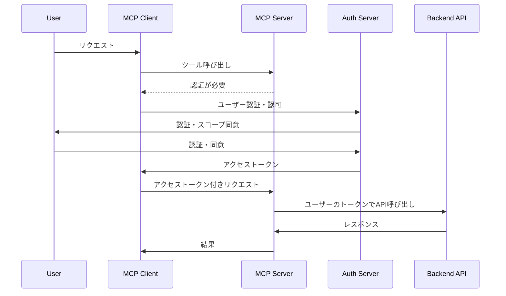

このパターンでは：
- ユーザーはバックエンドAPIに対する直接の認可を行う
- MCP Serverはユーザーから受け取ったトークンを使用してバックエンドAPIを呼び出す
- バックエンドAPIはユーザーの権限に基づいてリクエストを処理

#### パターン2: サービスアカウント認証（Service Account Authentication）

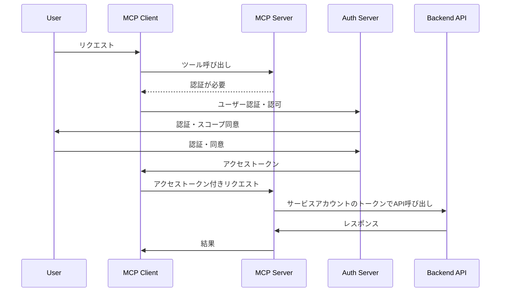

このパターンでは：
- MCP Serverは自身のサービスアカウント認証情報を使用してバックエンドAPIを呼び出す
- ユーザーの認可情報はMCP Server内部で検証・制限される
- バックエンドAPIはMCP Serverを信頼し、サービスアカウントの権限で動作

## ユーザーの認可とAPIの利用権限の紐づけ

ご指摘の通り、「MCP Serverが利用できるAPIをユーザーの認可と紐づける」ことは非常に重要です。これには主に以下の方法があります：

### 1. スコープベースのアクセス制御

OAuth 2.1のスコープを使用して、ユーザーがMCP Serverに許可する操作を明示的に定義します：

```
scope=read:weather write:calendar access:contacts
```

MCP Serverは、ユーザーが許可したスコープに基づいて、バックエンドAPIへのアクセスを制限します。

### 2. トークン変換（Token Exchange）

MCP ServerがユーザーのトークンをバックエンドAPI用のトークンに変換する方法です：

1. ユーザーはMCP Serverに対して認可を行う
2. MCP Serverはユーザーのトークンを検証し、そのユーザーの権限に基づいて
3. バックエンドAPI用の新しいトークン（制限された権限を持つ）を生成または取得
4. このトークンを使用してバックエンドAPIを呼び出す

### 3. アクセスポリシーの適用

MCP Server内部でアクセスポリシーを定義し、ユーザーごとに利用可能なAPIやパラメータを制限する方法：

```json
{
  "userId": "user123",
  "allowedTools": ["weather:get", "calendar:read"],
  "deniedTools": ["admin:*"],
  "parameterRestrictions": {
    "weather:get": {
      "location": ["Tokyo", "Osaka", "Kyoto"]
    }
  }
}
```

## 実装例：既存API事業者のMCP Server化

例えば、天気予報APIを提供している事業者がMCP Serverを実装する場合：

### 1. 既存の認証システムとの統合

```javascript
// MCP Serverの認証ミドルウェア
app.use(async (req, res, next) => {
  const token = req.headers.authorization?.split(' ')[1];
  
  if (!token) {
    // OAuth 2.1のPRMを返す
    return res.status(401).json({
      resource: "https://weather-api.example.com/mcp",
      authorization_servers: ["https://auth.example.com"]
    });
  }
  
  try {
    // トークンを検証
    const user = await validateToken(token);
    req.user = user;
    next();
  } catch (error) {
    res.status(401).json({ error: "Invalid token" });
  }
});
```

### 2. ユーザー権限とAPIアクセスの紐づけ

```javascript
// 天気予報ツールのハンドラー
app.post('/tools/getWeather', async (req, res) => {
  const { user } = req;
  const { location, days } = req.body;
  
  // ユーザーの権限チェック
  if (!user.scopes.includes('weather:read')) {
    return res.status(403).json({ error: "Insufficient permissions" });
  }
  
  // ユーザーの利用制限チェック
  if (user.tier === 'free' && days > 3) {
    return res.status(403).json({ error: "Free tier limited to 3-day forecast" });
  }
  
  try {
    // バックエンドAPIの呼び出し（サービスアカウント方式）
    const apiKey = process.env.WEATHER_API_KEY;
    const forecast = await fetchWeatherForecast(location, days, apiKey);
    
    // 利用ログの記録
    await logApiUsage(user.id, 'getWeather', { location, days });
    
    res.json({ forecast });
  } catch (error) {
    res.status(500).json({ error: error.message });
  }
});
```

## 実際の実装における考慮点

1. **トークンの安全な取り扱い**：
   - MCP ServerがバックエンドAPIのトークンを安全に管理する必要がある
   - トークンの漏洩リスクを最小化するための対策が必要

2. **権限の最小化**：
   - ユーザーが許可した範囲内でのみAPIを呼び出す
   - 必要最小限の権限でバックエンドAPIにアクセス

3. **監査とロギング**：
   - どのユーザーがどのAPIをいつ使用したかを記録
   - 不正使用の検出と対応のための仕組み

4. **レート制限とクォータ**：
   - ユーザーごとのAPI使用量を制限
   - サービス全体の安定性を確保

5. **エラー処理と透明性**：
   - バックエンドAPIのエラーを適切にMCP Clientに伝える
   - ユーザーが問題を理解できるようにする

## まとめ

既存のAPI提供事業者がMCP Serverを実装する場合、以下の点が重要です：

1. MCP ClientとMCP Server間の認証・認可はOAuth 2.1に基づく
2. MCP ServerとバックエンドAPI間の認証・認可は「委任認証」または「サービスアカウント認証」のパターンを選択
3. ユーザーの認可とAPIの利用権限の紐づけは、スコープ、トークン変換、またはアクセスポリシーで実現
4. セキュリティ、監査、権限の最小化を常に意識した実装が必要

これらの仕組みにより、ユーザーは自分の許可した範囲内でのみMCP Serverを通じてAPIを利用でき、API提供事業者は既存のAPIを安全にMCPエコシステムに統合することができます。


## ドラフト

Amazon Bedrock AgentCore ランタイムは、各ユーザーインタラクションに対して分離されたセッションを提供し、エージェントが複数の呼び出しにわたってコンテキストと状態を維持しながら、異なるユーザー間で完全なセキュリティ分離を確保します。

* **ペイロード処理**：カスタムペイロード構造を通じた柔軟なデータ受け渡し

## Amazon Bedrock AgentCore ランタイムセッションの理解

/home/coder/amazon-bedrock-agentcore-samples/01-tutorials/01-AgentCore-runtime/03-advanced-concepts/02-understanding-runtime-context

コードに入る前に、Amazon Bedrock AgentCore ランタイムがセッションをどのように管理するかを理解することが重要です：

### セッションの分離とセキュリティ

AgentCore ランタイムは専用の microVM を通じて**完全なセッション分離**を提供します：

- **専用リソース**：各セッションは独自の microVM で実行され、CPU、メモリ、ファイルシステムが分離されています
- **セキュリティ境界**：ユーザーセッション間の完全な分離によりデータ汚染を防止します
- **決定論的なクリーンアップ**：セッション完了後、microVM は終了し、メモリはサニタイズされます

### セッションのライフサイクル

AgentCore ランタイムのセッションは特定のライフサイクルに従います：

1. **作成**：最初の呼び出し時に一意の `runtimeSessionId` で新しいセッションが作成されます
2. **アクティブ状態**：セッションはリクエストを処理し、コンテキストを維持します
3. **アイドル状態**：セッションはコンテキストを保持しながら次の呼び出しを待ちます
4. **終了**：以下の理由でセッションが終了します：
   - 非アクティブ状態（15 分間）
   - 最大寿命（8 時間）
   - ヘルスチェックの失敗

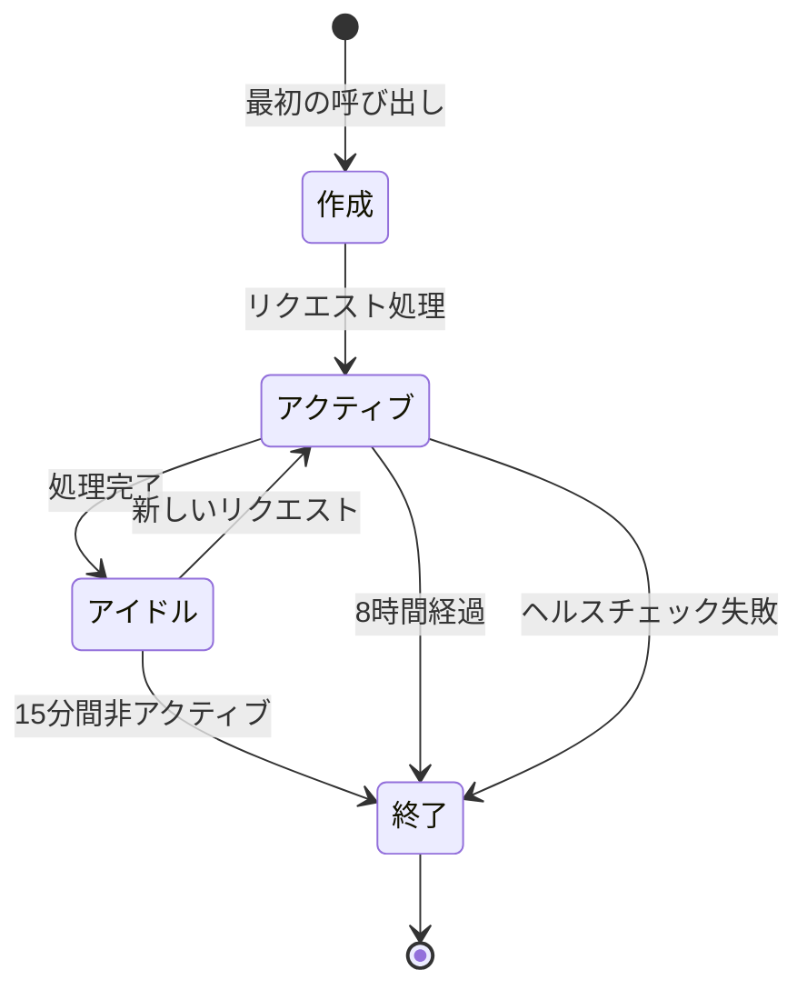

### コンテキストの永続性

セッション内で、AgentCore ランタイムは以下を維持します：
- **会話履歴**：以前のやり取りと応答
- **アプリケーション状態**：実行中に作成された変数とオブジェクト
- **ファイルシステム**：セッション中に作成または変更されたファイル
- **環境変数**：カスタム設定と構成

### セッション管理のベストプラクティス

- **一意のセッション ID**：各ユーザーまたは会話に対して一意のセッション ID を生成する
- **コンテキストの再利用**：コンテキストを維持するために関連する呼び出しには同じセッション ID を使用する
- **セッション境界**：異なるユーザーや無関係な会話には異なるセッション ID を使用する
- **一時的な性質**：永続的なデータストレージにセッションを頼らない（永続性には AgentCore Memory を使用する）

## MCP Gateway 機能と認証・認可の分析

Amazon Bedrock AgentCore の機能と MCP の仕様を比較分析した結果、汎用的な MCP Gateway が持つべき機能と認証・認可の実装について考察します。

### 汎用的な MCP Gateway の必要機能

汎用的な MCP Gateway は、複数の LLM プロバイダーへの統一インターフェースを提供し、ツールとリソースの管理、認証・認可、セキュリティ、運用機能を包括的に実装する必要があります。

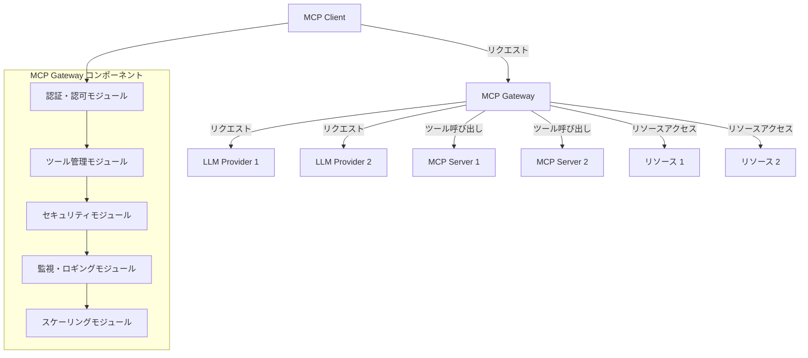

基本機能として、異なる LLM プロバイダー（Amazon Bedrock、OpenAI、Anthropic など）への統一インターフェースを提供し、プロバイダー間の切り替えを容易にする機能が求められます。また、REST API を MCP ツールとして変換する機能や Lambda 関数を MCP ツールとして公開する機能、ツールの登録・管理・検証メカニズムなどのツール管理機能も重要です。さらに、静的および動的データソースの管理とリソースへのアクセス制御も必要となります。

認証・認可機能においては、インバウンド認証（クライアント→ゲートウェイ）として JWT ベースの認証、API キー認証、IAM/SigV4 認証（AWS 特有）が必要です。アウトバウンド認証（ゲートウェイ→外部サービス）としては、OAuth 2.0 認証（2LO/サービスアカウント方式）、API キー認証、IAM ロールベース認証（AWS リソース向け）が求められます。また、トークンの安全な保存、トークンの自動更新、ユーザー ID とトークンの紐付けなどのトークン管理機能も重要です。

セキュリティ機能としては、プロンプトインジェクション対策やスキーマ検証などの入力検証と無害化、最小権限の原則に基づくアクセス制御やツールごとの権限設定などのアクセス制御、詳細なアクセスログや異常検知などの監視とロギング機能が必要です。

運用機能としては、負荷分散や自動スケーリングなどのスケーラビリティ、メトリクス収集やトレーシング、アラート機能などの可観測性、バージョン管理やロールバック機能などのデプロイメント管理が求められます。

### AgentCore と MCP 認可仕様の比較

MCP 認可仕様と Amazon Bedrock AgentCore の認証・認可機能を比較すると、いくつかの重要な相違点が見られます。

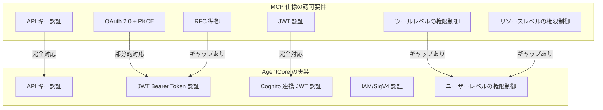

インバウンド認可においては、API キー認証は両方で完全に対応していますが、OAuth 2.0 については AgentCore では JWT Bearer Token 認証としてサポートされているものの、PKCE（Proof Key for Code Exchange）のサポートが明確ではありません。JWT（JSON Web Tokens）については、AgentCore は Amazon Cognito などの ID プロバイダーと連携した JWT 認証をサポートしており、完全に対応しています。しかし、ツールレベルの権限制御とリソースレベルの権限制御については、AgentCore のドキュメントに明示的な記述がなく、ギャップが存在します。

アウトバウンド認可においては、OAuth 2.0 認証については AgentCore は OAuth 2.0 クライアント認証（2LO）をサポートしていますが、3LO（ユーザー代理）のサポートはあるものの MCP 仕様との整合性が不明確です。API キー認証は完全に対応しており、IAM ロールベース認証は AWS リソースへのアクセスに IAM ロールを使用する AWS 特有の実装となっています。トークンの安全な保存とトークンの自動更新については、AgentCore は Token Vault による安全な保存をサポートしており、完全に対応しています。

### セキュリティ対策のカバレッジ分析

MCP セキュリティ対策と Amazon Bedrock AgentCore によるカバレッジを分析すると、多くの対策が部分的にカバーされていることがわかります。

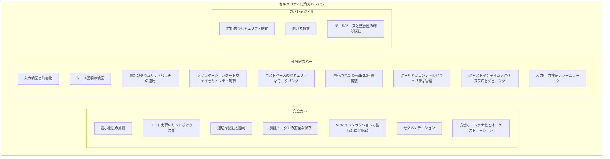

入力検証と無害化については、スキーマ検証はサポートされていますが、プロンプトインジェクション対策の詳細は明確ではありません。最小権限の原則については、IAM ロールと OAuth スコープによる実装がカバーされています。コード実行のサンドボックス化については、Lambda 関数の実行環境によるサンドボックス化が実装されています。

ツール説明の検証については、ツールの登録プロセスはありますが、説明の検証メカニズムの詳細は明確ではありません。適切な認証と認可については、JWT、OAuth、API キー、IAM による多層的な認証・認可が実装されています。認証トークンの安全な保存については、Token Vault による安全なトークン管理が実装されています。MCP インタラクションの監視とログ記録については、Amazon CloudWatch との統合によるログ記録と監視が実装されています。

定期的なセキュリティ監査については、ドキュメントに明示的な言及がありません。最新のセキュリティパッチの適用については、マネージドサービスとしての自動更新はありますが、ユーザー側の責任範囲も存在します。開発者教育についても、ドキュメントに明示的な言及がありません。

### 結論と推奨事項

Amazon Bedrock AgentCore は MCP Gateway の実装として多くの基本機能を提供していますが、MCP 仕様の要件を完全に満たすためには、特に認可機能とセキュリティ機能の面でさらなる強化が必要です。

AgentCore の強みとしては、AWS サービスとの統合、認証・認可の基本機能、トークン管理などが挙げられます。AWS サービスとの統合については、IAM、Amazon Cognito、AWS Lambda などの AWS サービスとシームレスに統合され、マネージドサービスとしての運用負荷が軽減されています。認証・認可の基本機能については、インバウンド認証とアウトバウンド認証の両方をサポートし、複数の認証方式（JWT、API キー、IAM）をサポートしています。トークン管理については、Token Vault による安全なトークン保存とトークンの自動更新をサポートしています。

汎用 MCP Gateway 実装のための推奨事項としては、認可機能の強化、セキュリティ機能の強化、監視・監査機能の強化が挙げられます。認可機能の強化については、PKCE サポートの追加、ツール/リソースレベルの細かい権限制御の実装、RFC 準拠の明確化が必要です。セキュリティ機能の強化については、プロンプトインジェクション対策の強化、ツール説明の検証メカニズムの強化、高度なツール動作モニタリングの実装が必要です。監視・監査機能の強化については、MCP 固有の動作ルールによる異常検知、定期的なセキュリティ監査の仕組み、開発者教育プログラムの提供が必要です。

汎用的な MCP Gateway を実装する際には、これらのギャップを考慮したアーキテクチャ設計が重要となります。特に、認証・認可機能とセキュリティ機能の強化に焦点を当て、MCP 仕様に準拠した実装を目指すべきです。また、監視・監査機能の強化により、MCP Gateway の安全性と信頼性を高めることが重要です。


----

## MCP セキュリティのための包括的アーキテクチャ設計

前章で紹介した MCP 特有の攻撃手法と MAESTRO フレームワークを踏まえ、MCP セキュリティに関する包括的なアーキテクチャを設計します。特に認可、Observability、AI ガードレール、セグメンテーションなどの対策を整理した設計を提案します。

### 全体アーキテクチャ

まず、MCP セキュリティの包括的なアーキテクチャを示すコンポーネント図を作成します。

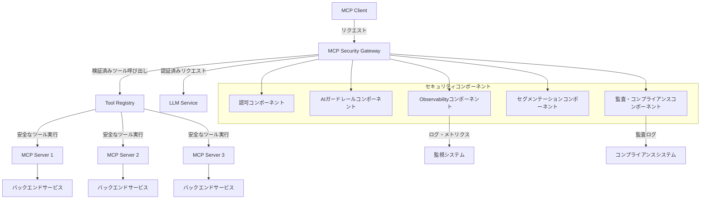

この全体アーキテクチャでは、MCP Client からのリクエストは MCP Security Gateway を経由して LLM Service や Tool Registry にアクセスします。Gateway は各セキュリティコンポーネント（認可、AI ガードレール、Observability、セグメンテーション、監査・コンプライアンス）と連携し、安全なツール実行を保証します。

### セキュリティコンポーネントの詳細

各セキュリティコンポーネントの役割と実装について詳細に説明します。

#### 認可コンポーネント（Authorization）

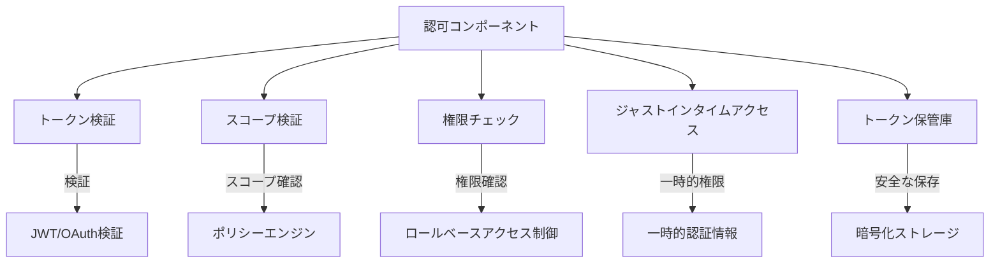

| 機能 | 説明 | 実装方法 |
|------|------|---------|
| トークン検証 | クライアントから受け取ったトークンの有効性を検証 | JWT検証、署名確認、有効期限チェック |
| スコープ検証 | トークンに含まれるスコープがリクエストに対して十分か確認 | スコープマッピングテーブル、ポリシーエンジン |
| 権限チェック | ユーザーがツールやリソースにアクセスする権限を持つか確認 | RBACシステム、属性ベースアクセス制御 |
| ジャストインタイムアクセス | 必要な時だけ最小限の権限を付与 | 一時的認証情報の発行、コンテキスト認識アクセス決定 |
| トークン保管庫 | 認証トークンを安全に保存・管理 | 暗号化ストレージ、定期的なローテーション |

認可コンポーネントは、MCP Client からのリクエストが適切な権限を持っているかを検証し、最小権限の原則に基づいてアクセス制御を行います。OAuth 2.1 や JWT などの標準的な認証プロトコルを使用し、トークンの安全な管理と検証を行います。また、ジャストインタイムアクセスにより、必要な時だけ必要最小限の権限を付与することで、攻撃対象領域を最小化します。

#### AI ガードレールコンポーネント

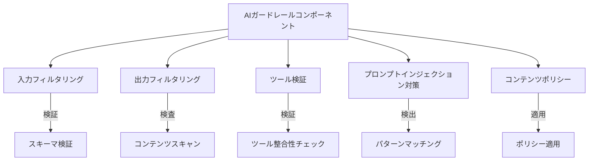

| 機能 | 説明 | 実装方法 |
|------|------|---------|
| 入力フィルタリング | LLMへの入力を検証し、有害なプロンプトを検出・ブロック | スキーマ検証、パターンマッチング、セマンティック分析 |
| 出力フィルタリング | LLMからの出力を検査し、不適切なコンテンツをブロック | コンテンツスキャン、センシティブ情報検出 |
| ツール検証 | ツールの説明と機能の整合性を検証 | 静的解析、動的テスト、署名検証 |
| プロンプトインジェクション対策 | プロンプトインジェクション攻撃を検出・防止 | パターンマッチング、コンテキスト分析、サニタイズ |
| コンテンツポリシー | 組織のポリシーに基づくコンテンツ制限を適用 | ポリシーエンジン、カテゴリ分類 |

AI ガードレールコンポーネントは、LLM への入力と出力を検証し、有害なプロンプトや不適切なコンテンツをブロックします。特に、プロンプトインジェクション攻撃やツールポイズニング攻撃などの MCP 特有の攻撃に対する防御を提供します。また、ツールの説明と機能の整合性を検証し、ツールポイズニングを防止します。

#### Observability コンポーネント

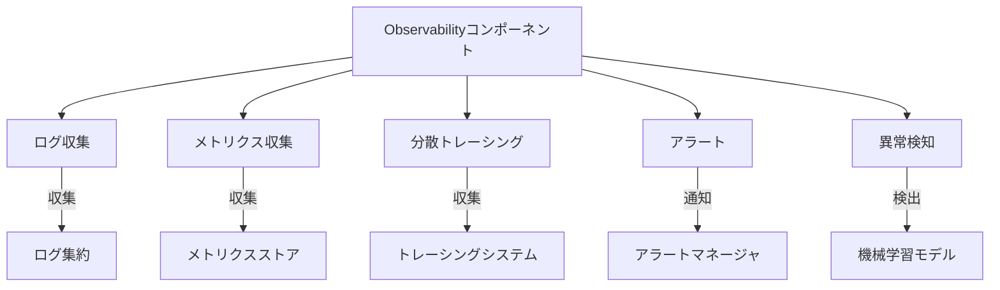

| 機能 | 説明 | 実装方法 |
|------|------|---------|
| ログ収集 | すべてのMCP操作の詳細なログを収集 | 構造化ロギング、集中ログ管理 |
| メトリクス収集 | システムとアプリケーションのメトリクスを収集 | メトリクスエクスポーター、時系列データベース |
| 分散トレーシング | リクエストの流れを追跡し、ボトルネックを特定 | OpenTelemetry、トレースID伝播 |
| アラート | 異常や問題を検出し、通知 | しきい値ベースアラート、異常検知 |
| 異常検知 | 通常のパターンから逸脱する動作を検出 | 機械学習モデル、統計的分析 |

Observability コンポーネントは、MCP システム全体の可視性を提供し、問題の早期発見と対応を可能にします。ログ収集、メトリクス収集、分散トレーシングにより、システムの動作を詳細に把握し、異常検知とアラートにより、セキュリティインシデントを迅速に検出して対応することができます。

#### セグメンテーションコンポーネント

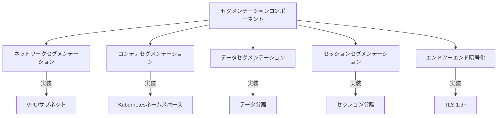

| 機能 | 説明 | 実装方法 |
|------|------|---------|
| ネットワークセグメンテーション | ネットワークレベルでのコンポーネント分離 | VPC、サブネット、セキュリティグループ |
| コンテナセグメンテーション | コンテナレベルでの分離 | Kubernetesネームスペース、ネットワークポリシー |
| データセグメンテーション | データの分離と保護 | テナント分離、暗号化 |
| セッションセグメンテーション | ユーザーセッションの分離 | マイクロVM、コンテナ分離 |
| エンドツーエンド暗号化 | 通信の暗号化 | TLS 1.3+、相互TLS認証 |

セグメンテーションコンポーネントは、MCP システム内の各コンポーネントを適切に分離し、侵害の影響範囲を最小限に抑えます。ネットワークレベル、コンテナレベル、データレベル、セッションレベルでの分離を実装し、エンドツーエンド暗号化により通信の安全性を確保します。

#### 監査・コンプライアンスコンポーネント

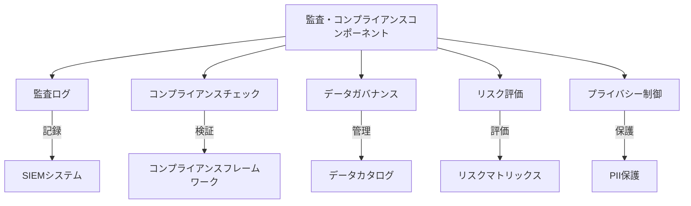

| 機能 | 説明 | 実装方法 |
|------|------|---------|
| 監査ログ | すべての操作の監査可能なログを記録 | 改ざん防止ログ、SIEM統合 |
| コンプライアンスチェック | 規制要件への準拠を確認 | 自動コンプライアンスチェック、レポート |
| データガバナンス | データの使用と管理を制御 | データカタログ、データ分類 |
| リスク評価 | セキュリティリスクを継続的に評価 | 脅威モデリング、リスクスコアリング |
| プライバシー制御 | 個人情報の保護 | データマスキング、最小化 |

監査・コンプライアンスコンポーネントは、MCP システムの操作を監査し、規制要件への準拠を確保します。監査ログの記録、コンプライアンスチェック、データガバナンス、リスク評価、プライバシー制御により、組織のセキュリティポリシーとコンプライアンス要件を満たすことができます。

### 実装パターンと推奨アーキテクチャ

MCP セキュリティを実装するための具体的なパターンと推奨アーキテクチャを提案します。

#### MCP Security Gateway パターン

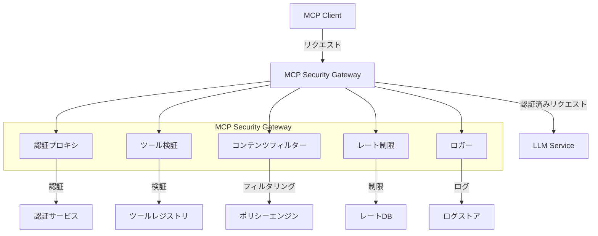

**利点:**
- 集中管理されたセキュリティ制御
- 既存の MCP サーバーに対する透過的な保護
- 一貫したポリシー適用

**欠点:**
- 単一障害点になる可能性
- レイテンシーの増加
- 追加の運用オーバーヘッド

MCP Security Gateway パターンは、すべての MCP トラフィックを単一のゲートウェイを通過させることで、集中的なセキュリティ制御を実現します。このパターンは、既存の MCP サーバーに対して透過的な保護を提供し、一貫したセキュリティポリシーを適用することができます。

#### セキュア MCP サーバーパターン

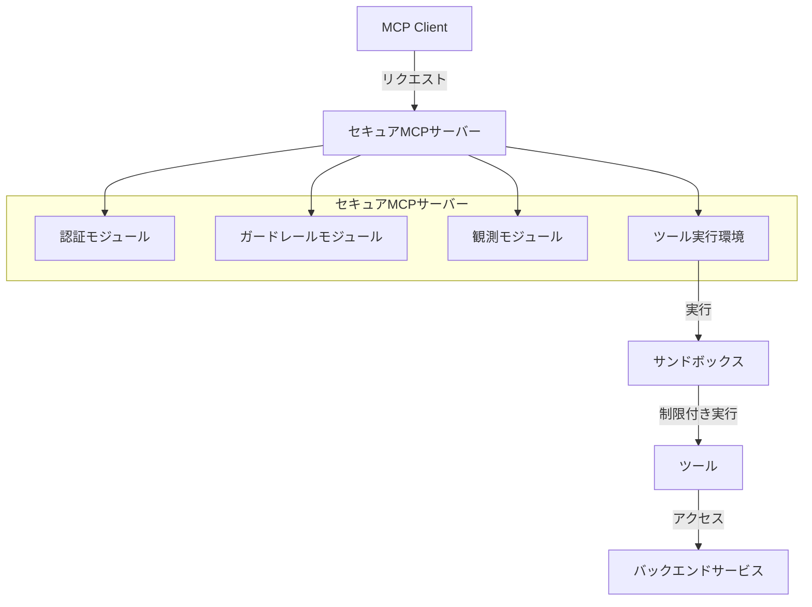

**利点:**
- サーバーごとの独立したセキュリティ
- カスタマイズ可能なセキュリティ制御
- 単一障害点の排除

**欠点:**
- 実装の重複
- 一貫したポリシー適用の難しさ
- 管理の複雑さ

セキュア MCP サーバーパターンは、各 MCP サーバーに独立したセキュリティ機能を実装します。このパターンは、サーバーごとにカスタマイズ可能なセキュリティ制御を提供し、単一障害点を排除することができます。

#### ハイブリッドアーキテクチャ

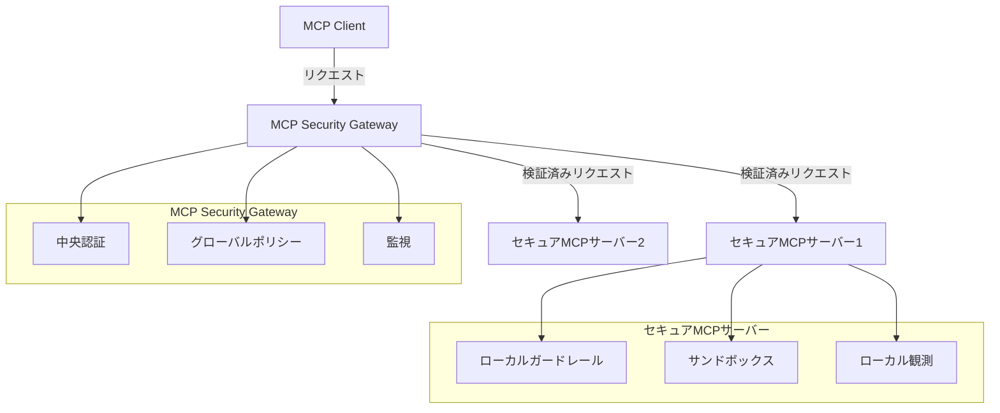

**利点:**
- 中央管理と分散セキュリティの両立
- 柔軟なセキュリティ制御
- 堅牢な多層防御

**欠点:**
- 設計と実装の複雑さ
- 潜在的な責任の重複
- 高いリソース要件

ハイブリッドアーキテクチャは、MCP Security Gateway パターンとセキュア MCP サーバーパターンを組み合わせたものです。このアーキテクチャは、中央管理と分散セキュリティの両方の利点を活かし、柔軟なセキュリティ制御と堅牢な多層防御を実現します。

### セキュリティコンポーネント実装表

各セキュリティコンポーネントの実装オプションと推奨事項をまとめます。

#### 認可コンポーネント実装オプション

| 実装オプション | 説明 | 推奨ユースケース | 複雑さ | セキュリティレベル |
|--------------|------|----------------|--------|----------------|
| OAuth 2.1 + PKCE | 最新のOAuth標準に基づく認可 | 外部システム連携 | 中 | 高 |
| JWT + カスタムクレーム | JWTベースの認証と認可 | 内部システム | 低 | 中〜高 |
| API キー + スコープ | シンプルなAPIキー認証にスコープを追加 | 簡易システム | 低 | 中 |
| IAM/SigV4 | AWSスタイルの認証・認可 | AWSベースシステム | 中 | 高 |
| mTLS + SPIFFE | 相互TLS認証とSPIFFE ID | ゼロトラスト環境 | 高 | 非常に高 |

#### AI ガードレール実装オプション

| 実装オプション | 説明 | 推奨ユースケース | 複雑さ | セキュリティレベル |
|--------------|------|----------------|--------|----------------|
| 入力スキーマ検証 | JSONスキーマによる入力検証 | すべてのシステム | 低 | 中 |
| プロンプトフィルタリング | パターンベースのプロンプト検査 | 公開システム | 中 | 中〜高 |
| セマンティック分析 | LLMを使用した意味解析 | 高リスクシステム | 高 | 高 |
| サンドボックス実行 | 隔離環境でのツール実行 | すべてのシステム | 中 | 高 |
| ツール署名検証 | 暗号署名によるツール検証 | エンタープライズ | 中 | 高 |

#### Observability 実装オプション

| 実装オプション | 説明 | 推奨ユースケース | 複雑さ | 監視レベル |
|--------------|------|----------------|--------|----------|
| 構造化ロギング | JSON形式の詳細ログ | すべてのシステム | 低 | 中〜高 |
| OpenTelemetry | 標準的な分散トレーシング | 複雑なシステム | 中 | 高 |
| カスタムメトリクス | システム固有のメトリクス収集 | 特殊要件 | 中 | 中〜高 |
| AIベース異常検知 | 機械学習による異常検出 | 高リスクシステム | 高 | 非常に高 |
| リアルタイムアラート | 即時通知システム | クリティカルシステム | 中 | 高 |

#### セグメンテーション実装オプション

| 実装オプション | 説明 | 推奨ユースケース | 複雑さ | 分離レベル |
|--------------|------|----------------|--------|----------|
| VPC/サブネット | ネットワークレベルの分離 | クラウド環境 | 中 | 中〜高 |
| Kubernetes名前空間 | コンテナレベルの分離 | コンテナ環境 | 中 | 中 |
| マイクロVM | 軽量VM技術による分離 | 高セキュリティ要件 | 高 | 非常に高 |
| サービスメッシュ | サービス間通信の制御と暗号化 | マイクロサービス | 高 | 高 |
| データ暗号化 | 保存データと転送データの暗号化 | すべてのシステム | 中 | 高 |

### 推奨実装アプローチ

企業規模や要件に応じた推奨実装アプローチを提案します。

#### スタートアップ/小規模組織向け

- **アーキテクチャ**: シンプルな MCP Security Gateway パターン
- **認可**: OAuth 2.0 + JWT ベースの認証
- **ガードレール**: 基本的な入力スキーマ検証とサンドボックス実行
- **Observability**: 構造化ロギングと基本メトリクス
- **セグメンテーション**: コンテナベースの分離と TLS 暗号化

スタートアップや小規模組織では、リソースの制約を考慮し、シンプルながらも効果的なセキュリティ対策を実装することが重要です。基本的な認証・認可、入力検証、ロギング、分離を実装することで、主要なセキュリティリスクに対応することができます。

#### 中規模組織向け

- **アーキテクチャ**: ハイブリッドアーキテクチャ（軽量版）
- **認可**: OAuth 2.1 + PKCE とスコープベースの権限制御
- **ガードレール**: 高度なプロンプトフィルタリングとツール検証
- **Observability**: OpenTelemetry ベースのトレーシングとカスタムメトリクス
- **セグメンテーション**: VPC/サブネット分離とサービスメッシュ

中規模組織では、より高度なセキュリティ対策を実装することが可能です。ハイブリッドアーキテクチャにより、中央管理と分散セキュリティのバランスを取りながら、高度なガードレールと監視機能を実装することができます。

#### 大規模企業向け

- **アーキテクチャ**: 完全なハイブリッドアーキテクチャ
- **認可**: mTLS + SPIFFE とジャストインタイムアクセス
- **ガードレール**: セマンティック分析とツール署名検証
- **Observability**: AI ベース異常検知とリアルタイムアラート
- **セグメンテーション**: マイクロ VM とエンドツーエンド暗号化

大規模企業では、最高レベルのセキュリティ対策を実装することが求められます。完全なハイブリッドアーキテクチャにより、堅牢な多層防御を実現し、高度な認証・認可、ガードレール、監視、分離を実装することができます。

### 実装ロードマップ

段階的な実装アプローチを提案します。

#### フェーズ 1: 基盤構築

1. 基本的な MCP Security Gateway の実装
2. OAuth 2.0/JWT 認証の導入
3. 基本的な入力検証とログ収集
4. TLS 暗号化の実装

#### フェーズ 2: セキュリティ強化

1. 高度な認可メカニズムの導入
2. プロンプトフィルタリングとツール検証の強化
3. 分散トレーシングとメトリクス収集の実装
4. コンテナセグメンテーションの導入

#### フェーズ 3: エンタープライズ対応

1. ジャストインタイムアクセスの実装
2. AI ベースのセキュリティ監視
3. マイクロ VM によるセッション分離
4. 包括的な監査・コンプライアンスシステムの導入

### まとめ

MCP セキュリティの包括的なアーキテクチャ設計では、認可、AI ガードレール、Observability、セグメンテーションの各コンポーネントが重要な役割を果たします。組織の規模や要件に応じて適切なアーキテクチャパターンと実装オプションを選択し、段階的に実装していくことが重要です。

特に、Agentic AI の不確実性に対応するためには、多層防御アプローチが不可欠であり、単一のセキュリティ対策に依存するのではなく、複数の対策を組み合わせることで、より堅牢なセキュリティを実現できます。

このアーキテクチャ設計を基に、組織は MCP を安全に活用し、AI エージェントのセキュリティリスクを最小化しながら、その潜在的な価値を最大化することができるでしょう。
