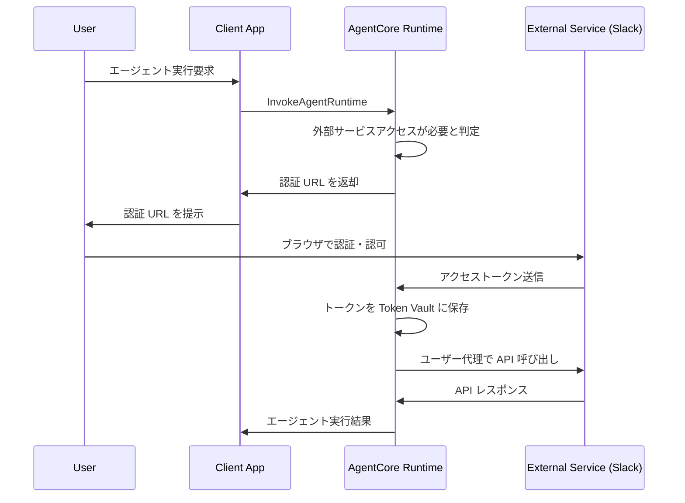
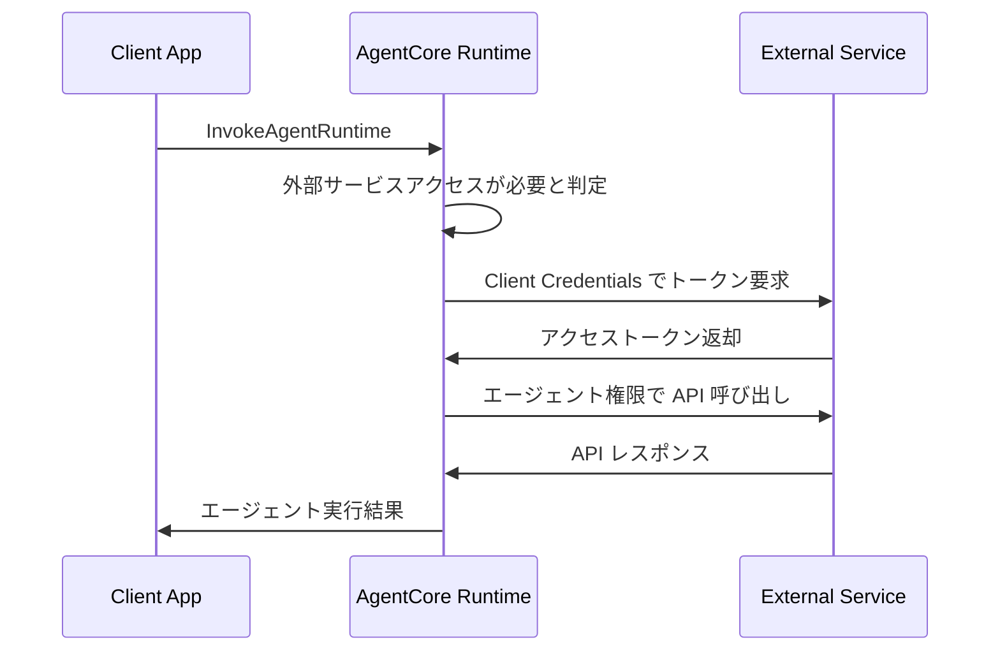

___MCP セキュリティに関する包括的な実装編:___ _MCP のセキュリティに対しての包括的な実装に関する解説_

---

**本 Chapter では Amazon Bedrock AgentCore Runtime について解説します。** 

## AgentCore Runtime の概要

Amazon Bedrock AgentCore Runtime は AI エージェントやツールをサービングするためのセキュアでサーバーレスな実行環境です。現在プレビュー版として提供されており、**仕様が変更される可能性があります**。この Runtime は従来のサーバーレス関数とは異なり、最大 8 時間の長時間実行をサポートし、複雑なエージェント推論や非同期ワークロードに対応します。


**主要機能**

Runtime はフレームワーク非依存の設計を採用しており、LangGraph、Strands、CrewAI などの主要フレームワークとシームレスに連携します。また Amazon Bedrock、Anthropic Claude、OpenAI などの任意の大規模言語モデルと組み合わせて使用できます。プロトコルは HTTP と MCP をサポートし、エージェント間やツール間の通信を可能にします。

ペイロード処理能力は最大 100MB まで対応し、テキスト、画像、音声、動画などのマルチモーダルコンテンツや大規模データセットの処理が可能です。セッション分離機能により、**各ユーザーセッションは専用の microVM で実行され、CPU、メモリ、ファイルシステムリソースが完全に分離**されます。セッション完了後は microVM 全体が終了し、メモリが無害化されるため、セッション間のデータ汚染を防止します。

料金体系は消費ベースモデルを採用し、実際に使用されたリソースに対してのみ課金されます。事前のリソース選択が不要で、動的にプロビジョニングされます。CPU 課金は実際のアクティブ処理時間に基づき、LLM レスポンス待機中の I/O 待機期間は通常課金対象外となります。

## アーキテクチャとコンポーネント

**Agent Runtime**

Agent Runtime は AI エージェントやツールコードをホストする基盤コンポーネントです。コンテナ化されたアプリケーションとして動作し、ユーザー入力を処理し、コンテキストを維持し、AI 機能を使用してアクションを実行します。各 Agent Runtime は一意の識別子を持ち、バージョン管理により制御されたデプロイメントと更新をサポートします。

**バージョン管理システム**

Agent Runtime は不変のバージョンシステムを採用しています。Runtime 作成時に Version 1 が自動作成され、コンテナイメージなどの設定変更のたびに新しいバージョンが作成されます。各バージョンには実行に必要なすべての設定が含まれ、デプロイメント履歴とロールバック機能を提供します。

**エンドポイント管理**

エンドポイントは Agent Runtime の特定バージョンへのアドレス可能なアクセスポイントを提供します。各エンドポイントは呼び出し用の一意の ARN を持ち、特定のバージョンを参照します。DEFAULT エンドポイントは `CreateAgentRuntime` 呼び出し時に自動作成され、常に最新バージョンを指します。カスタムエンドポイントは異なる環境用に `CreateAgentRuntimeEndpoint` で作成可能です。

エンドポイントのライフサイクル状態には `CREATING`、`CREATE_FAILED`、`READY`、`UPDATING`、`UPDATE_FAILED` があります。エンドポイントはダウンタイムなしで更新でき、シームレスなバージョン移行とロールバックが可能です。

**セッション管理**

セッションはユーザーと Agent Runtime 間の個別の対話コンテキストを表します。各セッションは一意の `runtimeSessionId` で識別され、完全に分離された CPU、メモリ、ファイルシステムリソースを持つ専用 microVM で実行されます。同一会話内の複数の対話間でコンテキストが保持され、最大 8 時間の総実行時間まで持続可能です。

セッション状態には `Active`（リクエスト処理中またはバックグラウンドタスク実行中）、`Idle`（リクエスト処理なしだが次の対話を待機中）、`Terminated`（非アクティブ 15 分、最大ライフタイム 8 時間到達、または不健全と判定により終了）があります。セッション終了後は microVM 全体が終了し、メモリが無害化されます。同一 `runtimeSessionId` での後続リクエストは新しい実行環境を作成します。

## サービスコントラクトとプロトコル

HTTP プロトコルは割愛。

**MCP プロトコル**

MCP プロトコルを使用する場合、Server は特定のプロトコル要件を実装する必要があります。トランスポートは**ステートレス streamable-http のみ**をサポートし、AWS のセッション管理と負荷分散との互換性を確保します。セッション管理では、プラットフォームがセッション分離のために `Mcp-Session-Id` ヘッダーを自動追加するため、Server はステートレス操作をサポートし、プラットフォーム生成の `Mcp-Session-Id` ヘッダーを拒否しないようにする必要があります。

コンテナ要件として、ホストは `0.0.0.0`、ポートは `8000`、ARM64 コンテナプラットフォームが必須です。`/mcp` (POST) エンドポイントは MCP RPC メッセージを受信し、エージェントのツール機能を通じて処理します。`InvokeAgentRuntime` API ペイロードの完全なパススルーと標準 MCP RPC メッセージをサポートし、JSON-RPC ベースのリクエスト/レスポンス形式で `application/json` と `text/event-stream` の両方をレスポンスコンテンツタイプとしてサポートします。

## 認証と認可

AgentCore Runtime では、以下の 2 つの方向でのアクセス制御を提供します。

### Inbound Auth（Client → AgentCore Runtime）

Client が AgentCore Runtime にアクセスする際の連携方式（IAM SigV4 または JWT Bearer Token）です。

**アクセス制御方式**

Runtime は以下のいずれか一方のアクセス制御方式をサポートします。MCP 仕様では認証については範囲外でしたが実際に利用する際には認証が必要であり、Runtime は認証と認可をサポートしています。AWS IAM の場合は IAM 認証と IAM ロール認可、JWT Bearer Token の場合、認証は外部 IdP（Cognito など）で実行済みで JWT Bearer Token で認可を実施します。

もう少しわかりやすく説明します。Client が Runtime にアクセスする際のアクセス制御の方式が 2 種類あり、片方は AWS サービスの IAM の世界で認証・認可をやってしまおうというもの、もう一つは認証はユーザー側がブラウザ等を通じて外部 IdP で認証している前提で、認証後に発行される JWT Bearer Token を Runtime へのリクエストに含み、Authorizer でトークン検証をすることで認可をする、というものです。どちらの場合も Runtime 自体は ***認可エンジン*** として機能し、認証自体は IAM や外部 IdP などが担います。

| アクセス制御方式 | 説明 | 設定方法 |
|---------|------|----------|
| AWS IAM (SigV4) | AWS 認証情報を使用した身元確認 | デフォルトの認証メカニズム |
| JWT Bearer Token | 外部アイデンティティプロバイダー統合 | エージェント作成時に Authorizer 設定が必要 | 

#### JWT トークン伝播機能

2025 年 9 月にリリースされた新機能として、AgentCore Runtime は「JWT トークン伝播」をサポートするようになりました。この機能により、クライアントから Runtime へのリクエスト時に JWT トークンをカスタムヘッダーとして渡すことができ、Runtime はそのトークンを受け取って処理できるようになります。

**実装方法**

`RequestHeaderConfiguration` を使用して、HTTP リクエストヘッダーを Runtime に渡します：

```json
{
  "requestHeaderConfiguration": {
    "headerName": "Authorization",
    "headerValue": "Bearer ${jwt_token}"
  }
}
```

この機能により、ユーザーのアイデンティティ情報を Runtime に伝播させ、ユーザー固有のコンテキストでの処理が可能になります。例えば、ユーザーの権限に基づいたデータアクセス制御やパーソナライズされた応答の生成などが実現できます。

詳細は公式ドキュメント（https://docs.aws.amazon.com/bedrock-agentcore/latest/devguide/runtime-oauth.html#oauth-propagate-jwt-token）を参照してください。

### Outbound Auth（AgentCore Runtime → 外部サービス）

AgentCore Runtime が外部サービスにアクセスする際のアクセス制御メカニズム（OAuth 2.0 または API Keys）です。

**外部サービス連携の方式**

AgentCore Runtime が外部サービスにアクセスする際の連携方式は以下の通りです。

| アクセス制御方式 | 認証の実行者 | Runtime の役割 |
|---------|-------------|---------------|
| OAuth 2.0 統合 | 外部 Authorization Server | 認可されたトークンを使用して API 呼び出し |
| API Key 認証 | AgentCore Runtime | 事前共有キーで外部サービスに認証 |

**OAuth 2.0 の認可フロー: User-delegated Access（3-legged OAuth）**

ユーザーがエージェントに外部サービスへのアクセス権限を委譲するパターン。例：「私の Slack チャンネルにメッセージを投稿してください」



**OAuth 2.0 の認可フロー: Machine-to-machine Access（2-legged OAuth）**

エージェントが自分の権限で外部サービスにアクセスするパターン。例：「公開 API からデータを取得してください」

> OAuth 統合時は AWS SDK ではなく HTTPS リクエストが必要です。



## 開発とデプロイメント

**スターターツールキット**

スターターツールキットを使用する場合、`bedrock-agentcore` パッケージをインストールし、3 つの簡単なステップでエージェント関数を AgentCore 互換サービスに変換できます。Runtime のインポート、アプリの初期化、関数のデコレートを行い、`@app.entrypoint` デコレータを既存の関数に追加します。

`BedrockAgentCoreApp` は自動的に HTTP Server を作成し、ポート `8080` でリッスンし、リクエスト処理用の `/invocations` エンドポイントとヘルスチェック用の `/ping` エンドポイントを実装します。また、適切なコンテンツタイプとレスポンス形式を処理し、AWS 標準に従ったエラーハンドリングを管理します。

この場合は python ベースの Dockerfile が自動で作成されます。typescript ベースのコードなどを利用したい場合にはカスタム実装を利用してください。

**カスタム実装**

カスタム実装では AgentCore Runtime 要件に従ったカスタムエージェントをデプロイできます。エージェントは `/invocations` POST と `/ping` GET エンドポイントを公開し、Docker コンテナにパッケージ化する必要があります。AgentCore Runtime では ARM64 アーキテクチャがすべてのデプロイされたエージェントに必須です。

Docker buildx を使用して異なるアーキテクチャ用のイメージをビルドでき、ECR リポジトリの作成とデプロイが必要です。

**MCP Server デプロイメント**

`agentcore configure` コマンドで `--protocol MCP` を指定し、実行ロール、ECR、依存関係ファイル、OAuth 設定を行います。`agentcore launch` コマンドでデプロイします。


## AgentCore Gateway との連携による MCP Auth 仕様対応の進化

AgentCore Runtime は MCP の基本的な Auth 機能は実装しているものの、MCP Auth 仕様に完全に準拠しているとの公式の情報が存在せず、今後の MCP Auth 仕様への追従に課題がありました。しかし、2025 年 10 月の重要な[アップデート](https://docs.aws.amazon.com/bedrock-agentcore/latest/devguide/gateway-create-target-MCPserver.html)により、AgentCore Gateway のターゲットタイプに「MCP server」が追加され、この課題が大幅に改善されました。

**Gateway を通じた外部 MCP Server 連携**

新しい仕組みでは、AgentCore Runtime でデプロイされた MCP Server を AgentCore Gateway に接続することが可能になりました。Gateway は MCP Server のツール機能を提供し、サポートされる MCP プロトコルバージョンは **2025-06-18** と **2025-03-26** です。これまで Runtime から外部の MCP Server にアクセスする場合、コードベースで AI エージェントに個別に組み込む必要がありました。この場合、AgentCore Runtime が MCP Auth 仕様に厳密に従うかどうかが公式情報で明記されていないため懸念がありましたが、AgentCore Gateway は次の Chapter で詳細に説明しますが、DCR を除いて MCP Auth 仕様に追従していることが公式サンプルで明記されています。（AgentCore Runtime の MCP Auth への準拠度については現在調査中です）

**認証機能の強化**

Gateway を通じた MCP Server 接続では、以下の 2 つの認証方式をサポートしています。

- **NoAuth**: Gateway が事前設定された認証なしで MCP Server のツール機能を呼び出します。これは推奨されないアプローチですが、AWS Knowledge MCP Server などの認証不要なサーバーに対応するために提供されています。

- **OAuth2（2-legged）**: Gateway は 2-legged OAuth をサポートします。認証プロバイダーは Gateway と同じアカウント・リージョンの AgentCore Identity で設定する必要があります。

AgentCore Identity を活用することで、Runtime は自動的に workload access token を取得し、これを使用して OAuth token を取得します。この仕組みにより、開発者は複雑な認証処理を意識することなく、セキュアな MCP Server 連携を実現できます。

**実装例: AWS Knowledge MCP Server との連携**

Gateway を通じた MCP Server 連携の具体例として、AWS Knowledge MCP Server との接続があります。この実装では、以下の手順で連携を実現しています。

1. Gateway の設定で MCP server ターゲットタイプを選択し、接続先の URL と認証方式を設定
2. AgentCore Identity で Credential Provider を設定し、OAuth2 認証に必要な情報を登録
3. Runtime のコードでは、個別の MCP Server 設定を記述する必要がなく、Gateway への接続のみを実装

この仕組みにより、Runtime は Gateway を通じて AWS Knowledge MCP Server の機能を利用でき、AWS の最新ドキュメントを検索して回答を生成することが可能になります。

**現在の制限事項と今後の調査課題**

AgentCore Gateway と MCP Server の連携において、現時点でいくつかの制限事項が存在します。特に重要な課題として、JWT propagation（JWT トークンの伝播）の扱いがあります。

AgentCore Runtime では、`RequestHeaderConfiguration` を使用して JWT トークンを Runtime に伝播させる機能がサポートされています。これにより、ユーザー固有の情報や権限をトークンから抽出し、処理に活用することが可能です。しかし、Gateway を経由して MCP Server にアクセスする場合、この JWT 情報が MCP Server まで伝播される明示的な仕組みは現在のドキュメントでは確認できません。

また、現状の Gateway は 2-legged OAuth（M2M）のみをサポートしており、これはマシン間通信に最適化されています。そのため、「Tenant A 向けの権限をどうするか」といったテナント単位の細かい粒度での権限制御が難しいという課題があります。エージェント単位でしか認証・認可が行われず、特定のユーザーやテナントのコンテキストを持つアクセス制御が困難です。

MCP Auth 仕様の観点から見ると、AgentCore Gateway が 2-legged OAuth のみをサポートしていることには、以下のような具体的な課題があります：

1. **ユーザーコンテキストの欠如**: 2-legged OAuth はマシン間通信に最適化されており、ユーザーの同意や特定のユーザーコンテキストを必要としません。これは、ユーザー固有の権限やデータにアクセスする必要がある場合に制限となります。

2. **段階的権限拡張の制限**: SEP-835 で議論されているように、2-legged OAuth では「スコープアップグレード」が「MAY」（任意）とされています。つまり、実行時に必要に応じて権限を拡張する機能が限定的です。ユーザーの介入なしで動作するため、インタラクティブなスコープアップグレードができません。

3. **DCR（Dynamic Client Registration）の課題**: SEP-991 で指摘されているように、DCR には運用負荷と信頼性の問題があります。Gateway が 2-legged OAuth のみをサポートする場合、これらの課題に対処するための柔軟性が制限されます。

4. **エンタープライズ環境での制約**: SEP-646 で提案されているような、企業 IdP を活用した ID-JAG メカニズムの実装が困難になる可能性があります。これは、企業環境での MCP Server 統合において重要な課題となります。

5. **多様なクライアント環境への対応**: CLI、音声インターフェース、デスクトップアプリなど、多様なクライアント環境に対応するためには、3-legged OAuth も含めた複数の認証フローをサポートすることが理想的です。

これらの課題は、特に企業環境やユーザー固有のコンテキストが重要なユースケースで顕著になります。ただし、AWS Knowledge MCP Server のような公開 API へのアクセスや、バックグラウンドでの自動処理など、ユーザーコンテキストを必要としないシナリオでは、2-legged OAuth のみでも十分機能する可能性があります。

将来的には、より包括的な認証オプションをサポートするよう、Gateway の機能が拡張されることが期待されます。現時点では、アプリケーションレベルでの回避策を検討するか、テナントごとに異なる Gateway ターゲットを設定するなどの対応が必要かもしれません。

## まとめ

Amazon Bedrock AgentCore Runtime は AI エージェントの本格的な運用を可能にする包括的なプラットフォームです。大きめのペイロード処理（100MB）、セキュアなセッション分離、柔軟な認証オプション、長時間実行サポート、マルチモーダル対応など、エンタープライズグレードの機能を提供します。

さらに、AgentCore Gateway との連携により、外部 MCP Server への接続が可能になり、MCP Auth 仕様への対応が大幅に改善されました。この進化により、開発者はより効率的にエージェントシステムを構築でき、MCP エコシステムの恩恵を最大限に活用できるようになりました。

プレビュー版であることを考慮し、制限事項を理解した上で適切に活用することで、スケーラブルで信頼性の高い AI エージェントシステムを構築できます。Runtime と Gateway の連携は、AI エージェント開発における新たな可能性を切り開く重要な進歩と言えるでしょう。
