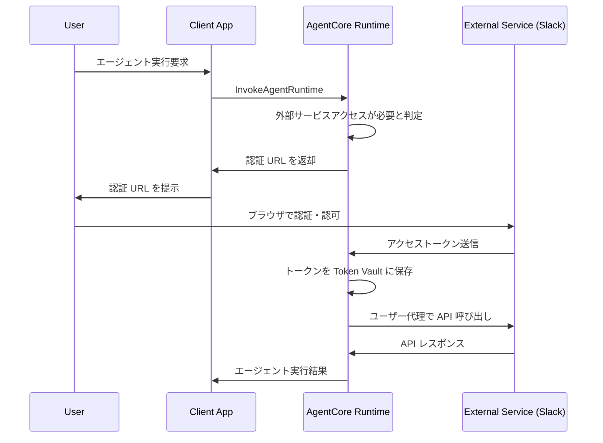
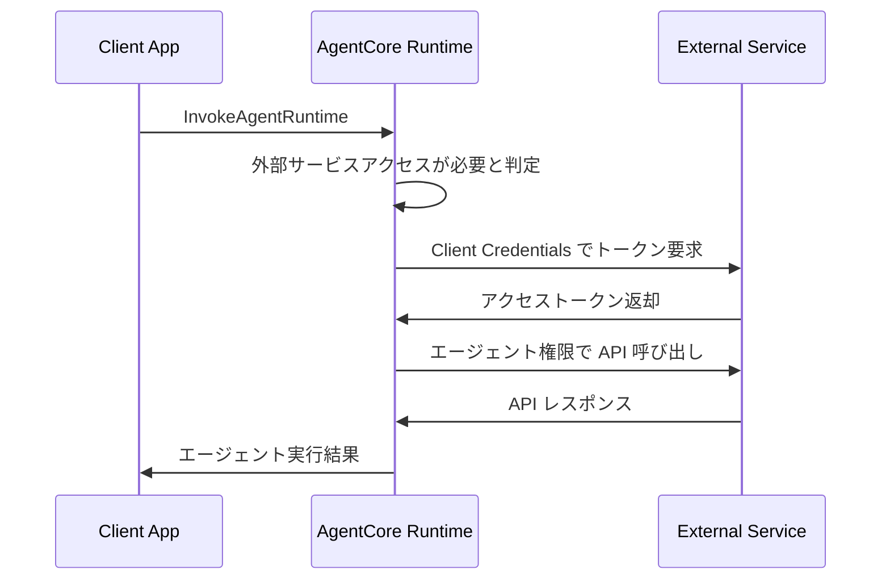

___MCP セキュリティに関する包括的な実装編:___ _MCP のセキュリティに対しての包括的な実装に関する解説_

---

**本 Chapter では Amazon Bedrock AgentCore Runtime について解説します。** 

## AgentCore Runtime の概要

Amazon Bedrock AgentCore Runtime は AI エージェントやツールをサービングするためのセキュアでサーバーレスな実行環境です。現在プレビュー版として提供されており、**仕様が変更される可能性があります**。この Runtime は従来のサーバーレス関数とは異なり、最大 8 時間の長時間実行をサポートし、複雑なエージェント推論や非同期ワークロードに対応します。

**主要機能**

Runtime はフレームワーク非依存の設計を採用しており、LangGraph、Strands、CrewAI などの主要フレームワークとシームレスに連携します。また Amazon Bedrock、Anthropic Claude、OpenAI などの任意の大規模言語モデルと組み合わせて使用できます。プロトコルは HTTP と MCP をサポートし、エージェント間やツール間の通信を可能にします。

ペイロード処理能力は最大 100MB まで対応し、テキスト、画像、音声、動画などのマルチモーダルコンテンツや大規模データセットの処理が可能です。セッション分離機能により、**各ユーザーセッションは専用の microVM で実行され、CPU、メモリ、ファイルシステムリソースが完全に分離**されます。セッション完了後は microVM 全体が終了し、メモリが無害化されるため、セッション間のデータ汚染を防止します。

料金体系は消費ベースモデルを採用し、実際に使用されたリソースに対してのみ課金されます。事前のリソース選択が不要で、動的にプロビジョニングされます。CPU 課金は実際のアクティブ処理時間に基づき、LLM レスポンス待機中の I/O 待機期間は通常課金対象外となります。

## アーキテクチャとコンポーネント

**Agent Runtime**

Agent Runtime は AI エージェントやツールコードをホストする基盤コンポーネントです。コンテナ化されたアプリケーションとして動作し、ユーザー入力を処理し、コンテキストを維持し、AI 機能を使用してアクションを実行します。各 Agent Runtime は一意の識別子を持ち、バージョン管理により制御されたデプロイメントと更新をサポートします。

**バージョン管理システム**

Agent Runtime は不変のバージョンシステムを採用しています。Runtime 作成時に Version 1 が自動作成され、コンテナイメージなどの設定変更のたびに新しいバージョンが作成されます。各バージョンには実行に必要なすべての設定が含まれ、デプロイメント履歴とロールバック機能を提供します。

**エンドポイント管理**

エンドポイントは Agent Runtime の特定バージョンへのアドレス可能なアクセスポイントを提供します。各エンドポイントは呼び出し用の一意の ARN を持ち、特定のバージョンを参照します。DEFAULT エンドポイントは `CreateAgentRuntime` 呼び出し時に自動作成され、常に最新バージョンを指します。カスタムエンドポイントは異なる環境用に `CreateAgentRuntimeEndpoint` で作成可能です。

エンドポイントのライフサイクル状態には `CREATING`、`CREATE_FAILED`、`READY`、`UPDATING`、`UPDATE_FAILED` があります。エンドポイントはダウンタイムなしで更新でき、シームレスなバージョン移行とロールバックが可能です。

**セッション管理**

セッションはユーザーと Agent Runtime 間の個別の対話コンテキストを表します。各セッションは一意の `runtimeSessionId` で識別され、完全に分離された CPU、メモリ、ファイルシステムリソースを持つ専用 microVM で実行されます。同一会話内の複数の対話間でコンテキストが保持され、最大 8 時間の総実行時間まで持続可能です。

セッション状態には `Active`（リクエスト処理中またはバックグラウンドタスク実行中）、`Idle`（リクエスト処理なしだが次の対話を待機中）、`Terminated`（非アクティブ 15 分、最大ライフタイム 8 時間到達、または不健全と判定により終了）があります。セッション終了後は microVM 全体が終了し、メモリが無害化されます。同一 `runtimeSessionId` での後続リクエストは新しい実行環境を作成します。

## サービスコントラクトとプロトコル

HTTP プロトコルは割愛。

**MCP プロトコル**

MCP プロトコルを使用する場合、Server は特定のプロトコル要件を実装する必要があります。トランスポートは**ステートレス streamable-http のみ**をサポートし、AWS のセッション管理と負荷分散との互換性を確保します。セッション管理では、プラットフォームがセッション分離のために `Mcp-Session-Id` ヘッダーを自動追加するため、Server はステートレス操作をサポートし、プラットフォーム生成の `Mcp-Session-Id` ヘッダーを拒否しないようにする必要があります。

コンテナ要件として、ホストは `0.0.0.0`、ポートは `8000`、ARM64 コンテナプラットフォームが必須です。`/mcp` (POST) エンドポイントは MCP RPC メッセージを受信し、エージェントのツール機能を通じて処理します。`InvokeAgentRuntime` API ペイロードの完全なパススルーと標準 MCP RPC メッセージをサポートし、JSON-RPC ベースのリクエスト/レスポンス形式で `application/json` と `text/event-stream` の両方をレスポンスコンテンツタイプとしてサポートします。

## 認証と認可

AgentCore Runtime では、以下の 2 つの方向でのアクセス制御を提供します。

### Inbound Auth（Client → AgentCore Runtime）

Client が AgentCore Runtime にアクセスする際の連携方式（IAM SigV4 または JWT Bearer Token）です。

**アクセス制御方式**

Runtime は以下のいずれか一方のアクセス制御方式をサポートします。MCP 仕様では認証については範囲外でしたが実際に利用する際には認証が必要であり、Runtime は認証と認可をサポートしています。AWS IAM の場合は IAM 認証と IAM ロール認可、JWT Bearer Token の場合、認証は外部 IdP(Cognito など)で実行済みで JWT Bearer Token で認可を実施します。

もう少しわかりやすく説明します。Client が Runtime にアクセスする際のアクセス制御の方式が 2 種類あり、片方は AWS サービスの IAM の世界で認証・認可をやってしまおうというもの、もう一つは認証はユーザー側がブラウザ等を通じて外部 IdP で認証している前提で、認証後に発行される JWT Bearer Token を Runtime へのリクエストに含み、Authorizer でトークン検証をすることで認可をする、というものです。どちらの場合も Runtime 自体は ***認可エンジン*** として機能し、認証自体は IAM や外部 IdP などが担います。

| アクセス制御方式 | 説明 | 設定方法 |
|---------|------|----------|
| AWS IAM (SigV4) | AWS 認証情報を使用した身元確認 | デフォルトの認証メカニズム |
| JWT Bearer Token | 外部アイデンティティプロバイダー統合 | エージェント作成時に Authorizer 設定が必要 | 

### Outbound Auth（AgentCore Runtime → 外部サービス）

AgentCore Runtime が外部サービスにアクセスする際のアクセス制御メカニズム（OAuth 2.0 または API Keys）です。

**外部サービス連携の方式**

AgentCore Runtime が外部サービスにアクセスする際の連携方式は以下の通りです。

| アクセス制御方式 | 認証の実行者 | Runtime の役割 |
|---------|-------------|---------------|
| OAuth 2.0 統合 | 外部 Authorization Server | 認可されたトークンを使用して API 呼び出し |
| API Key 認証 | AgentCore Runtime | 事前共有キーで外部サービスに認証 |

**OAuth 2.0 の認可フロー: User-delegated Access（3-legged OAuth）**

ユーザーがエージェントに外部サービスへのアクセス権限を委譲するパターン。例：「私の Slack チャンネルにメッセージを投稿してください」

**OAuth 2.0 の認可フロー: Machine-to-machine Access（2-legged OAuth）**

エージェントが自分の権限で外部サービスにアクセスするパターン。例：「公開 API からデータを取得してください」

> OAuth 統合時は AWS SDK ではなく HTTPS リクエストが必要です。

## 開発とデプロイメント

**スターターツールキット**

スターターツールキットを使用する場合、`bedrock-agentcore` パッケージをインストールし、3 つの簡単なステップでエージェント関数を AgentCore 互換サービスに変換できます。Runtime のインポート、アプリの初期化、関数のデコレートを行い、`@app.entrypoint` デコレータを既存の関数に追加します。

`BedrockAgentCoreApp` は自動的に HTTP Server を作成し、ポート `8080` でリッスンし、リクエスト処理用の `/invocations` エンドポイントとヘルスチェック用の `/ping` エンドポイントを実装し、適切なコンテンツタイプとレスポンス形式を処理し、AWS 標準に従ったエラーハンドリングを管理します。

この場合は python ベースの Dockerfile が自動で作成されます。typescript ベースのコードなどを利用したい場合にはカスタム実装を利用してください。

**カスタム実装**

カスタム実装では AgentCore Runtime 要件に従ったカスタムエージェントをデプロイできます。エージェントは `/invocations` POST と `/ping` GET エンドポイントを公開し、Docker コンテナにパッケージ化する必要があります。AgentCore Runtime では ARM64 アーキテクチャがすべてのデプロイされたエージェントに必須です。

Docker buildx を使用して異なるアーキテクチャ用のイメージをビルドでき、ECR リポジトリの作成とデプロイが必要です。

**MCP Server デプロイメント**

`agentcore configure` コマンドで `--protocol MCP` を指定し、実行ロール、ECR、依存関係ファイル、OAuth 設定を行います。`agentcore launch` コマンドでデプロイします。

## まとめ

Amazon Bedrock AgentCore Runtime は AI エージェントの本格的な運用を可能にする包括的なプラットフォームです。大きめのペイロード処理(100MB)、セキュアなセッション分離、柔軟な認証オプション、長時間実行サポート、マルチモーダル対応など、エンタープライズグレードの機能を提供します。プレビュー版であることを考慮し、制限事項を理解した上で適切に活用することで、スケーラブルで信頼性の高い AI エージェントシステムを構築できます。