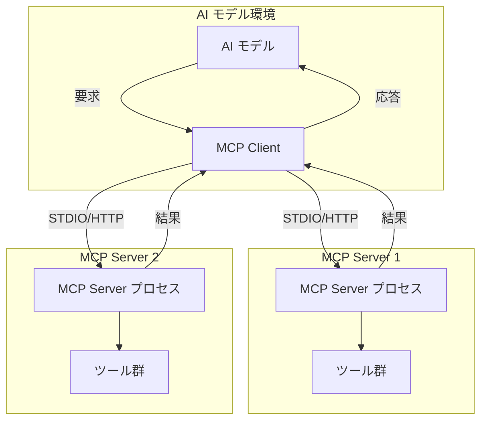
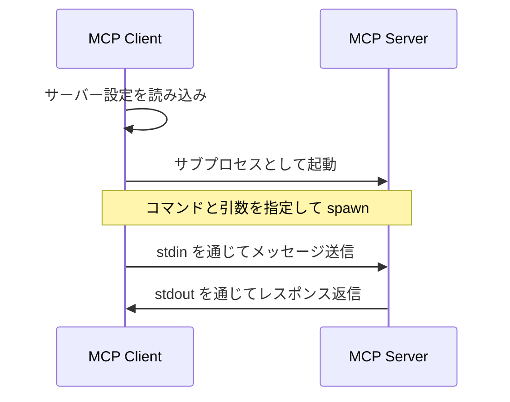
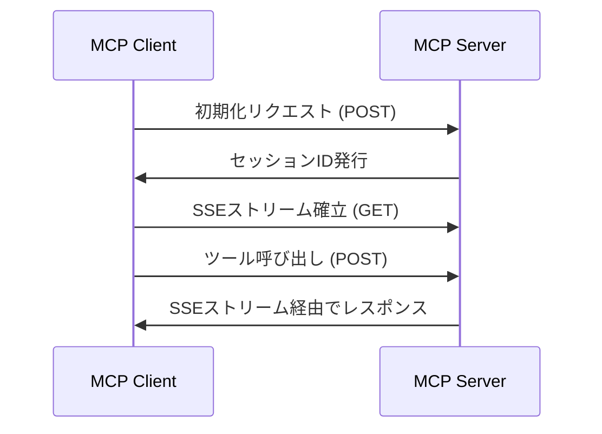

AWS で MCP Server を作る方法

    * onAWS の実装パターン 5-6 章
    * 合計 30 章弱


実際に起動して以下を確かめたい。


# MCP Client と MCP Server の関係性について

MCP（Model Context Protocol）の Client と Server の関係について、typescript-sdk の実装を基に整理します。

## 基本的な関係



## トランスポートの種類と接続方法

MCP では2種類のトランスポート方式があります：

1. **STDIO トランスポート**：
   - MCP Client が MCP Server をサブプロセスとして起動
   - 標準入出力（stdin/stdout）を通じて通信
   - 各 Server は独立したプロセスとして実行

2. **Streamable HTTP トランスポート**：
   - HTTP ベースの通信
   - Server-Sent Events (SSE) を使用した双方向通信
   - セッション管理によるクライアント識別

## MCP Server の接続と起動方法

### STDIO の場合



STDIO の場合、MCP Client は設定ファイル（例：`.mcprc`）に定義された複数の MCP Server を個別のサブプロセスとして起動します。各 Server は独立したプロセスとして動作し、Client はそれぞれの Server と stdin/stdout を通じて通信します。

### Streamable HTTP の場合



Streamable HTTP の場合、MCP Server は既に HTTP サーバーとして起動しており、MCP Client はそれに HTTP 接続します。複数の MCP Server に接続する場合、Client は各 Server に対して個別の HTTP 接続を確立します。

## 複数 MCP Server の接続

MCP Client は複数の MCP Server に同時に接続できます。これは以下のように実現されています：

1. **設定ファイルでの定義**：
   ```json
   {
     "mcpServers": {
       "server1": {
         "command": "node",
         "args": ["server1.js"]
       },
       "server2": {
         "command": "python",
         "args": ["server2.py"]
       },
       "server3": {
         "command": "http://localhost:3000"
       }
     }
   }
   ```

2. **Client 側での管理**：
   - Client は各 Server への接続を個別に管理
   - Server 名をキーとして、対応する Transport インスタンスをマップで保持

3. **トランスポート抽象化**：
   - `Transport` インターフェースを実装した具体的なトランスポートクラス
   - STDIO 用の `StdioClientTransport`
   - HTTP 用の `StreamableHTTPClientTransport`

## HTTP Server と MCP Server の関係

Streamable HTTP の場合、MCP Server は HTTP サーバーとして実装されています。しかし、これは「1つの HTTP サーバーに複数の MCP Server が存在する」という構造ではありません。

実際には：
- 各 MCP Server は独立した HTTP サーバーとして動作
- MCP Client は各 HTTP サーバーに個別に接続
- 各接続はセッション ID によって管理

つまり、「1つの HTTP サーバー = 1つの MCP Server」という関係です。MCP Server が複数ある場合、それぞれが独立した HTTP サーバーとして動作し、Client はそれぞれに接続します。

## セキュリティ上の考慮点

1. **STDIO の場合**：
   - サブプロセスとして実行されるため、コマンドインジェクションのリスク
   - 環境変数の適切な管理が必要
   - 信頼できるソースからの MCP Server のみを使用すべき

2. **Streamable HTTP の場合**：
   - セッション管理の脆弱性（セッション固定化、ID漏洩など）
   - 認証・認可の実装が推奨（仕様では Optional だが）
   - TLS による通信の暗号化が必須

## まとめ

MCP Client と MCP Server の関係は、選択するトランスポート方式によって異なりますが、基本的には「1つの Client が複数の Server に接続し、それぞれのツールやリソースを利用する」という構造です。

STDIO では各 Server はサブプロセスとして起動され、Streamable HTTP では各 Server は独立した HTTP サーバーとして動作します。どちらの場合も、Client は複数の Server への接続を同時に管理できます。

セキュリティ面では、STDIO は信頼できる Server のみを使用する、Streamable HTTP は適切な認証・認可を実装するなどの対策が重要です。