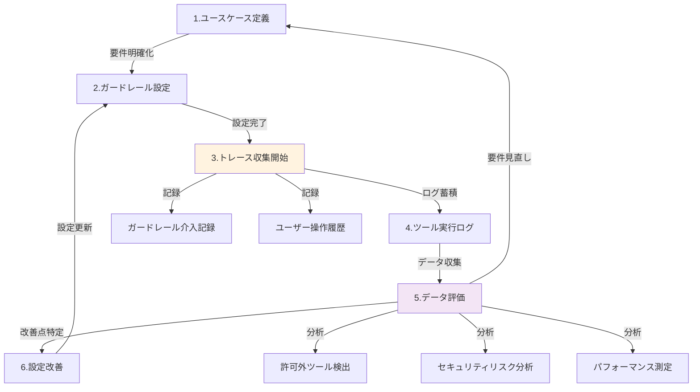

___MCP セキュリティに関する包括的な実装編:___ _MCP のセキュリティに対しての包括的な実装に関する解説_

---

**本 Chapter では Amazon Bedrock Guardrails について解説します。** 

Amazon Bedrock Guardrails は、AI Guardrail を実現する AWS サービスです。本 Chapter ではこのサービスについての理解を深め、AI Guardrail を MCP のセキュリティリスクの緩和に利用できるか否かの検討を行います。本 Chapter は MCP 利用者、MCP を企業に導入する管理者視点で解説します。

[2025 年 6 月 25 日に日本語に対応](https://aws.amazon.com/jp/blogs/news/amazon-bedrock-guardrails-supports-japanese/)し、Generative AI ワークロードのセキュリティリスクの検出・防止において重要な役割を果たします。

## Amazon Bedrock Guardrails とは

Amazon Bedrock Guardrails は 生成 AI アプリケーションの要件と企業の**責任ある AI** ポリシーに基づき、生成 AI アプリケーション用に設定できる保護を提供します。さまざまなユースケースに合わせた複数のガードレールを作成し、複数の基盤モデルに適用して、一貫したユーザーエクスペリエンスを提供し、生成 AI アプリケーション全体で安全性とプライバシーの制御を標準化できます。ガードレールは、自然言語によるモデルプロンプトとレスポンスの両方に使用できます。

この Amazon Bedrock Guardrails に新たに Tier システムが導入されました。日本語の場合は基本的には Standard Tier 一択でしょう。Standard Tier ではクロスリージョン推論が必須となることに注意が必要です。例えば東京で Guardrails を使う場合は [`apac.guardrail.v1:0`](https://docs.aws.amazon.com/ja_jp/bedrock/latest/userguide/guardrails-cross-region-support.html) プロファイルを使用し、APAC 圏内で推論が分散されます。**国内に閉じる要件がある場合はこの点がネックになる可能性があるためご留意ください**。現実的にこの要件が変えられないケースでは Amazon SageMaker AI を用いた NeMo Guardrails や Llama Guard 等のオープンソースの SLM を利用する、SaaS サービスを利用するなどが選択肢となるでしょう。Amazon SageMaker AI JumpStart は Llama Guard などの SLM をすぐに推論エンドポイントとして立ち上げることができます。

| 機能名 | 機能概要 | 日本語対応 |
|--------|----------|------------|
| **コンテンツフィルター** | 有害なユーザー入力とモデル生成出力を自動検出・ブロック。ヘイト、侮辱、性的、暴力的コンテンツを 4 段階の強度で制御 | ✅ **対応** Standard Tier のみ |
| **プロンプト攻撃対策** | ジェイルブレイク、プロンプトインジェクション等の悪意ある入力を検出・防御。 | ✅ **対応** Standard Tier のみ |
| **拒否トピック** | 自然言語で定義した特定トピックに関する質問・回答を自動ブロック（例：「投資アドバイス」「医療診断」）。 | ✅ **対応** Standard Tier のみ |
| **単語フィルター** | 特定の単語・フレーズを完全一致でブロック。カスタム禁止語リストの作成・管理。 | ❌ **未対応** |
| **機密情報フィルター（PII）** | 個人情報（氏名、住所、電話番号、クレジットカード等）を自動検出してマスキングまたはブロック。 | ✅ **対応** 両 Tier で利用可能 |
| **文脈的グラウンディングチェック** | 提供された参考資料に基づかない回答（ハルシネーション）を検出・防止。 | ❌ **未対応** |

コンテンツフィルターには、モデルのシステムプロンプトを抽出するような Prompt Attack の検知も含まれており、MCP セキュリティ対策において特に重要な機能となっています。

## MCP における AI Guardrail について

MCP セキュリティにおいて AI Guardrail がどういう存在なのか考えてみましょう。

以前の Chapter で対応が難しいと説明した Tool Shadowing は Client に複数の MCP Server が接続され、混在で様々なツールを利用できる時点で発生しうる攻撃手法です。つまり、管理者が提供するツール群とそれ以外が明確に namespace 等で分離することができれば悪意のある MCP Server が Client を経由して管理者が提供するツール群に影響を与えることができなくなります。このような機能を実装した MCP Host を管理者が実装を改竄できないように対処した上で提供することも対応の一つでしょう。このような分離については MCP 仕様で検討されるべきですが現状はそのような仕様は存在しません。

では MCP Host/Client が OSS ではなくそのような機能を追加することができない場合はどうすれば良いでしょうか。

MCP の処理フローを思い出してみてください。ツールの情報が複数の MCP Server から MCP Host 側に集約され、MCP Host がそれらの情報をプロンプトに埋め込んで LLM にリクエストします。そして、LLM 側では MCP Host から渡されたツール情報に基づいてどのツールを利用するのか応答します。つまり、LLM の入力には自然言語でツールの情報が渡されるため、前段の AI Guardrail でどのようなツール情報が提供されているのかを把握することは可能です。

では追加の対策層として **Amazon Bedrock Guardrails による Tool Shadowing の検出は可能でしょうか**。ただし、Amazon Bedrock Guardrails を適用できるケースは Amazon Bedrock などのモデルを Host の裏で利用可能なケースのみで、Kiro のような利用するモデルが Host 側で直接コントロールされているケースでは利用できません。そのため、企業が独自に構築する MCP 統合システムや、Amazon Bedrock を基盤とする AI アプリケーションにおいてのみ有効です。結論から言うと現状はこの方法による検出は難しいです。現在の Amazon Bedrock Guardrails や OSS ベースの AI Guardrail では、ホワイトリスト機能は提供されていません。例えば、**許可ツールリストに記載されたもの以外はブロック**という制御を実現するには、現状のポリシーでは限界があります。この時点で Amazon Bedrock Guardrails で許可されていないツールを検出することは厳しいですが、せっかくなので AI Guardrail の重要な考え方について整理しておきましょう。

## ガードレールの設計・運用

本番環境での AI Guardrail 利用時には、レイテンシー、コスト、精度、などが当然重要になってきます。許可していないツールを利用しているユーザーがいないかを調べるために収集されたトレースを元にオフライン評価する場合には、スループット、コスト、精度が重要です。パフォーマンス、コスト、精度を収集する仕組みについて考えてみます。

以下にガードレールを設計・運用するための継続的サイクルを示します。

## 評価・改善

アプリケーションのユースケースや想定される入出力について明確化した上でガードレールを設定すれば終わりではありません。本番運用においてはガードレールを適用した後にそれが実際に実利用時にどのように振る舞うのかの確認が必要でしょう。統計学および機械学習における **第1種の過誤（False Positive、偽陽性）、第2種の過誤（False Negative、偽陰性）** の概念が適用されます。医療診断の例では、「がんではないのにがんであると判断する誤り（偽陽性）」と「がんであるのにがんでないと判断する誤り（偽陰性）」があります。Amazon Bedrock Guardrails の文脈では、正常なリクエストを誤ってブロックしてしまうリスク（偽陽性）、悪意のある攻撃を許可してしまうリスク（偽陰性）があります。医療診断では一般的に偽陰性（がんの見逃し）の方が偽陽性（誤診）よりもリスクが大きいため、誤検出を許容してでもがんの検出漏れを防ぐ方向に調整します。同様に、MCP セキュリティにおいても、ビジネスリスクを考慮した上で適切なバランスを設定する必要があります。

アプリケーションごとにビジネスリスクを考慮した上でユースケース定義、ガードレール設定、評価指標の定義、を行わなければなりません。これは誰かが勝手にうまく作ってくれるものではなく、ビジネスを提供する側が考えなければならないことです。

このような評価は一度とって終わりではなく継続的かつ自動的に行われなければなりません。手動でログを眺めて手動でプロンプトを変更したとしてもそれが設計した指標にとって最適なものになっているのかどうかは今後収集される未知のデータに対しても継続的に評価し続けなければなりません。そのためツールにこだわる必要はありませんが、何らかの方法でガードレールのバージョン情報、ガードレール設定、などと紐づく形でトレースログやブロックされたログの情報を収集し、それらを自動的にオフライン評価すべきでしょう。評価指標があり評価ができるということは改善もできるということです。改善の方法は様々ですが、例えばガードレールのプロンプトをチューニングしたり、モデル自体をファインチューニングするような方法が考えられます。

実運用上は Guardrails の処理にレイテンシーが追加されるため、このレイテンシーがどの程度かかっているのかをデータとして収集することも重要です。

## 実際の検出能力と限界

実際に Amazon Bedrock Guardrails で Tool Poisoning などの典型的なプロンプトを入力して動かしてみました。結果によると攻撃パターンに対してある程度の検出能力を示していました。テストケースでは 83.33% の成功率（10/12 成功）を記録しており、特に以下のような攻撃パターンを効果的に検出できていました。ただし拒否トピックのプロンプトの作り方で精度が変わります。

- **隠れた指示による攻撃**: `<IMPORTANT>`、`<SYSTEM>`、`<CRITICAL>` などのタグを使った悪意のある指示
- **ツールシャドウイング**: 既存ツールの動作を変更しようとする試み
- **認証情報の不正利用**: 他のツールの認証情報を借用しようとする攻撃

## まとめ

不確定性の高い AI Guardrail に許可しないツール利用のブロックを完全に委ねることは推奨されません。MCP Host/Client 側で許可しないツールをブロックする機能を実装する方が確実性の観点から優れています。

ただし、Amazon Bedrock Guardrails は多層防御の一部として価値があります。完璧ではないものの、多くの攻撃パターンを検出できる能力を持っています。