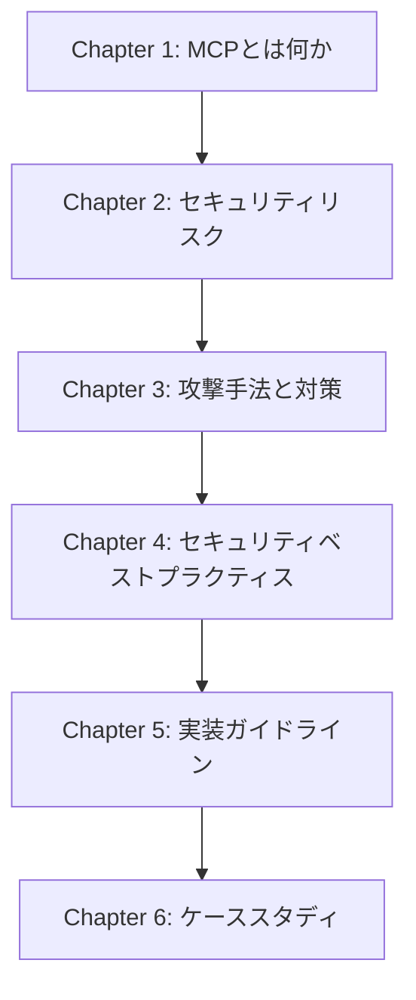
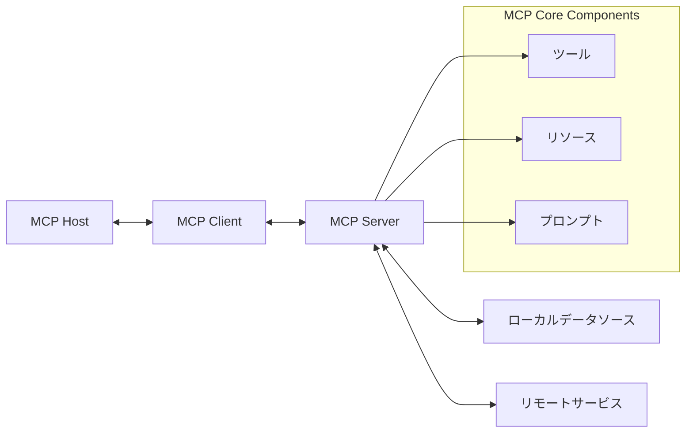
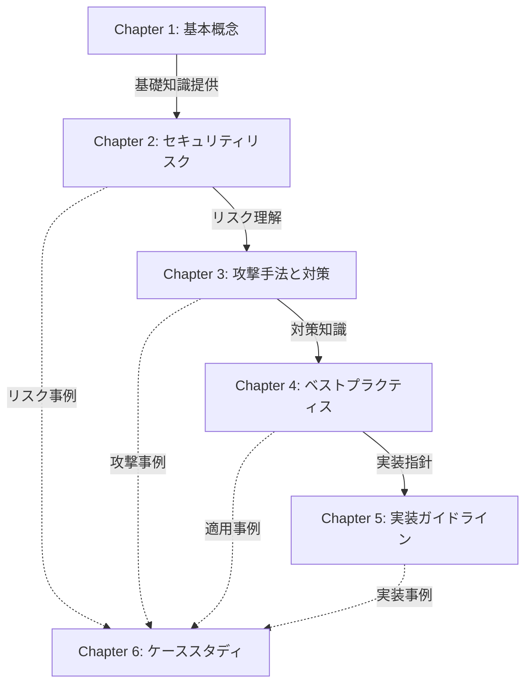
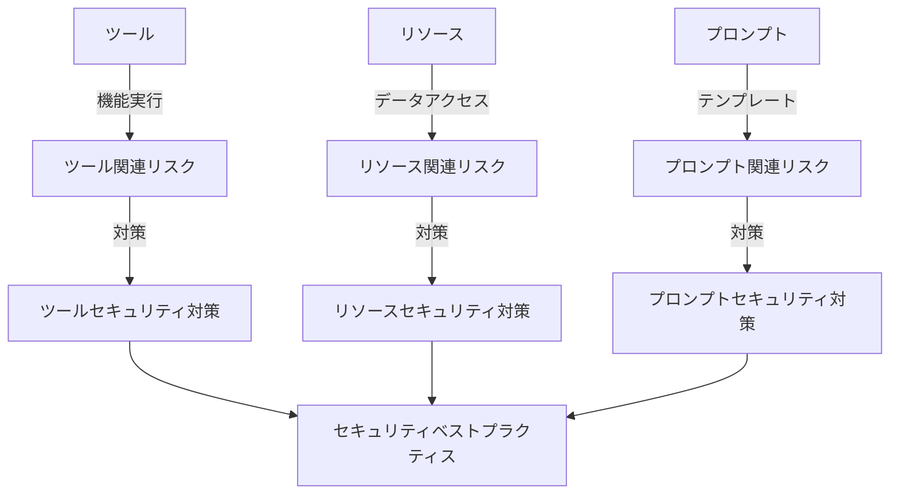

# MCP Security Book System Patterns

## システムアーキテクチャ

### 書籍の全体構造

### MCPアーキテクチャ

## 主要な技術的決定

### 1. コンテンツ構成の決定
- 理論と実践のバランス
  - 各章で理論的説明と実践的な例を組み合わせる
  - 抽象的な概念を具体的な実装例で補強する

- 段階的な知識構築
  - 基本から応用へと段階的に知識を積み上げる
  - 前の章の内容を次の章で活用する構造

### 2. セキュリティ分析アプローチ
- 多層防御の原則
  - 設計、実装、運用の各段階でのセキュリティ対策
  - 複数の防御層によるリスク軽減

- リスクベースのアプローチ
  - 脅威モデリングに基づく分析
  - リスクの影響度と発生確率に基づく優先順位付け

### 3. コードサンプル戦略
- セキュアコーディングの原則
  - 入力検証
  - 適切な認証と認可
  - エラー処理とログ記録

- 言語・フレームワーク選択
  - 主要な言語（Python, JavaScript, TypeScript）でのサンプル提供
  - フレームワーク非依存の原則的なアプローチ

## デザインパターン

### 1. 教育的デザインパターン
- **問題-解決パターン**
  - 問題提起
  - 理論的背景
  - 解決アプローチ
  - 実装例
  - 検証方法

- **比較パターン**
  - 脆弱な実装 vs セキュアな実装
  - 異なるアプローチの比較
  - トレードオフの分析

### 2. セキュリティデザインパターン
- **最小権限の原則**
  - 必要最小限の権限のみを付与
  - 過剰な権限によるリスクの回避

- **深層防御**
  - 複数の防御層の実装
  - 単一障害点の排除

- **フェイルセーフ**
  - エラー時の安全な状態への移行
  - デフォルトでの安全な設定

## コンポーネント間の関係

### 1. 章間の関連性

### 2. MCPコンポーネントとセキュリティの関係

## アーキテクチャ上の考慮点

### 1. スケーラビリティ
- 新しいセキュリティリスクや対策の追加が容易な構造
- 各章が独立して理解可能でありながら全体として一貫性を保つ

### 2. メンテナンス性
- 最新のセキュリティ情報で更新しやすい構造
- モジュール化されたコンテンツ

### 3. アクセシビリティ
- 様々な技術レベルの読者に対応
- 複雑な概念の段階的な説明
- 視覚的な図表による理解促進

## 技術スタック

### 1. ドキュメント作成
- Markdown形式での執筆
- Zennプラットフォームでの公開

### 2. 図表作成
- Mermaid記法によるダイアグラム
- 視覚的な説明の強化

### 3. コードサンプル
- GitHub リポジトリでのコード管理
- 主要言語（Python, JavaScript, TypeScript）でのサンプル提供
