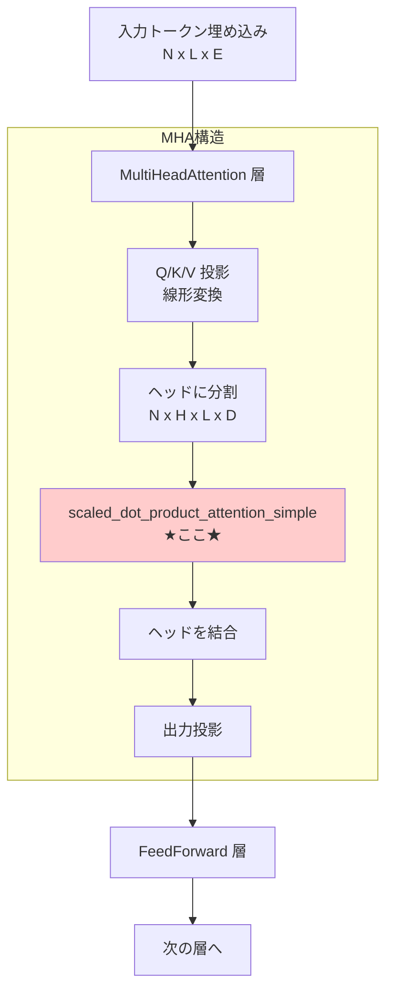
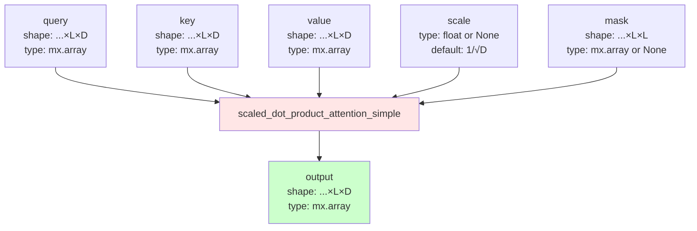
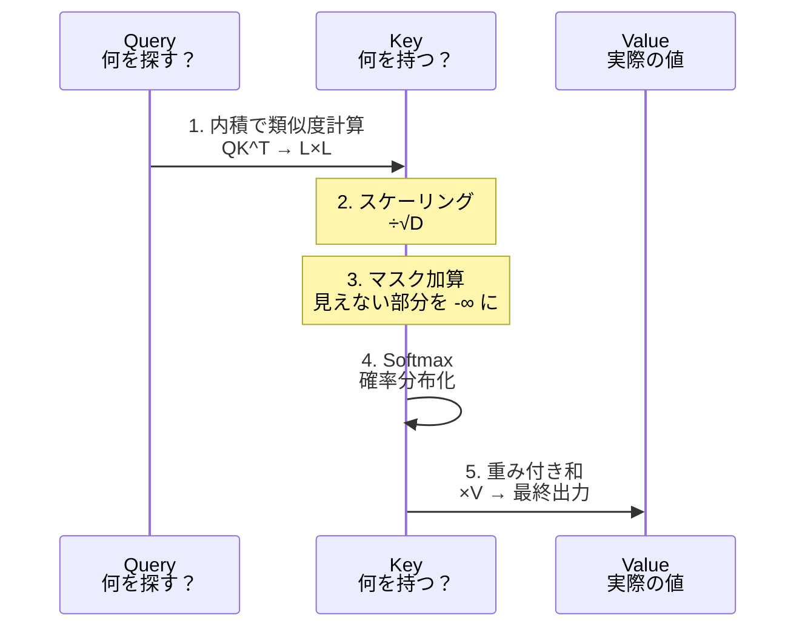
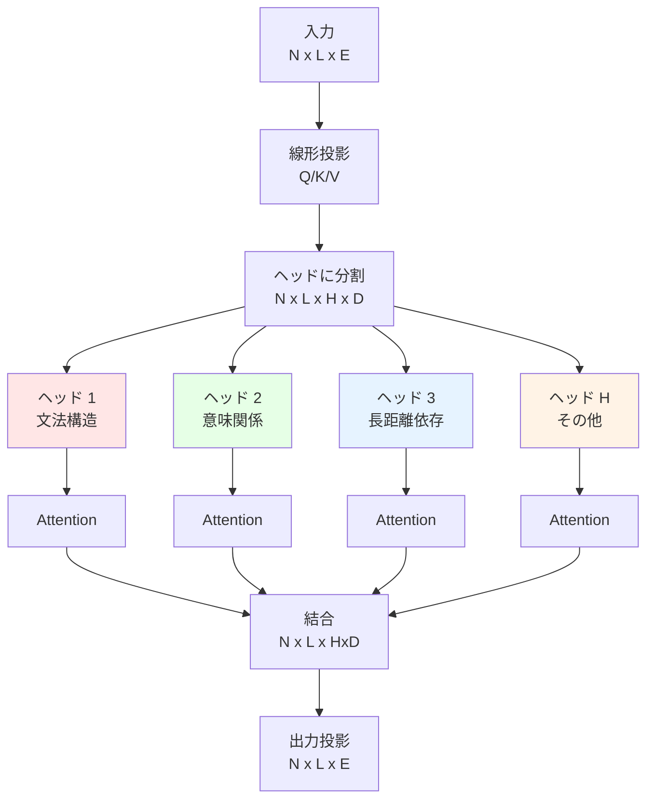
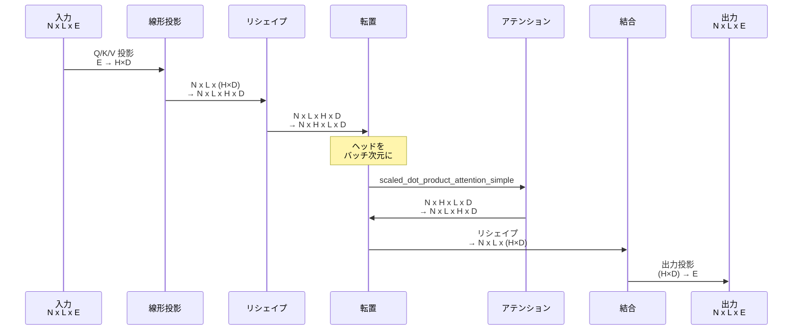
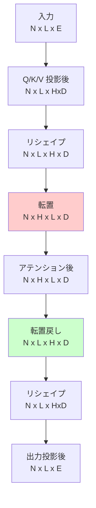

# Week 1 Day 1: アテンションとマルチヘッドアテンション

1 日目では、基本的なアテンション層とマルチヘッドアテンション層を実装します。アテンション層は、入力シーケンスを受け取り、出力を生成する際にシーケンスの異なる部分に注目します。アテンション層は、Transformer モデルの主要な構成要素です。

[📚 推奨読み物: Transformer Architecture](https://huggingface.co/learn/llm-course/chapter1/6)

テキスト生成には Qwen2 モデルを使用します。このモデルはデコーダーのみのモデルです。モデルの入力はトークン埋め込みのシーケンスで、出力は最も可能性の高い次のトークン ID です。

[📚 推奨読み物: LLM Inference, the Decode Phase](https://huggingface.co/learn/llm-course/chapter1/8)

アテンション層に戻りましょう。アテンション層はクエリ（query）、キー（key）、バリュー（value）を受け取ります。古典的な実装では、これらはすべて同じ形状を持ちます：`N.. x L x D`。

`N..` はバッチのための 0 個または複数の次元です。各バッチ内で、`L` はシーケンス長、`D` はシーケンス内の特定のヘッドに対する埋め込みの次元です。

例えば、1024 個のトークンのシーケンスがあり、各トークンが 512 次元の埋め込み（head_dim）を持つ場合、アテンション層には `N.. x 1024 x 512` の形状のテンソルを渡します。

## Task 1: `scaled_dot_product_attention_simple` を実装する

このタスクでは、スケールドドット積アテンション関数を実装します。入力テンソル（Q、K、V）は同じ次元を持つと仮定します。次のいくつかの章では、すべてのテンソルが同じ次元を持たない可能性のあるアテンションのバリアントをサポートします。

```
src/tiny_llm/attention.py
```

**📚 参考資料**

* [Annotated Transformer](https://nlp.seas.harvard.edu/annotated-transformer/)
* [PyTorch Scaled Dot Product Attention API](https://pytorch.org/docs/stable/generated/torch.nn.functional.scaled_dot_product_attention.html) （`enable_gqa=False`を仮定、dim_k=dim_v=dim_qかつH_k=H_v=H_qを仮定）
* [MLX Scaled Dot Product Attention API](https://ml-explore.github.io/mlx/build/html/python/_autosummary/mlx.core.fast.scaled_dot_product_attention.html) （dim_k=dim_v=dim_qかつH_k=H_v=H_qを仮定）
* [Attention is All You Need](https://arxiv.org/abs/1706.03762)

以下のアテンション関数に従って `scaled_dot_product_attention` を実装してください。この関数は、同じ次元の key、value、query と、オプションのマスク行列 `M` を受け取ります。

$$
  \text{Attention} = \text{softmax}(\frac{QK^T}{\sqrt{d_k}} + M)V
$$

なお、$\frac{1}{\sqrt{d_k}}$ はスケールファクターです。ユーザーは独自のスケールファクターを指定するか、デフォルトのものを使用できます。

```
L は seq_len、PyTorch API では S（source len）
D は head_dim

key: N.. x L x D
value: N.. x L x D
query: N.. x L x D
output: N.. x L x D
scale = 1/sqrt(D) 指定されていない場合
```

mlx が提供する `softmax` を使用でき、week 2 で後から実装することができます。

アテンション層は常にマルチヘッドアテンション層内で使用されるため、モデルをサービングする際の実際のテンソル形状は次のようになります：

```
key: 1 x H x L x D
value: 1 x H x L x D
query: 1 x H x L x D
output: 1 x H x L x D
mask: 1 x H x L x L
```

ただし、アテンション層は最後の 2 つの次元のみを気にします。テストケースは、バッチング次元の任意の形状をテストします。

このタスクの最後に、以下のテストに合格できるはずです：

::::details 手順補足

手元の MacBook 等に tiny-llm リポジトリをクローンし、以下を実行する。

```bash
URL=https://raw.githubusercontent.com/pdm-project/pdm/main/install-pdm.py
curl -sSL $URL | python3 -
pdm update
``` 
::::

:::message alert
初期状態では不完全な実装のためテストはエラーします。自分で参考資料を読みながら実装することでエラーを解消しましょう。
:::

```
pdm run test --week 1 --day 1 -- -k task_1
```

## Task 2: `SimpleMultiHeadAttention` を実装する

このタスクでは、マルチヘッドアテンション層を実装します。

```
src/tiny_llm/attention.py
```

**📚 参考資料**

* [Annotated Transformer](https://nlp.seas.harvard.edu/annotated-transformer/)
* [PyTorch MultiHeadAttention API](https://docs.pytorch.org/docs/2.8/generated/torch.nn.MultiheadAttention.html) （dim_k=dim_v=dim_qかつH_k=H_v=H_qを仮定）
* [MLX MultiHeadAttention API](https://ml-explore.github.io/mlx/build/html/python/nn/_autosummary/mlx.nn.MultiHeadAttention.html) （dim_k=dim_v=dim_qかつH_k=H_v=H_qを仮定）
* [The Illustrated GPT-2 (Visualizing Transformer Language Models)](https://jalammar.github.io/illustrated-gpt2) key、value、queryが何であるかをより良く理解するのに役立ちます

`SimpleMultiHeadAttention` を実装してください。この層はベクトルのバッチを受け取り、K、V、Q の重み行列を通してマッピングし、Task 1 で実装したアテンション関数を使用して結果を計算します。出力は O 重み行列を使用してマッピングする必要があります。

まず、`basics.py` の `linear` 関数を実装する必要があります。`linear` の場合、形状 `N.. x I` のテンソル、形状 `O x I` の重み行列、形状 `O` のバイアスベクトルを受け取ります。出力は形状 `N.. x O` です。`I` は入力次元、`O` は出力次元です。

`SimpleMultiHeadAttention` 層の場合、入力テンソル `query`、`key`、`value` は形状 `N x L x E` を持ち、`E` はシーケンス内の特定のトークンの埋め込みの次元です。`K/Q/V` 重み行列は、テンソルをそれぞれ key、value、query に個別にマッピングし、次元 `E` は `H x D` のサイズの次元にマッピングされます。これは、トークン埋め込みが `H` 個のヘッドにマッピングされ、各ヘッドの次元が `D` であることを意味します。テンソルを直接リシェイプして、`H x D` 次元を `H` と `D` の 2 つの次元に分割し、トークンの `H` 個のヘッドを取得できます。

これで、key、value、query のそれぞれについて形状 `N.. x L x H x D` のテンソルが得られます。アテンション関数を適用するには、まずそれらを形状 `N.. x H x L x D` に転置する必要があります。

* これにより、各アテンションヘッドが独立したバッチになり、シーケンス `L` 全体で各ヘッドに対してアテンションを個別に計算できます。
* `H` を `L` の後ろに保持した場合、アテンション計算はヘッドとシーケンス次元を混合してしまい、これは望ましくありません — 各ヘッドは、独自のサブスペース内のトークン間の関係のみに焦点を当てるべきです。

アテンション関数は、トークンの各ヘッドの出力を生成します。その後、それを `N.. x L x H x D` に転置して戻し、すべてのヘッドが形状 `N.. x L x (H x D)` でマージされるようにリシェイプできます。出力重み行列を通してマッピングして、最終的な出力を取得します。

```
E は hidden_size または embed_dim または dims または model_dim
H は num_heads
D は head_dim
L は seq_len、PyTorch API では S（source len）

w_q/w_k/w_v: (H x D) x E
output/input: N x L x E
w_o: E x (H x D)
```

タスクの最後に、以下のテストに合格できるはずです：

```
pdm run test --week 1 --day 1 -- -k task_2
```

1 日分のすべてのテストを実行するには：

```
pdm run test --week 1 --day 1
```

::::details 解答
```bash
cd src && cp tiny_llm_ref/attention.py tiny_llm/attention.py && cp tiny_llm_ref/basics.py tiny_llm/basics.py
```
::::

# Task 1 の解説

このセクションでは、Task 1 の `scaled_dot_product_attention_simple` 関数について、全体像から実装の詳細まで段階的に解説します。

::::details Task 1 の解説

## Task 1 Part 1: アーキテクチャにおける位置と役割

### Transformer における位置

`scaled_dot_product_attention_simple` 関数は、Transformer アーキテクチャの中核を担うアテンション計算を実行します。以下の図は、この関数が Transformer の全体構造のどこに位置するかを示しています。



### 関数の役割

`scaled_dot_product_attention_simple` は、アテンション計算の中核を担う関数です。この関数は Query、Key、Value という 3 つのテンソルを受け取り、「どのトークンがどのトークンに注目すべきか」を計算します。計算された注目度（アテンション重み）に基づいて Value を集約し、コンテキストを考慮した出力を生成します。この関数は MultiHeadAttention 層内で各ヘッドごとに独立して呼び出され、トークン間の関係性を数値化する役割を果たします。

### なくなると何が困るのか

この関数がなければ、Transformer はトークン間の関係性を理解できなくなります。その結果、以下の能力が完全に失われます。

文脈理解能力が失われます。例えば「今日は良い天気だ」という文で、「良い」が「天気」を修飾していることを理解できません。長距離依存の捉え方も不可能になり、文の最初の単語と最後の単語の関係を捉えられなくなります。また、動的な重み付けができなくなるため、各トークンの重要度を文脈に応じて変化させることができません。

## Task 1 Part 2: 実装仕様

### あなたがやるべきこと

以下の数式を MLX で実装することが求められています。

$$
\text{Attention}(Q, K, V) = \text{softmax}\left(\frac{QK^T}{\sqrt{d_k}} + M\right)V
$$

実装は 5 つのステップで構成されます。まず Q と K の転置行列の積を計算して類似度を求めます。次にその結果を √d_k でスケーリングします（scale パラメータが None の場合）。オプショナルでマスクを加算します。Softmax 関数を適用して確率分布に変換します。最後に Value と乗算して最終出力を得ます。

### 関数の入出力仕様



入力パラメータの詳細は以下の通りです。`...` はバッチ次元を表し、0 個以上の任意の次元を持つことができます。`L` はシーケンス長（sequence length）を表します。`D` はヘッドの次元（head dimension）を表します。マスクは加算形式で提供され、値が -∞ の部分は Softmax 後に 0 となり、そのトークンを無視する効果があります。

### タスク説明の補足

元のタスク説明は、入力の前提として Q、K、V がすべて同じ形状（...×L×D）を持つこと、そしてマスクは加算可能な float 配列（-∞ を含む）であることを述べています。

処理の流れは以下のシーケンスで表現できます。



いくつかのキーポイントがあります。`N..` 表記はバッチ次元の柔軟性を示しており、0 個、1 個、複数個すべてに対応します。実際の使用時は MultiHeadAttention 内で形状は `N x H x L x D` となります。この関数自体は最後の 2 次元（L×D）のみを処理します。

## Task 1 Part 3: 模範解答の解説

### コア実装の分析

模範解答のコードは以下の通りです。

```python
def scaled_dot_product_attention_simple(
    query: mx.array,
    key: mx.array,
    value: mx.array,
    scale: float | None = None,
    mask: mx.array | None = None,
) -> mx.array:
    # 1. スケール因子の計算
    factor = mx.rsqrt(query.shape[-1]) if scale is None else scale
    
    # 2. スコア計算：QK^T × scale
    scores = mx.matmul(query, key.swapaxes(-2, -1)) * factor
    
    # 3. マスク適用
    if mask is not None:
        scores = scores + mask
    
    # 4. Softmax + Value の積
    return mx.matmul(softmax(scores, axis=-1), value)
```

この実装にはいくつかの重要なテクニックが含まれています。

### mx.rsqrt() の使用

```python
factor = mx.rsqrt(query.shape[-1])  # 1/√D を効率的に計算
```

このコードは `1.0 / mx.sqrt(x)` と同じ結果を得ますが、より高速に動作します。GPU での除算と平方根の逆数計算は専用命令で最適化されているため、`rsqrt` を使用することでパフォーマンスが向上します。

### swapaxes(-2, -1) による転置

```python
key.swapaxes(-2, -1)  # 最後の 2 次元を入れ替え
```

この操作は Key テンソルの最後の 2 次元を入れ替えます。入力が `...×L×D` の場合、出力は `...×D×L` となります。重要なのは、任意のバッチ次元（`...` 部分）には影響を与えず、最後の 2 次元のみを転置することです。これにより、行列積 `query @ key.T` の形状が `...×L×L` となり、各トークンペアの類似度スコアが得られます。

### スケーリングとスコア計算の一体化

```python
scores = mx.matmul(query, key.swapaxes(-2, -1)) * factor
```

このコードは行列積とスケーリングを同じ行で実行しています。別々に書くことも可能ですが、一体化することでコードが簡潔になり、メモリ効率も向上します。

### 条件付きマスク適用

```python
if mask is not None:
    scores = scores + mask
```

マスクはオプショナルなパラメータであり、提供された場合のみ適用されます。マスクの値は通常、見える部分が 0、見えない部分が -∞ です。加算後に Softmax を適用すると、-∞ の部分は確率 0 に変換されます。

### Softmax と Value の積

```python
return mx.matmul(softmax(scores, axis=-1), value)
```

最後のステップでは、Softmax を適用してアテンション重みを得た後、Value と行列積を計算します。`axis=-1` は最後の次元（各行）に対して Softmax を適用することを意味します。これにより、各トークンについて、他のトークンへの注目度の合計が 1 になります。

### 実装のポイント

この実装の優れている点は、シンプルさと効率性のバランスにあります。わずか 4 行のコアロジックで、Transformer の最も重要な計算を実現しています。MLX の高レベル API（matmul、swapaxes、softmax）を適切に組み合わせることで、可読性を保ちながら高性能な実装を達成しています。

また、任意のバッチ次元に対応できる柔軟性も重要です。`...×L×D` という表記により、バッチサイズ 1 でも、複数のバッチ次元を持つ場合でも、同じコードで処理できます。これは MLX のブロードキャスト機能により実現されています。

::::

# Task 2 の解説

このセクションでは、Task 2 の `SimpleMultiHeadAttention` クラスと `linear` 関数について、全体像から実装の詳細まで段階的に解説します。

::::details Task 2 の解説

## Task 2 Part 1: MultiHeadAttention の役割と構造

### MultiHeadAttention とは

MultiHeadAttention（マルチヘッドアテンション）は、複数の「視点」から同時に情報を見る仕組みです。Task 1 で実装したシングルアテンションを複数並列に実行し、それぞれの結果を統合することで、より豊かな表現を獲得します。



### なぜ複数のヘッドが必要なのか

シングルヘッドでは、アテンションは 1 つの視点からしか情報を見ることができません。マルチヘッドを使用することで、各ヘッドが異なる言語的特徴に注目できます。例えば、ヘッド 1 は文法的な関係（主語と述語）に、ヘッド 2 は意味的な類似性に、ヘッド 3 は長距離の依存関係に注目する、といった具合です。この並列化により、モデルは文章をより多角的に理解できます。

## Task 2 Part 2: 実装仕様

### あなたがやるべきこと

2 つの関数/クラスを実装する必要があります。

**1. linear 関数（basics.py）**

線形変換を実行する関数です。行列積とバイアス加算を行います。

```python
def linear(
    x: mx.array,        # 入力: N.. x I
    weight: mx.array,   # 重み: O x I
    bias: mx.array | None = None  # バイアス: O（オプショナル）
) -> mx.array:          # 出力: N.. x O
```

**2. SimpleMultiHeadAttention クラス（attention.py）**

マルチヘッドアテンション層を実装するクラスです。

```python
class SimpleMultiHeadAttention:
    def __init__(self, hidden_size, num_heads, wq, wk, wv, wo):
        # 初期化：パラメータを保存
        
    def __call__(self, query, key, value, mask=None):
        # フォワードパス：実際の計算
```

### 処理の流れ



### 形状変換の詳細

重要な形状変換を段階的に説明します。



## Task 2 Part 3: 模範解答の解説

### linear 関数の実装

この関数は存在しないため、模範解答を推測します。基本的な線形変換の実装は以下の通りです。

```python
def linear(
    x: mx.array,
    weight: mx.array,
    bias: mx.array | None = None
) -> mx.array:
    # 行列積: (..., I) @ (O, I).T = (..., O)
    output = mx.matmul(x, weight.T)
    
    # バイアスがあれば加算
    if bias is not None:
        output = output + bias
    
    return output
```

重要なポイントは、`weight` を転置してから行列積を計算することです。これは PyTorch や MLX の慣例で、重みは `(出力次元, 入力次元)` の形状で保存されます。

### SimpleMultiHeadAttention の実装

模範解答のコードを解析します。

```python
class SimpleMultiHeadAttention:
    def __init__(
        self,
        hidden_size: int,
        num_heads: int,
        wq: mx.array,
        wk: mx.array,
        wv: mx.array,
        wo: mx.array,
    ):
        self.hidden_size = hidden_size
        self.num_heads = num_heads
        assert hidden_size % num_heads == 0
        self.head_dim = hidden_size // num_heads
        self.scale = mx.rsqrt(self.head_dim)
        assert wq.shape == (hidden_size, num_heads * self.head_dim)
        assert wk.shape == (hidden_size, num_heads * self.head_dim)
        assert wv.shape == (hidden_size, num_heads * self.head_dim)
        assert wo.shape == (num_heads * self.head_dim, hidden_size)
        self.wq = wq
        self.wk = wk
        self.wv = wv
        self.wo = wo
```

#### 初期化の解説

**パラメータの計算と検証**：

`head_dim` は各ヘッドの次元で、`hidden_size // num_heads` で計算されます。例えば、`hidden_size=768`、`num_heads=12` の場合、`head_dim=64` となります。

`scale` はアテンション計算用のスケール因子で、`1 / √head_dim` です。これを事前計算しておくことで、フォワードパス時の計算を効率化できます。

**重み行列の形状確認**：

各 assert 文は、渡された重み行列が正しい形状を持つことを確認します。`wq/wk/wv` は `(hidden_size, num_heads * head_dim)` の形状で、入力を各ヘッドに投影します。`wo` は `(num_heads * head_dim, hidden_size)` の形状で、結合されたヘッドを元の次元に戻します。

#### フォワードパスの実装

```python
def __call__(
    self,
    query: mx.array,
    key: mx.array,
    value: mx.array,
    mask: mx.array | None = None,
) -> mx.array:
    N, L, _ = query.shape
    assert query.shape == key.shape == value.shape
    
    # Q/K/V の投影とリシェイプ
    projection_q = (
        linear(query, self.wq)
        .reshape(N, L, self.num_heads, self.head_dim)
        .transpose(0, 2, 1, 3)
    )
    projection_k = (
        linear(key, self.wk)
        .reshape(N, L, self.num_heads, self.head_dim)
        .transpose(0, 2, 1, 3)
    )
    projection_v = (
        linear(value, self.wv)
        .reshape(N, L, self.num_heads, self.head_dim)
        .transpose(0, 2, 1, 3)
    )
    
    # アテンション計算
    x = scaled_dot_product_attention_simple(
        projection_q,
        projection_k,
        projection_v,
        scale=self.scale,
        mask=mask,
    )
    
    # 転置して結合
    x = x.transpose(0, 2, 1, 3).reshape(N, L, self.hidden_size)
    
    # 出力投影
    return linear(x, self.wo)
```

#### 各ステップの詳細解説

**1. Q/K/V の投影**

```python
linear(query, self.wq)  # (N, L, E) @ (E, H×D).T = (N, L, H×D)
```

線形変換により、入力の埋め込み次元 `E` を `H×D` に変換します。

**2. リシェイプ**

```python
.reshape(N, L, self.num_heads, self.head_dim)  # (N, L, H×D) → (N, L, H, D)
```

`H×D` の次元を `H` と `D` に分割し、ヘッドを明示的に表現します。

**3. 転置**

```python
.transpose(0, 2, 1, 3)  # (N, L, H, D) → (N, H, L, D)
```

この転置が最も重要です。ヘッド次元 `H` をバッチ次元の直後に移動することで、各ヘッドが独立したバッチとして処理されます。結果として、`scaled_dot_product_attention_simple` は `N×H` 個の独立したアテンション計算を並列実行できます。

**転置が必要な理由**：

アテンション関数は最後の 2 次元（`L×D`）に対して動作します。`(N, H, L, D)` の形状にすることで、各 `(N, H)` の組み合わせについて独立に `L×D` のアテンションを計算できます。もし `(N, L, H, D)` のままだと、`L` と `H` が混ざってしまい、正しい計算ができません。

**4. アテンション計算**

```python
x = scaled_dot_product_attention_simple(
    projection_q,  # (N, H, L, D)
    projection_k,  # (N, H, L, D)
    projection_v,  # (N, H, L, D)
    scale=self.scale,
    mask=mask,
)
# 出力: (N, H, L, D)
```

Task 1 で実装した関数を使用します。`N×H` 個のアテンションが並列計算されます。

**5. 転置して戻す**

```python
x.transpose(0, 2, 1, 3)  # (N, H, L, D) → (N, L, H, D)
```

アテンション計算後、元の順序に戻します。

**6. ヘッドの結合**

```python
.reshape(N, L, self.hidden_size)  # (N, L, H, D) → (N, L, H×D)
```

すべてのヘッドを 1 つの次元に結合します。`H×D = hidden_size` です。

**7. 出力投影**

```python
linear(x, self.wo)  # (N, L, H×D) @ (E, H×D).T = (N, L, E)
```

最後の線形変換で、元の埋め込み次元 `E` に戻します。

### 実装のポイント

**メソッドチェーン**の活用により、複数の操作（linear、reshape、transpose）を 1 つの式で記述しています。これによりコードが簡潔になり、中間変数が不要になります。

**transpose の軸指定**として `(0, 2, 1, 3)` を使用することで、必要な次元のみを入れ替えます。この順序により、`(N, L, H, D)` が `(N, H, L, D)` に変換されます。

**事前計算された scale** を使用することで、フォワードパス時の計算コストを削減しています。`__init__` で一度だけ計算し、`__call__` では再利用します。

**バッチ次元の保持**により、入力のバッチサイズ `N` はすべての計算を通じて保持されます。これにより、任意のバッチサイズに対応できます。

この実装は、効率性と可読性のバランスが取れた優れた設計です。各ステップが明確に分かれており、デバッグやカスタマイズが容易です。

::::