# Week 1 Day 1: アテンションとマルチヘッドアテンション

1 日目では、基本的なアテンション層とマルチヘッドアテンション層を実装します。アテンション層は、入力シーケンスを受け取り、出力を生成する際にシーケンスの異なる部分に注目します。アテンション層は、Transformer モデルの主要な構成要素です。

[📚 推奨読み物: Transformer Architecture](https://huggingface.co/learn/llm-course/chapter1/6)

テキスト生成には Qwen2 モデルを使用します。このモデルはデコーダーのみのモデルです。モデルの入力はトークン埋め込みのシーケンスで、出力は最も可能性の高い次のトークン ID です。

[📚 推奨読み物: LLM Inference, the Decode Phase](https://huggingface.co/learn/llm-course/chapter1/8)

アテンション層に戻りましょう。アテンション層はクエリ（query）、キー（key）、バリュー（value）を受け取ります。古典的な実装では、これらはすべて同じ形状を持ちます：`N.. x L x D`。

`N..` はバッチのための 0 個または複数の次元です。各バッチ内で、`L` はシーケンス長、`D` はシーケンス内の特定のヘッドに対する埋め込みの次元です。

例えば、1024 個のトークンのシーケンスがあり、各トークンが 512 次元の埋め込み（head_dim）を持つ場合、アテンション層には `N.. x 1024 x 512` の形状のテンソルを渡します。

## Task 1: `scaled_dot_product_attention_simple` を実装する

このタスクでは、スケールドドット積アテンション関数を実装します。入力テンソル（Q、K、V）は同じ次元を持つと仮定します。次のいくつかの章では、すべてのテンソルが同じ次元を持たない可能性のあるアテンションのバリアントをサポートします。

```
src/tiny_llm/attention.py
```

**📚 参考資料**

* [Annotated Transformer](https://nlp.seas.harvard.edu/annotated-transformer/)
* [PyTorch Scaled Dot Product Attention API](https://pytorch.org/docs/stable/generated/torch.nn.functional.scaled_dot_product_attention.html) （`enable_gqa=False`を仮定、dim_k=dim_v=dim_qかつH_k=H_v=H_qを仮定）
* [MLX Scaled Dot Product Attention API](https://ml-explore.github.io/mlx/build/html/python/_autosummary/mlx.core.fast.scaled_dot_product_attention.html) （dim_k=dim_v=dim_qかつH_k=H_v=H_qを仮定）
* [Attention is All You Need](https://arxiv.org/abs/1706.03762)

以下のアテンション関数に従って `scaled_dot_product_attention` を実装してください。この関数は、同じ次元の key、value、query と、オプションのマスク行列 `M` を受け取ります。

$$
  \text{Attention} = \text{softmax}(\frac{QK^T}{\sqrt{d_k}} + M)V
$$

なお、$\frac{1}{\sqrt{d_k}}$ はスケールファクターです。ユーザーは独自のスケールファクターを指定するか、デフォルトのものを使用できます。

```
L は seq_len、PyTorch API では S（source len）
D は head_dim

key: N.. x L x D
value: N.. x L x D
query: N.. x L x D
output: N.. x L x D
scale = 1/sqrt(D) 指定されていない場合
```

mlx が提供する `softmax` を使用でき、week 2 で後から実装することができます。

アテンション層は常にマルチヘッドアテンション層内で使用されるため、モデルをサービングする際の実際のテンソル形状は次のようになります：

```
key: 1 x H x L x D
value: 1 x H x L x D
query: 1 x H x L x D
output: 1 x H x L x D
mask: 1 x H x L x L
```

ただし、アテンション層は最後の 2 つの次元のみを気にします。テストケースは、バッチング次元の任意の形状をテストします。

このタスクの最後に、以下のテストに合格できるはずです：

```
pdm run test --week 1 --day 1 -- -k task_1
```

## Task 2: `SimpleMultiHeadAttention` を実装する

このタスクでは、マルチヘッドアテンション層を実装します。

```
src/tiny_llm/attention.py
```

**📚 参考資料**

* [Annotated Transformer](https://nlp.seas.harvard.edu/annotated-transformer/)
* [PyTorch MultiHeadAttention API](https://docs.pytorch.org/docs/2.8/generated/torch.nn.MultiheadAttention.html) （dim_k=dim_v=dim_qかつH_k=H_v=H_qを仮定）
* [MLX MultiHeadAttention API](https://ml-explore.github.io/mlx/build/html/python/nn/_autosummary/mlx.nn.MultiHeadAttention.html) （dim_k=dim_v=dim_qかつH_k=H_v=H_qを仮定）
* [The Illustrated GPT-2 (Visualizing Transformer Language Models)](https://jalammar.github.io/illustrated-gpt2) key、value、queryが何であるかをより良く理解するのに役立ちます

`SimpleMultiHeadAttention` を実装してください。この層はベクトルのバッチを受け取り、K、V、Q の重み行列を通してマッピングし、Task 1 で実装したアテンション関数を使用して結果を計算します。出力は O 重み行列を使用してマッピングする必要があります。

まず、`basics.py` の `linear` 関数を実装する必要があります。`linear` の場合、形状 `N.. x I` のテンソル、形状 `O x I` の重み行列、形状 `O` のバイアスベクトルを受け取ります。出力は形状 `N.. x O` です。`I` は入力次元、`O` は出力次元です。

`SimpleMultiHeadAttention` 層の場合、入力テンソル `query`、`key`、`value` は形状 `N x L x E` を持ち、`E` はシーケンス内の特定のトークンの埋め込みの次元です。`K/Q/V` 重み行列は、テンソルをそれぞれ key、value、query に個別にマッピングし、次元 `E` は `H x D` のサイズの次元にマッピングされます。これは、トークン埋め込みが `H` 個のヘッドにマッピングされ、各ヘッドの次元が `D` であることを意味します。テンソルを直接リシェイプして、`H x D` 次元を `H` と `D` の 2 つの次元に分割し、トークンの `H` 個のヘッドを取得できます。

これで、key、value、query のそれぞれについて形状 `N.. x L x H x D` のテンソルが得られます。アテンション関数を適用するには、まずそれらを形状 `N.. x H x L x D` に転置する必要があります。

* これにより、各アテンションヘッドが独立したバッチになり、シーケンス `L` 全体で各ヘッドに対してアテンションを個別に計算できます。
* `H` を `L` の後ろに保持した場合、アテンション計算はヘッドとシーケンス次元を混合してしまい、これは望ましくありません — 各ヘッドは、独自のサブスペース内のトークン間の関係のみに焦点を当てるべきです。

アテンション関数は、トークンの各ヘッドの出力を生成します。その後、それを `N.. x L x H x D` に転置して戻し、すべてのヘッドが形状 `N.. x L x (H x D)` でマージされるようにリシェイプできます。出力重み行列を通してマッピングして、最終的な出力を取得します。

```
E は hidden_size または embed_dim または dims または model_dim
H は num_heads
D は head_dim
L は seq_len、PyTorch API では S（source len）

w_q/w_k/w_v: (H x D) x E
output/input: N x L x E
w_o: E x (H x D)
```

タスクの最後に、以下のテストに合格できるはずです：

```
pdm run test --week 1 --day 1 -- -k task_2
```

1 日分のすべてのテストを実行するには：

```
pdm run test --week 1 --day 1
```

# 座学

このセクションでは、実装に入る前にアテンションメカニズムと Transformer アーキテクチャの理論的背景を学びます。推奨読み物の内容を基に、わかりやすく整理しました。

## Transformer の 3 つのアーキテクチャ

Transformer モデルには、主に 3 つのアーキテクチャバリアントがあります。それぞれ異なる用途に最適化されています。

```mermaid
graph TB
    subgraph "Encoder-only（エンコーダーのみ）"
        E1[入力テキスト] --> E2[双方向アテンション<br/>全トークンを同時に見る]
        E2 --> E3[文章の深い理解]
        E3 --> E4[分類・抽出タスク]
        style E2 fill:#e1f5ff
    end
    
    subgraph "Decoder-only（デコーダーのみ）"
        D1[入力テキスト] --> D2[単方向アテンション<br/>過去のトークンのみ]
        D2 --> D3[次トークン予測]
        D3 --> D4[テキスト生成]
        style D2 fill:#fff3e1
    end
    
    subgraph "Encoder-Decoder（両方）"
        ED1[入力テキスト] --> ED2[エンコーダー<br/>双方向理解]
        ED2 --> ED3[デコーダー<br/>単方向生成]
        ED3 --> ED4[変換タスク]
        style ED2 fill:#e1f5ff
        style ED3 fill:#fff3e1
    end
```

### 1. Encoder-only モデル（エンコーダーのみ）

Encoder-only モデルは、**双方向アテンション**を使用して文章全体のすべての単語を同時に見ることができるアーキテクチャです。このアプローチにより、文章の深い理解に優れた性能を発揮します。別名として **auto-encoding models**（自己符号化モデル）とも呼ばれ、事前学習では文章の一部をマスク（隠して）し、元の文章を復元するタスクで学習します。

このモデルは、文章分類（感情分析やトピック分類）、固有表現認識（NER）、単語分類タスク、抽出型質問応答といったタスクに特に適しています。代表的なモデルとして BERT、DistilBERT、ModernBERT、RoBERTa などがあります。

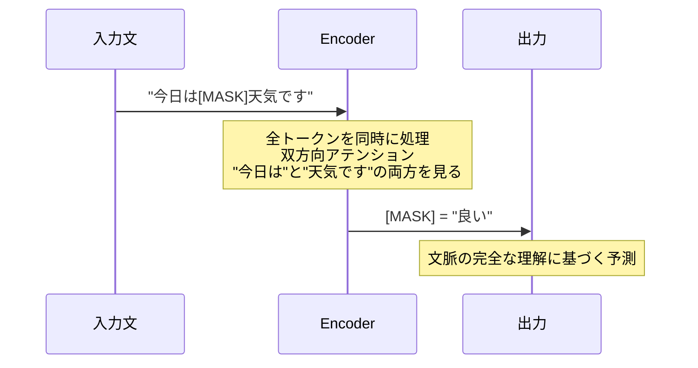

### 2. Decoder-only モデル（デコーダーのみ）

Decoder-only モデルは、**単方向アテンション**を採用しており、各単語はそれより前の単語のみを参照できる仕組みになっています。このアーキテクチャは次のトークンを予測することで学習し、別名として **auto-regressive models**（自己回帰モデル）とも呼ばれます。事前学習では文章の続きを予測するタスクで訓練されます。

このモデルは、テキスト生成（創作や対話）、コード生成、質問応答（生成型）といったタスクに特に優れています。代表的なモデルとして、Hugging Face SmolLM シリーズ、Meta's Llama シリーズ、Google's Gemma シリーズ、DeepSeek's V3、GPT シリーズ、そして本コースで使用する Qwen2 などがあります。

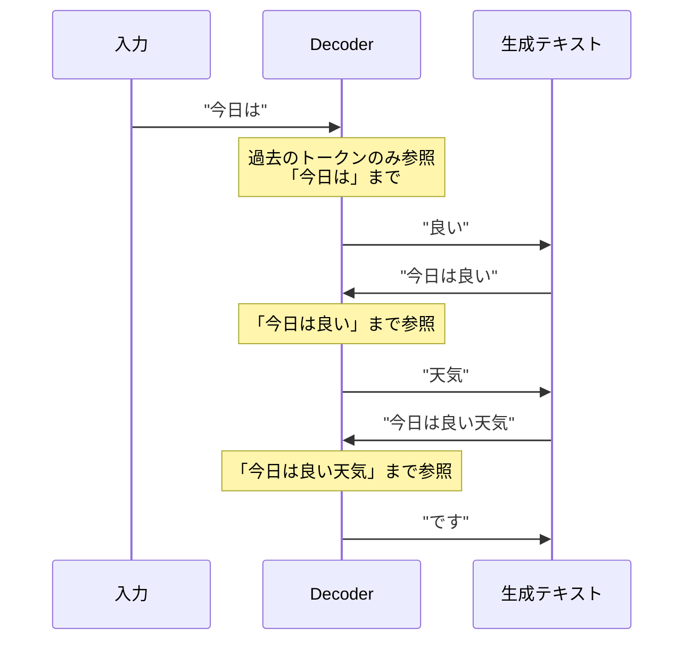

**現代の LLM（Large Language Models）について**：

ほとんどの現代的な大規模言語モデルは、**Decoder-only アーキテクチャ**を採用しています。これらのモデルは通常 2 段階で訓練されます。第 1 段階の**事前学習（Pretraining）**では、大量のテキストデータを使用して次トークン予測を学習します。第 2 段階の**指示チューニング（Instruction Tuning）**では、モデルが指示に従って有用な応答を生成できるように微調整を行います。この 2 段階のアプローチにより、現代の LLM は幅広いタスクに対応できる汎用性を獲得しています。

**現代のLLMの主な能力**：

| 能力 | 説明 | 例 |
|-----|------|-----|
| テキスト生成 | 文脈に沿った自然な文章作成 | エッセイ、物語、メール作成 |
| 要約 | 長文を短く要約 | レポートの要約 |
| 翻訳 | 言語間の翻訳 | 英語から日本語へ |
| 質問応答 | 事実的な質問への回答 | "フランスの首都は？" |
| コード生成 | プログラムコードの作成 | 関数の自動生成 |
| 推論 | 段階的な問題解決 | 数学問題や論理パズル |
| Few-shot学習 | 少数の例から学習 | 2-3例で分類タスク実行 |

### 3. Encoder-Decoder モデル（Sequence-to-Sequence）

Encoder-Decoder モデルは、エンコーダーとデコーダーの**両方**を組み合わせたアーキテクチャです。エンコーダー部分は双方向アテンションを使用して入力を深く理解し、デコーダー部分は単方向アテンションで適切な出力を生成します。事前学習では、文章の一部を破損させてそれを復元するタスクで訓練されます。

このモデルは、機械翻訳、テキスト要約、文法修正、構造化データから自然言語への変換、生成型質問応答といったタスクに特に適しています。代表的なモデルとして BART、T5、mBART、Marian（翻訳専用）などがあります。

```mermaid
graph LR
    subgraph "Encoder（理解）"
        I[入力文<br/>"The cat is on the mat"] --> E[双方向<br/>アテンション<br/>全単語を分析]
    end
    
    subgraph "Decoder（生成）"
        E --> D[単方向<br/>アテンション<br/>逐次生成]
        D --> O[出力文<br/>"猫がマットの上にいる"]
    end
    
    style E fill:#e1f5ff
    style D fill:#fff3e1
```

**実用例**：

| 応用 | 説明 | 例モデル |
|-----|------|---------|
| 機械翻訳 | 言語間のテキスト変換 | Marian, T5 |
| テキスト要約 | 長文の簡潔な要約 | BART, T5 |
| データ→テキスト | 構造化データを自然言語に | T5 |
| 文法修正 | 文法エラーの訂正 | T5 |
| 質問応答 | コンテキストに基づく回答生成 | BART, T5 |

## アテンションメカニズムの役割

**アテンションの本質**：文章内のどの単語が重要かを動的に判断する仕組みです。

### なぜアテンションが重要なのか

例文として「**フランス**の首都は___」という文を考えてみましょう。この文で次の単語を予測する際、すべての単語が同じ重みを持つわけではありません。具体的には、「フランス」は地理的な場所を示す重要度が最も高い単語（★★★★★）であり、「首都」も求める情報の種類を示す重要な単語（★★★★☆）です。一方、「の」や「は」といった文法的な助詞は重要度が低く（★☆☆☆☆）、予測にほとんど影響を与えません。アテンションメカニズムは、このような各単語の重要度を自動的に計算し、適切に重み付けを行います。

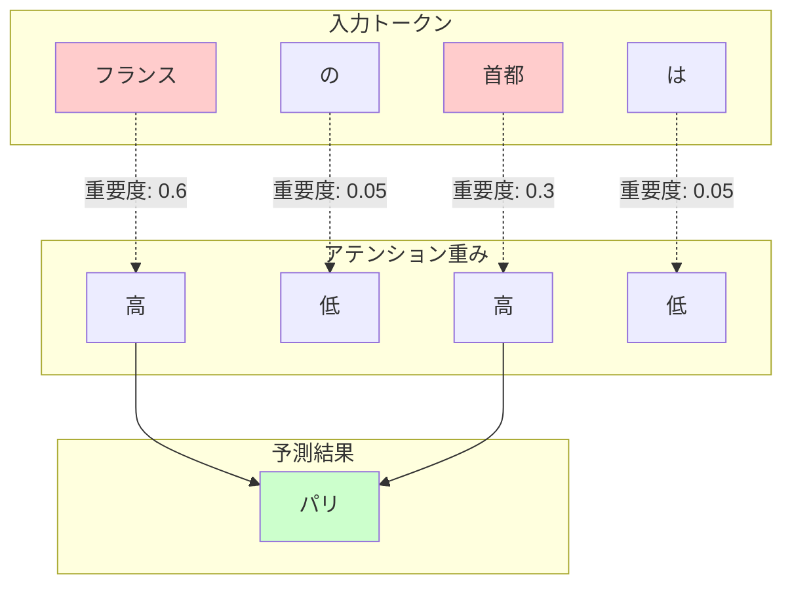

### スケールドドット積アテンション

アテンションの数学的な定義：

$$
\text{Attention}(Q, K, V) = \text{softmax}\left(\frac{QK^T}{\sqrt{d_k}}\right)V
$$

**各要素の直感的な理解**：

- **Q (Query)**：「何を探しているのか？」（質問）
- **K (Key)**：「何を持っているのか？」（鍵）
- **V (Value)**：「実際の情報は何か？」（値）

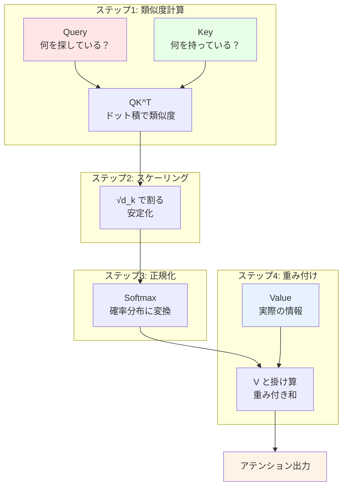

**なぜスケーリング（√d_k で割る）が必要？**

スケーリングが必要な理由を理解するために、まず問題点を確認しましょう。`d_k`（キーの次元）が大きくなると、内積 `QK^T` の値も大きくなりすぎるという問題が発生します。この大きすぎる値が Softmax 関数に入力されると、出力が極端な値（0 か 1）に偏ってしまい、アテンションの柔軟性が失われます。この問題を解決するために、`√d_k` で割るスケーリングを適用することで値を適度な範囲に収めます。その結果、より滑らかで適切なアテンション分布が得られ、モデルの表現力が向上します。

**具体例**：

d_k = 64 の場合：
- スケーリングなし：QK^T が -100 〜 100 の範囲 → Softmax後は [0.0, 0.0, ..., 1.0]（極端）
- √64 = 8 でスケーリング：-12.5 〜 12.5 の範囲 → Softmax後は [0.1, 0.2, ..., 0.3]（バランス良い）

## LLM推論の2段階プロセス

テキスト生成は、**Prefillフェーズ**と**Decodeフェーズ**の2段階で行われます。これは料理に例えると、材料の準備（Prefill）と調理（Decode）に似ています。

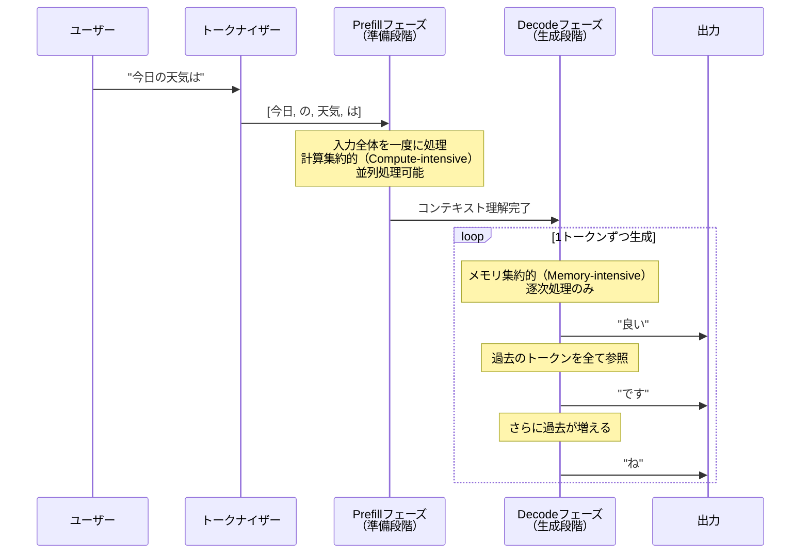

### Prefill フェーズ（準備段階）

Prefill フェーズでは、入力テキストをモデルが理解できる形式に変換し、初期処理を行います。まず**トークン化（Tokenization）**のステップで、入力テキストを基本単位（トークン）に分割します（例："今日は良い天気" → ["今日", "は", "良い", "天気"]）。次に**埋め込み変換（Embedding Conversion）**で、各トークンを数値ベクトルに変換し、単語の意味を数学的に表現します。最後の**初期処理（Initial Processing）**では、全ニューラルネットワーク層を通してこれらのベクトルを処理し、入力全体の文脈を深く理解します。

**特徴**：

| 特性 | 説明 |
|-----|------|
| 計算方式 | 並列処理可能（全トークンを同時に） |
| リソース | 計算集約的（Compute-intensive） |
| 処理時間 | 入力長に比例 |
| メトリクス | **TTFT (Time to First Token)** に影響 |

**比喩**：
- 本を読む前に、全ページをざっと眺めて内容を把握する段階

### Decode フェーズ（生成段階）

Decode フェーズでは、実際のテキスト生成が 1 トークンずつ行われます。まず**アテンション計算（Attention Computation）**で過去の全トークンを参照し、次のトークンに関連する情報を抽出します。次に**確率計算（Probability Calculation）**で各候補トークンの確率を計算し、最も適切なトークンを判断します。その後**トークン選択（Token Selection）**において、サンプリング戦略に基づいて確率的または決定的にトークンを選択します。最後に**継続判定（Continuation Check）**で、終了トークン（EOS）が検出されたか、または最大長に達したかを確認し、生成を継続するか終了するかを決定します。

**特徴**：

| 特性 | 説明 |
|-----|------|
| 計算方式 | 逐次処理のみ（1トークンずつ） |
| リソース | メモリ集約的（Memory-intensive） |
| 処理時間 | 生成トークン数に比例 |
| メトリクス | **TPOT (Time Per Output Token)** に影響 |

**比喩**：
- 文章を書く際、前に書いた内容を確認しながら、次の単語を一つずつ選んでいく作業

### フェーズ間の違い

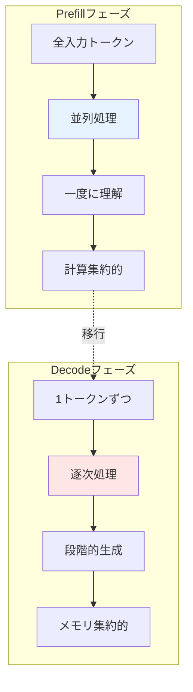

## サンプリング戦略：確率から選択へ

次のトークンを選ぶ方法には様々な戦略があります。これは「創造性」と「正確性」のバランスを調整するツールです。

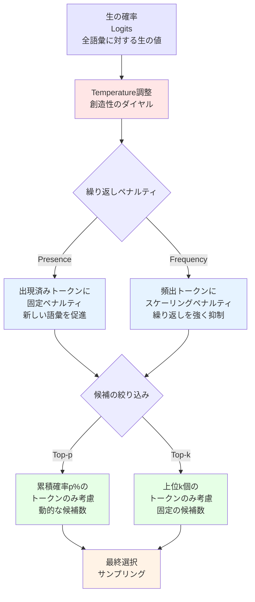

### 1. Temperature（温度パラメータ）

**Temperature = 創造性のダイヤル**

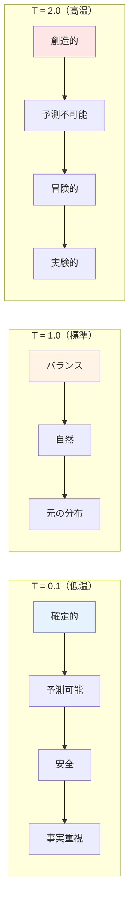

**具体例**：

「猫は___にいる」の次のトークン予測

| トークン | 元の確率 | T=0.5（低温） | T=1.0（標準） | T=2.0（高温） |
|---------|---------|--------------|--------------|-------------|
| 家 | 0.40 | 0.65 | 0.40 | 0.30 |
| 庭 | 0.30 | 0.25 | 0.30 | 0.25 |
| 屋根 | 0.20 | 0.08 | 0.20 | 0.22 |
| 宇宙 | 0.10 | 0.02 | 0.10 | 0.23 |

Temperature パラメータは出力の性質を大きく変化させます。**低温（< 1.0）**に設定すると、最も可能性の高い選択肢に偏るため、予測可能で安定した出力が得られます。**標準（1.0）**では、学習した確率分布をそのまま使用し、自然なバランスの取れた出力となります。**高温（> 1.0）**に設定すると、低確率の選択肢も選ばれやすくなり、創造的で実験的な出力が生成されます。

### 2. Top-p（Nucleus）サンプリング

**累積確率がp%に達するまでのトークンのみを候補とする**

例：p = 0.9（90%）の場合

| トークン | 確率 | 累積確率 | 選択候補 |
|---------|------|---------|----------|
| です | 0.50 | 0.50 | ✅ 候補に含む |
| ます | 0.25 | 0.75 | ✅ 候補に含む |
| でした | 0.10 | 0.85 | ✅ 候補に含む |
| だ | 0.06 | 0.91 | ❌ 90%超過で除外 |
| ました | 0.05 | 0.96 | ❌ 除外 |
| だった | 0.04 | 1.00 | ❌ 除外 |

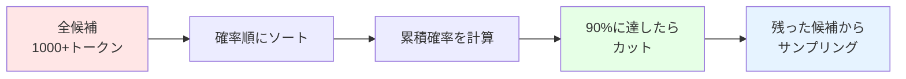

Top-p サンプリングのメリットは、状況に応じて候補数が動的に変化することです。モデルの確信度が高い時は少数の候補のみを考慮し、確信度が低い時は多数の候補から選択できるため、柔軟な生成が可能になります。

### 3. Top-k サンプリング

**上位k個のトークンのみを候補とする**

例：k = 3 の場合

| トークン | 確率 | 順位 | 選択候補 |
|---------|------|------|----------|
| です | 0.50 | 1位 | ✅ |
| ます | 0.25 | 2位 | ✅ |
| でした | 0.10 | 3位 | ✅ |
| だ | 0.06 | 4位 | ❌ 4位以下除外 |
| ました | 0.05 | 5位 | ❌ |

**Top-p vs Top-k**：

| 特徴 | Top-p | Top-k |
|-----|-------|-------|
| 候補数 | 動的（状況による） | 固定 |
| 確率分布 | 累積確率ベース | ランキングベース |
| 適用場面 | より柔軟 | よりシンプル |

### 4. 繰り返しペナルティ

**同じ単語やフレーズの繰り返しを防ぐメカニズム**

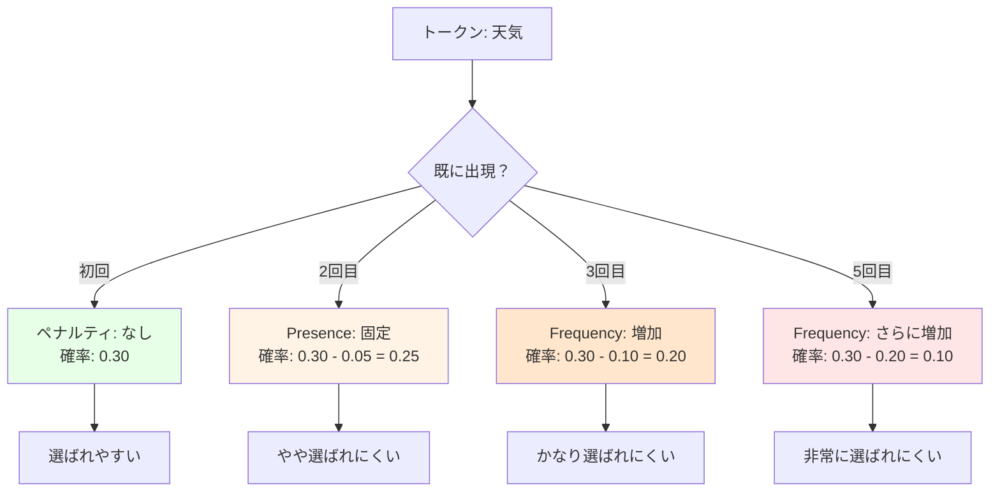

**Presence Penalty（出現ペナルティ）**は、一度でも出現したトークンに対して固定のペナルティを適用する手法です。これにより新しい語彙の使用が促進され、単調な繰り返しを避けることができます。値の範囲は通常 -2.0 から 2.0 の間で設定されます。

**Frequency Penalty（頻度ペナルティ）**は、出現回数に比例してペナルティが増加する手法です。頻繁に使われる単語ほどより強く抑制されるため、より多様な表現が可能になります。こちらも値の範囲は通常 -2.0 から 2.0 の間で設定されます。

**適用順序**：
1. 生の確率（Logits）を計算
2. Temperatureを適用
3. ペナルティを適用 ← ここ
4. Top-p/Top-kフィルタリング
5. 最終サンプリング

### 5. 生成長の制御

**いつ生成を止めるか？**

```mermaid
graph TB
    Gen[トークン生成] --> Check{停止条件？}
    
    Check -->|EOS検出| Stop1[終了トークン<br/>自然な終了]
    Check -->|最大長| Stop2[max_tokens達成<br/>強制終了]
    Check -->|停止文字列| Stop3[カスタム停止<br/>例: "\n\n"]
    Check -->|継続| Gen
    
    Stop1 --> End[生成終了]
    Stop2 --> End
    Stop3 --> End
    
    style Stop1 fill:#e6ffe6
    style Stop2 fill:#ffe6e6
    style Stop3 fill:#e6f3ff
```

生成長の制御には主に 3 つの方法があります。第 1 に**トークン数制限**では、`min_tokens` で最小生成数を、`max_tokens` で最大生成数を指定します。第 2 に**停止シーケンス**を使用すると、特定の文字列（例："```"、"\n\n"、"END"）が出現した時点で生成を停止できます。第 3 に **EOS（End-of-Sequence）トークン**により、モデルが自然に終了を判断します（例：`<|im_end|>`、`</s>`）。これらの制御方法を組み合わせることで、タスクに応じた適切な長さの出力を生成できます。

### 6. Beam Search：先読みで最適化

**1トークンずつではなく、複数の候補パスを同時に探索**

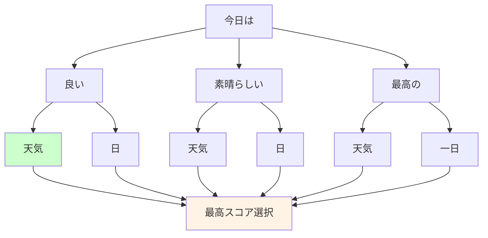

Beam Search は、チェス選手が複数の手先を読むように、複数の候補パスを同時に探索する手法です。具体的な動作は次のようになります。各ステップでは複数の候補（beam）を維持し（通常 5-10 個）、各候補について次のトークンの確率を計算します。その中から最も確率の高い組み合わせのみを保持し、この処理を終了条件に達するまで繰り返します。最終的に、最も高いスコアを持つシーケンスを最適解として選択します。

この手法には複数のメリットがあります。より文法的に正しい文章を生成でき、出力の一貫性が向上します。また局所的な最適解に陥りにくく、グローバルな最適化が可能になります。一方でデメリットとしては、計算コストが beam_size 倍に増加し、メモリ使用量も増加します。さらに、確率が高い選択肢に集中するため、創造性が低下する可能性があります。

Beam Search は、正確性が重視される翻訳タスクや要約タスク、その他正確性が重要なタスクに特に適しています。

## マルチヘッドアテンションの仕組み

マルチヘッドアテンションは、複数の「視点」から同時に情報を見る仕組みです。

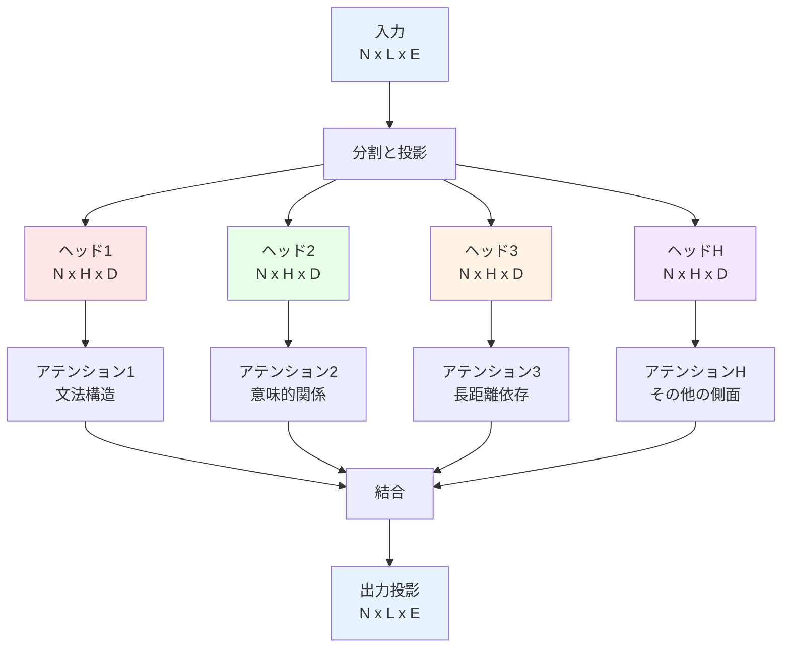

### 各ヘッドの役割例

現実のTransformerモデルでは、各ヘッドが異なる言語的特徴を捉えることが研究で示されています：

| ヘッド | 注目する関係 | 例 |
|-------|------------|-----|
| ヘッド1 | 文法構造 | 主語と述語の関係 |
| ヘッド2 | 意味的類似性 | 同義語、関連語 |
| ヘッド3 | 長距離依存 | 文章の始めと終わりの関係 |
| ヘッド4 | 位置関係 | 隣接トークンとの関係 |
| ヘッドH | その他 | 複雑な言語パターン |

### 次元変換の詳細フロー

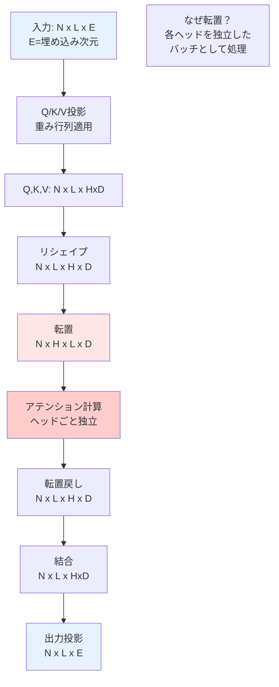

**なぜ転置（N x L x H x D → N x H x L x D）が必要？**

転置の必要性を理解するために、形状の変化とその意味を確認しましょう。元の形状 `N x L x H x D` では、L（シーケンス長）がヘッドの前にあるため、トークン優先の処理となり、各トークンの全ヘッドがまとめて処理されます。これを転置して `N x H x L x D` とすると、H（ヘッド数）がシーケンスの前に来るため、ヘッド優先の処理となり、各ヘッドが独立したバッチとして動作します。この変換により、各ヘッドは独自の視点でシーケンス全体を分析できるようになります。

この転置操作の結果として、並列処理の効率化が図れ、各ヘッドの独立性が保証され、異なる言語的特徴を効果的に抽出できるようになります。

## コンテキスト長とアテンションスパン

LLMが処理できる「記憶の範囲」について理解しましょう。

### コンテキスト長とは

**コンテキスト長**：モデルが一度に処理できる最大トークン数

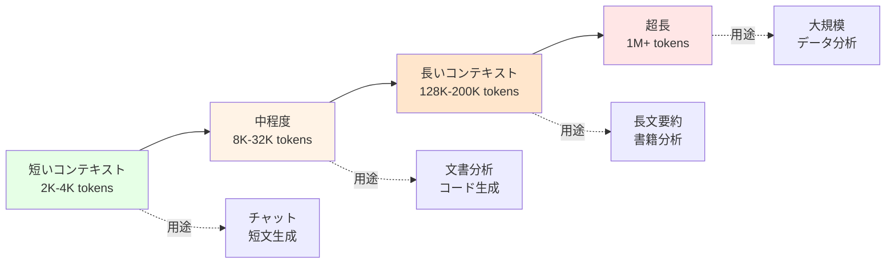

### 制限要因

コンテキスト長は複数の要因によって制限されます。第 1 に**モデルアーキテクチャ**の制約があり、位置エンコーディングの設計やアテンションメカニズムの実装によって処理可能な長さが決まります。第 2 に**計算リソース**の制約があり、メモリ使用量は O(n²) で増加し、計算時間は O(n) で増加するため、長いコンテキストでは急激にリソース消費が大きくなります。第 3 に**コストと効率**の問題があり、GPU/TPU のメモリ制限や推論速度の要件がコンテキスト長の実用的な上限を決定します。

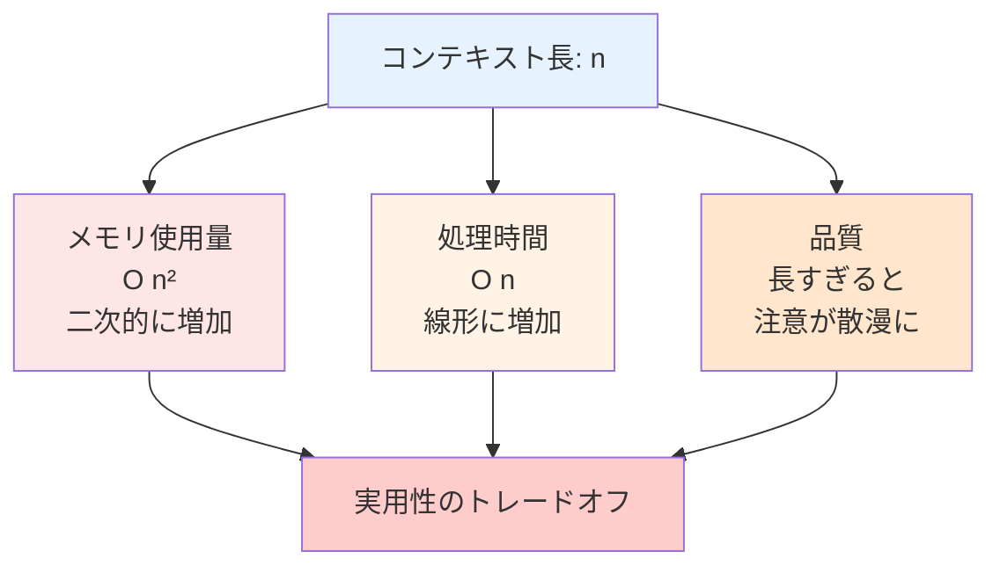

## パフォーマンス指標と最適化

実際にLLMをデプロイする際の重要な考慮事項です。

### 主要な4つのメトリクス

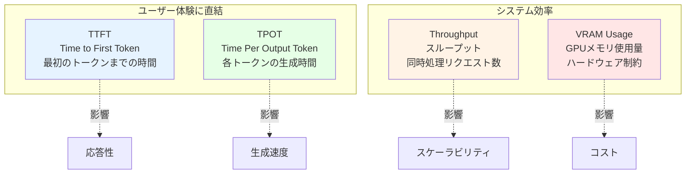

**各指標の最適化方法**：

| 指標 | 影響要因 | 最適化手法 |
|-----|---------|-----------|
| TTFT | Prefillフェーズ | バッチサイズ調整、効率的なトークナイザー |
| TPOT | Decodeフェーズ | KVキャッシュ、量子化、効率的なカーネル |
| Throughput | 並列処理能力 | 連続バッチング、効率的なスケジューリング |
| VRAM | モデルサイズ、コンテキスト長 | 量子化、モデル圧縮、ページングアテンション |

### KVキャッシュ最適化

次の章（Week 2, Day 1）で詳しく学びますが、**KVキャッシュ**は最も重要な最適化手法の一つです。

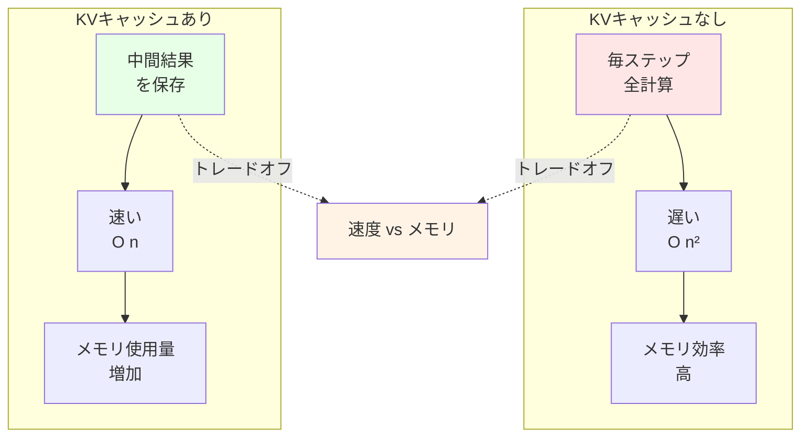

KV キャッシュは、各デコードステップで計算した Key と Value を保存し、次のステップでは新しいトークンの K/V のみを計算する最適化手法です。この仕組みにより、計算量を大幅に削減できます（特に長いシーケンスで効果的）。

この手法のメリットとして、生成速度の劇的な向上（数倍から数十倍）、長いコンテキストの実用化、そしてリアルタイム対話の実現が挙げられます。一方でデメリットとして、メモリ使用量の増加とバッチサイズとのトレードオフが存在します。Week 2, Day 1 で詳しく学習しますが、このトレードオフを理解することが実用的な LLM システムの構築には不可欠です。

## 座学のまとめ

この座学セクションで学んだ重要なポイントを振り返りましょう。

まず **Transformer アーキテクチャの 3 つのタイプ**では、Encoder-only が双方向アテンションにより文章理解に優れ、Decoder-only が単方向アテンションでテキスト生成（現代の LLM）に使用され、Encoder-Decoder が両方を組み合わせて変換タスクに適していることを学びました。

次に**アテンションメカニズム**について、文章内の重要な情報に動的に注目する仕組みを理解しました。スケールドドット積アテンション $\text{Attention}(Q, K, V) = \text{softmax}\left(\frac{QK^T}{\sqrt{d_k}}\right)V$ の数式と、マルチヘッドアテンションが複数の視点から並行して分析を行う仕組みを学習しました。

**LLM 推論の 2 段階**では、Prefill フェーズが入力全体を並列処理する計算集約的なフェーズであり、Decode フェーズが 1 トークンずつ生成するメモリ集約的なフェーズであることを理解しました。

**サンプリング戦略**においては、Temperature が創造性を制御し、Top-p/Top-k が候補の絞り込みを行い、ペナルティが繰り返しを抑制し、Beam Search が複数候補の先読み探索を実現することを学びました。

最後に**パフォーマンス最適化**では、4 つの重要指標（TTFT、TPOT、Throughput、VRAM）があり、コンテキスト長には長さとコストのトレードオフが存在し、KV キャッシュには速度とメモリのトレードオフがあることを理解しました。

---

これらの理論を理解したところで、次はいよいよ実装です！Task 1 と Task 2 で、これらの概念を実際のコードで実現していきましょう。
