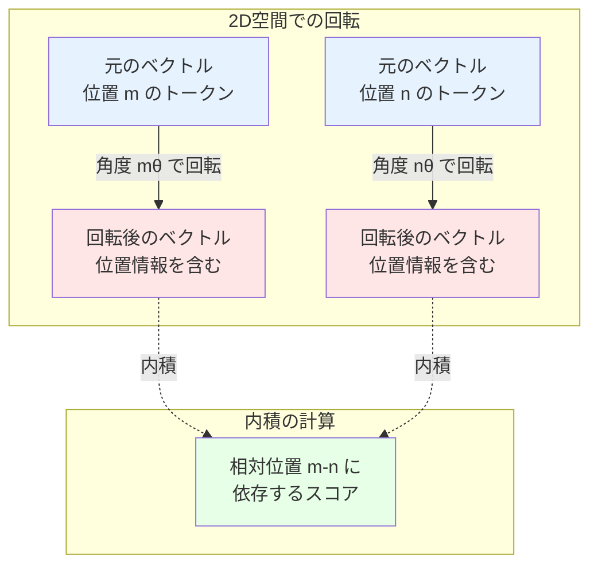
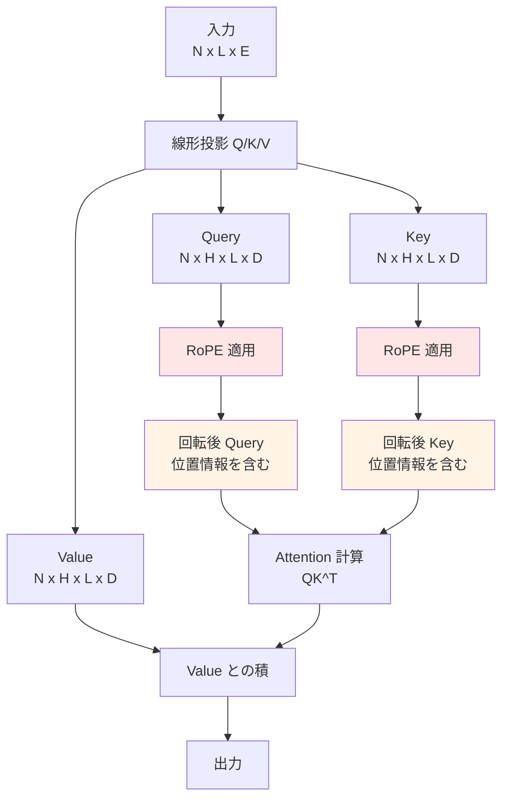
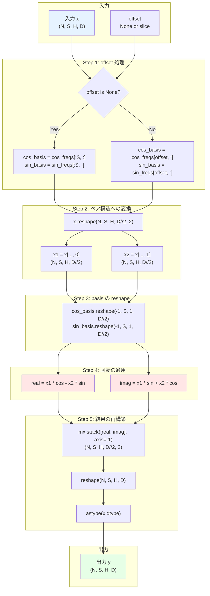

# Week 1 Day 2: 位置エンコーディングと RoPE

2 日目では、Qwen2 モデルで使用される位置エンコーディング技術である Rotary Positional Encoding (RoPE) を実装します。Transformer モデルでは、トークンの位置情報をアテンション層の入力に埋め込む必要があります。Qwen2 では、位置エンコーディングはマルチヘッドアテンション層内で、query ベクトルと key ベクトルに適用されます。

[📚 推奨読み物: You could have designed state of the art positional encoding](https://huggingface.co/blog/designing-positional-encoding)

[📚 推奨読み物: Roformer: Enhanced Transformer with Rotary Positional Encoding](https://arxiv.org/pdf/2104.09864)

## Task 1: Rotary Positional Encoding "RoPE" を実装する

以下のファイルを修正する必要があります。

```
src/tiny_llm/positional_encoding.py
```

従来の RoPE（推奨読み物に記載）では、位置エンコーディングは query ベクトルと key ベクトルの各ヘッドに適用されます。`RoPE` クラスの初期化時に周波数を事前計算できます。

`offset` が提供されない場合、位置エンコーディングはシーケンス全体に適用されます。0 番目の周波数が 0 番目のトークンに、(L-1) 番目のトークンまで適用されます。それ以外の場合、位置エンコーディングは offset スライスに従ってシーケンスに適用されます。offset スライスが 5..10 の場合、層に提供されるシーケンス長は 5 となり、0 番目のトークンには 5 番目の周波数が適用されます。

`offset` が `None` または単一のスライスである場合のみを考慮する必要があります。`list[slice]` のケースは、continuous batching 機能の実装を開始する際に実装されます。すべてのバッチが同じ offset を使用すると仮定してください。

```
x: (N, L, H, D)
cos/sin_freqs: (MAX_SEQ_LEN, D // 2)
```

従来の形式の RoPE では、`D` 次元の各ヘッドは連続する複素数ペアとして扱われます。つまり、D = 8 の場合、x[0] と x[1] がペア、x[2] と x[3] が別のペア、というように続きます。各ペアは `cos/sin_freqs` から同じ周波数を取得します。

実際には、D は偶数または奇数の場合があります。D が奇数の場合、`x` の最後の次元には対応するペアがなく、ほとんどの実装では通常そのまま残されます。簡略化のため、D は常に偶数であると仮定します。

```
output[0] = x[0] * cos_freqs[0] + x[1] * -sin_freqs[0]
output[1] = x[0] * sin_freqs[0] + x[1] * cos_freqs[0]
output[2] = x[2] * cos_freqs[1] + x[3] * -sin_freqs[1]
output[3] = x[2] * sin_freqs[1] + x[3] * cos_freqs[1]
...というように続く
```

これは、`x` を (N, L, H, D // 2, 2) にリシェイプし、各ペアに上記の式を適用することで実行できます。

**📚 参考資料**

- [PyTorch RotaryPositionalEmbeddings API](https://pytorch.org/torchtune/stable/generated/torchtune.modules.RotaryPositionalEmbeddings.html)
- [MLX Implementation of RoPE before the custom metal kernel implementation](https://github.com/ml-explore/mlx/pull/676/files)

実装をテストするには、以下のコマンドを実行できます。

::::details 手順補足

手元の MacBook 等に tiny-llm リポジトリをクローンし、以下を実行する。

```bash
URL=https://raw.githubusercontent.com/pdm-project/pdm/main/install-pdm.py
curl -sSL $URL | python3 -
pdm update
``` 
::::

:::message alert
初期状態では不完全な実装のためテストはエラーします。自分で参考資料を読みながら実装することでエラーを解消しましょう。
:::

```
pdm run test --week 1 --day 2 -- -k task_1
```

## Task 2: 非従来型の `RoPE` を実装する

Qwen2 モデルは非従来型の RoPE を使用します。この形式では、ヘッド埋め込み次元が 2 つの半分に分割され、2 つの半分には異なる周波数が適用されます。`x1 = x[.., :HALF_DIM]` および `x2 = x[.., HALF_DIM:]` とすると、

```
output[0] = x1[0] * cos_freqs[0] + x2[0] * -sin_freqs[0]
output[HALF_DIM] = x1[0] * sin_freqs[0] + x2[0] * cos_freqs[0]
output[1] = x1[1] * cos_freqs[1] + x2[1] * -sin_freqs[1]
output[HALF_DIM + 1] = x1[1] * sin_freqs[1] + x2[1] * cos_freqs[1]
...というように続く
```

これは、`x` の埋め込み次元の前半と後半を直接取得し、各半分に周波数を個別に適用することで実行できます。

**📚 参考資料**

- [vLLM implementation of RoPE](https://github.com/vllm-project/vllm/blob/main/vllm/model_executor/layers/rotary_embedding)

実装をテストするには、以下のコマンドを実行できます。

```
pdm run test --week 1 --day 2 -- -k task_2
```

1 日分のすべてのテストを実行するには、

```
pdm run test --week 1 --day 2
```

::::details 解答
```bash
cd src && cp tiny_llm_ref/positional_encoding.py tiny_llm/positional_encoding.py
```
::::

# コラム: RoPE の数学的背景

このコラムでは、Rotary Positional Embedding (RoPE) の数学的な基礎を段階的に解説します。RoPE を深く理解するためには、2 次元での回転から始めて、高次元への拡張を理解することが重要です。

::::details RoPE の数学的背景

## 2 次元での回転の視覚化

RoPE の核心的なアイデアは、埋め込みベクトルを「回転」させることで位置情報をエンコードすることです。まず、2 次元空間での回転から理解しましょう。



2 次元ベクトル `(x, y)` を角度 θ だけ回転させる操作は、以下の回転行列で表現できます。

$$
\begin{pmatrix} \cos\theta & -\sin\theta \\ \sin\theta & \cos\theta \end{pmatrix} \begin{pmatrix} x \\ y \end{pmatrix} = \begin{pmatrix} x\cos\theta - y\sin\theta \\ x\sin\theta + y\cos\theta \end{pmatrix}
$$

## 相対位置が自然に得られる理由

RoPE の美しさは、回転を適用することで相対位置情報が自然に得られることにあります。位置 m のクエリベクトル $\boldsymbol{q}_m$ と位置 n のキーベクトル $\boldsymbol{k}_n$ を考えます。

それぞれを回転させた後の内積は、以下のように表現できます。

$$
\text{score}_{mn} = (\boldsymbol{q}_m \text{ を } m\theta \text{ 回転}) \cdot (\boldsymbol{k}_n \text{ を } n\theta \text{ 回転})
$$

回転の性質により、この内積は実質的に以下と等価になります。

$$
\text{score}_{mn} = \boldsymbol{q}_m \cdot (\boldsymbol{k}_n \text{ を } (n-m)\theta \text{ 回転})
$$

つまり、スコアは相対位置 $(n-m)$ にのみ依存することになります。これが RoPE の最も重要な特性です。

具体例として、以下の 2 つのケースを考えます。

**ケース 1**: 位置 4 のトークンが位置 2 のトークンを参照  
- 回転角度の差: $(2-4)\theta = -2\theta$

**ケース 2**: 位置 5 のトークンが位置 3 のトークンを参照  
- 回転角度の差: $(3-5)\theta = -2\theta$

両ケースとも相対位置が同じ（-2）であるため、回転角度の差も同じになり、アテンションスコアのパターンも類似します。これにより、モデルは絶対位置ではなく相対位置に基づいて学習できます。

## 高次元への拡張

実際の Transformer では、64 次元や 128 次元といった高次元の埋め込みベクトルを扱います。RoPE はこれらを複数の 2 次元ペアに分割することで高次元に対応します。

### 次元のペア化

64 次元のベクトル `[x_0, x_1, x_2, ..., x_62, x_63]` を 32 個のペアに分割します。

$$
[(x_0, x_1), (x_2, x_3), (x_4, x_5), ..., (x_{62}, x_{63})]
$$

各ペアは独立した 2 次元平面上の点として扱われ、それぞれ異なる周波数で回転します。

### 周波数の設計

第 $k$ 番目のペア（$k = 0, 1, 2, ..., d/2-1$）には、以下の周波数 $\theta_k$ が割り当てられます。

$$
\theta_k = \frac{1}{10000^{2k/d}}
$$

ここで、$d$ は埋め込みの次元数です。この式により、以下の特性が得られます。

$k = 0$（最初のペア）の場合、$\theta_0 = 1$ となり、高い周波数（速い変化）で回転します。$k$ が大きくなるにつれて $\theta_k$ は小さくなり、低い周波数（遅い変化）で回転します。この周波数の多様性により、短距離と長距離の両方の位置関係を効果的にキャプチャできます。

高周波成分（初期のペア）は近接するトークン間の細かい関係を捉え、低周波成分（後期のペア）は遠く離れたトークン間の大局的な関係を捉えることができます。

### 数式での表現

位置 $m$ のベクトル $\boldsymbol{x}$ の第 $k$ 番目のペア $(x_{2k}, x_{2k+1})$ に対して、以下の回転を適用します。

$$
\begin{pmatrix} \cos(m\theta_k) & -\sin(m\theta_k) \\ \sin(m\theta_k) & \cos(m\theta_k) \end{pmatrix} \begin{pmatrix} x_{2k} \\ x_{2k+1} \end{pmatrix}
$$

この操作をすべてのペアに対して独立に適用することで、高次元ベクトルに対する RoPE が実現されます。

## RoPE の利点

RoPE のこのような設計には、いくつかの重要な利点があります。

相対位置への依存性により、訓練時に見たことのない長さのシーケンスにも汎化しやすくなります。回転は加算と異なり、元の埋め込みベクトルの情報を保持しながら位置情報を付加できます。また、学習可能なパラメータが不要であり、メモリ効率が良いという特徴もあります。さらに、cos と sin の計算は事前に行えるため、推論時の計算コストが低く抑えられます。

このような数学的基盤により、RoPE は現代の大規模言語モデル（LLaMA、Qwen2、Mistral など）で広く採用される標準的な位置エンコーディング手法となっています。

::::

# Task 1 の解説

このセクションでは、Task 1 の Traditional RoPE について、その役割から実装の詳細まで段階的に解説します。

::::details Task 1 の解説

## Task 1 Part 1: RoPE の役割と Transformer における位置

### Transformer における位置エンコーディングの必要性

Transformer アーキテクチャは、その設計上、トークンの順序情報を自然には持っていません。Self-Attention メカニズムは permutation-invariant（順序不変）であり、以下の 2 つの文を区別できません。

- "The cat sat on the mat"
- "The mat sat on the cat"

これらは同じトークンで構成されていますが、語順が異なるため意味は正反対です。この問題を解決するために、位置情報を明示的にモデルに与える必要があります。

### 位置エンコーディング手法の比較


### RoPE の Transformer における位置

RoPE は MultiHeadAttention 層内で、Query と Key に対してのみ適用されます。Value には適用されないことに注意してください。



Value に RoPE を適用しない理由は、Value はコンテンツ情報を保持するためのものであり、位置情報は Query と Key の相互作用（アテンションスコアの計算）で捉えれば十分だからです。

### なぜ RoPE が優れているのか

RoPE は以下の特性により、従来の位置エンコーディング手法よりも優れています。

学習可能なパラメータが不要であるため、モデルのパラメータ数を増やさずに位置情報をエンコードできます。相対位置への自然な依存により、訓練時に見たことのない長さのシーケンスにも汎化しやすくなります。回転操作は元の埋め込みベクトルの意味情報を保持しながら位置情報を付加するため、情報の劣化が少ないという利点があります。また、cos と sin の値を事前計算できるため、推論時の計算コストが低く抑えられます。

## Task 1 Part 2: Traditional RoPE の実装仕様

### 複素数ペアの概念

Traditional RoPE では、埋め込み次元を連続する 2 要素のペアとして扱います。D = 8 の場合、以下のようにペア化されます。

```
元のベクトル: [x_0, x_1, x_2, x_3, x_4, x_5, x_6, x_7]

ペア化:
  ペア 0: (x_0, x_1)  ← 周波数 θ_0
  ペア 1: (x_2, x_3)  ← 周波数 θ_1
  ペア 2: (x_4, x_5)  ← 周波数 θ_2
  ペア 3: (x_6, x_7)  ← 周波数 θ_3
```

各ペアは 2 次元平面上の点とみなされ、それぞれの周波数で回転します。これは元の RoFormer 論文で定義された方法です。

### 回転の適用方法

位置 $m$ のトークンに対して、各ペアに以下の回転を適用します。

```python
# ペア 0: (x_0, x_1)
output[0] = x[0] * cos(m*θ_0) - x[1] * sin(m*θ_0)
output[1] = x[0] * sin(m*θ_0) + x[1] * cos(m*θ_0)

# ペア 1: (x_2, x_3)
output[2] = x[2] * cos(m*θ_1) - x[3] * sin(m*θ_1)
output[3] = x[2] * sin(m*θ_1) + x[3] * cos(m*θ_1)

# ... 以下同様
```

この計算は、回転行列による変換と等価です。

### reshape の役割

実装では、テンソルを reshape することでペア構造を明示化します。

```python
# 元の形状: (N, L, H, D)
x = x.reshape(N, L, H, D // 2, 2)
# 新しい形状: (N, L, H, D//2, 2)
#                           ↑   ↑
#                      ペア数  各ペアの2要素
```

reshape により、最後の次元がペアの構造を表現します。`x[..., 0]` が各ペアの最初の要素、`x[..., 1]` が 2 番目の要素になります。

### offset パラメータの意味

offset パラメータは、KV cache を使用する際に重要になります。通常、モデルは 0 番目から始まる位置でトークンを処理しますが、KV cache を使う場合、すでに処理済みのトークンがあるため、新しいトークンには異なる位置の周波数を適用する必要があります。

```python
# 例: すでに 0-4 番目のトークンを処理済み
# 新しく 5-9 番目のトークンを処理する場合

offset = slice(5, 10)  # 5 番目から 10 番目の位置
# このとき、新しいトークン列の 0 番目には、
# 実際には 5 番目の周波数が適用される
```

この機能は Week 2 で continuous batching を実装する際に詳しく扱います。現時点では、`offset=None` の場合（シーケンス全体を 0 から処理）と、単一の slice の場合のみを考慮すればよいです。

## Task 1 Part 3: 模範解答の解説

模範解答のコードを段階的に解析していきます。

### RoPE 処理の全体フロー

まず、Traditional RoPE の `__call__` メソッドの処理フロー全体を確認しましょう。



各ステップの詳細を以下で解説します。

### 初期化での周波数の事前計算

```python
class RoPE:
    def __init__(
        self,
        dims: int,
        seq_len: int,
        base: int = 10000,
        traditional: bool = False,
    ):
        assert dims % 2 == 0, "dims must be even"
        self.dims = dims
        self.seq_len = seq_len
        half_dims = dims // 2
        
        # 周波数の計算
        inner = mx.arange(0, half_dims, dtype=mx.float32) / half_dims
        freqs = mx.power(base, -inner)
        
        # 各位置での角度の計算
        t = mx.arange(seq_len)
        freqs = mx.outer(t, freqs)
        
        # cos と sin を事前計算
        self.cos_freqs = mx.cos(freqs)
        self.sin_freqs = mx.sin(freqs)
        self.base = base
        self.half_dims = half_dims
        self.traditional = traditional
```

**周波数の計算**

```python
inner = mx.arange(0, half_dims, dtype=mx.float32) / half_dims
# [0, 1, 2, ..., half_dims-1] / half_dims
# = [0, 1/half_dims, 2/half_dims, ..., (half_dims-1)/half_dims]

freqs = mx.power(base, -inner)
# = base^(-inner)
# = [base^0, base^(-1/half_dims), base^(-2/half_dims), ...]
# これが θ_k に対応
```

この計算は、前述の $\theta_k = 1 / 10000^{2k/d}$ の式を実装しています。

**各位置での角度**

```python
t = mx.arange(seq_len)  # [0, 1, 2, ..., seq_len-1]
freqs = mx.outer(t, freqs)  # 外積により (seq_len, half_dims) の行列
# freqs[m, k] = m * θ_k
```

`mx.outer` により、位置 $m$ と周波数 $\theta_k$ のすべての組み合わせについて $m\theta_k$ を計算します。

**cos と sin の事前計算**

```python
self.cos_freqs = mx.cos(freqs)  # (seq_len, half_dims)
self.sin_freqs = mx.sin(freqs)  # (seq_len, half_dims)
```

これらの値を事前計算しておくことで、フォワードパス時の計算を高速化できます。

### フォワードパスの実装（Traditional 形式）

```python
def __call__(
    self, x: mx.array, offset: list[slice] | slice | None = None
) -> mx.array:
    N, S, H, D = x.shape
    
    # offset の処理
    if offset is not None:
        if isinstance(offset, slice):
            assert offset.stop - offset.start == S
        # ... (offset が list の場合の処理は省略)
    
    # cos/sin basis の取得
    cos_basis = (
        self.cos_freqs[:S, :] if offset is None else self.cos_freqs[offset, :]
    )
    sin_basis = (
        self.sin_freqs[:S, :] if offset is None else self.sin_freqs[offset, :]
    )
    
    # Traditional 形式の処理
    if self.traditional:
        x = x.reshape(N, S, H, self.half_dims, 2)
        x1 = x[..., 0]  # 各ペアの最初の要素
        x2 = x[..., 1]  # 各ペアの 2 番目の要素
```

**reshape によるペア構造の明示化**

```python
x.reshape(N, S, H, self.half_dims, 2)
# 元: (N, S, H, D)
# 後: (N, S, H, D//2, 2)

# 例: D=8 の場合
# [x0, x1, x2, x3, x4, x5, x6, x7]
# ↓ reshape
# [[x0, x1], [x2, x3], [x4, x5], [x6, x7]]
```

**cos/sin basis の reshape**

```python
cos_basis = cos_basis.reshape(-1, S, 1, self.half_dims)
sin_basis = sin_basis.reshape(-1, S, 1, self.half_dims)
# 形状: (-1, S, 1, half_dims)
# -1 はバッチ次元（N または 1）
# 1 はヘッド次元へのブロードキャスト用
```

**回転の適用**

```python
# 複素数乗算の実部と虚部を計算
real = mx.multiply(x1, cos_basis) - mx.multiply(x2, sin_basis)
imag = mx.multiply(x2, cos_basis) + mx.multiply(x1, sin_basis)
```

これは、以下の回転の公式を実装しています。

```
実部: x1 * cos - x2 * sin
虚部: x1 * sin + x2 * cos
```

**結果の再構築**

```python
y = mx.stack([real, imag], axis=-1)
# 実部と虚部を最後の次元で積み重ね
# 形状: (N, S, H, half_dims, 2)

y = y.reshape(N, S, H, D)
# 元の形状に戻す
```

`mx.stack` により、各ペアの実部と虚部が交互に配置されたテンソルが得られます。その後、reshape で元の形状 `(N, S, H, D)` に戻します。

**dtype の保持**

```python
return y.astype(x.dtype)
```

最後に、元の入力テンソルの dtype に変換して返します。これは、計算中に float32 に変換されている可能性があるため、元の型（例えば float16）に戻す必要があるためです。

### 実装のポイント

Traditional RoPE の実装で重要なポイントは、reshape による次元の再解釈です。`(N, S, H, D)` を `(N, S, H, D//2, 2)` に reshape することで、連続する 2 要素をペアとして扱えるようになります。この操作により、複素数としての回転を効率的に実装できます。

また、cos と sin の値を事前計算してキャッシュすることで、フォワードパス時の計算を高速化できます。offset パラメータのサポートにより、KV cache を使用する際にも正しい位置の周波数を適用できます。

::::

# Task 2 の解説

このセクションでは、Task 2 の Non-traditional RoPE について、Traditional との違いから実装の詳細まで解説します。

::::details Task 2 の解説

## Task 2 Part 1: Non-traditional RoPE の設計

### Traditional vs Non-traditional の違い

Non-traditional RoPE は、次元の扱い方が Traditional と根本的に異なります。以下の図で両者の違いを視覚化します。

```mermaid
graph TB
    subgraph Traditional RoPE
        T1[元のベクトル D=8<br/>x0 x1 x2 x3 x4 x5 x6 x7]
        T2[ペア化<br/>x0,x1 | x2,x3 | x4,x5 | x6,x7]
        T3[各ペアを回転<br/>周波数: θ0 θ1 θ2 θ3]
    end
    
    subgraph Non-traditional RoPE
        N1[元のベクトル D=8<br/>x0 x1 x2 x3 x4 x5 x6 x7]
        N2[前半と後半に分割<br/>前半: x0 x1 x2 x3<br/>後半: x4 x5 x6 x7]
        N3[対応する要素同士を回転<br/>x0,x4 x1,x5 x2,x6 x3,x7<br/>周波数: θ0 θ1 θ2 θ3]
    end
    
    T1 --> T2 --> T3
    N1 --> N2 --> N3
    
    style T2 fill:#ffe6e6
    style N2 fill:#e6f3ff
```

**Traditional の場合**：

```python
D = 8 の場合
元: [x0, x1, x2, x3, x4, x5, x6, x7]

ペア化:
  (x0, x1) ← θ0 で回転
  (x2, x3) ← θ1 で回転
  (x4, x5) ← θ2 で回転
  (x6, x7) ← θ3 で回転

結果: [x0', x1', x2', x3', x4', x5', x6', x7']
```

**Non-traditional の場合**：

```python
D = 8 の場合
元: [x0, x1, x2, x3, x4, x5, x6, x7]

分割:
  前半: [x0, x1, x2, x3]
  後半: [x4, x5, x6, x7]

回転:
  (x0, x4) ← θ0 で回転 → (x0', x4')
  (x1, x5) ← θ1 で回転 → (x1', x5')
  (x2, x6) ← θ2 で回転 → (x2', x6')
  (x3, x7) ← θ3 で回転 → (x3', x7')

結果: [x0', x1', x2', x3', x4', x5', x6', x7']
```

### なぜこの形式が存在するのか

Non-traditional RoPE が存在する理由は、主に実装の効率性と柔軟性にあります。

**メモリアクセスパターン**の観点では、前半と後半への分割は、連続したメモリアクセスを維持しやすいという利点があります。`x[:HALF_DIM]` と `x[HALF_DIM:]` というスライス操作は、GPU のメモリアクセスパターンに適しています。一方、Traditional の `x[0::2]` と `x[1::2]` というストライドアクセスは、メモリキャッシュの効率が低下する可能性があります。

**実装の簡潔さ**も重要な要素です。reshape を使わずに直接スライスで分割できるため、コードがより直感的になります。また、一部の最適化された実装では、この形式の方が効率的に動作する場合があります。

**歴史的経緯**として、vLLM や他の高性能推論ライブラリがこの形式を採用したことで、それが事実上の標準の一つとなりました。Qwen2 もこれらのライブラリとの互換性を考慮して、Non-traditional 形式を採用したと考えられます。

### Qwen2 での採用理由

Qwen2 が Non-traditional RoPE を採用した具体的な理由については、公式ドキュメントに明示的な記載はありません。しかし、以下の理由が考えられます。

vLLM などの推論最適化ライブラリとの互換性を重視した可能性があります。これらのライブラリは Non-traditional 形式を前提としており、同じ形式を使用することで推論の高速化が容易になります。

また、Qwen2 は長いコンテキストウィンドウ（例えば 128K トークン）をサポートしているため、効率的なメモリアクセスパターンが特に重要です。Non-traditional 形式のメモリアクセスパターンは、このような長いシーケンス処理に適している可能性があります。

さらに、実装チームの経験や既存のコードベースとの整合性も影響した可能性があります。

## Task 2 Part 2: 実装の違い

### スライスによる分割

Non-traditional RoPE の最大の特徴は、reshape を使わずにスライスで直接分割することです。

```python
# Non-traditional の分割
x1 = x[..., 0 : self.half_dims]      # 前半
x2 = x[..., self.half_dims : self.dims]  # 後半

# 形状の変化なし
# x:  (N, S, H, D)
# x1: (N, S, H, D//2)
# x2: (N, S, H, D//2)
```

Traditional の場合と比較すると、

```python
# Traditional の場合
x = x.reshape(N, S, H, self.half_dims, 2)  # reshape が必要
x1 = x[..., 0]  # 各ペアの最初の要素
x2 = x[..., 1]  # 各ペアの 2 番目の要素
```

Non-traditional では reshape が不要であり、コードがよりシンプルになります。

### concat vs stack の選択

結果の再構築でも違いがあります。

**Traditional の場合（stack を使用）**：

```python
y = mx.stack([real, imag], axis=-1)
# 形状: (N, S, H, half_dims, 2)
y = y.reshape(N, S, H, D)
# 最終形状: (N, S, H, D)
```

`stack` は新しい次元を作成し、その次元に沿って要素を積み重ねます。その後、reshape で元の形状に戻します。

**Non-traditional の場合（concat を使用）**：

```python
y = mx.concat([real, imag], axis=-1)
# 直接 (N, S, H, D) の形状
y = y.reshape(N, S, H, D)  # 念のため reshape
```

`concat` は既存の次元に沿って要素を連結します。これにより、直接元の形状が得られます。

具体例で比較すると、

```python
# D=8, half_dims=4 の場合

# Traditional (stack):
real = [r0, r1, r2, r3]
imag = [i0, i1, i2, i3]
stack → [[r0, i0], [r1, i1], [r2, i2], [r3, i3]]
reshape → [r0, i0, r1, i1, r2, i2, r3, i3]

# Non-traditional (concat):
real = [r0, r1, r2, r3]
imag = [i0, i1, i2, i3]
concat → [r0, r1, r2, r3, i0, i1, i2, i3]
```

どちらの方法も最終的には正しい結果が得られますが、要素の配置パターンが異なります。

## Task 2 Part 3: 模範解答の解説

Non-traditional 形式の実装を詳しく見ていきます。

### 条件分岐による実装

```python
def __call__(
    self, x: mx.array, offset: list[slice] | slice | None = None
) -> mx.array:
    N, S, H, D = x.shape
    
    # ... offset 処理と cos/sin basis の取得 ...
    
    # Traditional か Non-traditional かで分岐
    if self.traditional:
        # Traditional の処理（Task 1）
        x = x.reshape(N, S, H, self.half_dims, 2)
        x1 = x[..., 0]
        x2 = x[..., 1]
    else:
        # Non-traditional の処理（Task 2）
        x1 = x[..., 0 : self.half_dims]
        x2 = x[..., self.half_dims : self.dims]
```

`traditional` フラグにより、同じクラスで両方の形式をサポートしています。これにより、モデルの設定に応じて適切な形式を選択できます。

### スライスによる分割の詳細

```python
x1 = x[..., 0 : self.half_dims]
x2 = x[..., self.half_dims : self.dims]

# 具体例: D=8 の場合
# x = [..., [x0, x1, x2, x3, x4, x5, x6, x7]]
# x1 = [..., [x0, x1, x2, x3]]  # 0:4
# x2 = [..., [x4, x5, x6, x7]]  # 4:8
```

`...` は "すべての前の次元" を意味するため、バッチ、シーケンス長、ヘッド数の次元はそのまま保持され、最後の次元（埋め込み次元）のみが分割されます。

### cos/sin の適用

```python
cos_basis = cos_basis.reshape(-1, S, 1, self.half_dims)
sin_basis = sin_basis.reshape(-1, S, 1, self.half_dims)

# 回転の計算
real = mx.multiply(x1, cos_basis) - mx.multiply(x2, sin_basis)
imag = mx.multiply(x2, cos_basis) + mx.multiply(x1, sin_basis)
```

この部分は Traditional と同じロジックです。複素数回転の実部と虚部を計算しています。

### 結果の再構築

```python
if self.traditional:
    y = mx.stack([real, imag], axis=-1)
    y = y.reshape(N, S, H, D)
else:
    y = mx.concat([real, imag], axis=-1)
    y = y.reshape(N, S, H, D)
```

**Non-traditional の場合**：

```python
# real: (N, S, H, half_dims)  例: [r0, r1, r2, r3]
# imag: (N, S, H, half_dims)  例: [i0, i1, i2, i3]

y = mx.concat([real, imag], axis=-1)
# y: (N, S, H, D)  例: [r0, r1, r2, r3, i0, i1, i2, i3]
```

`concat` により、前半に実部（変換後の x1）、後半に虚部（変換後の x2）が配置されます。これは元の分割パターン（前半/後半）と一致します。

### dtype の保持

```python
return y.astype(x.dtype)
```

Traditional と同様に、最後に元の dtype に変換します。これは特に mixed precision training（float16 と float32 を混在させる訓練）を行う場合に重要です。

### 実装のポイント

Non-traditional RoPE の実装は、以下の点で Traditional よりもシンプルです。

reshape 操作が不要（または最小限）であるため、コードが直感的になります。スライスによる分割は、GPU のメモリアクセスパターンに適しており、高速化の可能性があります。また、concat による結合は、stack + reshape よりも直接的です。

両形式は数学的には同等の結果を生成しますが、実装の詳細とメモリアクセスパターンが異なります。Qwen2 のような大規模モデルでは、このような細かい実装の違いが、全体の推論速度に影響を与える可能性があります。

::::

# コラム: DroPE - 位置エンコーディングを「ドロップ」してコンテキストを拡張

RoPE は現代の LLM における標準的な位置エンコーディング手法となっていますが、長コンテキストの処理には課題があります。このコラムでは、Sakana AI が 2026 年 1 月に発表した DroPE という新しいアプローチを紹介します。

::::details DroPE: 位置エンコーディングのドロップによるコンテキスト拡張

## RoPE の長コンテキスト問題

RoPE は訓練時には優れた性能を発揮しますが、訓練時に見た長さを超えるシーケンスを処理する際に問題が生じます。テストシーケンスが訓練時よりも長い場合、誘導される回転（位相）が分布外（out-of-distribution）となり、アテンションヘッドは訓練時に見たことのないアテンションスコアを受け取ることになります。

この問題に対処するため、いくつかの「RoPE スケーリング」手法が提案されてきました。

**従来のスケーリング手法**：
- **PI（Position Interpolation）**: 位置を補間してスケールダウン
- **NTK-aware scaling**: 周波数帯域を考慮したスケーリング
- **YaRN**: 低周波と高周波を異なる方法で処理

これらの手法は perplexity を維持しますが、意味的なヘッド（大きな距離でコンテンツをマッチングするヘッド）が静かにシフトしてしまいます。結果として、モデルはコンテキストが元の長さに切り詰められたかのように振る舞い、perplexity は一定に近いにもかかわらず、長距離の検索能力が低下します。これは長コンテキストタスクで最も必要とされる能力です。

## なぜ位置エンコーディングが必要なのか

Transformer の決定的な特徴は、畳み込みや再帰といったアーキテクチャ上の帰納バイアスを、高度に汎用的な self-attention 層に置き換えたことです。しかし、アテンションメカニズムはクエリとキーの間の相対距離を直接エンコードしないため、生のアテンションは接頭辞の順列に対して不変（permutation-invariant）です。

つまり、任意の順列 σ に対して：
$$
\text{Attn}(x_{\sigma^{-1}(1)}, \ldots, x_{\sigma^{-1}(n)}) = y_{\sigma^{-1}(1)}, \ldots, y_{\sigma^{-1}(n)}
$$

言語モデリングのようなシーケンスモデリングタスクでは、位置エンコーディング（PE）と因果マスキングを通じてトークンに位置情報を直接注入する必要があります。

## RoPE は訓練を高速化する

位置エンコーディングなしの言語モデリング（NoPE Transformer）の実現可能性を示す研究もありますが、固定されたデータと計算予算の下では、RoPE を使用した Transformer LM は NoPE よりも良い結果を達成します。

DroPE の研究チームの分析によると、RoPE は Transformer LM における「アテンションの均一性」を破壊する上で重要な役割を果たしています。これにより、モデルは重要な位置認識機能をパラメータ内で効率的に学習できるようになります。

具体的には、RoPE を持つ Transformer では、初期化時のアテンション非均一性の勾配ノルムがすべての層で高くなります。これは、アテンションヘッドが対角線または非対角線のパターンをより速く発達させられることを意味し、言語モデリングにこれらのタイプのヘッドが重要であることから、事前訓練のギャップを説明できます。

## DroPE: 訓練時のみの足場としての位置エンコーディング

上記の観察から、PE は効果的な LM 訓練の重要なコンポーネントでありながら、長コンテキストの汎化に対する根本的な障壁でもあることがわかります。これは自然な疑問を提起します：

**「事前訓練の際にのみ位置エンコーディングからの帰納バイアスを活用することは可能か？」**

答えは「イエス」です。DroPE は、事前訓練済み言語モデルの使用可能なコンテキストを、長コンテキストのファインチューニングなしで拡張する新しい手法です。

**DroPE のアプローチ**：
1. 事前訓練後にモデルの位置埋め込みをドロップ
2. 短い再校正（recalibration）を実行

この結果、シームレスなゼロショットコンテキスト拡張が実現し、コンテキスト内の性能を維持しながら、ダウンストリームタスクで RoPE スケーリング手法や特殊な長コンテキストアーキテクチャを大きく上回る性能を発揮します。

## 検証結果

DroPE は小規模から大規模のパラメータおよびデータスケールで容易に統合できることが広範に示されています。7B パラメータと数兆の事前訓練トークンを持つモデルでの結果が報告されています。

この研究は、位置エンコーディングの役割についての新しい視点を提供しています。RoPE は訓練時の足場（scaffold）として機能し、モデルが位置認識パターンを効率的に学習できるようにしますが、一度学習されれば、その足場は取り除くことができ、むしろ長コンテキストの汎化にとってはその方が有利であるという洞察です。

[📚 詳細: DroPE: Extending the Context of Pretrained LLMs by Dropping their Positional Embeddings](https://pub.sakana.ai/DroPE/)

::::
