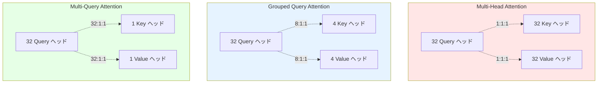
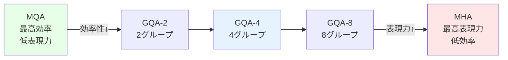
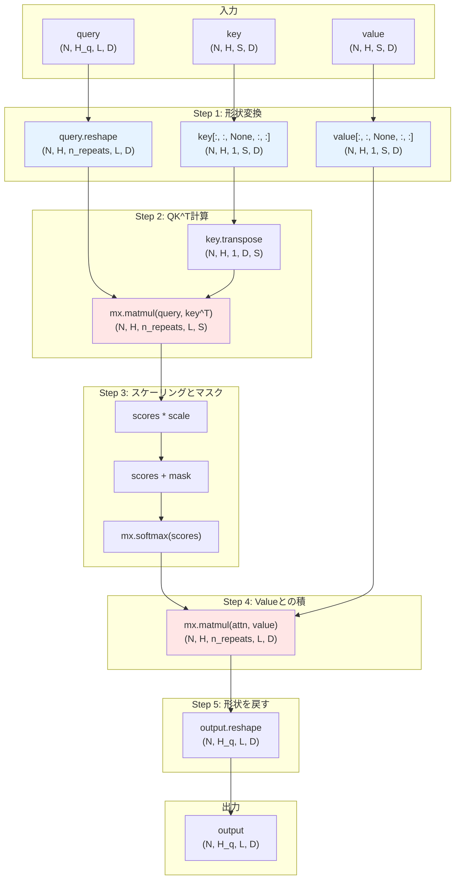
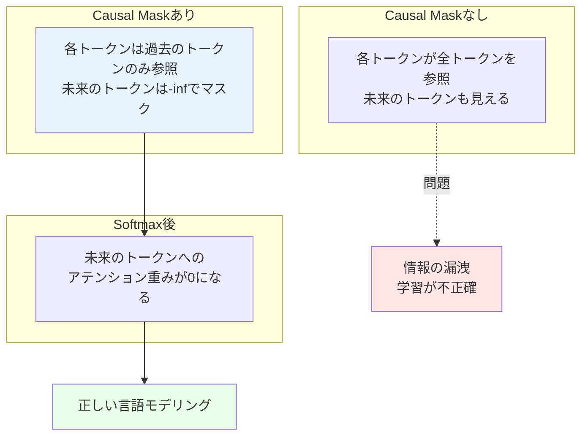
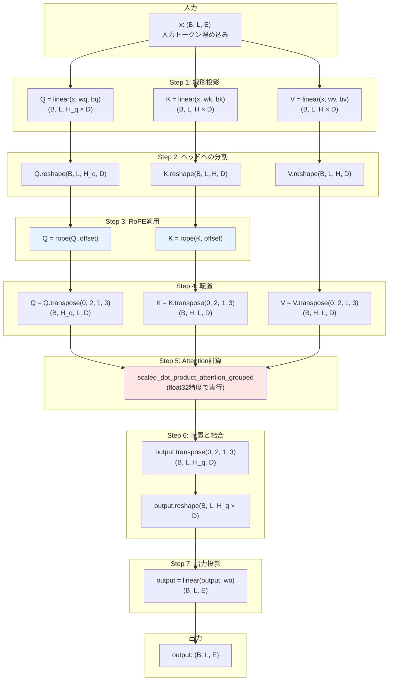

# Week 1 Day 3: Grouped Query Attention (GQA)

3 日目では、Grouped Query Attention (GQA) を実装します。Qwen2 モデルで使用される GQA は、マルチヘッドアテンションの最適化技術で、Key (K) と Value (V) の投影に関連する計算コストとメモリコストを削減します。Multi-Head Attention (MHA) では各 Query (Q) ヘッドが独自の K と V ヘッドを持ちますが、GQA では複数の Q ヘッドが同じ K と V ヘッドを共有します。Multi-Query Attention (MQA) は GQA の特殊ケースで、すべての Q ヘッドが単一の K/V ヘッドペアを共有します。

[📚 推奨読み物: GQA Paper (Training Generalized Multi-Query Transformer Models from Pre-Trained Checkpoints)](https://arxiv.org/abs/2305.13245)

[📚 推奨読み物: Qwen layers implementation in mlx-lm](https://github.com/ml-explore/mlx-lm/blob/main/mlx_lm/models/qwen2.py)

[📚 推奨読み物: PyTorch API (the case where enable_gqa=True)](https://pytorch.org/docs/stable/generated/torch.nn.functional.scaled_dot_product_attention.html)

[📚 推奨読み物: torchtune.modules.MultiHeadAttention](https://pytorch.org/torchtune/0.3/generated/torchtune.modules.MultiHeadAttention.html)

## Task 1: `scaled_dot_product_attention_grouped` を実装する

以下のファイルを修正する必要があります。

```
src/tiny_llm/attention.py
```

このタスクでは、GQA の中核となる grouped scaled dot product attention 関数を実装します。

`src/tiny_llm/attention.py` に `scaled_dot_product_attention_grouped` を実装してください。この関数は標準の scaled dot product attention に似ていますが、query ヘッドの数が key/value ヘッドの数の倍数である場合を処理します。

主な処理は標準の scaled dot product attention と同じです。違いは、K と V ヘッドが複数の Q ヘッド間で共有されることです。つまり、`H_q` 個の独立した K と V ヘッドを持つ代わりに、`H` 個の K と V ヘッドを持ち、各 K と V ヘッドは `n_repeats = H_q // H` 個の Q ヘッドによって共有されます。

中核となるアイデアは、`query`、`key`、`value` をリシェイプして、K と V テンソルが `matmul` 操作中にグループ内の query ヘッドに効果的にブロードキャストされるようにすることです。

- `query` テンソルで `H` と `n_repeats` の次元を分離する方法を考えてください。
- `key` と `value` テンソルに `n_repeats` の次元としてサイズ 1 の次元を追加してブロードキャストを可能にすることを検討してください。

その後、scaled dot product attention の計算（`matmul`、scale、オプショナルな mask、`softmax`、`matmul`）を実行します。ブロードキャストがヘッドの繰り返しを暗黙的に処理します。

K と V テンソルを繰り返すのではなくブロードキャストを活用する方が効率的であることに注意してください。これは、ブロードキャストによって、データの複数のコピーを作成せずに同じデータを複数の場所で使用できるため、メモリを節約し、パフォーマンスを向上させることができるためです。

最後に、最終結果を期待される出力形状にリシェイプすることを忘れないでください。

```
N.. はバッチのための 0 個以上の次元
H_q は query ヘッドの数
H は key/value ヘッドの数（H_q は H で割り切れる必要がある）
L は query シーケンス長
S は key/value シーケンス長
D は head 次元

query: N.. x H_q x L x D
key: N.. x H x S x D
value: N.. x H x S x D
mask: N.. x H_q x L x S
output: N.. x H_q x L x D
```

グループ化されたヘッドに加えて、Q、K、V が同じシーケンス長を持たない可能性がある実装も拡張していることに注意してください。

::::details 手順補足

手元の MacBook 等に tiny-llm リポジトリをクローンし、以下を実行する。

```bash
URL=https://raw.githubusercontent.com/pdm-project/pdm/main/install-pdm.py
curl -sSL $URL | python3 -
pdm update
```
::::

:::message alert
初期状態では不完全な実装のためテストはエラーします。自分で参考資料を読みながら実装することでエラーを解消しましょう。
:::

実装をテストするには、以下のコマンドを実行できます。

```bash
pdm run test --week 1 --day 3 -- -k task_1
```

## Task 2: Causal Masking を実装する

[📚 推奨読み物: Writing an LLM from scratch, part 9 -- causal attention](https://www.gilesthomas.com/2025/03/llm-from-scratch-9-causal-attention)

このタスクでは、grouped attention のための causal masking を実装します。

Causal masking は、アテンションメカニズムがシーケンス内の将来のトークンに注意を向けることを防ぐ技術です。`mask` が `causal` に設定されている場合、causal mask を適用します。

Causal mask は `(L, S)` の形状の正方行列で、`L` は query シーケンス長、`S` は key/value シーケンス長です。このマスクは下三角行列で、対角線上および対角線より下の要素は 0、対角線より上の要素は -inf です。例えば、`L = 3`、`S = 5` の場合、マスクは次のようになります。

```
0   0   0   -inf -inf
0   0   0   0    -inf
0   0   0   0    0
```

`src/tiny_llm/attention.py` に `causal_mask` 関数を実装し、`scaled_dot_product_attention_grouped` 関数で使用してください。また、causal mask の対角位置は PyTorch API とは異なることに注意してください。

実装をテストするには、以下のコマンドを実行できます。

```bash
pdm run test --week 1 --day 3 -- -k task_2
```

## Task 3: Qwen2 Grouped Query Attention を実装する

このタスクでは、Qwen2 Grouped Query Attention を実装します。以下のファイルを修正する必要があります。

```
src/tiny_llm/qwen2_week1.py
```

`Qwen2MultiHeadAttention` は Qwen2 のマルチヘッドアテンションを実装します。以下の疑似コードを実装する必要があります。

```
x: B, L, E
q = linear(x, wq, bq) -> B, L, H_q, D
k = linear(x, wk, bk) -> B, L, H, D
v = linear(x, wv, bv) -> B, L, H, D
q = rope(q, offset=slice(0, L))
k = rope(k, offset=slice(0, L))
(必要に応じて転置)
x = scaled_dot_product_attention_grouped(q, k, v, scale, mask) -> B, L, H_q, D ; float32 精度で実行
(必要に応じて転置)
x = linear(x, wo) -> B, L, E
```

非従来型の RoPE を使用する必要があることに留意してください。

実装をテストするには、以下のコマンドを実行できます。

```bash
pdm run test --week 1 --day 3 -- -k task_3
```

1 日分のすべてのテストを実行するには、

```bash
pdm run test --week 1 --day 3
```

::::details 解答
```bash
cd src && cp tiny_llm_ref/attention.py tiny_llm/attention.py && cp tiny_llm_ref/qwen2_week1.py tiny_llm/qwen2_week1.py
```
::::

# コラム: GQA の効率性とメモリ削減のメカニズム

このコラムでは、Grouped Query Attention (GQA) がどのようにして計算コストとメモリ使用量を削減するのか、その仕組みを詳しく解説します。

::::details GQA の効率性とメモリ削減のメカニズム

## アテンションの種類の比較

現代の Transformer モデルでは、3 つの主要なアテンション方式が使用されています。



### Multi-Head Attention (MHA)

従来の MHA では、各 Query ヘッドが独自の Key と Value ヘッドを持ちます。

**例**: 32 個の Query ヘッドがある場合
- Query ヘッド: 32 個
- Key ヘッド: 32 個
- Value ヘッド: 32 個
- **比率**: 1:1:1

この方式は表現力が最も高いですが、メモリと計算コストも最大です。

### Multi-Query Attention (MQA)

MQA では、すべての Query ヘッドが単一の Key と Value ヘッドを共有します。

**例**: 32 個の Query ヘッドがある場合
- Query ヘッド: 32 個
- Key ヘッド: 1 個
- Value ヘッド: 1 個
- **比率**: 32:1:1

この方式は非常に効率的ですが、表現力が制限されます。

### Grouped Query Attention (GQA)

GQA は MHA と MQA の中間的なアプローチです。Query ヘッドをグループに分割し、各グループが Key と Value ヘッドを共有します。

**例**: 32 個の Query ヘッドを 4 つのグループに分割
- Query ヘッド: 32 個
- Key ヘッド: 4 個（各グループに 1 個）
- Value ヘッド: 4 個（各グループに 1 個）
- **比率**: 8:1:1（グループ内）

この方式は、効率性と表現力のバランスが取れています。

## メモリ削減の具体例

実際の数値を使って、メモリ削減効果を計算してみましょう。

**設定**:
- モデル層数: 32 層
- Query ヘッド数: 32 個
- ヘッド次元: 128
- シーケンス長: 2048 トークン
- データ型: float16（2 バイト）

### KV キャッシュのサイズ計算

推論時には、過去のトークンの Key と Value を KV キャッシュに保存して再利用します。

**MHA の場合**:
```
KV キャッシュサイズ = 層数 × 2 (K+V) × ヘッド数 × シーケンス長 × ヘッド次元 × バイト数
= 32 × 2 × 32 × 2048 × 128 × 2
= 1,073,741,824 バイト
≈ 1 GB
```

**GQA の場合（4 グループ）**:
```
KV キャッシュサイズ = 32 × 2 × 4 × 2048 × 128 × 2
= 134,217,728 バイト
≈ 134 MB
```

**削減率**: 約 87.5%（1/8 に削減）

**MQA の場合**:
```
KV キャッシュサイズ = 32 × 2 × 1 × 2048 × 128 × 2
= 33,554,432 バイト
≈ 33 MB
```

**削減率**: 約 96.9%（1/32 に削減）

## 計算コストの削減

アテンション計算における主な演算は、以下の 2 つの行列積です。

1. **QK^T**: Query と Key の転置の積
2. **Attention × V**: アテンション重みと Value の積

### FLOPs（浮動小数点演算数）の比較

**設定**:
- Query ヘッド数: H_q = 32
- Key/Value ヘッド数: H (MHA: 32, GQA: 4, MQA: 1)
- シーケンス長: L = 2048
- ヘッド次元: D = 128

**QK^T の計算コスト**:
```
MHA: H_q × L × L × D = 32 × 2048 × 2048 × 128 ≈ 17.2 GFLOPs
GQA: H_q × L × L × D = 32 × 2048 × 2048 × 128 ≈ 17.2 GFLOPs
MQA: H_q × L × L × D = 32 × 2048 × 2048 × 128 ≈ 17.2 GFLOPs
```

この部分の計算コストは同じです。Query ヘッド数が変わらないためです。

**Attention × V の計算コスト**:

MHA では各 Query ヘッドが独自の Value ヘッドを持つため、計算が独立しています。GQA と MQA では、Value ヘッドがブロードキャストされるため、実際のデータ転送量が削減されます。

メモリバンド幅が制約となる場合（GPU では一般的）、GQA と MQA は Value の読み込み回数が削減されるため、実質的に高速化します。

## ブロードキャストによる効率化

GQA の実装では、Key と Value を物理的に複製するのではなく、ブロードキャスト機能を使用します。

### Traditional アプローチ（非効率）

```python
# H = 4, H_q = 32, n_repeats = 8
key_repeated = mx.repeat(key, repeats=n_repeats, axis=1)
# 形状: (N, 4, L, D) → (N, 32, L, D)
# メモリ使用量: 8 倍に増加
```

このアプローチでは、Key と Value のデータを物理的にコピーするため、メモリ使用量が増加します。

### ブロードキャストアプローチ（効率的）

```python
# H = 4, H_q = 32, n_repeats = 8
# query を reshape
query = query.reshape(N, H, n_repeats, L, D)
# 形状: (N, 32, L, D) → (N, 4, 8, L, D)

# key に次元を追加
key = key[:, :, None, :, :]
# 形状: (N, 4, L, D) → (N, 4, 1, L, D)

# matmul でブロードキャストが自動的に適用される
scores = mx.matmul(query, key.transpose(0, 1, 2, 4, 3))
# ブロードキャストにより key の 1 が 8 に拡張される
# 形状: (N, 4, 8, L, D) × (N, 4, 1, D, L) → (N, 4, 8, L, L)
```

このアプローチでは、データを物理的にコピーせず、計算時にブロードキャストで参照するため、メモリ効率が高くなります。

## 表現力とのトレードオフ

GQA がどの程度の表現力を保持するかは、グループ数によって決まります。



研究によると、GQA-4（4 グループ）や GQA-8（8 グループ）は、MHA とほぼ同等の性能を維持しながら、大幅なメモリと計算の削減を実現することが示されています。

## Qwen2 における GQA の採用

Qwen2 モデルシリーズは GQA を採用しています。

**例: Qwen2-7B**
- Query ヘッド数: 28
- Key/Value ヘッド数: 4
- グループサイズ: 7（28 / 4）

この設定により、Qwen2 は以下を実現しています:
- KV キャッシュサイズを MHA の 1/7 に削減
- 長いコンテキストウィンドウ（128K トークン）のサポート
- 推論速度の向上（メモリバンド幅制約の緩和）
- 高い表現力の維持

GQA は、現代の大規模言語モデルにおける重要な最適化技術であり、効率性と性能のバランスを取る上で不可欠な要素となっています。

::::

# Task 1 の解説

このセクションでは、Task 1 の `scaled_dot_product_attention_grouped` 関数について、GQA の仕組みから実装の詳細まで段階的に解説します。

::::details Task 1 の解説

## Task 1 Part 1: GQA の基本概念

### なぜ GQA が必要なのか

従来の Multi-Head Attention (MHA) では、各 Query ヘッドが独自の Key と Value ヘッドを持ちます。これは表現力が高い一方で、以下の問題があります。

推論時の KV キャッシュが非常に大きくなります。例えば、32 ヘッド、シーケンス長 2048、ヘッド次元 128 の場合、1 層あたり約 33 MB のキャッシュが必要です（float16）。大規模モデルでは層数が多いため、KV キャッシュの合計サイズがすぐに数 GB に達します。

メモリバンド幅が制約となる場合、Key と Value の読み込みが推論速度のボトルネックになります。

長いコンテキストウィンドウ（例: 128K トークン）をサポートする際、メモリ制約により実現が困難になります。

### GQA のアイデア

GQA は、複数の Query ヘッドが同じ Key と Value ヘッドを共有することで、これらの問題を解決します。

**直感的な例**:
- クラスに 32 人の生徒（Query ヘッド）がいる
- MHA: 各生徒に専用の教科書セット（Key/Value）を用意 → 32 セット必要
- GQA-4: 生徒を 4 グループに分け、各グループで教科書を共有 → 4 セット必要
- MQA: 全員で 1 セットの教科書を共有 → 1 セット必要

GQA-4 では、メモリ使用量が 1/8 に削減されますが、グループ内の Query ヘッドは同じ Key/Value を参照できるため、一定の表現力を維持できます。

### ブロードキャストの役割

GQA の実装では、Key と Value を物理的に複製するのではなく、ブロードキャストを使用します。

```python
# 非効率な方法（避けるべき）
key_repeated = mx.repeat(key, repeats=n_repeats, axis=1)
# (N, H, L, D) → (N, H_q, L, D)
# メモリが n_repeats 倍に増加

# 効率的な方法（ブロードキャスト）
query = query.reshape(N, H, n_repeats, L, D)
key = key[:, :, None, :, :]  # 次元を追加
# matmul 時にブロードキャストが自動適用
# メモリ増加なし
```

ブロードキャストにより、同じデータを複数の場所で参照できるため、メモリ効率が大幅に向上します。

## Task 1 Part 2: 実装の詳細

### 形状の変換戦略

GQA の核心は、Query、Key、Value の形状を適切に変換してブロードキャストを活用することです。

**入力形状**:
```
query: (N, H_q, L, D)  例: (1, 32, 2048, 128)
key:   (N, H, S, D)    例: (1, 4, 2048, 128)
value: (N, H, S, D)    例: (1, 4, 2048, 128)
```

**目標**:
- Query の H_q を H × n_repeats に分割
- Key と Value に n_repeats 次元（サイズ 1）を追加
- ブロードキャストで自動的に拡張

**変換後の形状**:
```
query: (N, H, n_repeats, L, D)  例: (1, 4, 8, 2048, 128)
key:   (N, H, 1, S, D)          例: (1, 4, 1, 2048, 128)
value: (N, H, 1, S, D)          例: (1, 4, 1, 2048, 128)
```

### 実装の流れ



### コード例（概念的）

```python
def scaled_dot_product_attention_grouped(
    query, key, value, scale=None, mask=None
):
    N, H_q, L, D = query.shape
    _, H, S, _ = key.shape

    # n_repeats を計算
    n_repeats = H_q // H

    # Step 1: 形状変換
    query = query.reshape(N, H, n_repeats, L, D)
    key = key[:, :, None, :, :]      # (N, H, 1, S, D)
    value = value[:, :, None, :, :]  # (N, H, 1, S, D)

    # Step 2: QK^T を計算
    # key を転置: (N, H, 1, S, D) → (N, H, 1, D, S)
    key_t = key.transpose(0, 1, 2, 4, 3)
    scores = mx.matmul(query, key_t)
    # scores の形状: (N, H, n_repeats, L, S)
    # ブロードキャストにより key の 1 が n_repeats に拡張される

    # Step 3: スケーリング
    if scale is None:
        scale = 1.0 / (D ** 0.5)
    scores = scores * scale

    # Step 4: マスクの適用
    if mask is not None:
        # mask の形状を調整
        mask = mask.reshape(N, H, n_repeats, L, S)
        scores = scores + mask

    # Step 5: Softmax
    attn = mx.softmax(scores, axis=-1)

    # Step 6: Value との積
    output = mx.matmul(attn, value)
    # output の形状: (N, H, n_repeats, L, D)
    # ブロードキャストにより value の 1 が n_repeats に拡張される

    # Step 7: 元の形状に戻す
    output = output.reshape(N, H_q, L, D)

    return output
```

### ブロードキャストの詳細

ブロードキャストは、形状が異なるテンソル間の演算を可能にする仕組みです。

**例: QK^T の計算**
```
query: (1, 4, 8, 2048, 128)
key^T: (1, 4, 1, 128, 2048)
```

`mx.matmul` を実行すると:
1. key^T の次元 1 が 8 に自動的に拡張される（ブロードキャスト）
2. 各グループの 8 個の Query ヘッドが同じ Key を参照
3. 結果: (1, 4, 8, 2048, 2048)

**例: Attention × Value の計算**
```
attn:  (1, 4, 8, 2048, 2048)
value: (1, 4, 1, 2048, 128)
```

`mx.matmul` を実行すると:
1. value の次元 1 が 8 に自動的に拡張される（ブロードキャスト）
2. 各グループの 8 個の Query ヘッドが同じ Value を参照
3. 結果: (1, 4, 8, 2048, 128)

このブロードキャストにより、物理的なデータコピーなしで、効率的に計算が実行されます。

## Task 1 Part 3: マスクの処理

### マスクの形状調整

マスクの形状も GQA に合わせて調整する必要があります。

**入力マスク形状**:
```
mask: (N, H_q, L, S)  例: (1, 32, 2048, 2048)
```

**必要な形状**:
```
mask: (N, H, n_repeats, L, S)  例: (1, 4, 8, 2048, 2048)
```

reshape により、マスクを Query の構造に合わせます。

```python
mask = mask.reshape(N, H, n_repeats, L, S)
```

### マスクの種類

アテンションでは、主に 2 種類のマスクが使用されます。

**Padding マスク**: シーケンスの無効な位置（パディング）を -inf でマスク

**Causal マスク**: 未来のトークンを参照できないようにする（Task 2 で実装）

マスクは scores に加算されるため、-inf の位置は softmax 後に 0 になります。

::::

# Task 2 の解説

このセクションでは、Task 2 の Causal Masking について、その目的から実装の詳細まで解説します。

::::details Task 2 の解説

## Task 2 Part 1: Causal Masking の目的

### 言語モデルにおける因果性

言語モデルは、過去のトークンのみを使用して次のトークンを予測する必要があります。Causal masking は、この制約を強制するための仕組みです。

**例**: "The cat sat on the mat" を生成する場合

```
位置 0: "The"       → 過去なし、自分のみ参照可能
位置 1: "cat"       → 位置 0 と自分を参照可能
位置 2: "sat"       → 位置 0, 1, 2 を参照可能
位置 3: "on"        → 位置 0, 1, 2, 3 を参照可能
位置 4: "the"       → 位置 0, 1, 2, 3, 4 を参照可能
位置 5: "mat"       → 位置 0, 1, 2, 3, 4, 5 を参照可能
```

もし未来のトークンが参照できてしまうと、モデルは「答えを見ながら」予測することになり、正しく学習できません。

### Causal Mask の構造

Causal mask は下三角行列の構造を持ちます。

**例: L = 5, S = 5 の場合**
```
Query\Key   0      1      2      3      4
    0       0    -inf   -inf   -inf   -inf
    1       0      0    -inf   -inf   -inf
    2       0      0      0    -inf   -inf
    3       0      0      0      0    -inf
    4       0      0      0      0      0
```

- 0: 参照可能（アテンション計算に含まれる）
- -inf: 参照不可能（softmax 後に 0 になる）

対角線上およびその下側の要素は 0（参照可能）、対角線より上側の要素は -inf（参照不可能）です。

### KV キャッシュ使用時の Causal Mask

推論時に KV キャッシュを使用する場合、Query と Key のシーケンス長が異なることがあります。

**例: すでに 5 トークン処理済み、新しく 3 トークン処理する場合**
```
L = 3 (新しい Query)
S = 8 (過去 5 + 新しい 3)

Query\Key   0   1   2   3   4   5   6   7
    5       0   0   0   0   0   0  -inf -inf
    6       0   0   0   0   0   0   0   -inf
    7       0   0   0   0   0   0   0    0
```

この場合、Query の位置 i は Key の位置 0 から i までを参照できます。

## Task 2 Part 2: Causal Mask の実装

### 実装の基本方針

Causal mask を生成するには、以下のステップが必要です。

1. L × S のマスク行列を作成
2. 各位置 (i, j) について、i < j なら -inf、それ以外は 0
3. offset を考慮（KV キャッシュ使用時）

### MLX での実装

MLX には便利な関数 `mx.tril` と `mx.triu` があります。

- `mx.tril(x, k=0)`: 下三角行列を取得（k より上の要素を 0 にする）
- `mx.triu(x, k=0)`: 上三角行列を取得（k より下の要素を 0 にする）

**例: mx.tril の使用**
```python
import mlx.core as mx

# 5×5 の 1 で埋められた行列
ones = mx.ones((5, 5))

# 下三角行列（対角含む）
lower = mx.tril(ones)
# [[1, 0, 0, 0, 0],
#  [1, 1, 0, 0, 0],
#  [1, 1, 1, 0, 0],
#  [1, 1, 1, 1, 0],
#  [1, 1, 1, 1, 1]]

# 上三角行列（対角を除く）
upper = mx.triu(ones, k=1)
# [[0, 1, 1, 1, 1],
#  [0, 0, 1, 1, 1],
#  [0, 0, 0, 1, 1],
#  [0, 0, 0, 0, 1],
#  [0, 0, 0, 0, 0]]
```

### Causal Mask の生成

```python
def causal_mask(L, S, offset=0):
    # L: Query シーケンス長
    # S: Key シーケンス長
    # offset: KV キャッシュでの開始位置

    # Step 1: 0 で埋められた L × S の行列を作成
    mask = mx.zeros((L, S))

    # Step 2: 各 Query 位置について、参照可能な範囲を計算
    # Query 位置 i (0-indexed) は Key 位置 0 から offset + i まで参照可能

    # 方法 1: tril を使う
    # L × L の下三角行列を作成し、S にパディング
    if L <= S:
        # 下三角行列を作成
        mask_L = mx.tril(mx.ones((L, L)))
        # S - L 列のパディングを追加（-inf）
        if S > L:
            pad = mx.full((L, S - L), float('-inf'))
            mask = mx.concat([mask_L, pad], axis=1)
        else:
            mask = mask_L
    else:
        # L > S の場合は別の処理が必要
        pass

    # 方法 2: triu を使う（より直感的）
    # 上三角部分（対角を除く）を -inf に設定
    mask = mx.triu(mx.full((L, S), float('-inf')), k=S - L + 1 + offset)

    return mask
```

### Offset の考慮

offset パラメータは、KV キャッシュ使用時に重要です。

**例**: offset = 5, L = 3, S = 8
```
Query 位置 0（実際は位置 5）は Key 位置 0〜5 を参照可能
Query 位置 1（実際は位置 6）は Key 位置 0〜6 を参照可能
Query 位置 2（実際は位置 7）は Key 位置 0〜7 を参照可能
```

Mask:
```
Query\Key   0   1   2   3   4   5   6   7
    0       0   0   0   0   0   0  -inf -inf
    1       0   0   0   0   0   0   0   -inf
    2       0   0   0   0   0   0   0    0
```

対角の位置が offset だけシフトします。

## Task 2 Part 3: Causal Mask の統合

### scaled_dot_product_attention_grouped への統合

```python
def scaled_dot_product_attention_grouped(
    query, key, value, scale=None, mask=None
):
    # ... 形状変換とスコア計算 ...

    # mask が "causal" の場合、causal mask を生成
    if mask == "causal":
        L = query.shape[2]  # Query シーケンス長
        S = key.shape[2]    # Key シーケンス長
        mask = causal_mask(L, S, offset=0)
        # 形状を調整
        mask = mask.reshape(1, 1, 1, L, S)
        # ブロードキャストで (N, H, n_repeats, L, S) に拡張
    elif mask is not None:
        # 既存のマスクを reshape
        mask = mask.reshape(N, H, n_repeats, L, S)

    # スコアにマスクを加算
    if mask is not None:
        scores = scores + mask

    # ... softmax と value との積 ...
```

### 視覚化

Causal mask がアテンションに与える影響を視覚化します。



Causal masking により、言語モデルは正しい因果関係を学習し、推論時にも適切に動作します。

::::

# Task 3 の解説

このセクションでは、Task 3 の Qwen2 Grouped Query Attention の実装について解説します。

::::details Task 3 の解説

## Task 3 Part 1: Qwen2MultiHeadAttention の構造

### 全体の処理フロー

Qwen2MultiHeadAttention は、以下のステップで構成されます。



### 各ステップの詳細

**Step 1: 線形投影**

入力 x を Query、Key、Value に投影します。

```python
# x: (B, L, E)
q = linear(x, self.wq, self.bq)  # (B, L, H_q * D)
k = linear(x, self.wk, self.bk)  # (B, L, H * D)
v = linear(x, self.wv, self.bv)  # (B, L, H * D)
```

Qwen2 では、Q のヘッド数 (H_q) と K/V のヘッド数 (H) が異なります（GQA）。

**Step 2: ヘッドへの分割**

投影された結果をヘッドに分割します。

```python
q = q.reshape(B, L, self.num_heads, self.head_dim)
k = k.reshape(B, L, self.num_kv_heads, self.head_dim)
v = v.reshape(B, L, self.num_kv_heads, self.head_dim)
```

**Step 3: RoPE の適用**

Query と Key に Rotary Positional Encoding を適用します。

```python
q = self.rope(q, offset=offset)
k = self.rope(k, offset=offset)
```

Qwen2 では非従来型の RoPE を使用することに注意してください（`traditional=False`）。

**Step 4: 転置**

アテンション計算のために、ヘッド次元とシーケンス次元を入れ替えます。

```python
q = q.transpose(0, 2, 1, 3)  # (B, H_q, L, D)
k = k.transpose(0, 2, 1, 3)  # (B, H, L, D)
v = v.transpose(0, 2, 1, 3)  # (B, H, L, D)
```

**Step 5: Attention 計算**

GQA アテンションを計算します。重要: float32 精度で実行します。

```python
# float32 に変換
q = q.astype(mx.float32)
k = k.astype(mx.float32)
v = v.astype(mx.float32)

output = scaled_dot_product_attention_grouped(
    q, k, v,
    scale=self.scale,
    mask="causal"
)

# 元の dtype に戻す
output = output.astype(original_dtype)
```

**Step 6: 転置と結合**

アテンション出力を元の形状に戻します。

```python
output = output.transpose(0, 2, 1, 3)  # (B, L, H_q, D)
output = output.reshape(B, L, self.num_heads * self.head_dim)
```

**Step 7: 出力投影**

最終的な線形投影を適用します。

```python
output = linear(output, self.wo)  # (B, L, E)
```

## Task 3 Part 2: 実装のポイント

### 重要な注意事項

**1. 非従来型 RoPE の使用**

Qwen2 は非従来型の RoPE を使用します。RoPE インスタンスを作成する際に `traditional=False` を設定してください。

```python
self.rope = RoPE(
    dims=self.head_dim,
    seq_len=config.max_position_embeddings,
    traditional=False  # 重要!
)
```

**2. float32 精度でのアテンション計算**

アテンション計算は数値的に不安定になりやすいため、float32 精度で実行します。

```python
original_dtype = q.dtype
q, k, v = q.astype(mx.float32), k.astype(mx.float32), v.astype(mx.float32)
output = scaled_dot_product_attention_grouped(q, k, v, ...)
output = output.astype(original_dtype)
```

**3. Causal Mask の適用**

言語モデルでは、各トークンが未来のトークンを参照できないようにする必要があります。

```python
output = scaled_dot_product_attention_grouped(
    q, k, v,
    scale=self.scale,
    mask="causal"  # Causal masking を有効化
)
```

### デバッグのヒント

実装が正しいか確認するには、各ステップで形状を出力して検証します。

```python
print(f"Input shape: {x.shape}")           # (B, L, E)
print(f"Q shape after linear: {q.shape}")  # (B, L, H_q * D)
print(f"Q shape after reshape: {q.shape}") # (B, L, H_q, D)
print(f"Q shape after rope: {q.shape}")    # (B, L, H_q, D)
print(f"Q shape after transpose: {q.shape}") # (B, H_q, L, D)
print(f"Output shape: {output.shape}")     # (B, L, E)
```

各ステップで期待される形状と一致するか確認してください。

::::
