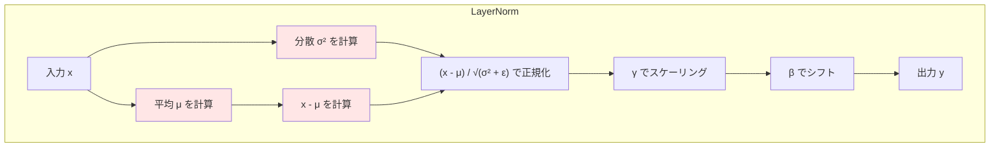
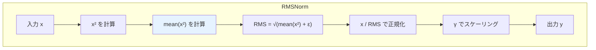
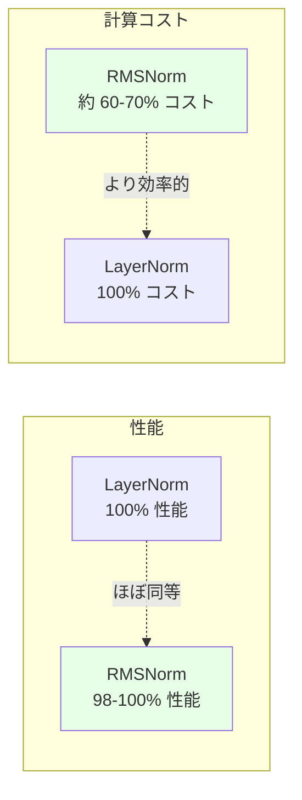
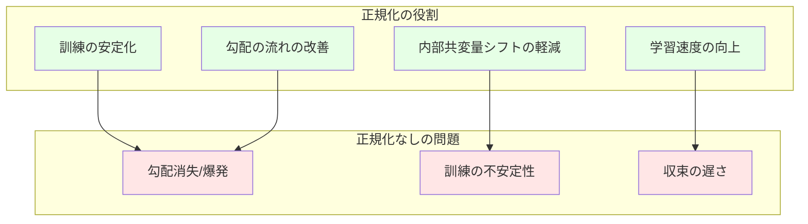
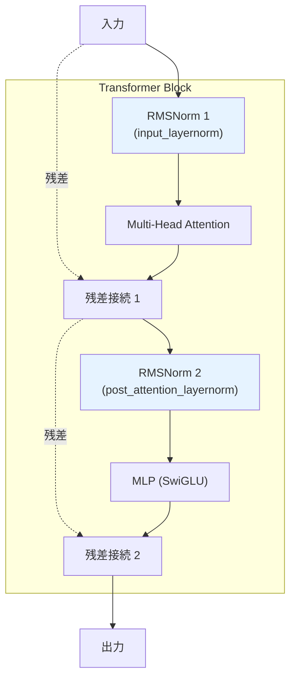
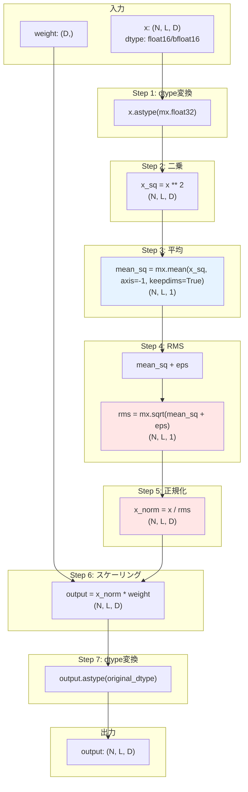
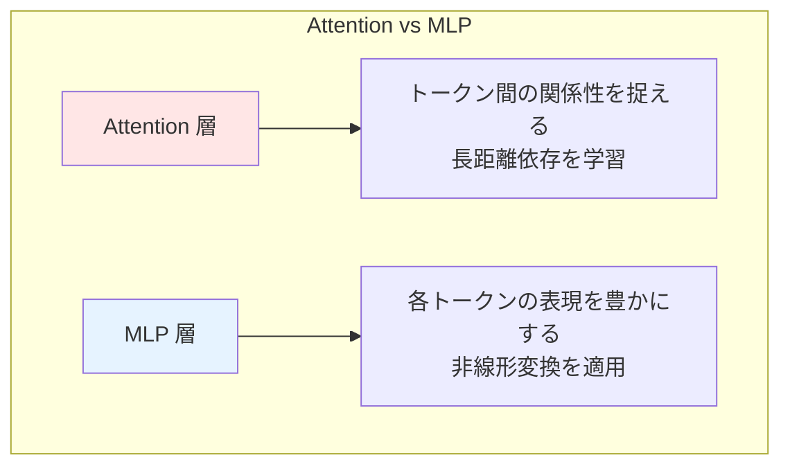
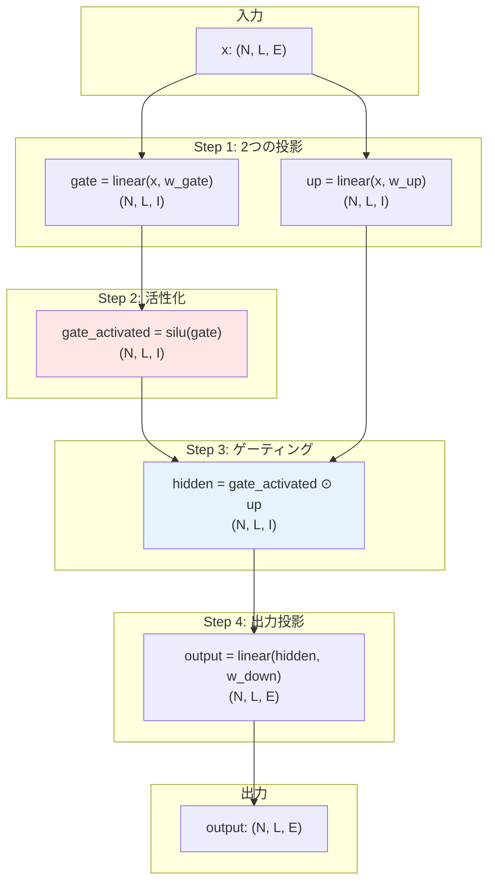
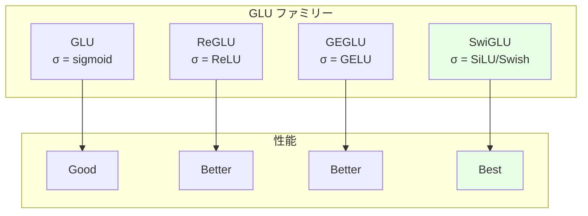

# Week 1 Day 4: RMSNorm と Multi Perceptron Layer

4 日目では、Qwen2 Transformer アーキテクチャの 2 つの重要なコンポーネントである RMSNorm と MLP (Multi-Layer Perceptron) ブロック（FeedForward Network とも呼ばれます）を実装します。RMSNorm は、従来の Layer Normalization と比較して計算オーバーヘッドが少ない正規化技術で、訓練の安定化に役立ちます。MLP ブロックは、アテンション層の出力を処理するフィードフォワードネットワークで、非線形変換を適用してモデルの表現力を高めます。

## Task 1: `RMSNorm` を実装する

このタスクでは、`RMSNorm` 層を実装します。

```
src/tiny_llm/layer_norm.py
```

[📚 推奨読み物: Root Mean Square Layer Normalization](https://arxiv.org/abs/1910.07467)

[📚 推奨読み物: Qwen2 layers implementation in mlx-lm (includes RMSNorm)](https://github.com/ml-explore/mlx-lm/blob/bcb96db87f218453774f8808159012f15fc0dc7b/mlx_lm/models/qwen2.py)

RMSNorm は以下のように定義されます。

$$
y = \frac{x}{\sqrt{\text{mean}(x^2) + \epsilon}} \cdot \text{weight}
$$

ここで:
- `x` は入力テンソル
- `weight` は学習可能なスケーリングパラメータ
- `epsilon` (eps) は数値安定性のために追加される小さな定数（例: 1e-5 または 1e-6）
- `mean(x^2)` は二乗の合計を要素数で割ったもの

正規化は、各サンプルの特徴ベクトルに対して独立に適用され、通常は入力の最後の次元に対して行われます。

入力と重みが低精度フォーマット（例: `float16` や `bfloat16`）であっても、平方根を取る前に `float32` で平均計算を実行して精度を維持する必要があることに注意してください。

```
D は埋め込み次元

x: N.. x D
weight: D
output: N.. x D
```

::::details 手順補足

手元の MacBook 等に tiny-llm リポジトリをクローンし、以下を実行する。

```bash
URL=https://raw.githubusercontent.com/pdm-project/pdm/main/install-pdm.py
curl -sSL $URL | python3 -
pdm update
```
::::

:::message alert
初期状態では不完全な実装のためテストはエラーします。自分で参考資料を読みながら実装することでエラーを解消しましょう。
:::

実装をテストするには、以下のコマンドを実行できます。

```bash
pdm run test --week 1 --day 4 -- -k task_1
```

## Task 2: MLP ブロックを実装する

このタスクでは、`Qwen2MLP` という名前の MLP ブロックを実装します。

```
src/tiny_llm/qwen2_week1.py
```

元の Transformer モデルは、各ブロック内でシンプルな Feed-Forward Network (FFN) を使用していました。この FFN は通常、2 つの線形変換とその間の ReLU 活性化関数で構成され、位置ごとに適用されます。

Qwen2 を含む現代の Transformer アーキテクチャは、性能向上のためにより高度な FFN のバリアントを採用することがよくあります。Qwen2 は、SwiGLU と呼ばれる Gated Linear Unit (GLU) の特定のタイプを使用します。

[📚 推奨読み物: Attention is All You Need (Transformer Paper, Section 3.3 "Position-wise Feed-Forward Networks")](https://arxiv.org/abs/1706.03762)

[📚 推奨読み物: GLU Paper(Language Modeling with Gated Convolutional Networks)](https://arxiv.org/pdf/1612.08083)

[📚 推奨読み物: SilU(Swish) activation function](https://arxiv.org/pdf/1710.05941)

[📚 推奨読み物: SwiGLU Paper(GLU Variants Improve Transformer)](https://arxiv.org/abs/2002.05202v1)

[📚 推奨読み物: PyTorch SiLU documentation](https://pytorch.org/docs/stable/generated/torch.nn.SiLU.html)

[📚 推奨読み物: Qwen2 layers implementation in mlx-lm (includes MLP)](https://github.com/ml-explore/mlx-lm/blob/main/mlx_lm/models/qwen2.py)

基本的に、SwiGLU は GLU と SiLU (Sigmoid Linear Unit) 活性化関数の組み合わせです。

- GLU は、モデルが入力のどの部分に焦点を当てるかを学習できるゲーティングメカニズムです。通常、入力の 2 つの線形投影の要素ごとの積が含まれ、そのうちの 1 つは活性化関数を通過する場合があります。元の FFN で使用される ReLU と比較して、GLU はデータ内のより複雑な関係を学習し、どの特徴を保持し、どの特徴を破棄するかを決定するのに役立ちます。
- SiLU (Sigmoid Linear Unit) は、さまざまなディープラーニングタスクで優れた性能を発揮することが示されている、滑らかで非単調な活性化関数です。GLU で使用される ReLU やシグモイドと比較して、ゼロ勾配の「デッドゾーン」なしで完全に微分可能であり、負の入力に対してもゼロ以外の出力を保持します。

まず、`basics.py` に `silu` 関数を実装する必要があります。`silu` は、形状 `N.. x I` のテンソルを受け取り、同じ形状のテンソルを返します。

`silu` 関数は以下のように定義されます。

$$
\text{SiLU}(x) = x \cdot \text{sigmoid}(x) = \frac{x}{1 + e^{-x}}
$$

次に、`Qwen2MLP` を実装します。Qwen2 の MLP ブロックの構造は以下の通りです。

- ゲート線形投影 ($W_{gate}$)
- アップ線形投影 ($W_{up}$)
- $W_{gate}$ の出力に適用される SiLU 活性化関数
- SiLU で活性化された $W_{gate}$ の出力と $W_{up}$ の出力の要素ごとの乗算。これが「ゲート」部分を形成します
- 最終的なダウン線形投影 ($W_{down}$)

これは以下のように表現できます。

$$
\text{MLP}(x) = (\text{SiLU}(W_{gate}(x)) \odot W_{up}(x))W_{down}
$$

ここで、$\odot$ は要素ごとの乗算を示します。Qwen2 の MLP におけるすべての線形投影は、通常、バイアスなしで実装されます。

```
N.. はバッチのための 0 個以上の次元
E は hidden_size（モデルの埋め込み次元）
I は intermediate_size（MLP の隠れ層の次元）
L はシーケンス長

input: N.. x L x E
w_gate: I x E
w_up: I x E
w_down: E x I
output: N.. x L x E
```

実装をテストするには、以下のコマンドを実行できます。

```bash
pdm run test --week 1 --day 4 -- -k task_2
```

1 日分のすべてのテストを実行するには、

```bash
pdm run test --week 1 --day 4
```

::::details 解答
```bash
cd src && cp tiny_llm_ref/layer_norm.py tiny_llm/layer_norm.py && cp tiny_llm_ref/basics.py tiny_llm/basics.py && cp tiny_llm_ref/qwen2_week1.py tiny_llm/qwen2_week1.py
```
::::

# コラム: LayerNorm vs RMSNorm - なぜ RMSNorm が選ばれるのか

このコラムでは、従来の Layer Normalization と RMSNorm の違いを詳しく解説し、なぜ現代の大規模言語モデルで RMSNorm が採用されるのかを理解します。

::::details LayerNorm vs RMSNorm

## Layer Normalization の基礎

### Layer Normalization の定義

従来の Layer Normalization (LayerNorm) は、以下の式で定義されます。

$$
y = \frac{x - \mu}{\sqrt{\sigma^2 + \epsilon}} \cdot \gamma + \beta
$$

ここで:
- $\mu = \text{mean}(x)$: 入力の平均
- $\sigma^2 = \text{var}(x)$: 入力の分散
- $\gamma$: 学習可能なスケールパラメータ
- $\beta$: 学習可能なシフトパラメータ
- $\epsilon$: 数値安定性のための小さな定数

### Layer Normalization のステップ



LayerNorm は、入力の平均を引いて分散で割ることで、各特徴ベクトルを平均 0、分散 1 に正規化します。

## RMSNorm の設計

### RMSNorm の定義

RMSNorm は、LayerNorm を簡略化したものです。

$$
y = \frac{x}{\sqrt{\text{mean}(x^2) + \epsilon}} \cdot \gamma
$$

ここで:
- $\text{mean}(x^2) = \frac{1}{d}\sum_{i=1}^{d} x_i^2$: 二乗の平均（Root Mean Square）
- $\gamma$: 学習可能なスケールパラメータ
- $\epsilon$: 数値安定性のための小さな定数
- シフトパラメータ $\beta$ は存在しない

### RMSNorm のステップ



RMSNorm は、平均を引く操作を省略し、RMS（二乗平均平方根）で割るのみです。

## LayerNorm と RMSNorm の比較

### 計算量の違い

**LayerNorm の計算ステップ**:
1. 平均 $\mu$ の計算: $O(d)$
2. 分散 $\sigma^2$ の計算: $O(d)$
3. $x - \mu$ の計算: $O(d)$
4. $(x - \mu) / \sqrt{\sigma^2 + \epsilon}$ の計算: $O(d)$
5. $\gamma$ でスケーリング: $O(d)$
6. $\beta$ でシフト: $O(d)$

**合計**: 約 6 回のパスと 2 つの学習可能パラメータ ($\gamma$, $\beta$)

**RMSNorm の計算ステップ**:
1. $x^2$ の計算: $O(d)$
2. $\text{mean}(x^2)$ の計算: $O(d)$
3. $x / \text{RMS}$ の計算: $O(d)$
4. $\gamma$ でスケーリング: $O(d)$

**合計**: 約 4 回のパスと 1 つの学習可能パラメータ ($\gamma$)

### メモリ使用量の違い

**LayerNorm**:
- 中間変数: $\mu$, $\sigma^2$, $x - \mu$
- 学習可能パラメータ: $\gamma$ (d 要素), $\beta$ (d 要素)

**RMSNorm**:
- 中間変数: $\text{mean}(x^2)$, RMS
- 学習可能パラメータ: $\gamma$ (d 要素) のみ

RMSNorm は、パラメータ数が半分になり、中間変数も少なくなります。

### 性能の比較

研究によると、RMSNorm は LayerNorm とほぼ同等の性能を達成しながら、計算コストを削減します。



### なぜ平均を引かなくても良いのか

LayerNorm が平均を引く理由は、データを中心化（mean = 0）することで分散の計算を安定化させるためです。しかし、RMSNorm の研究では、平均を引かなくても以下の理由で十分に機能することが示されています。

**1. Re-centering の不要性**

Transformer の各層の出力は、すでにある程度中心化されている傾向があります。これは、アテンションメカニズムと残差接続の性質によるものです。

**2. Scale の重要性**

正規化において最も重要なのは、各特徴の「スケール」を揃えることです。平均を引くことよりも、分散を正規化することの方が重要であることが実証されています。

**3. 学習可能なパラメータ**

$\gamma$ パラメータがあるため、モデルは必要に応じてスケールを調整できます。平均を引かなくても、学習によって適切な表現を獲得できます。

## RMSNorm の実装上の注意点

### float32 での計算

入力が float16 や bfloat16 の場合でも、RMS の計算は float32 で行う必要があります。

```python
def rms_norm(x, weight, eps=1e-6):
    # x: (N, L, D) in float16
    original_dtype = x.dtype

    # float32 に変換
    x = x.astype(mx.float32)

    # RMS を計算
    rms = mx.sqrt(mx.mean(x ** 2, axis=-1, keepdims=True) + eps)

    # 正規化
    x_normalized = x / rms

    # スケーリング
    output = x_normalized * weight

    # 元の dtype に戻す
    return output.astype(original_dtype)
```

float32 での計算により、数値的な安定性が向上します。特に、平方根の計算は精度が重要です。

### 次元の保持

`mean` の計算時に `keepdims=True` を使用することで、ブロードキャストが容易になります。

```python
# keepdims=False の場合
rms = mx.sqrt(mx.mean(x ** 2, axis=-1) + eps)
# 形状: (N, L)
# x を割る際に形状が合わない

# keepdims=True の場合
rms = mx.sqrt(mx.mean(x ** 2, axis=-1, keepdims=True) + eps)
# 形状: (N, L, 1)
# ブロードキャストで x を割れる
```

## なぜ大規模モデルで RMSNorm が採用されるのか

### 1. 計算効率

大規模モデルでは、層の数が多いため（例: GPT-3 は 96 層）、各層での計算コスト削減が全体の速度に大きく影響します。

**例**: 32 層のモデル、各層で LayerNorm を 2 回使用（アテンション前と MLP 前）
- LayerNorm: 64 回の正規化
- RMSNorm: 64 回の正規化だが、各回が約 30-40% 高速

**全体の高速化**: 約 10-15% の速度向上

### 2. メモリ効率

訓練時のメモリ使用量が削減されることで、より大きなバッチサイズを使用でき、訓練効率が向上します。

### 3. 実装の簡潔さ

RMSNorm の実装は LayerNorm よりもシンプルで、バグが入りにくく、最適化も容易です。

### 4. 採用実績

以下の主要な大規模言語モデルが RMSNorm を採用しています。

- LLaMA シリーズ (Meta)
- Qwen シリーズ (Alibaba)
- Mistral シリーズ
- GPT-NeoX (EleutherAI)

これらのモデルが優れた性能を示していることが、RMSNorm の有効性を裏付けています。

## まとめ

RMSNorm は、LayerNorm の簡略版でありながら、ほぼ同等の性能を維持しつつ、計算効率とメモリ効率を向上させます。大規模モデルにおけるわずかな効率改善が、全体の訓練時間と推論速度に大きな影響を与えるため、RMSNorm は現代の Transformer アーキテクチャにおける標準的な選択肢となっています。

::::

# Task 1 の解説

このセクションでは、Task 1 の RMSNorm 実装について、詳細に解説します。

::::details Task 1 の解説

## Task 1 Part 1: RMSNorm の役割

### Transformer における正規化の重要性

正規化層は、Transformer アーキテクチャにおいて以下の重要な役割を果たします。



**1. 訓練の安定化**

各層の入力を正規化することで、活性化値の分布が安定し、深いネットワークの訓練が可能になります。

**2. 勾配の流れの改善**

正規化により、逆伝播時の勾配が適切な範囲に保たれ、勾配消失や勾配爆発を防ぎます。

**3. 学習速度の向上**

正規化された入力により、より大きな学習率を使用でき、収束が高速化します。

**4. 内部共変量シフトの軽減**

訓練中に層の入力分布が変化する問題を緩和します。

### Qwen2 における RMSNorm の配置

Qwen2 の各 Transformer ブロックでは、RMSNorm が 2 箇所に配置されます。



- **RMSNorm 1 (input_layernorm)**: アテンション層の前に配置
- **RMSNorm 2 (post_attention_layernorm)**: MLP 層の前に配置

この「Pre-Norm」構造（正規化を Sub-Layer の前に配置）は、現代の Transformer で標準的です。

## Task 1 Part 2: RMSNorm の実装詳細

### 数式の分解

RMSNorm の数式を段階的に分解します。

$$
y = \frac{x}{\sqrt{\text{mean}(x^2) + \epsilon}} \cdot \gamma
$$

**Step 1: 二乗の計算**
$$
x^2 = [x_1^2, x_2^2, ..., x_d^2]
$$

**Step 2: 平均の計算**
$$
\text{mean}(x^2) = \frac{1}{d}\sum_{i=1}^{d} x_i^2
$$

**Step 3: RMS の計算**
$$
\text{RMS} = \sqrt{\text{mean}(x^2) + \epsilon}
$$

**Step 4: 正規化**
$$
\hat{x} = \frac{x}{\text{RMS}}
$$

**Step 5: スケーリング**
$$
y = \hat{x} \cdot \gamma
$$

### 実装の流れ



### コード例（概念的）

```python
import mlx.core as mx

class RMSNorm:
    def __init__(self, dims: int, eps: float = 1e-6):
        self.dims = dims
        self.eps = eps
        # 学習可能なスケールパラメータ
        self.weight = mx.ones((dims,))

    def __call__(self, x: mx.array) -> mx.array:
        # 元の dtype を保存
        original_dtype = x.dtype

        # Step 1: float32 に変換
        x = x.astype(mx.float32)

        # Step 2: 二乗を計算
        x_sq = x ** 2

        # Step 3: 最後の次元で平均を計算
        # keepdims=True により形状が (N, L, 1) になる
        mean_sq = mx.mean(x_sq, axis=-1, keepdims=True)

        # Step 4: RMS を計算
        rms = mx.sqrt(mean_sq + self.eps)

        # Step 5: 正規化
        x_norm = x / rms

        # Step 6: スケーリング
        output = x_norm * self.weight

        # Step 7: 元の dtype に戻す
        return output.astype(original_dtype)
```

### 重要な実装ポイント

**1. float32 での計算**

```python
# なぜ float32 が必要か
x = mx.array([1e-5, 1e-5, 1e-5], dtype=mx.float16)
x_sq = x ** 2  # [1e-10, 1e-10, 1e-10]
# float16 では 1e-10 は 0 になる可能性がある

# float32 での計算
x = x.astype(mx.float32)
x_sq = x ** 2  # 正確に計算される
```

float16 では表現できる範囲が限られているため、小さな値の二乗や平方根の計算で精度が失われます。

**2. keepdims=True の重要性**

```python
# keepdims=False の場合
mean_sq = mx.mean(x_sq, axis=-1)  # 形状: (N, L)
# ブロードキャストのために reshape が必要
rms = mx.sqrt(mean_sq + self.eps).reshape(N, L, 1)

# keepdims=True の場合
mean_sq = mx.mean(x_sq, axis=-1, keepdims=True)  # 形状: (N, L, 1)
rms = mx.sqrt(mean_sq + self.eps)  # そのまま使える
```

`keepdims=True` により、次元が保持され、ブロードキャストが自動的に機能します。

**3. epsilon の役割**

```python
# epsilon なしの場合
rms = mx.sqrt(mean_sq)  # mean_sq が 0 に近いと問題

# epsilon ありの場合
rms = mx.sqrt(mean_sq + 1e-6)  # 常に正の値が保証される
```

epsilon は、ゼロ除算や平方根の不安定性を防ぎます。

## Task 1 Part 3: テストとデバッグ

### 期待される動作

RMSNorm の出力は、以下の性質を持つべきです。

**1. RMS が 1 に近い**

正規化後の各ベクトルの RMS は、ほぼ 1 になるはずです（weight が 1 の場合）。

```python
output = rms_norm(x, weight=mx.ones(D))
output_rms = mx.sqrt(mx.mean(output ** 2, axis=-1))
# output_rms ≈ 1.0
```

**2. 形状の保持**

入力と出力の形状は同じであるべきです。

```python
x = mx.random.normal((2, 10, 512))
output = rms_norm(x, weight)
assert output.shape == x.shape
```

**3. dtype の保持**

出力の dtype は入力の dtype と一致するべきです。

```python
x = mx.random.normal((2, 10, 512), dtype=mx.float16)
output = rms_norm(x, weight)
assert output.dtype == mx.float16
```

### デバッグのヒント

実装が正しいか確認するには、各ステップで中間値を出力します。

```python
print(f"Input shape: {x.shape}, dtype: {x.dtype}")
print(f"Input mean: {mx.mean(x)}, std: {mx.std(x)}")

x_sq = x ** 2
print(f"x_sq mean: {mx.mean(x_sq)}")

mean_sq = mx.mean(x_sq, axis=-1, keepdims=True)
print(f"mean_sq shape: {mean_sq.shape}")

rms = mx.sqrt(mean_sq + eps)
print(f"rms shape: {rms.shape}, mean: {mx.mean(rms)}")

x_norm = x / rms
print(f"x_norm mean: {mx.mean(x_norm)}, std: {mx.std(x_norm)}")

output = x_norm * weight
print(f"Output shape: {output.shape}, dtype: {output.dtype}")
```

各ステップで期待される値と形状が得られているか確認してください。

::::

# Task 2 の解説

このセクションでは、Task 2 の Qwen2MLP 実装について解説します。

::::details Task 2 の解説

## Task 2 Part 1: MLP の役割と SwiGLU

### Transformer における MLP の役割

MLP (Multi-Layer Perceptron) 層は、Transformer の各ブロックにおいてアテンション層と並んで重要な役割を果たします。



**Attention 層の役割**:
- トークン間の相互作用をモデル化
- "The cat sat on the mat" で "cat" と "sat" の関係を捉える

**MLP 層の役割**:
- 各トークンの内部表現を豊かにする
- 非線形変換により複雑な特徴を学習
- モデルの表現力の大部分を担う

研究によると、Transformer のパラメータの約 2/3 は MLP 層に存在し、モデルの「知識」の多くが MLP に保存されていると考えられています。

### 従来の FFN から SwiGLU への進化

**元の Transformer の FFN**:
$$
\text{FFN}(x) = \text{ReLU}(xW_1 + b_1)W_2 + b_2
$$

シンプルですが、ReLU の「デッドゾーン」問題（負の入力で勾配が 0）があります。

**GLU (Gated Linear Unit)**:
$$
\text{GLU}(x) = (xW_1 + b_1) \odot \sigma(xW_2 + b_2)
$$

ゲーティングメカニズムにより、モデルが情報の流れを制御できます。

**SwiGLU (Swish-Gated Linear Unit)**:
$$
\text{SwiGLU}(x) = \text{SiLU}(xW_{gate}) \odot (xW_{up})
$$

SiLU（別名 Swish）は ReLU より滑らかで、負の入力でも勾配を持ちます。

### SiLU (Swish) 活性化関数

SiLU は以下のように定義されます。

$$
\text{SiLU}(x) = x \cdot \sigma(x) = \frac{x}{1 + e^{-x}}
$$

**SiLU の特徴**:

```mermaid
graph LR
    subgraph "活性化関数の比較"
        R[ReLU<br/>max(0, x)]
        S[Sigmoid<br/>1/(1+e^-x)]
        Si[SiLU<br/>x·σ(x)]
    end

    subgraph "特性"
        R_Prop[単純<br/>ゼロ勾配問題]
        S_Prop[飽和問題<br/>勾配消失]
        Si_Prop[滑らか<br/>全域で勾配あり]
    end

    R --> R_Prop
    S --> S_Prop
    Si --> Si_Prop

    style Si fill:#e6ffe6
    style Si_Prop fill:#e6ffe6
```

- 滑らかで連続微分可能
- 負の入力でも勾配を持つ
- 自己ゲーティングの性質（x が大きいと線形、小さいと飽和）

## Task 2 Part 2: Qwen2MLP の構造

### 全体の処理フロー



### 各ステップの詳細

**Step 1: 並列な線形投影**

入力を 2 つの異なる中間空間に投影します。

```python
gate = linear(x, w_gate)  # (N, L, E) → (N, L, I)
up = linear(x, w_up)      # (N, L, E) → (N, L, I)
```

ここで、I (intermediate_size) は通常 E (hidden_size) の 8/3 倍程度です（例: E=512 なら I≈1365）。

**Step 2: SiLU 活性化**

gate 投影に SiLU を適用します。

```python
gate_activated = silu(gate)  # (N, L, I)
```

SiLU により、各要素がゲーティング信号として機能します。

**Step 3: 要素ごとの乗算（ゲーティング）**

活性化された gate と up を要素ごとに乗算します。

```python
hidden = gate_activated * up  # (N, L, I)
```

この乗算により、up の各要素が gate によって「ゲート」されます。

**Step 4: ダウン投影**

中間空間から元の空間に戻します。

```python
output = linear(hidden, w_down)  # (N, L, I) → (N, L, E)
```

### ゲーティングメカニズムの直感的理解

ゲーティングは、情報の流れを動的に制御します。

**例**: 3 次元の中間空間を考えます。

```
x = [1.0, 2.0, -1.0]
gate = [2.0, 0.1, -3.0]
up = [5.0, 8.0, 2.0]

gate_activated = silu(gate) = [1.76, 0.05, -0.29]

hidden = gate_activated ⊙ up
       = [1.76*5.0, 0.05*8.0, -0.29*2.0]
       = [8.8, 0.4, -0.58]
```

gate の値が大きい次元（例: gate[0]=2.0）は、up の情報を強く通過させます（8.8）。
gate の値が小さい次元（例: gate[1]=0.1）は、up の情報をほとんどブロックします（0.4）。

このメカニズムにより、モデルは入力に応じて動的に特徴を選択できます。

## Task 2 Part 3: 実装のポイント

### SiLU 関数の実装

```python
def silu(x: mx.array) -> mx.array:
    """
    SiLU activation function.

    SiLU(x) = x * sigmoid(x) = x / (1 + exp(-x))
    """
    return x * mx.sigmoid(x)
```

MLX には `mx.sigmoid` が用意されているので、単純な乗算で実装できます。

### Qwen2MLP の実装

```python
class Qwen2MLP:
    def __init__(self, config):
        self.hidden_size = config.hidden_size
        self.intermediate_size = config.intermediate_size

        # 3つの線形層の重み
        # Qwen2 ではバイアスなし
        self.w_gate = mx.random.normal(
            (self.intermediate_size, self.hidden_size)
        )
        self.w_up = mx.random.normal(
            (self.intermediate_size, self.hidden_size)
        )
        self.w_down = mx.random.normal(
            (self.hidden_size, self.intermediate_size)
        )

    def __call__(self, x: mx.array) -> mx.array:
        # x: (N, L, E)

        # Step 1: 並列投影
        gate = linear(x, self.w_gate)  # (N, L, I)
        up = linear(x, self.w_up)      # (N, L, I)

        # Step 2: SiLU 活性化
        gate_activated = silu(gate)

        # Step 3: ゲーティング（要素ごとの乗算）
        hidden = gate_activated * up

        # Step 4: ダウン投影
        output = linear(hidden, self.w_down)  # (N, L, E)

        return output
```

### 重要な注意事項

**1. バイアスなしの線形層**

Qwen2 の MLP では、すべての線形層がバイアスなしで実装されます。

```python
# バイアスなし
output = linear(x, weight)  # x @ weight.T

# バイアスあり（使用しない）
output = linear(x, weight, bias)  # x @ weight.T + bias
```

**2. intermediate_size の選択**

通常、intermediate_size は hidden_size の約 2.67 倍（8/3）です。

```python
# Qwen2-7B の例
hidden_size = 4096
intermediate_size = 11008  # ≈ 4096 * 2.69
```

この比率は、モデルの表現力とパラメータ数のバランスを取るために選ばれています。

**3. 形状の確認**

各ステップで形状を確認しましょう。

```python
x = mx.random.normal((2, 10, 512))  # (N=2, L=10, E=512)
gate = linear(x, w_gate)  # (2, 10, 1365)
up = linear(x, w_up)      # (2, 10, 1365)
gate_activated = silu(gate)  # (2, 10, 1365)
hidden = gate_activated * up  # (2, 10, 1365)
output = linear(hidden, w_down)  # (2, 10, 512)
```

入力と出力の形状が一致することを確認してください。

::::

# コラム: GLU バリアントの比較 - なぜ SwiGLU なのか

このコラムでは、さまざまな GLU バリアントを比較し、なぜ SwiGLU が選ばれるのかを理解します。

::::details GLU バリアントの比較

## GLU ファミリーの概要

GLU (Gated Linear Unit) は、ゲーティングメカニズムを用いた活性化関数のファミリーです。

### 基本構造

すべての GLU バリアントは、以下の基本構造を共有します。

$$
\text{GLU variant}(x) = \sigma(xW_1 + b_1) \odot (xW_2 + b_2)
$$

ここで、$\sigma$ は活性化関数で、バリアントによって異なります。

### 主要な GLU バリアント



**1. GLU (Original)**
$$
\text{GLU}(x) = \sigma(xW_1) \odot (xW_2)
$$
$\sigma$ = sigmoid

**2. ReGLU**
$$
\text{ReGLU}(x) = \text{ReLU}(xW_1) \odot (xW_2)
$$
$\sigma$ = ReLU

**3. GEGLU**
$$
\text{GEGLU}(x) = \text{GELU}(xW_1) \odot (xW_2)
$$
$\sigma$ = GELU

**4. SwiGLU (Qwen2が採用)**
$$
\text{SwiGLU}(x) = \text{SiLU}(xW_1) \odot (xW_2)
$$
$\sigma$ = SiLU (Swish)

## 活性化関数の比較

各バリアントで使用される活性化関数の特性を比較します。

### Sigmoid

$$
\sigma(x) = \frac{1}{1 + e^{-x}}
$$

**特性**:
- 出力範囲: (0, 1)
- 滑らか
- 飽和問題（大きな入力で勾配が小さくなる）

### ReLU

$$
\text{ReLU}(x) = \max(0, x)
$$

**特性**:
- 出力範囲: [0, ∞)
- シンプルで高速
- ゼロ勾配問題（負の入力で勾配が 0）

### GELU

$$
\text{GELU}(x) \approx x \cdot \Phi(x)
$$
ここで、$\Phi(x)$ は標準正規分布の累積分布関数

**特性**:
- 出力範囲: (-∞, ∞)
- 滑らかで確率的解釈がある
- 計算コストが高い

### SiLU (Swish)

$$
\text{SiLU}(x) = x \cdot \sigma(x) = \frac{x}{1 + e^{-x}}
$$

**特性**:
- 出力範囲: (-∞, ∞)
- 滑らかで連続微分可能
- 負の入力でも勾配あり
- 自己ゲーティングの性質

## 実験結果の比較

GLU Variants Improve Transformer 論文より、各バリアントの性能比較:

**言語モデリングタスク（Perplexity、低いほど良い）**:
```
FFN (baseline):  18.2
GLU:             17.8
ReGLU:           17.5
GEGLU:           17.4
SwiGLU:          17.3  ← 最良
```

**翻訳タスク（BLEU、高いほど良い）**:
```
FFN (baseline):  28.1
GLU:             28.4
ReGLU:           28.7
GEGLU:           28.8
SwiGLU:          28.9  ← 最良
```

SwiGLU は、複数のタスクで一貫して最良または最良に近い性能を示しています。

## なぜ SwiGLU が優れているのか

### 1. 滑らかさと非単調性

SiLU は滑らかで連続微分可能であり、最適化が容易です。また、非単調（x=0 付近で小さな負の値）であることが、表現力の向上に寄与します。

### 2. 全域での勾配

ReLU と異なり、SiLU は負の入力でも勾配を持ちます。

```python
x = -5.0
# ReLU: gradient = 0
# SiLU: gradient ≠ 0
```

これにより、ニューロンが「死ぬ」問題が軽減されます。

### 3. 自己ゲーティング

SiLU は x 自身を重み付けに使用するため、入力に応じた適応的な振る舞いが可能です。

### 4. 計算効率

GELU と比較して、SiLU は計算が単純（sigmoid の計算のみ）で、効率的です。

## 大規模モデルでの採用例

以下の主要モデルが SwiGLU を採用しています。

- **LLaMA シリーズ** (Meta)
- **Qwen シリーズ** (Alibaba)
- **PaLM** (Google)

これらのモデルの成功が、SwiGLU の有効性を実証しています。

## まとめ

SwiGLU は、以下の理由で現代の Transformer における標準的な選択肢となっています。

- 複数のタスクで一貫して高い性能
- 滑らかで最適化が容易
- 全域で勾配を持つ
- 計算効率が良い
- 大規模モデルでの実績

Qwen2 が SwiGLU を採用しているのは、これらの利点を活かすための合理的な選択です。

::::
