# Week 1 Day 5: Qwen2 モデルの実装

5 日目では、これまで実装してきたすべてのコンポーネント（Attention、RMSNorm、MLP）を組み合わせて、完全な Qwen2 モデルを実装します。Transformer Block の構造を理解し、Embedding 層を実装し、最終的にトークンから次のトークンの確率分布を出力する完全なモデルを構築します。

開始する前に、必要なモデルをダウンロードしてください。

```bash
huggingface-cli download Qwen/Qwen2-0.5B-Instruct-MLX
huggingface-cli download Qwen/Qwen2-1.5B-Instruct-MLX
huggingface-cli download Qwen/Qwen2-7B-Instruct-MLX
```

:::message
これらのモデルがダウンロードされていない場合、一部のテストがスキップされます。
:::

## Task 1: `Qwen2TransformerBlock` を実装する

このタスクでは、Transformer の基本単位である Transformer Block を実装します。

```
src/tiny_llm/qwen2_week1.py
```

[📚 推奨読み物: A Simplified Explanation of the Transformer Block](https://medium.com/@akhileshkapse/a-simplified-explanation-of-the-transformer-block-must-read-blog-for-nlp-enthusiasts-12ef240a62ac)

[📚 推奨読み物: Attention is All You Need](https://arxiv.org/pdf/1706.03762)

[📚 推奨読み物: Qwen2 implementation in mlx-lm](https://github.com/ml-explore/mlx-lm/blob/main/mlx_lm/models/qwen2.py)

Qwen2 は以下の Transformer Block 構造を使用します。

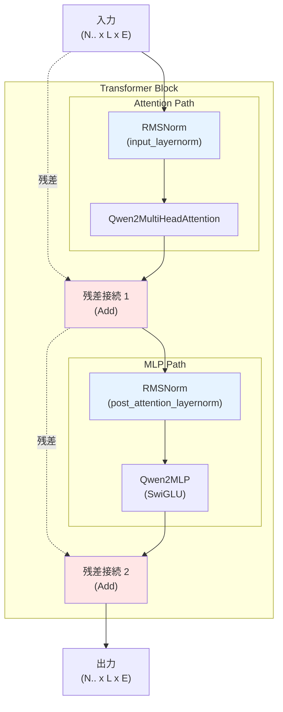

この構造は「Pre-Norm」パターンと呼ばれ、正規化を Sub-Layer（Attention や MLP）の前に配置します。残差接続により、勾配の流れが改善され、深いネットワークの訓練が可能になります。

```
N.. はバッチのための 0 個以上の次元
L はシーケンス長
E は hidden_size（モデルの埋め込み次元）

input: N.. x L x E
output: N.. x L x E
```

::::details 手順補足

手元の MacBook 等に tiny-llm リポジトリをクローンし、以下を実行する。

```bash
URL=https://raw.githubusercontent.com/pdm-project/pdm/main/install-pdm.py
curl -sSL $URL | python3 -
pdm update
```
::::

:::message alert
初期状態では不完全な実装のためテストはエラーします。自分で参考資料を読みながら実装することでエラーを解消しましょう。
:::

実装をテストするには、以下のコマンドを実行できます。

```bash
# モデルをダウンロード（まだの場合）
huggingface-cli download Qwen/Qwen2-0.5B-Instruct-MLX
huggingface-cli download Qwen/Qwen2-1.5B-Instruct-MLX
huggingface-cli download Qwen/Qwen2-7B-Instruct-MLX
# テストを実行
pdm run test --week 1 --day 5 -- -k task_1
```

## Task 2: `Embedding` を実装する

このタスクでは、トークン ID を埋め込みベクトルに変換する Embedding 層を実装します。

```
src/tiny_llm/embedding.py
```

[📚 推奨読み物: LLM Embeddings Explained: A Visual and Intuitive Guide](https://huggingface.co/spaces/hesamation/primer-llm-embedding)

[📚 推奨読み物: Understanding Word Embeddings](https://www.tensorflow.org/text/guide/word_embeddings)

Embedding 層は、1 つ以上のトークン（整数で表現）を `embedding_dim` 次元のベクトルにマッピングします。

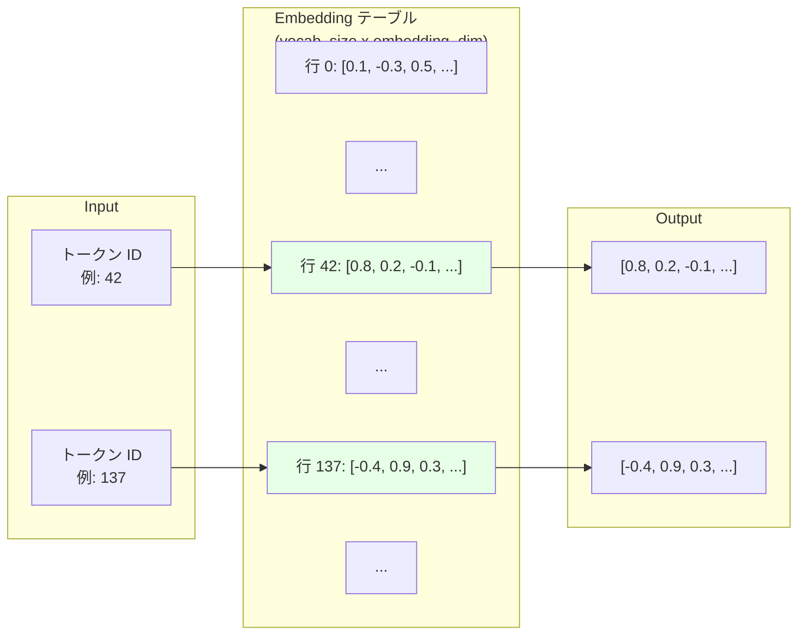

### Embedding::__call__

```
weight: vocab_size x embedding_dim
Input: N.. (tokens)
Output: N.. x embedding_dim (vectors)
```

これは単純な配列インデックスルックアップ操作で実装できます。

```python
# 概念的な実装
output = weight[tokens]
```

### Embedding::as_linear

Qwen2 モデルでは、Embedding 層を線形層としても使用して、埋め込みをトークン空間に戻すことができます。これは「weight tying」と呼ばれる技術で、パラメータ数を削減します。

```
weight: vocab_size x embedding_dim
Input: N.. x embedding_dim
Output: N.. x vocab_size
```

これは、入力ベクトルと各トークンの埋め込みベクトルの内積を計算することで実現されます。

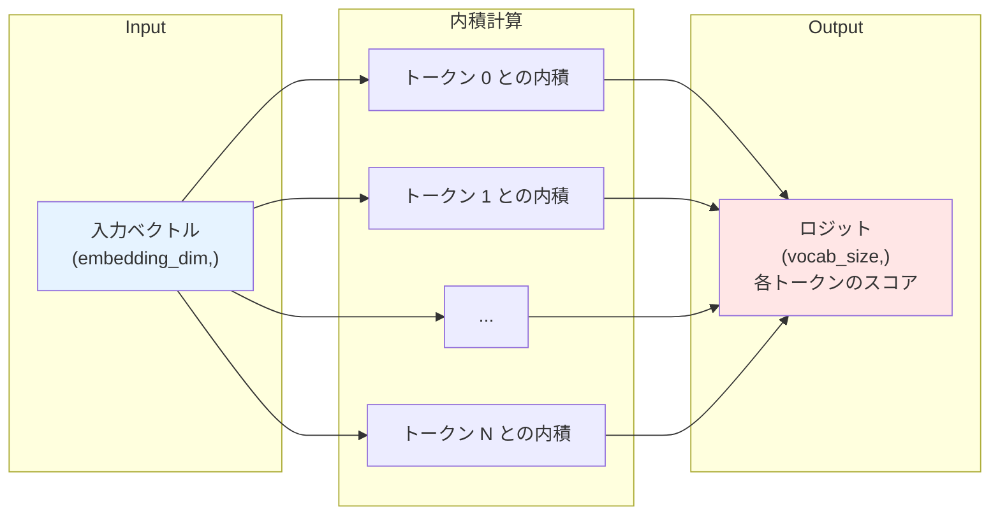

実装をテストするには、以下のコマンドを実行できます。

```bash
# モデルをダウンロード（まだの場合）
huggingface-cli download Qwen/Qwen2-0.5B-Instruct-MLX
huggingface-cli download Qwen/Qwen2-1.5B-Instruct-MLX
huggingface-cli download Qwen/Qwen2-7B-Instruct-MLX
# テストを実行
pdm run test --week 1 --day 5 -- -k task_2
```

## Task 3: `Qwen2ModelWeek1` を実装する

これまで構築してきたすべてのコンポーネントを組み合わせて、完全な Qwen2 モデルを実装します。

```
src/tiny_llm/qwen2_week1.py
```

[📚 推奨読み物: Qwen2Model in mlx-lm](https://github.com/ml-explore/mlx-lm/blob/main/mlx_lm/models/qwen2.py)

[📚 推奨読み物: Qwen2 Model Architecture](https://qwenlm.github.io/blog/qwen2/)

このコースでは、テンソルファイルからモデルパラメータをロードするプロセスは実装しません。代わりに、`mlx-lm` ライブラリを使用してモデルをロードし、ロードされたパラメータを私たちのモデルに配置します。したがって、`Qwen2ModelWeek1` クラスは、コンストラクタ引数として MLX モデルを受け取ります。

Qwen2 モデルは以下の層で構成されます。

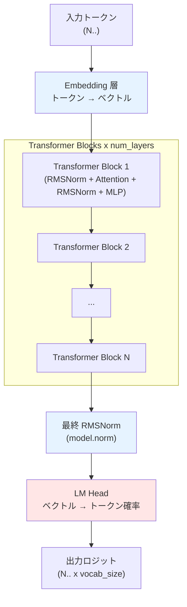

```
input: N.. (tokens)
↓
Embedding
↓ (N.. x hidden_size); hidden_size == embedding_dim
Qwen2TransformerBlock
↓ (N.. x hidden_size)
Qwen2TransformerBlock
↓ (N.. x hidden_size)
...
↓
RMSNorm (model.norm)
↓ (N.. x hidden_size)
Embedding::as_linear OR Linear (lm_head)
↓ (N.. x vocab_size)
output
```

### 実装のポイント

**1. モデル設定へのアクセス**

`mlx_model.args` から層の数、hidden size、その他のモデルパラメータにアクセスできます。これは [ModelArgs](https://github.com/ml-explore/mlx-lm/blob/main/mlx_lm/models/qwen2.py#L14) で定義されています。

**2. 重みへのアクセス**

`mlx_model.model` からロードされた重みにアクセスできます。これは [Qwen2Model](https://github.com/ml-explore/mlx-lm/blob/main/mlx_lm/models/qwen2.py#L125-L133) で定義されています。

層の構造は以下のリンクから確認できます：
- [Qwen2.5-7B-Instruct model structure](https://huggingface.co/Qwen/Qwen2.5-7B-Instruct?show_file_info=model.safetensors.index.json)
- [Qwen2-0.5B-Instruct model structure](https://huggingface.co/Qwen/Qwen2.5-0.5B-Instruct?show_file_info=model.safetensors)

**3. Weight Tying vs LM Head**

異なるサイズの Qwen2 モデルは、埋め込みをトークン空間に戻すために異なる戦略を使用します。

- **0.5B モデル**: `Embedding::as_linear` を直接使用（weight tying）
- **7B モデル**: 別の `lm_head` 線形層を持つ

`mlx_model.args.tie_word_embeddings` 引数に基づいて、どちらの戦略を使用するかを決定できます。

```python
if mlx_model.args.tie_word_embeddings:
    # Embedding::as_linear を使用
    logits = self.embedding.as_linear(hidden_states)
else:
    # lm_head を使用
    logits = linear(hidden_states, self.lm_head)
```

**4. 量子化モデルの処理**

使用している MLX モデル（Qwen2-7B/0.5B-Instruct）は量子化モデルです。したがって、tiny-llm モデルに読み込む前に重みを逆量子化する必要があります。

提供されている `quantize::dequantize_linear` 関数を使用して重みを逆量子化できます。

**5. Causal Mask の設定**

入力シーケンスが 1 より長い場合、`mask=causal` を設定する必要があります。これについては次の日に説明します。

```python
if seq_len > 1:
    mask = "causal"
else:
    mask = None
```

実装をテストするには、以下のコマンドを実行できます。

```bash
# モデルをダウンロード（まだの場合）
huggingface-cli download Qwen/Qwen2-0.5B-Instruct-MLX
huggingface-cli download Qwen/Qwen2-1.5B-Instruct-MLX
huggingface-cli download Qwen/Qwen2-7B-Instruct-MLX
# テストを実行
pdm run test --week 1 --day 5 -- -k task_3
```

1 日分のすべてのテストを実行するには、

```bash
pdm run test --week 1 --day 5
```

::::details 解答
```bash
cd src && cp tiny_llm_ref/qwen2_week1.py tiny_llm/qwen2_week1.py && cp tiny_llm_ref/embedding.py tiny_llm/embedding.py
```
::::

# コラム: Transformer Block の構造 - Pre-Norm vs Post-Norm

このコラムでは、Transformer Block における正規化の配置戦略について詳しく解説します。

::::details Pre-Norm vs Post-Norm

## Transformer Block の基本構造

Transformer Block は、Attention 層と MLP 層を組み合わせたものですが、正規化（LayerNorm や RMSNorm）と残差接続の配置方法にはいくつかのバリエーションがあります。

### Post-Norm (元の Transformer)

元の Transformer 論文（Attention is All You Need）では、「Post-Norm」構造が使用されていました。

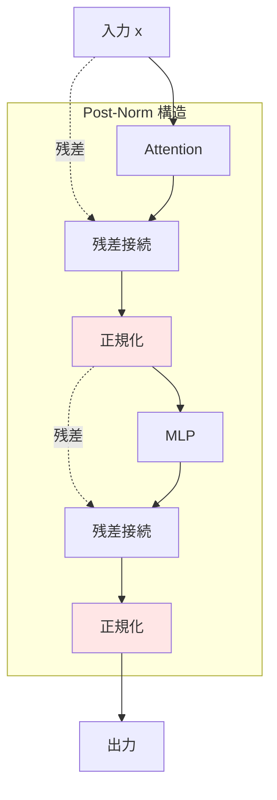

**Post-Norm の数式**:

Attention サブレイヤー:
$$
\text{output}_1 = \text{LayerNorm}(x + \text{Attention}(x))
$$

MLP サブレイヤー:
$$
\text{output}_2 = \text{LayerNorm}(\text{output}_1 + \text{MLP}(\text{output}_1))
$$

### Pre-Norm (現代の Transformer)

現代の大規模言語モデル（GPT-2、GPT-3、LLaMA、Qwen2 など）では、「Pre-Norm」構造が標準となっています。

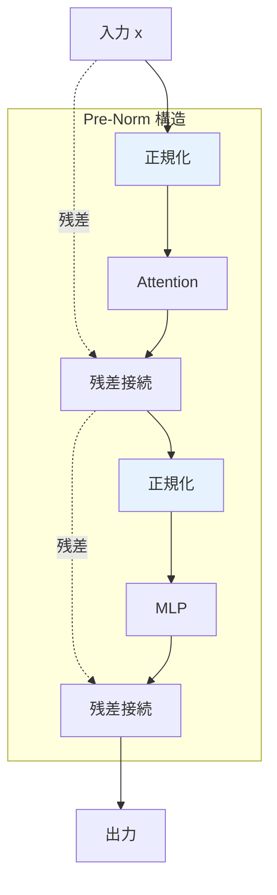

**Pre-Norm の数式**:

Attention サブレイヤー:
$$
\text{output}_1 = x + \text{Attention}(\text{LayerNorm}(x))
$$

MLP サブレイヤー:
$$
\text{output}_2 = \text{output}_1 + \text{MLP}(\text{LayerNorm}(\text{output}_1))
$$

## Post-Norm vs Pre-Norm の比較

### 勾配の流れ

**Post-Norm の問題**:

Post-Norm では、残差接続の後に正規化が適用されるため、逆伝播時に勾配が正規化層を通過する必要があります。深いネットワークでは、これが勾配消失の原因となる可能性があります。

**Pre-Norm の利点**:

Pre-Norm では、残差接続が正規化層をバイパスするため、勾配が直接流れることができます。これにより、深いネットワークでも安定した訓練が可能になります。

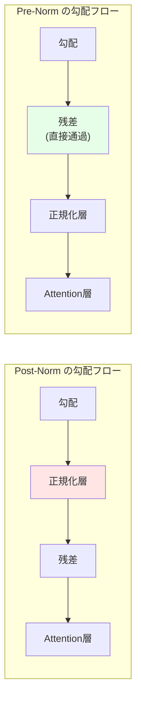

### 訓練の安定性

研究により、Pre-Norm は Post-Norm よりも訓練が安定していることが示されています。

**実験結果** (GPT-2 論文より):

| 構造 | 層数 | 訓練の安定性 | 学習率 |
|------|------|--------------|--------|
| Post-Norm | 12 | 中程度 | 小さめ |
| Post-Norm | 24+ | 不安定 | 非常に小さめ |
| Pre-Norm | 12 | 安定 | 大きめ可能 |
| Pre-Norm | 96+ | 安定 | 大きめ可能 |

Pre-Norm により、より大きな学習率を使用でき、より深いネットワークを訓練できます。

### ウォームアップの必要性

**Post-Norm**:
- 訓練初期の不安定性が高い
- 長いウォームアップ期間が必要
- 学習率を徐々に上げる必要がある

**Pre-Norm**:
- 訓練初期から安定
- ウォームアップ期間が短くて済む
- すぐに高い学習率を使用できる

### 性能の比較

興味深いことに、十分にチューニングされた Post-Norm は、Pre-Norm と同等かわずかに優れた最終性能を達成することがあります。しかし、以下の理由で Pre-Norm が好まれます：

1. **訓練の容易さ**: ハイパーパラメータのチューニングが簡単
2. **スケーラビリティ**: より深いモデルに対応可能
3. **実用性**: 訓練時間が短縮される

## なぜ Pre-Norm が標準となったのか

### 1. 大規模モデルの訓練

GPT-3（175B パラメータ）や LLaMA-2（70B パラメータ）のような大規模モデルでは、訓練の安定性が最も重要です。Pre-Norm により、これらのモデルを効率的に訓練できます。

### 2. 訓練コストの削減

Pre-Norm は、より少ないウォームアップステップと失敗した実験の減少により、訓練コストを大幅に削減します。

### 3. 実装の簡素化

Pre-Norm は、正規化を各サブレイヤーの前に配置するだけなので、実装が直感的です。

## Qwen2 における Pre-Norm

Qwen2 は Pre-Norm 構造を採用し、さらに RMSNorm を使用することで、計算効率を向上させています。

```python
class Qwen2TransformerBlock:
    def __call__(self, x, mask=None):
        # Attention サブレイヤー (Pre-Norm)
        h = x + self.attention(self.input_layernorm(x), mask)

        # MLP サブレイヤー (Pre-Norm)
        out = h + self.mlp(self.post_attention_layernorm(h))

        return out
```

この構造により、Qwen2 は深いネットワーク（例: Qwen2-7B は 28 層）でも安定して訓練できます。

## まとめ

Pre-Norm は、以下の理由で現代の Transformer における標準的な選択肢となっています：

- 訓練の安定性が高い
- 深いネットワークに対応可能
- より大きな学習率を使用できる
- ウォームアップが簡単
- 実装が直感的

Qwen2 が Pre-Norm + RMSNorm を採用しているのは、これらの利点を最大限に活かすための合理的な選択です。

::::

# Task 1 の解説

このセクションでは、Task 1 の Qwen2TransformerBlock 実装について詳細に解説します。

::::details Task 1 の解説

## Task 1 Part 1: Transformer Block の役割

### Transformer における Block の重要性

Transformer Block は、Transformer アーキテクチャの基本単位です。複数の Block を積み重ねることで、モデルは複雑な言語パターンを学習できます。

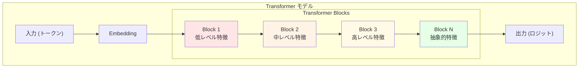

**層による特徴の階層**:

- **下位層** (Block 1-4): 単語の形態、構文パターン
- **中位層** (Block 5-12): 文法構造、意味的関係
- **上位層** (Block 13+): 抽象的概念、推論

### Qwen2TransformerBlock の構成要素

Qwen2TransformerBlock は、4 つの主要コンポーネントで構成されています。

**1. Input LayerNorm (RMSNorm)**

Attention 層の前に入力を正規化します。

**2. Multi-Head Attention**

トークン間の関係を学習します。

**3. Post-Attention LayerNorm (RMSNorm)**

MLP 層の前に Attention の出力を正規化します。

**4. MLP (SwiGLU)**

各トークンの表現を豊かにします。

## Task 1 Part 2: 残差接続の重要性

### 残差接続とは

残差接続（Residual Connection または Skip Connection）は、入力を出力に直接加算する操作です。

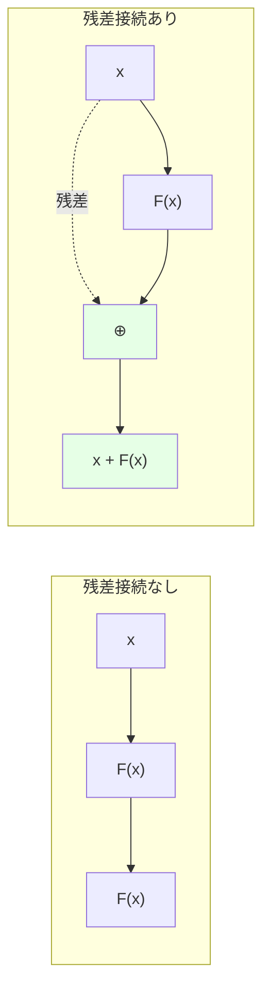

**数式**:
$$
\text{output} = x + F(x)
$$

### なぜ残差接続が必要なのか

**1. 勾配消失問題の解決**

深いネットワークでは、逆伝播時に勾配が小さくなりすぎて、下位層が学習できなくなる問題があります。残差接続により、勾配が直接流れるパスが確保されます。

```python
# 残差接続なし
grad = grad_layer_n * grad_layer_n-1 * ... * grad_layer_1  # 積が0に近づく

# 残差接続あり
grad = grad_layer_n * grad_layer_n-1 * ... * grad_layer_1 + grad_direct  # 直接パスあり
```

**2. 恒等写像の学習**

残差接続により、ネットワークは「何もしない」（恒等写像）を学習することが容易になります。これにより、深いネットワークでも性能が劣化しません。

**3. 訓練の高速化**

残差接続により、初期の段階から勾配が効率的に流れるため、訓練が高速化されます。

### Qwen2 における残差接続

Qwen2TransformerBlock では、2 箇所で残差接続が使用されます。

```python
class Qwen2TransformerBlock:
    def __call__(self, x, mask=None):
        # 残差接続 1: Attention
        h = x + self.attention(self.input_layernorm(x), mask)

        # 残差接続 2: MLP
        out = h + self.mlp(self.post_attention_layernorm(h))

        return out
```

## Task 1 Part 3: 実装のステップ

### ステップバイステップの実装

**Step 1: Input LayerNorm**

```python
# x: (N, L, E)
normalized_input = self.input_layernorm(x)
```

**Step 2: Multi-Head Attention**

```python
# normalized_input: (N, L, E)
attn_output = self.attention(normalized_input, mask)
```

**Step 3: 残差接続 1**

```python
# x: (N, L, E), attn_output: (N, L, E)
h = x + attn_output
```

**Step 4: Post-Attention LayerNorm**

```python
# h: (N, L, E)
normalized_h = self.post_attention_layernorm(h)
```

**Step 5: MLP**

```python
# normalized_h: (N, L, E)
mlp_output = self.mlp(normalized_h)
```

**Step 6: 残差接続 2**

```python
# h: (N, L, E), mlp_output: (N, L, E)
out = h + mlp_output
```

### 完全な実装例（概念的）

```python
class Qwen2TransformerBlock:
    def __init__(self, config):
        self.input_layernorm = RMSNorm(config.hidden_size)
        self.attention = Qwen2MultiHeadAttention(config)
        self.post_attention_layernorm = RMSNorm(config.hidden_size)
        self.mlp = Qwen2MLP(config)

    def __call__(self, x, mask=None):
        # Pre-Norm + Attention + Residual
        h = x + self.attention(
            self.input_layernorm(x),
            mask=mask
        )

        # Pre-Norm + MLP + Residual
        out = h + self.mlp(
            self.post_attention_layernorm(h)
        )

        return out
```

### 形状の確認

各ステップで形状を確認することが重要です。

```python
# 入力
x = mx.random.normal((1, 10, 512))  # (batch=1, seq_len=10, hidden_size=512)

# Step 1: Input LayerNorm
normalized_input = input_layernorm(x)
assert normalized_input.shape == (1, 10, 512)

# Step 2: Attention
attn_output = attention(normalized_input)
assert attn_output.shape == (1, 10, 512)

# Step 3: 残差接続 1
h = x + attn_output
assert h.shape == (1, 10, 512)

# Step 4: Post-Attention LayerNorm
normalized_h = post_attention_layernorm(h)
assert normalized_h.shape == (1, 10, 512)

# Step 5: MLP
mlp_output = mlp(normalized_h)
assert mlp_output.shape == (1, 10, 512)

# Step 6: 残差接続 2
out = h + mlp_output
assert out.shape == (1, 10, 512)
```

入力と出力の形状が一致することを確認してください。

::::

# Task 2 の解説

このセクションでは、Task 2 の Embedding 実装について解説します。

::::details Task 2 の解説

## Task 2 Part 1: Embedding の役割

### なぜ Embedding が必要なのか

機械学習モデルは数値しか理解できません。しかし、言語は離散的なシンボル（単語やトークン）で構成されています。Embedding 層は、これらのシンボルを連続的なベクトル空間にマッピングします。

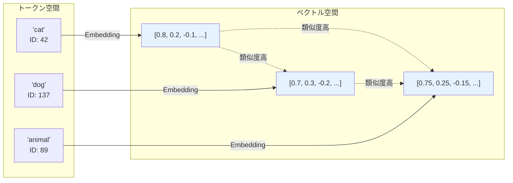

**Embedding の利点**:

1. **意味的類似性**: 類似した意味のトークンは、ベクトル空間で近い位置に配置される
2. **連続性**: 微分可能な操作が可能になる
3. **次元削減**: 大きな語彙（例: 150,000 トークン）を小さな次元（例: 512 次元）に圧縮

### Embedding テーブルの構造

Embedding 層は、本質的には大きなルックアップテーブルです。

```
Embedding テーブル:
  vocab_size x embedding_dim の行列

例:
  vocab_size = 150,000
  embedding_dim = 512

  テーブルサイズ = 150,000 x 512 = 76,800,000 パラメータ
```

各トークン ID に対して、テーブルから対応する行を取り出します。

## Task 2 Part 2: Embedding::__call__ の実装

### 単純な配列インデックス

MLX では、配列インデックスを使用して Embedding を実装できます。

```python
class Embedding:
    def __init__(self, vocab_size, embedding_dim):
        # ランダムに初期化（実際にはロードされた重みを使用）
        self.weight = mx.random.normal((vocab_size, embedding_dim))

    def __call__(self, tokens):
        # tokens: (N, L) - バッチサイズ N、シーケンス長 L
        # self.weight: (vocab_size, embedding_dim)

        # 配列インデックスで取り出す
        embeddings = self.weight[tokens]

        # embeddings: (N, L, embedding_dim)
        return embeddings
```

### 複数のトークンの処理

バッチとシーケンスを同時に処理できます。

```python
# 例
tokens = mx.array([
    [1, 42, 137],   # サンプル 1
    [89, 200, 5]    # サンプル 2
])  # shape: (2, 3)

weight = mx.random.normal((vocab_size, 512))

embeddings = weight[tokens]
# shape: (2, 3, 512)
```

各トークン ID が対応する埋め込みベクトルに置き換えられます。

## Task 2 Part 3: Embedding::as_linear の実装

### Weight Tying とは

Weight Tying は、Embedding 層の重みを出力層（LM Head）と共有する技術です。

**利点**:
1. **パラメータ削減**: 2 つの大きな行列を 1 つに統合
2. **正則化効果**: 同じ重みを入力と出力で使用することで、過学習を防ぐ
3. **訓練の安定性**: 入力と出力の表現が一貫する

### 内積による実装

`as_linear` は、入力ベクトルと各トークンの埋め込みベクトルの内積を計算します。

```python
def as_linear(self, x):
    # x: (N, L, embedding_dim)
    # self.weight: (vocab_size, embedding_dim)

    # 行列積を計算
    # x @ self.weight.T
    logits = x @ self.weight.T

    # logits: (N, L, vocab_size)
    return logits
```

### 直感的な理解

```python
# x: (N, L, embedding_dim) の各ベクトル
# weight[i]: i 番目のトークンの埋め込みベクトル

# 各トークン i について:
score_i = dot(x, weight[i])

# score_i が大きい = x は weight[i] に類似
# → トークン i が次に来る確率が高い
```

### 数式

$$
\text{logits} = x W^T
$$

ここで:
- $x \in \mathbb{R}^{N \times L \times d}$: 入力
- $W \in \mathbb{R}^{V \times d}$: Embedding の重み
- $\text{logits} \in \mathbb{R}^{N \times L \times V}$: 出力

各位置での各トークンのスコアが計算されます。

### Softmax との組み合わせ

実際には、logits に softmax を適用して確率分布を得ます（これは次の日に実装します）。

```python
logits = embedding.as_linear(x)  # (N, L, vocab_size)
probs = softmax(logits, axis=-1)  # (N, L, vocab_size)

# probs[i, j, k] = トークン i、位置 j で、トークン k が次に来る確率
```

## Task 2 Part 4: 0.5B vs 7B モデルの違い

### Weight Tying の有無

**Qwen2-0.5B-Instruct**:
```python
tie_word_embeddings = True
# Embedding::as_linear を使用
```

**Qwen2-7B-Instruct**:
```python
tie_word_embeddings = False
# 別の lm_head 線形層を使用
```

### なぜ大きなモデルは Weight Tying を使わないのか

**1. 表現力の向上**

大きなモデルでは、入力 Embedding と出力 LM Head が異なる役割を持つ可能性があります。

- **入力 Embedding**: トークンを意味空間にマッピング
- **LM Head**: 意味空間からトークン確率にマッピング

これらを分離することで、各層が専門化できます。

**2. パラメータ数の比率**

小さなモデルでは、Embedding のパラメータ数が全体の大きな割合を占めます。

```
Qwen2-0.5B:
  Embedding: vocab_size x 896 ≈ 134M パラメータ
  全体: 500M パラメータ
  比率: 約 27%

Qwen2-7B:
  Embedding: vocab_size x 3584 ≈ 537M パラメータ
  全体: 7B パラメータ
  比率: 約 7.7%
```

大きなモデルでは、Embedding の比率が小さいため、Weight Tying による節約効果が限定的です。

::::

# Task 3 の解説

このセクションでは、Task 3 の Qwen2ModelWeek1 実装について解説します。

::::details Task 3 の解説

## Task 3 Part 1: モデル全体の構造

### Qwen2 のレイヤー構成

Qwen2 モデルは、以下のコンポーネントで構成されています。

**1. Embedding 層**

トークン ID をベクトルに変換します。

**2. Transformer Blocks**

複数の Transformer Block を積み重ねます（例: Qwen2-7B は 28 層）。

**3. 最終 RMSNorm**

すべての Transformer Block の後に正規化を適用します。

**4. LM Head / as_linear**

ベクトルをトークン確率に変換します。

### データフロー

```python
# 入力: トークン ID
tokens = [1, 42, 137, ...]  # shape: (seq_len,)

# ↓ Embedding
embeddings = embed(tokens)  # shape: (seq_len, hidden_size)

# ↓ Transformer Block 1
h1 = block1(embeddings)  # shape: (seq_len, hidden_size)

# ↓ Transformer Block 2
h2 = block2(h1)  # shape: (seq_len, hidden_size)

# ...

# ↓ Transformer Block N
hn = blockN(h_{n-1})  # shape: (seq_len, hidden_size)

# ↓ 最終 RMSNorm
normalized = norm(hn)  # shape: (seq_len, hidden_size)

# ↓ LM Head
logits = lm_head(normalized)  # shape: (seq_len, vocab_size)

# 出力: 各位置での次のトークンの確率分布
```

## Task 3 Part 2: MLX モデルからのロード

### mlx_model の構造

`mlx-lm` でロードされた MLX モデルは、以下の構造を持ちます。

```python
mlx_model
├── args (ModelArgs)
│   ├── hidden_size
│   ├── num_hidden_layers
│   ├── num_attention_heads
│   ├── num_key_value_heads
│   ├── intermediate_size
│   ├── vocab_size
│   ├── tie_word_embeddings
│   └── ...
└── model (Qwen2Model)
    ├── embed_tokens (Embedding)
    ├── layers (List[Qwen2DecoderLayer])
    │   ├── 0: Qwen2DecoderLayer
    │   │   ├── self_attn (Qwen2Attention)
    │   │   ├── mlp (Qwen2MLP)
    │   │   ├── input_layernorm (RMSNorm)
    │   │   └── post_attention_layernorm (RMSNorm)
    │   ├── 1: Qwen2DecoderLayer
    │   └── ...
    ├── norm (RMSNorm)
    └── (lm_head) (Optional[Linear])
```

### パラメータへのアクセス

```python
# 設定へのアクセス
num_layers = mlx_model.args.num_hidden_layers
hidden_size = mlx_model.args.hidden_size

# Embedding の重みへのアクセス
embed_weight = mlx_model.model.embed_tokens.weight

# i 番目の Transformer Block へのアクセス
layer_i = mlx_model.model.layers[i]

# Attention の重みへのアクセス
q_weight = layer_i.self_attn.q_proj.weight
k_weight = layer_i.self_attn.k_proj.weight
v_weight = layer_i.self_attn.v_proj.weight
o_weight = layer_i.self_attn.o_proj.weight

# MLP の重みへのアクセス
gate_weight = layer_i.mlp.gate_proj.weight
up_weight = layer_i.mlp.up_proj.weight
down_weight = layer_i.mlp.down_proj.weight

# RMSNorm の重みへのアクセス
input_ln_weight = layer_i.input_layernorm.weight
post_ln_weight = layer_i.post_attention_layernorm.weight

# 最終 RMSNorm の重みへのアクセス
final_norm_weight = mlx_model.model.norm.weight

# LM Head の重みへのアクセス（tie_word_embeddings が False の場合）
if hasattr(mlx_model, 'lm_head'):
    lm_head_weight = mlx_model.lm_head.weight
```

## Task 3 Part 3: 量子化の処理

### なぜ逆量子化が必要なのか

MLX モデル（Qwen2-*-Instruct-MLX）は、メモリ使用量を削減するために量子化されています。

**量子化**:
- float32 (32 ビット) → int4/int8 (4/8 ビット)
- メモリ使用量が約 1/4 〜 1/8 に削減

**逆量子化**:
- int4/int8 → float32
- 計算前に元の精度に戻す

### dequantize_linear の使用

```python
from tiny_llm.quantize import dequantize_linear

# 量子化された線形層
quantized_layer = mlx_model.model.layers[0].self_attn.q_proj

# 逆量子化
weight, bias = dequantize_linear(quantized_layer)

# weight: (out_features, in_features) の float32 配列
# bias: (out_features,) の float32 配列 or None
```

### すべての線形層で逆量子化

```python
# Attention の重み
q_weight, _ = dequantize_linear(layer.self_attn.q_proj)
k_weight, _ = dequantize_linear(layer.self_attn.k_proj)
v_weight, _ = dequantize_linear(layer.self_attn.v_proj)
o_weight, _ = dequantize_linear(layer.self_attn.o_proj)

# MLP の重み
gate_weight, _ = dequantize_linear(layer.mlp.gate_proj)
up_weight, _ = dequantize_linear(layer.mlp.up_proj)
down_weight, _ = dequantize_linear(layer.mlp.down_proj)

# LM Head の重み（tie_word_embeddings が False の場合）
if hasattr(mlx_model, 'lm_head'):
    lm_head_weight, _ = dequantize_linear(mlx_model.lm_head)
```

## Task 3 Part 4: Causal Mask の設定

### Causal Mask とは

Causal Mask は、Attention 計算で未来のトークンを見ないようにするマスクです。

```
入力: "The cat sat on"

Causal Mask により:
- "The" は "The" のみを見る
- "cat" は "The", "cat" を見る
- "sat" は "The", "cat", "sat" を見る
- "on" は "The", "cat", "sat", "on" を見る
```

### なぜ必要なのか

言語モデルは、左から右にテキストを生成します。訓練時に未来のトークンを見てしまうと、カンニングになってしまいます。

### いつ使うのか

```python
if seq_len > 1:
    # 複数のトークンを処理する場合（Prefill フェーズ）
    mask = "causal"
else:
    # 単一のトークンを処理する場合（Decode フェーズ）
    mask = None
```

**Prefill フェーズ**:
- プロンプト全体を一度に処理
- Causal Mask が必要

**Decode フェーズ**:
- 1 トークンずつ生成
- すでに生成されたトークンのみを見るため、Mask 不要

これについては、Day 6 と Week 2 で詳しく説明します。

## Task 3 Part 5: 実装例

### 全体の実装構造

```python
class Qwen2ModelWeek1:
    def __init__(self, mlx_model):
        # 設定を取得
        self.args = mlx_model.args

        # Embedding 層をロード
        self.embedding = Embedding(
            self.args.vocab_size,
            self.args.hidden_size
        )
        self.embedding.weight = mlx_model.model.embed_tokens.weight

        # Transformer Blocks をロード
        self.blocks = []
        for i in range(self.args.num_hidden_layers):
            block = Qwen2TransformerBlock(self.args)
            # 各 Block に重みをロード（逆量子化を含む）
            self._load_block_weights(block, mlx_model.model.layers[i])
            self.blocks.append(block)

        # 最終 RMSNorm をロード
        self.norm = RMSNorm(self.args.hidden_size)
        self.norm.weight = mlx_model.model.norm.weight

        # LM Head をロード
        if self.args.tie_word_embeddings:
            self.lm_head = None
        else:
            lm_head_weight, _ = dequantize_linear(mlx_model.lm_head)
            self.lm_head = lm_head_weight

    def __call__(self, tokens):
        # tokens: (N, L)
        seq_len = tokens.shape[-1]

        # Embedding
        h = self.embedding(tokens)  # (N, L, E)

        # Causal Mask の設定
        mask = "causal" if seq_len > 1 else None

        # Transformer Blocks
        for block in self.blocks:
            h = block(h, mask=mask)  # (N, L, E)

        # 最終 RMSNorm
        h = self.norm(h)  # (N, L, E)

        # LM Head
        if self.lm_head is None:
            logits = self.embedding.as_linear(h)
        else:
            logits = linear(h, self.lm_head)

        # logits: (N, L, vocab_size)
        return logits
```

### デバッグのヒント

実装が正しいか確認するには、各ステップで形状を出力します。

```python
print(f"Input tokens shape: {tokens.shape}")

h = self.embedding(tokens)
print(f"After embedding: {h.shape}")

for i, block in enumerate(self.blocks):
    h = block(h, mask=mask)
    print(f"After block {i}: {h.shape}")

h = self.norm(h)
print(f"After final norm: {h.shape}")

logits = ...
print(f"Output logits shape: {logits.shape}")
```

期待される出力:
```
Input tokens shape: (1, 10)
After embedding: (1, 10, 3584)
After block 0: (1, 10, 3584)
After block 1: (1, 10, 3584)
...
After block 27: (1, 10, 3584)
After final norm: (1, 10, 3584)
Output logits shape: (1, 10, 151936)
```

::::

# コラム: Weight Tying - パラメータ共有の技術

このコラムでは、Embedding と LM Head の重み共有（Weight Tying）について詳しく解説します。

::::details Weight Tying の詳細

## Weight Tying とは

Weight Tying は、Embedding 層と出力層（LM Head）で同じ重み行列を共有する技術です。

### 通常の構造（Weight Tying なし）

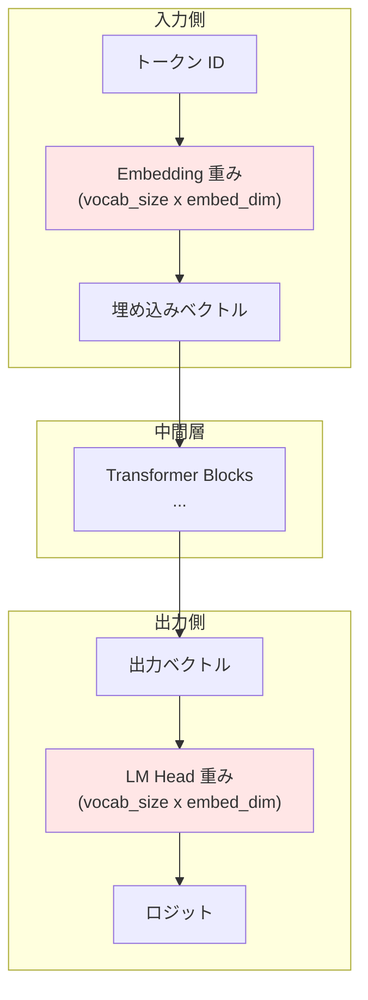

**パラメータ数**:
- Embedding: `vocab_size x embed_dim`
- LM Head: `vocab_size x embed_dim`
- **合計**: `2 x vocab_size x embed_dim`

### Weight Tying 構造

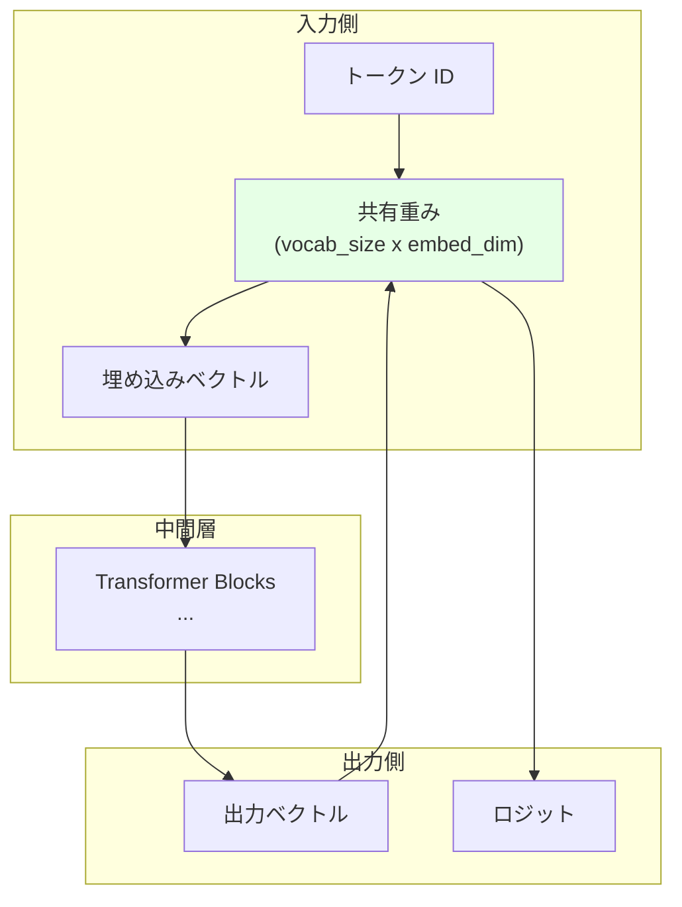

**パラメータ数**:
- 共有重み: `vocab_size x embed_dim`
- **合計**: `vocab_size x embed_dim`

**削減率**: 50%

## Weight Tying の利点

### 1. パラメータ数の削減

**Qwen2-0.5B の例**:

```
vocab_size = 151,936
embed_dim = 896

Weight Tying なし:
  Embedding: 151,936 x 896 = 136,134,656
  LM Head:   151,936 x 896 = 136,134,656
  合計:                      272,269,312 パラメータ

Weight Tying あり:
  共有重み:  151,936 x 896 = 136,134,656 パラメータ

削減:        136,134,656 パラメータ (約 130MB)
```

小さなモデルでは、この削減が全体のパラメータ数に大きく影響します。

### 2. 正則化効果

Weight Tying により、以下の制約が課されます：

$$
\text{embedding}(\text{token}_i) \cdot \text{embedding}(\text{token}_j) = \text{similarity}(i, j)
$$

この制約により、類似したトークンは類似した埋め込みを持つことが強制され、過学習を防ぎます。

### 3. 意味的一貫性

入力 Embedding と出力 LM Head が同じ空間を共有することで、意味的な一貫性が保たれます。

```
トークン "cat" の埋め込み: [0.8, 0.2, -0.1, ...]

モデルが "cat" を予測したい場合:
出力ベクトル · "cat" の埋め込み = 高いスコア

同じ埋め込みを使うことで、
入力と出力の表現が一致します。
```

## Weight Tying の欠点

### 1. 表現力の制限

入力 Embedding と出力 LM Head が異なる役割を持つ場合、同じ重みを使うことが制約となる可能性があります。

**入力 Embedding の役割**:
- トークンを意味的な表現空間にマッピング
- "cat" → [意味ベクトル]

**LM Head の役割**:
- 文脈ベクトルから次のトークンを予測
- [文脈ベクトル] → トークン確率

これらは必ずしも同じ変換ではありません。

### 2. 大規模モデルでの効果の減少

大規模モデルでは、Embedding のパラメータ数が全体に占める割合が小さくなります。

```
Qwen2-7B の例:
  Embedding: 151,936 x 3,584 ≈ 545M パラメータ
  全体: 7,000M パラメータ

  Embedding の割合: 545M / 7,000M ≈ 7.8%

Weight Tying による削減:
  約 545M パラメータ (約 7.8%)

削減効果は限定的
```

## いつ Weight Tying を使うべきか

### 使うべき場合

**1. 小規模モデル（< 1B パラメータ）**

Embedding のパラメータ数が全体の大きな割合を占める場合。

**2. メモリが限られている場合**

デバイスのメモリが限られている場合、パラメータ削減が重要。

**3. シンプルなタスク**

入力と出力の表現が密接に関連している場合。

### 使わない場合

**1. 大規模モデル（> 1B パラメータ）**

Embedding の比率が小さく、削減効果が限定的。

**2. 表現力が重要な場合**

入力と出力で異なる表現を学習させたい場合。

**3. 十分なメモリがある場合**

メモリに余裕があり、パラメータ削減の必要がない場合。

## Qwen2 における選択

**Qwen2-0.5B-Instruct**:
```python
tie_word_embeddings = True
```
- パラメータ削減が重要
- 小規模モデルでは効果が大きい

**Qwen2-1.5B-Instruct**:
```python
tie_word_embeddings = True
```
- まだパラメータ削減の効果がある

**Qwen2-7B-Instruct**:
```python
tie_word_embeddings = False
```
- 表現力の向上を優先
- パラメータ削減の効果が限定的

この選択は、モデルサイズに応じた合理的なトレードオフです。

## まとめ

Weight Tying は、以下のトレードオフを持つ技術です：

**利点**:
- パラメータ数の削減
- 正則化効果
- 意味的一貫性

**欠点**:
- 表現力の制限
- 大規模モデルでの効果の減少

モデルのサイズと用途に応じて、適切に選択することが重要です。

::::
