# Week 1 Day 6: レスポンス生成 - Prefill と Decode

6 日目では、LLM をチャットボットとして使用する際のレスポンス生成プロセスを実装します。実装するコード量は多くありませんが、これまで実装してきたすべてのコンポーネントを統合するため、この日はデバッグと動作確認に時間を割きます。

この日の終わりには、ユーザーのプロンプトに対して実際に応答を生成できる、動作する LLM システムが完成します！

## Task 1: `simple_generate` を実装する

このタスクでは、モデル、トークナイザー、プロンプトを受け取り、レスポンスを生成する関数を実装します。

```
src/tiny_llm/generate.py
```

[📚 推奨読み物: The Log-Sum-Exp Trick](https://gregorygundersen.com/blog/2020/02/09/log-sum-exp/)

[📚 推奨読み物: Decoding Strategies in Large Language Models](https://mlabonne.github.io/blog/posts/2023-06-07-Decoding_strategies.html)

[📚 推奨読み物: LLM Inference - Prefill and Decode](https://huggingface.co/learn/llm-course/chapter1/8)

### 生成プロセスの概要

テキスト生成は、2 つのフェーズで行われます。

```mermaid
flowchart LR
    subgraph Input["入力"]
        Prompt["プロンプト<br/>「天気が良いので」"]
    end

    subgraph Prefill["Prefill フェーズ"]
        TokenizePrompt["トークン化<br/>[1, 42, 137, 89]"]
        ProcessAll["全トークンを一度に処理<br/>並列計算"]
        FirstToken["最初の新しいトークンを生成<br/>例: 200「散歩」"]
    end

    subgraph Decode["Decode フェーズ"]
        AddToken1["トークンを追加<br/>[..., 200]"]
        Generate1["次のトークンを生成<br/>例: 301「に」"]
        AddToken2["トークンを追加<br/>[..., 200, 301]"]
        Generate2["次のトークンを生成<br/>例: 502「行こう」"]
        Continue["..."]
        EOS["EOS トークンまで繰り返す"]
    end

    subgraph Output["出力"]
        Response["生成されたテキスト<br/>「散歩に行こう」"]
    end

    Prompt --> TokenizePrompt
    TokenizePrompt --> ProcessAll
    ProcessAll --> FirstToken
    FirstToken --> AddToken1
    AddToken1 --> Generate1
    Generate1 --> AddToken2
    AddToken2 --> Generate2
    Generate2 --> Continue
    Continue --> EOS
    EOS --> Response

    style Prefill fill:#e6f3ff
    style Decode fill:#ffe6e6
```

**Prefill フェーズ**:
- プロンプト全体を一度に処理
- すべてのトークンを並列に計算
- 効率的（行列演算を活用）

**Decode フェーズ**:
- 1 トークンずつ生成
- 前のトークンを含めて逐次的に処理
- EOS（End of Sequence）トークンが出力されるまで繰り返す

### Step 1: `_step` サブ関数の実装

`_step` 関数は、トークンのリスト `y` を受け取り、次のトークンを返します。

```python
def _step(model, y):
    """
    モデルに y を入力し、次のトークンを返す

    Args:
        model: Qwen2 モデル
        y: トークンのリスト [N.. x S]

    Returns:
        next_token: 次のトークン ID [N..]
    """
    # モデルを実行してロジットを取得
    output_logits = model(y)  # [N.. x S x vocab_size]
```

**ロジットとは**:

ロジット (logits) は、各位置での各トークンの「スコア」です。大きいスコアほど、そのトークンが次に来る確率が高いことを示します。

```
例: 最後の位置のロジット
[
  0.1,    # トークン 0 のスコア
  0.3,    # トークン 1 のスコア
  5.2,    # トークン 2 のスコア ← 最大
  0.8,    # トークン 3 のスコア
  ...
]
→ トークン 2 が選ばれる
```

### Step 2: 最後のトークンのロジットを取得

複数のトークンを処理する場合、各位置でのロジットが返されますが、次のトークンを決定するには最後の位置のロジットのみが必要です。

```python
# 最後のトークンのロジットを取得
logits = output_logits[:, -1, :]  # [N.. x vocab_size]
```

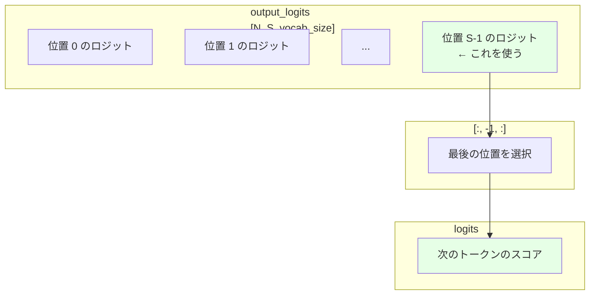

### Step 3: 次のトークンをサンプリング

Week 1 では、最も確率の高いトークンを選択する「Greedy Decoding」を実装します。

```python
# 最も確率の高いトークンを選択
next_token = mx.argmax(logits, axis=-1)  # [N..]
```

**Greedy Decoding**:
- 各ステップで最も確率の高いトークンを選択
- シンプルで高速
- 決定的（同じ入力には常に同じ出力）

他のデコーディング戦略（Temperature Sampling、Top-k、Top-p など）は Day 7 で実装します。

### Step 4: `simple_generate` 関数の実装

完全な生成関数は、以下のステップで構成されます。

**1. プロンプトをトークン化**

```python
# 文字列 → トークン ID のリスト
tokens = tokenizer.encode(prompt)
# 例: "Hello" → [1, 42, 137]
```

**2. Prefill フェーズ**

```python
# プロンプト全体を一度に処理して、最初の新しいトークンを生成
next_token = _step(model, mx.array([tokens]))
tokens.append(next_token)
```

**3. Decode フェーズ（ループ）**

```python
while next_token != tokenizer.eos_token_id:
    # 次のトークンを生成
    next_token = _step(model, mx.array([tokens]))
    tokens.append(next_token)

    # 生成したトークンをデコードして表示
    text = tokenizer.decode([next_token])
    print(text, end="", flush=True)
```

**4. 終了条件**

EOS（End of Sequence）トークンが生成されたらループを終了します。

```python
if next_token == tokenizer.eos_token_id:
    break
```

### 実装例の全体像

```python
def simple_generate(model, tokenizer, prompt, max_tokens=100):
    """
    シンプルなテキスト生成関数

    Args:
        model: Qwen2 モデル
        tokenizer: トークナイザー
        prompt: 入力プロンプト（文字列）
        max_tokens: 生成する最大トークン数
    """
    def _step(y):
        # モデルを実行
        output_logits = model(y)

        # 最後の位置のロジットを取得
        logits = output_logits[:, -1, :]

        # Greedy Decoding: 最も確率の高いトークンを選択
        next_token = mx.argmax(logits, axis=-1)

        return next_token

    # プロンプトをトークン化
    tokens = tokenizer.encode(prompt)

    print(f"Prompt: {prompt}")
    print(f"Response: ", end="", flush=True)

    # 生成ループ
    for i in range(max_tokens):
        # 次のトークンを生成
        next_token = _step(mx.array([tokens]))

        # EOS トークンで終了
        if next_token.item() == tokenizer.eos_token_id:
            break

        # トークンを追加
        tokens.append(next_token.item())

        # デコードして表示
        text = tokenizer.decode([next_token.item()])
        print(text, end="", flush=True)

    print()  # 改行
```

::::details 手順補足

手元の MacBook 等に tiny-llm リポジトリをクローンし、以下を実行する。

```bash
URL=https://raw.githubusercontent.com/pdm-project/pdm/main/install-pdm.py
curl -sSL $URL | python3 -
pdm update
```
::::

:::message alert
初期状態では不完全な実装のためテストはエラーします。自分で参考資料を読みながら実装することでエラーを解消しましょう。
:::

### 実装をテストする

以下のコマンドで実装をテストできます。

```bash
# モデルをダウンロード（まだの場合）
huggingface-cli download Qwen/Qwen2-0.5B-Instruct-MLX
huggingface-cli download Qwen/Qwen2-1.5B-Instruct-MLX
huggingface-cli download Qwen/Qwen2-7B-Instruct-MLX

# 0.5B モデルでテスト
pdm run main --solution tiny_llm --loader week1 --model qwen2-0.5b \
  --prompt "Give me a short introduction to large language model"

# 1.5B モデルでテスト
pdm run main --solution tiny_llm --loader week1 --model qwen2-1.5b \
  --prompt "Give me a short introduction to large language model"

# 7B モデルでテスト
pdm run main --solution tiny_llm --loader week1 --model qwen2-7b \
  --prompt "Give me a short introduction to large language model"
```

「大規模言語モデルとは何か」について合理的な応答が得られるはずです。

参照実装を使用する場合は、`--solution tiny_llm` を `--solution ref` に置き換えてください。

::::details 解答
```bash
cd src && cp tiny_llm_ref/generate.py tiny_llm/generate.py
```
::::

# コラム: Prefill と Decode - 2 つのフェーズの違い

このコラムでは、LLM のテキスト生成における Prefill と Decode の 2 つのフェーズについて詳しく解説します。

::::details Prefill と Decode の詳細

## テキスト生成の 2 つのフェーズ

LLM のテキスト生成は、計算特性の異なる 2 つのフェーズで構成されます。

### Prefill フェーズ

**目的**: プロンプト全体を処理し、最初の新しいトークンを生成する

**入力**:
```
プロンプト: "The quick brown fox"
トークン化: [1, 42, 137, 89, 200]
```

**処理**:
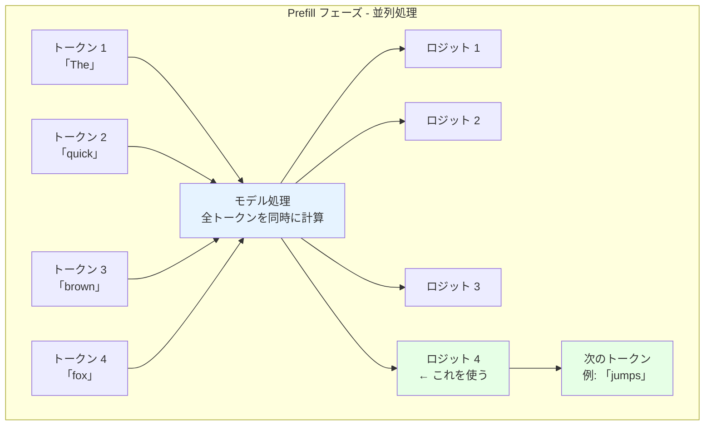

**特徴**:
1. **並列計算**: すべてのトークンを同時に処理
2. **高効率**: GPU/NPU の行列演算を最大限に活用
3. **1 回のみ**: プロンプトごとに 1 回だけ実行
4. **メモリ集約的**: 長いプロンプトほどメモリを使用

### Decode フェーズ

**目的**: 1 トークンずつ生成を繰り返す

**処理**:
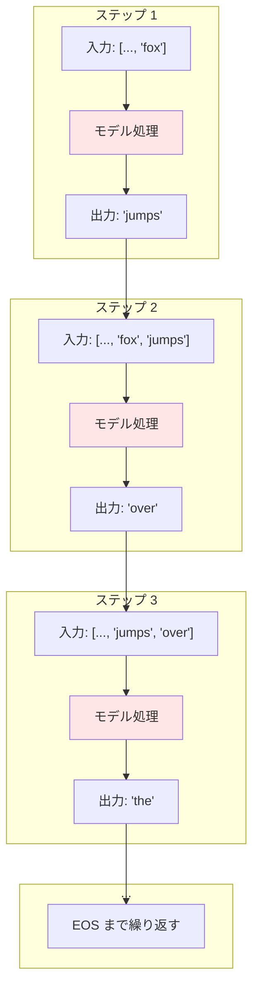

**特徴**:
1. **逐次計算**: 前のトークンがないと次を生成できない
2. **低効率**: 1 トークンずつしか生成できない
3. **繰り返し実行**: 生成する長さに応じて何度も実行
4. **計算集約的**: 毎回すべてのトークンを再処理（Week 1 の実装）

## Week 1 の実装における非効率性

Week 1 の実装では、Decode フェーズで毎回すべてのトークンを処理します。

**例**: 50 トークンのプロンプトから 100 トークンを生成する場合

```
Prefill: [1, 2, ..., 50] → 51
Decode 1: [1, 2, ..., 50, 51] → 52
Decode 2: [1, 2, ..., 50, 51, 52] → 53
Decode 3: [1, 2, ..., 50, 51, 52, 53] → 54
...
Decode 100: [1, 2, ..., 50, ..., 150] → 151
```

**問題点**:

1. **重複計算**: トークン 1-50 は毎回再計算される
2. **計算量の増加**: ステップごとに計算量が増える
3. **速度の低下**: 生成が進むほど遅くなる

**計算量の分析**:

```
Prefill: 1 回 × 50 トークン = 50 計算
Decode: 100 回 × 平均 100 トークン = 10,000 計算
合計: 約 10,050 計算

効率: 50 / 10,050 ≈ 0.5%
→ 計算の 99.5% が重複!
```

## KV キャッシュによる最適化（Week 2 で実装）

Week 2 では、KV（Key-Value）キャッシュを実装して、この重複計算を排除します。

**KV キャッシュの原理**:

Attention 計算で、過去のトークンの Key と Value は変化しません。これをキャッシュすることで、新しいトークンの計算のみで済みます。

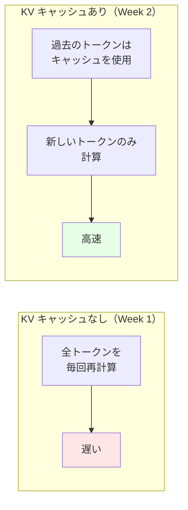

**最適化後の計算量**:

```
Prefill: 1 回 × 50 トークン = 50 計算
Decode: 100 回 × 1 トークン = 100 計算
合計: 150 計算

効率: 50 / 150 ≈ 33%
→ 約 67 倍の高速化!
```

## Prefill と Decode の比較

| 特性 | Prefill | Decode |
|------|---------|--------|
| **入力** | プロンプト全体 | 1 トークン |
| **並列性** | 高い（全トークン同時） | 低い（逐次的） |
| **実行回数** | 1 回 | N 回（生成長） |
| **計算特性** | 行列演算集約 | メモリアクセス集約 |
| **ボトルネック** | メモリ帯域幅 | レイテンシ |
| **最適化の重点** | バッチサイズ | KV キャッシュ |

## 実際のアプリケーションへの影響

### チャットボット

**ユーザー体験**:
- Prefill: ユーザーが送信ボタンを押してから最初の文字が表示されるまでの時間
- Decode: 文字が 1 文字ずつ表示される速度

**最適化の重要性**:
- Prefill が遅い → 応答開始が遅く感じる
- Decode が遅い → タイピングが遅く感じる

### バッチ処理

**Prefill の利点**:
- 複数のプロンプトを同時に処理可能
- GPU の並列性を最大限に活用

**Decode の課題**:
- 各リクエストが異なる長さで完了
- バッチ効率が低下
- Week 2 で「Continuous Batching」を学ぶ

## まとめ

Prefill と Decode は、それぞれ異なる計算特性を持つフェーズです。

**Prefill**:
- 並列性が高く効率的
- プロンプトが長いほど計算量が増える
- 1 回のみ実行

**Decode**:
- 逐次的で非効率（Week 1）
- KV キャッシュで大幅に高速化可能（Week 2）
- 生成長に比例して実行回数が増える

Week 2 では、KV キャッシュと Continuous Batching を実装し、実用的な速度を達成します。

::::

# コラム: Decoding Strategies - テキスト生成の戦略

このコラムでは、LLM のテキスト生成におけるさまざまなデコーディング戦略について解説します。

::::details Decoding Strategies の詳細

## デコーディング戦略とは

デコーディング戦略は、モデルが出力するロジット（各トークンのスコア）から、実際に次のトークンを選択する方法です。

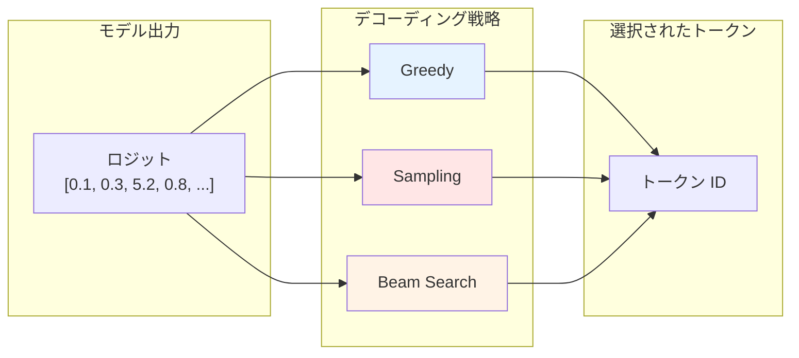

異なる戦略により、生成されるテキストの特性（多様性、品質、一貫性など）が変わります。

## 1. Greedy Decoding（Week 1 で実装）

### 概要

常に最も確率の高いトークンを選択する、最もシンプルな戦略です。

```python
next_token = mx.argmax(logits, axis=-1)
```

### 視覚的な例

```
ロジット:
  "the": 5.2  ← 最大
  "a": 3.1
  "an": 2.8
  "that": 1.5

Greedy → "the" を選択（常に）
```

### 利点

- **シンプル**: 実装が簡単
- **高速**: 計算オーバーヘッドなし
- **決定的**: 同じ入力には常に同じ出力

### 欠点

- **多様性の欠如**: 常に同じ出力
- **局所最適解**: 短期的に最適でも、長期的に最適とは限らない
- **繰り返しの問題**: 同じフレーズを繰り返す傾向

### 適用シーン

- 翻訳（正確性が重要）
- 要約（一貫性が重要）
- コード生成（正確性が重要）

## 2. Sampling（Day 7 で実装）

### 概要

確率分布からランダムにサンプリングします。

```python
# Softmax で確率に変換
probs = mx.softmax(logits / temperature, axis=-1)

# 確率分布からサンプリング
next_token = mx.random.categorical(probs)
```

### Temperature パラメータ

Temperature は、確率分布の「鋭さ」を制御します。

**Temperature = 1.0（デフォルト）**:
```
元のロジット: [1.0, 2.0, 3.0]
確率: [0.09, 0.24, 0.67]
```

**Temperature = 0.5（低温）**:
```
ロジット / 0.5: [2.0, 4.0, 6.0]
確率: [0.02, 0.12, 0.86]  ← より尖った分布
```

**Temperature = 2.0（高温）**:
```
ロジット / 2.0: [0.5, 1.0, 1.5]
確率: [0.19, 0.31, 0.50]  ← より平坦な分布
```

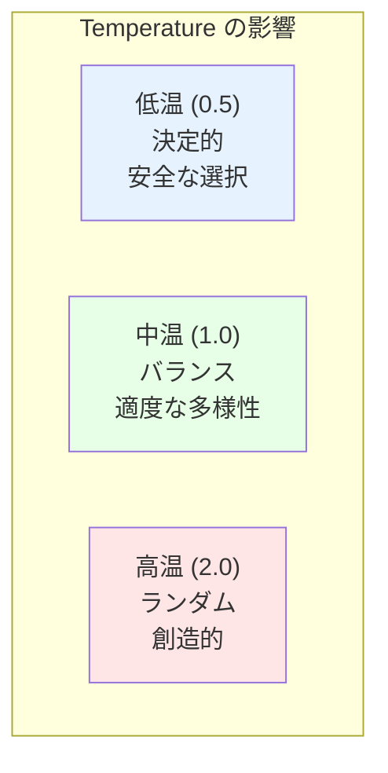

### 利点

- **多様性**: 実行ごとに異なる出力
- **創造性**: より創造的なテキスト
- **自然さ**: 人間らしい多様な表現

### 欠点

- **不安定性**: 低品質な出力の可能性
- **一貫性の欠如**: 話題がずれることがある
- **非決定的**: デバッグが困難

### 適用シーン

- 創作活動（物語、詩）
- チャットボット（自然な会話）
- ブレインストーミング

## 3. Top-k Sampling（Day 7 で実装）

### 概要

確率が高い上位 k 個のトークンのみを考慮し、その中からサンプリングします。

```python
# Top-k トークンを選択
top_k_indices = mx.argpartition(-logits, k, axis=-1)[:k]
top_k_logits = logits[top_k_indices]

# 確率に変換してサンプリング
probs = mx.softmax(top_k_logits / temperature, axis=-1)
next_token = top_k_indices[mx.random.categorical(probs)]
```

### 視覚的な例（k=3）

```
全トークンのロジット:
  "the": 5.2  ← Top-k に含む
  "a": 3.1    ← Top-k に含む
  "an": 2.8   ← Top-k に含む
  "that": 1.5 ← 除外
  "this": 0.9 ← 除外
  ...

Top-k=3 → ["the", "a", "an"] からサンプリング
```

### 利点

- **バランス**: 多様性と品質のバランス
- **低品質トークンの除外**: 明らかに不適切な選択を防ぐ
- **制御可能**: k で多様性を調整

### 欠点

- **固定的**: 文脈によらず常に k 個
- **適切な k の選択**: タスクによって最適な k が異なる

### 適用シーン

- チャットボット（品質と多様性のバランス）
- 創作支援（ある程度の制約が必要）

## 4. Top-p (Nucleus) Sampling（Day 7 で実装）

### 概要

累積確率が p を超えるまでのトークンを考慮します。

```python
# 確率に変換
probs = mx.softmax(logits / temperature, axis=-1)

# 確率順にソート
sorted_indices = mx.argsort(-probs, axis=-1)
sorted_probs = probs[sorted_indices]

# 累積確率を計算
cumsum = mx.cumsum(sorted_probs, axis=-1)

# 累積確率が p を超えるまでのトークンを選択
mask = cumsum <= p
nucleus_probs = sorted_probs * mask

# サンプリング
next_token = sorted_indices[mx.random.categorical(nucleus_probs)]
```

### 視覚的な例（p=0.9）

```
確率分布（降順）:
  "the": 0.67  累積: 0.67 ← Nucleus に含む
  "a": 0.24    累積: 0.91 ← Nucleus に含む (0.91 > 0.9)
  "an": 0.09   累積: 1.00 ← 除外

Top-p=0.9 → ["the", "a"] からサンプリング
```

### Top-k vs Top-p の比較

**高確率な選択肢が多い場合**:
```
Top-k=3: 固定で 3 個
Top-p=0.9: 確率に応じて変動（例: 5 個）
→ Top-p の方が柔軟
```

**高確率な選択肢が少ない場合**:
```
Top-k=3: 固定で 3 個（低品質も含む）
Top-p=0.9: 確率に応じて変動（例: 2 個）
→ Top-p の方が安全
```

### 利点

- **動的**: 文脈に応じてサイズが変わる
- **自然**: より自然な確率分布
- **柔軟**: 確実な場合は絞り、不確実な場合は広げる

### 欠点

- **計算コスト**: ソートが必要
- **p の選択**: 適切な p の設定が必要

### 適用シーン

- 現代的な LLM の標準（ChatGPT など）
- 品質と多様性の両立

## 5. Beam Search

### 概要

複数の候補（ビーム）を並行して探索し、最も確率の高い系列を選択します。

```python
# 各ステップで top-k 個の候補を保持
beams = [([], 1.0)]  # (トークン列, 確率)

for step in range(max_length):
    new_beams = []
    for tokens, prob in beams:
        # 次のトークンの候補を取得
        logits = model(tokens)
        top_k_tokens = get_top_k(logits, k=beam_width)

        for token, token_prob in top_k_tokens:
            new_tokens = tokens + [token]
            new_prob = prob * token_prob
            new_beams.append((new_tokens, new_prob))

    # 確率が高い top-k 個を保持
    beams = sorted(new_beams, key=lambda x: x[1], reverse=True)[:beam_width]

# 最も確率の高い系列を返す
return beams[0][0]
```

### 視覚的な例（beam_width=2）

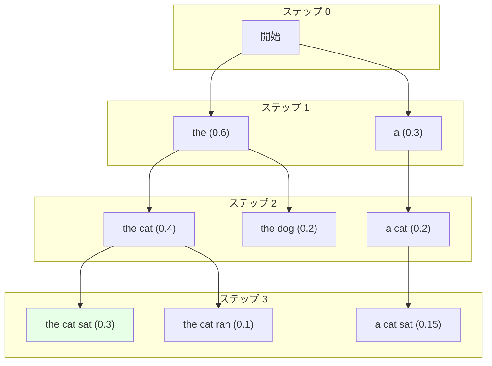

### 利点

- **グローバル最適化**: 局所最適解を避ける
- **高品質**: より一貫性のある出力
- **決定的**: 同じ入力には同じ出力

### 欠点

- **計算コスト**: beam_width 倍の計算
- **メモリ使用量**: 複数のビームを保持
- **多様性の欠如**: 似た系列が選ばれる傾向

### 適用シーン

- 機械翻訳（品質が最優先）
- 要約（一貫性が重要）

## デコーディング戦略の選択ガイド

| タスク | 推奨戦略 | 理由 |
|--------|----------|------|
| 翻訳 | Beam Search | 正確性と一貫性 |
| 要約 | Greedy / Beam Search | 正確性 |
| チャットボット | Top-p + Temperature | 多様性と品質 |
| 創作 | Sampling + Temperature | 創造性 |
| コード生成 | Greedy / Low Temperature | 正確性 |
| 質問応答 | Greedy / Top-p | 正確性 |

## ハイパーパラメータの推奨値

**Temperature**:
- 0.1-0.5: 決定的、保守的
- 0.7-1.0: バランス（推奨）
- 1.5-2.0: 創造的、ランダム

**Top-k**:
- 10-20: 保守的
- 40-50: バランス（推奨）
- 100+: 多様性重視

**Top-p**:
- 0.8-0.9: バランス（推奨）
- 0.95: 多様性重視

**Beam Width**:
- 4-5: 標準（推奨）
- 10+: 高品質（計算コスト大）

## まとめ

デコーディング戦略は、生成されるテキストの品質と多様性を大きく左右します。

**Week 1**: Greedy Decoding（最もシンプル）
**Day 7**: Sampling、Top-k、Top-p（より高度な戦略）

タスクとユーザー体験に応じて、適切な戦略を選択することが重要です。

::::

# Task 1 の解説

このセクションでは、Task 1 の simple_generate 実装について詳細に解説します。

::::details Task 1 の解説

## Task 1 Part 1: テキスト生成の全体像

### LLM によるテキスト生成の仕組み

LLM は、「次のトークンを予測する」ことを繰り返すことでテキストを生成します。

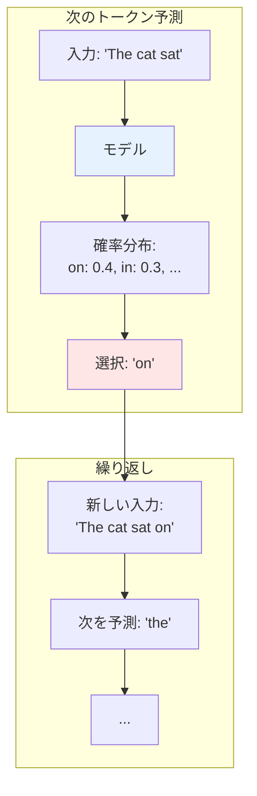

このシンプルな原理により、任意の長さのテキストを生成できます。

### Autoregressive Generation

この生成方法は「Autoregressive（自己回帰的）」と呼ばれます。

**自己回帰的な性質**:
- 前のステップの出力を次のステップの入力として使用
- 過去の生成結果に依存
- エラーが累積する可能性

```python
# 擬似コード
tokens = [start_token]

for i in range(max_length):
    # 前のトークンから次を予測
    next_token = predict(tokens)
    tokens.append(next_token)

    if next_token == eos_token:
        break
```

## Task 1 Part 2: _step 関数の実装

### _step 関数の役割

`_step` 関数は、トークン列から次のトークンを予測する、生成プロセスの中核です。

```python
def _step(model, y):
    """
    Args:
        model: Qwen2ModelWeek1
        y: mx.array, shape [batch_size, seq_len]

    Returns:
        next_token: mx.array, shape [batch_size]
    """
    pass
```

### ステップ 1: モデルの実行

```python
# y: [1, seq_len] - バッチサイズ 1、シーケンス長 seq_len
output_logits = model(y)
# output_logits: [1, seq_len, vocab_size]
```

**output_logits の解釈**:

```
output_logits[0, 0, :]: 位置 0 の次のトークンのロジット
output_logits[0, 1, :]: 位置 1 の次のトークンのロジット
...
output_logits[0, -1, :]: 位置 seq_len-1 の次のトークンのロジット
```

次のトークンを予測するには、最後の位置のロジットのみが必要です。

### ステップ 2: 最後の位置のロジットを抽出

```python
logits = output_logits[:, -1, :]
# logits: [1, vocab_size]
```

**なぜ最後の位置のみ？**

Causal Attention により、各位置は過去のトークンのみを見ることができます。

```
位置 0: トークン 0 のみを見る
位置 1: トークン 0, 1 を見る
位置 2: トークン 0, 1, 2 を見る
...
位置 n: トークン 0, 1, ..., n を見る ← すべての情報を含む
```

したがって、最後の位置のロジットが、すべての文脈を考慮した予測になります。

### ステップ 3: 次のトークンを選択

Week 1 では、Greedy Decoding を使用します。

```python
next_token = mx.argmax(logits, axis=-1)
# next_token: [1]
```

**argmax の動作**:

```python
logits = mx.array([[0.1, 0.3, 5.2, 0.8, ...]])
#                          ^
#                          インデックス 2 が最大

next_token = mx.argmax(logits, axis=-1)
# next_token = [2]
```

### ステップ 4: スカラー値として返す

```python
return next_token.item()
# int: 2
```

`.item()` は、MLX 配列から Python のスカラー値を取り出します。

### 完全な _step 関数

```python
def _step(model, y):
    # モデルを実行
    output_logits = model(y)  # [batch, seq_len, vocab_size]

    # 最後の位置のロジットを取得
    logits = output_logits[:, -1, :]  # [batch, vocab_size]

    # Greedy Decoding
    next_token = mx.argmax(logits, axis=-1)  # [batch]

    # スカラー値として返す
    return next_token.item()
```

## Task 1 Part 3: simple_generate 関数の実装

### 全体の流れ

```python
def simple_generate(model, tokenizer, prompt, max_tokens=100):
    # 1. プロンプトをトークン化
    tokens = tokenizer.encode(prompt)

    # 2. _step 関数を定義（内部関数）
    def _step(y):
        # ... (_step の実装)
        pass

    # 3. Prefill フェーズ
    # (最初の新しいトークンを生成)

    # 4. Decode ループ
    # (EOS まで繰り返す)

    # 5. 結果を返す
    return tokens
```

### ステップ 1: トークン化

```python
tokens = tokenizer.encode(prompt)
```

**例**:
```python
prompt = "Hello, how are you?"
tokens = [1, 9906, 11, 1268, 527, 499, 30]
```

トークナイザーは、テキストをトークン ID のリストに変換します。

### ステップ 2: Prefill フェーズ

```python
# プロンプト全体を処理
next_token = _step(mx.array([tokens]))
tokens.append(next_token)
```

**なぜ `mx.array([tokens])` なのか？**

モデルは `[batch_size, seq_len]` の形状を期待します。

```python
tokens = [1, 2, 3]  # リスト
mx.array([tokens])  # [[1, 2, 3]] - shape [1, 3]
```

### ステップ 3: Decode ループ

```python
for i in range(max_tokens):
    # 次のトークンを生成
    next_token = _step(mx.array([tokens]))

    # EOS で終了
    if next_token == tokenizer.eos_token_id:
        break

    # トークンを追加
    tokens.append(next_token)

    # デコードして表示
    text = tokenizer.decode([next_token])
    print(text, end="", flush=True)
```

**ストリーミング表示**:

`print(text, end="", flush=True)` により、生成されたトークンが即座に表示されます。

```
User: Hello, how are you?
Model: I|'m| fine|,| thank| you|!|

("|" は各トークンの境界を示す)
```

### ステップ 4: 終了条件

**EOS トークン**:

EOS（End of Sequence）トークンは、モデルが「これで終わり」と判断したことを示します。

```python
if next_token == tokenizer.eos_token_id:
    break
```

**max_tokens による制限**:

無限ループを防ぐため、最大トークン数で制限します。

```python
for i in range(max_tokens):
    # ...
```

### デバッグのヒント

実装が正しいか確認するには、各ステップで状態を出力します。

```python
print(f"Prompt: {prompt}")
print(f"Tokenized: {tokens}")
print(f"Prompt length: {len(tokens)} tokens")

for i in range(max_tokens):
    print(f"\nStep {i}:")
    print(f"  Input length: {len(tokens)}")

    next_token = _step(mx.array([tokens]))
    print(f"  Next token: {next_token}")

    if next_token == tokenizer.eos_token_id:
        print("  EOS reached!")
        break

    tokens.append(next_token)
    text = tokenizer.decode([next_token])
    print(f"  Decoded: {repr(text)}")
```

期待される出力:
```
Prompt: Hello
Tokenized: [1, 9906]
Prompt length: 2 tokens

Step 0:
  Input length: 2
  Next token: 11
  Decoded: ','

Step 1:
  Input length: 3
  Next token: 1268
  Decoded: ' how'

...
```

## Task 1 Part 4: Week 1 の制約と Week 2 の改善

### Week 1 の制約

**1. KV キャッシュなし**

毎回すべてのトークンを再計算します。

```python
# Decode ステップ 1
_step([1, 2, 3, 4, 5, 6])  # 6 トークンを処理

# Decode ステップ 2
_step([1, 2, 3, 4, 5, 6, 7])  # 7 トークンを処理（1-6 は重複）

# Decode ステップ 3
_step([1, 2, 3, 4, 5, 6, 7, 8])  # 8 トークンを処理（1-7 は重複）
```

**2. バッチサイズ 1**

一度に 1 つのリクエストのみを処理します。

### Week 2 の改善

**1. KV キャッシュ**

過去のトークンの計算結果をキャッシュします。

```python
# Decode ステップ 1
_step([1, 2, 3, 4, 5, 6])  # 6 トークンを処理、キャッシュに保存

# Decode ステップ 2
_step([7], cache=cache)  # 新しいトークン 7 のみを処理

# Decode ステップ 3
_step([8], cache=cache)  # 新しいトークン 8 のみを処理
```

**高速化**: 約 10-100 倍

**2. Continuous Batching**

複数のリクエストを効率的にバッチ処理します。

```python
# リクエスト A: [1, 2, 3] → 4
# リクエスト B: [5, 6] → 7
# リクエスト C: [8, 9, 10, 11] → 12

# すべてを 1 回のモデル実行で処理
```

**スループット**: 約 5-10 倍

### まとめ

Week 1 の実装は、シンプルですが非効率です。しかし、基本的な仕組みを理解するには最適です。

Week 2 では、実用的な速度を達成するための最適化を学びます。

::::

# コラム: Causal Mask の役割 - 未来を見ない仕組み

このコラムでは、Causal Mask がなぜ必要で、どのように機能するかを詳しく解説します。

::::details Causal Mask の詳細

## Causal Mask とは

Causal Mask は、Attention 計算で各トークンが「未来のトークン」を見ないようにするマスクです。

### マスクなしの問題

マスクがない場合、各トークンはすべてのトークン（過去も未来も）を見ることができます。

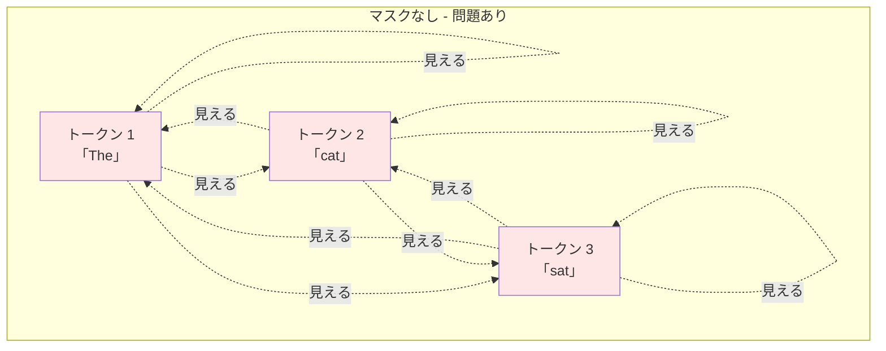

**問題点**:

訓練時、トークン 1 が「cat」と「sat」を見ることができる場合、次のトークンを予測するのが簡単すぎます。これは「カンニング」に相当します。

### Causal Mask による制約

Causal Mask により、各トークンは自分自身と過去のトークンのみを見ることができます。

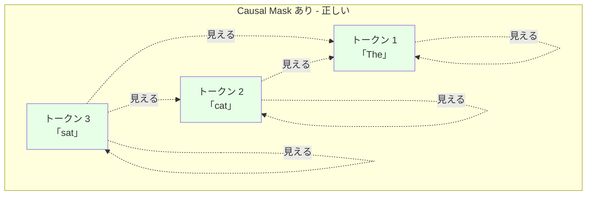

**正しい挙動**:
- トークン 1: 自分のみを見る
- トークン 2: トークン 1, 2 を見る
- トークン 3: トークン 1, 2, 3 を見る

これにより、訓練時とテスト時の条件が一致します。

## Causal Mask の実装

### Attention におけるマスクの適用

Attention 計算では、マスクは Softmax の前に適用されます。

```python
# Attention スコアを計算
scores = (Q @ K.T) / sqrt(d_k)
# scores: [seq_len, seq_len]

# Causal Mask を適用
mask = create_causal_mask(seq_len)
scores = scores + mask

# Softmax
attention_weights = softmax(scores, axis=-1)
```

### Causal Mask の形状

Causal Mask は、上三角行列を `-inf` で埋めたものです。

```python
# seq_len = 4 の例
mask = [
  [  0, -inf, -inf, -inf],
  [  0,    0, -inf, -inf],
  [  0,    0,    0, -inf],
  [  0,    0,    0,    0]
]
```

**解釈**:
- 0: 見ることができる（マスクなし）
- -inf: 見ることができない（マスクあり）

### なぜ -inf なのか

Softmax の性質により、`-inf` は確率 0 になります。

```python
scores = [2.0, 3.0, -inf, -inf]

# exp を計算
exp_scores = [e^2.0, e^3.0, e^(-inf), e^(-inf)]
           = [7.39, 20.09, 0, 0]

# 正規化
probs = exp_scores / sum(exp_scores)
      = [7.39, 20.09, 0, 0] / 27.48
      = [0.27, 0.73, 0, 0]
```

未来のトークンの Attention 重みが 0 になります。

## Prefill と Decode でのマスクの違い

### Prefill フェーズ（複数トークン）

プロンプト全体を処理する際、Causal Mask が必要です。

```python
# 入力: "The cat sat"
tokens = [1, 42, 137]

# Causal Mask を適用
output_logits = model(tokens, mask="causal")
```

**なぜ必要？**

各位置で次のトークンを予測する際、未来のトークンを見てはいけません。

```
位置 0 (The): "cat", "sat" を見てはいけない
位置 1 (cat): "sat" を見てはいけない
位置 2 (sat): すべて見える
```

### Decode フェーズ（単一トークン）

1 トークンずつ生成する際、マスクは不要です。

```python
# 入力: 前のすべてのトークン + 新しいトークン 1 個
tokens = [1, 42, 137, 89]

# マスク不要
output_logits = model(tokens, mask=None)
```

**なぜ不要？**

新しいトークンは最後の位置にあり、未来のトークンが存在しません。

```
新しいトークン (位置 3): トークン 0, 1, 2, 3 を見る
→ すべて過去のトークン
```

## Week 1 の実装における Causal Mask

### コードでの指定

```python
if seq_len > 1:
    # Prefill フェーズ
    mask = "causal"
else:
    # Decode フェーズ
    mask = None
```

### MLX での Causal Mask

MLX では、`mask="causal"` を指定するだけで自動的に Causal Mask が適用されます。

```python
# MLX の scaled_dot_product_attention
output = mx.fast.scaled_dot_product_attention(
    Q, K, V,
    scale=1.0 / sqrt(head_dim),
    mask="causal"  # 自動的に Causal Mask を適用
)
```

内部では、以下のような処理が行われます：

```python
# 疑似コード
def apply_causal_mask(scores):
    seq_len = scores.shape[-1]
    mask = mx.triu(mx.full((seq_len, seq_len), -mx.inf), k=1)
    return scores + mask
```

## Causal Mask の視覚化

### Attention 重みの比較

**マスクなし**:
```
      The  cat  sat
The  [0.3, 0.4, 0.3]  ← すべてのトークンに Attention
cat  [0.2, 0.5, 0.3]  ← すべてのトークンに Attention
sat  [0.1, 0.4, 0.5]  ← すべてのトークンに Attention
```

**Causal Mask あり**:
```
      The  cat  sat
The  [1.0, 0.0, 0.0]  ← 自分のみ
cat  [0.4, 0.6, 0.0]  ← 過去と自分のみ
sat  [0.2, 0.3, 0.5]  ← すべて（すべて過去）
```

### ヒートマップ表現

```
Causal Mask:
  ■ □ □ □
  ■ ■ □ □
  ■ ■ ■ □
  ■ ■ ■ ■

■ = Attention あり (0)
□ = Attention なし (-inf)
```

## まとめ

Causal Mask は、言語モデルの重要な要素です。

**役割**:
- 訓練時に未来のトークンを見ないようにする
- 訓練とテストの条件を一致させる
- 自己回帰的な生成を可能にする

**実装**:
- Prefill フェーズで必要（複数トークン）
- Decode フェーズで不要（単一トークン）
- MLX では `mask="causal"` で自動的に適用

Week 1 では、この基本的な仕組みを理解し、Week 2 では KV キャッシュと組み合わせてより効率的な実装を学びます。

::::
