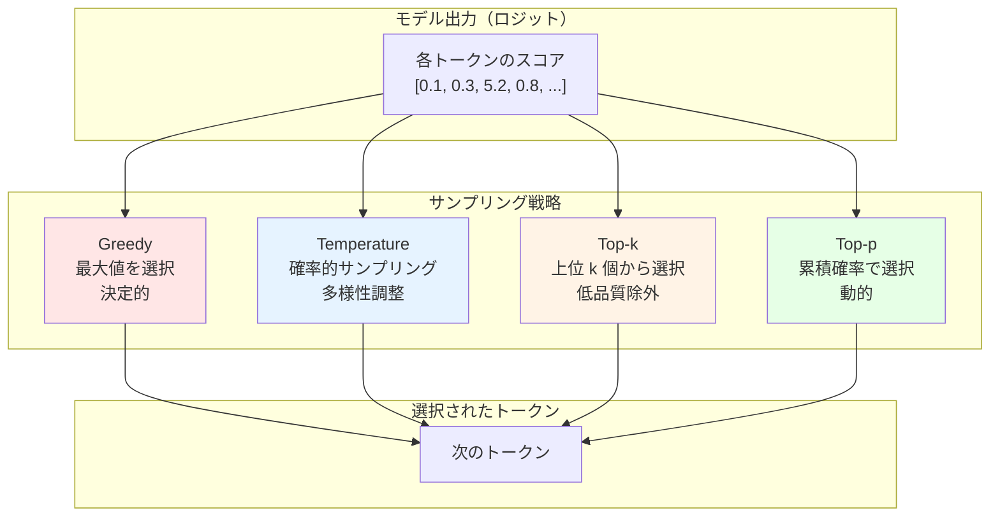
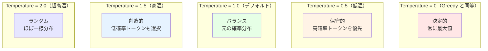
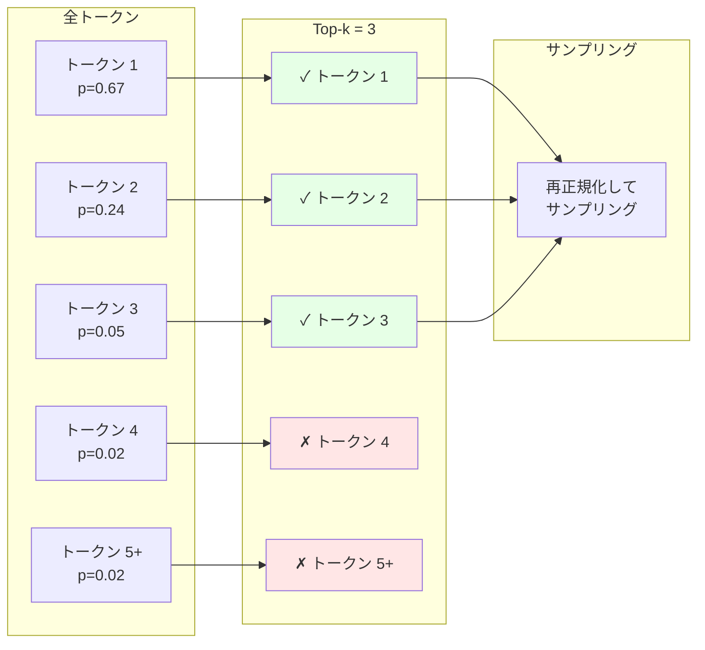
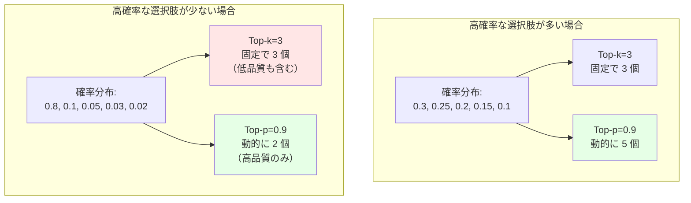
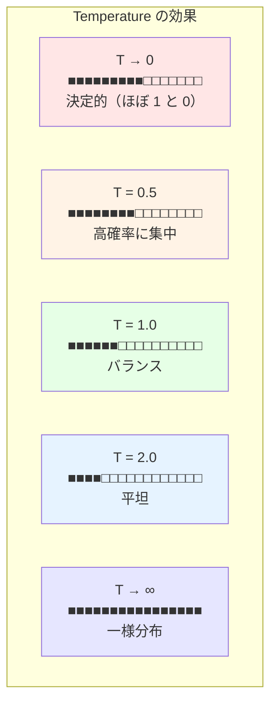
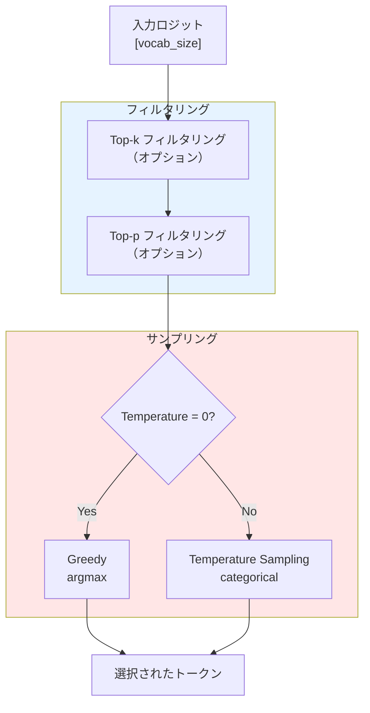

# Week 1 Day 7: サンプリング戦略と Week 2 の準備

7 日目では、さまざまなサンプリング戦略を実装します。また、Week 2 に向けた準備を行います。

Day 6 では Greedy Decoding を実装しましたが、これは常に最も確率の高いトークンを選択するため、生成されるテキストが決定的で多様性に欠けます。この日では、Temperature、Top-k、Top-p といった、より高度なサンプリング戦略を実装し、生成されるテキストの創造性と多様性を制御できるようにします。

## Task 1: サンプリング戦略を実装する

```
src/tiny_llm/sampler.py
```

[📚 推奨読み物: mlx-lm sampler implementation](https://github.com/ml-explore/mlx-lm/blob/main/mlx_lm/sample_utils.py)

[📚 推奨読み物: How to Sample from Language Models](https://huyenchip.com/2024/01/16/sampling.html)

[📚 推奨読み物: Decoding Strategies in Large Language Models](https://mlabonne.github.io/blog/posts/2023-06-07-Decoding_strategies.html)

### サンプリング戦略の概要

Day 6 で実装した Greedy Decoding は、最もシンプルですが制約があります。



これらの戦略を組み合わせることで、生成されるテキストの品質と多様性を細かく制御できます。

### Temperature Sampling

Temperature Sampling は、確率分布の「鋭さ」を制御するサンプリング戦略です。

**実装方法**:

1. ロジットを Temperature で割る
2. Softmax で確率に変換
3. 確率分布からランダムにサンプリング

```python
# logits: [vocab_size] の配列
# temp: Temperature パラメータ

# Temperature スケーリング
scaled_logits = logits / temp

# Softmax で確率に変換
probs = mx.softmax(scaled_logits, axis=-1)

# 確率分布からサンプリング
next_token = mx.random.categorical(probs)
```

**Temperature の効果**:



**数値例**:

```
元のロジット: [1.0, 2.0, 3.0]

Temperature = 0.5:
  scaled: [2.0, 4.0, 6.0]
  probs: [0.02, 0.12, 0.86] ← より尖った

Temperature = 1.0:
  scaled: [1.0, 2.0, 3.0]
  probs: [0.09, 0.24, 0.67] ← 元の分布

Temperature = 2.0:
  scaled: [0.5, 1.0, 1.5]
  probs: [0.19, 0.31, 0.50] ← より平坦
```

**特殊ケース: Temperature = 0**:

`temp=0` の場合、Greedy Decoding と同等になります。

```python
if temp == 0:
    next_token = mx.argmax(logits, axis=-1)
else:
    scaled_logits = logits / temp
    probs = mx.softmax(scaled_logits, axis=-1)
    next_token = mx.random.categorical(probs)
```

**テスト方法**:

```bash
# Temperature 0.5（保守的）
pdm run main --solution tiny_llm --loader week1 --model qwen2-0.5b \
  --sampler-temp 0.5 \
  --prompt "天気が良いので"

# Temperature 1.5（創造的）
pdm run main --solution tiny_llm --loader week1 --model qwen2-0.5b \
  --sampler-temp 1.5 \
  --prompt "天気が良いので"
```

### Top-k Sampling

Top-k Sampling は、確率が高い上位 k 個のトークンのみを考慮するサンプリング戦略です。

**実装方法**:

1. 上位 k 個のトークンのインデックスを取得
2. 上位 k 個以外のロジットを `-inf` でマスク
3. Temperature Sampling を適用

```python
# logits: [vocab_size] の配列
# top_k: 上位 k 個

# 上位 k 個のインデックスを取得
# argpartition は部分ソートで高速
top_k_indices = mx.argpartition(-logits, kth=top_k, axis=-1)[:top_k]

# マスクを作成（上位 k 個以外は -inf）
mask = mx.full_like(logits, -mx.inf)
mask[top_k_indices] = 0.0

# マスクを適用
masked_logits = logits + mask

# Temperature Sampling
scaled_logits = masked_logits / temp
probs = mx.softmax(scaled_logits, axis=-1)
next_token = mx.random.categorical(probs)
```

**Top-k の効果**:

```
元の確率分布（降順）:
  "the": 0.67
  "a": 0.24
  "an": 0.05
  "that": 0.02
  "this": 0.01
  "some": 0.01
  ...

Top-k = 3:
  候補: ["the", "a", "an"]
  除外: ["that", "this", "some", ...]

  再正規化後:
  "the": 0.70
  "a": 0.25
  "an": 0.05
```

**視覚的な理解**:



**テスト方法**:

```bash
# Top-k = 10（保守的）
pdm run main --solution tiny_llm --loader week1 --model qwen2-0.5b \
  --sampler-temp 0.7 --sampler-top-k 10 \
  --prompt "昔々あるところに"

# Top-k = 50（バランス）
pdm run main --solution tiny_llm --loader week1 --model qwen2-0.5b \
  --sampler-temp 0.7 --sampler-top-k 50 \
  --prompt "昔々あるところに"
```

### Top-p (Nucleus) Sampling

Top-p Sampling は、累積確率が p を超えるまでのトークンを考慮するサンプリング戦略です。

**実装方法**:

1. ロジットを確率に変換
2. 確率の降順でソート
3. 累積確率を計算
4. 累積確率が p を超える位置を見つける
5. それ以降のトークンを `-inf` でマスク
6. Temperature Sampling を適用

```python
# logits: [vocab_size] の配列
# top_p: 累積確率の閾値（例: 0.9）

# Softmax で確率に変換（Temperature スケーリング前）
probs = mx.softmax(logits / temp, axis=-1)

# 確率の降順でソート
sorted_indices = mx.argsort(-probs, axis=-1)
sorted_probs = probs[sorted_indices]

# 累積確率を計算
cumsum_probs = mx.cumsum(sorted_probs, axis=-1)

# 累積確率が p を超える位置を見つける
# p を超えた最初の位置以降をマスク
mask = cumsum_probs > top_p

# 最初のトークンは常に含める
mask[0] = False

# マスクを適用
sorted_probs[mask] = 0.0

# 元のインデックスに戻す
final_probs = mx.zeros_like(probs)
final_probs[sorted_indices] = sorted_probs

# サンプリング
next_token = mx.random.categorical(final_probs)
```

**Top-p の効果**:

```
確率分布（降順）:
  "the": 0.67  累積: 0.67
  "a": 0.24    累積: 0.91 ← p=0.9 を超える
  "an": 0.05   累積: 0.96
  "that": 0.02 累積: 0.98
  ...

Top-p = 0.9:
  候補: ["the", "a"]
  除外: ["an", "that", ...]

  再正規化後:
  "the": 0.74
  "a": 0.26
```

**Top-k vs Top-p の比較**:



Top-p は文脈に応じて候補数が動的に変わるため、より柔軟です。

**テスト方法**:

```bash
# Top-p = 0.9（推奨）
pdm run main --solution tiny_llm --loader week1 --model qwen2-0.5b \
  --sampler-temp 0.7 --sampler-top-p 0.9 \
  --prompt "AIの未来について"

# Top-p = 0.95（より多様）
pdm run main --solution tiny_llm --loader week1 --model qwen2-0.5b \
  --sampler-temp 0.7 --sampler-top-p 0.95 \
  --prompt "AIの未来について"
```

### サンプリング戦略の組み合わせ

実際には、これらの戦略を組み合わせて使用します。

```python
def sample(logits, temp=1.0, top_k=0, top_p=1.0):
    # 1. Top-k フィルタリング
    if top_k > 0:
        logits = apply_top_k(logits, top_k)

    # 2. Top-p フィルタリング
    if top_p < 1.0:
        logits = apply_top_p(logits, top_p)

    # 3. Temperature Sampling
    if temp == 0:
        return mx.argmax(logits, axis=-1)
    else:
        probs = mx.softmax(logits / temp, axis=-1)
        return mx.random.categorical(probs)
```

**推奨設定**:

```bash
# バランスの取れた設定（推奨）
--sampler-temp 0.7 --sampler-top-p 0.9

# 創造的な設定
--sampler-temp 1.2 --sampler-top-k 50

# 保守的な設定
--sampler-temp 0.3 --sampler-top-p 0.8
```

::::details 手順補足

手元の MacBook 等に tiny-llm リポジトリをクローンし、以下を実行する。

```bash
URL=https://raw.githubusercontent.com/pdm-project/pdm/main/install-pdm.py
curl -sSL $URL | python3 -
pdm update
```
::::

:::message alert
初期状態では不完全な実装のためテストはエラーします。自分で参考資料を読みながら実装することでエラーを解消しましょう。
:::

::::details 解答
```bash
cd src && cp tiny_llm_ref/sampler.py tiny_llm/sampler.py
```
::::

## Task 2: Week 2 の準備

Week 2 では、Qwen2 モデルのサービングインフラストラクチャを最適化します。C++ コードと Metal カーネルを記述して、一部の操作を高速化します。そのため、Metal コンパイラを含む Xcode とそのコマンドラインツールが必要です。

### 必要な環境

- macOS（Apple Silicon 推奨）
- Xcode
- Xcode Command Line Tools
- CMake

### インストール手順

**1. Xcode のインストール**

Mac App Store または [Apple Developer website](https://developer.apple.com/xcode/) から Xcode をインストールします（Apple Developer アカウントが必要な場合があります）。

**2. Xcode の起動とコンポーネントのインストール**

インストール後、少なくとも一度 Xcode を起動してください。追加の macOS コンポーネントのインストールを求められる場合がありますので、インストールしてください（通常はデフォルトオプションです）。

**3. Xcode Command Line Tools のインストール**

ターミナルを開いて以下を実行します：

```bash
xcode-select --install
```

**4. デフォルト Xcode パスの設定（必要な場合）**

コマンドラインツールが新しくインストールした Xcode を参照していることを確認します：

```bash
sudo xcode-select --switch /Applications/Xcode.app/Contents/Developer
```

※Xcode が別の場所にインストールされている場合は、パスを調整してください。

**5. Xcode ライセンスの承認**

Xcode ライセンスを承認する必要がある場合があります：

```bash
sudo xcodebuild -license accept
```

**6. CMake のインストール**

```bash
brew install cmake
```

### インストールのテスト

MLX 公式拡張チュートリアルの一部である `axpby` 関数を使用して、`src/extensions` のコードをコンパイルしてインストールをテストできます：

```bash
# 拡張機能をビルド
pdm run build-ext

# テストを実行
pdm run build-ext-test
```

`correct: True` と表示されればインストール成功です。

### オプション: C++ と Metal の学習

C++ や Metal プログラミングに慣れていない場合は、小さな演習を行うことをお勧めします。例えば、`exp`、`sin`、`cos` などの要素ごとの操作を実装し、モデル実装の MLX 関数と置き換えてみてください。

**参考資料**:

- [MLX C++ Extensions](https://ml-explore.github.io/mlx/build/html/usage/extensions.html)
- [Metal Shading Language Specification](https://developer.apple.com/metal/Metal-Shading-Language-Specification.pdf)
- [Metal Programming Guide](https://developer.apple.com/library/archive/documentation/Miscellaneous/Conceptual/MetalProgrammingGuide/Introduction/Introduction.html)

## Week 1 の完成！

おめでとうございます！ Week 1 のすべてのコンポーネントを実装し、Qwen2 モデルをサービングできるようになりました。

**Week 1 で実装したもの**:
- ✅ Attention メカニズム
- ✅ RMSNorm と MLP
- ✅ Transformer Block
- ✅ Embedding 層
- ✅ 完全な Qwen2 モデル
- ✅ テキスト生成（Prefill と Decode）
- ✅ サンプリング戦略（Greedy、Temperature、Top-k、Top-p）

これで Week 2 の準備が整いました。Week 2 では、サービングインフラストラクチャを最適化し、Apple Silicon デバイスで驚異的な速度で動作させます！ 🚀

# コラム: Temperature の数学的理解

このコラムでは、Temperature パラメータが確率分布に与える影響を数学的に理解します。

::::details Temperature の数学的理解

## Softmax と Temperature

### 標準的な Softmax

Softmax 関数は、ロジット（スコア）を確率分布に変換します。

$$
p_i = \frac{e^{z_i}}{\sum_{j=1}^{V} e^{z_j}}
$$

ここで:
- $z_i$: トークン $i$ のロジット
- $V$: 語彙サイズ
- $p_i$: トークン $i$ の確率

### Temperature を導入した Softmax

Temperature パラメータ $T$ を導入すると：

$$
p_i(T) = \frac{e^{z_i / T}}{\sum_{j=1}^{V} e^{z_j / T}}
$$

**Temperature の効果**:

- $T \to 0$: 最大のロジットに確率が集中（決定的）
- $T = 1$: 標準的な Softmax
- $T > 1$: 確率分布が平坦化（多様性増加）
- $T \to \infty$: 一様分布に近づく

## Temperature の視覚化

### 数値例

ロジット: $z = [1.0, 2.0, 3.0]$

**Temperature = 0.5（低温）**:

$$
\begin{align}
z / T &= [2.0, 4.0, 6.0] \\
e^{z/T} &= [7.39, 54.60, 403.43] \\
p &= [0.016, 0.117, 0.867]
\end{align}
$$

最大値に確率が集中します。

**Temperature = 1.0（標準）**:

$$
\begin{align}
z / T &= [1.0, 2.0, 3.0] \\
e^{z/T} &= [2.72, 7.39, 20.09] \\
p &= [0.090, 0.244, 0.666]
\end{align}
$$

元の分布を保ちます。

**Temperature = 2.0（高温）**:

$$
\begin{align}
z / T &= [0.5, 1.0, 1.5] \\
e^{z/T} &= [1.65, 2.72, 4.48] \\
p &= [0.186, 0.307, 0.507]
\end{align}
$$

確率分布が平坦化されます。

### グラフ表現



## エントロピーの観点

### エントロピーとは

エントロピーは、確率分布の「不確実性」や「多様性」を測る指標です。

$$
H(p) = -\sum_{i=1}^{V} p_i \log p_i
$$

**エントロピーの性質**:
- エントロピーが高い → 多様（不確実）
- エントロピーが低い → 集中（確実）
- 最大エントロピー: 一様分布
- 最小エントロピー: デルタ分布（1 点に集中）

### Temperature とエントロピー

Temperature を変化させると、エントロピーも変化します。

```
ロジット: [1.0, 2.0, 3.0]

T = 0.1:
  p = [0.000, 0.007, 0.993]
  H = 0.06 ビット ← 低エントロピー（確実）

T = 1.0:
  p = [0.090, 0.244, 0.666]
  H = 0.99 ビット ← 中エントロピー

T = 10.0:
  p = [0.307, 0.329, 0.364]
  H = 1.58 ビット ← 高エントロピー（不確実）
```

**最大エントロピー**（一様分布、$T \to \infty$）:

$$
H_{\max} = \log V
$$

3 トークンの場合: $H_{\max} = \log 3 \approx 1.58$ ビット

## Temperature と Softmax の関係

### Softmax のスケール不変性

通常の Softmax は、ロジットに定数を加えても結果が変わりません：

$$
\text{softmax}(z + c) = \text{softmax}(z)
$$

しかし、Temperature を導入すると、この性質は成り立ちません：

$$
\text{softmax}((z + c) / T) \neq \text{softmax}(z / T)
$$

### Temperature による正規化

Temperature は、ロジットの「スケール」を調整する役割を果たします。

```python
# モデルの出力ロジットのスケールが異なる場合

# モデル A のロジット: [10, 20, 30]
# モデル B のロジット: [0.1, 0.2, 0.3]

# Temperature = 1.0 で正規化
probs_A = softmax([10, 20, 30] / 1.0)
# → [0.000, 0.000, 1.000] （極端に集中）

probs_B = softmax([0.1, 0.2, 0.3] / 1.0)
# → [0.307, 0.332, 0.361] （バランス）

# Temperature で調整
probs_A_adjusted = softmax([10, 20, 30] / 10.0)
# → [0.307, 0.332, 0.361] （モデル B と同じ分布）
```

## 実際の応用

### タスクごとの推奨 Temperature

| タスク | Temperature | 理由 |
|--------|-------------|------|
| 翻訳 | 0.0 - 0.3 | 正確性が重要 |
| 要約 | 0.3 - 0.7 | ある程度の多様性 |
| チャット | 0.7 - 1.0 | 自然な会話 |
| 創作 | 1.0 - 1.5 | 創造性が重要 |
| コード生成 | 0.0 - 0.5 | 正確性が重要 |

### Temperature の動的調整

一部のシステムでは、生成プロセス中に Temperature を動的に調整します。

```python
# 文の始め: 高い Temperature（創造的）
# 文の終わり: 低い Temperature（一貫性）

def dynamic_temperature(position, length):
    # 文の前半は高温、後半は低温
    return 1.5 - (position / length) * 1.0

# 位置 0 (始め): T = 1.5
# 位置 50 (中間): T = 1.0
# 位置 100 (終わり): T = 0.5
```

## まとめ

Temperature は、確率分布の形状を制御する強力なパラメータです。

**数学的な効果**:
- Softmax の分母・分子を同時にスケーリング
- エントロピーを制御
- 確率の集中度を調整

**実用的な効果**:
- 低温（< 1.0）: 決定的、保守的
- 中温（= 1.0）: バランス
- 高温（> 1.0）: 創造的、多様

タスクの性質に応じて、適切な Temperature を選択することが重要です。

::::

# コラム: Top-k vs Top-p - どちらを選ぶべきか

このコラムでは、Top-k と Top-p の違いを詳しく比較し、どちらを選ぶべきかを解説します。

::::details Top-k vs Top-p の詳細比較

## 基本的な違い

### Top-k Sampling

**定義**: 確率が高い上位 k 個のトークンのみを考慮

**特徴**:
- 固定サイズ（常に k 個）
- 実装がシンプル
- 計算が高速（部分ソート）

### Top-p Sampling

**定義**: 累積確率が p を超えるまでのトークンを考慮

**特徴**:
- 動的サイズ（文脈に応じて変化）
- 柔軟性が高い
- 計算がやや複雑（完全ソート）

## 具体例による比較

### シナリオ 1: 確実な選択

モデルが非常に確信している場合：

```
確率分布:
  "the": 0.85
  "a": 0.10
  "an": 0.03
  "that": 0.01
  "this": 0.01
```

**Top-k = 5**:
```
候補: すべての 5 個
→ 低確率のトークンも含まれる
```

**Top-p = 0.9**:
```
累積確率:
  "the": 0.85
  "a": 0.95 ← p=0.9 を超える

候補: ["the", "a"] のみ
→ 高確率のトークンのみに絞られる
```

**Top-p の利点**: 不要な低確率トークンを自動的に除外

### シナリオ 2: 不確実な選択

モデルが迷っている場合：

```
確率分布:
  "go": 0.15
  "stay": 0.14
  "leave": 0.13
  "walk": 0.12
  "run": 0.11
  "sit": 0.10
  "stand": 0.09
  "move": 0.08
  "wait": 0.08
```

**Top-k = 3**:
```
候補: ["go", "stay", "leave"]
累積確率: 0.42
→ 多くの妥当な選択肢が除外される
```

**Top-p = 0.9**:
```
累積確率:
  "go": 0.15
  "stay": 0.29
  "leave": 0.42
  "walk": 0.54
  "run": 0.65
  "sit": 0.75
  "stand": 0.84
  "move": 0.92 ← p=0.9 を超える

候補: 上位 8 個
→ 多様な選択肢が保たれる
```

**Top-p の利点**: 不確実な場合に、より多くの選択肢を考慮

## 長所と短所の比較

### Top-k の長所

1. **実装がシンプル**
   ```python
   top_k_indices = mx.argpartition(-logits, k)[:k]
   ```

2. **計算が高速**
   - 部分ソートのみ（$O(n)$）
   - メモリ効率が良い

3. **予測可能**
   - 常に k 個の候補
   - デバッグが容易

### Top-k の短所

1. **固定サイズの制約**
   - 確実な場合でも k 個考慮
   - 不確実な場合も k 個のみ

2. **文脈に応じない**
   - モデルの確信度を反映しない

### Top-p の長所

1. **動的サイズ**
   - 文脈に応じて候補数が変化
   - モデルの確信度を反映

2. **柔軟性**
   - 確実な場合: 少数の候補
   - 不確実な場合: 多数の候補

3. **自然な確率分布**
   - 累積確率に基づく直感的な選択

### Top-p の短所

1. **実装が複雑**
   ```python
   sorted_indices = mx.argsort(-probs)
   sorted_probs = probs[sorted_indices]
   cumsum = mx.cumsum(sorted_probs)
   # ... マスク処理
   ```

2. **計算コスト**
   - 完全ソートが必要（$O(n \log n)$）
   - メモリ使用量が多い

3. **デバッグが困難**
   - 候補数が動的に変化

## パフォーマンス比較

### 計算時間

```
語彙サイズ: 150,000

Top-k (k=50):
  argpartition: ~0.5ms
  合計: ~0.5ms

Top-p (p=0.9):
  argsort: ~2.0ms
  cumsum: ~0.3ms
  マスク処理: ~0.2ms
  合計: ~2.5ms
```

Top-k が約 5 倍高速です。

### メモリ使用量

```
Top-k:
  部分ソート: O(k)
  マスク: O(vocab_size)
  合計: O(vocab_size)

Top-p:
  完全ソート: O(vocab_size)
  累積確率: O(vocab_size)
  合計: O(vocab_size)
```

メモリ使用量は同等ですが、Top-p の方がキャッシュ効率が悪い可能性があります。

## 実験結果

### 品質評価

研究によると、Top-p は Top-k よりもわずかに優れた結果を示すことが多いです。

**BLEU スコア（翻訳タスク）**:
```
Greedy: 28.1
Top-k (k=50): 28.7
Top-p (p=0.9): 28.9 ← 最良
```

**Perplexity（言語モデリング）**:
```
Greedy: 18.2
Top-k (k=50): 17.8
Top-p (p=0.9): 17.5 ← 最良
```

### 人間評価

**自然さ** (5 段階評価):
```
Greedy: 3.2
Top-k: 3.8
Top-p: 4.1 ← 最良
```

**多様性** (5 段階評価):
```
Greedy: 1.5
Top-k: 3.5
Top-p: 4.3 ← 最良
```

## 推奨設定

### タスクごとの推奨

**翻訳・要約（正確性重視）**:
```bash
# Top-k が適切（高速で十分な品質）
--sampler-temp 0.5 --sampler-top-k 20
```

**チャットボット（バランス）**:
```bash
# Top-p が適切（自然で多様）
--sampler-temp 0.7 --sampler-top-p 0.9
```

**創作（多様性重視）**:
```bash
# Top-p + 高い Temperature
--sampler-temp 1.2 --sampler-top-p 0.95
```

**コード生成（正確性重視）**:
```bash
# Top-k または Greedy
--sampler-temp 0.0
# または
--sampler-temp 0.3 --sampler-top-k 10
```

### ハイパーパラメータの範囲

**Top-k**:
- 小: k = 10-20（保守的）
- 中: k = 40-50（バランス、推奨）
- 大: k = 100+（多様性）

**Top-p**:
- 小: p = 0.8-0.85（保守的）
- 中: p = 0.9-0.92（バランス、推奨）
- 大: p = 0.95-0.98（多様性）

## 組み合わせ使用

Top-k と Top-p を組み合わせることも可能です。

```python
def sample(logits, temp, top_k, top_p):
    # 1. Top-k を適用
    if top_k > 0:
        logits = apply_top_k(logits, top_k)

    # 2. Top-p を適用
    if top_p < 1.0:
        logits = apply_top_p(logits, top_p)

    # 3. Temperature Sampling
    return temperature_sample(logits, temp)
```

**効果**:
- Top-k で大まかにフィルタリング
- Top-p で細かく調整
- 両方の利点を活かせる

**推奨組み合わせ**:
```bash
--sampler-temp 0.7 --sampler-top-k 50 --sampler-top-p 0.9
```

## まとめ

**Top-k を選ぶべき場合**:
- 計算速度が重要
- 実装のシンプルさが重要
- 予測可能な動作が必要
- レガシーシステムとの互換性

**Top-p を選ぶべき場合**:
- 生成品質が最優先
- 自然な多様性が必要
- モデルの確信度を反映したい
- 最新の研究成果を活用したい

**推奨**: 特別な理由がない限り、**Top-p (Nucleus Sampling) を推奨**します。現代の LLM（ChatGPT、Claude など）の多くが Top-p を採用しており、品質と多様性のバランスが優れています。

::::

# Task 1 の解説

このセクションでは、Task 1 の各サンプリング戦略の実装について詳細に解説します。

::::details Task 1 の解説

## サンプリング戦略の実装構造

### 共通の流れ

すべてのサンプリング戦略は、以下の共通の流れに従います。



### 実装の全体像

```python
def sample(logits, temp=1.0, top_k=0, top_p=1.0):
    """
    サンプリング戦略を適用して次のトークンを選択

    Args:
        logits: ロジット [vocab_size]
        temp: Temperature (0 = Greedy)
        top_k: Top-k (0 = 無効)
        top_p: Top-p (1.0 = 無効)

    Returns:
        next_token: 選択されたトークン ID
    """
    # 1. Top-k フィルタリング
    if top_k > 0:
        logits = apply_top_k_filter(logits, top_k)

    # 2. Top-p フィルタリング
    if top_p < 1.0:
        logits = apply_top_p_filter(logits, top_p)

    # 3. Temperature Sampling
    if temp == 0:
        # Greedy Decoding
        return mx.argmax(logits, axis=-1)
    else:
        # Probabilistic Sampling
        probs = mx.softmax(logits / temp, axis=-1)
        return mx.random.categorical(probs)
```

## Temperature Sampling の実装

### ステップバイステップ

**Step 1: Temperature が 0 かチェック**

```python
if temp == 0:
    # Greedy Decoding
    return mx.argmax(logits, axis=-1)
```

Temperature = 0 は特殊ケースで、Greedy Decoding と同等です。

**Step 2: Temperature スケーリング**

```python
scaled_logits = logits / temp
```

**Step 3: Softmax で確率に変換**

```python
probs = mx.softmax(scaled_logits, axis=-1)
```

**Step 4: 確率分布からサンプリング**

```python
next_token = mx.random.categorical(probs)
```

`mx.random.categorical` は、確率分布に従ってインデックスをサンプリングします。

### 数値安定性

Softmax の計算では、数値的なオーバーフローを避けるために Log-Sum-Exp トリックを使用することがあります。

```python
# 標準的な Softmax（オーバーフローの可能性）
def softmax(x):
    exp_x = mx.exp(x)
    return exp_x / mx.sum(exp_x)

# Log-Sum-Exp トリック（安定）
def stable_softmax(x):
    max_x = mx.max(x)
    exp_x = mx.exp(x - max_x)
    return exp_x / mx.sum(exp_x)
```

MLX の `mx.softmax` は内部で安定化されているため、通常は手動で実装する必要はありません。

## Top-k Sampling の実装

### ステップバイステップ

**Step 1: 上位 k 個のインデックスを取得**

```python
# argpartition は部分ソートで高速
# -logits を使用して降順にする
top_k_indices = mx.argpartition(-logits, kth=top_k, axis=-1)[:top_k]
```

**`argpartition` の動作**:

```python
logits = [1.0, 5.0, 3.0, 8.0, 2.0]
k = 3

# 上位 3 個のインデックス
top_k_indices = argpartition(-logits, k)[:k]
# → [3, 1, 2] (インデックス: 値 8.0, 5.0, 3.0)
```

**Step 2: マスクを作成**

```python
# すべてを -inf で初期化
mask = mx.full_like(logits, -mx.inf)

# 上位 k 個のみ 0 に設定
mask[top_k_indices] = 0.0
```

**Step 3: マスクを適用**

```python
masked_logits = logits + mask
```

上位 k 個以外は `-inf` になるため、Softmax 後の確率が 0 になります。

**Step 4: Temperature Sampling**

```python
# ここから通常の Temperature Sampling
if temp == 0:
    return mx.argmax(masked_logits, axis=-1)
else:
    probs = mx.softmax(masked_logits / temp, axis=-1)
    return mx.random.categorical(probs)
```

### 最適化のヒント

`argpartition` は `argsort` よりも高速です。

```python
# 遅い（完全ソート）
sorted_indices = mx.argsort(-logits, axis=-1)
top_k_indices = sorted_indices[:k]

# 速い（部分ソート）
top_k_indices = mx.argpartition(-logits, kth=k, axis=-1)[:k]
```

## Top-p Sampling の実装

### ステップバイステップ

**Step 1: 確率に変換**

```python
# Temperature スケーリングを適用
probs = mx.softmax(logits / temp, axis=-1)
```

**Step 2: 確率の降順でソート**

```python
sorted_indices = mx.argsort(-probs, axis=-1)
sorted_probs = probs[sorted_indices]
```

**Step 3: 累積確率を計算**

```python
cumsum_probs = mx.cumsum(sorted_probs, axis=-1)
```

**数値例**:

```python
sorted_probs = [0.5, 0.3, 0.15, 0.05]
cumsum_probs = [0.5, 0.8, 0.95, 1.0]
```

**Step 4: 累積確率が p を超える位置を見つける**

```python
# p を超えた位置をマスク
mask = cumsum_probs > top_p

# ただし、最初のトークンは常に含める
mask[0] = False
```

**Step 5: マスクされたトークンの確率を 0 に**

```python
sorted_probs[mask] = 0.0
```

**Step 6: 元のインデックスに戻す**

```python
# 元の順序に戻す
final_probs = mx.zeros_like(probs)
final_probs[sorted_indices] = sorted_probs
```

**Step 7: 再正規化してサンプリング**

```python
# 確率の合計が 1 になるように再正規化
final_probs = final_probs / mx.sum(final_probs)

# サンプリング
next_token = mx.random.categorical(final_probs)
```

### 実装の注意点

**1. 最初のトークンを常に含める**

累積確率が p を超えても、最も確率の高いトークンは常に含めるべきです。

```python
mask[0] = False  # 最初は常に False
```

**2. 再正規化が必要**

マスク後の確率の合計は 1 未満になるため、再正規化が必要です。

```python
final_probs = final_probs / mx.sum(final_probs)
```

**3. 空の候補を避ける**

すべてのトークンがマスクされる可能性があるため、チェックが必要です。

```python
if mx.sum(final_probs) == 0:
    # フォールバック: Greedy
    return mx.argmax(logits, axis=-1)
```

## デバッグのヒント

### ログ出力

実装が正しいか確認するには、各ステップで情報を出力します。

```python
print(f"Original logits: {logits[:10]}")  # 最初の 10 個
print(f"Temperature: {temp}")
print(f"Top-k: {top_k}")
print(f"Top-p: {top_p}")

if top_k > 0:
    print(f"Top-k indices: {top_k_indices}")
    print(f"Masked logits: {masked_logits[:10]}")

if top_p < 1.0:
    print(f"Sorted probs: {sorted_probs[:10]}")
    print(f"Cumsum probs: {cumsum_probs[:10]}")
    print(f"Mask: {mask[:10]}")

print(f"Final probs sum: {mx.sum(final_probs)}")
print(f"Selected token: {next_token}")
```

### 単体テスト

各フィルターを個別にテストします。

```python
# Top-k のテスト
logits = mx.array([1.0, 5.0, 3.0, 8.0, 2.0])
filtered = apply_top_k_filter(logits, k=3)
# 期待: インデックス 0, 4 が -inf

# Top-p のテスト
logits = mx.array([1.0, 2.0, 3.0])
filtered = apply_top_p_filter(logits, p=0.9)
# 累積確率を確認
```

### 統計的検証

サンプリングが正しく動作しているか、統計的に検証します。

```python
# 1000 回サンプリング
counts = {}
for _ in range(1000):
    token = sample(logits, temp=1.0, top_k=0, top_p=1.0)
    counts[token] = counts.get(token, 0) + 1

# 経験的な確率を計算
empirical_probs = {k: v / 1000 for k, v in counts.items()}

# 理論的な確率と比較
theoretical_probs = mx.softmax(logits, axis=-1)
print("Empirical:", empirical_probs)
print("Theoretical:", theoretical_probs)
```

理論的な確率と経験的な確率が近ければ、実装は正しいです。

::::
