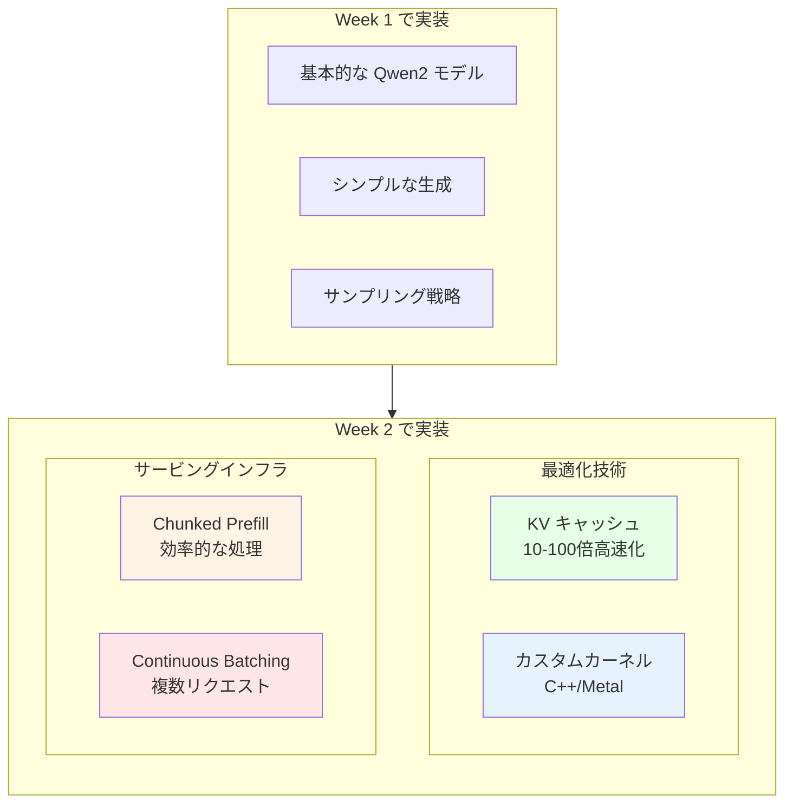
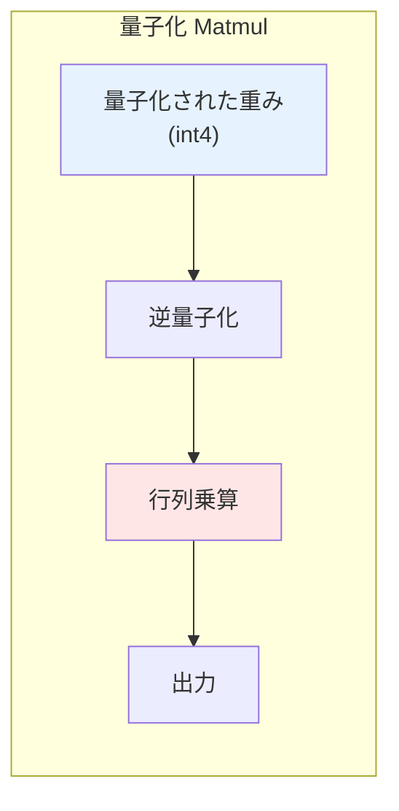
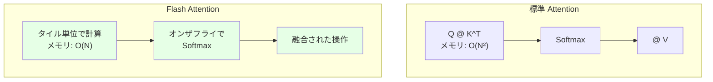
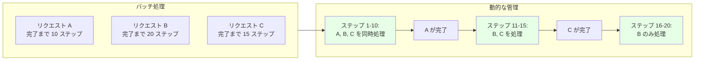
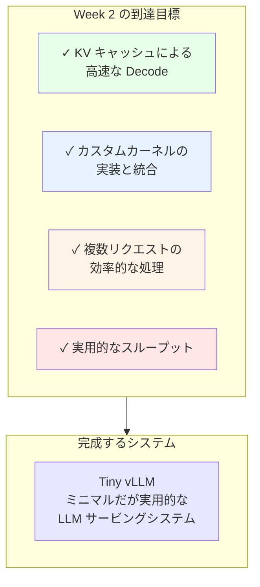
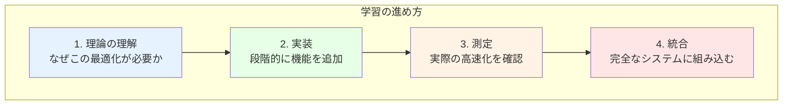

# Week 2: Tiny vLLM

Week 2 では、Qwen2 モデルのサービングインフラストラクチャの構築に焦点を当てます。本質的には、vLLM プロジェクトの最小バージョンをゼロから作成します。Week 終了時には、構築したインフラストラクチャを使用して、Apple Silicon デバイス上で Qwen2 モデルを効率的にサービングできるようになります。

## Week 2 で学ぶこと

Week 1 では、動作する LLM システムを構築しましたが、まだ最適化されていません。Week 2 では、以下の高度な最適化技術を実装します。



### 1. Key-Value (KV) キャッシュの実装

**課題**: Week 1 の実装では、Decode フェーズで毎回すべてのトークンを再計算していました。

```
Week 1:
  Decode ステップ 1: [1, 2, ..., 50, 51] → 52
  Decode ステップ 2: [1, 2, ..., 50, 51, 52] → 53
  ...
  → すべてのトークンを毎回再計算（非効率）
```

**解決策**: KV キャッシュ

Attention 計算で、過去のトークンの Key と Value をキャッシュすることで、新しいトークンの計算のみで済みます。

```
Week 2 (KV キャッシュあり):
  Prefill: [1, 2, ..., 50] → キャッシュに保存
  Decode ステップ 1: [51] + キャッシュ → 52
  Decode ステップ 2: [52] + キャッシュ → 53
  ...
  → 新しいトークンのみ計算（高速）
```

**期待される高速化**: 10-100 倍

### 2. C++/Metal カーネルの実装

**なぜカスタムカーネルが必要か**:

- MLX のデフォルト実装は汎用的
- 特定の操作に特化したカーネルでさらなる高速化
- Apple Silicon の Metal GPU を最大限に活用

**実装するカーネル**:

**a) 量子化 Matmul カーネル**



量子化された重み（4-bit）を効率的に処理する専用カーネルを実装します。

**b) Flash Attention カーネル**



メモリ効率の良い Attention 計算を実装します。

**注意**: このコースでは、カーネルの実装方法を学ぶことが目的です。実装したカーネルは MLX の実装よりも約 10 倍遅くなりますが、最適化は演習として残されています。

### 3. モデルサービングインフラストラクチャ

**a) Chunked Prefill（チャンク化された Prefill）**

**課題**: 長いプロンプトを一度に処理すると、メモリとレイテンシの問題が発生します。

```
従来の Prefill:
  プロンプト全体（例: 1000 トークン）を一度に処理
  → メモリ使用量が大きい
  → 最初のトークン生成まで時間がかかる
```

**解決策**: Chunked Prefill

プロンプトを小さなチャンクに分割して処理します。

```
Chunked Prefill:
  チャンク 1（256 トークン）→ 処理
  チャンク 2（256 トークン）→ 処理
  チャンク 3（256 トークン）→ 処理
  チャンク 4（232 トークン）→ 処理
  → メモリ効率が良い
  → より滑らかなレスポンス
```

**b) Continuous Batching（連続的なバッチ処理）**

**課題**: Week 1 では一度に 1 つのリクエストしか処理できませんでした。

```
Week 1:
  リクエスト A → 完了 → リクエスト B → 完了
  → GPU の並列性を活用できない
```

**解決策**: Continuous Batching

異なる長さのリクエストを動的にバッチ処理します。



**期待される効果**:
- スループット: 5-10 倍向上
- GPU 使用率: 大幅に改善
- レイテンシ: ほぼ変わらず

## Week 2 の構成

Week 2 は以下の Day で構成されます：

**Day 1**: KV キャッシュの実装
- KV キャッシュの仕組みの理解
- キャッシュの実装とテスト
- 高速化の測定

**Day 2-5**: C++/Metal カーネルの実装
- Metal プログラミングの基礎
- 量子化 Matmul カーネル
- Flash Attention カーネル
- パフォーマンスの測定

**Day 6**: サービングインフラストラクチャ
- Chunked Prefill の実装
- Continuous Batching の実装
- 完全なサービングシステムの統合

## ボーナス: Qwen3 モデルのサポート

リポジトリには Qwen3 モデルのスケルトンコードが含まれています。デバイスが bfloat16 データ型をサポートしている場合（注: M1 チップはサポートしていません）、Qwen3 を実装して実験することをお勧めします。

**Qwen3 の新機能**:
- Tied Embedding（すべてのサイズで Weight Tying）
- 改善されたアーキテクチャ
- より効率的な推論

## Week 2 で目指すもの

Week 2 の終わりには、以下のことができるようになります：



**パフォーマンス目標**:
- Decode 速度: 10-100 倍向上（KV キャッシュ）
- スループット: 5-10 倍向上（Continuous Batching）
- メモリ効率: 大幅に改善（Chunked Prefill）

## 必要な前提知識

Week 2 を始める前に、以下を確認してください：

**Week 1 の完了**:
- ✅ Transformer アーキテクチャの理解
- ✅ Attention メカニズムの実装
- ✅ Qwen2 モデルの実装
- ✅ テキスト生成の実装

**開発環境**:
- ✅ Xcode と Command Line Tools
- ✅ CMake
- ✅ Metal 開発環境

**推奨知識**（必須ではない）:
- C++ プログラミングの基礎
- Metal Shading Language の基礎
- GPU プログラミングの概念

C++ や Metal に慣れていない場合でも、コース内で必要な知識を段階的に学べます。

## Week 2 の学習アプローチ



各 Day で、理論 → 実装 → 測定 → 統合のサイクルを繰り返します。

## 参考資料

**vLLM プロジェクト**:
- [vLLM GitHub](https://github.com/vllm-project/vllm)
- [vLLM 論文](https://arxiv.org/abs/2309.06180)

**KV キャッシュ**:
- [Attention is All You Need](https://arxiv.org/abs/1706.03762)
- [KV Cache Optimization](https://huggingface.co/blog/optimize-llm#32-the-kv-cache)

**Flash Attention**:
- [Flash Attention 論文](https://arxiv.org/abs/2205.14135)
- [Flash Attention-2](https://arxiv.org/abs/2307.08691)

**Metal プログラミング**:
- [Metal Programming Guide](https://developer.apple.com/metal/)
- [Metal Shading Language](https://developer.apple.com/metal/Metal-Shading-Language-Specification.pdf)

**Continuous Batching**:
- [Orca: Continuous Batching](https://arxiv.org/abs/2308.16369)
- [vLLM: PagedAttention](https://blog.vllm.ai/2023/06/20/vllm.html)

## Week 2 を始める準備はできましたか？

Week 2 では、LLM サービングの最前線の技術を学びます。これらの技術は、ChatGPT や Claude などの実際のプロダクションシステムでも使用されています。

次の Day 1 では、最も重要な最適化である **KV キャッシュ**の実装から始めます。この単一の最適化だけで、システムの速度が劇的に向上します！

準備ができたら、Week 2 Day 1: KV キャッシュの実装に進みましょう！🚀
