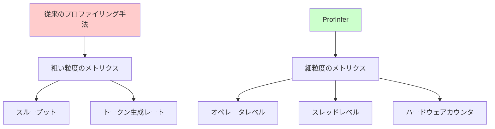
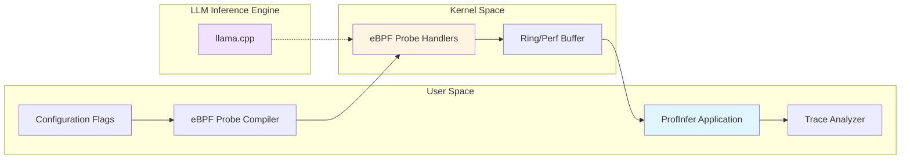
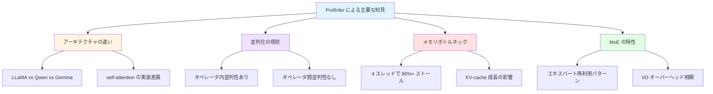

**翻訳元**: [ProfInfer: An eBPF-based Fine-Grained LLM Inference Profiler](https://arxiv.org/html/2601.20755v2)

---

# ProfInfer: eBPF ベースの細粒度 LLM 推論プロファイラ

## 概要

ProfInfer は、大規模言語モデル（LLM）の推論処理に特化したプロファイリングフレームワークです。extended Berkeley Packet Filter（eBPF）技術を活用し、モバイルデバイスやエッジデバイス上での LLM 実行に対して、ソースコード修正なしで細粒度のパフォーマンス可視化を実現します。

## 解決する課題

現代の LLM 推論エンジンは「細粒度かつ非侵入的なプロファイリングサポート」が欠けています。ONNX Runtime や TensorRT などの一般的な機械学習フレームワークはオペレータレベルの可視化を提供していますが、特にモバイルおよびエッジデバイスを対象とした LLM 専用エンジンは、スループットやトークン生成レートといった粗い粒度のメトリクスしか提供していません。

この問題により、以下のような課題が生じています。

- パフォーマンスボトルネックの特定が困難
- 異なる LLM アーキテクチャ間の実行特性の比較が不可能
- メモリ帯域幅やスレッド負荷の詳細な分析ができない
- デバイス上での最適化戦略の立案が困難

## 主要な技術的貢献

著者らは、オープンソースの推論エンジンである llama.cpp 上に ProfInfer を実装しました。このシステムは 3 つの主要な機能を提供します。

### 1. マルチレベルトレーシング

トークンレベル、グラフレベル、オペレータレベルの実行データを捕捉します。これにより、異なる抽象化レイヤーでのパフォーマンス分析が可能になります。

### 2. ハードウェアカウンタ統合

Performance Monitoring Counter（PMC）データをソースコード修正なしで収集します。これにより、キャッシュミス、メモリアクセス、ストールサイクルなどのハードウェアレベルの詳細なメトリクスが取得できます。

### 3. 複数の可視化ビュー

3 種類の可視化ビューを提供し、多角的なパフォーマンス分析を実現します。

- **ProfDAG**: オペレータレベルのプロファイリングメトリクスを含む計算の有向非巡回グラフ（DAG）を表示
- **ProfTime**: スレッドとバックエンド全体の時間的な実行動作を示すタイムライン可視化
- **ProfStat**: トークン、オペレータタイプ、Mixture-of-Experts モデルにおけるエキスパート活性化の統計分析

*図 1: eBPF ベースのトレーサーとトレース解析器で構成される ProfInfer の高レベル設計*

## 技術アーキテクチャ

ProfInfer のアーキテクチャは、ユーザー空間コンポーネントとカーネル空間コンポーネントに分かれています。

### ユーザー空間コンポーネント

設定フラグに基づいて eBPF プローブをコンパイルおよびアタッチし、オーバーヘッドを削減するために情報を条件付きでフィルタリングします。アプリケーションはカーネルハンドラからのバッファ送信を非同期的に処理します。

### カーネル空間コンポーネント

プローブハンドラが実行タイムスタンプ、スレッド ID と CPU ID、関数引数を収集します。情報はリングバッファまたは perf バッファを介してユーザー空間にログ出力されます。

*図 2: llama.cpp に対する ProfInfer のトレーサーの動作概要。基本メトリクスには、プローブタイプ、タイムスタンプ、スレッド ID、CPU ID が含まれる*

## 測定オーバーヘッド

ARM ベースのデバイス（Cortex-A76 コア）でのテストにより、以下のオーバーヘッドが測定されました。

| トレーシング設定 | デコード速度の劣化 |
|------------------|-------------------|
| 完全トレーシング有効 | 2.8%〜4% |
| トークン・グラフレベルのみ | 0.1% |
| libbpf 実装 | 1.7% |

これらの結果は、ProfInfer が実用的なオーバーヘッドで詳細なプロファイリングを実現できることを示しています。選択的な機能有効化により、プロファイリングの詳細度とパフォーマンスへの影響のバランスを調整できます。

## 評価結果と知見

この論文では、複数のデバイス（RK3588 および Qualcomm QCS6490 SoC を搭載した Orange Pi プラットフォーム）と、LLaMA、Qwen、Gemma などの様々な LLM アーキテクチャを分析し、以下のような重要な知見を明らかにしています。

### アーキテクチャの可視性

ProfDAG により、LLaMA3.2-1B、Qwen2.5-1.5B、Gemma2-2B の実装間の構造的な違いが明らかになります。

*図 3: メモリ帯域幅の観点から見た LLaMA-3.2-1B の FFN（フィードフォワードネットワーク）のグラフィカルビュー*

*図 4: 異なる LLM の self-attention におけるアーキテクチャの違い。(a) LLaMA3.2-1B、(b) Qwen2.5-1.5B、(c) Gemma2-2B の ProfDAG 可視化*

### スレッディング解析

行列乗算はオペレータ内並列性を示しますが、オペレータ間の並列化は見られませんでした。これは、現在の実装がオペレータ間の並列実行機会を活用していないことを示唆しています。

*図 5: Perfetto でのタイムラインビュー。オペレータ内並列性のみが観察される（LLaMA3.2-1B-F16、4 スレッド）*

*図 6: スレッド間での（不）均衡なオペレータ負荷。活性化関数と行列乗算間で負荷分散の分散が示される*

### 異なるバックエンドでの実行

CPU、NPU、GPU バックエンド全体での計算パーティショニングと実行を示すタイムライン可視化により、異なるハードウェアバックエンドの特性が明らかになります。

*図 7: 異なるバックエンドでのグラフとオペレータ実行のタイムラインビュー*

### スケジューリング干渉の検出

2 つの Cortex-A76 コアで LLaMA3.2-1B を実行し、1 つのコアに干渉タスクがある場合のスレッドとオペレータトレーシングのタイムラインビューにより、競合するワークロードによるスケジューリング干渉効果と遅延したオペレータ実行が明らかになります。

*図 8: 2 つの Cortex-A76 コアで LLaMA3.2-1B を実行し、1 つのコアに干渉タスクがある場合のスレッドとオペレータトレーシングのタイムラインビュー*

### メモリボトルネック

解析により、4 スレッド構成ではバックエンドストールサイクルが 80%を超えることが特定されました。これは、メモリ帯域幅がパフォーマンスの主要なボトルネックであることを示しています。

*図 9: 1 トークン生成の経過時間と、各デコーディング反復における各レイヤーの KQ および KQV の合計。デコーディング反復全体での KV-cache の成長に伴うパフォーマンス劣化の相関関係を示す*

*図 10: 2 つの Cortex-A76 CPU を使用した最初のデコーディング反復での、オペレータ行列乗算の実行時間。異なるオペレータ全体での計算複雑性と行列乗算ランタイムの相関を示す散布図*

*図 11: 異なるスレッド設定でのデコーディングステージにおける行列乗算のメモリアクセスとストールサイクル比。スレッド数に対するメモリ帯域幅利用率と CPU バックエンドストールを示すパフォーマンスメトリクス解析*

### GPU と CPU の比較

Rubik Pi 上での GPU と CPU の行列乗算オペレータの比較により、様々な行列乗算操作における GPU および CPU バックエンド全体での実行時間を比較した棒グラフが示されます。

*図 12: Rubik Pi 上での GPU と CPU の行列乗算オペレータの比較*

### Mixture-of-Experts（MoE）解析

エキスパート再利用パターンは、メモリ帯域幅ではなく I/O オーバーヘッドと相関することが明らかになりました。

*図 13: Qwen1.5-MoE-A2.7B-Q4 の ffn_moe_up-0 オペレータの活性化エキスパート（合計 60 エキスパート、毎回 4 エキスパートが活性化）。MoE モデルにおけるエキスパート活性化パターンとオペレータレイテンシとの相関を示すヒートマップと時間解析*

## スコープと制限事項

実装は、CPU、OpenCL、Rockchip NPU バックエンドを持つ llama.cpp に焦点を当てています。著者らは、他の推論エンジンおよびバックエンドへの拡張が今後の課題であることを認めています。

また、以下のような制限事項も存在します。

- 現在の実装は llama.cpp に特化しており、他の推論エンジン（ONNX Runtime、TensorRT など）への適用には追加の開発が必要
- GPU バックエンドのサポートは限定的で、より詳細な GPU レベルのプロファイリングは今後の課題
- eBPF の制約により、一部の複雑なプローブは実装が困難
- モバイルデバイスでの PMC データの取得には root 権限が必要な場合がある

## 今後の展望

ProfInfer は、モバイルおよびエッジデバイス上での LLM 推論の最適化に向けた重要な一歩です。この技術により、以下のような応用が期待されます。

- デバイス上での LLM の自動最適化
- アーキテクチャ選択の意思決定支援
- ハードウェア設計へのフィードバック
- エネルギー効率の最適化

eBPF ベースのアプローチは、ソースコード修正なしで詳細なプロファイリングを実現する強力な手法であり、今後の LLM デプロイメントの標準ツールとなる可能性があります。

## まとめ

ProfInfer は、eBPF 技術を活用した革新的な LLM 推論プロファイリングフレームワークです。細粒度のメトリクス収集、低オーバーヘッド、非侵入的なアプローチにより、モバイルおよびエッジデバイス上での LLM パフォーマンスの深い理解を可能にします。

この研究は、LLM のオンデバイス実行における最適化の新たな道を開き、より効率的で高性能な LLM アプリケーションの開発を支援します。
