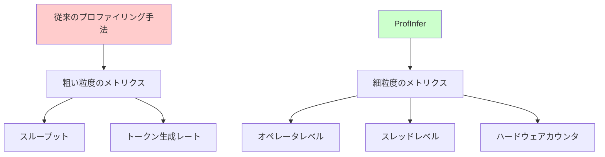
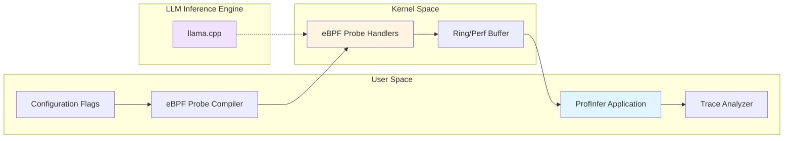
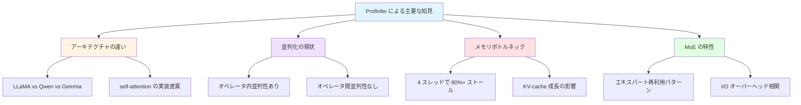

**翻訳元**: [ProfInfer: An eBPF-based Fine-Grained LLM Inference Profiler](https://arxiv.org/html/2601.20755v2)

---

# ProfInfer: eBPF ベースの細粒度 LLM 推論プロファイラ

## Abstract（論文要約）

大規模言語モデル（LLM）が研究から本番環境へと移行する中で、推論エンジンがリアルタイムでどのように動作するかを理解することは、必要不可欠でありながら捉えどころのない課題となっています。ONNX Runtime のような汎用エンジンとは異なり、今日の LLM 推論システムはオペレータレベルの可視性をほとんど提供しておらず、開発者は時間とリソースがどこに消費されているのかを把握できない状態に置かれています。「このワークロードはメモリバウンドなのか、それとも計算バウンドなのか？」といった基本的な問いさえ、しばしば答えられないままです。

このギャップを埋めるため、私たちは現代の LLM 推論エンジン向けの細粒度で非侵入的なプロファイリングフレームワークを開発しました。このフレームワークは llama.cpp を例示として実装していますが、類似のランタイムアーキテクチャにも適用可能です。extended Berkeley Packet Filter（eBPF）技術の上に構築されたこのシステムは、ソースを修正または再コンパイルすることなく、複数のレイヤーにわたるランタイム関数にプローブを動的にアタッチします。収集されたトレースを、オペレータ、グラフ、タイムライン、ハードウェアカウンタトレンドの豊富な可視化に変換し、密な推論、Mixture-of-Experts ルーティング、オペレータオフロードが実際にどのように動作するかを明らかにします。

4%未満のランタイムオーバーヘッドと高いプロファイリング精度により、私たちのフレームワークは LLM 推論を透明かつ診断可能にし、パフォーマンスプロファイリングを最適化、スケジューリング、リソース対応デプロイメントのための実用的なツールに変えます。

## Introduction（導入）

### LLM のオンデバイス展開の重要性

大規模言語モデル（LLM）は、私たちがコンピュータと対話する方法を再構築しています。様々なアプリケーションを通じて、LLM はモバイルデバイスやエッジデバイス上での展開の機会を提供しており、オフライン動作、低レイテンシ、プライバシー強化、ネットワーク依存の削減といった利点をもたらしています。

しかし、デバイス上での LLM 推論を実現することは決して簡単ではありません。最適化された推論エンジンであっても、桁違いの計算およびメモリ要求に直面しています。推論は異なるフェーズを経て進行します。計算バウンドなプリフィルフェーズと、メモリまたは帯域幅バウンドなデコードフェーズです。モバイルデバイスは、プロセッサパワー、メモリサイズ、キャッシング動作、熱放散、エネルギー予算に厳格な制限を課します。これにより、モデルサイズ、メモリ管理、アクセラレータ使用の慎重なバランスが必要となります。

### 既存プロファイリング手法の問題点

現代の LLM 推論エンジンの核心的な問題は、「細粒度かつ非侵入的なプロファイリングサポート」の欠如です。既存のプロファイラーは、再コンパイルを必要とするか、スループットやトークンレートのような粗い粒度のメトリクスしか提供せず、動的オペレータグラフ、スレッドごとのスケジューリング、フェーズ固有の動作を含む重要な実行次元を明らかにできません。

開発者は、量子化、KV キャッシュ再利用、帯域幅制約がデバイス上のレイテンシにどのように影響するかについて、必要な可視性を欠いています。eBPF は深層学習のパフォーマンストレーシングに使用されてきましたが、「LLM 実行セマンティクスから大きく切り離されたまま」であり、低レベルのハードウェアメトリクスとオペレータレベルの洞察を相関させることはほとんどありません。

## ProfInfer の提案

ProfInfer は、これらのギャップに対処する「現代の LLM 推論エンジン向けの細粒度で非侵入的なプロファイリングフレームワーク」として設計されました。eBPF 技術の上に構築され、ソースコードを修正することなく、複数のレイヤーにわたるランタイム関数にプローブを動的にアタッチします。

本論文の主要な貢献は以下の 4 点です：

1. **eBPF ベースのフレームワーク**: 細粒度で非侵入的、モバイル環境向けの軽量設計
2. **包括的な可視性**: 推論パイプライン全体にわたり、ハードウェアカウンタを通じた豊富なパフォーマンスメトリクスを提供
3. **直感的な解析**: タイムラインビュー、DAG 可視化、オペレータレベルのプロットを含む
4. **実証された解析能力**: 計算・メモリボトルネック、KV キャッシュ効果、ワークロード干渉、バックエンドの違い、MoE モデルのダイナミクスの分析

## Background（背景）

### 2.1 大規模言語モデル（LLM）

大規模言語モデルは、主に Transformer ベースのアーキテクチャであり、自己注意機構を活用してコンテキスト情報を捕捉します。GPT のリリース以降、デコーダのみの LLM モデルが生成タスクの主要なアーキテクチャとなりました。

LLaMA ファミリーは、複数の同一の Transformer レイヤーを積み重ねることでこの設計を例示しています。各レイヤーは自己注意レイヤーとフィードフォワードネットワーク（FFN）で構成されています。LLaMA は、Grouped Query Attention（GQA）、Rotary Positional Embeddings、Root-Mean-Squared Layer Normalization、SwiGLU 活性化関数を通じて差別化されています。

Qwen、Phi、Gemma を含む他の LLM ファミリーは、独自のアーキテクチャ設計を維持しています。学習データセットやコンテキスト長を超えて、根本的な違いは構造的なハイパーパラメータから生まれます: レイヤー数、隠れ層サイズ、注意ヘッド数です。

### 2.2 LLM 推論と推論エンジン

#### 2.2.1 LLM 推論

デコーダのみの LLM は、自己回帰推論メカニズムを採用しています。プリフィルステージでプロンプト処理を行った後、モデルはデコーディング反復ごとに単一のトークンを生成し、最大長に達するか `<eos>` のような特殊トークンに遭遇するまで因果性を維持します。

主要なパフォーマンスメトリクスには、「プリフィルステージでの最初のトークンまでの時間（TTFT）」と、デコーディング中の「秒あたりのトークン数（TPS）または出力トークンあたりの時間（TPOT）」が含まれます。両方のメトリクスは、モデルサイズ、アーキテクチャ、ハードウェア構成に依存します。

LLM のスパース性を活用するアーキテクチャの革新には、動的プルーニングと Mixture-of-Experts（MoE）アプローチが含まれ、オンラインで部分的な重みのみを活性化します。投機的デコーディングは、特定のトークン数を生成した後に、より小さなドラフトモデルとより大きな検証モデルを並行実行することで、さらにパフォーマンスを加速します。これらの動的なワークロードはパフォーマンスの変動を引き起こします。例えば、MoE モデルは、エキスパート活性化頻度に基づいて可変のランタイムメモリとディスク I/O オーバーヘッドを経験します。

#### 2.2.2 LLM 推論エンジン

単一のフォワードパスを実行する従来のニューラルネットワークとは異なり、LLM 推論エンジンはトークン化、サンプリング、KV キャッシュ管理を処理します。軽量設計がモバイル向けエンジンの特徴です。

vLLM は、ページドアテンションを使用してバッチ全体で KV キャッシュメモリ割り当てを最適化しますが、このアプローチはバッチサイズ 1 のモバイルシナリオには適していません。MNN-LLM と mlc-llm は、多様なモデルとハードウェアをサポートするモバイルデバイス向けの推論エンジンを代表しています。

ProfInfer は主に llama.cpp を対象としています。これは、広く使用されているオープンソースの推論エンジンであり、多数のフロントエンド（Ollama など）、複数のプログラミング言語バインディング、PowerInfer のような派生物を持っています。C/C++ ベースの推論エンジンとして、llama.cpp は、llama-server、投機的デコーディング、マルチモーダルモデル推論を含む多様な機能を提供します。

llama.cpp は GGML 上に構築されています。GGML は「グラフとオペレータ計算を実行する機械学習ランタイムライブラリ」であり、CPU、GPU、特定の NPU タイプを含む異種バックエンドをサポートしています。

### 2.3 Extended Berkeley Packet Filter（eBPF）

eBPF は、カーネル空間でサンドボックス化されたプログラムを実行することを可能にし、カーネルソースの修正や再コンパイルを必要とせずにカーネル機能を拡張します。2014 年に Linux に導入され、その後 macOS と Windows に拡張されました。

この技術は、カーネルイベントやシステムコールへのフックを容易にし、ユーザー空間関数呼び出しと戻り値にプローブをアタッチし、洗練されたシステムプロファイリングツールの開発を可能にします。

**eBPF の技術的詳細**

カーネル空間の BPF API には以下が含まれます：
- `bpf_ktime_get_ns`: タイムスタンプ取得
- `bpf_get_current_pid_tgid`: プロセスとスレッド ID の取得
- `bpf_get_smp_processor_id`: CPU ID の取得
- `bpf_probe_read_user(kernel)`: ユーザー/カーネルアドレス空間の読み取り
- `map.lookup`: BPF マップの問い合わせ
- `map.update`: BPF マップの更新
- `map.perf_read`: PMC 値の読み取り
- `ringbuf(perf)_submit`: リング/perf バッファへの送信

ユーザー空間の関数には以下が含まれます：
- `attach_u(ret)probe`: ユーザー空間関数の呼び出し/戻り値プローブ
- `attach_tracepoint`: カーネルトレースポイントのアタッチ
- `open_perf_event`: パフォーマンスモニタリングカウンタのファイル記述子作成
- `perf(ring)_buffer_poll`: 送信されたバッファのポーリング

実装には、2 つの人気のあるフレームワークが使用されています: libbpf と BCC（BPF Compiler Collection）です。BCC は、Ubuntu での迅速なプロトタイピングに適した Python バインディングを提供します。一方、libbpf は、デフォルトの Python 環境を欠く OpenHarmony のようなシステム向けの C ライブラリ実装を提供します。

## 解決する課題と技術的アプローチ



## ProfInfer の 3 つの主要機能（初学者向け解説）

著者らは、広く使われているオープンソースの LLM 推論エンジン「llama.cpp」上に ProfInfer を実装しました。llama.cpp は、スマホやラズパイのような小さなデバイスでも ChatGPT のような LLM を動かせるようにするソフトウェアです。

ProfInfer は、この llama.cpp の「中で何が起きているのか」を詳しく観察できるようにする、いわば「顕微鏡」のようなツールです。以下の 3 つの主要な機能を提供します。

### 1. マルチレベルトレーシング: 複数の「ズームレベル」で観察

**わかりやすく言うと: **
Google マップで地図を見るときを想像してください。国レベルで見たり、都市レベルで見たり、建物レベルまでズームしたりできますよね。ProfInfer も同じように、LLM の実行を複数の「ズームレベル」で観察できます。

**3 つのズームレベル: **

1. **トークンレベル（一番広い視点）**
   - 「1 文字生成するのに何秒かかったか」を計測
   - 例: 「こんにちは」と入力したら、最初の返答「あ」が出るまで 0.5 秒、次の「り」が出るまで 0.1 秒、というように測定

2. **グラフレベル（中間の視点）**
   - LLM の計算は「グラフ」という単位で実行される
   - 例: スマホの GPU に任せる部分と CPU で処理する部分を分けているとき、それぞれの処理時間を測定
   - なぜ重要？→ GPU と CPU のどちらが遅いかわかれば、そこを改善できる

3. **オペレータレベル（一番詳細な視点）**
   - LLM の計算は「行列乗算」「活性化関数」などの小さな処理の集まり
   - 例: 行列乗算に 0.3 秒、活性化関数に 0.05 秒、というように個別に測定
   - なぜ重要？→ どの計算が一番遅いかピンポイントでわかる

**具体例で理解する: **
```
料理を作る過程を観察するとします：

トークンレベル = 「料理全体の完成時間」
　→ カレーができるまで 1 時間かかった

グラフレベル = 「工程ごとの時間」
　→ 野菜を切る: 10 分
　→ 煮込む: 40 分
　→ 盛り付け: 10 分

オペレータレベル = 「各作業の詳細」
　→ 玉ねぎを切る: 3 分
　→ にんじんを切る: 2 分
　→ じゃがいもを切る: 5 分
```

これにより、「煮込み時間が長すぎる」「玉ねぎを切るのに時間がかかりすぎている」など、具体的なボトルネックが見えてきます。

### 2. ハードウェアカウンタ統合: CPU の内部状態を読み取る

**わかりやすく言うと: **
CPU には「カウンター」という機能があり、内部で何回メモリにアクセスしたか、何回キャッシュミスが起きたか、などを数えています。ProfInfer はこのカウンターを読み取ることで、CPU の内部状態を把握します。

**なぜソースコード修正なしで読み取れる？**
通常、このようなデータを取得するには、llama.cpp のソースコードに計測用のコードを埋め込む必要があります。しかし、ProfInfer は eBPF という技術を使って、**外部から**カウンターを読み取ります。これは、家の外から電気メーターを読むようなものです。

**測定できる主なメトリクス: **

1. **キャッシュミス回数**
   - CPU のキャッシュ（高速メモリ）にデータがなく、遅いメインメモリまで取りに行った回数
   - 例: 1000 回キャッシュミスが起きた → メモリアクセスが遅い証拠

2. **メモリアクセス回数**
   - メインメモリ（RAM）への読み書き回数
   - 例: 10,000 回メモリアクセスが起きた → メモリ帯域幅がボトルネックの可能性

3. **ストールサイクル**
   - CPU が計算せずに「待っている」時間
   - 例: CPU が 80%の時間待機している → メモリからデータが来るのが遅すぎる

**具体例で理解する: **
```
レストランのキッチンで考えると：

キャッシュ = 調理台の上（すぐ手が届く）
メモリ = 冷蔵庫（取りに行く必要がある）

キャッシュミス多い = 「調理台に必要な材料がなく、何度も冷蔵庫まで取りに行く」
ストールサイクル多い = 「シェフが手を止めて、材料が来るのを待っている時間が長い」
```

### 3. 複数の可視化ビュー: データを見やすく表示

ProfInfer は、収集したデータを 3 種類の方法で可視化します。それぞれ異なる視点からパフォーマンスを理解できます。

#### **ProfDAG（有向非巡回グラフビュー）**

**何を見るか: **
LLM の計算処理の「フローチャート」を表示します。どの計算がどの計算に依存しているか、どこがボトルネックかを視覚的に理解できます。

**具体例: **
```
入力 → 埋め込み → 注意機構 → フィードフォワード → 出力
         ↓          ↓            ↓
      0.1 秒      0.5 秒        0.3 秒

→ 注意機構が一番遅いことがわかる
```

#### **ProfTime（タイムラインビュー）**

**何を見るか: **
時間軸に沿って、どのスレッド（処理の流れ）が、いつ、何をしていたかを表示します。Chrome の DevTools のパフォーマンスタブのようなイメージです。

**何がわかる？**
- 複数のスレッドが同時に動いているか（並列化されているか）
- スレッドが無駄に待機している時間がないか
- GPU と CPU が同時に動いているか、それとも片方が遊んでいるか

**具体例: **
```
時間軸: 0 秒 ──────────────────────────→ 1 秒

スレッド 1: ■■■■■■■■■■（行列乗算実行中）
スレッド 2: ■■■■■■■■■■（行列乗算実行中）
スレッド 3: 　　　　　　　　■■（他のスレッドが終わるのを待っている）
スレッド 4: 　　　　　　　　■■（他のスレッドが終わるのを待っている）

→ スレッド 3 と 4 が無駄に待機していることがわかる
→ 作業の分配方法を改善する必要がある
```

#### **ProfStat（統計解析ビュー）**

**何を見るか: **
大量のデータを統計的に分析し、パターンを見つけます。特に Mixture-of-Experts（MoE）モデルで威力を発揮します。

**MoE モデルとは？**
LLM の中に複数の「専門家（エキスパート）」がいて、入力に応じて適切な専門家を選ぶモデルです。例えば、数学の問題には「数学エキスパート」、コーディングには「プログラミングエキスパート」を使う、というイメージです。

**何がわかる？**
- どのエキスパートがよく使われているか
- エキスパート切り替え時にパフォーマンスが落ちていないか
- 特定のエキスパートだけが遅くなっていないか

**具体例: **
```
60 個のエキスパートがいる MoE モデルで、
毎回 4 個のエキスパートを選んで使う場合：

エキスパート 1: 使用回数 150 回（頻繁に使われる）
エキスパート 37: 使用回数 5 回（ほとんど使われない）

→ よく使うエキスパートは RAM に常駐させる
→ めったに使わないエキスパートはストレージに置いておく
→ メモリ使用量を最適化できる
```


*図 1: eBPF ベースのトレーサーとトレース解析器で構成される ProfInfer の高レベル設計*

## ProfInfer の技術アーキテクチャ（詳細解説）

ProfInfer は「ユーザー空間」と「カーネル空間」の 2 つの世界で動作します。これは OS（オペレーティングシステム）の基本的な仕組みに関係しています。

### ユーザー空間 vs カーネル空間: まず基礎から理解

**わかりやすく言うと: **
コンピュータの中には 2 つの「階層」があります。

```
┌─────────────────────────────────┐
│  ユーザー空間（User Space）      │  ← 普通のアプリが動く世界
│  ・Chrome、VSCode、llama.cpp    │     安全だが制約が多い
│  ・制限された権限                 │
└─────────────────────────────────┘
         ↕ システムコール
┌─────────────────────────────────┐
│  カーネル空間（Kernel Space）     │  ← OS の心臓部
│  ・Linux カーネル                 │     強力だが危険
│  ・無制限の権限                   │
└─────────────────────────────────┘
```

**なぜ分かれている？**
セキュリティのためです。普通のアプリ（ユーザー空間）が暴走しても、OS の心臓部（カーネル空間）には影響しないようになっています。銀行の窓口（ユーザー空間）と金庫室（カーネル空間）のようなイメージです。

### ユーザー空間コンポーネント: 司令塔の役割

ユーザー空間で動く ProfInfer のコンポーネントは、以下の 3 つの仕事をします。

#### 仕事 1: プログラムのコンパイルと設定

**何をするか: **
eBPF プログラム（カーネル空間で動く小さなプログラム）を、設定ファイルに基づいてコンパイルします。

**具体例で理解する: **
```
設定ファイル: config.yaml
---
trace_tensor_dimensions: false  # テンソルの寸法は記録しない
trace_timestamps: true          # タイムスタンプは記録する
trace_pmc: true                 # ハードウェアカウンタは記録する
```

このような設定に基づいて、「何を計測するか」「何を省略するか」を決めます。

**なぜこれが重要？**
すべてを計測すると、計測自体が重くなってしまいます。例えば、体重計に乗るたびに 10 秒待たされたら嫌ですよね。必要な情報だけを計測することで、オーバーヘッド（計測による遅延）を最小限に抑えます。

**テンソルの寸法とは？**
LLM の計算では、巨大な多次元配列（テンソル）を扱います。例えば、[1, 512, 4096] のような寸法です。この情報は、詳細な解析では必要ですが、簡易的なパフォーマンス測定では不要なので、オフにできます。

#### 仕事 2: プローブのアタッチと管理

**何をするか: **
llama.cpp の中の「観察したい関数」に「プローブ」（観察装置）をアタッチします。

**プローブとは？**
関数の入り口と出口に設置する「検問所」のようなものです。関数が呼ばれるたびに、「いつ入ったか」「いつ出たか」を記録します。

**プローブの種類: **

1. **uprobe（ユーザープローブ）**
   - 関数が呼ばれた瞬間にトリガー
   - 例: `llama_decode()` 関数が呼ばれた → タイムスタンプを記録

2. **uretprobe（ユーザーリターンプローブ）**
   - 関数から戻る瞬間にトリガー
   - 例: `llama_decode()` から戻った → タイムスタンプを記録
   - uprobe と uretprobe の差分 = 関数の実行時間

3. **tracepoint（トレースポイント）**
   - カーネルが用意した「観察ポイント」
   - 例: スレッドが切り替わった瞬間をキャッチ

**具体例: トークン生成時間の測定**
```
時刻  イベント
─────────────────────────────────
10:00:00.000  uprobe: llama_decode() 開始
10:00:00.150  uretprobe: llama_decode() 終了

→ 実行時間 = 0.150 秒 = 150 ミリ秒
```

**非同期処理とは？**
プローブが記録したデータは「バッファ」（一時保存場所）に溜まります。ユーザー空間のプログラムは、定期的にこのバッファをチェックして、データを読み取ります。これは、郵便ポストを定期的に確認するようなイメージです。

#### 仕事 3: 動的なオーバーヘッド削減

**何をするか: **
実行中に、計測が重くなりすぎたら、自動的に計測項目を減らします。

**具体例: **
```
通常時：
  デコード速度: 20 トークン/秒
  計測項目: 全て ON（トークン、グラフ、オペレータ、PMC）

パフォーマンス低下を検知：
  デコード速度: 15 トークン/秒 に低下
  → PMC 計測を OFF にする

パフォーマンス回復：
  デコード速度: 19 トークン/秒 に回復
```

これは、車の速度が落ちたらエアコンを弱めるようなものです。計測することで本来のパフォーマンスが損なわれては本末転倒なので、バランスを取ります。

### カーネル空間コンポーネント: データ収集の実働部隊

カーネル空間で動く「プローブハンドラ」は、実際にデータを収集する役割を担います。

#### 収集するデータ

**1. プロセス ID（PID）**
どのプロセス（実行中のプログラム）がこの関数を呼んだかを記録します。

```
例：
PID 12345: llama.cpp のメインプロセス
PID 12346: llama.cpp が起動したサブプロセス
```

**2. スレッド ID（TID）**
どのスレッド（処理の流れ）がこの関数を呼んだかを記録します。

```
例：
TID 1: メインスレッド
TID 2: 行列乗算を担当するワーカースレッド
TID 3: 行列乗算を担当するワーカースレッド
TID 4: 行列乗算を担当するワーカースレッド
```

**なぜ重要？**
LLM は複数のスレッドで並列に計算します。どのスレッドがどれだけ働いているかを知ることで、負荷分散が適切かどうかがわかります。

**3. CPU ID**
どの CPU コア上で実行されたかを記録します。

```
例（4 コアの CPU）：
CPU 0: TID 1 が実行中
CPU 1: TID 2 が実行中
CPU 2: TID 3 が実行中
CPU 3: TID 4 が実行中
```

**なぜ重要？**
スレッドが頻繁に異なる CPU コア間を移動すると、キャッシュの内容が無効になり、パフォーマンスが低下します（これを「キャッシュスラッシング」と呼びます）。

**4. タイムスタンプ**
イベントが発生した正確な時刻をナノ秒単位で記録します。

```
例：
1704067200.123456789 秒（2024 年 1 月 1 日 00:00:00.123456789）
```

**5. 関数の引数**
呼び出された関数の引数を解析して、追加情報を取得します。

**具体例: オペレータ情報の取得**
```c
// llama.cpp のコード（簡略化）
void ggml_compute_forward(struct ggml_tensor* tensor) {
    // tensor には以下の情報が含まれる
    tensor->name = "ffn_out-0"        // オペレータ名
    tensor->op = GGML_OP_MUL_MAT      // 操作タイプ（行列乗算）
    tensor->ne[0] = 4096              // 次元 1 のサイズ
    tensor->ne[1] = 1                 // 次元 2 のサイズ
}
```

ProfInfer のプローブは、この `ggml_tensor` 構造体を読み取って、どのような計算が行われているかを記録します。

**なぜこれができる？**
eBPF には `bpf_probe_read_user()` という関数があり、ユーザー空間のメモリを安全に読み取れます。これにより、llama.cpp のソースコードを変更せずに、内部データにアクセスできます。

#### データの送信方法: 2 つの選択肢

カーネル空間で収集したデータをユーザー空間に送る方法は 2 つあります。

**1. リングバッファ（Ring Buffer）**

**特徴: **
- 高速だが、バッファが満杯になるとデータを捨てる
- 循環型のバッファ（古いデータから上書きされる）

**使うべき場合: **
- 多少のデータ欠損は許容できる
- とにかく低オーバーヘッドが重要

**イメージ: **
```
リングバッファ（容量 10 件）:
[1][2][3][4][5][6][7][8][9][10]
 ↑                           ↑
書き込み位置                 読み取り位置

バッファが満杯で、さらに書き込むと：
[11][2][3][4][5][6][7][8][9][10]
  ↑                           ↑
データ 1 が上書きされて消える
```

**2. perf バッファ（Perf Buffer）**

**特徴: **
- 少し遅いが、データを絶対に捨てない
- バッファが満杯になると、書き込み側がブロック（待機）する

**使うべき場合: **
- すべてのデータが必要
- 多少のオーバーヘッド増加は許容できる

**イメージ: **
```
perf バッファ:
バッファが満杯になったら、ユーザー空間が読み取るまで待つ

カーネル空間: 「バッファ満杯！書き込めない！」
              → 待機...
ユーザー空間: 「データ読み取り完了！」
              → バッファに空きができる
カーネル空間: 「書き込み再開！」
```

**どちらを選ぶ？**
- **開発・デバッグ時**: perf バッファ（全データが必要）
- **本番環境**: リングバッファ（パフォーマンス優先）

**どちらを選ぶ？**
- **開発・デバッグ時**: perf バッファ（全データが必要）
- **本番環境**: リングバッファ（パフォーマンス優先）




*図 2: llama.cpp に対する ProfInfer のトレーサーの動作概要。基本メトリクスには、プローブタイプ、タイムスタンプ、スレッド ID、CPU ID が含まれる*

## マルチ粒度トレーシングの詳細実装

ProfInfer は 4 つのレベルでトレーシングを実行します。それぞれのレベルについて、具体的な実装方法を説明します。

### レベル 1: トークンレベルトレーシング

**目的: ** 1 トークン生成にかかる時間を測定

**仕組み: **
llama.cpp の `llama_decode()` 関数に uprobe と uretprobe をアタッチします。この関数は、1 トークンを生成するたびに呼ばれます。

**測定される 2 つのメトリクス: **

1. **TTFT（Time To First Token）** - 最初のトークンまでの時間
   - プリフィルステージ（入力プロンプトの処理）の時間
   - 例: 「日本の首都は」と入力 → 「東」が出るまで

2. **TPOT（Time Per Output Token）** - 出力トークンあたりの時間
   - デコーディングステージ（トークンを 1 つずつ生成）の時間
   - 例: 「東」→「京」→「で」→「す」と 1 文字ずつ出力

**具体例: **
```
入力: 「日本の首都は」

測定結果:
  TTFT: 0.5 秒（プリフィル）
  TPOT: 0.1 秒（「東」を生成）
  TPOT: 0.1 秒（「京」を生成）
  TPOT: 0.1 秒（「で」を生成）
  TPOT: 0.1 秒（「す」を生成）

合計: 0.5 + 0.4 = 0.9 秒
```

**なぜ重要？**
TTFT が長いと、ユーザーは「反応が遅い」と感じます。TPOT が長いと、文章生成が遅くなります。どちらを改善すべきかがわかります。

### レベル 2: グラフレベルトレーシング

**目的: ** 異種ハードウェア（CPU/GPU/NPU）での処理時間を個別に測定

**背景: llama.cpp の異種バックエンドサポート**
llama.cpp は、計算を複数のバックエンドに分散できます：
- CPU で一部の層を処理
- GPU で一部の層を処理（オフロード）
- NPU（Neural Processing Unit）で一部の層を処理

**仕組み: **
`ggml_backend_graph_compute_async()` 関数にプローブをアタッチします。この関数は、各バックエンドで計算グラフを実行するときに呼ばれます。

**具体例: GPU オフロード**
```
LLaMA3.2-1B モデル（24 層）:
  層 0-15: CPU で処理（16 層）
  層 16-23: GPU で処理（8 層）

測定結果:
  CPU グラフ: 0.3 秒
  GPU グラフ: 0.1 秒

→ GPU のほうが 3 倍速い
→ もっと多くの層を GPU にオフロードすべき
```

**なぜ重要？**
GPU は高速ですが、メモリが限られています。どこまで GPU にオフロードするのが最適かを判断するための情報が得られます。

### レベル 3: オペレータレベルトレーシング

**目的: ** 行列乗算、活性化関数など、個別の計算処理の時間を測定

**LLM の計算は小さなオペレータの集まり**
LLM の各層は、以下のような小さな計算（オペレータ）で構成されています：
- 行列乗算（MUL_MAT）
- 活性化関数（SILU, GELU）
- 正規化（RMS_NORM）
- 加算（ADD）

**仕組み: **
各バックエンドのオペレータ実行関数にプローブをアタッチ：
- CPU: `ggml_compute_forward()`
- OpenCL（GPU）: `ggml_cl_compute_forward()`
- Rockchip NPU: `ggml_rk_compute_forward()`

**取得する情報: **
```c
// 各オペレータについて記録
{
  name: "ffn_gate-0",           // オペレータ名
  op_type: GGML_OP_MUL_MAT,     // 操作タイプ（行列乗算）
  dimensions: [4096, 11008],     // テンソルのサイズ
  execution_time: 0.015 秒,     // 実行時間
  backend: "CPU"                 // 実行バックエンド
}
```

**具体例: Transformer 層の内訳**
```
Transformer 層 0 の詳細:

Self-Attention:
  Q 行列乗算: 0.010 秒
  K 行列乗算: 0.010 秒
  V 行列乗算: 0.010 秒
  QK 乗算: 0.005 秒
  Softmax: 0.002 秒
  QKV 乗算: 0.005 秒
  出力投影: 0.010 秒
小計: 0.052 秒

Feed-Forward Network:
  ゲート投影: 0.020 秒
  アップ投影: 0.020 秒
  活性化関数: 0.003 秒
  ダウン投影: 0.015 秒
小計: 0.058 秒

層 0 合計: 0.110 秒

→ FFN が少し遅い（全体の 53%）
→ FFN の最適化を優先すべき
```

**なぜ重要？**
どのオペレータがボトルネックかがわかります。例えば、行列乗算が遅ければ、より高速な BLAS ライブラリを使う、量子化を適用するなどの対策を取れます。

### レベル 4: スケジューラレベルトレーシング

**目的: ** OS のスレッドスケジューリングを観察し、他のプロセスによる干渉を検出

**背景: マルチタスク環境の問題**
スマホやラズパイでは、LLM 以外のプロセスも同時に動いています：
- バックグラウンドアプリ
- システムプロセス
- ウイルススキャン

これらが CPU を奪い合うと、LLM のパフォーマンスが低下します。

**仕組み: **
Linux カーネルのスケジューラトレースポイントにアタッチ：
- `sched_switch`: スレッドが切り替わったとき
- `sched_wakeup`: スレッドが起こされたとき

**フィルタリング: **
すべてのスレッド切り替えを記録すると、オーバーヘッドが膨大になります。そのため、LLM 関連のスレッド ID（PID）だけをフィルタリングします。

**具体例: 干渉の検出**
```
理想的な状態（干渉なし）:
  LLM スレッド 1: ■■■■■■■■■■（常に実行中）
  LLM スレッド 2: ■■■■■■■■■■（常に実行中）

干渉がある状態:
  LLM スレッド 1: ■■□□■■□□■■（他プロセスに CPU を奪われる）
  LLM スレッド 2: ■■□□■■□□■■（他プロセスに CPU を奪われる）
  他のプロセス:   □□■■□□■■□□（LLM の CPU を奪う）

□ = 待機中
■ = 実行中

結果:
  干渉なし: 0.5 秒で完了
  干渉あり: 0.8 秒で完了（60%遅くなる）
```

**なぜ重要？**
「LLM が遅い」原因が、LLM 自体ではなく、他のプロセスの干渉だとわかります。この場合、LLM を最適化しても効果はなく、他のプロセスを止める、CPU コアを専有するなどの対策が必要です。

## 測定オーバーヘッド: 詳細解説

ProfInfer 自体が LLM のパフォーマンスにどれだけ影響するかを測定しました。これは「顕微鏡で観察すること自体が、観察対象に影響を与える」という問題です。

### 実験環境

**ハードウェア: **
- CPU: ARM Cortex-A76 コア（スマホやラズパイに搭載される CPU）
- デバイス: Orange Pi プラットフォーム

**モデル: **
- LLaMA3.2-1B（10 億パラメータの小型モデル）

**測定指標: **
- デコード速度の劣化率（トークン/秒がどれだけ遅くなるか）

### 測定結果の詳細

| トレーシング設定 | デコード速度の劣化 | 説明 |
|------------------|-------------------|------|
| トレーシングなし（ベースライン） | 0%（基準） | 20 トークン/秒 |
| トークン・グラフレベルのみ | 0.1% | 19.98 トークン/秒 |
| 完全トレーシング（BCC 版） | 2.8%〜4% | 19.2〜19.4 トークン/秒 |
| 完全トレーシング（libbpf 版） | 1.7% | 19.66 トークン/秒 |

**完全トレーシングとは: **
- トークンレベル
- グラフレベル
- オペレータレベル
- スケジューラレベル
- PMC（ハードウェアカウンタ）

すべてを同時に計測する最も重い設定です。

### なぜオーバーヘッドが発生するのか？

**1. プローブの実行コスト**
関数が呼ばれるたびに、eBPF プログラムが実行されます。これには時間がかかります。

```
通常の関数呼び出し:
  関数呼び出し → 処理 → 戻る
  時間: 10 マイクロ秒

プローブあり:
  関数呼び出し → uprobe（2μs） → 処理 → uretprobe（2μs） → 戻る
  時間: 14 マイクロ秒

オーバーヘッド = 4 マイクロ秒 = 40%増
```

ただし、関数呼び出しの頻度によって影響は変わります：
- トークンレベル（1 秒に 1 回）: ほぼ影響なし
- オペレータレベル（1 秒に 1000 回）: 影響大

**2. データの送信コスト**
カーネル空間からユーザー空間へのデータ転送にも時間がかかります。

**3. メモリアクセスコスト**
eBPF プログラムがユーザー空間のメモリ（`ggml_tensor` 構造体など）を読み取るとき、キャッシュミスが発生する可能性があります。

### BCC vs libbpf: なぜ libbpf のほうが速い？

**BCC（BPF Compiler Collection）: **
- Python ベース
- 実行時にコンパイル（JIT）
- 開発が簡単だが、少しオーバーヘッドが大きい
- オーバーヘッド: 2.8%〜4%

**libbpf: **
- C ライブラリ
- 事前コンパイル（AOT）
- 少し複雑だが、オーバーヘッドが小さい
- オーバーヘッド: 1.7%

**具体的な違い: **
```
BCC:
  起動 → Python インタプリタ起動 → C コードをコンパイル → 実行

libbpf:
  起動 → 既にコンパイル済み → すぐ実行
```

### 実用性の評価

**4%のオーバーヘッドは許容できるか？**

**許容できる理由: **
1. プロファイリングは開発時のみ実行（本番環境では不要）
2. 4%遅くなっても、ボトルネックを見つけて 10%高速化できれば、差し引きプラス
3. 必要に応じてトレーシングレベルを調整できる

**具体例: **
```
オリジナル: 20 トークン/秒
ProfInfer 有効: 19.2 トークン/秒（4%遅い）

→ ボトルネックを発見
→ 最適化を実施

最適化後: 22 トークン/秒（10%速い）
ProfInfer なし: 最適化できず 20 トークン/秒のまま

結果: ProfInfer を使ったほうが、最終的に 2 トークン/秒速い
```

### 選択的トレーシングの威力

すべての機能を有効にする必要はありません。目的に応じて選択できます：

**段階 1: まず軽く調査（オーバーヘッド 0.1%）**
```
設定:
  - トークンレベル: ON
  - グラフレベル: ON
  - オペレータレベル: OFF
  - PMC: OFF

わかること:
  - トークン生成速度
  - バックエンドごとの処理時間

→ 「GPU が遅い」ことがわかった
```

**段階 2: 詳細に調査（オーバーヘッド 2〜4%）**
```
設定:
  - トークンレベル: ON
  - グラフレベル: ON
  - オペレータレベル: ON（GPU のみ）
  - PMC: ON

わかること:
  - GPU のどのオペレータが遅いか
  - メモリアクセスが原因か、計算が原因か

→ 「行列乗算が遅い、メモリ帯域幅がボトルネック」とわかった
```

このように、段階的に詳細度を上げることで、オーバーヘッドを最小限に抑えながら、必要な情報を得られます。

## 評価結果と知見: ProfInfer で何がわかるのか？（詳細解説）

この論文では、複数のデバイスと様々な LLM アーキテクチャを使って、ProfInfer の実用性を検証しました。ここでは、各実験の背景、目的、結果を初学者にもわかりやすく解説します。

### 実験環境の詳細

**テストデバイス: **
1. **Orange Pi 5 Plus**
   - CPU: Rockchip RK3588（8 コア、Cortex-A76 × 4 + Cortex-A55 × 4）
   - RAM: 16GB
   - NPU: Rockchip NPU（6 TOPS）
   - 用途: スマホやラズパイクラスのデバイスを想定

2. **Qualcomm QCS6490 デバイス**
   - CPU: Kryo 670（8 コア）
   - GPU: Adreno 643
   - 用途: ミドルレンジスマートフォンを想定

**テストモデル: **
- LLaMA3.2-1B（10 億パラメータ）
- Qwen2.5-1.5B（15 億パラメータ）
- Gemma2-2B（20 億パラメータ）
- Qwen1.5-MoE-A2.7B-Q4（Mixture-of-Experts、27 億パラメータ）

### 実験 1: アーキテクチャの可視性 - 異なる LLM の内部構造を比較

**目的: **
異なる LLM（LLaMA、Qwen、Gemma）の内部構造を可視化し、どこが違うのかを明らかにする。

**背景: **
LLM は表面上は似ていますが、内部の実装は大きく異なります。例えば：
- 注意機構の計算方法
- フィードフォワードネットワークの構造
- 中間層の接続方法

これらの違いがパフォーマンスに大きく影響しますが、コードを読むだけでは理解しにくいです。ProfDAG で可視化すれば、一目でわかります。

**実験方法: **
ProfInfer のオペレータレベルトレーシングで、各モデルの FFN（フィードフォワードネットワーク）と Self-Attention の計算グラフを可視化しました。


*図 3: メモリ帯域幅の観点から見た LLaMA-3.2-1B の FFN（フィードフォワードネットワーク）のグラフィカルビュー*

**結果の解釈: **

図 3 は、LLaMA3.2-1B の FFN の計算グラフを、メモリ帯域幅の観点から可視化したものです。各ノード（丸や四角）がオペレータ（計算処理）を表し、矢印がデータの流れを示しています。

**わかること: **
- FFN は「ゲート投影 → アップ投影 → 活性化 → ダウン投影」という流れで構成
- 各オペレータのメモリ帯域幅消費量が色の濃さで表現されている
- 行列乗算（MUL_MAT）が最もメモリ帯域幅を消費している（濃い色）

**実用的な洞察: **
メモリ帯域幅が大きいオペレータは、高速なメモリアクセスが重要です。これらのオペレータを GPU にオフロードするか、量子化（データサイズを減らす）を適用すると効果的です。


*図 4: 異なる LLM の self-attention におけるアーキテクチャの違い。(a) LLaMA3.2-1B、(b) Qwen2.5-1.5B、(c) Gemma2-2B の ProfDAG 可視化*

**結果の解釈: **

図 4 は、3 つの異なる LLM の Self-Attention メカニズムを比較しています。一見似ていますが、よく見ると違いがあります。

**LLaMA3.2-1B の特徴: **
- Grouped Query Attention（GQA）を使用
- Q（Query）、K（Key）、V（Value）の計算が独立
- KV キャッシュの再利用がしやすい構造

**Qwen2.5-1.5B の特徴: **
- 追加の正規化層（RMS_NORM）がある
- より細かい粒度で計算が分割されている
- メモリアクセスパターンが LLaMA と異なる

**Gemma2-2B の特徴: **
- Multi-Head Attention（MHA）を使用
- より多くの注意ヘッドを持つ（計算グラフが複雑）
- 並列化の機会が多いが、メモリ消費も大きい

**実用的な洞察: **
- **LLaMA**: メモリ効率が良い（スマホ向き）
- **Qwen**: 計算が細かく分割されている（デバッグしやすい）
- **Gemma**: 計算量が多い（高性能デバイス向き）

モデルを選ぶときは、デバイスの性能とメモリ容量に応じて選択すべきです。

### 実験 2: スレッディング解析 - 並列化の実態を調査

**目的: **
LLM 推論が複数のスレッドをどのように使っているか、並列化は効率的か、を調べる。

**背景: **
最近の CPU はマルチコア（複数の処理ユニット）を持っています。例えば、4 コア CPU なら、理論上は 4 つの処理を同時に実行できます。しかし、実際には：
- スレッド間でデータを共有する必要がある
- 処理が依存関係を持つ（A の結果がないと B を実行できない）
- 負荷が不均等に分散される

などの理由で、理想的な速度向上（4 コアなら 4 倍速）は達成できません。

**実験方法: **
ProfTime（タイムラインビュー）で、4 スレッドで LLaMA3.2-1B を実行し、各スレッドが何をしているかを観察しました。


*図 5: Perfetto でのタイムラインビュー。オペレータ内並列性のみが観察される（LLaMA3.2-1B-F16、4 スレッド）*

**結果の解釈: **

図 5 は、時間軸に沿って各スレッドの動きを表示したものです（Perfetto は Chrome のパフォーマンスツールと同じビューワです）。

**観察された現象: **
1. **オペレータ内並列性はある**
   - 1 つの行列乗算を 4 つのスレッドで分担して実行している
   - 例: 1024×4096 の行列を、各スレッドが 256×4096 ずつ処理
   - これは効率的

2. **オペレータ間並列性はない**
   - オペレータ A が終わるまで、オペレータ B は開始しない
   - つまり、行列乗算 → 活性化関数 → 次の行列乗算、という順序で逐次実行
   - 並列実行の機会を逃している

**具体例で理解: **
```
理想的な並列化（オペレータ間並列性あり）:
  スレッド 1: [行列乗算 A] [行列乗算 B] [行列乗算 C]
  スレッド 2: [行列乗算 A] [行列乗算 B] [行列乗算 C]
  スレッド 3: [活性化 A]   [活性化 B]   [活性化 C]
  スレッド 4: [正規化 A]   [正規化 B]   [正規化 C]

実際の実装（オペレータ内並列性のみ）:
  スレッド 1-4: [行列乗算 A] → [活性化 A] → [正規化 A] → [行列乗算 B] → ...
                ↑ 全スレッドで分担      ↑ 全スレッドで分担
```

**なぜこうなっているのか？**
llama.cpp の実装では、各オペレータが完了するのを待ってから次のオペレータを開始する設計になっています。これは実装がシンプルですが、並列化の機会を逃しています。

**実用的な洞察: **
オペレータ間並列性を実装すれば、さらに高速化できる可能性があります。ただし：
- 実装が複雑になる
- メモリ使用量が増える（複数のオペレータが同時にメモリを使う）
- デバッグが難しくなる

トレードオフを考慮して、どちらを選ぶか判断する必要があります。


*図 6: スレッド間での（不）均衡なオペレータ負荷。活性化関数と行列乗算間で負荷分散の分散が示される*

**結果の解釈: **

図 6 は、2 つの異なるオペレータ（活性化関数と行列乗算）でのスレッド負荷分散を比較しています。

**活性化関数の場合（上の図）: **
```
スレッド 1: ■■■■（短い）
スレッド 2: ■■■■（短い）
スレッド 3: ■■■■（短い）
スレッド 4: ■■■■（短い）

→ 全スレッドがほぼ同時に終了（均衡している）
```

**なぜ均衡している？**
活性化関数（SiLU、GELU など）は、各要素に対して独立に計算できます。データを 4 等分すれば、各スレッドの作業量は同じになります。

**行列乗算の場合（下の図）: **
```
スレッド 1: ■■■■■■■■（長い）
スレッド 2: ■■■■■■■■（長い）
スレッド 3: ■■　　　　　（短い、待機時間が長い）
スレッド 4: ■■　　　　　（短い、待機時間が長い）

→ スレッド 3 と 4 が早く終わって遊んでいる（不均衡）
```

**なぜ不均衡？**
行列乗算の場合、行列のサイズによって作業量が変わります：
- 4096×4096 の行列: 4 等分しても各スレッドの作業量は同じ
- 4096×1024 の行列: 行方向に分割すると、一部のスレッドの作業量が少なくなる

**具体例で理解: **
```
4096×4096 行列を 4 スレッドで分割:
  スレッド 1: 行 0-1023 を処理（1024 行）
  スレッド 2: 行 1024-2047 を処理（1024 行）
  スレッド 3: 行 2048-3071 を処理（1024 行）
  スレッド 4: 行 3072-4095 を処理（1024 行）
  → 均衡している

4096×512 行列を 4 スレッドで分割:
  スレッド 1: 行 0-127 を処理（128 行）
  スレッド 2: 行 128-255 を処理（128 行）
  スレッド 3: 行 256-383 を処理（128 行）
  スレッド 4: 行 384-511 を処理（128 行）

しかし、実際には:
  スレッド 1: 多くの作業
  スレッド 2: 多くの作業
  スレッド 3: 少ない作業（待機時間が長い）
  スレッド 4: 少ない作業（待機時間が長い）
```

これは、行列の形状や分割方法によって、スレッドごとの作業量が変わるためです。

**実用的な洞察: **
負荷分散の不均衡は、並列化の効率を下げます。改善策：
1. **動的タスク分割**: 固定サイズではなく、各スレッドが作業を取りに来る方式
2. **行列サイズに応じた分割戦略**: 小さい行列は 2 スレッドで処理、大きい行列は 4 スレッドで処理
3. **Work Stealing**: 空いているスレッドが忙しいスレッドの作業を手伝う

これらの改善により、理論値に近い並列化効率（4 コアで 4 倍速）を達成できます。

### 実験 3: 異なるバックエンドでの実行 - CPU/GPU/NPU の特性を比較

**目的: **
CPU、GPU、NPU（Neural Processing Unit）という異なるハードウェアで、同じ LLM を実行したときの違いを調べる。

**背景: **
最近のデバイスには、複数の処理ユニットが搭載されています：
- **CPU（中央処理装置）**: 汎用的だが、LLM には遅い
- **GPU（グラフィック処理装置）**: 並列計算が得意、LLM 向き
- **NPU（ニューラル処理装置）**: AI 専用、省電力

llama.cpp はこれらを組み合わせて使えますが、どのように分担させるのが最適かは不明です。

**実験方法: **
ProfTime で、異なるバックエンド構成での実行を可視化しました。


*図 7: 異なるバックエンドでのグラフとオペレータ実行のタイムラインビュー*

**結果の解釈: **

図 7 は、3 つの異なるバックエンド（RKNN、CLBlast、OpenCL）での実行を比較しています。

**RKNN（Rockchip NPU）バックエンド: **
- NPU は AI 計算専用のハードウェア
- 低消費電力で動作
- ただし、すべてのオペレータをサポートしているわけではない
- CPU と NPU が交互に動作している（一部の計算は CPU に戻ってくる）

**CLBlast（GPU）バックエンド: **
- GPU での実行（OpenCL ベース）
- 並列計算が得意
- CPU → GPU へのデータ転送時間が発生
- タイムラインに「隙間」が見える → データ転送待ち

**OpenCL（汎用）バックエンド: **
- CPU でも GPU でも動く汎用 API
- この例では GPU で実行
- CLBlast より最適化されていないため、少し遅い

**実用的な洞察: **

**バックエンド選択の基準: **
1. **NPU（RKNN）を使うべき場合**
   - バッテリー駆動デバイス（スマホ、IoT）
   - リアルタイム性が重要
   - 精度は少し犠牲にできる

2. **GPU を使うべき場合**
   - 高速な推論が必要
   - 電力消費はあまり気にしない
   - 大きなバッチサイズで実行

3. **CPU を使うべき場合**
   - 互換性が最優先
   - 小さいモデル（CPU でも十分速い）
   - GPU/NPU が利用できない環境

**ハイブリッド構成の可能性: **
```
理想的な分担:
  層 0-10: NPU で実行（省電力）
  層 11-15: GPU で実行（高速）
  層 16-23: CPU で実行（互換性）

現実:
  データ転送のオーバーヘッドで遅くなる可能性あり
  → 実測して最適な構成を見つける必要がある
```

ProfInfer のようなツールがあれば、実際に測定して最適な構成を見つけられます。

### 実験 4: スケジューリング干渉の検出 - 他のアプリの影響を調査

**目的: **
LLM 以外のアプリ（バックグラウンドプロセス）が同時に動いているとき、LLM のパフォーマンスにどれだけ影響するかを調べる。

**背景: **
スマホやラズパイでは、LLM だけが動いているわけではありません：
- メッセージアプリ
- システムアップデート
- ウイルススキャン
- ブラウザのバックグラウンドタブ

これらが CPU を奪い合うと、LLM が遅くなります。しかし、「LLM が遅い」原因が、LLM 自体なのか、他のアプリの干渉なのか、通常は判別できません。

**実験方法: **
1. 2 つの CPU コアで LLaMA3.2-1B を実行
2. 意図的に 1 つのコアで「干渉タスク」（CPU を使う無駄な処理）を実行
3. ProfTime と スケジューラレベルトレーシングで影響を観察


*図 8: 2 つの Cortex-A76 コアで LLaMA3.2-1B を実行し、1 つのコアに干渉タスクがある場合のスレッドとオペレータトレーシングのタイムラインビュー*

**結果の解釈: **

図 8 は、干渉タスクがある場合の LLM 実行の様子を示しています。

**観察された現象: **
```
理想的な状態（干渉なし）:
  コア 0: [LLM スレッド 1] ■■■■■■■■■■
  コア 1: [LLM スレッド 2] ■■■■■■■■■■

干渉がある状態:
  コア 0: [LLM スレッド 1] ■■□□■■□□■■
  コア 0: [干渉タスク]     □□■■□□■■□□

  コア 1: [LLM スレッド 2] ■■■■■■■■■■（影響なし）

■ = 実行中
□ = 待機中
```

**何が起きているのか？**
1. LLM スレッド 1 が実行中
2. 干渉タスクが同じコア 0 で動き始める
3. OS スケジューラが CPU 時間を分配: 50% LLM、50% 干渉タスク
4. LLM スレッド 1 が CPU を使えない時間が発生
5. 結果: LLM の実行時間が約 2 倍に

**詳細な分析: **
スケジューラレベルトレーシングにより、以下がわかります：
- `sched_switch` イベント: スレッドの切り替わりを検出
- `sched_wakeup` イベント: スレッドが起こされたことを検出

これにより、「LLM スレッドが CPU を奪われた瞬間」が正確にわかります。

**実用的な洞察: **

**干渉を減らす方法: **
1. **CPU Affinity（CPU 親和性）の設定**
   ```bash
   # LLM を特定のコアに固定
   taskset -c 0,1 ./llama-server

   # 他のプロセスは別のコアで実行
   taskset -c 2,3 ./other-app
   ```

2. **プロセス優先度の設定**
   ```bash
   # LLM を高優先度で実行
   nice -n -20 ./llama-server
   ```

3. **cgroup（Control Group）の利用**
   ```bash
   # LLM 専用の cgroup を作成し、CPU 時間を保証
   cgcreate -g cpu:/llm
   cgset -r cpu.shares=2048 llm  # 高い CPU シェア
   cgexec -g cpu: llm ./llama-server
   ```

4. **リアルタイムスケジューリング**
   ```bash
   # リアルタイム優先度で実行（要 root 権限）
   chrt -f 99 ./llama-server
   ```

**注意点: **
これらの設定は諸刃の剣です。LLM を高優先度にしすぎると、システム全体が応答しなくなる可能性があります。適切なバランスを見つける必要があります。

### 実験 5: メモリボトルネック - CPU が待っている時間を測定

**目的: **
CPU が計算に使っている時間と、メモリからデータが来るのを待っている時間の比率を調べる。

**背景: **
LLM の計算は「メモリバウンド」と呼ばれることが多いです。これは、CPU の計算速度よりも、メモリからデータを読み込む速度のほうが遅い、という意味です。

**例えで理解: **
```
レストランのキッチンで考えます：

計算バウンド（CPU が忙しい）:
  シェフ: 材料を切ったり炒めたりで忙しい ■■■■■
  材料の調達: すぐ届く

メモリバウンド（メモリが遅い）:
  シェフ: 材料が来るのを待っている □□□□□
  材料の調達: 遠い倉庫から取りに行くため遅い

LLM は後者の状態になりやすい
```

**実験方法: **
PMC（Performance Monitoring Counter）を使って、以下を測定：
- メモリアクセス回数
- キャッシュミス回数
- CPU ストールサイクル（待機時間）
- 実際の計算サイクル


*図 9: 1 トークン生成の経過時間と、各デコーディング反復における各レイヤーの KQ および KQV の合計。デコーディング反復全体での KV-cache の成長に伴うパフォーマンス劣化の相関関係を示す*


*図 10: 2 つの Cortex-A76 CPU を使用した最初のデコーディング反復での、オペレータ行列乗算の実行時間。異なるオペレータ全体での計算複雑性と行列乗算ランタイムの相関を示す散布図*


*図 11: 異なるスレッド設定でのデコーディングステージにおける行列乗算のメモリアクセスとストールサイクル比。スレッド数に対するメモリ帯域幅利用率と CPU バックエンドストールを示すパフォーマンスメトリクス解析*

### GPU と CPU の比較

Rubik Pi 上での GPU と CPU の行列乗算オペレータの比較により、様々な行列乗算操作における GPU および CPU バックエンド全体での実行時間を比較した棒グラフが示されます。


*図 12: Rubik Pi 上での GPU と CPU の行列乗算オペレータの比較*

### Mixture-of-Experts（MoE）解析

エキスパート再利用パターンは、メモリ帯域幅ではなく I/O オーバーヘッドと相関することが明らかになりました。


*図 13: Qwen1.5-MoE-A2.7B-Q4 の ffn_moe_up-0 オペレータの活性化エキスパート（合計 60 エキスパート、毎回 4 エキスパートが活性化）。MoE モデルにおけるエキスパート活性化パターンとオペレータレイテンシとの相関を示すヒートマップと時間解析*



## スコープと制限事項

実装は、CPU、OpenCL、Rockchip NPU バックエンドを持つ llama.cpp に焦点を当てています。著者らは、他の推論エンジンおよびバックエンドへの拡張が今後の課題であることを認めています。

また、以下のような制限事項も存在します。

- 現在の実装は llama.cpp に特化しており、他の推論エンジン（ONNX Runtime、TensorRT など）への適用には追加の開発が必要
- GPU バックエンドのサポートは限定的で、より詳細な GPU レベルのプロファイリングは今後の課題
- eBPF の制約により、一部の複雑なプローブは実装が困難
- モバイルデバイスでの PMC データの取得には root 権限が必要な場合がある

## 今後の展望

ProfInfer は、モバイルおよびエッジデバイス上での LLM 推論の最適化に向けた重要な一歩です。この技術により、以下のような応用が期待されます。

- デバイス上での LLM の自動最適化
- アーキテクチャ選択の意思決定支援
- ハードウェア設計へのフィードバック
- エネルギー効率の最適化

eBPF ベースのアプローチは、ソースコード修正なしで詳細なプロファイリングを実現する強力な手法であり、今後の LLM デプロイメントの標準ツールとなる可能性があります。

## まとめ

ProfInfer は、eBPF 技術を活用した革新的な LLM 推論プロファイリングフレームワークです。細粒度のメトリクス収集、低オーバーヘッド、非侵入的なアプローチにより、モバイルおよびエッジデバイス上での LLM パフォーマンスの深い理解を可能にします。

この研究は、LLM のオンデバイス実行における最適化の新たな道を開き、より効率的で高性能な LLM アプリケーションの開発を支援します。
